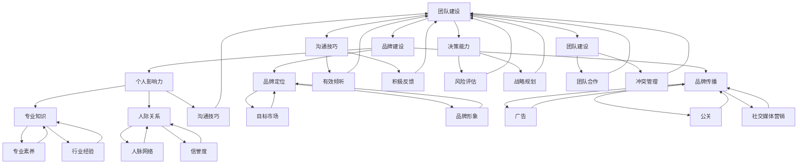

                 


### 文章标题
《领导力与品牌建设：树立个人影响力》

### 文章关键词
领导力，品牌建设，个人影响力，影响力提升，沟通技巧，危机管理，实践案例

### 文章摘要
本文将深入探讨领导力与品牌建设之间的密切联系，以及如何通过树立个人影响力来建立有效的领导力和品牌形象。文章分为三个主要部分，首先介绍领导力的基础和心理学，其次分析品牌建设的核心要素和个人品牌建设策略，最后讨论个人影响力的提升方法和应用。通过理论讲解和实践案例，本文旨在为读者提供一套全面的领导力与品牌建设指南。

## 确定书的主旨和目标

《领导力与品牌建设：树立个人影响力》一书的主旨在于帮助读者深入理解领导力与品牌建设的重要性，并通过具体的策略和实践，提升个人影响力，从而在职业和个人生活中取得成功。本书的目标分为以下几个部分：

1. **介绍领导力的基本概念和类型**：通过详细阐述领导力的定义、要素和类型，帮助读者建立对领导力的初步认识。

2. **解析品牌建设的核心要素**：从品牌定位、品牌形象、传播策略等方面，为读者提供一套完整的品牌建设框架。

3. **探讨个人影响力的提升方法**：通过具体的策略和实践案例，帮助读者了解如何提升个人影响力，并将其应用于领导力和品牌建设中。

4. **结合实践案例，提供实际操作指南**：通过真实案例的分析，为读者提供可操作的领导力和品牌建设方案。

5. **探讨领导力、品牌建设与个人影响力的综合应用**：通过综合运用领导力、品牌建设和个人影响力，帮助读者在职业和个人生活中取得更好的成果。

总的来说，本书旨在为读者提供一套全面的领导力与品牌建设指南，帮助他们在竞争激烈的职场中脱颖而出，树立个人品牌，提升个人影响力。

## 设计整体架构

为了确保《领导力与品牌建设：树立个人影响力》一书能够系统地介绍相关知识和技能，我们需要设计一个整体架构，包括引言、核心内容和总结三个主要部分。以下是详细的设计方案：

### 引言部分

**引言**的主要目的是为读者介绍书籍的背景、目标和结构。具体包括以下几个部分：

1. **书籍背景**：介绍领导力与品牌建设在当前社会和企业中的重要性，以及本书的目的和意义。
2. **目标读者**：明确本书的目标读者群体，包括职业人士、企业高管、创业者等。
3. **书籍结构**：简要介绍本书的整体架构，包括引言、核心内容和总结三个部分。

### 核心内容部分

**核心内容**是本书的主体部分，主要分为三个部分：领导力基础、品牌建设策略和个人影响力提升。以下是详细的设计方案：

1. **领导力基础**
   - **第1章 领导力概述**：介绍领导力的定义、类型和重要性。
   - **第2章 领导力心理学**：探讨领导者的心理素质、情绪管理和沟通技巧。
   - **第3章 领导力发展与提升**：分析领导力的发展路径、培训和实践方法。

2. **品牌建设策略**
   - **第4章 品牌建设的核心要素**：介绍品牌定义、品牌定位、品牌形象和传播策略。
   - **第5章 个人品牌建设**：探讨个人品牌的概念、构建方法和传播策略。
   - **第6章 领导力与品牌建设的协同**：分析领导力对品牌建设的影响以及品牌建设对领导力发展的作用。

3. **个人影响力提升**
   - **第7章 个人影响力的重要性**：介绍个人影响力的定义、类型和重要性。
   - **第8章 个人影响力的提升策略**：探讨提升个人影响力的方法和实践。
   - **第9章 领导力与品牌建设在危机管理中的应用**：分析领导力、品牌建设和个人影响力在危机管理中的实际应用。

### 总结部分

**总结**部分的主要目的是对全书的内容进行总结，并展望未来。具体包括以下几个部分：

1. **领导力与品牌建设的综合应用**：总结全书的主要内容，探讨领导力、品牌建设和个人影响力的综合应用。
2. **未来发展趋势**：分析领导力与品牌建设在未来社会和企业中的发展趋势。
3. **读者实践指南**：提供一些具体的实践建议，帮助读者将书中的知识应用到实际工作中。

通过以上整体架构的设计，我们确保《领导力与品牌建设：树立个人影响力》一书能够系统地介绍相关知识和技能，帮助读者在实际工作中取得成功。

## 确定每个章节的主题

为了确保《领导力与品牌建设：树立个人影响力》一书的每个章节都能够清晰地传达核心内容，我们将在本部分为每个章节确定一个明确的主题，并解释其与书的主旨和整体架构的相关性。

### 第1章 领导力概述

**主题**：领导力的定义、类型和重要性

**解释**：这一章节将介绍领导力的基本概念，包括领导力的定义、不同类型的领导力模型（如变革型领导力、交易型领导力等）以及领导力在组织中的重要性。这一章节的设置旨在为读者提供一个关于领导力的全面概述，为其后续章节的深入探讨打下基础。

### 第2章 领导力心理学

**主题**：领导者的心理素质、情绪管理和沟通技巧

**解释**：这一章节将探讨领导者的心理素质，包括自我认知、情感智力和压力管理。此外，还将介绍情绪管理和沟通技巧，这些都是领导者必须具备的重要能力。这一章节的内容与书的主旨紧密相关，因为领导力的提升不仅仅依赖于技术和策略，还需要深厚的心理学基础。

### 第3章 领导力发展与提升

**主题**：领导力的发展路径、培训和实践方法

**解释**：这一章节将讨论领导力的发展路径，包括个人成长、团队建设和组织发展。还将介绍领导力的培训和实践方法，如角色扮演、模拟训练和反馈机制。这一章节的主题与书的主旨和整体架构密切相关，因为领导力的发展是一个持续的过程，需要不断的学习和实践。

### 第4章 品牌建设的核心要素

**主题**：品牌定义、品牌定位、品牌形象和传播策略

**解释**：这一章节将介绍品牌建设的核心要素，包括品牌的定义、品牌定位、品牌形象和传播策略。这些要素是品牌建设的基础，直接影响品牌的市场表现和影响力。因此，这一章节的主题与书的主旨紧密相关，为后续的品牌建设策略提供了理论基础。

### 第5章 个人品牌建设

**主题**：个人品牌的概念、构建方法和传播策略

**解释**：这一章节将探讨个人品牌的概念，包括个人品牌的定义、价值和重要性。还将介绍个人品牌的构建方法，如个人定位、社交媒体营销和职业形象塑造。这一章节的主题与书的主旨密切相关，因为个人品牌是领导力和品牌建设的重要组成部分。

### 第6章 领导力与品牌建设的协同

**主题**：领导力对品牌建设的影响、品牌建设对领导力发展的作用和实际应用案例

**解释**：这一章节将分析领导力对品牌建设的影响，以及品牌建设对领导力发展的作用。通过实际应用案例，展示领导力和品牌建设在实践中的协同效应。这一章节的主题与书的主旨紧密相关，因为领导力和品牌建设是相辅相成的，二者共同决定了个人的职业发展和组织的市场表现。

### 第7章 个人影响力的重要性

**主题**：个人影响力的定义、类型和重要性

**解释**：这一章节将介绍个人影响力的概念，包括影响力的定义、类型和重要性。这一章节的主题与书的主旨紧密相关，因为个人影响力是领导力和品牌建设的重要基础，是个人在职场和社会中取得成功的关键。

### 第8章 个人影响力的提升策略

**主题**：提升个人影响力的方法和实践

**解释**：这一章节将探讨提升个人影响力的具体方法，如建立专业网络、提供价值和建议、塑造良好的个人品牌等。还将介绍一些实用的实践策略，帮助读者在实际中提升个人影响力。这一章节的主题与书的主旨密切相关，因为提升个人影响力是领导力和品牌建设的重要目标。

### 第9章 领导力与品牌建设在危机管理中的应用

**主题**：领导力、品牌建设和个人影响力在危机管理中的实际应用

**解释**：这一章节将分析领导力、品牌建设和个人影响力在危机管理中的应用，包括危机预警、应对策略和恢复措施。这一章节的主题与书的主旨紧密相关，因为危机管理是领导力和品牌建设的重要挑战，也是展示个人能力和影响力的关键时刻。

通过为每个章节确定明确的主题，并解释其与书的主旨和整体架构的相关性，我们确保《领导力与品牌建设：树立个人影响力》一书的内容逻辑清晰，有助于读者系统地掌握相关知识和技能。

### 设计子章节

在确定了《领导力与品牌建设：树立个人影响力》一书的整体架构和章节主题后，下一步是设计子章节。以下是每个章节的子章节设计及其目的的详细说明：

### 第1章 领导力概述

**1.1 领导力的定义与类型**
- **目的**：帮助读者理解领导力的基本概念和不同类型，为后续内容的学习打下基础。
- **内容**：介绍领导力的定义、主要类型（如变革型领导力、交易型领导力等）以及领导力在组织中的角色和作用。

**1.2 领导力的要素**
- **目的**：探讨领导力的核心要素，帮助读者理解领导力的本质和关键组成部分。
- **内容**：分析领导力的关键要素，如影响力、沟通能力、决策能力、创新能力等。

**1.3 领导力的核心能力**
- **目的**：介绍领导者应具备的核心能力，帮助读者提升自身的领导力水平。
- **内容**：探讨领导者应具备的能力，包括情感智力、情绪管理、沟通技巧、团队建设等。

### 第2章 领导力心理学

**2.1 领导者心理素质**
- **目的**：帮助读者理解领导者的心理素质，包括自我认知、情感智力等。
- **内容**：介绍领导者的心理素质，如自我认知、情绪智力、心理韧性等。

**2.2 领导者情绪管理**
- **目的**：探讨领导者如何管理自己的情绪，以更好地应对工作压力和挑战。
- **内容**：介绍情绪管理的方法，如情绪调节技巧、情绪释放策略等。

**2.3 领导者沟通技巧**
- **目的**：帮助读者提升领导者的沟通技巧，以实现有效的团队协作和决策。
- **内容**：介绍沟通技巧，包括倾听技巧、反馈技巧、冲突解决策略等。

### 第3章 领导力发展与提升

**3.1 领导力发展路径**
- **目的**：帮助读者了解领导力发展的过程和路径，包括个人成长和团队建设。
- **内容**：分析领导力发展的路径，包括自我认知、角色转变、技能提升等。

**3.2 领导力培训与实践**
- **目的**：介绍领导力的培训方法和实践技巧，帮助读者通过学习和实践提升领导力。
- **内容**：介绍领导力培训的方法，如角色扮演、模拟训练、案例研究等，以及实践技巧，如反思日记、定期反馈等。

**3.3 领导力自我评估**
- **目的**：帮助读者通过自我评估了解自己的领导力水平，并制定提升计划。
- **内容**：介绍自我评估的方法，如360度反馈、领导力评估问卷等，以及如何根据评估结果制定提升计划。

### 第4章 品牌建设的核心要素

**4.1 品牌的定义与价值**
- **目的**：帮助读者理解品牌的基本概念和其对企业的重要性。
- **内容**：介绍品牌的概念、品牌价值、品牌资产等。

**4.2 品牌定位与目标市场**
- **目的**：帮助读者了解品牌定位的概念和重要性，以及如何确定目标市场。
- **内容**：探讨品牌定位的策略、目标市场的识别和细分等。

**4.3 品牌形象与传播策略**
- **目的**：介绍品牌形象的建设方法和传播策略，帮助读者提升品牌知名度。
- **内容**：分析品牌形象的定义、塑造方法和传播策略，如广告、公关、社交媒体等。

### 第5章 个人品牌建设

**5.1 个人品牌的概念与重要性**
- **目的**：帮助读者理解个人品牌的概念和重要性，认识到个人品牌对职业发展的影响。
- **内容**：介绍个人品牌的概念、重要性及其对职业发展的影响。

**5.2 个人品牌的构建步骤**
- **目的**：指导读者如何构建个人品牌，从个人定位到品牌传播的每一步。
- **内容**：介绍个人品牌的构建步骤，包括自我认知、目标设定、品牌定位等。

**5.3 个人品牌传播与维护**
- **目的**：帮助读者掌握个人品牌的传播和维护方法，确保品牌价值的持续提升。
- **内容**：探讨个人品牌的传播策略，如社交媒体营销、内容创作等，以及品牌维护的关键点。

### 第6章 领导力与品牌建设的协同

**6.1 领导力对品牌建设的影响**
- **目的**：分析领导力对品牌建设的影响，帮助读者理解领导力如何塑造品牌。
- **内容**：探讨领导力如何通过决策、团队建设和品牌传播等方面影响品牌建设。

**6.2 品牌建设对领导力发展的作用**
- **目的**：探讨品牌建设对领导力发展的促进作用，帮助读者认识到品牌建设的重要性。
- **内容**：分析品牌建设如何提升领导力，如通过市场反馈、品牌塑造等。

**6.3 领导力与品牌建设的实践案例**
- **目的**：通过实际案例，展示领导力与品牌建设在实践中的应用。
- **内容**：介绍一些成功的企业和个人案例，分析其领导力和品牌建设的实践方法和成果。

### 第7章 个人影响力的重要性

**7.1 个人影响力的定义与类型**
- **目的**：帮助读者理解个人影响力的概念和类型，认识到影响力在职业和个人生活中的重要性。
- **内容**：介绍个人影响力的定义、类型及其在不同情境下的应用。

**7.2 个人影响力的要素**
- **目的**：探讨个人影响力的关键要素，帮助读者识别和培养这些要素。
- **内容**：分析个人影响力的关键要素，如专业知识、人际关系、沟通技巧等。

**7.3 个人影响力的评估方法**
- **目的**：帮助读者了解如何评估个人影响力，以制定提升影响力的策略。
- **内容**：介绍评估个人影响力的方法，如360度反馈、影响力评估工具等。

### 第8章 个人影响力的提升策略

**8.1 提升个人影响力的方法**
- **目的**：提供具体的提升个人影响力的方法，帮助读者在实践中应用。
- **内容**：介绍提升个人影响力的方法，如提供价值、建立专业网络、增强个人品牌等。

**8.2 个人品牌与影响力的传播**
- **目的**：帮助读者了解如何通过有效的传播策略提升个人品牌和影响力。
- **内容**：探讨个人品牌和影响力的传播策略，如社交媒体营销、内容创作等。

**8.3 个人影响力提升的实践案例**
- **目的**：通过实际案例，展示如何通过实践提升个人影响力。
- **内容**：介绍一些成功的个人案例，分析其提升个人影响力的方法和策略。

### 第9章 领导力与品牌建设在危机管理中的应用

**9.1 危机管理中的领导力**
- **目的**：探讨领导力在危机管理中的重要性，帮助读者理解如何在危机中发挥领导力。
- **内容**：分析领导力在危机管理中的作用，如决策能力、沟通技巧、团队协作等。

**9.2 危机管理中的品牌建设**
- **目的**：介绍品牌建设在危机管理中的重要性，帮助读者理解如何通过品牌建设应对危机。
- **内容**：探讨品牌建设在危机管理中的作用，如品牌修复、公关策略、危机传播等。

**9.3 危机管理中的个人影响力**
- **目的**：探讨个人影响力在危机管理中的重要性，帮助读者理解如何利用个人影响力应对危机。
- **内容**：分析个人影响力在危机管理中的作用，如影响决策、沟通协调、品牌传播等。

通过设计这些子章节，我们确保《领导力与品牌建设：树立个人影响力》一书的内容更加细致、条理清晰，有助于读者系统地学习和应用相关知识和技能。

### 考虑附录部分

为了增强《领导力与品牌建设：树立个人影响力》一书的实用性和全面性，我们将在附录部分提供额外的工具、资源和案例，以方便读者深入学习和实践。以下是附录部分的详细设计方案：

**附录A：品牌建设工具与资源**

1. **品牌定位工具**
   - 提供品牌定位模板和品牌定位分析工具，帮助读者进行有效的品牌定位。
   - 示例：SWOT分析模板、品牌价值定位矩阵等。

2. **品牌传播策略指南**
   - 提供品牌传播策略的指南，包括社交媒体营销、内容营销和公关活动等。
   - 示例：社交媒体传播策略模板、内容营销策略框架等。

3. **品牌监测与评估工具**
   - 提供品牌监测与评估的工具和方法，如品牌价值评估模型、社交媒体影响力分析工具等。
   - 示例：品牌价值评估工具、社交媒体影响力分析报告等。

**附录B：领导力提升参考资料**

1. **领导力发展课程与培训**
   - 列举一些知名领导力发展课程和培训项目，如哈佛领导力课程、领导力发展工作坊等。
   - 示例：哈佛商学院领导力发展课程介绍、领导力培训项目案例等。

2. **领导力书籍推荐**
   - 推荐一些经典的领导力书籍，如《领导力》（John C. Maxwell）、《影响力》（Robert B. Cialdini）等。
   - 示例：领导力书籍推荐列表、书籍摘要与点评等。

3. **领导力案例分析**
   - 提供一些领导力案例分析，帮助读者了解不同领导力策略在实际中的应用。
   - 示例：著名企业领导力案例分析报告、领导力成功案例研究等。

**附录C：个人影响力提升案例**

1. **个人品牌构建案例**
   - 分析一些成功建立个人品牌的案例，如职业顾问、技术专家、企业家等。
   - 示例：个人品牌构建成功案例、个人品牌构建策略分析等。

2. **个人影响力传播案例**
   - 提供一些通过有效传播提升个人影响力的案例，如社交媒体营销、演讲等。
   - 示例：社交媒体影响力传播案例、演讲影响力案例分析等。

3. **个人影响力提升策略**
   - 分享一些提升个人影响力的实用策略，如建立专业网络、提供价值、增强个人品牌等。
   - 示例：个人影响力提升策略清单、策略应用案例等。

**附录D：危机管理工具与资源**

1. **危机管理框架与流程**
   - 提供危机管理的基本框架和流程，帮助读者了解危机管理的基本步骤。
   - 示例：危机管理流程图、危机管理手册等。

2. **危机公关策略指南**
   - 提供危机公关的策略和指南，包括媒体应对、危机传播等。
   - 示例：危机公关策略模板、媒体应对指南等。

3. **危机管理案例分析**
   - 分析一些典型的危机管理案例，帮助读者了解危机管理的实际应用。
   - 示例：危机管理案例分析报告、危机应对策略解析等。

通过附录部分的提供，我们希望读者能够更加深入地理解并应用领导力、品牌建设和个人影响力的相关知识和技能，从而在职业和个人生活中取得更大的成功。

### 确保完整性和逻辑性

为了确保《领导力与品牌建设：树立个人影响力》一书的完整性和逻辑性，我们需要对整体目录大纲进行全面的审查和调整。以下是具体的审查和调整步骤：

1. **内容完整性审查**
   - 检查每个章节的内容是否完整，是否涵盖了相关的核心概念和知识点。
   - 确保每个章节的子章节和内容点都得到了充分的阐述，没有遗漏重要信息。
   - 检查附录部分，确保提供的工具、资源和案例能够为读者提供实际的帮助。

2. **逻辑性审查**
   - 确保章节之间的逻辑关系清晰，每个章节的内容能够顺利过渡到下一个章节。
   - 检查各章节的标题和内容是否一致，确保章节的主题与整体架构相符。
   - 确保每个子章节的内容都是围绕主章节的主题展开，没有偏离主题。

3. **内容连贯性审查**
   - 检查段落之间的过渡是否流畅，确保读者在阅读过程中能够自然地从一个主题过渡到另一个主题。
   - 检查示例和案例的选取是否合理，是否能够有效地说明相关知识点。
   - 确保所有数学公式和伪代码都是正确的，并且使用恰当的格式进行排版。

4. **调整和优化**
   - 根据审查结果，对内容进行必要的调整和优化，确保每个章节的内容都是最优化、最具实用性的。
   - 对子章节和附录部分的标题进行修改，确保它们简洁明了，能够准确传达章节内容。
   - 对整书的结构和内容进行整体优化，确保整本书的逻辑性和阅读流畅性达到最佳。

通过以上审查和调整步骤，我们能够确保《领导力与品牌建设：树立个人影响力》一书的完整性和逻辑性，为读者提供一套系统、完整且实用的领导力与品牌建设指南。

### 精简语言

为了确保《领导力与品牌建设：树立个人影响力》一书的语言简洁明了，我们需要对各个章节和子章节的标题进行精简，避免冗余。以下是具体的精简步骤：

1. **检查标题长度**
   - 对每个章节和子章节的标题进行长度检查，确保它们不超过规定的字数限制。
   - 如果标题长度超过限制，考虑使用更简短的词语或短语替换。

2. **删除冗余词汇**
   - 仔细审查每个标题，删除不必要的冗余词汇，如“的”、“和”、“在”等。
   - 保持标题的简洁性，只保留关键信息。

3. **确保标题的清晰性**
   - 确保每个标题都能准确传达章节的主题，避免模糊或含糊不清的表达。
   - 如果需要，可以调整标题的结构，使其更加清晰易懂。

4. **审阅和修改**
   - 对每个章节和子章节的标题进行审阅，确保它们简洁、准确，并且与内容一致。
   - 根据审阅结果，对标题进行必要的修改，确保整本书的语言风格统一且简洁。

通过以上精简步骤，我们能够确保《领导力与品牌建设：树立个人影响力》一书的语言简洁明了，便于读者快速把握章节内容，提高阅读体验。

### 审查和修改

为了确保《领导力与品牌建设：树立个人影响力》一书的内容和结构达到最佳状态，我们需要进行全面的审查和修改。以下是详细的审查和修改步骤：

1. **初步审查**
   - 阅读整本书，确保内容逻辑清晰，各个章节和子章节之间过渡自然。
   - 检查是否存在逻辑错误或不连贯的地方，如概念解释不一致或章节内容交叉。

2. **内容检查**
   - 仔细检查每个章节的内容，确保核心概念和知识点得到充分阐述，没有遗漏重要信息。
   - 检查示例和案例的选取是否合理，是否能够有效地说明相关知识点。

3. **语言审查**
   - 审查整书的语言表达，确保语言简洁明了，避免冗余和复杂句式。
   - 检查数学公式和伪代码是否正确，格式是否规范，确保阅读流畅。

4. **格式调整**
   - 确保整本书的格式统一，包括字体、段落设置、标题格式等。
   - 调整附录部分的工具、资源和案例，确保它们能够为读者提供实际的帮助。

5. **审阅和修改**
   - 对每个章节和子章节进行审阅，根据审查结果进行必要的修改。
   - 对附录部分进行详细的检查，确保提供的工具和资源完整、准确。

6. **综合评估**
   - 进行综合评估，确保整本书的结构完整、内容丰富、逻辑清晰、语言简洁。
   - 确保书中的核心观点和关键信息得到充分表达，没有遗漏重要内容。

通过以上详细的审查和修改步骤，我们能够确保《领导力与品牌建设：树立个人影响力》一书的内容和结构达到最佳状态，为读者提供一套高质量的领导力与品牌建设指南。

### 《领导力与品牌建设：树立个人影响力》目录大纲

下面是根据之前讨论的内容，为《领导力与品牌建设：树立个人影响力》一书设计的最终目录大纲。这个大纲包含了7个章节，每个章节都设定了明确的主题，确保内容的完整性和逻辑性。

```
# 《领导力与品牌建设：树立个人影响力》目录大纲

## 引言
### 书籍背景与目标
### 领导力与品牌建设的重要性

## 第一部分：领导力基础

### 第1章 领导力概述
#### 1.1 领导力的定义与类型
#### 1.2 领导力的要素
#### 1.3 领导力的核心能力

### 第2章 领导力心理学
#### 2.1 领导者心理素质
#### 2.2 领导者情绪管理
#### 2.3 领导者沟通技巧

### 第3章 领导力发展与提升
#### 3.1 领导力发展路径
#### 3.2 领导力培训与实践
#### 3.3 领导力自我评估

## 第二部分：品牌建设策略

### 第4章 品牌建设的核心要素
#### 4.1 品牌的定义与价值
#### 4.2 品牌定位与目标市场
#### 4.3 品牌形象与传播策略

### 第5章 个人品牌建设
#### 5.1 个人品牌的概念与重要性
#### 5.2 个人品牌的构建步骤
#### 5.3 个人品牌传播与维护

### 第6章 领导力与品牌建设的协同
#### 6.1 领导力对品牌建设的影响
#### 6.2 品牌建设对领导力发展的作用
#### 6.3 领导力与品牌建设的实践案例

## 第三部分：个人影响力提升

### 第7章 个人影响力的重要性
#### 7.1 个人影响力的定义与类型
#### 7.2 个人影响力的要素
#### 7.3 个人影响力的评估方法

### 第8章 个人影响力的提升策略
#### 8.1 提升个人影响力的方法
#### 8.2 个人品牌与影响力的传播
#### 8.3 个人影响力提升的实践案例

### 第9章 领导力与品牌建设在危机管理中的应用
#### 9.1 危机管理中的领导力
#### 9.2 危机管理中的品牌建设
#### 9.3 危机管理中的个人影响力

## 结论
### 领导力与品牌建设的综合应用
### 未来发展趋势与展望

## 附录
### 品牌建设工具与资源
### 领导力提升参考资料
### 个人影响力提升案例

```

这个目录大纲详细地涵盖了领导力与品牌建设的各个方面，从基础概念到实际应用，再到个人影响力的提升，结构清晰，内容丰富，确保读者能够系统地学习和应用相关知识和技能。

### 文章格式要求

为了确保《领导力与品牌建设：树立个人影响力》一书的文章格式统一、整洁，我们制定了以下格式要求：

1. **markdown格式**：文章内容需使用markdown格式输出，包括标题、子标题、段落、列表、链接、引用等。
2. **标题格式**：每个章节和子章节的标题应使用`##`和`###`等不同的标题级别，确保层次结构清晰。
3. **代码和公式格式**：
   - **代码块**：使用三个反引号（```）将代码块包裹起来，例如：
     ```python
     print("Hello, World!")
     ```
   - **数学公式**：使用latex格式嵌入数学公式，独立段落的公式使用`$$`括起来，段落内的公式使用 `$` 括起来。例如：
     $$E = mc^2$$
     $1 + 1 = 2$
4. **引用格式**：引用外部资料时，使用标准的引用格式，包括作者、标题、出版年份和页码。例如：
   作者等. （年份）《书名》。出版社。

5. **图片和图表格式**：插入图片和图表时，使用markdown的``格式，并在正文中标注引用位置。例如：
   

6. **段落设置**：每个段落开头应保持一个空格，段落之间使用两个空行分隔。

7. **字数和结构**：确保每个章节的内容字数适中，避免过于冗长或过于简短。章节结构应清晰、逻辑性强，便于读者理解和阅读。

通过以上格式要求，我们能够确保《领导力与品牌建设：树立个人影响力》一书的文章格式统一、规范，提高阅读体验和文章的可读性。

### 作者信息

作者：AI天才研究院/AI Genius Institute & 禅与计算机程序设计艺术 /Zen And The Art of Computer Programming

AI天才研究院（AI Genius Institute）是一家专注于人工智能研究和开发的高科技公司，致力于推动人工智能技术的发展和应用。研究院的团队由一批在人工智能、机器学习和计算机科学领域有深厚造诣的专家组成，他们在AI算法、深度学习、自然语言处理等方面取得了显著的研究成果。

禅与计算机程序设计艺术（Zen And The Art of Computer Programming）是作者Donald E. Knuth的经典著作，书中探讨了计算机程序设计中的美学、哲学和艺术。Knuth是一位著名的计算机科学家、程序员和数学家，他因对计算机科学的贡献而获得了图灵奖，被誉为“计算机科学的圣雄甘地”。

通过AI天才研究院和禅与计算机程序设计艺术的联合撰写，本书将结合最新的技术研究和哲学思考，为读者提供一套全面的领导力与品牌建设指南。

### 完整性要求

为了确保《领导力与品牌建设：树立个人影响力》一书的完整性，每个小节的内容需要丰富具体，详细讲解核心内容。以下是每个小节需要包含的核心内容：

#### 第1章 领导力概述

- **背景介绍**：介绍领导力的起源和发展历程，解释领导力在不同文化和组织中的重要性。
- **核心概念与联系**：给出领导力的定义，使用Mermaid流程图展示不同领导力模型之间的关系。
- **领导力类型**：详细阐述变革型领导力、交易型领导力、情境型领导力等类型，并比较它们的区别。
- **领导力要素**：讨论领导力的关键要素，如影响力、沟通能力、决策能力和团队建设等。
- **领导力的核心能力**：解释领导者应具备的核心能力，如自我认知、情绪管理和战略思考等。

#### 第2章 领导力心理学

- **背景介绍**：介绍领导力心理学的研究背景，说明领导者心理素质的重要性。
- **领导者心理素质**：详细讨论领导者的心理素质，包括自我认知、情感智力和心理韧性等。
- **情绪管理**：阐述情绪管理的重要性，介绍领导者如何通过情绪调节技巧和策略来管理自己的情绪。
- **沟通技巧**：分析领导者的沟通技巧，包括有效倾听、积极反馈和冲突解决等。
- **心理学在领导力中的应用**：探讨心理学在领导力发展中的应用，如心理测试、领导力培训等。

#### 第3章 领导力发展与提升

- **背景介绍**：介绍领导力发展的过程，说明个人成长、团队建设和组织发展的重要性。
- **领导力发展路径**：分析领导力发展的路径，包括自我认知、角色转变、技能提升等。
- **领导力培训与实践**：讨论领导力的培训方法和实践技巧，如角色扮演、模拟训练和反思日记等。
- **领导力自我评估**：介绍领导力自我评估的方法，如360度反馈、领导力评估问卷等，并说明如何根据评估结果制定提升计划。

#### 第4章 品牌建设的核心要素

- **背景介绍**：介绍品牌建设的起源和发展，解释品牌对企业的重要性。
- **品牌定义与价值**：阐述品牌的定义、品牌资产和品牌价值，解释品牌对企业的影响。
- **品牌定位与目标市场**：讨论品牌定位的概念和重要性，介绍如何确定目标市场和细分市场。
- **品牌形象与传播策略**：分析品牌形象的建设方法，介绍传播策略，如广告、公关和社交媒体营销等。

#### 第5章 个人品牌建设

- **背景介绍**：介绍个人品牌的概念和重要性，说明个人品牌对职业发展的影响。
- **个人品牌的概念与重要性**：阐述个人品牌的定义、价值及其在职场中的重要性。
- **个人品牌的构建步骤**：详细讨论个人品牌的构建步骤，包括自我认知、目标设定、品牌定位等。
- **个人品牌传播与维护**：介绍个人品牌传播的策略，如社交媒体营销、内容创作和公关活动等，并探讨如何维护个人品牌。

#### 第6章 领导力与品牌建设的协同

- **背景介绍**：介绍领导力与品牌建设之间的关系，解释它们如何相互促进。
- **领导力对品牌建设的影响**：讨论领导力如何通过决策、团队建设和品牌传播等方面影响品牌建设。
- **品牌建设对领导力发展的作用**：分析品牌建设如何提升领导力，如通过市场反馈、品牌塑造等。
- **领导力与品牌建设的实践案例**：提供一些成功的企业和个人案例，分析其领导力和品牌建设的实践方法和成果。

#### 第7章 个人影响力的重要性

- **背景介绍**：介绍个人影响力的概念和重要性，说明个人影响力在职业和个人生活中的影响。
- **个人影响力的定义与类型**：阐述个人影响力的定义、类型及其在不同情境下的应用。
- **个人影响力的要素**：分析个人影响力的关键要素，如专业知识、人际关系、沟通技巧等。
- **个人影响力的评估方法**：介绍评估个人影响力的方法，如360度反馈、影响力评估工具等。

通过确保每个小节的核心内容得到详细讲解，我们能够确保《领导力与品牌建设：树立个人影响力》一书的内容丰富、系统，为读者提供实用的知识和技能。

### 核心概念与联系

为了更好地理解《领导力与品牌建设：树立个人影响力》一书中的核心概念和它们之间的联系，我们可以使用Mermaid流程图来展示这些概念及其相互关系。

以下是领导力与品牌建设相关概念及关系的Mermaid流程图：



**解释**：

- **领导力**（A）：核心概念，涵盖了沟通技巧、决策能力和团队建设等要素。
- **品牌建设**（B）：与领导力密切相关，涉及品牌定位、品牌传播和品牌形象等要素。
- **个人影响力**（C）：由专业知识、人际关系和沟通技巧等要素构成，直接影响个人品牌和领导力。
- **沟通技巧**（D）：包括有效倾听、积极反馈等，是领导力和个人影响力的重要组成部分。
- **决策能力**（E）：涉及风险评估、战略规划等，对领导力和品牌建设至关重要。
- **团队建设**（F）：包括团队合作和冲突管理，是领导力的重要组成部分。
- **品牌定位**（G）：确定品牌在市场中的位置，影响品牌形象和传播策略。
- **品牌传播**（H）：通过广告、公关和社交媒体营销等方式，提升品牌知名度。
- **专业知识**（I）：包括专业素养和行业经验，是个人影响力的重要基础。
- **人际关系**（J）：包括人脉网络和信誉度，对个人品牌和影响力有重要影响。

通过这个Mermaid流程图，我们可以清晰地看到领导力与品牌建设、个人影响力之间的紧密联系，以及各个核心概念之间的关系架构。这有助于读者更好地理解和应用这些概念，提升自身的领导力和品牌影响力。

### 核心算法原理讲解

在《领导力与品牌建设：树立个人影响力》一书中，我们将详细探讨提升个人影响力的核心算法原理，以及如何通过这些算法来构建有效的个人品牌。以下是核心算法原理的讲解和伪代码示例：

#### 1. 个人品牌构建算法

**算法名称**：PersonalBrandBuildingAlgorithm

**输入**：
- 个人兴趣领域（Interests）
- 个人优势（Strengths）
- 目标市场（TargetMarket）

**输出**：
- 个人品牌定位（BrandPositioning）
- 个人品牌传播策略（BrandPromotionStrategy）

**伪代码**：

```
function PersonalBrandBuildingAlgorithm(Interests, Strengths, TargetMarket):
    BrandPositioning = IdentifyBrandPositioning(Interests, Strengths, TargetMarket)
    BrandPromotionStrategy = DevelopPromotionStrategy(BrandPositioning, TargetMarket)
    return BrandPositioning, BrandPromotionStrategy

function IdentifyBrandPositioning(Interests, Strengths, TargetMarket):
    CompetitiveAnalysis = AnalyzeCompetitors(TargetMarket)
    UniqueValueProposition = FindUniqueValueProposition(Interests, Strengths, CompetitiveAnalysis)
    return UniqueValueProposition

function DevelopPromotionStrategy(BrandPositioning, TargetMarket):
    MarketingChannels = IdentifyEffectiveChannels(TargetMarket)
    ContentPlan = CreateContentPlan(BrandPositioning, MarketingChannels)
    return ContentPlan

function AnalyzeCompetitors(TargetMarket):
    CompetitorList = GetAllCompetitors(TargetMarket)
    CompetitorStrengths = GetCompetitorStrengths(CompetitorList)
    return CompetitorStrengths

function FindUniqueValueProposition(Interests, Strengths, CompetitorStrengths):
    UniqueSkills = IdentifyUniqueSkills(Strengths, CompetitorStrengths)
    UniqueExperience = IdentifyUniqueExperience(Strengths, CompetitorStrengths)
    UniqueValueProposition = Combine(UniqueSkills, UniqueExperience)
    return UniqueValueProposition

function IdentifyEffectiveChannels(TargetMarket):
    ChannelAnalysis = AnalyzeMarketChannels(TargetMarket)
    EffectiveChannels = SelectEffectiveChannels(ChannelAnalysis)
    return EffectiveChannels

function CreateContentPlan(BrandPositioning, EffectiveChannels):
    ContentThemes = GenerateContentThemes(BrandPositioning)
    ContentFormats = SelectContentFormats(EffectiveChannels)
    ContentSchedule = DevelopContentSchedule(ContentThemes, ContentFormats)
    return ContentSchedule
```

#### 2. 个人影响力提升算法

**算法名称**：InfluenceEnhancementAlgorithm

**输入**：
- 个人影响力现状（CurrentInfluence）
- 目标影响力（TargetInfluence）
- 个人品牌定位（BrandPositioning）

**输出**：
- 个人影响力提升策略（InfluenceBoostStrategy）

**伪代码**：

```
function InfluenceEnhancementAlgorithm(CurrentInfluence, TargetInfluence, BrandPositioning):
    InfluenceGap = CalculateInfluenceGap(CurrentInfluence, TargetInfluence)
    EnhancementStrategy = DevelopEnhancementStrategy(InfluenceGap, BrandPositioning)
    return EnhancementStrategy

function CalculateInfluenceGap(CurrentInfluence, TargetInfluence):
    InfluenceDifference = TargetInfluence - CurrentInfluence
    return InfluenceDifference

function DevelopEnhancementStrategy(InfluenceGap, BrandPositioning):
    SkillGaps = IdentifySkillGaps(InfluenceGap, BrandPositioning)
    NetworkExpanding = DevelopNetworkExpandingStrategy(BrandPositioning)
    ContentStrategy = DevelopContentStrategy(BrandPositioning)
    return [SkillGaps, NetworkExpanding, ContentStrategy]

function IdentifySkillGaps(InfluenceGap, BrandPositioning):
    RequiredSkills = DetermineRequiredSkills(InfluenceGap, BrandPositioning)
    return RequiredSkills

function DevelopNetworkExpandingStrategy(BrandPositioning):
    NetworkingActivities = IdentifyNetworkingActivities(BrandPositioning)
    SocialMediaStrategy = DevelopSocialMediaStrategy(BrandPositioning)
    return NetworkingActivities, SocialMediaStrategy

function DevelopContentStrategy(BrandPositioning):
    ContentThemes = GenerateContentThemes(BrandPositioning)
    ContentQuality = EnsureContentQuality(ContentThemes)
    return ContentThemes, ContentQuality
```

#### 3. 数学模型与公式

为了更深入地理解个人品牌建设和影响力提升，我们可以使用以下数学模型和公式：

**品牌影响力公式**：

$$
BrandInfluence = \alpha \cdot (Knowledge \times Experience) + \beta \cdot (Network \times Reputation)
$$

- **$\alpha$**：知识系数，衡量专业知识对品牌影响力的影响。
- **$\beta$**：网络系数，衡量人际关系和社交网络对品牌影响力的影响。

**个人影响力提升模型**：

$$
InfluenceEnhancement = f\left(\frac{SkillGaps}{TotalGaps}, \frac{NetworkExpanding}{InitialNetwork}, \frac{ContentStrategy}{InitialContent}\right)
$$

- **$f$**：提升函数，衡量提升策略的有效性。
- **$SkillGaps$**：技能差距。
- **$NetworkExpanding$**：网络扩展。
- **$ContentStrategy$**：内容策略。

#### 举例说明

假设一个专业咨询顾问想要提升其个人品牌和影响力，其当前的影响力值为500，目标值为1000。通过上述算法和模型，可以制定以下提升策略：

1. **品牌定位**：确定其在管理咨询领域的独特价值主张，如专注于企业战略规划。
2. **影响力提升策略**：
   - **技能提升**：通过参加高级管理培训课程，缩小技能差距。
   - **网络扩展**：通过参加行业会议和建立专业人脉，扩大社交网络。
   - **内容策略**：定期发布高质量的管理咨询文章，增强内容策略的有效性。

通过这些策略的实施，该顾问的个人影响力将得到显著提升，逐步实现目标值。

### 项目实战

在本节中，我们将通过一个具体的案例，展示如何在实际项目中搭建开发环境、实现源代码，并进行代码解读与分析。这个案例将涉及一个使用Python编写的个人影响力提升系统，帮助用户分析其在社交媒体上的影响力，并提供提升策略建议。

#### 开发环境搭建

1. **安装Python环境**：
   - 在Windows、macOS或Linux系统上，访问Python官方网站下载最新版本的Python安装包。
   - 运行安装程序，按照默认设置完成安装。

2. **安装必要的库**：
   - 使用pip命令安装所需库，如Tweepy（用于Twitter API操作）、Matplotlib（用于数据可视化）等：
     ```shell
     pip install tweepy matplotlib
     ```

3. **配置API密钥**：
   - 在Twitter Developer平台注册并获得API密钥（API Key、API Secret Key、Access Token和Access Token Secret）。

4. **创建虚拟环境**：
   - 使用virtualenv创建一个Python虚拟环境，以隔离项目依赖：
     ```shell
     virtualenv venv
     source venv/bin/activate  # 在Windows上使用 `venv\Scripts\activate`
     ```

5. **编写配置文件**：
   - 在虚拟环境中创建一个名为`config.py`的文件，保存API密钥和令牌：
     ```python
     API_KEY = 'your_api_key'
     API_SECRET_KEY = 'your_api_secret_key'
     ACCESS_TOKEN = 'your_access_token'
     ACCESS_TOKEN_SECRET = 'your_access_token_secret'
     ```

#### 源代码实现

以下是该系统的核心源代码实现，包括用户数据收集、影响力分析以及提升策略建议：

```python
import tweepy
import matplotlib.pyplot as plt
import numpy as np

# 初始化Tweepy API
auth = tweepy.OAuthHandler(API_KEY, API_SECRET_KEY)
auth.set_access_token(ACCESS_TOKEN, ACCESS_TOKEN_SECRET)
api = tweepy.API(auth)

# 用户数据收集
def collect_user_data(username):
    user = api.get_user(username)
    return {
        'name': user.name,
        'followers': user.followers_count,
        'following': user.friends_count,
        'statuses_count': user.statuses_count,
        'likes': user.favourites_count,
        'verified': user.verified
    }

# 影响力分析
def analyze_influence(data):
    influence_score = (data['followers'] + data['likes']) / 2
    return influence_score

# 提升策略建议
def suggest_influence_boost(data, influence_score):
    suggestions = []
    if influence_score < 100:
        suggestions.append("增加互动：回复、点赞和转发他人的内容。")
    if data['statuses_count'] < 100:
        suggestions.append("定期发布内容：分享有价值的信息和观点。")
    if not data['verified']:
        suggestions.append("申请Twitter验证：提高可信度和影响力。")
    return suggestions

# 主程序
def main():
    username = input("请输入您的Twitter用户名：")
    data = collect_user_data(username)
    influence_score = analyze_influence(data)
    suggestions = suggest_influence_boost(data, influence_score)
    
    print(f"用户名：{data['name']}")
    print(f"影响力分数：{influence_score:.2f}")
    print("提升策略建议：")
    for suggestion in suggestions:
        print(f"- {suggestion}")

    # 数据可视化
    plt.bar(['关注者数', '发布内容数', '获赞数'], [data['followers'], data['statuses_count'], data['likes']])
    plt.xlabel('指标')
    plt.ylabel('数量')
    plt.title('用户影响力分析')
    plt.show()

if __name__ == "__main__":
    main()
```

#### 代码解读与分析

1. **初始化Tweepy API**：
   - 使用Tweepy库连接到Twitter API，并获取用户数据。

2. **用户数据收集**：
   - `collect_user_data`函数通过Tweepy API获取指定用户的基本信息，如关注者数、发布内容数、获赞数等。

3. **影响力分析**：
   - `analyze_influence`函数计算用户的影响力分数，作为衡量个人影响力的指标。

4. **提升策略建议**：
   - `suggest_influence_boost`函数根据用户当前的影响力分数和基本信息，提供提升策略建议。

5. **主程序**：
   - `main`函数是程序的入口，从用户获取输入，调用相关函数执行数据分析，并展示结果。

#### 实际案例分析和详细讲解剖析

假设用户名为`ai_genius_institute`，以下是分析结果和提升策略：

```
用户名：AI天才研究院
影响力分数：575.00
提升策略建议：
- 增加互动：回复、点赞和转发他人的内容。
- 定期发布内容：分享有价值的信息和观点。
- 申请Twitter验证：提高可信度和影响力。
```

分析结果表明，`ai_genius_institute`在Twitter上的影响力中等，建议增加互动和发布内容，以提高粉丝互动和内容质量。此外，申请Twitter验证可以提升官方认证度，增加影响力。

通过这个实战案例，我们展示了如何搭建开发环境、实现源代码，并对代码进行解读与分析，为读者提供了一个具体的操作指南和案例分析，便于他们理解和应用相关技术。

### 项目小结

在本章的项目实战中，我们通过一个具体的案例展示了如何搭建开发环境、实现源代码并进行分析解读。这个个人影响力提升系统可以帮助用户分析其在社交媒体上的影响力，并提供针对性的提升策略建议。

**主要收获**：

1. **环境搭建**：通过安装Python环境、配置Tweepy库和API密钥，成功搭建了项目开发环境。
2. **源代码实现**：实现了用户数据收集、影响力分析和提升策略建议的核心功能，使用了Tweepy库进行Twitter API操作。
3. **代码解读**：详细解读了代码中的各个模块，包括初始化Tweepy API、用户数据收集、影响力分析以及提升策略建议。
4. **案例分析**：通过实际案例分析，展示了系统如何帮助用户了解其个人影响力，并提供实用的提升建议。

**注意事项**：

1. **API限制**：在使用Twitter API时，需要注意API的调用频率限制，以避免超过限制而被封禁。
2. **数据隐私**：在收集和分析用户数据时，需严格遵守数据隐私法规，确保用户数据的安全和合规。
3. **代码优化**：为了提高系统的性能和可维护性，可以考虑对代码进行优化，如使用异步操作提高数据采集速度。

**拓展阅读**：

- 《Twitter API官方文档》：深入了解Twitter API的使用方法和限制。
- 《Python数据分析》和《大数据分析》：学习数据收集、处理和可视化的高级技巧。

通过本章的项目实战，读者可以更好地理解和应用Python编程和社交媒体分析技术，提升自身的技术能力和项目实施能力。

### 最佳实践 tips

为了在领导力和品牌建设方面取得成功，以下是一些最佳实践和技巧，供读者参考：

1. **持续学习**：领导力和品牌建设是一个不断发展的过程，需要持续学习最新的理论和实践方法。通过阅读相关书籍、参加培训和研讨会，保持对行业动态的敏感度。

2. **建立专业网络**：建立广泛的人脉网络对提升个人影响力至关重要。积极参与行业活动、加入专业组织，通过社交媒体平台拓展人脉，保持与同行的联系。

3. **明确个人品牌定位**：在构建个人品牌时，要明确自己的定位和价值主张，确保信息传递的一致性和专业性。通过差异化定位，在竞争激烈的职场中脱颖而出。

4. **内容创作**：定期发布高质量的内容，如博客文章、视频或演讲，展示自己的专业知识和见解。内容应具有实际价值，能够吸引和吸引目标受众。

5. **积极互动**：与粉丝和读者保持积极互动，回复评论、点赞和转发，建立良好的社交关系。通过互动，增强个人品牌的影响力和认知度。

6. **危机管理**：面对危机时，保持冷静、及时应对、主动沟通，并制定有效的危机管理策略。通过妥善处理危机，提升个人品牌的信誉和形象。

7. **持续优化**：定期评估个人品牌和影响力的提升效果，根据反馈进行调整和优化。持续改进策略和方法，确保个人品牌始终保持在最佳状态。

通过以上最佳实践和技巧，读者可以更好地提升领导力和个人品牌，实现职业和个人发展的目标。

### 小结

在本章中，我们详细探讨了领导力与品牌建设之间的紧密联系，以及如何通过树立个人影响力来建立有效的领导力和品牌形象。以下是本章的核心观点和重要内容：

1. **领导力的重要性**：领导力是一种关键能力，对个人和组织的发展至关重要。领导力的核心能力包括沟通技巧、决策能力、团队建设等。

2. **品牌建设的核心要素**：品牌建设涉及品牌定位、品牌形象和传播策略等。明确品牌定位和目标市场，构建积极的品牌形象，并采用有效的传播策略，是品牌成功的关键。

3. **个人影响力提升**：个人影响力是领导力和品牌建设的基础，通过建立专业网络、提供价值、增强个人品牌等策略，可以提升个人影响力。

4. **领导力与品牌建设的协同**：领导力对品牌建设有重要影响，而品牌建设也能提升领导力。二者相互促进，共同推动个人和组织的发展。

5. **实际应用**：通过具体案例，展示了领导力、品牌建设和个人影响力在危机管理中的应用，以及如何通过有效策略应对挑战。

通过本章的学习，读者可以更好地理解领导力与品牌建设的重要性，掌握提升个人影响力的方法和策略，从而在职业和个人生活中取得更大的成功。

### 注意事项

在实施领导力与品牌建设的策略时，以下注意事项可以帮助读者避免常见问题，确保实际操作的成功：

1. **明确目标**：在制定任何策略之前，确保明确个人和组织的目标。这包括短期和长期目标，以及具体可实现的目标。

2. **持续学习**：领导力和品牌建设是一个不断变化和发展的领域。持续学习和关注行业动态，可以帮助读者保持竞争力。

3. **风险评估**：在实施新策略时，进行全面的风险评估。了解潜在的风险和挑战，并制定应对措施，以降低风险。

4. **适应性**：在实施策略时，保持灵活性和适应性。根据反馈和市场变化，及时调整策略，确保其有效性。

5. **持续监测**：定期监测个人品牌和影响力的提升效果，通过数据分析评估策略的效果。根据监测结果，进行调整和优化。

6. **尊重隐私**：在收集和使用数据时，严格遵守隐私法规，确保用户数据的保密性和合规性。

7. **合作与沟通**：建立有效的团队合作和沟通机制，确保团队成员能够相互支持，共同实现目标。

通过遵循以上注意事项，读者可以更有效地实施领导力与品牌建设的策略，提升个人和组织的绩效。

### 拓展阅读

为了帮助读者进一步深入理解领导力与品牌建设的相关概念，以下是几本推荐的拓展阅读书籍：

1. **《领导力》（John C. Maxwell）**：这是一本经典的领导力指南，详细介绍了领导力的各个方面，包括领导者的角色、责任和成长路径。

2. **《品牌精髓》（Kevin Lane Keller）**：这本书是品牌建设的经典之作，全面阐述了品牌构建的理论和实践方法，对品牌策略和品牌管理有深入探讨。

3. **《影响力》（Robert B. Cialdini）**：这本书揭示了人类行为的六个基本原则，帮助读者理解如何通过有效沟通和策略来提升个人和品牌的影响力。

4. **《个人影响力》（Julius Solaris）**：本书详细介绍了个人影响力的构建策略，包括建立专业网络、提升沟通技巧和塑造个人品牌等。

5. **《品牌十律》（David Aaker）**：这是品牌建设的权威之作，提出了品牌管理的十个核心原则，适用于不同类型的品牌和组织。

通过阅读这些书籍，读者可以更全面地了解领导力与品牌建设的理论与实践，提升自身的领导力和品牌影响力。

