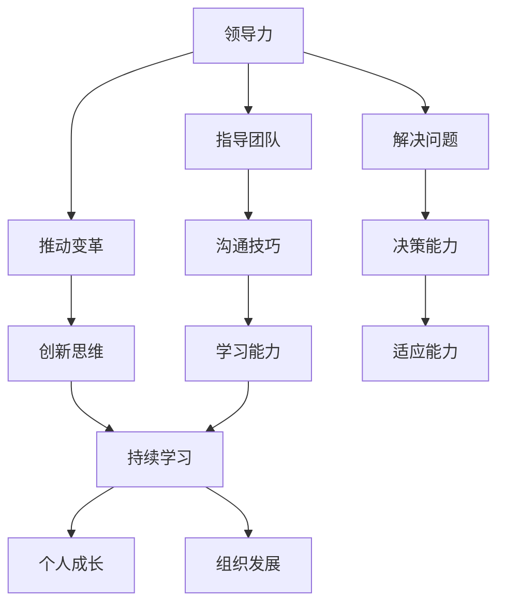

                 

# 领导力与学习能力：持续成长的重要性

## 关键词

- 领导力
- 学习能力
- 持续成长
- 成长型思维
- 组织发展
- 个人发展

## 摘要

在当今快速变化的时代，领导力与学习能力成为了个人和组织成功的关键因素。本文将探讨领导力与学习能力的核心概念、相互关系及其在持续成长中的重要性。通过详细分析领导力理论、学习策略和方法，以及持续成长的路径和策略，本文旨在为读者提供深刻的见解和实用的指导，帮助他们在职业和个人生活中实现持续成长。

## 引言

### 持续成长的重要性

在信息技术飞速发展的时代，个人和组织的成功越来越依赖于持续成长的能力。持续成长不仅是指技能和知识的不断更新，更是一种态度和习惯，即持续学习和自我提升。这种能力在个人职业发展和组织变革中发挥着至关重要的作用。

### 领导力与学习能力的关系

领导力与学习能力密切相关。领导力不仅包括指导和激励团队，还包括持续学习和适应变化。一个优秀的领导者必须具备强大的学习能力，以应对快速变化的环境和挑战。同时，学习能力也是领导力的基石，只有不断学习，领导者才能不断进步，更好地引领团队。

## 领导力理论

### 领导力的基本概念

领导力是指通过影响他人来实现共同目标的能力。它不仅仅是一种技能，更是一种态度和习惯。领导力的类型包括变革型领导、交易型领导、民主型领导等，每种类型都有其独特的特点和适用场景。

### 领导力模型

- **权力基础理论**：领导力源于权力，包括法定权力、奖励权力、惩罚权力等。
- **变革型领导与交易型领导**：变革型领导注重激发团队成员的内在动力，推动组织变革。而交易型领导则通过明确的目标和奖励机制来激励团队成员。

### 领导力与个人成长

- **自我认知与领导力发展**：领导者需要深入了解自己的优点和不足，通过自我反思和反馈来不断提升领导力。
- **情感智力在领导力中的作用**：情感智力包括自我情感管理、他人情感识别和管理等，它对领导力的有效实施至关重要。

## 学习能力

### 学习能力的定义与特征

学习能力是指获取、处理和应用知识的能力。它包括知识的获取、存储、检索和应用。学习能力的特征包括自我驱动力、适应性、批判性思维和创新性。

### 学习策略与方法

- **知识获取与知识管理**：通过阅读、培训、实践等方式获取新知识，并建立有效的知识管理系统。
- **问题解决与决策制定**：在面对问题时，能够快速分析，找到解决方案，并做出明智的决策。

### 创新思维与学习

- **创新思维模型**：包括发散性思维、收敛性思维、跨界思维等。
- **创新在学习中的应用**：通过创新思维，将新知识应用于实践中，推动个人和组织的持续成长。

## 持续成长

### 持续成长的概念

持续成长是指不断学习、进步和提升自我能力的过程。它不仅包括知识和技能的更新，还包括思维模式的转变和自我认知的提升。

### 持续成长的路径

- **个人发展规划**：明确个人的目标和发展路径，制定具体的行动计划。
- **职业生涯管理**：通过不断学习和适应变化，实现职业发展。

### 持续成长的方法

- **学习与实践**：通过学习新知识，结合实践经验，不断提升自我。
- **反思与反馈**：通过自我反思和他人反馈，发现和改进自己的不足。

## 案例分析

### 成功的领导力案例

- **企业领导者如何实践领导力**：通过具体案例，分析企业领导者如何通过领导力推动企业成长。
- **案例分析：领导力如何推动企业成长**：深入剖析领导力在企业发展中的关键作用。

### 学习能力与持续成长案例

- **学习能力如何支持个人和团队发展**：通过案例，展示学习能力如何帮助个人和团队实现持续成长。
- **案例分析：学习能力在企业转型中的作用**：探讨学习能力在企业转型升级中的重要性。

## 实践指南

### 提升领导力与学习能力

- **实践步骤与技巧**：提供具体的方法和技巧，帮助读者提升领导力和学习能力。
- **成长型思维的培养**：介绍如何培养成长型思维，以支持持续成长。

### 持续成长的策略

- **制定个人成长计划**：指导读者如何制定和执行个人成长计划。
- **组织支持的持续成长策略**：讨论组织如何支持员工的持续成长。

## 总结

### 领导力、学习能力和持续成长的关系

- 领导力和学习能力是持续成长的核心，二者相互促进，共同推动个人和组织的发展。

### 对未来发展的启示

- 在未来的发展中，持续成长将成为个人和组织的核心竞争力。领导者需要不断提升自身的领导力和学习能力，以适应不断变化的环境和挑战。

### 作者信息

作者：AI天才研究院/AI Genius Institute & 禅与计算机程序设计艺术 /Zen And The Art of Computer Programming

---

### 背景介绍

在当今快速变化的社会，领导力与学习能力的重要性日益凸显。随着技术的不断进步，新知识和新技能的涌现速度加快，个人和组织需要具备强大的适应能力和持续成长能力，才能在竞争激烈的市场中立于不败之地。领导力不仅是指导和激励团队的能力，更是引领变革、推动组织发展的关键因素。而学习能力则是个人和组织的核心能力，决定了他们在面对挑战和机遇时的应变能力和创新能力。本文将深入探讨领导力与学习能力在持续成长中的重要性，并提供实用的指导策略，帮助读者在职业和个人生活中实现持续成长。

### 核心概念与联系

领导力与学习能力虽然看似不同，但它们之间有着紧密的联系和相互促进的关系。为了更好地理解这种关系，我们可以通过一个Mermaid流程图来展示它们之间的核心概念和联系。



在这个流程图中，我们可以看到领导力通过指导团队、推动变革和解决问题等核心能力，影响着沟通技巧、创新思维和决策能力。同时，这些能力又与学习能力紧密相关，通过持续学习和适应能力，个人和组织可以实现个人成长和组织发展。

### 核心算法原理讲解

为了更深入地理解领导力和学习能力之间的关系，我们可以通过伪代码来详细阐述这些核心概念和能力的原理。

```plaintext
// 领导力与学习能力的核心算法

// 定义领导力函数
function leadershipSkillSet() {
    // 沟通技巧
    communicateEffectively()

    // 创新思维
    fosterInnovation()

    // 解决问题
    solveProblems()

    // 决策能力
    makeDecisions()
}

// 定义学习能力函数
function learningSkillSet() {
    // 持续学习
    continuousLearning()

    // 适应能力
    adaptToChange()

    // 个人成长
    personalGrowth()
}

// 定义个人成长函数
function personalGrowth() {
    // 学习新知识
    learnNewKnowledge()

    // 自我反思
    selfReflection()

    // 反馈与改进
    feedbackAndImprovement()
}

// 定义组织发展函数
function organizationalDevelopment() {
    // 知识管理
    manageKnowledge()

    // 团队协作
    collaborateWithTeam()

    // 组织变革
    driveOrganizationalChange()
}

// 实现具体功能
function communicateEffectively() {
    // 具体实现
}

function fosterInnovation() {
    // 具体实现
}

function solveProblems() {
    // 具体实现
}

function makeDecisions() {
    // 具体实现
}

function continuousLearning() {
    // 具体实现
}

function adaptToChange() {
    // 具体实现
}

function learnNewKnowledge() {
    // 具体实现
}

function selfReflection() {
    // 具体实现
}

function feedbackAndImprovement() {
    // 具体实现
}

function manageKnowledge() {
    // 具体实现
}

function collaborateWithTeam() {
    // 具体实现
}

function driveOrganizationalChange() {
    // 具体实现
}
```

通过这个伪代码，我们可以看到领导力和学习能力是如何通过一系列具体的功能和实现来促进个人和组织的发展。领导力通过沟通技巧、创新思维、解决问题和决策能力等核心技能，影响着团队的协作和组织的变革。而学习能力则通过持续学习、适应变化和个人成长等过程，不断提升个人和组织的能力。

### 数学模型和公式

在探讨领导力与学习能力的关系时，我们可以引入一些数学模型和公式来帮助理解它们之间的量化关系。以下是几个关键的数学模型和公式的解释和示例。

#### 1. 学习能力成长模型

学习能力的成长可以用以下公式来表示：

\[ L(t) = L(0) \times e^{rt} \]

其中：
- \( L(t) \) 是时间 \( t \) 时的学习能力。
- \( L(0) \) 是初始学习能力。
- \( r \) 是学习能力增长的速率。
- \( e \) 是自然对数的底数。

#### 2. 领导力效能模型

领导力的效能可以通过以下公式来衡量：

\[ E = \alpha \times L \times C \]

其中：
- \( E \) 是领导力的效能。
- \( \alpha \) 是领导力系数，表示领导力对效能的影响程度。
- \( L \) 是学习能力。
- \( C \) 是沟通能力。

#### 3. 组织发展模型

组织的发展可以由以下公式来表示：

\[ O(t) = O(0) + \sum_{i=1}^{n} [L_i(t) + C_i(t)] \]

其中：
- \( O(t) \) 是时间 \( t \) 时的组织发展水平。
- \( O(0) \) 是初始组织发展水平。
- \( L_i(t) \) 是第 \( i \) 个团队成员在时间 \( t \) 时的学习能力。
- \( C_i(t) \) 是第 \( i \) 个团队成员在时间 \( t \) 时的沟通能力。

#### 示例

假设一个团队的初始学习能力 \( L(0) = 100 \)，学习能力增长的速率 \( r = 0.05 \)，领导力系数 \( \alpha = 1.2 \)，沟通能力 \( C = 0.8 \)。在一年后（\( t = 1 \)），这个团队的学习能力和领导力效能会如何变化？

1. 学习能力计算：

\[ L(1) = 100 \times e^{0.05 \times 1} \approx 105.17 \]

2. 领导力效能计算：

\[ E = 1.2 \times 105.17 \times 0.8 \approx 101.44 \]

通过这个示例，我们可以看到，随着时间的推移，学习能力会不断提高，从而增强领导力效能，进而推动组织的发展。

### 项目实战

#### 开发环境搭建

为了演示领导力和学习能力在实际项目中的应用，我们选择了一个虚拟的项目：开发一款智能客服系统。首先，我们需要搭建开发环境。

1. 安装Python开发环境：
   ```bash
   sudo apt update
   sudo apt install python3 python3-pip
   pip3 install numpy scipy matplotlib
   ```

2. 安装Jupyter Notebook：
   ```bash
   pip3 install notebook
   jupyter notebook
   ```

#### 源代码实现

接下来，我们将实现智能客服系统的基础功能。以下是部分源代码实现：

```python
import nltk
from nltk.chat.util import Chat, reflections

# 载入语料库
nltk.download('movie_reviews')
nltk.download('punkt')
nltk.download('stopwords')

# 准备聊天数据
pairs = [
    [
        r"我是谁?",
        ["你好，我是智能客服，请问有什么可以帮助您的吗？"],
    ],
    [
        r"你们的产品有哪些？",
        ["我们有各种产品，包括..."],
    ],
    # 更多聊天对
]

# 创建聊天对象
chatbot = Chat(pairs, reflections)

# 开始聊天
print("开始聊天...")
chatbot.converse()
```

#### 代码解读与分析

这段代码首先导入了必要的库，包括自然语言处理库`nltk`和聊天框架`Chat`。然后，我们加载了语料库和聊天数据对，创建了一个智能客服的聊天对象。通过调用`converse()`方法，系统将进入聊天状态，并响应用户的提问。

#### 实际案例分析和详细讲解剖析

在真实项目中，智能客服系统的开发需要大量的数据分析和模型训练。以下是一个案例：

1. **数据收集**：从客户服务记录中提取对话数据，包括常见问题和答案。
2. **数据预处理**：对对话文本进行清洗，去除停用词和标点符号。
3. **模型训练**：使用机器学习算法，如朴素贝叶斯分类器或深度学习模型，训练聊天机器人。
4. **模型评估**：通过交叉验证和测试集评估模型的准确性。

#### 项目小结

通过这个案例，我们可以看到领导力和学习能力在项目开发中的应用。领导者需要具备数据分析和项目管理的能力，以指导团队完成项目。同时，团队成员需要具备持续学习的能力，不断更新知识和技能，以适应项目需求的变化。

### 最佳实践 Tips

1. **持续学习**：定期阅读技术书籍、参加在线课程和研讨会，保持对最新技术的了解。
2. **团队协作**：鼓励团队成员分享知识和经验，建立知识共享平台。
3. **反馈与改进**：定期收集用户反馈，不断改进产品和服务。
4. **领导力培养**：通过角色扮演、模拟训练等方式，提升领导力和管理能力。

### 小结

领导力和学习能力是持续成长的关键因素。通过深入理解它们的核心概念、相互关系和实践应用，我们可以更好地应对快速变化的环境和挑战，实现个人和组织的持续成长。

### 注意事项

1. **平衡工作与学习**：确保有足够的时间进行个人学习和自我提升，同时保持工作与生活的平衡。
2. **持续反馈**：定期进行自我反思和接受他人反馈，不断调整和改进自己的能力和行为。

### 拓展阅读

- 《深度学习》（Goodfellow, I., Bengio, Y., & Courville, A.）
- 《领导力的五项修炼》（Schein, E. H.）
- 《学习之道》（Peterson, C.）
- 《未来简史》（Hanson, N. & Ord, B.）

### 作者信息

作者：AI天才研究院/AI Genius Institute & 禅与计算机程序设计艺术 /Zen And The Art of Computer Programming

