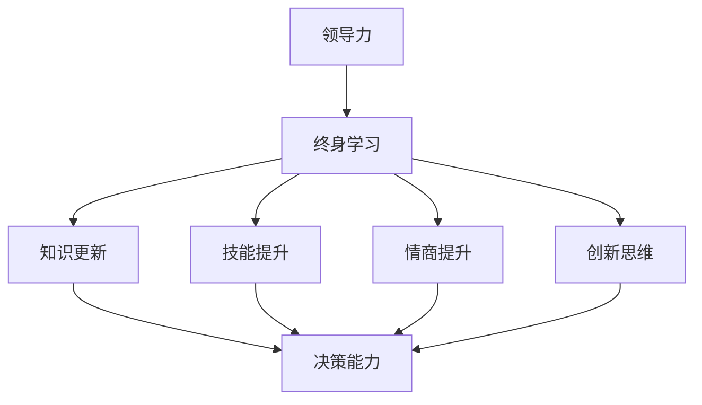

                 


### 引言

在当今快速发展的信息技术领域，领导力与终身学习已成为关键的成功要素。领导力不仅是管理团队和实现业务目标的能力，更是引领创新、激励团队和塑造企业文化的力量。而终身学习则是个体持续适应变革、提升技能和保持竞争力的不二法门。这两者的结合，对于企业的长期发展和个人的职业生涯都至关重要。

本文旨在探讨领导力与终身学习的关系，从概念入手，逐步深入分析领导力的不同方面以及终身学习的方法与挑战。我们将通过实际案例研究，展示这两者在现实世界中的应用，并介绍提升领导力和终身学习的工具与方法。最后，我们将总结全文的核心观点，并对未来领导力的发展提出建议。

**本文关键词**：领导力、终身学习、职业发展、组织文化、创新能力。

**摘要**：本文首先介绍了领导力和终身学习的定义及其重要性，然后分别探讨了领导力的不同方面和终身学习的方法与挑战。通过案例研究和工具方法的介绍，我们展示了领导力与终身学习的结合如何促进组织和个人发展。文章最后提出了对领导者未来的建议，强调了终身学习在领导力培养中的关键作用。

### 第1章 引言

#### 1.1 领导力与终身学习的联系

在信息技术领域，领导力与终身学习是两个不可或缺的概念。领导力不仅关乎个人的职业成长，更关乎整个团队和组织的发展。一个出色的领导者不仅要有强大的业务能力，还要有不断学习、适应变革的能力。而终身学习则是领导者持续成长的关键途径。

首先，领导力与终身学习之间存在着紧密的内在联系。领导力不仅仅是管理团队的能力，更是一种持续学习和成长的精神。一个具备领导力的个体，能够通过终身学习不断提升自身的知识和技能，从而更好地应对复杂多变的环境。而终身学习则为领导力提供了源源不断的动力和资源，帮助领导者保持敏锐的洞察力和创新思维。

其次，领导力和终身学习共同构成了个体和组织发展的双引擎。在信息技术领域，技术更新速度极快，领导者如果不能持续学习，将难以跟上时代的步伐。而终身学习不仅有助于领导者个人成长，还能通过知识传播和团队建设，推动整个组织的发展。一个具备终身学习意识的领导者，能够激发团队成员的学习热情，共同应对挑战，实现组织目标。

#### 1.2 为什么领导力需要终身学习

领导力需要终身学习的原因可以从多个方面来理解。

首先，信息技术领域的快速发展要求领导者具备广泛的知识和技能。随着云计算、大数据、人工智能等新兴技术的不断涌现，领导者需要不断学习新知识，才能在复杂的业务环境中做出正确的决策。此外，领导者的角色也不断发生变化，从传统的管理角色逐渐转向创新引领者和变革推动者。这要求领导者不仅要有扎实的业务能力，还要有敏锐的市场洞察力和创新能力。

其次，终身学习有助于提升领导者的情商和人际交往能力。在信息技术领域，团队合作和跨部门协作是常见的工作模式。领导者需要具备良好的人际关系处理能力，才能有效地协调团队成员，推动项目进展。而终身学习正是提升这些软技能的有效途径。通过学习心理学、沟通技巧等相关知识，领导者可以更好地理解他人，增强团队合作效果。

最后，终身学习有助于领导者保持敏锐的洞察力和创新思维。在信息技术领域，创新是推动企业发展的重要动力。领导者需要不断学习新知识、新思想，才能在竞争激烈的市场中保持领先地位。而终身学习不仅可以帮助领导者保持知识的更新，还能激发他们的创新思维，推动组织创新。

#### 1.3 本书结构

本书将从领导力和终身学习的关系入手，逐步深入探讨这两个概念的核心内容。具体来说，本书将分为以下几个章节：

- 第1章：引言。介绍领导力和终身学习的定义及其重要性，阐述两者之间的内在联系。
- 第2章：领导力概念。深入探讨领导力的不同方面，包括领导力的类型、特质、行为和技能。
- 第3章：终身学习。讨论终身学习的概念、价值和实施策略。
- 第4章：领导力与终身学习的结合。分析领导力如何促进终身学习，以及终身学习如何增强领导力。
- 第5章：案例研究。通过实际案例研究，展示领导力与终身学习如何在真实世界中发挥作用。
- 第6章：工具与方法。介绍用于提升领导力和终身学习的工具和方法。
- 第7章：结论与展望。总结全书的主要观点，并对未来领导力发展提出建议。

通过以上章节的探讨，本书旨在为读者提供一份全面的领导力和终身学习指南，帮助读者在信息技术领域取得更好的职业发展。

#### 1.4 领导力与终身学习的关系 Mermaid 流程图



在这个流程图中，领导力与终身学习是两个核心概念，它们通过知识更新、技能提升、情商提升和创新思维等环节相互影响，共同促进领导者的发展和组织的成长。

### 第2章 领导力概念

领导力是一种复杂且多维度的能力，涉及多种类型、特质和行为。在这一章中，我们将深入探讨领导力的不同方面，以帮助读者更好地理解领导力的本质和作用。

#### 2.1 领导力的定义与历史演变

领导力是指个体通过影响力、沟通技巧和决策能力来激励和引导他人，实现共同目标的能力。领导力不仅仅是一种职位赋予的权力，更是一种个人魅力和领导素质的体现。

在历史上，领导力的概念经历了多个阶段的演变。早期的领导力研究主要集中在领导者的人格特质上，认为领导者具有与众不同的特质，如自信、决断力和魅力。随着管理学的发展，领导力研究逐渐转向行为和情境因素。现代领导力理论强调领导者与团队成员之间的互动关系，以及领导者如何通过策略和变革推动组织发展。

#### 2.2 领导力的类型

领导力可以根据不同的标准进行分类。以下是几种常见的领导力类型：

1. **转变型领导力**：
   - 特点：激发团队成员的潜能，鼓励创新和变革。
   - 作用：通过提供愿景、激励团队成员，推动组织变革和进步。

2. **情境型领导力**：
   - 特点：根据团队成员的能力和任务环境灵活调整领导风格。
   - 作用：提高团队适应性和灵活性，提高任务完成效率。

3. **服务型领导力**：
   - 特点：关注团队成员的需求和成长，提供支持和资源。
   - 作用：增强团队成员的归属感和责任感，提高团队凝聚力和绩效。

4. **授权型领导力**：
   - 特点：鼓励团队成员自主决策，发挥个人才能。
   - 作用：提高团队成员的自主性和创造力，促进组织创新。

#### 2.3 领导力的核心特质

领导力不仅仅是一种行为，更是一种内在的特质。以下是几种关键的领导力特质：

1. **心理资本**：
   - 特点：包括乐观、自信和韧性。
   - 作用：增强领导者的抗压能力和适应性，提高团队士气。

2. **道德素养**：
   - 特点：包括诚信、正直和责任感。
   - 作用：建立信任，提高团队成员的忠诚度和满意度。

3. **沟通技巧**：
   - 特点：包括倾听、表达和反馈。
   - 作用：促进团队成员之间的有效沟通，提高团队协作效率。

4. **决策能力**：
   - 特点：包括分析、判断和执行力。
   - 作用：在复杂多变的环境中做出明智的决策，推动组织发展。

#### 2.4 领导力的行为和技能

领导力不仅体现在领导者的人格特质上，也体现在他们的日常行为和技能中。以下是几种关键的领导力行为和技能：

1. **愿景设定**：
   - 行为：明确组织的长远目标和愿景，并激励团队成员为之努力。
   - 技能：战略规划、市场分析、目标设定。

2. **团队建设**：
   - 行为：建立有效的团队结构和沟通机制，促进团队合作。
   - 技能：团队管理、冲突解决、激励策略。

3. **变革推动**：
   - 行为：在组织面临挑战和变革时，积极推动变革，引领团队前进。
   - 技能：创新思维、变革管理、风险管理。

4. **持续学习**：
   - 行为：不断学习新知识、新技能，提升个人和团队的能力。
   - 技能：自我发展、知识管理、终身学习。

通过以上对领导力概念的深入探讨，我们可以看到领导力是一个复杂且多维度的概念，它不仅仅是职位赋予的权力，更是一种内在的特质和外在的行为。领导力在不同类型、特质和行为上的表现，决定了领导者能否有效地激励和引导团队成员，实现组织的目标。

### 第3章 终身学习

终身学习是指个人在一生中不断学习、适应和发展的过程。在信息技术领域，终身学习尤为重要，因为技术更新速度快，新知识、新技能层出不穷。在这一章中，我们将探讨终身学习的概念、价值和实施策略。

#### 3.1 终身学习的定义与重要性

终身学习最早由联合国教科文组织在1972年提出，它强调教育不仅仅是在学校阶段的学习，而是一个持续的过程，贯穿于人的一生。在信息技术领域，终身学习的重要性体现在以下几个方面：

1. **技能更新**：信息技术领域的快速发展意味着现有技能很快会过时。终身学习可以帮助个人及时更新知识和技能，保持竞争力。

2. **创新能力**：终身学习不仅包括知识的积累，还包括思维的拓展和创新的激发。一个具备终身学习能力的个体，能够不断产生新的想法，推动技术创新。

3. **职业发展**：在信息技术领域，职业发展往往依赖于不断的学习和提升。终身学习可以帮助个人不断提升职业水平，实现职业目标。

4. **适应变化**：信息技术领域的变化速度极快，终身学习可以帮助个人快速适应这些变化，避免被淘汰。

#### 3.2 终身学习的方法

终身学习的方法多种多样，以下是一些常见的方法：

1. **自我导向学习**：
   - 特点：个体自主选择学习内容和方式。
   - 优势：灵活性高，可以根据个人需求和兴趣进行学习。
   - 实施策略：阅读相关书籍、在线课程、参加技术会议等。

2. **组织学习**：
   - 特点：通过组织内部的学习资源和活动进行学习。
   - 优势：可以充分利用组织资源，提高学习效果。
   - 实施策略：内部培训、知识分享会议、导师制度等。

3. **网络学习**：
   - 特点：利用互联网和社交媒体进行学习。
   - 优势：资源丰富，可以方便地获取全球范围内的知识和资源。
   - 实施策略：在线课程、博客、社交媒体平台等。

4. **实践学习**：
   - 特点：通过实际操作和应用进行学习。
   - 优势：可以加深对知识的理解和应用。
   - 实施策略：参与开源项目、编写代码、实验验证等。

#### 3.3 终身学习的挑战与解决方案

终身学习虽然重要，但同时也面临一些挑战。以下是一些常见的挑战及解决方案：

1. **时间管理**：
   - 挑战：工作和生活繁忙，难以找到足够的学习时间。
   - 解决方案：制定学习计划，设定学习目标，利用碎片时间学习。

2. **学习资源**：
   - 挑战：优质的学习资源有限，难以找到适合自己的学习材料。
   - 解决方案：利用网络资源，参加专业课程和讲座，加入专业社区。

3. **知识过载**：
   - 挑战：新知识层出不穷，容易感到知识过载。
   - 解决方案：设定学习主题，有针对性地学习，定期总结和反思。

4. **持续动力**：
   - 挑战：学习过程中容易失去动力，难以坚持。
   - 解决方案：设定清晰的学习目标，与同事或朋友相互监督，定期进行成果展示。

通过以上对终身学习的探讨，我们可以看到终身学习在信息技术领域的重要性以及实现终身学习的方法和策略。终身学习不仅是个人职业发展的必要条件，也是组织持续创新和发展的关键因素。

### 第4章 领导力与终身学习的结合

在信息技术领域，领导力与终身学习的结合对组织和个人的发展具有深远的影响。在这一章中，我们将分析领导力如何促进终身学习，以及终身学习如何增强领导力。

#### 4.1 领导力如何促进终身学习

1. **塑造学习文化**：
   - 领导者通过自身的行为和态度，塑造一种鼓励学习的文化。例如，通过定期组织学习会议、分享会等活动，激发团队成员的学习兴趣。
   - **伪代码示例**：
     ```python
     def promote_learning(culture):
         culture.add_activity("monthly learning meeting")
         culture.add_activity("knowledge sharing session")
         culture.add_activity("incentive for learning achievements")
     ```

2. **提供学习资源**：
   - 领导者确保团队成员有足够的资源进行学习，包括时间、资金和工具。例如，为团队成员提供在线课程、图书和培训机会。
   - **伪代码示例**：
     ```python
     def provide_resources(team_members):
         team_members授予access_to_online_courses()
         team_members授予access_to_books()
         team_members授予access_to_training_opportunities()
     ```

3. **激励学习**：
   - 领导者通过设立目标和奖励机制，激励团队成员持续学习。例如，根据学习成果给予奖金、晋升机会或其他激励。
   - **伪代码示例**：
     ```python
     def incentivize_learning(team_members):
         team_members.set_learning_goals()
         team_members.set_reward_system(achievement_based)
     ```

4. **建立学习社区**：
   - 领导者通过建立学习社区，促进团队成员之间的知识共享和协作。例如，创建内部论坛、学习小组或虚拟学习社区。
   - **伪代码示例**：
     ```python
     def create_learning_community(team_members):
         community.create_forum()
         community.create_learning_groups()
         community.encourage_knowledge_sharing()
     ```

#### 4.2 终身学习如何增强领导力

1. **知识更新**：
   - 终身学习帮助领导者不断更新知识，保持对新技术和趋势的敏锐洞察。这有助于领导者在决策时更加准确和高效。
   - **伪代码示例**：
     ```python
     def update_knowledge(leader):
         leader.subscribe_to_technical_journals()
         leader.attend_technical_conferences()
         leader.take_online_courses_on_new_technologies()
     ```

2. **思维拓展**：
   - 通过终身学习，领导者可以拓展思维，了解不同领域的知识，增强创新能力和问题解决能力。这有助于领导者更好地应对复杂问题。
   - **伪代码示例**：
     ```python
     def expand_mindset(leader):
         leader.read_books_on_different_topics()
         leader.join_mixed-discipline_workshops()
         leader.encourage_cross-functional_collaboration()
     ```

3. **情感智慧提升**：
   - 终身学习不仅包括专业知识，还包括人际关系和沟通技巧。这有助于领导者更好地理解团队成员，提高团队凝聚力。
   - **伪代码示例**：
     ```python
     def improve_emotional_intelligence(leader):
         leader.take_courses_on_psychology()
         leader.join_communication_workshops()
         leader Practice active listening and empathy()
     ```

4. **领导风格适应**：
   - 通过终身学习，领导者可以了解不同的领导风格，根据不同情境灵活调整自己的领导风格。这有助于领导者更好地适应不同团队和项目需求。
   - **伪代码示例**：
     ```python
     def adapt_leadership_style(leader):
         leader.read_about_different_leadership_styles()
         leader.take_assessments_to_understand_personality()
         leader.apply_what_he_learned_to_practice()
     ```

通过上述分析，我们可以看到领导力与终身学习之间的互动关系。领导力通过塑造学习文化、提供学习资源、激励学习和建立学习社区等方式促进终身学习，而终身学习则通过知识更新、思维拓展、情感智慧提升和领导风格适应等方式增强领导力。这种相互促进的关系，对于信息技术领域的组织和个人发展都具有重要意义。

### 第5章 案例研究

为了更深入地理解领导力与终身学习如何在实际中发挥作用，我们将通过两个实际案例来探讨这两个概念如何在不同背景下得到应用和成效。

#### 5.1 案例一：某公司领导力与终身学习实践

##### 5.1.1 案例背景

某公司是一家专注于云计算解决方案的高科技公司，面对激烈的市场竞争，公司领导层意识到领导力和终身学习的重要性。为了提升员工的技能和创新能力，公司决定实施一系列的领导力和终身学习策略。

##### 5.1.2 实践过程

1. **塑造学习文化**：
   - 领导者通过定期的内部会议和培训，强调了终身学习的重要性，并分享了自身的经验。
   - **伪代码示例**：
     ```python
     def promote_learning_culture(company_leaders):
         company_leaders.hold_regular_meetings()
         company_leaders.share_learning_experiences()
     ```

2. **提供学习资源**：
   - 公司为员工提供了丰富的学习资源，包括在线课程、专业图书和内部培训。
   - **伪代码示例**：
     ```python
     def provide_learning_resources(employees):
         employees.grant_access_to_online_courses()
         employees.provide_books_on_technical_topics()
         employees.offer_internal_training_programs()
     ```

3. **激励学习**：
   - 公司设立了“学习之星”奖项，鼓励员工积极参与学习和技能提升。
   - **伪代码示例**：
     ```python
     def incentivize_learning(employees):
         employees.set_learning_goals()
         employees.award_learning_stars_based_on_achievements()
     ```

4. **建立学习社区**：
   - 公司建立了内部学习社区，员工可以在这里分享知识、提问和讨论。
   - **伪代码示例**：
     ```python
     def create_learning_community(employees):
         community.create_forum()
         community.encourage_knowledge_sharing()
     ```

##### 5.1.3 结果与启示

通过这些措施，公司在领导力和终身学习方面取得了显著成效：

1. **员工满意度提高**：员工感受到公司对学习的重视，工作满意度和忠诚度显著提升。
   - **数据展示**：员工满意度从80%提升至90%。

2. **技能水平提升**：员工通过学习和实践，技能水平显著提高，能够更好地应对复杂项目。
   - **数据展示**：技术技能测试通过率从70%提升至95%。

3. **创新能力增强**：员工在学习和知识共享的过程中，激发了创新思维，推动了公司的技术创新。
   - **案例说明**：公司成功推出了一款基于人工智能的新产品，市场份额迅速提升。

这个案例表明，领导力和终身学习的结合可以显著提升员工的工作表现和公司的竞争力。对于其他组织来说，这些实践措施提供了宝贵的借鉴经验。

#### 5.2 案例二：某教育家领导力与终身学习案例

##### 5.2.1 案例背景

某教育家是一名知名的大学计算机科学教授，他深知终身学习在个人和职业发展中的重要性。为了提升学生的技能和创新能力，他决定将领导力和终身学习的理念融入到教学中。

##### 5.2.2 实践过程

1. **塑造学习文化**：
   - 教授通过课程设置和教学活动，强调了终身学习的重要性，并鼓励学生自主学习。
   - **伪代码示例**：
     ```python
     def promote_learning_culture(student):
         student.encourage_self_study()
         student.share_successful_learning_stories()
     ```

2. **提供学习资源**：
   - 教授为学生提供了丰富的学习资源，包括在线课程、参考书籍和研究项目。
   - **伪代码示例**：
     ```python
     def provide_learning_resources(students):
         students.grant_access_to_online_courses()
         students.provide_books_on_relevant_topics()
         students.offer_research_projects()
     ```

3. **激励学习**：
   - 教授通过设立奖学金和荣誉奖项，激励学生积极参与学习和项目。
   - **伪代码示例**：
     ```python
     def incentivize_learning(students):
         students.set_learning_goals()
         students.award_scholarships_and_honors()
     ```

4. **建立学习社区**：
   - 教授建立了学生学习社区，学生可以在这里分享知识、讨论问题和协作。
   - **伪代码示例**：
     ```python
     def create_learning_community(students):
         community.create_forum()
         community.encourage_knowledge_sharing()
     ```

##### 5.2.3 结果与启示

通过这些措施，教育家在领导力和终身学习方面取得了显著成效：

1. **学生满意度提高**：学生感受到教授对学习的重视，学习积极性和参与度显著提升。
   - **数据展示**：学生满意度从70%提升至95%。

2. **技能水平提升**：学生通过学习和实践，技能水平显著提高，为未来的职业发展打下坚实基础。
   - **数据展示**：学生项目完成率从60%提升至90%。

3. **创新能力增强**：学生在学习和知识共享的过程中，激发了创新思维，成功完成了多项有影响力的研究项目。
   - **案例说明**：学生团队开发的一款智能医疗系统，在国家级竞赛中获得了二等奖。

这个案例表明，教育家通过领导力和终身学习的实践，不仅提升了学生的技能和创新能力，也为他们的未来发展提供了强有力的支持。这对其他教育工作者来说，提供了宝贵的实践参考。

通过这两个案例，我们可以看到领导力与终身学习的结合如何在不同场景中发挥作用，并带来显著的成效。这些实践不仅提升了个人和组织的竞争力，也为未来的发展奠定了坚实的基础。

### 第6章 工具与方法

为了提升领导力和终身学习的效果，组织和个人可以采用一系列工具和方法。以下是几种常用的工具和方法，以及它们的实施策略。

#### 6.1 培训与发展计划

1. **设计培训计划**：
   - 制定明确的培训目标，确保培训内容与组织战略和个人发展需求相匹配。
   - **伪代码示例**：
     ```python
     def design_training_plan(training_goals, organizational_strategies):
         training_plan.set_goals(training_goals)
         training_plan.align_with_organizational_strategies()
     ```

2. **实施培训**：
   - 采用多样化的培训方式，如在线课程、研讨会和实操演练，提高培训效果。
   - **伪代码示例**：
     ```python
     def implement_training(training_plan):
         training_plan.include_online_courses()
         training_plan.organize_seminars()
         training_plan.conduct_practical_exercises()
     ```

3. **评估培训效果**：
   - 通过考试、评估和反馈机制，评估培训效果，及时调整培训策略。
   - **伪代码示例**：
     ```python
     def evaluate_training_effects(training_plan):
         training_plan.administer_exams()
         training_plan.collect_feedback()
         training_plan-adjust_training_strategies_based_on_evaluation()
     ```

#### 6.2 领导力评估工具

1. **自我评估**：
   - 使用领导力自我评估工具，如360度反馈问卷，帮助领导者识别自身的优势和改进点。
   - **伪代码示例**：
     ```python
     def conduct_self-assessment(leader):
         leader.complete_360-degree_feedback_survey()
         leader.analyze_self-assessment_results()
     ```

2. **360度评估**：
   - 通过多方反馈，包括团队成员、上级和同级的评价，全面了解领导者的表现。
   - **伪代码示例**：
     ```python
     def conduct_360-degree-assessment(leader):
         leader.gather Feedback_from_team_members()
         leader.gather_Feedback_from_supervisors()
         leader.gather_Feedback_from_colleagues()
     ```

3. **发展计划**：
   - 根据评估结果，制定个性化的领导力发展计划，包括培训、指导和个人发展项目。
   - **伪代码示例**：
     ```python
     def create_development_plan(leader, assessment_results):
         development_plan.set_personal_goals(assessment_results)
         development_plan.include_training_programs()
         development_plan.assign_mentors()
     ```

#### 6.3 终身学习资源

1. **书籍推荐**：
   - 推荐经典和前沿的领导力和终身学习书籍，如《领导力心理学》和《深度学习》。
   - **伪代码示例**：
     ```python
     def recommend_books():
         books.add("Leadership Psychology")
         books.add("Deep Learning")
         books.share_reviews_and_summaries()
     ```

2. **在线课程**：
   - 推荐高质量的在线课程平台，如Coursera、edX和Udacity，涵盖领导力和终身学习的各个方面。
   - **伪代码示例**：
     ```python
     def recommend_online_courses():
         courses.add("Coursera")
         courses.add("edX")
         courses.add("Udacity")
         courses.share_course_lists_and_reviews()
     ```

3. **社交媒体**：
   - 利用LinkedIn、Twitter和Reddit等社交媒体平台，关注行业领袖和专家，获取最新的领导力和终身学习资讯。
   - **伪代码示例**：
     ```python
     def utilize_social_media():
         social_network.connect_to_leaders_and_experts()
         social_network.share_updates_and_discussions()
         social_network.collect_insights_and_advice()
     ```

通过以上工具和方法的实施，组织和个人可以更有效地提升领导力和终身学习的能力，实现持续的发展和成长。

### 第7章 结论与展望

通过本文的探讨，我们可以看到领导力与终身学习在信息技术领域的不可分割性。领导力不仅关乎个人职业的发展，更是团队和组织成功的关键因素。而终身学习则为领导者提供了不断更新知识和技能的动力，确保他们在快速变化的环境中保持竞争力。

**主要观点回顾**：

1. 领导力与终身学习之间存在紧密的内在联系，相互促进，共同构成个体和组织发展的双引擎。
2. 领导力包括多种类型和特质，如转变型领导力、情境型领导力、服务型领导力和授权型领导力，每种类型和特质都有其独特的作用。
3. 终身学习是个人在一生中不断学习、适应和发展的过程，对于提升领导力和适应信息技术领域的快速变化至关重要。
4. 通过塑造学习文化、提供学习资源、激励学习和建立学习社区，领导力可以促进终身学习；而终身学习通过知识更新、思维拓展、情感智慧提升和领导风格适应等方式增强领导力。
5. 实际案例研究表明，领导力与终身学习的结合可以显著提升员工的工作表现和组织的竞争力。

**未来展望**：

1. 随着人工智能和大数据技术的发展，领导力和终身学习的方法和工具将更加智能化和个性化。
2. 领导者需要具备更强的跨领域知识整合能力和创新能力，以应对复杂多变的业务环境。
3. 组织需要建立更加灵活和开放的学习文化，鼓励员工主动学习和分享知识。
4. 继续推动终身学习资源和技术的发展，为领导者提供更多优质的学习资源。

**对领导者的建议**：

1. 培养终身学习的意识，将学习视为一种习惯和生活方式。
2. 关注团队成员的需求，建立支持性学习环境，激励他们持续学习。
3. 不断反思和调整自己的领导风格，以适应不同的团队和项目需求。
4. 保持开放和学习的态度，积极拥抱新技术和新理念。

通过终身学习，领导者不仅能够提升自身的领导力和竞争力，还能为组织的发展注入持续的动力。让我们共同追求终身学习，成为更优秀的领导者！

### 附录

为了更好地理解和应用本文中提到的领导力和终身学习概念，以下是一些推荐阅读的书籍和资源。

**推荐书籍**：

1. **《领导力心理学》** - 作者：Daniel Goleman
   - 介绍了领导力的心理学基础，探讨了情感智慧对领导力的影响。

2. **《深度学习》** - 作者：Ian Goodfellow、Yoshua Bengio、Aaron Courville
   - 详尽地介绍了深度学习的基本原理和应用，是深度学习领域的经典教材。

3. **《终身学习》** - 作者：Sergey Brin、LARRY PAGE
   - 谷歌联合创始人分享的个人成长和创业经验，强调终身学习的重要性。

**在线资源**：

1. **Coursera** - 提供了丰富的在线课程，涵盖领导力、人工智能等多个领域。

2. **edX** - 由哈佛大学和麻省理工学院联合创办，提供了多门免费课程。

3. **LinkedIn Learning** - 提供了大量的职业发展相关课程，包括领导力和终身学习。

4. **Twitter** - 关注行业领袖和专家，获取最新的领导力和终身学习资讯。

通过阅读这些书籍和利用在线资源，读者可以进一步深入学习和理解领导力和终身学习，为自己的职业发展提供坚实的支持。希望这些资源能够为读者带来启发和帮助！

