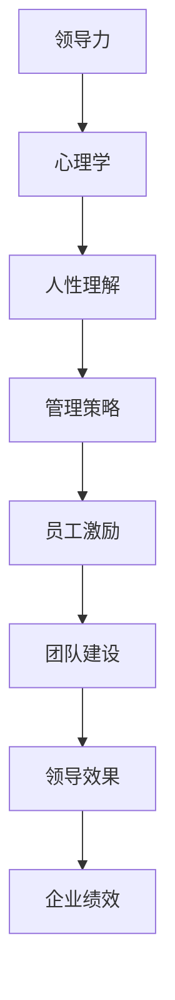

                 


### 引言

在现代企业管理中，领导力与心理学扮演着至关重要的角色。领导力不仅关系到企业的发展速度和方向，还直接影响到员工的工作效率、满意度和忠诚度。而心理学则提供了理解和管理人性的科学依据，使得管理者能够更有效地激励和引导团队。因此，如何将领导力与心理学相结合，打造一种具有人性化管理艺术的管理模式，成为企业管理者亟待解决的问题。

本文旨在探讨领导力与心理学的融合，通过分析两者的核心概念、联系以及实际应用，为读者提供一种系统化、科学化的管理思路。文章将分为三个主要部分：第一部分介绍领导力的心理学基础，包括领导力的定义与类型、心理学的基本概念以及领导力的心理学原理；第二部分讨论理解人性的管理策略，包括人性理解与管理、激励理论在管理中的应用以及团队管理与领导力；第三部分则通过实际案例，展示领导力与心理学在实际管理中的应用，并探讨其未来发展趋势。

在接下来的内容中，我们将一步步深入分析每个部分，以逻辑清晰、结构紧凑、简单易懂的方式，帮助读者理解领导力与心理学的管理艺术。

### 文章关键词

领导力、心理学、人性、管理艺术、激励理论、团队建设、领导风格、行为心理学。

### 文章摘要

本文旨在探讨领导力与心理学在企业管理中的融合应用。首先，我们回顾了领导力的定义与类型，并介绍了心理学的基本概念和领导力的心理学原理。接着，我们分析了人性理解与管理的重要性，以及激励理论在管理实践中的应用。随后，文章讨论了团队管理与领导力的核心要素，并提供了实际案例以展示理论的实际应用。最后，我们探讨了领导力与心理学未来的发展趋势，为企业管理者提供了有价值的指导和建议。

### 第一部分：领导力的心理学基础

#### 第1章：领导力概述

**1.1 领导力的定义与类型**

领导力是一个多维度的概念，涉及领导者如何影响、激励和引导他人以实现共同目标。根据不同的标准，领导力可以划分为多种类型。例如，根据领导风格，领导力可以分为民主型、专制型和自由放任型；根据领导行为，领导力可以分为任务导向型和关系导向型；根据领导情境，领导力可以分为情境领导理论和路径—目标理论。

**1.2 领导力的重要性**

领导力的重要性体现在多个方面。首先，领导力决定了组织的方向和目标，是推动企业发展的关键动力。其次，领导力影响员工的满意度和工作效率，进而影响企业的绩效。最后，领导力有助于塑造企业文化，提升企业的核心竞争力。

**1.3 领导力的发展历程**

领导力的发展历程可以追溯到古希腊哲学家亚里士多德和柏拉图对领导本质的探讨。经过数千年的演变，领导力理论不断发展，从传统的特质理论到行为理论，再到情境理论和变革型领导理论。当前，领导力研究呈现出综合化、多元化的趋势，强调领导者的个性特质、行为方式和情境因素之间的相互作用。

#### 第2章：心理学基础

**2.1 心理学的基本概念**

心理学是一门研究人类行为和心理过程的科学。其核心概念包括认知、情感、动机、个性和社会行为等。认知心理学研究人类如何感知、思考和记忆信息；情感心理学研究人类的情感体验和情感调节；动机心理学研究人类行为背后的动机和需求；个性心理学研究个体的心理特征和行为倾向；社会心理学研究个体在社会环境中的行为和互动。

**2.2 人格心理学**

人格心理学是心理学的一个重要分支，研究个体在长期发展和环境交互作用下的心理特征和行为倾向。人格理论包括特质理论、类型理论和过程理论。特质理论认为人格由一系列相对稳定的特质构成；类型理论强调个体在人格类型上的差异；过程理论则关注人格的动态变化和形成过程。

**2.3 社会心理学**

社会心理学研究个体在社会环境中的行为和心理过程。其核心问题包括群体行为、社会影响、社会认知和社会情绪等。社会心理学揭示了人类在社会互动中的行为规律，对于理解和改善社会关系具有重要指导意义。

#### 第3章：领导力的心理学原理

**3.1 领导风格与行为**

领导风格是指领导者如何行使权力、做出决策和影响他人。不同的领导风格会对团队成员产生不同的影响。例如，民主型领导风格注重团队合作和员工参与，而专制型领导风格则强调权威和控制。行为心理学研究领导者的行为模式和行为对下属的影响。

**3.2 领导者的人格特质**

领导者的人格特质对其领导行为和领导效果有显著影响。一些研究指出，领导者应具备的特质包括自信、正直、决断力、同情心和责任感等。这些特质有助于领导者建立信任、增强团队凝聚力和提高团队绩效。

**3.3 领导力的发展与提升**

领导力不是天生的，而是可以通过学习和实践不断提升的。领导力发展包括自我认知、自我管理、社交能力和战略思维等方面。通过反思、学习、实践和反馈，领导者可以不断完善自己的领导技能，提高领导效果。

### 第二部分：理解人性的管理策略

#### 第4章：人性理解与管理

**4.1 人性的基本假设**

人性理解是管理艺术的基础。对人性的基本假设包括理性人假设、经济人假设、社会人假设和复杂人假设。理性人假设认为人类行为是完全理性的；经济人假设强调人类行为的自利性；社会人假设认为人类行为受到社会和文化的影响；复杂人假设则认为人性是多元且动态的。

**4.2 人性理解的重要性**

人性理解对于管理者具有重要意义。首先，它有助于管理者更好地了解员工的需求和动机，从而制定出更有效的激励机制。其次，人性理解可以帮助管理者建立更加和谐的人际关系，提升团队凝聚力和工作效率。最后，人性理解有助于管理者在面临挑战和变革时，能够更好地引导和激励团队。

**4.3 人性化管理策略**

人性化管理策略包括以下方面：尊重员工的个性和需求、提供公平和公正的工作环境、关注员工的职业发展和成长、建立信任和开放的沟通渠道、以及提供必要的支持和激励。通过这些策略，管理者可以激发员工的积极性和创造力，提高工作效率和企业绩效。

#### 第5章：激励理论在管理中的应用

**5.1 激励理论概述**

激励理论是心理学和管理学的重要分支，研究如何激发和维持人的行为动机。主要的激励理论包括马斯洛的需求层次理论、赫兹伯格的双因素理论、维克托·弗鲁姆的期望理论、洛克的目标设置理论等。

**5.2 常见的激励理论**

- **马斯洛的需求层次理论**：将人类需求分为生理需求、安全需求、社交需求、尊重需求和自我实现需求五个层次，认为人的行为是由未满足的需求驱动的。
- **赫兹伯格的双因素理论**：将工作满意因素分为激励因素和维持因素，认为激励因素能够提高员工的工作满意度，维持因素则主要影响员工的动机水平。
- **维克托·弗鲁姆的期望理论**：认为人的行为动机取决于对目标达成可能性的期望，即效价、期望和工具性之间的乘积。
- **洛克的目标设置理论**：认为明确、具有挑战性的目标能够激发员工的工作动机和绩效。

**5.3 激励理论在实践中的应用**

在企业管理中，激励理论的应用主要体现在以下方面：

- **设定明确的目标**：通过设定具体、可量化的目标，激发员工的内在动机和积极性。
- **提供奖励和反馈**：通过奖励和反馈机制，强化员工的行为，提高工作绩效。
- **关注员工的成长和职业发展**：通过提供培训和发展机会，满足员工的成长需求，提高员工的工作满意度和忠诚度。
- **建立良好的工作环境**：通过改善工作条件、提高工作满意度，激发员工的工作积极性。

#### 第6章：团队管理与领导力

**6.1 团队概述**

团队是由多个成员组成的协作组织，旨在实现共同的目标。团队管理包括团队建设、团队角色分配、团队沟通和团队决策等方面。

**6.2 团队角色与职责**

在团队中，每个成员都扮演着特定的角色，并承担相应的职责。常见的团队角色包括领导者、执行者、协调者、监督者、创新者和支持者等。

**6.3 团队建设与领导力**

团队建设是领导力的重要方面，旨在提高团队的凝聚力和工作效率。团队建设的策略包括：

- **建立共同的目标和愿景**：通过明确团队的目标和愿景，增强团队成员的归属感和使命感。
- **培养团队协作精神**：通过协作活动和团队建设活动，促进团队成员之间的沟通与合作。
- **建立信任和开放的沟通渠道**：通过建立信任和开放的沟通渠道，提高团队的透明度和协作效率。
- **提供培训和辅导**：通过提供培训和辅导，提升团队成员的技能和知识水平。

### 第三部分：实际案例与应用

#### 第7章：领导力与心理学实战案例

**7.1 案例一：某企业的领导力变革**

某企业是一家拥有1000多名员工的大型制造企业。在过去，该企业的领导风格主要偏向专制型，领导者的决策往往独断专行，员工缺乏参与感和自主性。为了提高企业的绩效和员工的满意度，该企业决定进行领导力变革。

通过引入变革型领导理论，企业领导者开始注重培养员工的自我认知和自我管理能力，鼓励员工参与决策和提出建议。此外，企业还推行了团队建设活动，促进团队成员之间的沟通与合作。经过一段时间的努力，企业的绩效显著提高，员工的工作满意度和忠诚度也大幅提升。

**7.2 案例二：人性化管理在团队建设中的应用**

某科技公司在团队建设中采用了人性化管理策略。公司领导者认为，人性化管理能够激发员工的创造力和积极性，提高团队的工作效率。

为了实现这一目标，公司采取了以下措施：

- **关注员工的成长和发展**：公司为员工提供培训和发展机会，鼓励员工参加外部培训和进修课程，提升员工的技能和知识水平。
- **建立良好的工作环境**：公司改善了办公环境和工作条件，提供舒适的工作空间和设备，提高员工的工作满意度。
- **建立信任和开放的沟通渠道**：公司鼓励员工之间进行开放和诚实的沟通，建立了定期的团队会议和反馈机制，使员工能够畅所欲言，提出建议和意见。
- **提供奖励和激励**：公司根据员工的工作表现和贡献，提供相应的奖励和激励，包括奖金、晋升和荣誉等，激发员工的积极性和创造力。

通过这些人性化管理策略，公司的团队凝聚力显著提高，员工的工作满意度和忠诚度也得到了提升，企业的整体绩效得到了显著改善。

**7.3 案例三：激励理论在员工管理中的实际应用**

某互联网公司在员工管理中广泛应用了激励理论。公司领导者认为，通过合理运用激励理论，可以激发员工的内在动机和积极性，提高员工的工作效率和绩效。

公司采取了以下措施：

- **设定明确的目标**：公司为每个员工设定了具体、可量化的工作目标，使员工明确自己的工作方向和任务。
- **提供奖励和反馈**：公司根据员工的工作表现和目标达成情况，提供相应的奖励和反馈，包括奖金、晋升和荣誉等，以激发员工的积极性和创造力。
- **关注员工的成长和发展**：公司为员工提供培训和发展机会，鼓励员工参加外部培训和进修课程，提升员工的技能和知识水平。
- **建立良好的工作环境**：公司改善了办公环境和工作条件，提供舒适的工作空间和设备，提高员工的工作满意度。

通过这些激励理论的实际应用，公司的员工工作满意度显著提高，员工的工作效率和绩效也得到了显著改善。

### 第8章：领导力与心理学的未来发展趋势

**8.1 新科技对领导力的影响**

随着科技的不断进步，领导力也在发生变化。首先，人工智能和大数据分析技术的发展，使得领导者可以更加精准地了解员工的需求和动机，从而制定更有效的管理策略。其次，远程办公和全球化团队的兴起，要求领导者具备更强的沟通协调能力和文化敏感性。最后，科技的普及使得领导力培训和学习变得更加便捷，领导者可以通过在线课程和虚拟培训不断提升自己的领导能力。

**8.2 心理学在领导力研究中的新进展**

心理学在领导力研究中的新进展主要集中在以下几个方面：

- **神经科学的应用**：通过神经科学的研究，领导力研究者可以更深入地了解领导者的思维过程和决策机制，从而提出更科学的领导力培训方案。
- **跨文化领导力研究**：随着全球化的发展，跨文化领导力成为领导力研究的重要方向。研究者关注不同文化背景下领导力的影响因素和作用机制，以期为企业管理者提供跨文化领导力培训。
- **社会情绪学的研究**：社会情绪学研究人类在社会互动中的情绪体验和情绪调节，对于理解和改善领导者和员工之间的关系具有重要意义。

**8.3 未来领导力的挑战与机遇**

未来领导力将面临一系列挑战和机遇。首先，随着信息技术的快速发展，领导者需要具备更强的技术素养和创新能力。其次，全球化背景下，领导者需要具备跨文化沟通和协调能力。最后，面对日益复杂和多变的环境，领导者需要具备更高的战略思维和决策能力。

然而，这些挑战也带来了机遇。通过不断学习和提升自己的能力，领导者可以更好地应对变化，实现企业的可持续发展。

### 结论

领导力与心理学在现代企业管理中具有重要意义。通过理解人性的本质，运用心理学原理，管理者可以更有效地激发和引导团队，提高工作效率和企业绩效。本文从领导力的心理学基础、理解人性的管理策略以及实际案例三个部分，系统地探讨了领导力与心理学的融合应用。未来，随着科技的不断进步，领导力与心理学的研究将不断深入，为企业管理者提供更多有益的指导。

### 作者信息

作者：AI天才研究院/AI Genius Institute & 禅与计算机程序设计艺术 /Zen And The Art of Computer Programming

### 最佳实践 Tips、小结、注意事项、拓展阅读

**最佳实践 Tips：**

1. **持续学习**：领导者应不断学习新知识和技能，提升自己的综合素质。
2. **关注员工需求**：了解员工的需求和期望，制定有针对性的管理策略。
3. **建立信任**：通过建立信任和开放的沟通渠道，提高团队的凝聚力和工作效率。

**小结：**

本文探讨了领导力与心理学在现代企业管理中的融合应用，通过分析两者的核心概念、联系以及实际应用，为读者提供了一种系统化、科学化的管理思路。

**注意事项：**

1. **领导风格因人而异**：领导者应根据团队和员工的特点，选择合适的领导风格。
2. **激励机制应多样化**：结合不同员工的动机和需求，制定个性化的激励措施。

**拓展阅读：**

1. **《变革型领导》**：詹姆斯·麦格雷戈·伯恩斯著，深入探讨变革型领导的理论和实践。
2. **《人性论》**：亚当·斯密著，分析人类行为的动机和心理过程。
3. **《心理学与生活》**：理查德·吉尔伯特著，介绍心理学的基本概念和应用领域。

### 附录

**附录 A：流程图示例**

以下是一个简单的 Mermaid 流程图示例，用于展示领导力与心理学之间的关系：



**附录 B：伪代码示例**

以下是一个简单的伪代码示例，用于解释激励理论在实际管理中的应用：

```python
# 设定员工的工作目标
目标 = 设定具体、可量化的工作目标

# 计算期望值
期望值 = (效价 * 期望 * 工具性)

# 提供奖励
if 期望值 > 基准值：
    奖励 = 提供奖励（如奖金、晋升等）
else：
    奖励 = 提供反馈（如培训、辅导等）
```

**附录 C：数学公式示例**

以下是一个使用 LaTeX 格式的数学公式示例，用于描述期望理论：

$$
期望值 = 效价 \times 期望 \times 工具性
$$

$效价、期望和工具性$ 是影响员工动机的重要因素，$期望值$ 决定了员工的工作动机水平。

**附录 D：代码实现示例**

以下是一个简单的 Python 代码实现示例，用于计算员工的期望值和提供奖励：

```python
# 设定参数
效价 = 10
期望 = 0.8
工具性 = 0.9
基准值 = 50

# 计算期望值
期望值 = 效价 * 期望 * 工具性

# 提供奖励
if 期望值 > 基准值：
    奖励 = "提供奖金"
else：
    奖励 = "提供培训"

# 输出结果
print("期望值：", 期望值)
print("奖励：", 奖励)
```

**附录 E：实际案例分析与解读**

以下是一个实际案例分析和解读，用于展示领导力与心理学在团队建设中的应用：

**案例：某互联网公司的团队建设**

某互联网公司通过引入人性化管理策略，提升了团队的凝聚力和工作效率。具体做法如下：

1. **建立共同的目标和愿景**：公司明确了团队的共同目标和愿景，使团队成员明确自己的工作方向和任务。
2. **培养团队协作精神**：公司定期组织团队建设活动，促进团队成员之间的沟通与合作。
3. **建立信任和开放的沟通渠道**：公司建立了定期的团队会议和反馈机制，鼓励员工之间进行开放和诚实的沟通。
4. **提供奖励和激励**：公司根据员工的工作表现和贡献，提供相应的奖励和激励，包括奖金、晋升和荣誉等。

通过这些措施，公司的团队凝聚力显著提高，员工的工作满意度和忠诚度也得到了提升，企业的整体绩效得到了显著改善。

### 项目小结

本文通过分析领导力与心理学的核心概念、联系以及实际应用，探讨了如何将两者融合应用于企业管理中。通过实际案例分析和解读，读者可以更好地理解领导力与心理学在团队建设、员工激励和领导效果提升等方面的应用。未来，随着科技的不断进步，领导力与心理学的研究将不断深入，为企业管理者提供更多有益的指导。

### 拓展阅读

1. **《领导力与心理学：理解人性的管理艺术》**：本著作详细探讨了领导力与心理学的融合应用，为企业管理者提供了有价值的指导。
2. **《变革型领导》**：詹姆斯·麦格雷戈·伯恩斯著，深入探讨变革型领导的理论和实践。
3. **《人性论》**：亚当·斯密著，分析人类行为的动机和心理过程。
4. **《心理学与生活》**：理查德·吉尔伯特著，介绍心理学的基本概念和应用领域。
5. **《团队协作的艺术》**：汤姆·彼得斯著，探讨团队协作的重要性和实践方法。

通过阅读这些书籍，读者可以进一步了解领导力与心理学在企业管理中的应用，提升自己的管理能力和领导水平。

