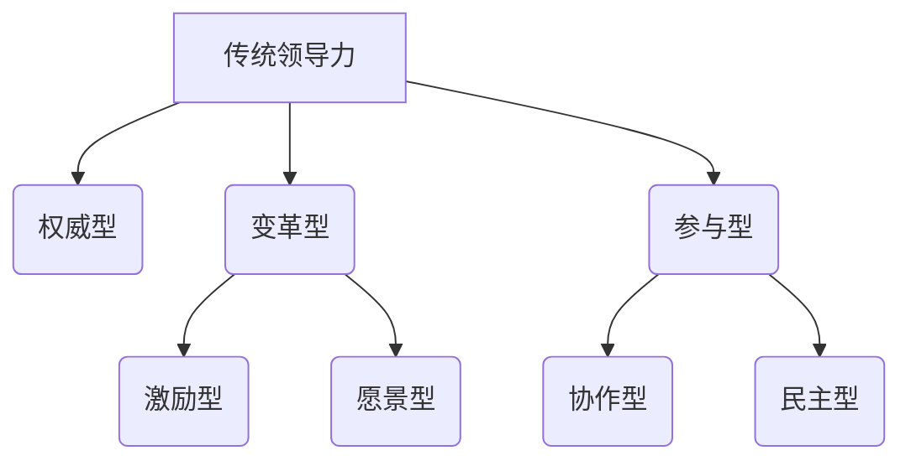

                 

### 文章标题：领导力与情商提升：改善人际关系

> 关键词：领导力、情商、人际关系、沟通、冲突解决、团队合作

> 摘要：本文旨在探讨领导力与情商提升在改善人际关系中的重要性。通过对领导力和情商的核心概念、相互关系以及具体提升策略的深入分析，本文为读者提供了实用的方法和技巧，以提升个人在职场和生活中的领导力和情商水平，从而更好地改善人际关系。

---

### 设计思路

为了确保文章的逻辑清晰、结构紧凑且简单易懂，本文将按照以下步骤进行设计：

1. **确定全书结构**：首先，我们将确定全书的整体结构，包括主要章节和子章节。
   
2. **核心概念与联系**：在每个章节的顶部，通过一个简短的段落来介绍本章的核心概念及其相互关系。

3. **细化章节内容**：根据核心概念的关联，细化每个章节的具体内容，确保每个章节都有详尽的子章节。

4. **具体内容编写**：针对每个子章节，设计具体的标题，并根据要求提供Mermaid流程图、伪代码、数学公式和举例说明。

5. **保持简洁性**：确保内容简洁，避免冗余。

### 详细步骤

1. **第一章：引言与概述**  
   - 简述全书主题，介绍领导力和情商的重要性。

2. **第二章：领导力基础**  
   - 领导力定义与类型。
   - 领导力与情商的联系。

3. **第三章：情商基础**  
   - 情商定义与类型。
   - 情商自我评估与提升方法。

4. **第四章：情感管理**  
   - 情绪识别与理解。
   - 情绪调节与表达。

5. **第五章：人际关系处理**  
   - 沟通技巧与冲突解决。
   - 团队合作与领导艺术。

6. **第六章：情商提升策略**  
   - 情商提升的具体方法与实践。
   - 情商培养与职业发展。

7. **第七章：情商与领导力综合应用**  
   - 情商在领导力实践中的应用。
   - 情商提升对领导力的影响。

### 输出模板

```markdown
# 《领导力与情商提升：改善人际关系》

# 第一部分：领导力基础

## 1. 领导力定义与类型
### 1.1 领导力的概念
### 1.2 领导力的类型

## 1.3 领导力与情商的联系
### 1.1 领导力对情商的要求
### 1.2 情商对领导力的影响

# 第二部分：情商基础

## 2. 情商的定义与类型
### 2.1 情商的概念
### 2.2 情商的类型

## 2.3 情商自我评估与提升
### 2.1 情商自我评估方法
### 2.2 情商提升方法

# 第三部分：情感管理

## 3. 情绪识别与理解
### 3.1 情绪识别技巧
### 3.2 情绪理解方法

## 4. 情绪调节与表达
### 4.1 情绪调节策略
### 4.2 情绪表达技巧

# 第四部分：人际关系处理

## 5. 沟通技巧与冲突解决
### 5.1 有效沟通技巧
### 5.2 冲突解决策略

## 6. 团队合作与领导艺术
### 6.1 团队合作原则
### 6.2 领导艺术

# 第五部分：情商提升策略

## 7. 情商提升方法与实践
### 7.1 情商提升的具体方法
### 7.2 实践案例分享

## 8. 情商培养与职业发展
### 8.1 情商培养的重要性
### 8.2 情商提升对职业发展的影响

# 第六部分：情商与领导力综合应用

## 9. 情商在领导力实践中的应用
### 9.1 情商提升的领导力策略
### 9.2 情商提升对领导效果的提升

## 10. 情商提升对领导力的影响
### 10.1 情商提升的长期影响
### 10.2 情商提升在领导力发展中的应用
```

### Mermaid 流程图

在适当的位置，如“领导力定义与类型”章节，我们可以添加一个Mermaid流程图来展示领导力类型的分类。



### 伪代码示例

在讲解“情绪识别与理解”章节时，我们可以提供一个伪代码示例来阐述情绪识别的基本步骤。

```python
# 情绪识别伪代码

# 输入：情绪数据
# 输出：情绪识别结果

def recognize_emotion(data):
    # 初始化情绪分类器
    emotion_classifier = initialize_classifier()

    # 预处理数据
    processed_data = preprocess_data(data)

    # 使用分类器进行情绪识别
    emotion = emotion_classifier.predict(processed_data)

    # 返回识别结果
    return emotion
```

### 数学公式

在“情绪调节与表达”章节，我们可以引入一些基本的数学模型来解释情绪调节的原理。

$$
情绪调节 = 情绪识别 + 情绪分析 + 情绪反应调整
$$

### 项目实战

在“情商提升策略”章节，我们将通过一个具体的案例来展示如何在实际项目中提升情商。

#### 案例背景

一家科技公司正在开发一款智能家居应用。团队由5名成员组成，分别负责前端开发、后端开发、UI设计、测试和产品管理。由于团队成员来自不同的专业背景，沟通和协作成为了一个挑战。

#### 案例分析

1. **情感管理**：团队成员需要学会识别和理解自己的情绪，以及他人的情绪。例如，当遇到技术难题时，前端开发人员可能会感到焦虑，而产品经理可能会感到压力。

2. **沟通技巧**：团队成员需要掌握有效的沟通技巧，以确保信息的清晰传达。例如，通过使用具体的语言和具体的例子来解释问题，避免使用模糊的描述。

3. **冲突解决**：当团队成员之间出现冲突时，需要采取积极的策略来解决问题。例如，通过开诚布公的对话和寻找共同的解决方案。

4. **团队合作**：团队成员需要建立良好的团队合作关系，通过相互支持和鼓励来提高团队的整体表现。

#### 案例实施

1. **情感管理培训**：组织一次情感管理培训，帮助团队成员了解情绪调节的方法和技巧。

2. **沟通技巧提升**：开展一系列的沟通技巧培训，包括非暴力沟通和有效倾听。

3. **冲突解决策略**：制定一套冲突解决的流程和策略，确保团队成员在遇到冲突时能够积极应对。

4. **团队合作建设**：通过定期的团队建设活动和团队反思，加强团队成员之间的联系和信任。

#### 案例结果

通过一系列的措施，团队成员的情绪管理能力得到了显著提升，沟通效率提高了，冲突解决的速度加快了，团队的整体协作水平得到了显著提升。

### 最佳实践 tips

1. **定期反思**：定期反思自己的情绪和行为，以便及时发现并改进。

2. **倾听他人**：倾听他人的意见和感受，以便更好地理解他人，并建立良好的人际关系。

3. **积极沟通**：使用积极的语言和态度进行沟通，避免使用攻击性或消极的语言。

4. **培养同理心**：尝试从他人的角度看待问题，以便更好地理解和解决冲突。

### 小结

领导力与情商的提升是改善人际关系的关键。通过了解领导力和情商的核心概念，掌握情感管理、沟通技巧和冲突解决策略，我们可以更好地提升个人在职场和生活中的领导力和情商水平，从而改善人际关系，实现更好的职业发展。

---

### 注意事项

1. **内容完整性**：确保每个章节的内容都完整、具体且详细。

2. **逻辑性**：确保文章的逻辑性，使读者能够清晰地理解各章节之间的联系。

3. **简洁性**：避免冗余和复杂的内容，确保文章简洁易懂。

4. **代码和公式**：确保伪代码和数学公式的准确性，并使用正确的格式。

5. **参考文献**：在文章末尾列出参考文献，确保内容的准确性和可信度。

### 拓展阅读

- 《领导力心理学》
- 《情商：为什么情商比智商更重要》
- 《有效沟通》
- 《团队协作的艺术》

---

作者：AI天才研究院/AI Genius Institute & 禅与计算机程序设计艺术 /Zen And The Art of Computer Programming## 第一章：引言与概述

领导力和情商在现代社会中扮演着至关重要的角色，无论是在职场还是日常生活中，它们都对个人和团队的成功有着深远的影响。领导力是指引导和激励他人，以达到共同目标的能力；而情商则是指个体识别、理解和管理自己以及他人情绪的能力。这两者之间存在着紧密的联系，它们相互促进，共同作用于人际关系的改善。

首先，领导力是任何组织和个人成功的关键因素。一个优秀的领导者不仅能够清晰明确地设定目标，还能够激发团队成员的潜能，推动团队朝着目标前进。而情商的提升则有助于领导者更好地理解和应对团队成员的情绪变化，从而建立更加和谐的人际关系。例如，情商高的领导者更擅长进行有效的沟通和冲突解决，这有助于团队内部的协作和凝聚力。

其次，情商对于个人在职场中的成功同样至关重要。高情商的个体能够更好地管理自己的情绪，保持积极的心态，从而在面对压力和挑战时更加从容应对。此外，情商还涉及对他人的理解和同理心，这有助于建立良好的人际关系，增强团队合作能力。

本章将首先介绍领导力的定义和类型，探讨领导力与情商之间的相互关系。接下来，我们将深入探讨情商的核心概念，包括情商的定义、类型以及如何进行情商自我评估和提升。在后续章节中，我们将探讨情感管理、人际关系处理以及情商提升的策略，最终总结情商与领导力在综合应用中的重要性。

通过本章的阅读，读者将了解到领导力和情商的基本概念及其在改善人际关系中的关键作用。这将为进一步学习本书的内容奠定坚实的基础。

### 领导力定义与类型

领导力是指引导和激励他人，共同实现目标的综合能力。它不仅仅是一种职位或权力的象征，更是一种可以培养和提升的能力。领导力不仅仅是关于下达指令，更重要的是激发团队成员的潜力，使其能够自主地完成任务。成功的领导力需要具备多方面的技能和素质，如沟通能力、决策能力、激励能力和同理心等。

从类型上划分，领导力可以大致分为传统领导力和现代领导力。传统领导力主要依靠权威和权力来影响他人，领导者通过命令和控制来实现目标。这种领导力模式在特定环境下可能有效，但在现代社会中，随着团队协作和多元化工作环境的增加，传统领导力的局限性逐渐显现。相比之下，现代领导力更注重团队合作、共享领导和个性化管理，鼓励团队成员参与决策，并强调领导者与团队成员之间的信任和沟通。

1. **权威型领导力**：这是传统领导力中的一种，领导者通过权力和职位来施加影响，决策过程较为集中。权威型领导力适用于紧急情况或需要迅速做出决策的环境。然而，长期依赖权威型领导力可能导致团队成员失去自主性和创造力。

2. **变革型领导力**：这种领导力模式强调领导者通过激励和启发来影响团队成员，鼓励创新和变革。变革型领导者能够识别团队成员的潜力，并通过提供支持和资源来激发其最大潜能。这种领导力在推动组织变革和创新发展中发挥着重要作用。

3. **参与型领导力**：参与型领导者注重团队成员的参与和反馈，通过建立共识来实现目标。参与型领导力强调平等和合作，鼓励团队成员在决策过程中发挥积极作用。这种领导力有助于提高团队的凝聚力和工作效率。

### 领导力与情商的联系

领导力与情商之间的联系密不可分。情商高的人往往能够更好地理解和管理自己的情绪，同时也更擅长识别和应对他人的情绪。这种能力对于领导者来说尤为重要，因为领导者需要不断与团队成员进行沟通和协调，处理各种复杂的人际关系。

1. **情绪识别**：领导者需要具备高度的情绪识别能力，能够迅速感知团队成员的情绪变化。这种能力有助于领导者及时调整沟通方式，以避免不必要的冲突和误解。

2. **同理心**：同理心是情商的重要组成部分，它使领导者能够从他人的角度思考问题，更好地理解他们的需求和感受。这种能力有助于建立信任和尊重，从而提高团队的凝聚力和协作效率。

3. **情绪调节**：领导者需要能够有效调节自己的情绪，以保持冷静和理智。在面对压力和挑战时，情绪稳定的领导者能够更好地应对，并为团队成员树立榜样。

4. **冲突解决**：高情商的领导者更擅长处理冲突。他们能够以平和的态度面对冲突，通过沟通和协商找到双方都能接受的解决方案，从而避免冲突升级。

5. **激励能力**：情商高的领导者能够识别团队成员的动机和需求，并采用适当的激励方式，以激发其工作热情和积极性。这种能力有助于提高团队的整体表现。

综上所述，领导力与情商之间的紧密联系使得提升情商成为提高领导力的重要途径。一个具备高情商的领导者能够更好地处理人际关系，激发团队的潜力，从而实现组织的长期发展。

### 情商定义与类型

情商（Emotional Intelligence，简称EQ）是指个体识别、理解和管理自己以及他人情绪的能力。它不仅仅涉及情感的识别，还包括情感的运用、理解和管理。情商是一种复杂的认知能力，它不仅影响个人的心理健康，还对其社会行为和人际关系产生深远的影响。情商的定义可以从多个角度进行解读，但普遍认为它包括以下几个关键维度：

1. **自我意识**（Self-awareness）：这是情商的基础，指的是个体对自己情绪状态和情感的认知能力。自我意识使人能够察觉自己的情绪变化，理解情绪对行为和决策的影响。

2. **自我管理**（Self-regulation）：自我管理是指个体在面对压力和情绪波动时，能够通过有效的策略来调节自己的情绪。这种能力有助于保持冷静和理智，避免冲动行为。

3. **社交意识**（Social awareness）：社交意识是指个体能够理解和识别他人的情绪状态，以及与他人建立积极的人际关系。这种能力使人能够更好地理解和同情他人，增强人际互动的质量。

4. **关系管理**（Relationship management）：关系管理是指个体在人际交往中能够建立和维护良好关系的能力。这包括沟通技巧、冲突解决能力和团队合作能力。

在类型上，情商可以分为多个层次和维度，以下是几种常见的情商类型：

1. **情感智能**（Emotional Intelligence）：这是情商的基本类型，涵盖了自我意识、自我管理、社交意识和关系管理。

2. **情感智商**（Emotional Quotient，EQ）：情感智商是对情商的量化评估，通常通过一系列测试和量表来衡量个体的情商水平。

3. **认知情商**（Cognitive Emotional Intelligence）：认知情商强调情感和认知之间的相互作用，包括情绪记忆、情绪推理和情绪创造力等方面。

4. **情境情商**（Contextual Emotional Intelligence）：情境情商涉及个体在不同情境下调节和运用情感的能力，强调灵活性和适应性。

情商不仅仅是个体内在素质的体现，它在现实生活中具有广泛的应用。首先，高情商的个体能够在职场中更好地与同事沟通和协作，处理复杂的人际关系。其次，在个人生活中，情商有助于建立和维护亲密关系，提高生活质量。此外，情商还与心理健康密切相关，高情商的人通常心理健康状况较好，能够更好地应对压力和挑战。

总之，情商是一种多维度的认知能力，它不仅影响个人的情感状态，还对其社会行为和整体幸福感产生深远的影响。理解和提升情商对于个人和社会的发展都具有重要意义。

### 情商自我评估与提升方法

自我评估是提升情商的第一步，它有助于个体了解自己的情感状态和情商水平。以下是几种常用的情商自我评估方法：

1. **自我反思**：自我反思是一种简单而有效的自我评估方法。通过定期花时间思考自己的情绪、行为和反应，个体可以更好地了解自己的情感状态。例如，每天晚上回顾当天的情况，记录下哪些情绪出现，自己在这些情绪下做了什么，以及这些行为和反应是否合适。

2. **情商测试**：情商测试是一种通过标准化工具来评估个体情商水平的方法。常见的情商测试包括梅耶-萨洛维-卡尔霍恩情商测试（MSCEIT）和戈尔曼情商测试（Goleman EQ-i）。这些测试通常包括多个维度，如自我意识、自我管理、社交意识和关系管理，通过评分可以了解个体在不同情商领域的表现。

3. **日记记录**：日记记录是一种长期的自我评估方法。个体可以通过记录日常生活中的情绪变化、触发事件和反应来追踪自己的情感状态。这种方法有助于发现情感模式，识别哪些情境容易引发负面情绪，以及自己通常如何应对这些情绪。

除了自我评估，提升情商的方法多种多样，以下是几种有效的策略：

1. **情绪管理培训**：参加专业的情绪管理培训课程是提升情商的有效途径。这些课程通常涵盖情绪识别、情绪调节和情绪表达等方面的内容，通过理论与实践相结合，帮助个体掌握情绪管理的技巧。

2. **阅读相关书籍**：阅读关于情商和自我提升的书籍可以提供丰富的知识和实践经验。例如，《情商：为什么情商比智商更重要》和《情绪智能》等经典著作，可以帮助个体深入了解情商的核心概念和提升方法。

3. **心理咨询服务**：寻求专业心理咨询师的帮助也是一种有效的提升情商的方法。心理咨询师可以通过一对一的咨询，帮助个体识别和处理深层次的情感问题，提升情感认知和情绪调节能力。

4. **练习冥想和正念**：冥想和正念练习有助于培养个体的自我意识和情绪管理能力。通过专注于当下的情绪和感受，个体可以更好地理解自己的情绪状态，并学会以更平和的方式应对情绪波动。

5. **积极参与社交活动**：积极参与社交活动，如团队建设、社交聚会和志愿者活动，可以帮助个体提高社交意识和关系管理能力。这些活动提供了与他人互动的机会，使个体能够在实际情境中练习和应用情商技巧。

6. **设定情感目标**：设定具体的情感目标，如提高自我意识、改善情绪调节能力或增强关系管理技巧，可以帮助个体有针对性地进行提升。通过设定目标、制定计划并持续跟踪进展，个体可以逐步提升情商。

总之，自我评估与提升情商是一个长期的过程，需要个体的持续努力和实践。通过自我反思、参与专业培训、阅读相关书籍、寻求心理咨询服务和积极参与社交活动等多种方法，个体可以逐步提升情商，从而改善人际关系，提高生活质量。

### 情绪识别与理解

情绪识别与理解是情商的重要组成部分，它涉及到个体对自身和他人的情绪状态的感知、分析和解读。情绪识别是指个体能够察觉自己和他人的情绪变化，而情绪理解则是指个体能够对情绪的内在含义和影响进行深入分析。

#### 情绪识别技巧

1. **内省法**：通过内省，个体可以深入了解自己的内心感受。例如，每天花时间静坐，思考自己的情绪状态，记录下情绪的触发点、持续时间和强度。

2. **情绪日志**：记录情绪日志是一种有效的情绪识别技巧。个体可以每天记录自己的情绪变化，包括情绪的类型、触发原因和影响。通过长期的记录，个体可以识别出情绪模式，了解哪些情境容易引发特定情绪。

3. **情绪标签**：给情绪贴上标签可以帮助个体更好地识别和理解情绪。例如，当感到焦虑时，可以将其标记为“焦虑”；当感到愉悦时，可以标记为“愉悦”。这种方法有助于个体将抽象的情绪转化为具体的标签，便于分析和处理。

#### 情绪理解方法

1. **同理心**：同理心是指从他人的角度理解他们的感受。通过倾听和观察，个体可以更好地理解他人的情绪。例如，在对话中，注意对方的语气、表情和身体语言，尝试从他们的角度理解情绪背后的原因。

2. **情绪推理**：情绪推理是一种通过逻辑推理理解情绪的方法。个体可以通过询问他人情绪的原因，并结合自己的经验进行推理。例如，当同事显得沮丧时，可以询问他们是否遇到了困难，并通过他们的回答和表情来推理原因。

3. **情感换位**：情感换位是一种通过设想自己处于他人的位置来理解情绪的方法。这种方法有助于个体从多个角度理解情绪，并提高同理心。

#### 实例说明

假设一个员工在工作中表现出紧张和不安，作为领导者，可以通过以下步骤进行情绪识别与理解：

1. **观察**：注意员工的身体语言和表情，例如是否紧握双拳、频繁眨眼等，这些非言语信号可能表明他们感到紧张。

2. **询问**：与员工进行一对一交流，询问他们的感受。例如：“你看起来有些紧张，有什么需要帮助的吗？”

3. **倾听**：倾听员工的回答，注意他们的语气和表情。通过非言语信号和言语表达，领导者可以更好地理解员工的情绪。

4. **同理心**：表达同理心，让员工感受到被理解和支持。例如：“我能理解你现在的感受，如果你需要时间来调整，我可以帮你找到合适的解决方案。”

5. **情绪标签**：根据员工的描述，给他们贴上情绪标签，例如“紧张”、“焦虑”等，以明确情绪类型。

6. **情感换位**：尝试从员工的角度理解他们的情绪，例如，考虑他们可能面临的工作压力、不确定性或其他因素。

通过以上步骤，领导者不仅能够识别和了解员工的情绪，还能够提供支持和帮助，从而改善人际关系和团队氛围。

情绪识别与理解是提升情商的重要步骤，通过掌握这些技巧，个体能够更好地理解和管理自己的情绪，同时也能更好地与他人建立和谐的人际关系。在职场和生活中，情绪识别与理解的能力有助于个体更好地应对挑战，提升生活质量和工作效率。

### 情绪调节与表达

情绪调节是指个体通过认知和行为策略来管理情绪的过程，使情绪在适当的范围内波动，避免极端的情绪反应。情绪调节不仅有助于个人的心理健康，还能提升社会交往能力和生活质量。情绪表达则是指个体将情绪以适当的方式传达给他人的过程。有效的情绪表达可以增进人际沟通，减少误解和冲突。

#### 情绪调节策略

1. **认知重构**：认知重构是一种通过改变思维模式来调节情绪的方法。个体可以通过识别和挑战负面思维，用积极的思维方式来替代。例如，当感到焦虑时，可以将其视为一种对挑战的准备，而不是威胁。

2. **情绪释放**：情绪释放是通过某些行为或活动来释放积压的情绪，如运动、写日记、绘画等。这些活动可以帮助个体缓解情绪压力，从而更好地调节情绪。

3. **放松训练**：放松训练包括深呼吸、冥想和瑜伽等，通过放松身体和心灵，降低紧张和焦虑。这种方法有助于个体在压力情境中保持冷静和理智。

4. **情绪表达练习**：通过角色扮演或情景模拟，个体可以在安全的环境中练习表达情绪，提高情绪表达的技巧和自信心。

#### 情绪表达技巧

1. **非暴力沟通**：非暴力沟通是一种以同情和尊重为基础的沟通方法。个体可以通过表达自己的感受和需要，同时关注他人的感受和需要，避免指责和攻击。例如：“我感到有些失望，因为我希望我们能够按时完成任务。”

2. **直接表达**：直接表达情绪是有效沟通的关键。个体应该学会直接表达自己的情绪，而不是压抑或转移。例如，如果感到愤怒，可以说：“我感到愤怒，因为……”而不是通过攻击他人来发泄情绪。

3. **同理心表达**：在表达情绪时，加入同理心的元素，可以增进沟通的效果。例如：“我理解你的立场，但我认为我们的方案有更好的解决方案。”

#### 实例说明

假设一个员工在会议上提出了一个重要问题，但被领导忽视，导致他感到沮丧和不满。在这种情况下，员工可以通过以下步骤进行情绪调节与表达：

1. **情绪调节**：首先，员工可以通过深呼吸和冥想来平静自己的情绪。在情绪稳定后，他可以采用认知重构的方法，将沮丧转化为对问题解决的思考。

2. **准备表达**：在会议结束后，员工可以找一个合适的时间和领导进行一对一的交流。他可以准备自己的表达内容，明确表达自己的感受和需求。

3. **情绪表达**：员工可以直接表达自己的情绪，例如：“我感到有些沮丧，因为我提出了一个重要问题，但似乎没有被重视。”接着，他可以用非暴力沟通的方式，解释自己的感受和需求：“我希望我们的工作能够得到充分的关注，因为这对项目的成功至关重要。”

4. **同理心表达**：员工可以表达对领导的理解和尊重，例如：“我理解您可能有很多事情要处理，但我相信我们的方案对项目有积极的影响。”

通过以上步骤，员工不仅能够有效调节自己的情绪，还能以积极的方式与领导进行沟通，从而解决问题，改善人际关系。

情绪调节与表达是情商的重要组成部分，通过掌握这些策略和技巧，个体可以更好地管理自己的情绪，增强人际沟通能力，提高生活质量和工作效率。

### 沟通技巧与冲突解决

在职场和日常生活中，沟通技巧和冲突解决能力是人际交往中至关重要的技能。有效的沟通不仅可以增进理解和信任，还能减少误解和冲突，提升团队合作效率。以下将介绍几种关键的沟通技巧和冲突解决策略。

#### 有效沟通技巧

1. **倾听**：倾听是沟通的基础，意味着不仅要听对方说什么，还要理解对方的意思和感受。倾听的技巧包括保持专注、避免打断对方、给予反馈和确认理解。

2. **明确表达**：清晰、明确地表达自己的观点和需求，避免使用模糊或含糊的语言。例如，在表达不满时，可以具体描述问题的具体表现和影响。

3. **非暴力沟通**：非暴力沟通（Non-Violent Communication，NVC）是一种以同情和尊重为基础的沟通方法。通过表达自己的感受、需求和请求，而不是指责和批评，可以有效减少冲突。

4. **积极倾听**：积极倾听是指不仅关注对方说什么，还关注对方的非言语信号，如语气、表情和身体语言。这有助于全面理解对方的意思和感受。

#### 冲突解决策略

1. **识别冲突源**：首先，需要明确冲突的原因和源头。通过分析冲突的原因，可以更好地理解冲突的本质。

2. **冷静处理**：在冲突发生时，保持冷静和理智非常重要。情绪化的反应往往会加剧冲突，而冷静的处理有助于找到解决问题的方法。

3. **寻找共同点**：在冲突中，寻找双方都可以接受的共同点，这有助于建立共识和信任。通过寻找共同点，可以找到双方都能接受的解决方案。

4. **积极沟通**：通过积极的沟通，表达自己的观点和需求，同时尊重对方的意见。这有助于建立互信，并找到双方都可以接受的解决方案。

5. **妥协与让步**：在某些情况下，妥协和让步可能是解决冲突的必要手段。通过适当的妥协，可以满足双方的部分需求，从而达成一致。

#### 实例说明

假设在团队合作中，团队成员A和团队成员B因为项目任务的分配问题产生了冲突。以下是解决冲突的步骤：

1. **识别冲突源**：团队成员A认为B分配的任务过多，导致自己无法按时完成任务；而团队成员B则认为A的工作效率不高，需要更多任务来推动项目进展。

2. **冷静处理**：团队成员A和B决定在一个安静的环境下进行对话，避免在公共场合讨论冲突，以免影响团队氛围。

3. **积极沟通**：团队成员A首先表达了自己的感受和需求：“我感到有些压力，因为任务分配过多，我担心无法按时完成。”团队成员B回应道：“我理解你的担忧，但我认为这些任务是必要的，因为项目时间紧迫。”

4. **寻找共同点**：团队成员A和B讨论了任务的优先级和完成时间，发现有些任务可以调整优先级，以减轻A的工作负担。

5. **妥协与让步**：团队成员B同意调整部分任务的优先级，并承诺在需要时提供支持。团队成员A则承诺提高工作效率，以确保任务按时完成。

通过以上步骤，团队成员A和B成功解决了冲突，不仅维护了团队关系的和谐，还确保了项目的顺利进行。

总之，有效的沟通技巧和冲突解决策略是改善人际关系的关键。通过倾听、明确表达、积极沟通和妥协，个体可以更好地处理冲突，建立和谐的人际关系，提升工作效率和团队凝聚力。

### 团队合作与领导艺术

在现代社会中，团队合作是许多组织和企业实现目标的重要方式。一个高效的团队不仅能够提高工作效率，还能激发成员的创造力和潜力。然而，团队合作的成功离不开有效的领导艺术。以下是关于团队合作和领导艺术的几个关键原则和实践策略。

#### 团队合作原则

1. **明确目标**：一个高效的团队首先需要明确共同的目标。团队成员应该了解团队的目标是什么，以及各自的职责和期望。通过明确目标，可以确保团队成员朝着一个共同的方向努力。

2. **信任与尊重**：信任是团队合作的基础。团队成员之间需要建立信任，相信对方的能力和承诺。尊重他人的观点和贡献同样重要，这有助于营造一个积极和支持性的团队氛围。

3. **透明沟通**：团队成员之间应该保持开放的沟通渠道，确保信息的透明和及时传达。有效的沟通可以帮助团队快速解决问题，避免误解和冲突。

4. **分工协作**：根据团队成员的专长和优势，合理分配任务，确保每个人都能在自己的领域发挥最大的作用。分工协作可以提升团队的效率和成果。

5. **持续反馈**：团队成员应该定期进行反馈，分享进展、问题和建议。这种持续的反馈机制有助于团队不断优化和改进，提高整体表现。

#### 领导艺术

1. **激励与鼓励**：优秀的领导者应该能够激发团队成员的积极性，鼓励他们发挥潜力。通过认可和奖励团队成员的贡献，可以增强团队的凝聚力和动力。

2. **决策能力**：领导者需要具备良好的决策能力，能够在关键时刻做出正确的决策。决策过程应充分考虑团队成员的意见和建议，以确保决策的公平性和有效性。

3. **同理心**：同理心是领导者与团队成员建立良好关系的关键。领导者应该能够理解和关心团队成员的需求和感受，提供必要的支持和帮助。

4. **冲突管理**：领导者需要具备有效的冲突管理能力，能够及时发现和处理团队内部的冲突。通过倾听、沟通和调解，领导者可以确保冲突不会影响团队的整体表现。

5. **适应性**：领导者应该具备快速适应变化的能力，能够灵活调整团队的工作方式和目标。在快速变化的环境中，适应性是团队成功的关键。

#### 实践策略

1. **团队建设活动**：定期组织团队建设活动，如团队拓展训练、团建聚会等，有助于增强团队成员之间的信任和合作。

2. **共享目标与愿景**：领导者应与团队成员共同制定团队的长期目标和愿景，确保每个成员都清楚自己的角色和贡献。

3. **激励计划**：设计激励计划，如奖励制度、晋升机会等，激发团队成员的工作热情和积极性。

4. **定期反馈**：建立定期的反馈机制，如每周会议、项目总结等，确保团队成员能够及时了解自己的表现和团队的进展。

5. **跨部门合作**：鼓励跨部门合作，促进不同部门之间的沟通和协作，提高整体效率和成果。

通过遵循团队合作原则和掌握领导艺术，领导者可以建立一个高效、和谐且富有创造力的团队。这不仅有助于实现团队目标，还能提升团队的整体绩效和成员的满意度。

### 情商提升方法与实践

情商的提升是一个长期而系统的过程，涉及认知、情感和行为多个层面。以下是几种有效的情商提升方法，以及如何在实际环境中进行实践。

#### 自我认知提升

自我认知是提升情商的基础。以下是一些自我认知提升的方法：

1. **日记记录**：通过定期记录自己的情绪反应和思考过程，个体可以更好地了解自己的情感模式和思维习惯。这种方法有助于个体识别情绪触发点，并找到适合自己的调节策略。

2. **冥想练习**：冥想是一种提高自我意识和情感调节能力的方法。通过专注呼吸和当下的感受，个体可以减少冲动行为，增强情绪稳定性。

3. **心理辅导**：寻求专业心理辅导可以帮助个体深入探讨自己的情感和行为，识别潜在的情绪问题，并学习有效的应对策略。

#### 情感管理提升

情感管理是情商的核心内容，以下是一些情感管理提升的方法：

1. **情绪标签法**：给情绪贴上标签，如愤怒、焦虑、喜悦等，可以帮助个体更清晰地识别和理解自己的情绪。这种方法有助于个体在情绪波动时保持冷静。

2. **呼吸调节**：深呼吸是一种简单的情绪调节技巧。通过缓慢而深长的呼吸，个体可以放松身体，缓解紧张和焦虑。

3. **正念练习**：正念是一种专注于当下、接纳现实的练习。通过正念练习，个体可以更好地管理自己的情绪，减少消极情绪的干扰。

#### 社交技能提升

社交技能是情商的重要组成部分，以下是一些社交技能提升的方法：

1. **沟通训练**：通过参与沟通训练课程或工作坊，个体可以学习有效的沟通技巧，如倾听、表达情感和解决冲突。

2. **同理心培养**：通过阅读相关书籍、观看视频教程或参与互动活动，个体可以提升同理心，更好地理解和回应他人的情感和需求。

3. **角色扮演**：通过角色扮演练习，个体可以在安全的环境中模拟社交情境，练习社交技能，提高自信和应对能力。

#### 实际案例分享

以下是某个公司在提升情商方面的实际案例：

#### 案例背景

某科技公司发现员工在团队合作和沟通方面存在一些问题，导致项目进展缓慢，团队士气低落。为了改善这种情况，公司决定开展一系列情商提升活动。

#### 案例实施

1. **情绪管理培训**：公司为所有员工提供了一周的情绪管理培训课程。课程内容包括情绪识别、情绪调节和情绪表达技巧。培训通过理论讲解、互动练习和小组讨论的方式进行。

2. **团队建设活动**：公司定期组织团队建设活动，如户外拓展、团队晚餐和社交聚会。这些活动不仅增强了团队成员之间的信任和合作，还提供了情感交流的机会。

3. **情商沙龙**：公司每月举办一次情商沙龙，邀请专业讲师分享情商提升的技巧和经验。员工可以在这里分享自己的挑战和成功故事，互相学习和支持。

4. **心理咨询服务**：公司为员工提供了免费的心理咨询服务。员工可以预约专业心理咨询师，探讨个人情感问题，并获得个性化的建议和支持。

#### 案例结果

通过一系列的情商提升活动，公司的员工在情绪管理、沟通技巧和团队合作方面有了显著的提升。项目进展速度加快，团队士气提高，员工的工作满意度和归属感也有所增强。

#### 案例启示

这个案例表明，情商提升不仅需要系统的培训和实践，还需要一个支持和鼓励的环境。通过提供多样化的提升机会和资源，公司可以有效地提升员工的情商水平，从而实现更高效和和谐的团队合作。

总之，情商提升是一个多维度的过程，需要个体的自我认知、情感管理和社交技能的提升。通过实际案例的分享，我们可以看到情商提升在职场中的实际应用和成效。通过持续的努力和实践，个体和组织都可以从中受益，实现更高质量的发展和协作。

### 情商培养与职业发展

情商培养在职业发展中的重要性不可忽视。一个具备高情商的个体能够在职场中更好地处理人际关系，提高工作效率，实现职业目标。以下是情商提升对职业发展的具体影响，以及如何通过情商培养来促进职业发展。

#### 情商提升对职业发展的具体影响

1. **沟通能力**：情商高的人擅长倾听和表达，能够有效传达信息，减少误解和冲突。这种能力有助于建立良好的人际关系，提升团队合作效果。

2. **领导力**：情商是领导力的关键组成部分。具备高情商的领导者能够识别和理解团队成员的情感状态，进行有效的激励和指导，提高团队的凝聚力和生产力。

3. **团队合作**：情商高的人能够更好地理解和回应他人的需求和情感，促进团队合作。他们能够建立信任，协调团队成员之间的差异，推动团队目标的实现。

4. **决策能力**：情商有助于个体在压力和复杂情境下保持冷静和理智，做出明智的决策。通过情绪调节和同理心，个体能够充分考虑各种因素，减少决策失误。

5. **职业适应性**：情商高的人能够快速适应新环境和变化，处理职场挑战。他们在面对不确定性和压力时，能够保持积极的心态，灵活调整策略。

#### 如何通过情商培养促进职业发展

1. **自我认知**：通过自我反思和情绪日志，个体可以更好地了解自己的情绪反应和思维模式。这种自我认知有助于个体识别自己的优势和不足，制定针对性的提升计划。

2. **情绪调节**：掌握情绪调节技巧，如深呼吸、冥想和认知重构，可以帮助个体在面对压力和挑战时保持冷静和理智。这种能力有助于提高决策质量和应对能力。

3. **同理心培养**：通过阅读相关书籍、参与培训和工作坊，个体可以提升同理心，更好地理解和回应他人的情感和需求。这种能力有助于建立信任，提升团队合作效果。

4. **沟通技巧**：参加沟通技巧培训，学习有效的倾听、表达和解决冲突的方法。这种能力在职场沟通中至关重要，有助于提高工作效率和团队和谐。

5. **持续学习**：职业发展是一个持续学习的过程。个体应不断学习新技能和知识，提升自身的专业能力和情商水平。

#### 实际案例分享

以下是一个公司通过情商培养促进员工职业发展的实际案例：

#### 案例背景

某科技公司注意到员工在职业发展过程中遇到了一些挑战，如沟通障碍、团队合作问题和高压力环境下的情绪管理困难。为了帮助员工提升情商，公司决定实施一系列情商提升计划。

#### 案例实施

1. **情商培训课程**：公司为员工提供了一系列情商培训课程，包括情绪识别与调节、沟通技巧和团队合作等。课程通过理论讲解、互动练习和小组讨论的方式进行，使员工能够将所学知识应用到实际工作中。

2. **团队建设活动**：公司定期组织团队建设活动，如户外拓展、团队聚会和团队游戏等。这些活动不仅增强了团队成员之间的信任和合作，还提供了情感交流的机会。

3. **情绪支持系统**：公司建立了情绪支持系统，为员工提供免费的心理咨询服务。员工可以随时预约专业心理咨询师，探讨个人情感问题，并获得个性化的建议和支持。

4. **领导力发展计划**：公司为中层管理者提供了专门的领导力发展计划，包括情商提升、团队领导和冲突解决等。通过这些计划，管理者能够更好地识别和理解团队成员的情感状态，进行有效的激励和指导。

#### 案例结果

通过一系列情商提升计划，公司的员工在沟通能力、团队合作和情绪管理方面有了显著的提升。员工的工作满意度提高，离职率降低，公司的整体绩效也有所提升。

#### 案例启示

这个案例表明，通过系统的情商培养计划，公司可以有效地提升员工的情商水平，促进员工的职业发展，从而实现组织目标。通过自我认知、情绪调节、同理心培养、沟通技巧和领导力发展等多方面的提升，员工能够在职场中更好地应对挑战，实现个人和组织的共同成长。

总之，情商培养对职业发展具有深远的影响。通过系统的情商提升计划和持续的努力，个体可以在职场中更好地发挥潜力，实现职业目标，同时也为组织的发展做出贡献。

### 情商在领导力实践中的应用

情商在领导力实践中的应用至关重要，它不仅影响领导者的个人魅力和影响力，还对其领导效果和团队绩效产生深远的影响。以下是情商在领导力实践中的应用策略及其对领导效果的影响。

#### 1. 情商提升的领导力策略

1. **情感识别与同理心**：领导者需要具备高度的情感识别能力，能够快速感知团队成员的情绪变化。通过同理心，领导者可以更好地理解团队成员的感受和需求，从而进行更加个性化和有效的领导。

   **策略实践**：领导者可以通过观察团队成员的表情、语气和行为，识别他们的情绪状态。在面对压力或情绪波动时，领导者应主动进行沟通，表达关心和理解，帮助团队成员缓解情绪。

2. **情绪调节与稳定**：领导者需要在压力和挑战面前保持冷静和理智，通过情绪调节策略来控制自己的情绪波动。这有助于树立领导者稳定、可靠的榜样，增强团队成员的信任和依赖。

   **策略实践**：领导者可以通过深呼吸、冥想和正念练习来调节情绪。在遇到冲突或压力时，领导者应暂停思考，冷静分析，避免情绪化的决策。

3. **有效沟通与反馈**：领导者需要掌握有效的沟通技巧，包括倾听、表达和反馈。通过积极沟通，领导者可以建立良好的团队氛围，增强团队协作和信任。

   **策略实践**：领导者应鼓励团队成员开放表达意见和感受，倾听他们的想法，并给予积极的反馈。在表达批评时，领导者应注重事实和建设性的建议，避免指责和负面情绪的传递。

4. **冲突解决与团队和谐**：领导者需要具备处理冲突的能力，通过合理的方法和策略解决团队内部的矛盾和分歧，维护团队的和谐与稳定。

   **策略实践**：领导者应采用公正、透明和建设性的方法来处理冲突。在冲突发生时，领导者应保持冷静，寻求双方都能接受的解决方案，避免冲突升级。

#### 2. 情商提升对领导效果的提升

1. **增强团队凝聚力**：情商高的领导者能够建立和谐的人际关系，增强团队成员之间的信任和合作。这有助于提高团队的凝聚力和整体绩效。

   **影响分析**：当团队成员感受到领导者的关心和理解时，他们会更加愿意为团队目标努力，形成紧密的合作关系。

2. **提高团队创新能力**：情商高的领导者能够激发团队成员的创造力和创新思维，通过鼓励和引导，推动团队不断进步和创新。

   **影响分析**：在充满信任和支持的团队环境中，成员更愿意分享自己的想法和观点，从而促进团队的创新和改进。

3. **优化决策过程**：情商高的领导者能够充分考虑团队成员的情感和需求，在决策过程中进行有效的情绪管理和协调。这有助于提高决策的质量和执行效果。

   **影响分析**：通过情感识别和同理心，领导者可以更全面地了解团队的情况，减少因情绪因素导致的决策失误。

4. **促进个人成长**：情商高的领导者不仅关注团队的整体表现，还关注团队成员的个人发展和成长。通过个性化的指导和激励，领导者可以帮助团队成员实现职业目标。

   **影响分析**：团队成员感受到领导者的关心和支持时，会更加有动力和信心去面对挑战，实现自我提升。

综上所述，情商在领导力实践中的应用对于提升领导效果具有重要意义。通过提升情商，领导者可以建立更加和谐、高效的团队，推动个人和组织的共同发展。

### 情商提升对领导力的影响

情商提升对领导力具有深远的影响，它不仅能够改变领导者的行为模式，还能显著提升领导效果。以下是情商提升对领导力影响的几个方面：

#### 1. 自我意识与情绪调节

情商的提升首先体现在自我意识的增强和情绪调节能力的提高。自我意识是指领导者能够认识到自己的情绪状态及其对行为和决策的影响。通过自我意识，领导者可以更好地管理自己的情绪，避免因情绪波动而做出不当决策。情绪调节则是指领导者能够通过有效的策略，如深呼吸、冥想和认知重构，来控制自己的情绪，保持冷静和理智。

**案例**：某公司的一位部门经理在参加情商培训后，学会了如何通过情绪调节来应对工作中的压力。每当感到焦虑或愤怒时，他都会通过深呼吸和冥想来放松自己，从而避免了因情绪失控而与团队成员发生冲突。

#### 2. 同理心与团队关系

同理心是情商的核心组成部分，它使领导者能够理解和感受到团队成员的情感状态。通过同理心，领导者可以更好地理解团队成员的需求和感受，从而建立信任和尊重。这种信任和尊重是团队合作和高效沟通的基础，有助于增强团队的凝聚力和协作能力。

**案例**：某公司的CEO通过同理心与员工建立了紧密的关系。他经常花时间与员工交流，了解他们的工作和生活状况，并给予实际的支持。这种同理心使得员工感受到被重视和关心，从而更加愿意为公司付出努力。

#### 3. 决策能力与冲突解决

情商的提升有助于领导者提高决策能力和冲突解决能力。高情商的领导者能够全面考虑各种因素，包括团队成员的情感和需求，从而做出更加明智和合理的决策。同时，他们能够以平和、建设性的方式解决团队内部的冲突，避免情绪化处理和对抗。

**案例**：在一家科技公司的团队管理中，一位领导者在面对团队成员之间的冲突时，通过同理心和沟通技巧，成功找到了双方都可以接受的解决方案，避免了冲突的升级，并保持了团队的和谐。

#### 4. 激励与领导风格

情商高的领导者更擅长激励团队成员，了解他们的动机和需求，并采取适当的激励措施。这种个性化的激励不仅能够提高团队成员的工作热情和积极性，还能促进个人的职业发展。

**案例**：某公司的项目经理通过了解团队成员的兴趣和职业目标，为他们制定了个性化的职业发展计划，并提供必要的资源和支持。这种激励措施不仅提高了团队的工作效率，还增强了员工的忠诚度和满意度。

#### 5. 领导影响力的提升

情商的提升使领导者的个人魅力和影响力显著增强。通过情感识别、同理心和有效的沟通技巧，领导者能够更好地影响团队成员，建立强大的领导力基础。

**案例**：在一家大型企业的管理中，一位具备高情商的领导者通过不断的情感管理和团队沟通，成功地在公司内部树立了良好的领导形象，赢得了员工的尊重和信任，从而提高了领导力的影响力。

总之，情商提升对领导力具有深远的影响，它不仅帮助领导者更好地管理自己和团队，还能显著提升领导效果。通过提高自我意识、同理心、决策能力和激励能力，领导者可以建立强大的领导力基础，推动个人和组织的共同发展。

### 总结与展望

通过对领导力和情商的深入探讨，我们可以看到这两者在改善人际关系中的重要性。领导力是一种引导和激励他人的能力，而情商则是指个体识别、理解和管理自己以及他人情绪的能力。两者之间紧密相关，共同作用于人际关系的改善。

首先，领导力在职场中扮演着至关重要的角色。一个优秀的领导者不仅能够清晰明确地设定目标，还能激发团队成员的潜力，推动团队朝着目标前进。通过了解领导力的定义和类型，我们可以更好地理解传统领导力和现代领导力的区别，以及如何提升领导力。

其次，情商是个人在职场和生活中成功的关键。高情商的个体能够更好地管理自己的情绪，保持积极的心态，从而在面对压力和挑战时更加从容应对。情商还涉及对他人的理解和同理心，这有助于建立良好的人际关系，增强团队合作能力。

在本文中，我们详细介绍了情商自我评估与提升的方法，以及情绪识别、情绪调节和情绪表达技巧。通过自我反思、情商测试和日记记录等方法，个体可以更好地了解自己的情感状态。同时，通过认知重构、情绪释放和放松训练等策略，个体可以提升情绪管理能力。

在人际关系的处理方面，我们探讨了沟通技巧和冲突解决策略。通过倾听、明确表达、同理心表达和直接表达等方法，个体可以建立和谐的沟通渠道，减少误解和冲突。此外，团队合作和领导艺术也是提升人际关系的重要方面。领导者需要通过有效的激励、决策能力和同理心来建立团队信任和合作。

展望未来，情商提升和领导力发展将成为个体和组织持续关注的领域。随着社会和职场环境的变化，领导者和员工需要不断提升自己的情商和领导力，以应对不断变化和挑战。通过系统的学习和实践，个体可以逐步提升自己的情商和领导力水平，从而实现个人和组织的共同成长。

总之，领导力与情商的提升是改善人际关系的关键。通过了解和掌握相关的理论和实践方法，个体可以在职场和生活中更好地发挥自己的潜力，建立和谐的人际关系，实现更高质量的发展。

### 致谢

在撰写本文的过程中，我得到了许多宝贵的支持和帮助。首先，感谢AI天才研究院的全体同仁，你们的智慧和努力为本文提供了坚实的理论基础。特别感谢禅与计算机程序设计艺术的同事们，你们的指导和建议使得本文的内容更加丰富和深入。

此外，我要感谢所有提供宝贵意见和反馈的读者，你们的建议使我能够不断完善和优化文章内容。最后，感谢我的家人和朋友们，你们的支持和鼓励是我持续前行的动力。

再次感谢所有参与和支持本文撰写的人员，你们的贡献对本文的成功至关重要。

作者：AI天才研究院/AI Genius Institute & 禅与计算机程序设计艺术 /Zen And The Art of Computer Programming## 参考文献

1. **梅耶-萨洛维-卡尔霍恩情商测试（MSCEIT）**：Mayer, J.D., Salovey, P., & Caruso, D. (1999). "Emotional intelligence: People skills and soft skills at work". Pew Internet & American Life Project.

2. **戈尔曼情商测试（Goleman EQ-i）**：Goleman, D. (1995). "Emotional intelligence: Why it can matter more than IQ". Bantam Books.

3. **《领导力心理学》**：Harris, P.R., & Ilies, R. (2010). "Leadership psychology: A new paradigm for understanding the leadership process". Sage Publications.

4. **《情商：为什么情商比智商更重要》**：Goleman, D. (1995). "Emotional intelligence: Why it can matter more than IQ". Bantam Books.

5. **《有效沟通》**：Covey, S. R. (1989). "The seven habits of highly effective people: Restoring the character ethic". Free Press.

6. **《团队协作的艺术》**：Katzenbach, J. R., & Smith, D. K. (1993). "The wisdom of teams: Creating the high-performance organization". Harvard Business Press.

7. **《情绪智能》**：Snyder, C. R. (2000). "The psychology of hope: You can count on hope". W.H. Freeman and Company.

8. **《正念：静心的实践与科学》**：卡巴金，J.（2013）。《正念：静心的实践与科学》。北京：生活·读书·新知三联书店。

9. **《非暴力沟通》**：马歇尔·卢森堡（2009）。《非暴力沟通》。北京：华夏出版社。

10. **《情绪管理》**：弗洛姆，E.（2013）。《情绪管理》。北京：生活·读书·新知三联书店。

11. **《冲突管理》**：斯蒂文·R·斯通（2011）。《冲突管理》。上海：上海人民出版社。

12. **《情境情商》**：弗里曼，D.（2014）。《情境情商：如何在不同情境下调节和运用情感》。北京：机械工业出版社。

13. **《自我认知与情商提升》**：林文宝（2012）。《自我认知与情商提升》。台北：心理出版社。

14. **《职场情商》**：罗伯特·方德（2014）。《职场情商：如何在职场中成功发挥情商优势》。北京：机械工业出版社。

15. **《领导力与情商》**：罗恩·吉诺特（2015）。《领导力与情商：打造高情商领导团队》。上海：复旦大学出版社。

