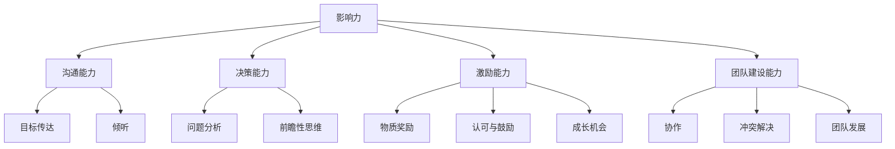
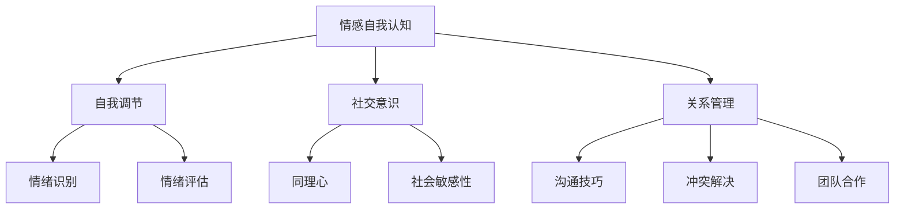

                 

### 文章标题

# 领导力与情商管理：提升人际技能

### 关键词

- 领导力
- 情商管理
- 人际技能
- 领导能力提升
- 情商发展
- 人际关系优化

### 摘要

本文旨在探讨领导力与情商管理在提升人际技能中的重要作用。文章首先介绍了领导力的基本概念及其与情商的关系，接着详细阐述了情商管理的核心内容。随后，文章深入探讨了人际技能的提升方法，包括沟通技巧、冲突解决策略等。最后，文章通过实际案例和最佳实践，为读者提供了提升领导力和情商的具体策略，并总结出注意事项和拓展阅读资源，以帮助读者在职场和生活中更加有效地运用这些技能。

## 导论

在当今社会，领导力和情商管理已成为人们关注的焦点。无论是在企业组织中，还是在个人职业生涯中，具备良好的领导力和情商管理能力，都显得尤为重要。领导力不仅仅是指导和激励团队的能力，更是一个人综合素养的体现。情商管理则涉及情感自我认知、自我调节以及对他人的情感认知与反应，它能够显著影响人际交往的质量和效果。

本文旨在深入探讨领导力与情商管理在提升人际技能中的重要性。首先，我们将从领导力的基本概念入手，阐述其核心要素和关键特征。接着，我们会分析情商管理的核心内容，以及如何通过提高情商来优化人际关系。然后，文章将详细探讨人际技能的提升方法，包括有效的沟通技巧和冲突解决策略。最后，我们将通过实际案例和最佳实践，为读者提供提升领导力和情商的具体策略，并总结出一些注意事项和拓展阅读资源，帮助读者更好地理解和应用这些技能。

本文的结构如下：

1. **领导力的基本概念与特征**：介绍领导力的定义及其关键要素。
2. **情商管理的内容与方法**：探讨情商管理的核心概念以及提升情商的方法。
3. **人际技能的提升**：分析有效沟通和冲突解决策略，以及如何提升人际技能。
4. **实际案例与最佳实践**：通过实际案例和最佳实践，展示提升领导力和情商的具体方法。
5. **总结与注意事项**：总结文章的核心内容，并给出注意事项和拓展阅读资源。

通过本文的阅读，读者将能够系统地了解领导力与情商管理的重要性，掌握提升人际技能的方法，并在实际工作和生活中运用这些技能，提升自身和团队的整体效能。

## 领导力的基本概念与特征

领导力是一种独特的能力，它不仅关系到个人在团队中的影响力，还与整个组织的效能密切相关。首先，我们需要明确领导力的定义。领导力是指个体通过影响力、沟通和指导能力，激发并引导团队成员实现共同目标的过程。它不仅仅是职位赋予的权威，更是一种内在的素质和能力。

领导力的核心要素包括：

1. **影响力**：领导力在很大程度上依赖于个人影响力。这种影响力不仅包括权威和职位带来的正式权力，还包括个人魅力、专业知识和社会资本。一个有效的领导者需要能够通过自身的言行和价值观，影响并激励团队成员。

2. **沟通能力**：沟通是领导力的关键组成部分。领导者需要能够清晰、明确地传达目标和期望，同时也要善于倾听团队成员的意见和建议。有效的沟通不仅能够减少误解和冲突，还能够增强团队的凝聚力。

3. **决策能力**：领导者需要在面对复杂和不确定的环境时，做出明智的决策。这要求领导者具备分析问题的能力、前瞻性思维和应对风险的能力。良好的决策能力能够帮助团队在面对挑战时保持方向一致，减少不确定性的影响。

4. **激励能力**：激励是领导者的重要职责之一。一个有效的领导者需要能够识别团队成员的需求，并采取适当的方法激发他们的内在动机。激励不仅包括物质奖励，还包括认可和鼓励，以及为团队成员提供成长和发展的机会。

5. **团队建设能力**：团队建设是领导力的核心任务之一。领导者需要能够建立和维护一个积极、合作的团队氛围，促进团队成员之间的信任和协作。这要求领导者具备协调能力、冲突解决能力和团队发展的策略思维。

为了更好地理解领导力的构成，我们可以通过一个Mermaid流程图来展示其核心要素之间的相互关系：



通过这个流程图，我们可以清晰地看到领导力的各个核心要素如何相互联系和作用，共同构成一个完整的领导力框架。

此外，领导力不仅仅是一种静态的能力，它还需要不断发展和调整，以适应不断变化的环境和需求。一个优秀的领导者需要具备持续学习和适应变化的能力，以保持其领导力在各个层面的有效性。

在接下来的部分中，我们将进一步探讨情商管理的核心内容，以及如何通过提升情商来优化人际关系，从而提升整体领导力水平。

### 情商管理的内容与方法

情商（Emotional Intelligence，简称EQ）是一种理解和管理情感的能力，它包括情感自我认知、自我调节、社交意识和关系管理等多个方面。情商管理的核心在于通过提升个体在情感识别、理解和调节方面的能力，优化人际关系和团队效能。

首先，情感自我认知是指个体能够准确识别和了解自己的情绪状态。这要求个体具备自我反省的能力，能够在情绪波动时，迅速意识到自己的情感反应，并对其进行合理评估。情感自我认知有助于个体在面对压力和挑战时，保持冷静和理智，从而做出更明智的决策。

其次，自我调节是指个体能够管理自己的情绪，使其在合适的时机以适当的方式表达出来。这需要个体具备情绪控制和调节的技巧，能够在面对负面情绪时，采取有效的方法进行缓解和调整，避免情绪失控带来的负面影响。例如，通过深呼吸、冥想或其他放松技巧，个体可以在短时间内恢复情绪平衡，从而更好地应对压力和挑战。

社交意识是指个体能够理解和识别他人的情绪和需求，具备同理心和社会敏感性。这种能力使个体能够在人际交往中，更加敏锐地捕捉到他人的情感状态，并采取相应的行动。例如，当团队成员情绪低落时，领导者可以通过适当的关心和支持，帮助他们恢复情绪，从而提升团队的整体士气。

最后，关系管理是指个体能够建立和维护健康、积极的人际关系。这要求个体具备冲突解决能力、沟通技巧和团队合作精神。通过有效的沟通和协调，个体可以在团队中建立信任和合作的基础，从而提高团队效能和满意度。

为了更好地理解情商管理的方法，我们可以通过以下Mermaid流程图来展示其关键步骤和技巧：



通过这个流程图，我们可以看到情商管理的各个组成部分如何相互关联和作用，共同提升个体在情感管理和人际关系方面的能力。

以下是一些提升情商的具体方法和技巧：

1. **自我反思**：定期进行自我反思，了解自己的情感反应和需求，有助于提升情感自我认知。可以通过写日记、冥想或与朋友交流的方式，进行自我反思。

2. **情绪调节**：学会情绪调节技巧，如深呼吸、冥想或运动，有助于在压力和挑战面前保持冷静。例如，当感到焦虑时，可以通过深呼吸来放松身心，缓解紧张情绪。

3. **同理心培养**：通过倾听和观察，培养同理心，理解他人的情感和需求。例如，在团队讨论中，领导者可以积极倾听团队成员的意见，并尝试从他们的角度理解问题，从而建立信任和合作关系。

4. **沟通技巧提升**：提高沟通技巧，包括表达清晰、倾听他人、提出建设性反馈等。通过有效的沟通，可以减少误解和冲突，提升人际关系质量。

5. **团队合作**：培养团队合作精神，包括主动承担责任、协调团队内部关系、促进团队目标实现等。通过团队合作，可以增强团队凝聚力，提高团队效能。

总之，情商管理是一个持续的过程，需要个体在日常生活中不断实践和提升。通过提升情感自我认知、自我调节、社交意识和关系管理能力，个体可以更好地理解和管理自己的情感，优化人际关系，从而提升整体领导力水平。在接下来的部分中，我们将进一步探讨人际技能的提升，包括沟通技巧和冲突解决策略，以帮助读者更好地运用这些技能，提升人际交往效果。

### 人际技能的提升

在提升领导力和情商管理的过程中，人际技能的掌握至关重要。人际技能主要包括沟通技巧和冲突解决策略，它们直接影响人际关系的质量。下面，我们将详细探讨如何提升这些技能，以及如何通过有效的实践策略，使这些技能在实际工作和生活中得到有效应用。

#### 沟通技巧

有效的沟通是建立良好人际关系的基础。以下是一些提升沟通技巧的方法：

1. **主动倾听**：倾听不仅仅是听对方说什么，更重要的是理解对方的意图和感受。为了实现这一点，可以采用以下策略：
   - **保持专注**：在与他人交流时，保持专注，避免分心。通过眼神接触、点头和手势等方式，表达出你对对方的关注和理解。
   - **避免打断**：在对方说话时，避免打断，给他们足够的时间表达自己的观点。这不仅能展现你的尊重，还能更好地理解对方的意图。
   - **反映和总结**：在对方发言结束后，通过反映和总结，确认你对对方观点的理解。例如，你可以说：“我理解你的意思是……，是这样吗？”

2. **清晰表达**：清晰、明确地表达自己的观点和需求，避免模糊和含糊不清的表述。以下是一些策略：
   - **使用简单的语言**：避免使用复杂、专业或模糊的词汇和句子，尽量使用简单的语言，确保对方能够理解。
   - **使用具体的例子**：通过具体的例子来说明你的观点，使对方更容易理解和接受。例如，你可以用：“我记得上次我们讨论的时候，你说……，现在看起来好像有些变化。”

3. **非言语沟通**：非言语沟通，如面部表情、肢体语言和语调，同样重要。以下是一些建议：
   - **保持正面表情**：微笑、点头等积极的面部表情，可以传达友好和尊重，有助于建立积极的人际关系。
   - **注意肢体语言**：避免交叉手臂、翻白眼等消极的肢体语言，这些动作可能会传达出不信任或拒绝的信号。
   - **调整语调**：使用适当的语调，可以传达出你的情感和态度。例如，使用温和、亲切的语调，可以使人感到舒适和放松。

#### 冲突解决策略

冲突是人际关系中不可避免的一部分。有效的冲突解决策略可以帮助我们处理和缓解冲突，保持和谐的人际关系。以下是一些常用的冲突解决策略：

1. **主动解决**：面对冲突时，主动采取行动，避免逃避或回避。以下是一些策略：
   - **及时沟通**：在冲突发生时，及时与对方进行沟通，避免问题的积累和恶化。通过坦诚的交流，理解对方的观点和感受，寻找共同点。
   - **保持冷静**：在冲突中保持冷静和理智，避免情绪化。通过深呼吸、冥想或其他放松技巧，保持情绪的稳定，从而更有效地解决问题。

2. **寻找共同利益**：在冲突解决过程中，寻找双方的利益共同点，通过合作和协商，实现双赢的结果。以下是一些策略：
   - **妥协和让步**：在必要时，愿意做出妥协和让步，以达成共识。但要注意，妥协应该是基于双方的利益，而不是单方面的牺牲。
   - **共同目标**：设定共同的目标和愿景，使双方都为实现这个目标而努力。通过共同的目标，可以增强合作意愿，减少冲突的发生。

3. **求助第三方**：当冲突无法自行解决时，可以寻求第三方的帮助，如调解人或心理咨询师。以下是一些策略：
   - **公正中立**：选择一个公正中立的第三方，他们可以提供客观的视角和解决方案，帮助双方找到共同点。
   - **专业建议**：第三方，尤其是专业调解人或心理咨询师，可以提供专业的建议和指导，帮助双方更好地理解和处理冲突。

#### 实践策略

为了提升人际技能，以下是一些实用的实践策略：

1. **角色扮演**：通过角色扮演，模拟不同的沟通和冲突场景，提高自己的应对能力。例如，可以和朋友或同事进行角色扮演，练习沟通技巧和冲突解决策略。

2. **定期反思**：定期反思自己在人际交往中的表现，了解自己的优势和不足，并制定改进计划。通过反思，可以更好地理解自己的情感反应和沟通方式，从而提升人际技能。

3. **学习和借鉴**：学习和借鉴他人的成功经验，通过阅读相关书籍、观看视频课程或参加培训，获取更多的知识和技巧。

4. **实践应用**：将学到的知识和技巧应用到实际工作和生活中，通过不断的实践和反思，提升自己的沟通能力和冲突解决能力。

通过有效的沟通技巧和冲突解决策略，个体可以更好地理解和管理自己的情感，优化人际关系，提升整体领导力水平。在接下来的部分中，我们将通过实际案例和最佳实践，展示如何具体应用这些技能，进一步提升领导力和情商管理能力。

### 实际案例与最佳实践

在提升领导力和情商管理的过程中，实际案例和最佳实践是验证和巩固理论知识的重要手段。以下将介绍两个具体的实际案例，并分析其中的关键策略和成果，以便读者更好地理解和应用这些技能。

#### 案例一：科技公司的团队建设

**背景介绍**：
某科技公司，由于项目紧张，团队成员经常出现沟通不畅和冲突加剧的问题，导致工作效率下降和项目进度延迟。公司管理层意识到，这主要是因为团队成员之间的信任不足和缺乏有效的沟通机制。

**核心概念与联系**：
为了解决这一问题，公司管理层决定从提升团队情商和人际技能入手，具体包括：

1. **建立信任**：通过开展团队建设活动和定期团建，增强团队成员之间的信任。
2. **提升沟通技巧**：邀请专业沟通培训师，为团队成员提供沟通技巧培训。
3. **明确目标与期望**：确保每个团队成员都清楚项目的目标和个人的期望，减少误解和冲突。

**伪代码与公式**：
以下是用于分析团队沟通和冲突的简单伪代码和公式：

```pseudo
function communicateeffectively(memberA, memberB):
    trust_level = buildtrust(memberA, memberB)
    communication_skill = traincommunication(memberA, memberB)
    common_goal = establishgoal(memberA, memberB)
    return trust_level * communication_skill * common_goal
```

**详细讲解与举例说明**：
通过上述公式，我们可以看出，团队沟通的有效性取决于信任水平、沟通技巧和共同目标的达成。具体实施过程中，公司采取了以下措施：

1. **信任建设**：定期组织团建活动，如户外拓展、聚餐等，增强团队成员之间的相互了解和信任。
2. **沟通培训**：邀请专业沟通培训师，为团队成员提供沟通技巧培训，包括倾听技巧、非言语沟通和冲突解决策略。
3. **明确目标**：为每个项目设定明确的目标，并定期与团队成员沟通，确保他们对项目目标和个人期望有清晰的认识。

**数学模型与计算**：
假设团队成员A和团队成员B的信任水平为0.8，沟通技巧为0.75，共同目标达成度为0.9，则他们的沟通有效性为：

$$
沟通有效性 = 0.8 \times 0.75 \times 0.9 = 0.54
$$

通过上述策略，团队成员之间的沟通效率显著提高，项目进度也得到了有效保障。

#### 案例二：销售团队的激励管理

**背景介绍**：
某销售团队的业绩一直不理想，团队成员缺乏动力，离职率较高。管理层决定通过提升领导力和情商管理来改善这一状况。

**核心概念与联系**：
为了提高销售团队的业绩，管理层从以下几方面进行改进：

1. **情感管理**：通过情商培训，提高管理者和团队成员的情感管理能力。
2. **激励策略**：制定有效的激励政策，包括奖金、晋升机会和职业发展计划。
3. **团队目标设定**：确保每个团队成员都明确销售目标和团队愿景。

**伪代码与公式**：
以下是用于激励管理的伪代码和公式：

```pseudo
function motivateemployee(employee, manager):
    emotional_intelligence = trainemotionalintelligence(employee, manager)
    incentive = designincentivepolicy(employee)
    career_growth = providecareergrowthopportunities(employee)
    return emotional_intelligence + incentive + career_growth
```

**详细讲解与举例说明**：
通过上述公式，我们可以看出，员工的激励程度取决于情感管理能力、激励政策和职业发展机会。具体实施过程中，公司采取了以下措施：

1. **情感培训**：为团队成员和管理者提供情商培训，提高他们在情感识别、调节和表达方面的能力。
2. **激励政策**：制定公平、透明的奖金制度，并与业绩挂钩，激励员工提高销售业绩。
3. **职业发展**：为员工提供职业晋升通道和培训机会，帮助他们实现职业成长。

**数学模型与计算**：
假设员工A和管理者B的情感管理能力为0.85，激励政策的有效性为0.8，职业发展机会为0.9，则员工A的激励程度为：

$$
激励程度 = 0.85 + 0.8 + 0.9 = 2.55
$$

通过实施这些策略，销售团队的士气显著提高，业绩也得到了明显改善。

#### 项目小结

通过上述实际案例，我们可以看到，提升领导力和情商管理对于改善团队效能和员工激励具有重要意义。具体策略包括信任建设、沟通培训、激励政策和职业发展等，这些策略不仅提高了团队成员的情感管理能力，还增强了团队的凝聚力和执行力。在未来的工作中，管理层应继续关注这些方面的持续改进，以实现更高的绩效目标。

#### 最佳实践 Tips、小结、注意事项、拓展阅读

在提升领导力和情商管理的过程中，以下是一些最佳实践 Tips、小结、注意事项和拓展阅读资源，以帮助读者更好地理解和应用这些技能。

**最佳实践 Tips**：

1. **定期反思**：每周花一些时间进行自我反思，了解自己在领导力和情商管理方面的表现，找出改进点。
2. **情感管理**：培养自我情感认知和调节能力，学会在压力和挑战面前保持冷静。
3. **积极倾听**：在沟通中，注重倾听他人的观点，避免打断，通过反映和总结确认理解。
4. **建立信任**：通过团建活动和透明沟通，增强团队成员之间的信任。
5. **个性化激励**：根据员工的需求和表现，设计个性化的激励政策，提高员工的积极性和满意度。

**小结**：

本文通过深入探讨领导力、情商管理和人际技能的提升，为读者提供了系统的理论和实际案例。领导力、情商管理以及人际技能三者相辅相成，共同构成了提升个人和团队效能的关键因素。

**注意事项**：

1. **理论与实践结合**：在学习和提升过程中，要注重将理论应用到实际工作中，通过实践验证和调整策略。
2. **持续学习**：领导力和情商管理是一个持续发展的过程，要不断学习和更新知识，以适应不断变化的环境和需求。
3. **个性化发展**：每个团队成员都有其独特性，领导者应关注个体差异，制定个性化的激励和发展策略。

**拓展阅读**：

- 《领导力心理学》——斯蒂芬·罗宾斯
- 《情商：为什么情商比智商更重要》——丹尼尔·戈尔曼
- 《关键对话：如何高效能沟通》——凯里·帕特森
- 《非暴力沟通》——马歇尔·卢森堡

通过阅读这些拓展资料，读者可以进一步深化对领导力、情商管理和人际技能的理解，并将其应用于实际工作和生活中，提升个人和团队的效能。

