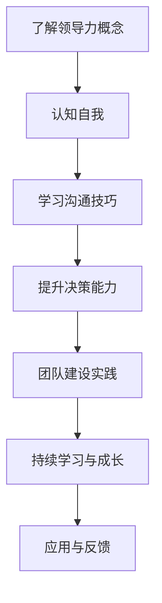
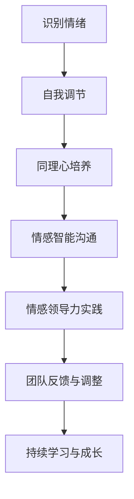

                 

### 文章标题：领导力与情商：提升人际交往能力

在当今社会，领导力与情商已经成为个人成功的关键要素。无论是职场还是日常生活，人际交往能力对于个人的成长和发展都有着至关重要的作用。本文将围绕《领导力与情商：提升人际交往能力》这一主题，深入探讨领导力和情商的定义、核心概念及其在人际交往中的应用，旨在为读者提供一份系统的理解和实用的指南。

### 关键词：
- 领导力
- 情商
- 人际交往
- 能力提升
- 人际关系管理

### 摘要：
本文将首先介绍领导力和情商的基本概念，探讨两者在人际交往中的重要性。接着，我们将详细分析领导力的理论和实践，以及情商的解析和应用。在此基础上，文章将探讨如何将领导力与情商相结合，提升人际交往技巧。最后，通过实际案例和实战应用，我们将总结最佳实践，为读者提供持续成长的策略。

### 目录

## 第1章：引言
### 1.1 领导力与情商的重要性
### 1.2 书的主要内容和目标读者

## 第2章：领导力的理论和实践
### 2.1 领导力的核心概念
### 2.2 不同类型的领导力
### 2.3 领导力的培养和实践
### 2.4 领导力发展的Mermaid流程图

## 第3章：情商的解析和应用
### 3.1 情商的定义和组成部分
### 3.2 情商在人际交往中的作用
### 3.3 如何提升情商
### 3.4 情商提升的伪代码

## 第4章：领导力与情商的融合
### 4.1 领导力与情商的关联
### 4.2 如何将情商应用于领导力中
### 4.3 领导力与情商融合的Mermaid流程图

## 第5章：人际交往技巧
### 5.1 建立良好的人际关系
### 5.2 有效沟通技巧
### 5.3 应对冲突和挑战
### 5.4 成功的人际交往案例

## 第6章：实战应用
### 6.1 如何在具体场景中运用领导力和情商
### 6.2 领导力与情商在职场中的应用
### 6.3 相关工具和技术栈介绍及使用

## 第7章：自我提升与持续成长
### 7.1 自我反思和成长
### 7.2 持续提升领导力和情商
### 7.3 领导力和情商的长期培养策略

## 第1章：引言

### 1.1 领导力与情商的重要性

在现代社会中，领导力和情商已经成为衡量一个人综合能力的重要指标。领导力不仅关乎个人在团队中的作用，更影响到组织的管理效率和发展方向。情商，即情绪智力，指的是个体识别、理解和管理自身情绪，以及识别和理解他人情绪的能力。这两个概念在人际交往中扮演着至关重要的角色，直接影响个人的职业发展和生活质量。

领导力的重要性体现在以下几个方面：

1. **影响力和号召力**：一个具备强大领导力的人能够在团队中树立威信，激发团队成员的积极性和创造力，从而实现共同目标。
2. **团队协作**：领导力有助于建立良好的团队氛围，促进成员之间的沟通与合作，提高团队的整体效能。
3. **决策能力**：优秀的领导者在面对复杂问题时，能够快速做出明智的决策，带领团队朝着正确的方向前进。

情商的重要性则体现在：

1. **自我管理**：情商高的人能够更好地控制自己的情绪，避免因情绪波动而做出错误的决定。
2. **人际交往**：情商高的人擅长理解和表达他人的情感，能够建立良好的人际关系，减少冲突，增强合作。
3. **情绪感染力**：一个具备高情商的人能够传递积极的情绪，影响周围的人，提升团队的整体情绪状态。

### 1.2 书的主要内容和目标读者

本书旨在为读者提供一份全面而系统的领导力和情商提升指南。通过对领导力和情商的深入探讨，本书希望帮助读者：

1. **理解领导力的核心概念和不同类型**：通过理论分析和实际案例，帮助读者建立对领导力的全面理解。
2. **掌握情商的基本原理和应用**：详细解析情商的组成部分，并提供提升情商的具体方法和策略。
3. **结合领导力和情商，提升人际交往能力**：本书将探讨如何将领导力和情商应用于人际交往中，提高个人在社交场合的表现。
4. **实战应用**：通过具体场景和实际案例，提供实用的技巧和方法，帮助读者将理论知识应用到实际生活中。
5. **持续成长**：本书还将为读者提供自我提升和持续成长的策略，帮助读者在领导力和情商方面不断进步。

本书的目标读者包括职场人士、学生、企业管理者等，无论您处于哪个阶段，都可以从本书中获得有价值的知识和启示。通过阅读本书，您将学会如何提升自己的领导力和情商，从而在人际交往中更加得心应手，实现个人和职业的全面发展。

### 第2章：领导力的理论和实践

#### 2.1 领导力的核心概念

领导力是指一个人在团队中影响、激励和引导他人实现共同目标的能力。它不仅包括个人素质和技能，还涉及到对团队和组织文化的理解和管理。领导力并不是一种固有的特质，而是可以通过学习和实践不断提高的能力。

**定义**：领导力被广泛定义为“在团队中引导、激励和影响他人，共同实现目标的过程”。这种定义强调了领导力是一种动态的能力，它需要在实际情境中不断发展和应用。

**特点**：
1. **影响力**：领导力通过影响和激励他人，使其自愿地追随和实现目标。
2. **激励**：领导力能够激发团队成员的积极性，提高其工作动力和效率。
3. **引导**：领导力需要明确方向，引导团队成员朝着共同的目标前进。

#### 2.2 不同类型的领导力

领导力并非单一的形式，根据不同的情境和需求，可以分为多种类型。以下是一些常见的领导力类型：

1. **指令型领导力**：这种类型的领导者通过明确的指令和指导来管理团队，适合在紧急情况下快速做出决策。
   - **优点**：能够迅速统一行动，提高效率。
   - **缺点**：可能导致团队成员缺乏自主性和创造力。

2. **变革型领导力**：这种类型的领导者通过激励和启发团队成员，推动组织进行变革和创新。
   - **优点**：能够激发团队成员的潜力，推动组织发展。
   - **缺点**：变革过程可能面临阻力和挑战。

3. **支持型领导力**：这种类型的领导者注重团队成员的情感需求，提供支持和鼓励。
   - **优点**：能够建立良好的团队氛围，增强团队凝聚力。
   - **缺点**：可能在决策和执行方面缺乏力度。

4. **民主型领导力**：这种类型的领导者鼓励团队成员参与决策过程，共同制定目标。
   - **优点**：能够提高团队成员的参与感和责任感。
   - **缺点**：决策过程可能较为复杂，效率较低。

#### 2.3 领导力的培养和实践

培养领导力需要系统的学习和实践。以下是一些提高领导力的方法和策略：

1. **自我认知**：领导者需要深入了解自己的优势和不足，明确个人目标和价值观。
   - **方法**：通过自我反思、心理测试和职业辅导等方式，提升自我认知。

2. **沟通技巧**：领导者需要具备良好的沟通能力，包括倾听、表达和反馈。
   - **方法**：通过参加沟通技巧培训、实践对话和反馈机制等方式，提高沟通效果。

3. **决策能力**：领导者需要在复杂情境中做出明智的决策。
   - **方法**：通过学习决策理论、实践决策制定和模拟决策情境等方式，提升决策能力。

4. **团队建设**：领导者需要关注团队的建设和发展，建立良好的团队关系。
   - **方法**：通过团队建设活动、团队沟通和反馈机制等方式，增强团队凝聚力。

5. **持续学习**：领导力是一个持续发展的过程，领导者需要不断学习和适应新的环境和挑战。
   - **方法**：通过阅读相关书籍、参加领导力培训和参与行业交流等方式，不断更新知识和技能。

#### 2.4 领导力发展的Mermaid流程图



通过这个流程图，我们可以看到领导力的发展是一个系统的过程，从自我认知到实践应用，每一个环节都至关重要。领导者需要不断学习和调整，以适应不断变化的环境和挑战。

### 第3章：情商的解析和应用

#### 3.1 情商的定义和组成部分

情商（Emotional Intelligence，简称EQ）是指个体识别、理解和管理自身情绪，以及识别和理解他人情绪的能力。情商不仅是情感智商的简称，更是涵盖多个维度的综合能力。

**定义**：情商是一种情感能力，包括自我认知、自我管理、社会技能和同理心等。

**组成部分**：
1. **自我认知**：了解自己的情绪、需求和动机。
2. **自我管理**：控制情绪，管理压力，保持积极态度。
3. **社会技能**：与他人有效沟通、建立良好的人际关系。
4. **同理心**：理解和感受他人的情绪，提供支持和帮助。

#### 3.2 情商在人际交往中的作用

情商在人际交往中发挥着至关重要的作用。具备高情商的人能够更好地处理复杂的人际关系，减少冲突，增强合作。以下是情商在人际交往中的几个关键作用：

1. **沟通能力**：情商高的人能够更好地表达自己的想法和感受，同时也善于倾听他人，理解对方的立场和需求。
2. **冲突管理**：情商高的人能够冷静地处理冲突，避免情绪化的反应，找到双方都能接受的解决方案。
3. **团队合作**：情商高的人能够建立良好的团队氛围，增强团队凝聚力，提高工作效率。
4. **领导力**：情商高的人具备强大的领导力，能够激励团队成员，实现共同目标。
5. **人际关系**：情商高的人能够建立深厚的人际关系，获得他人的信任和尊重。

#### 3.3 如何提升情商

提升情商并非一蹴而就，需要通过系统的学习和实践。以下是一些提升情商的方法：

1. **自我反思**：定期进行自我反思，了解自己的情绪变化和反应方式，找到改进的方向。
2. **情绪管理**：学习情绪管理技巧，如深呼吸、冥想和放松训练，帮助自己控制情绪，保持冷静。
3. **沟通技巧**：提高沟通技巧，学会倾听和表达，增强与他人的沟通效果。
4. **同理心培养**：通过阅读、观察和体验，培养同理心，更好地理解他人的情绪和需求。
5. **人际关系练习**：积极参与社交活动，与他人建立联系，提高人际交往能力。

#### 3.4 情商提升的伪代码

```python
def improve_emotional_intelligence():
    # 自我反思
    self_reflection()

    # 情绪管理
    emotion_management()

    # 沟通技巧
    communication_skills()

    # 同理心培养
    empathy_training()

    # 人际关系练习
    relationship_practice()

def self_reflection():
    # 记录情绪日志
    log_emotions()

    # 分析情绪反应
    analyze_emotion_reactions()

def emotion_management():
    # 深呼吸练习
    deep_breathing()

    # 冥想训练
    meditation()

def communication_skills():
    # 倾听技巧
    listening_skills()

    # 表达技巧
    expressing_skills()

def empathy_training():
    # 阅读他人情感
    read_emotions()

    # 观察他人行为
    observe_behavior()

def relationship_practice():
    # 参加社交活动
    social_activities()

    # 建立深度联系
    build_deeper_connections()
```

通过这个伪代码，我们可以看到提升情商是一个多步骤、系统化的过程。每一个步骤都需要精心设计和实践，才能逐步提高个人的情商水平。

### 第4章：领导力与情商的融合

#### 4.1 领导力与情商的关联

领导力和情商之间存在紧密的关联。高情商的领导者不仅能够更好地管理自身情绪，还能敏锐地感知和应对团队成员的情绪变化。以下是领导力与情商的几个关键关联：

1. **情绪调节**：领导者通过情商来调节自身情绪，以保持冷静和专注，从而做出明智的决策。
2. **同理心**：领导者通过情商培养同理心，能够更好地理解和支持团队成员，建立信任和合作关系。
3. **沟通**：领导者通过情商提升沟通技巧，能够更有效地传达信息和激励团队成员。
4. **团队凝聚力**：领导者通过情商增强团队凝聚力，减少冲突，提高团队的整体效能。
5. **领导风格**：领导力与情商的结合，可以形成更加灵活和适应性强的领导风格，适应不同的团队和情境。

#### 4.2 如何将情商应用于领导力中

将情商应用于领导力中，需要领导者具备以下能力：

1. **情绪自我调节**：领导者需要学会识别和调节自身情绪，以避免情绪对决策和行为的负面影响。
2. **同理心**：领导者需要培养同理心，理解团队成员的情绪和需求，建立信任和合作关系。
3. **情感智能沟通**：领导者需要通过情商提升沟通技巧，确保信息传达的准确性和有效性。
4. **情感领导力**：领导者需要将情商融入领导实践中，通过情感智慧来激励和引导团队成员。

以下是具体的方法：

1. **情绪自我监控**：领导者可以定期进行自我反思，了解自己的情绪变化，并采取相应的调节措施。
2. **同理心实践**：领导者可以通过主动倾听和表达关怀来培养同理心，例如，在会议中关注团队成员的情感反应，并在适当的时候提供支持和鼓励。
3. **情感智能培训**：领导者可以参加情商培训课程，学习情感智能的理论和实践技巧。
4. **反馈与反思**：领导者需要定期与团队成员进行反馈和反思，了解自己的领导风格对团队的影响，并根据反馈进行调整。

#### 4.3 领导力与情商融合的Mermaid流程图



通过这个流程图，我们可以看到领导力与情商的融合是一个持续的过程，需要领导者不断地自我监控、实践和反思，以实现个人和团队的共同成长。

### 第5章：人际交往技巧

#### 5.1 建立良好的人际关系

建立良好的人际关系是提升人际交往能力的重要一步。以下是几个关键步骤：

1. **主动交往**：积极参与社交活动，主动与他人建立联系。
2. **真诚待人**：真诚地对待他人，展示出真实的自我，建立信任基础。
3. **倾听**：倾听他人说话，表现出对对方的关注和理解。
4. **沟通**：提高沟通技巧，确保信息传达的清晰和准确。

#### 5.2 有效沟通技巧

有效沟通是人际交往的核心。以下是几个提高沟通效果的技巧：

1. **明确目标**：在沟通前明确自己的目标和期望，确保沟通的针对性。
2. **倾听**：积极倾听对方的意见和需求，避免打断对方。
3. **表达**：清晰、简洁地表达自己的想法和感受，避免使用模糊和含糊的语言。
4. **非语言沟通**：注意身体语言、面部表情和语气等非语言因素，增强沟通效果。
5. **反馈**：在沟通后及时给予反馈，确认对方是否理解了自己的意图。

#### 5.3 应对冲突和挑战

冲突和挑战是人际交往中不可避免的。以下是一些应对冲突和挑战的方法：

1. **冷静分析**：在冲突发生时保持冷静，避免情绪化的反应。
2. **寻找共同点**：寻找双方都能接受的解决方案，建立共识。
3. **换位思考**：尝试从对方的角度思考问题，理解对方的立场和感受。
4. **有效沟通**：通过有效沟通解决分歧，避免误解和误会的积累。
5. **寻求第三方帮助**：在必要时，寻求第三方帮助，如调解人或咨询师，以解决问题。

#### 5.4 成功的人际交往案例

以下是几个成功的人际交往案例，从中我们可以学到一些实用的技巧：

1. **案例1**：一位销售经理通过真诚和倾听，成功与客户建立了长期的合作关系。他定期与客户沟通，了解客户的需求和反馈，从而提供了更优质的服务。

2. **案例2**：一位项目经理通过有效沟通和团队协作，成功完成了复杂的项目。他在项目中注重团队成员的参与和反馈，确保每个人都能充分发挥自己的能力。

3. **案例3**：一位企业家通过同理心和情感智慧，建立了强大的团队和良好的企业文化。他关注团队成员的情感需求，提供支持和鼓励，从而增强了团队的凝聚力和战斗力。

通过这些案例，我们可以看到成功的人际交往离不开真诚、倾听、沟通和同理心等关键要素。在人际交往中，我们需要不断学习和实践，以提高自己的交往能力。

### 第6章：实战应用

#### 6.1 如何在具体场景中运用领导力和情商

在具体场景中，领导力和情商的运用需要根据实际情况灵活调整。以下是一些实用的策略：

1. **团队会议**：在团队会议中，领导者可以通过情商提升沟通效果。例如，倾听团队成员的意见，表达感激和鼓励，确保每个成员都能参与讨论。

2. **冲突解决**：当团队出现冲突时，领导者可以运用情商进行调解。例如，保持冷静，理解双方的立场，引导双方寻找共同点。

3. **员工激励**：领导者可以通过情商激励团队成员。例如，关注员工的情感需求，提供个性化支持和鼓励，激发员工的积极性和创造力。

4. **项目执行**：在项目执行过程中，领导者可以通过情商确保团队的协调和合作。例如，定期与团队成员沟通进展，提供支持和资源，确保项目顺利进行。

#### 6.2 领导力与情商在职场中的应用

在职场中，领导力和情商的应用对于个人和组织的成功都至关重要。以下是一些具体的应用场景：

1. **团队合作**：通过领导力和情商，领导者可以建立高效的团队，提升团队绩效。例如，通过同理心和理解团队成员的需求，领导者可以更好地激发团队的潜力。

2. **员工管理**：领导者通过情商管理员工，可以提高员工满意度和留存率。例如，通过有效的沟通和反馈，领导者可以解决员工的问题，增强员工的归属感和忠诚度。

3. **客户关系**：在客户关系管理中，情商高的人能够更好地理解和满足客户需求，建立长期的合作关系。例如，通过倾听和同理心，销售人员可以更好地了解客户的需求，提供个性化的解决方案。

4. **领导力发展**：职场中，领导力的发展是个人职业成长的重要一环。通过情商提升，领导者可以更好地自我认知，提高决策能力和团队管理能力。

#### 6.3 相关工具和技术栈介绍及使用

为了更好地运用领导力和情商，一些工具和技术栈可以帮助领导者提高效率和能力。以下是一些常用的工具：

1. **情绪识别工具**：如情绪识别软件和情商测试工具，可以帮助领导者了解自己的情绪变化，进行自我调节。

2. **团队协作平台**：如Slack、Trello和Microsoft Teams等，可以提高团队沟通和协作效率。

3. **领导力发展课程**：如在线课程、工作坊和领导力培训，可以帮助领导者提升领导力和情商。

4. **反馈机制**：建立定期的反馈机制，如员工满意度调查和领导力评估，可以帮助领导者了解自己的表现，进行改进。

通过这些工具和技术栈，领导者可以更有效地运用领导力和情商，提升个人和团队的绩效。

### 第7章：自我提升与持续成长

#### 7.1 自我反思和成长

自我反思是个人成长的重要环节。通过定期反思，我们可以了解自己的优点和不足，找到改进的方向。以下是一些自我反思的方法：

1. **日记法**：每天记录自己的情绪、行为和反思，帮助自己更好地认识自己。
2. **思考时间**：每周安排一段时间进行深入思考，回顾自己的行为和决策，分析其效果和影响。
3. **反馈**：定期与同事、朋友或导师交流，获取他们的反馈和建议。

#### 7.2 持续提升领导力和情商

领导力和情商的提升是一个持续的过程。以下是一些持续提升的方法：

1. **学习**：通过阅读书籍、参加培训课程和在线学习，不断更新自己的知识和技能。
2. **实践**：将所学应用到实际工作中，通过实践不断积累经验和提高能力。
3. **反馈**：定期接受反馈，了解自己的优势和不足，并根据反馈进行调整。
4. **反思**：通过反思和总结，不断优化自己的行为和决策。

#### 7.3 领导力和情商的长期培养策略

为了实现长期的领导力和情商提升，以下是一些策略：

1. **设定目标**：明确自己的长期职业目标和个人发展目标，制定具体的行动计划。
2. **建立支持系统**：寻找导师、教练或同行，建立支持系统，共同学习和成长。
3. **持续学习**：保持学习的热情，不断探索新的知识和技能。
4. **反思和调整**：定期进行反思和总结，根据反馈和实际情况调整自己的发展和提升策略。
5. **实践**：通过实际工作和项目，不断实践和应用所学，提高自己的能力。

通过这些策略，我们可以实现长期的领导力和情商提升，为个人和职业发展打下坚实的基础。

---

**文章小结**：

本文围绕《领导力与情商：提升人际交往能力》这一主题，系统探讨了领导力和情商的定义、核心概念及其在人际交往中的应用。通过理论分析和实际案例，我们了解了领导力与情商的紧密关联，以及如何将两者融合，提升人际交往技巧。最后，通过实战应用和持续成长策略，我们为读者提供了实用的指南和方法。希望本文能够帮助您在领导力和情商方面取得更大的进步，实现个人和职业的全面发展。

**注意事项**：

- 在实际应用中，要结合自身情况和具体环境，灵活运用领导力和情商。
- 定期进行自我反思和总结，及时调整自己的行为和决策。
- 保持学习的热情，不断提升自己的知识和技能。

**拓展阅读**：

- 《情商：为什么情商比智商更重要》
- 《影响力：为什么人们会不假思索地服从》
- 《团队协作：高效团队如何运作》

通过阅读这些书籍，您可以进一步深入了解领导力、情商和人际交往的深度和广度。

---

### 作者信息

作者：AI天才研究院/AI Genius Institute & 禅与计算机程序设计艺术 /Zen And The Art of Computer Programming

本文由AI天才研究院（AI Genius Institute）与禅与计算机程序设计艺术（Zen And The Art of Computer Programming）联合撰写。我们致力于探索人工智能的深度和广度，为读者提供高质量的技术内容。如果您对我们的文章有任何建议或反馈，欢迎随时与我们联系。感谢您的阅读和支持！

