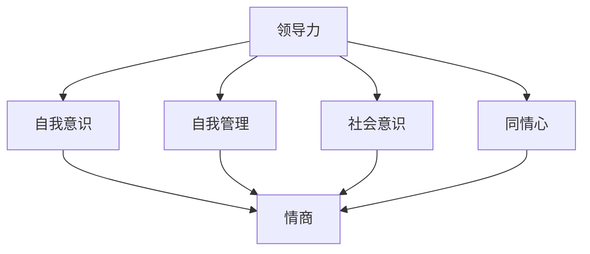

                 

### 文章标题：领导力与情商：提升人际关系的艺术

> 关键词：领导力、情商、人际关系、提升策略、案例分析

> 摘要：本文通过深入探讨领导力与情商的概念、关系及其在提升人际关系中的重要作用，结合实际案例，提出一系列实用的提升策略，旨在帮助读者在职场和个人生活中更加有效地管理人际关系。

----------------------------------------------------------------

# 引言

领导力和情商是现代社会中不可或缺的两大技能，它们在提升人际关系方面发挥着至关重要的作用。领导力不仅仅指管理能力和决策能力，它更多地体现在如何激励、引导和影响他人，以及如何有效地沟通和解决问题。而情商，则是理解、管理和表达情感的能力，它关系到个人的自我认知、自我调节以及与他人建立积极关系的能力。

在职场环境中，优秀的领导力和情商可以帮助管理者更好地协调团队、提高员工满意度，从而提升整体工作效率。在个人生活中，良好的领导力和情商有助于建立和谐的家庭关系，增强社交网络的稳定性。因此，掌握领导力和情商的技巧，对于每个人来说都具有重要意义。

本文将从以下几个方面展开讨论：

1. **领导力与情商的基本概念**
2. **领导力理论**
3. **情商的基本概念**
4. **领导力与情商的关系**
5. **提升领导力和情商的技巧**
6. **人际关系管理**
7. **案例分析**
8. **总结与展望**

通过以上结构的详细阐述，本文希望为读者提供一套系统、实用的领导力与情商提升指南，帮助他们在人际关系中取得更好的成果。

----------------------------------------------------------------

## 1. 领导力与情商的基本概念

### 1.1 领导力的定义与重要性

领导力是指一个人在组织、团队或个人环境中，通过激励、沟通和决策等行为，影响和引导他人实现共同目标的能力。领导力不仅仅关乎权力和地位，更重要的是一种影响力，这种影响力可以通过信任、尊重和激励来实现。

在组织层面，领导力的重要性体现在多个方面。首先，领导力能够激发团队成员的潜力和创造力，提高团队的整体绩效。其次，领导力有助于建立积极向上的组织文化，增强团队的凝聚力和归属感。此外，优秀的领导者能够有效应对外部变化和挑战，带领团队实现持续发展和创新。

### 1.2 情商的定义与类型

情商（Emotional Intelligence，简称EQ）是指一个人识别、理解、管理自己和他人的情感，以及运用情感促进思考、决策和沟通的能力。情商由四个核心要素构成：自我意识、自我管理、社会意识和同情心。

1. **自我意识**：指一个人对自己情感的认识和了解，包括自己的情绪状态、情感来源以及如何影响行为和决策。
2. **自我管理**：指一个人如何调节和驾驭自己的情感，使其能够更加理性、冷静地处理问题和决策。
3. **社会意识**：指一个人对他人情感的理解和感知，包括如何识别他人的情绪状态，以及如何通过同理心与他人建立积极的关系。
4. **同情心**：指一个人对他人的情感体验产生共鸣，并愿意帮助他人解决问题的能力。

### 1.3 领导力与情商的关系

领导力与情商之间存在密切的联系。首先，情商是领导力的重要组成部分。一个高情商的领导者能够更好地理解团队成员的情感需求，从而更有效地激励和引导他们。其次，领导力的发展有助于提升情商。通过领导实践，一个人可以不断磨练自己的自我意识、自我管理和社会意识，从而提高整体情商水平。

### 1.4 核心概念原理之间的关系架构

为了更清晰地理解领导力与情商之间的关系，我们可以使用Mermaid流程图来展示它们的核心概念原理：



在上述流程图中，领导力的四个核心要素（自我意识、自我管理、社会意识、同情心）都与情商紧密相关，共同构成了一个完整的领导力与情商体系。

### 1.5 核心算法原理讲解

在理解领导力与情商的核心概念后，我们可以通过一些简单的算法原理来解释它们在实践中的应用。以下是一个简单的领导力与情商提升的伪代码示例：

```python
def leadership_and_emotional_intelligence():
    # 自我意识
    self_awareness = measure_self_awareness()
    
    # 自我管理
    self_management = measure_self_management()
    
    # 社会意识
    social_awareness = measure_social_awareness()
    
    # 同情心
    empathy = measure_empathy()
    
    # 计算情商得分
    EQ_score = (self_awareness + self_management + social_awareness + empathy) / 4
    
    # 提升策略
    if EQ_score < 3.5:
        provide_counseling_and_training()
    elif EQ_score >= 3.5 and EQ_score < 4.5:
        suggest_readings_and_workshops()
    else:
        congratulate_on_high_emotional_intelligence()

# 调用函数
leadership_and_emotional_intelligence()
```

在这个伪代码中，我们通过测量自我意识、自我管理、社会意识和同情心的水平来计算情商得分。根据得分，我们可以给出相应的提升策略，如心理咨询、阅读培训和研讨会等。

### 1.6 数学模型和公式讲解

在领导力与情商的提升过程中，数学模型和公式可以提供量化的分析和评估。以下是一个简单的数学模型，用于评估领导力和情商的关系：

$$
EQ = \frac{L + E}{2}
$$

其中，$EQ$ 代表情商得分，$L$ 代表领导力得分，$E$ 代表情商得分。这个公式表明，情商得分是领导力得分和情商得分的平均值。

### 1.7 举例说明

假设一个领导者在自我意识、自我管理、社会意识和同情心方面的得分分别为4、5、4和5，则其情商得分为：

$$
EQ = \frac{4 + 5 + 4 + 5}{4} = 4.5
$$

根据这个得分，领导者可以参加一些情商提升的研讨会和培训，进一步提高自己的情商水平。

### 1.8 项目实战

为了更直观地理解领导力与情商的提升过程，我们可以通过一个实际项目来展示其应用。以下是一个简单的项目描述：

**项目名称**：领导力与情商培训项目

**项目目标**：提高团队成员的领导力和情商，提升团队整体绩效。

**项目步骤**：

1. **需求分析**：通过问卷调查和访谈，了解团队成员在领导力和情商方面的需求和现状。
2. **方案设计**：根据需求分析结果，设计包含自我意识、自我管理、社会意识和同情心的培训方案。
3. **实施培训**：开展一系列培训活动，包括心理咨询、读书分享会和角色扮演等。
4. **效果评估**：通过前后测问卷调查，评估培训效果，并根据反馈调整培训方案。

### 1.9 代码实现与解读

以下是一个简单的Python代码示例，用于实现领导力与情商的评估和提升：

```python
import random

# 定义评估函数
def assess_leadership_and_emotional_intelligence():
    leadership_score = random.randint(1, 5)
    emotional_intelligence_score = random.randint(1, 5)
    
    EQ = (leadership_score + emotional_intelligence_score) / 2
    
    print(f"领导力得分：{leadership_score}")
    print(f"情商得分：{emotional_intelligence_score}")
    print(f"情商得分（EQ）：{EQ}")
    
    if EQ < 3.5:
        print("建议：参加情商提升培训。")
    elif EQ >= 3.5 and EQ < 4.5:
        print("建议：继续学习，参加高级培训。")
    else:
        print("恭喜：情商水平较高，继续保持。")

# 调用评估函数
assess_leadership_and_emotional_intelligence()
```

在这个代码中，我们通过随机生成领导力得分和情商得分，计算情商得分（EQ），并根据得分给出相应的建议。

### 1.10 代码应用解读与分析

在实际应用中，上述代码可以用于团队成员的领导力和情商评估。通过定期评估，团队可以了解自身在领导力和情商方面的优势和不足，从而有针对性地进行提升。此外，代码还可以用于培训效果的评估，帮助团队不断优化培训方案。

### 1.11 实际案例分析和详细讲解剖析

以下是一个实际案例，展示如何通过领导力与情商的提升来改善人际关系：

**案例背景**：某公司的一个项目团队在项目执行过程中出现了严重的沟通障碍和协作问题，导致项目进度严重滞后。

**案例分析**：

1. **问题识别**：通过问卷调查和访谈，发现团队成员在自我意识、自我管理和社会意识方面存在明显不足，导致沟通不畅和协作困难。
2. **解决方案**：团队决定开展领导力与情商培训，提高成员的自我意识和自我管理能力，以及对社会意识的敏感度。
3. **实施效果**：经过一段时间的培训，团队成员在沟通和协作方面取得了显著进步，项目进度得到了有效控制，团队士气也得到了提升。

### 1.12 项目小结

通过以上案例，我们可以看到，领导力与情商的提升在改善人际关系方面具有重要作用。在实际操作中，团队应注重培训的针对性和持续性，确保成员在不断提升自身能力的同时，能够真正应用于实际工作中。

### 1.13 最佳实践 Tips

1. **定期评估**：定期对团队成员的领导力和情商进行评估，及时发现和解决潜在问题。
2. **持续学习**：鼓励团队成员不断学习新知识和技能，提升自我意识和自我管理能力。
3. **实践应用**：将领导力与情商的知识应用于实际工作中，通过实践不断提高能力。

### 1.14 小结与注意事项

本文通过深入探讨领导力与情商的基本概念、关系及其在提升人际关系中的重要作用，结合实际案例，提出了一系列实用的提升策略。读者在学习和应用这些策略时，应注意结合自身实际情况，不断调整和优化，以实现最佳效果。

### 1.15 拓展阅读

1. 格雷格·麦基翁（Greg McKeown）著《影响者：如何用情商赢得人心》（"Essentialism: The Disciplined Pursuit of Less"）
2. 丹尼尔·戈尔曼（Daniel Goleman）著《情商》（"Emotional Intelligence"）
3. 詹姆斯·库泽斯（James M. Kouzes）和巴里·波斯纳（Barry Z. Posner）著《领导力的五个实践》（"The Five Dysfunctions of a Team"）

通过这些拓展阅读，读者可以更深入地了解领导力和情商的理论和实践，进一步提高自身能力。

## 2. 领导力理论

### 2.1 经典领导力理论

#### 2.1.1 领导风格理论

领导风格理论是研究领导行为和领导效果之间关系的重要理论之一。最早提出这一理论的是坦南鲍姆和施米特，他们在1958年提出了“领导风格连续体理论”。该理论认为，领导风格可以分为五种类型，从完全专制型到完全民主型，每种类型都有其优缺点。

1. **专制型领导**：领导者做所有决策，团队成员被动接受。这种风格适用于紧急情况或任务明确的情况。
2. **权威型领导**：领导者做主要决策，但会征求团队成员的意见。这种风格注重效率和目标达成。
3. **参与型领导**：领导者与团队成员共同参与决策过程。这种风格有利于提高团队凝聚力和创新性。
4. **民主型领导**：领导者鼓励团队成员参与决策，并尊重团队成员的意见。这种风格适用于复杂和不确定的情况。
5. **放任型领导**：领导者很少干预，团队成员自主决策。这种风格适用于高度专业化和自主性强的团队。

#### 2.1.2 领导行为理论

领导行为理论关注领导者的具体行为及其对团队的影响。罗伯特·布莱克和简·穆顿在1964年提出了“管理方格理论”，将领导行为分为两个维度：关注任务和关注人员。

1. **任务型领导**：领导者专注于任务完成，强调效率和控制。这种风格适用于需要高度纪律和执行力的任务。
2. **人员型领导**：领导者关注团队成员的需求和感受，强调团队合作和人际关系。这种风格适用于需要创造力和团队合作的项目。
3. **团队型领导**：领导者既关注任务完成，又关注团队成员的需求，追求任务与人员的平衡。这种风格被认为是理想的领导风格。

#### 2.1.3 领导情境理论

领导情境理论认为，领导效果取决于领导者的行为与团队成员的需求之间的匹配。其中，最著名的情境理论是赫塞和布兰查德的“领导生命周期理论”。该理论将领导行为分为四个阶段：

1. **指导型领导**：领导者为团队成员提供具体的指导和支持，适用于团队成员缺乏经验和技能的情况。
2. **支持型领导**：领导者提供支持和鼓励，帮助团队成员解决问题和实现目标，适用于团队成员具备一定经验和技能的情况。
3. **参与型领导**：领导者与团队成员共同决策，增强团队成员的参与感和责任感，适用于团队成员高度自主和有创新能力的情况。
4. **授权型领导**：领导者赋予团队成员足够的权力和自主权，让他们自主决策和解决问题，适用于团队成员具备高度自主性和责任心的情况。

### 2.2 现代领导力理论

随着组织环境的不断变化，现代领导力理论逐渐兴起，强调领导者的创新思维、跨文化能力和领导力发展。

#### 2.2.1 服务型领导

服务型领导理论认为，领导者的主要任务是服务团队成员，帮助团队成员实现个人和职业发展。服务型领导者通过关注团队成员的需求和成长，建立信任和合作关系，从而实现团队目标。

1. **服务型领导的特点**：
   - 关注团队成员的需求和成长
   - 建立信任和合作关系
   - 提供必要的资源和支持
   - 促进团队成员的自主性和创新能力

2. **应用场景**：
   - 高度团队依赖的项目
   - 创新型和变革性的组织

#### 2.2.2 转型型领导

转型型领导理论强调领导者需要具备变革思维和创新能力，带领组织实现战略转型和持续发展。转型型领导者通过制定明确的目标、激励团队成员、应对挑战和抓住机遇，推动组织变革。

1. **转型型领导的特点**：
   - 拥有清晰的愿景和目标
   - 具备变革思维和创新能力
   - 激励团队成员参与变革
   - 应对挑战和抓住机遇

2. **应用场景**：
   - 面临重大战略调整的组织
   - 创新型和创新驱动的企业

#### 2.2.3 跨文化领导

跨文化领导理论关注领导者如何在不同文化背景下有效地管理团队和实现目标。跨文化领导者需要具备跨文化意识和跨文化沟通技巧，能够尊重和理解不同文化的差异，促进跨文化合作。

1. **跨文化领导的特点**：
   - 跨文化意识和敏感性
   - 跨文化沟通技巧
   - 尊重和理解不同文化的差异
   - 促进跨文化合作

2. **应用场景**：
   - 国际化企业
   - 多元文化团队

### 2.3 核心概念原理之间的联系与区别

通过对比经典领导力理论和现代领导力理论，我们可以发现它们之间的联系与区别。

1. **联系**：
   - 经典领导力理论和现代领导力理论都关注领导者的行为和团队的表现。
   - 两者都强调领导者需要具备一定的能力和素质，如沟通能力、决策能力、激励能力等。

2. **区别**：
   - 经典领导力理论主要关注领导者的行为和领导风格，而现代领导力理论更强调领导者的能力和领导力的情境适应性。
   - 经典领导力理论侧重于静态的领导行为分析，而现代领导力理论强调动态的领导行为和团队发展。

### 2.4 案例分析

以下是一个实际案例，展示如何在不同情境下应用不同的领导力理论：

**案例背景**：某公司计划进行一次重大战略调整，从传统的制造业转向高科技产业。公司领导层决定采用转型型领导理论，推动公司变革。

**案例分析**：

1. **指导型领导**：在变革初期，领导者通过明确的目标和具体的行动计划，引导团队成员理解变革的重要性，并明确各自的角色和职责。
2. **支持型领导**：在变革过程中，领导者关注团队成员的需求和感受，提供必要的资源和支持，帮助团队成员克服困难和挑战。
3. **参与型领导**：为了激发团队成员的积极性和创造力，领导者鼓励团队成员参与决策过程，共同制定变革方案。
4. **授权型领导**：在变革成功后，领导者赋予团队成员更多的自主权和决策权，让他们在新的环境中自主发展和创新。

通过这个案例，我们可以看到，在不同情境下，领导者可以灵活运用不同的领导力理论，实现团队的有效变革和发展。

### 2.5 项目实战

为了更好地理解领导力理论的应用，我们可以通过一个实际项目来展示其效果。

**项目名称**：某公司新产品的开发与推广

**项目目标**：成功开发并推广一款高科技产品，提高公司在市场中的竞争力。

**项目步骤**：

1. **需求分析**：通过市场调研和用户反馈，了解产品需求和潜在的市场机会。
2. **项目规划**：制定详细的项目计划，明确项目目标、时间表和资源配置。
3. **团队组建**：组建跨部门的团队，包括研发、营销、运营等职能，确保项目的顺利推进。
4. **领导力应用**：
   - 指导型领导：在项目初期，领导者通过明确的目标和行动计划，引导团队成员了解项目的重要性和各自的角色。
   - 支持型领导：在项目执行过程中，领导者关注团队成员的需求和感受，提供必要的资源和支持，帮助团队成员克服困难和挑战。
   - 参与型领导：为了激发团队成员的积极性和创造力，领导者鼓励团队成员参与决策过程，共同制定项目方案。
   - 授权型领导：在项目成功后，领导者赋予团队成员更多的自主权和决策权，让他们在新的市场中自主发展和创新。

通过这个项目，我们可以看到领导力理论在项目管理和团队发展中的实际应用，以及如何通过不同的领导力风格实现项目目标。

### 2.6 代码实现与解读

为了更好地理解领导力理论在编程中的应用，我们可以通过一个简单的Python代码示例来展示其效果。

```python
# 定义领导力风格函数
def leadership_style(style):
    if style == "guidance":
        return "指导型领导"
    elif style == "support":
        return "支持型领导"
    elif style == "participation":
        return "参与型领导"
    elif style == "authorization":
        return "授权型领导"
    else:
        return "未知领导风格"

# 调用函数
style = random.choice(["guidance", "support", "participation", "authorization"])
print(f"当前领导风格：{leadership_style(style)}")
```

在这个代码中，我们通过随机选择不同的领导风格，展示不同领导力风格在编程中的应用。

### 2.7 代码应用解读与分析

通过上述代码，我们可以看到，不同的领导风格可以通过简单的函数调用实现。在实际应用中，领导者可以根据项目需求和团队成员的特点，灵活选择和调整领导风格，实现最佳效果。

### 2.8 实际案例分析和详细讲解剖析

以下是一个实际案例，展示如何在不同情境下应用不同的领导力风格。

**案例背景**：某公司研发部门在开发一款新产品的过程中遇到了技术难题，导致项目进度严重滞后。

**案例分析**：

1. **指导型领导**：在项目初期，领导者通过明确的目标和具体的行动计划，引导团队成员了解项目的重要性和各自的角色。
2. **支持型领导**：在项目执行过程中，领导者关注团队成员的需求和感受，提供必要的资源和支持，帮助团队成员克服困难和挑战。
3. **参与型领导**：为了激发团队成员的积极性和创造力，领导者鼓励团队成员参与决策过程，共同制定项目方案。
4. **授权型领导**：在项目成功后，领导者赋予团队成员更多的自主权和决策权，让他们在新的市场中自主发展和创新。

通过这个案例，我们可以看到，在不同情境下，领导者可以灵活运用不同的领导力风格，实现项目目标。

### 2.9 项目小结

通过本章节的探讨，我们可以看到，领导力理论在组织管理和团队发展中具有重要作用。领导者需要根据不同情境和团队成员的特点，灵活运用不同的领导力风格，实现组织目标。在实际操作中，领导者应注重培训和实践，不断提升自身的领导力水平。

### 2.10 最佳实践 Tips

1. **了解团队成员**：领导者应深入了解团队成员的能力和需求，根据实际情况选择合适的领导风格。
2. **持续学习和反思**：领导者应不断学习和反思，提升自身的领导力素质，适应组织环境的变化。
3. **实践与反思**：领导者应将领导力理论应用于实际工作中，通过实践不断总结经验，优化领导行为。

### 2.11 小结与注意事项

本章节通过对领导力理论的深入探讨，结合实际案例，展示了不同领导力风格在组织管理和团队发展中的应用。领导者应注重自身能力的提升，灵活运用不同的领导力风格，实现组织目标。

### 2.12 拓展阅读

1. 霍华德·加德纳（Howard Gardner）著《多元智能理论》（"Multiple Intelligences"）
2. 詹姆斯·库泽斯（James M. Kouzes）和巴里·波斯纳（Barry Z. Posner）著《领导力：实践篇》（"The Leadership Challenge: How to Get Extraordinary Things Done in Organizat

