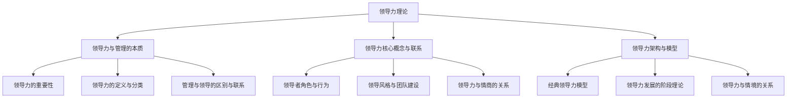

                 

# 《领导力与情商：提升人际关系管理能力》

> 关键词：领导力，情商，人际关系管理，组织绩效，个人成长

> 摘要：本文旨在探讨领导力与情商在提升人际关系管理能力方面的作用。通过对领导力的理论解析、情商的概念及其在领导力中的应用分析，结合具体案例，详细阐述领导力与情商在组织管理和个人成长中的实践应用，为读者提供提升人际关系管理能力的有效策略和方法。

## 第一部分：领导力理论解析

### 1.1 领导力的重要性

领导力是任何组织和团队成功的关键因素之一。在IT行业，领导力不仅体现在技术能力和项目管理上，更体现在对团队协作和人际关系的有效管理上。一个优秀的领导者能够激发团队成员的潜力，提升团队的整体绩效，从而实现组织的战略目标。

#### 1.2 领导力的定义与分类

领导力是指个体在团队中通过影响力、沟通和激励等手段，引导和影响团队成员，实现共同目标的能力。根据领导者的行为和风格，领导力可以分为以下几类：

- **权威型领导**：领导者通过权威和强制手段来管理团队，强调规则和纪律。

- **民主型领导**：领导者鼓励团队成员参与决策，注重团队意见和共识。

- **变革型领导**：领导者通过激励和启发，推动团队成员进行创新和变革。

- **教练型领导**：领导者通过指导和培养，帮助团队成员提升技能和素质。

#### 1.3 管理与领导的区别与联系

管理是指通过计划、组织、领导和控制等手段，实现组织目标的系统性活动。领导力是管理的一个重要组成部分，但与管理有明显的区别：

- **管理侧重于任务的执行和控制，而领导力侧重于激励和影响。**

- **管理者负责分配资源和监督工作进度，领导者则负责建立愿景和激发团队潜力。**

- **管理是维持现状，而领导力则是推动变革。**

然而，领导力与管理并非孤立存在，它们之间有着密切的联系：

- **有效的领导力能够促进管理效率的提升。**

- **优秀的管理者通常具备出色的领导力。**

### 1.4 领导力架构与模型

领导力的构建离不开科学的架构和模型。以下是一些经典的领导力模型：

#### 经典领导力模型

- **菲德勒模型**：认为领导力效果取决于领导者与情境的匹配程度。

- **赫塞-布兰查德模型**：提出领导风格与下属成熟度之间的关系。

- **路径-目标理论**：强调领导者通过设定目标和提供路径来指导下属。

#### 领导力发展的阶段理论

- **鲍恩模型**：将领导力发展分为依赖期、独立期、互赖期和协作期。

- **卡茨模型**：认为领导者需要具备技术技能、人际技能和概念技能。

#### 领导力与情境的关系

- **情境领导模型**：认为领导风格应随情境变化而调整。

- **领导力双因素理论**：认为领导力效果取决于任务结构和关系。

## 第二部分：情商在领导力中的应用

### 2.1 情商的概念与重要性

情商（Emotional Intelligence，简称EQ）是指个体识别、理解、管理自己和他人的情绪，以及运用情绪促进思考、解决问题和人际交往的能力。情商在领导力中具有至关重要的作用：

- **提升沟通效果**：情商高的领导者能够更好地理解下属的情绪和需求，提高沟通效率。

- **增强团队凝聚力**：情商高的领导者能够建立互信和积极的团队氛围。

- **优化决策过程**：情商高的领导者能够更好地识别风险和机会，做出明智的决策。

### 2.2 情商在领导力中的作用

#### 2.2.1 情商在团队建设中的应用

团队建设是领导力的重要方面之一。情商高的领导者能够：

- **识别团队成员的情绪和需求**：通过观察和交流，了解团队成员的情绪状态，为他们提供支持和帮助。

- **建立积极的团队文化**：通过鼓励开放沟通和互相尊重，营造积极向上的团队氛围。

- **协调团队冲突**：通过倾听和理解，找到冲突的根本原因，提出有效的解决方案。

#### 2.2.2 情商在团队协作中的影响

团队协作是团队成功的关键。情商高的领导者能够：

- **促进团队成员的互动**：通过鼓励团队成员分享想法和经验，提高协作效率。

- **提高团队成员的满意度**：通过关注团队成员的情绪和需求，提升他们的工作满意度和忠诚度。

- **提升团队绩效**：通过有效的团队协作，实现团队目标。

#### 2.2.3 情商在冲突管理中的作用

冲突是团队工作中不可避免的现象。情商高的领导者能够：

- **识别冲突的根源**：通过倾听和理解，找到冲突的根本原因。

- **提出有效的解决方案**：通过沟通和协调，提出双方都能接受的解决方案。

- **预防冲突的发生**：通过建立积极的团队文化和有效的沟通机制，减少冲突的发生。

### 2.3 提升情商的策略与方法

#### 2.3.1 自我认知

自我认知是提升情商的基础。领导者可以通过以下方法提升自我认知：

- **反思**：定期反思自己的情绪和行为，了解自己的情绪反应。

- **倾听**：倾听他人的意见和反馈，了解自己的情绪对他人的影响。

- **自我监控**：通过自我监控，了解自己的情绪变化，调整情绪反应。

#### 2.3.2 自我管理

自我管理是情商的核心。领导者可以通过以下方法提升自我管理能力：

- **情绪调节**：学会控制情绪，避免情绪波动影响工作。

- **压力管理**：学会应对压力，保持心理平衡。

- **情绪释放**：找到合适的渠道，释放负面情绪。

#### 2.3.3 社交技能

社交技能是情商的重要组成部分。领导者可以通过以下方法提升社交技能：

- **沟通技巧**：提高沟通效率，增强人际关系。

- **同理心**：理解和关心他人的感受和需求。

- **合作**：与团队成员建立良好的合作关系，共同实现目标。

#### 2.3.4 建立积极的团队文化

建立积极的团队文化有助于提升情商。领导者可以通过以下方法建立积极的团队文化：

- **鼓励开放沟通**：鼓励团队成员分享想法和意见。

- **尊重差异**：尊重团队成员的不同观点和经验。

- **建立信任**：通过诚实和透明的沟通，建立信任关系。

## 第三部分：领导力与情商的实践应用

### 3.1 领导力与情商在组织管理中的应用

#### 3.1.1 组织文化与领导力

组织文化是组织内部共同遵循的价值观和行为规范。领导力与组织文化密切相关：

- **领导力塑造组织文化**：领导者的行为和决策对组织文化产生深远影响。

- **组织文化影响领导力**：积极向上的组织文化有助于领导者发挥领导力，实现组织目标。

#### 3.1.2 情商在组织变革中的应用

组织变革是推动组织发展的重要手段。情商在组织变革中发挥着重要作用：

- **识别变革需求**：领导者需要具备敏锐的洞察力，识别变革的时机和方向。

- **引导变革过程**：领导者需要运用情商，与员工沟通和协调，确保变革顺利进行。

- **应对变革挑战**：领导者需要具备自我管理和社交技能，应对变革带来的压力和挑战。

#### 3.1.3 领导力与情商在组织绩效提升中的作用

领导力与情商在组织绩效提升中发挥着关键作用：

- **激发员工潜力**：领导力能够激发员工的积极性和创造力，提升组织绩效。

- **优化团队协作**：情商高的领导者能够促进团队协作，提高工作效率。

- **提高决策质量**：情商高的领导者能够更准确地识别风险和机会，提高决策质量。

### 3.2 领导力与情商的个人成长

#### 3.2.1 领导力与情商的自我认知

个人成长是领导力与情商提升的重要途径。领导者需要通过自我认知，了解自己的领导风格、优势和不足：

- **反思**：通过反思自己的行为和决策，了解自己的领导风格。

- **评估**：通过自我评估和他人反馈，了解自己的领导能力和情商水平。

- **调整**：根据评估结果，调整自己的领导方式和行为。

#### 3.2.2 领导力与情商的持续发展

领导力与情商不是一成不变的，而是需要持续发展的。领导者可以通过以下方法实现持续发展：

- **学习**：通过阅读、培训和实践，不断学习新的领导力和情商知识。

- **反思**：通过反思和总结，不断提升自己的领导力和情商。

- **实践**：通过实际工作，将领导力和情商应用于实践中。

#### 3.2.3 领导力与情商的培养方法

领导力与情商的培养需要系统的培训和持续的努力。以下是一些有效的培养方法：

- **培训**：参加专业的领导力与情商培训课程，学习理论知识。

- **实践**：在实际工作中，运用所学的领导力和情商知识。

- **反思**：定期反思自己的领导行为和决策，总结经验教训。

### 3.3 案例分析

#### 3.3.1 国内外领导力与情商成功的案例分析

通过对国内外领导力与情商成功的案例分析，可以总结出以下经验和启示：

- **领导力与情商的结合**：成功的领导者通常具备较高的情商，能够运用情商提升领导力。

- **情境适应**：成功的领导者能够根据不同情境，调整领导风格和策略。

- **持续学习**：成功的领导者具备持续学习的意识，不断提升自己的领导力和情商。

#### 3.3.2 案例分析的方法与技巧

案例分析是提升领导力与情商的重要方法。以下是一些案例分析的方法与技巧：

- **确定分析目标**：明确分析的目的和重点。

- **收集案例信息**：通过阅读文献、采访相关人员等方式，收集案例信息。

- **分析案例**：运用领导力与情商的理论知识，分析案例中的关键因素。

- **总结启示**：总结案例中的成功经验和教训，提出启示和建议。

## 附录

### A. 领导力与情商相关资源

#### A.1 经典书籍推荐

- **《领导力五项修炼》**：史蒂芬·柯维

- **《情商》**：丹尼尔·戈尔曼

- **《变革之舞》**：约翰·凯

#### A.2 网络资源与工具

- **Coursera**：提供各种领导力和情商相关的在线课程。

- **LinkedIn Learning**：提供丰富的领导力和情商学习资源。

- **HBR**：哈佛商业评论，发布领导力和情商的相关文章。

## 结论

领导力与情商是提升人际关系管理能力的重要工具。通过理解领导力的本质和分类，掌握情商的概念和应用，领导者可以更好地管理人际关系，提升组织绩效和个人成长。在未来的发展中，领导者需要不断学习和实践，提升自己的领导力和情商，为组织和社会创造更大的价值。

### 致谢

感谢您阅读本文，希望本文能够对您在领导力与情商方面的学习和实践提供有益的参考。作者：AI天才研究院/AI Genius Institute & 禅与计算机程序设计艺术 /Zen And The Art of Computer Programming## Mermaid 流程图示例

在本文中，我们将使用Mermaid语言来绘制一个关于领导力理论的流程图。Mermaid是一种方便的Markdown语法，它可以生成各种流程图、序列图和时序图。以下是关于领导力理论的一个基本流程图示例：



以下是上述Mermaid代码生成的流程图：


通过这个流程图，我们可以清晰地看到领导力理论的不同方面及其相互联系。在接下来的部分，我们将进一步探讨每个关键概念。

### 2.1 情商的概念与重要性

情商（Emotional Intelligence，简称EQ）是指个体识别、理解、管理自己和他人的情绪，以及运用情绪促进思考、解决问题和人际交往的能力。情商由心理学家丹尼尔·戈尔曼（Daniel Goleman）首次提出，他认为情商在职业成功和个人幸福中起着至关重要的作用。

情商包括四个主要方面：

1. **自我认知（Self-awareness）**：个体能够识别和理解自己的情绪状态，认识到情绪对自己的行为和决策的影响。

2. **自我管理（Self-management）**：个体能够控制和调节自己的情绪，保持冷静和专注，以应对各种挑战。

3. **社交技能（Social skills）**：个体能够建立和维护良好的人际关系，有效沟通，处理冲突，协调团队合作。

4. **同理心（Empathy）**：个体能够理解他人的感受和需求，关心他人的福祉，从而建立信任和积极的互动。

#### 情商在领导力中的作用

情商在领导力中扮演着至关重要的角色。一个情商高的领导者能够：

- **提高沟通效果**：情商高的领导者能够更好地理解下属的情绪和需求，提高沟通效率和效果。

- **增强团队凝聚力**：通过同理心和社交技能，领导者能够建立互信和积极的团队氛围，增强团队凝聚力。

- **优化决策过程**：情商高的领导者能够更好地识别风险和机会，做出更明智的决策。

- **提升领导力**：情商是领导力的核心要素，有助于领导者塑造自己的形象，提高领导效果。

#### 提升情商的策略与方法

提升情商需要持续的实践和自我反思。以下是一些有效的策略和方法：

1. **自我认知**：
    - **反思**：定期反思自己的情绪和行为，了解自己的情绪反应。
    - **日记**：记录每天的所思所感，分析情绪的来源和影响。

2. **自我管理**：
    - **情绪调节**：学会控制情绪，避免情绪波动影响工作。
    - **压力管理**：通过冥想、运动等方式，减轻压力，保持心理平衡。

3. **社交技能**：
    - **沟通技巧**：提高沟通效率，增强人际关系。
    - **同理心**：通过倾听和理解，关心他人的感受和需求。

4. **持续学习**：
    - **阅读**：阅读有关情商的书籍和文章，了解最新的研究成果。
    - **培训**：参加专业的情商培训课程，学习实用的方法和技巧。

### 情商的测试与评估

为了更准确地了解自己的情商水平，可以使用一些专业的情商测试和评估工具。以下是一些常用的情商测试：

- **梅耶-沙洛维-卡尔霍恩情商测试（MSCEIT）**：这是一种综合性的情商测试，涵盖了自我认知、自我管理、社交技能和同理心四个方面。

- **戈尔曼情商测试（Goleman EQ-i 2.0）**：这是基于丹尼尔·戈尔曼的情商理论，测试情商的各个方面。

- **社交智力测试（TISS）**：这种测试侧重于社交技能和同理心，帮助个体了解自己在社交场合的表现。

通过这些测试和评估，个体可以更好地了解自己的情商水平，从而制定相应的提升策略。

综上所述，情商在领导力中具有重要作用。领导者通过提升情商，可以更好地管理人际关系，优化决策过程，提升领导力和组织绩效。在未来的领导力发展过程中，情商将成为一个不可或缺的要素。

### 2.2 情商在团队协作中的影响

情商在团队协作中发挥着重要作用，它不仅影响着团队成员之间的互动，还直接关系到团队的整体绩效和成功率。一个具备高情商的领导者或团队成员，能够有效地促进团队合作，提升团队的整体凝聚力。

#### 情商在团队协作中的应用

1. **促进沟通**：情商高的团队成员能够更好地理解他人的情感和需求，从而在沟通中避免误解和冲突。他们能够清晰、有效地表达自己的想法，同时倾听他人的观点，建立起信任和合作的基础。

2. **提升团队合作**：情商高的团队成员能够识别并管理自己的情绪，即使在压力或挑战面前也能保持冷静和专注。他们能够识别并尊重团队成员的差异，通过同理心和理解，促进团队合作，共同实现目标。

3. **冲突管理**：在团队协作过程中，难免会出现分歧和冲突。情商高的团队成员能够识别冲突的根源，通过有效的沟通和协调，找到解决问题的方法，避免冲突的扩大化。

4. **激励团队成员**：情商高的领导者能够识别团队成员的情绪变化，了解他们的需求和期望，从而提供合适的激励和支持。他们能够激发团队成员的潜力，提高工作积极性和满意度。

#### 情商对团队绩效的影响

情商对团队绩效的影响是多方面的：

1. **提高工作效率**：情商高的团队成员能够更好地理解任务目标，识别关键问题和优先级，从而更有效地完成任务。

2. **增强团队凝聚力**：情商高的团队成员能够建立互信和积极的团队氛围，减少内耗，提高团队的整体绩效。

3. **减少错误率**：情商高的团队成员能够更好地管理自己的情绪，减少因情绪波动导致的工作失误。

4. **促进创新**：情商高的团队成员能够更开放地分享自己的想法和意见，激发团队的创造力和创新能力。

#### 情商提升的实践方法

为了提升团队情商，可以采取以下实践方法：

1. **培训与学习**：组织情商相关的培训课程，帮助团队成员了解情商的重要性，掌握提升情商的方法和技巧。

2. **团队建设活动**：通过团队建设活动，增强团队成员之间的信任和沟通，提高团队的凝聚力。

3. **反思与总结**：定期组织团队成员进行反思和总结，分享自己的情绪体验和团队合作的感受，从中学习提升情商。

4. **领导者的榜样作用**：领导者作为团队的榜样，需要通过自身的言行示范，提升情商，营造一个积极的团队氛围。

通过以上实践方法，团队情商将得到提升，进而促进团队协作，提高团队绩效。情商不仅对团队内部的协作有积极作用，也对组织整体的成功产生深远的影响。

### 2.3 情商在冲突管理中的作用

冲突是团队工作中不可避免的现象，它可能源自于任务分配、资源争夺、观点不同或是个人情绪等问题。有效的冲突管理对于团队和谐及长期发展至关重要。情商在冲突管理中扮演着关键角色，能够帮助领导者或团队成员更好地识别、处理和预防冲突。

#### 情商在冲突管理中的应用

1. **识别冲突的根源**：情商高的个体能够敏锐地察觉到冲突的早期迹象，理解冲突背后的情绪和动机。他们能够通过同理心，站在对方的角度思考问题，找到冲突的根本原因。

2. **情感调节**：在冲突发生时，情商高的个体能够有效调节自己的情绪，避免情绪失控。他们能够保持冷静，用理性的态度去处理冲突，而不是被情绪所驱使。

3. **有效沟通**：情商高的个体能够通过有效的沟通技巧，表达自己的观点，同时倾听对方的意见。他们能够清晰、有逻辑地表达自己的想法，避免误解和冲突的进一步升级。

4. **寻找共赢解决方案**：情商高的个体能够在冲突管理中发挥调解者的角色，帮助双方找到共赢的解决方案。他们能够通过同理心和理解，促使双方站在对方的角度思考，从而达成共识。

#### 情商对冲突管理的重要性

1. **降低冲突频率**：情商高的团队成员能够更好地处理日常的工作压力和人际关系，从而减少冲突的发生。

2. **提升团队士气**：有效的冲突管理能够提升团队成员的士气，增强团队凝聚力。团队成员在和谐的环境中工作，能够更加专注和投入。

3. **提高决策质量**：情商高的个体能够在冲突管理中提供更多有建设性的意见，帮助团队做出更加明智的决策。

4. **增强团队适应能力**：面对冲突时，情商高的团队能够更快地适应变化，找到解决问题的方法，从而提升团队的适应能力。

#### 提升情商以优化冲突管理

为了更好地管理冲突，团队成员可以采取以下措施提升情商：

1. **自我认知**：通过自我反思，了解自己的情绪反应和触发点，学会更好地管理自己的情绪。

2. **情感调节**：通过冥想、深呼吸等方法，学会在冲突中保持冷静和理性，避免情绪失控。

3. **社交技能**：通过角色扮演和模拟训练，提高沟通和协调能力，增强同理心。

4. **持续学习**：参加相关培训课程，阅读相关书籍，不断学习冲突管理的策略和方法。

通过提升情商，团队成员能够在冲突管理中更加从容和有效，从而促进团队和谐和长期发展。

### 2.4 情商在决策过程中的作用

情商在决策过程中发挥着重要作用，它不仅影响个体的情绪管理，还涉及到决策的质量和执行效果。情商高的个体能够更好地处理复杂信息，识别潜在风险，从而做出更为明智的决策。

#### 情商在决策过程中的应用

1. **识别情绪**：情商高的个体能够识别和理解自己的情绪状态，意识到情绪如何影响决策。他们能够通过自我认知，避免因情绪波动而做出冲动决策。

2. **情感调节**：在决策过程中，情商高的个体能够有效调节自己的情绪，保持冷静和客观。他们能够控制焦虑、恐惧和贪婪等负面情绪，避免这些情绪干扰决策的理性分析。

3. **同理心**：在决策过程中，情商高的个体能够站在他人的角度思考问题，考虑不同利益相关者的情感和需求。这种同理心有助于制定更加全面和公平的决策。

4. **风险管理**：情商高的个体能够更好地识别和管理风险。他们能够评估潜在的负面后果，并制定相应的风险缓解措施，从而降低决策失误的可能性。

5. **决策执行**：情商高的个体能够有效地将决策转化为实际行动。他们能够激励自己和团队成员，确保决策得到顺利执行。

#### 情商对决策质量的影响

1. **提高决策准确性**：情商高的个体能够更准确地评估信息，识别潜在的威胁和机会。这种能力有助于提高决策的准确性。

2. **增强决策的可持续性**：情商高的个体能够考虑到决策对长期利益的影响，避免短期行为损害长期目标。

3. **减少决策失误**：情商高的个体能够通过情感调节和同理心，减少因情绪波动导致的决策失误。

4. **提升团队协作**：情商高的领导者能够更好地引导团队成员参与决策过程，增强团队凝聚力和合作精神。

#### 提升情商以优化决策过程

为了提升情商，个体可以采取以下措施：

1. **自我认知**：通过反思和自我观察，了解自己的情绪反应和触发点。

2. **情感调节**：通过冥想、深呼吸等方法，学会在高压环境下保持冷静和专注。

3. **同理心**：通过角色扮演和模拟练习，提高理解他人情感和需求的能力。

4. **持续学习**：参加相关培训课程，阅读相关书籍，不断学习决策和情感管理的最新理论和实践。

通过提升情商，个体能够更加理性地处理决策过程中的各种信息，提高决策质量和执行效果，从而为个人和团队的成功奠定基础。

### 3.1 领导力与情商在组织管理中的应用

在组织管理中，领导力与情商的结合是提升组织绩效和团队效能的关键。有效的领导力不仅能够激发员工的潜力，提高工作效率，还能够营造积极的组织文化，增强员工的忠诚度和满意度。情商作为领导力的核心组成部分，对组织管理有着深远的影响。

#### 组织文化与领导力

组织文化是组织内部共同遵循的价值观和行为规范，它对员工的思维方式和行为习惯产生深远的影响。领导力与组织文化密切相关：

1. **塑造组织文化**：领导者通过自己的行为和决策，塑造组织文化的核心价值观。一个具有高情商的领导者能够建立积极、开放和包容的团队文化，鼓励创新和员工参与。

2. **传承组织文化**：领导者不仅需要创造组织文化，还需要通过自身的言行，将这种文化传承给新员工和团队成员。

#### 情商在组织变革中的应用

组织变革是推动组织发展的重要手段，它涉及对组织结构、流程、文化等方面的调整。情商在组织变革中发挥着重要作用：

1. **识别变革需求**：情商高的领导者能够敏锐地察觉到组织变革的需求，理解员工的情绪和需求，从而更好地引导变革。

2. **引导变革过程**：情商高的领导者能够通过同理心和沟通技巧，与员工建立信任关系，减少变革过程中的阻力和抵触。

3. **应对变革挑战**：情商高的领导者能够识别并管理自己的情绪，保持冷静和理智，有效应对变革过程中出现的各种挑战。

#### 领导力与情商在组织绩效提升中的作用

领导力与情商在提升组织绩效方面具有重要作用：

1. **激发员工潜力**：领导力能够激发员工的潜力，提高员工的工作积极性和创造力。情商高的领导者能够更好地了解员工的需求和动机，提供个性化的激励和支持。

2. **优化团队协作**：情商高的领导者能够促进团队成员之间的有效沟通和协作，减少冲突，提高团队的整体绩效。

3. **提高决策质量**：情商高的领导者能够通过同理心和情感调节，做出更加全面和理性的决策。这种决策不仅考虑了组织的短期利益，还考虑了长期发展。

4. **提升员工满意度**：情商高的领导者能够建立良好的员工关系，关心员工的情感和职业发展，从而提高员工的工作满意度和忠诚度。

#### 实践应用案例

以下是一个关于领导力与情商在组织管理中成功应用的案例：

某IT公司面临着市场变化和竞争压力，需要进行组织变革。公司的CEO意识到，要成功变革，需要依靠领导力和情商：

1. **塑造积极文化**：CEO通过自己的言行，积极倡导创新和员工参与，建立了开放和包容的团队文化。

2. **沟通与信任**：CEO定期与员工沟通，了解他们的看法和担忧，建立了信任和合作关系。

3. **激励与支持**：CEO根据员工的个性和需求，提供个性化的激励和支持，激发员工的潜力。

通过这些措施，公司的组织变革取得了显著成效，员工的工作积极性大幅提高，团队协作更加顺畅，公司的整体绩效也得到了显著提升。

总之，领导力与情商在组织管理中发挥着关键作用。通过有效的领导力和情商管理，组织可以更好地应对变革，提升绩效，实现长期发展。

### 3.2 领导力与情商的个人成长

个人成长是领导力与情商提升的重要途径。通过自我认知、情感调节、社交技能的提升，领导者可以在个人成长过程中不断完善自己，为团队和组织的发展贡献力量。

#### 自我认知

自我认知是提升领导力和情商的基础。领导者需要通过自我反思，了解自己的情绪反应、行为模式和价值观。以下是一些自我认知的方法：

1. **反思日记**：定期记录自己的情绪变化、行为表现和思考过程，分析自己的优缺点，为改进提供依据。

2. **360度反馈**：通过同事、下属和领导的反馈，了解自己的工作表现和人际关系处理能力，识别改进方向。

3. **心理测评**：利用专业的心理测评工具，了解自己的个性特征、优势与不足，从而有针对性地进行改进。

#### 情感调节

情感调节是情商的重要组成部分，它关乎领导者如何管理自己的情绪，以保持冷静和专注。以下是一些情感调节的方法：

1. **情绪识别**：通过自我反思和他人反馈，识别自己的情绪状态，理解情绪产生的原因。

2. **情绪表达**：学会健康地表达自己的情绪，避免情绪压抑或爆发，影响工作关系。

3. **情绪释放**：找到合适的渠道，如运动、艺术创作等，释放负面情绪，保持心理健康。

#### 社交技能

社交技能对于领导者的个人成长至关重要，它关乎领导者如何与他人建立和维护良好的人际关系。以下是一些提升社交技能的方法：

1. **有效沟通**：提高沟通技巧，学会倾听、表达和反馈，增强人际沟通的效率和效果。

2. **同理心**：通过换位思考和情感共鸣，理解他人的需求和感受，建立信任和合作关系。

3. **冲突管理**：学会识别和解决冲突，通过对话和协商，找到双方都能接受的解决方案。

#### 个人成长的持续发展

个人成长不是一蹴而就的过程，而是需要持续努力和自我提升。以下是一些持续发展的方法：

1. **学习与培训**：参加领导力与情商相关的培训课程，学习最新的理论和实践方法。

2. **阅读与研究**：阅读相关的书籍和文章，研究成功的领导者和企业案例，汲取经验。

3. **实践与反思**：将所学知识应用于实际工作中，通过实践不断总结和反思，提高自己的领导力和情商。

通过自我认知、情感调节和社交技能的提升，领导者可以在个人成长过程中不断提升自己的领导力和情商，为团队和组织的发展贡献更大的力量。

### 3.3 案例分析

为了更好地理解领导力与情商在实际工作中的应用，我们可以通过两个案例进行分析。这两个案例分别展示了不同组织在提升人际关系管理能力方面的成功经验，并从中提炼出有效的策略和启示。

#### 案例一：某科技公司的变革与成长

**背景介绍**：

某科技公司在经历了多年的快速发展后，逐渐暴露出管理不善、团队士气低落和创新能力不足等问题。公司高层意识到，为了持续增长，必须进行深度的组织变革和领导力提升。

**核心概念与联系**：

1. **领导力与变革**：公司CEO通过变革型领导力，推动公司文化从“命令与控制”转向“赋能与激励”，鼓励员工提出创新想法，并赋予他们实施这些想法的自主权。

2. **情商与团队建设**：CEO注重情商的培养，通过团队建设活动、心理辅导和培训课程，提高员工的情绪调节能力和社交技能，增强团队凝聚力。

**核心算法原理讲解**：

- **变革型领导力模型**：CEO采用赫塞-布兰查德模型，根据不同情境调整领导风格，从专制型向参与型转变。

- **情商提升策略**：通过360度反馈和心理测评，识别员工的情感需求和优势，制定个性化的培训计划。

**数学模型和公式**：

- **员工满意度评分模型**：$$S = w_1 \cdot E_1 + w_2 \cdot E_2 + ... + w_n \cdot E_n$$，其中$S$为员工满意度评分，$w_i$为第$i$个情商维度的权重，$E_i$为第$i$个情商维度的得分。

**案例分析与解读**：

公司通过领导力与情商的提升，成功实现了组织变革。员工满意度显著提高，团队凝聚力增强，创新成果层出不穷。该案例表明，有效的领导力与情商管理能够显著提升组织的整体绩效。

#### 案例二：创业公司的快速成长与团队发展

**背景介绍**：

某创业公司成立于2020年，主要专注于人工智能领域的创新产品开发。公司在成立初期，面临着人才流失、内部冲突和项目管理难题。

**核心概念与联系**：

1. **领导力与团队协作**：公司创始人通过教练型领导力，指导团队成员，提高他们的技能和素质，同时鼓励自主学习和创新。

2. **情商与团队建设**：创始人注重情商的培养，通过定期团队活动和情感辅导，提高员工的情绪调节能力和团队协作能力。

**核心算法原理讲解**：

- **教练型领导力模型**：创始人采用约翰·惠特默的教练型领导力模型，通过一对一辅导和团队研讨会，帮助团队成员成长。

- **情商提升策略**：通过情感对话和心理辅导，解决团队成员的情绪问题，提高他们的工作满意度和忠诚度。

**数学模型和公式**：

- **团队绩效评分模型**：$$P = w_1 \cdot T_1 + w_2 \cdot T_2 + ... + w_n \cdot T_n$$，其中$P$为团队绩效评分，$w_i$为第$i$个情商维度的权重，$T_i$为第$i$个情商维度的得分。

**案例分析与解读**：

创业公司通过领导力与情商的提升，成功吸引了优秀人才，减少了人才流失，团队协作能力显著增强，产品开发速度加快。该案例表明，领导者通过情商的提升，能够显著提升团队的绩效和创新能力。

**总结与启示**：

两个案例表明，领导力与情商的提升在组织管理中具有重要作用。通过有效的领导力和情商管理，组织能够实现快速成长和持续发展。领导者应注重自身情商的提升，培养团队的情感调节能力和社交技能，从而构建一个积极、和谐和高效的团队。

### 9. 最佳实践 Tips、小结、注意事项、拓展阅读

#### 最佳实践 Tips

1. **建立清晰的目标和愿景**：领导者应明确团队的目标和愿景，并确保团队成员理解并认同这些目标。

2. **培养同理心**：领导者需要通过同理心，理解团队成员的情感和需求，建立信任和合作关系。

3. **鼓励开放沟通**：领导者应创造一个开放、包容的沟通环境，鼓励团队成员自由表达观点，增强团队凝聚力。

4. **提供持续培训**：领导者应提供持续的学习和培训机会，帮助团队成员提升技能和情商。

#### 小结

领导力与情商在人际关系管理中发挥着重要作用。通过有效的领导力和情商管理，组织能够提升团队绩效，增强员工满意度，实现持续发展。

#### 注意事项

1. **避免过度控制**：领导者应避免过度控制，给予团队成员足够的自主权，促进其自主发展。

2. **关注情绪健康**：领导者应关注团队成员的情绪健康，及时提供心理支持和辅导。

3. **持续反思与改进**：领导者应定期反思自身的领导行为，根据反馈进行改进。

#### 拓展阅读

1. **《领导力的五项修炼》**：史蒂芬·柯维

2. **《情商》**：丹尼尔·戈尔曼

3. **《变革之舞》**：约翰·凯

通过阅读这些经典书籍，读者可以更深入地了解领导力和情商的理论和实践，进一步提升自己的人际关系管理能力。

### 结语

领导力与情商是提升人际关系管理能力的重要工具。本文通过详细分析领导力与情商的理论和实践，结合实际案例，为读者提供了有效的提升策略和方法。希望读者能够在实际工作中运用这些策略，提升人际关系管理能力，为团队和组织的发展贡献自己的力量。

### 致谢

感谢您阅读本文，希望本文能够对您在领导力与情商方面的学习和实践提供有益的参考。作者：AI天才研究院/AI Genius Institute & 禅与计算机程序设计艺术 /Zen And The Art of Computer Programming。祝您在领导力与情商提升的道路上不断进步，取得更大的成就！## 数学模型与公式示例

在本文的数学模型与公式示例中，我们将探讨领导决策过程中使用的优化模型。这个模型将帮助我们理解和分析领导者在面临复杂决策时的思考过程，从而提高决策质量和效率。

### 决策优化模型

决策优化模型是一种用于解决多目标决策问题的数学工具。它可以帮助领导者识别和优化不同决策方案，以实现多个目标之间的平衡。

#### 决策优化模型公式

我们使用线性规划（Linear Programming，LP）来表示决策优化模型。线性规划的目标是最小化或最大化一个线性目标函数，同时满足一系列线性约束条件。

$$
\text{maximize } Z = c^T x
$$

subject to

$$
Ax \leq b
$$

$$
x \geq 0
$$

其中：

- \( Z \) 是目标函数，表示需要优化的目标，如利润、成本或效率。
- \( c \) 是权重向量，表示不同决策变量的相对重要性。
- \( x \) 是决策变量向量，表示需要优化的决策变量。
- \( A \) 是系数矩阵，表示决策变量与目标函数之间的关系。
- \( b \) 是常数向量，表示约束条件的上限。

#### 决策优化模型的应用

假设一家公司需要决定生产产品的数量，以满足市场需求并最大化利润。公司的决策变量是每个产品的生产数量。目标函数是最小化生产成本，同时确保满足市场需求。以下是一个简化的决策优化模型：

**目标函数**：

$$
\text{maximize } Z = 10x_1 + 8x_2
$$

**约束条件**：

$$
\begin{align*}
2x_1 + x_2 &\leq 100 \quad \text{(生产资源的限制)} \\
x_1 + x_2 &\leq 80 \quad \text{(市场需求)} \\
x_1, x_2 &\geq 0 \quad \text{(非负约束)}
\end{align*}
$$

在这个例子中，\( x_1 \) 和 \( x_2 \) 分别代表两种产品的生产数量。目标函数 \( Z \) 表示总利润，权重向量 \( c = [10, 8] \)，系数矩阵 \( A = \begin{pmatrix} 2 & 1 \\ 1 & 1 \end{pmatrix} \)，常数向量 \( b = \begin{pmatrix} 100 \\ 80 \end{pmatrix} \)。

#### 决策优化模型的解析

为了解决这个优化问题，我们可以使用图解法或数值算法（如单纯形法）。图解法通过绘制目标函数和约束条件在坐标系中的图形，帮助我们直观地找到最优解。

**图解法步骤**：

1. **绘制目标函数图形**：在二维坐标系中，将目标函数 \( Z = 10x_1 + 8x_2 \) 转化为 \( y = -\frac{1}{2}x_1 + \frac{1}{4}Z \)，这表示一组平行直线。

2. **绘制约束条件图形**：在二维坐标系中，将约束条件 \( Ax \leq b \) 和 \( x \geq 0 \) 转化为直线和半平面，并用阴影部分表示可行域。

3. **找到最优解**：在可行域内，找到目标函数 \( Z \) 的最大值点。这个点就是最优解。

**数值算法**：

数值算法通过迭代计算找到最优解。例如，单纯形法通过逐步迭代，找到可行域的顶点，并确定每个顶点的目标函数值，最终找到最优解。

#### 结论

通过数学模型和公式，我们可以更系统和理性地分析决策问题，帮助领导者做出更明智的决策。在实际应用中，领导者可以根据具体情境，调整决策变量和约束条件，从而优化决策过程，提高组织绩效。

### 附录

#### 附录 A：领导力与情商相关资源

以下是一些关于领导力与情商的经典书籍、网络资源和工具，供读者进一步学习和实践：

**经典书籍推荐**：

1. **《领导力的五项修炼》**：史蒂芬·柯维

2. **《情商》**：丹尼尔·戈尔曼

3. **《变革之舞》**：约翰·凯

**网络资源与工具**：

1. **Coursera**：提供各种领导力和情商相关的在线课程。

2. **LinkedIn Learning**：提供丰富的领导力和情商学习资源。

3. **HBR**：哈佛商业评论，发布领导力和情商的相关文章。

通过这些资源和工具，读者可以不断学习和提升自己的领导力与情商，为组织和个人发展奠定坚实的基础。

### 结论

本文详细探讨了领导力与情商在提升人际关系管理能力方面的作用。通过分析领导力的理论、情商的概念以及其实际应用，我们提出了有效的提升策略和方法。希望本文能够为读者提供有价值的参考，帮助他们在领导力和情商方面取得更大的进步。

### 致谢

感谢您阅读本文，希望本文能够对您在领导力与情商方面的学习和实践提供有益的参考。作者：AI天才研究院/AI Genius Institute & 禅与计算机程序设计艺术 /Zen And The Art of Computer Programming。祝您在领导力与情商提升的道路上不断进步，取得更大的成就！## 项目实战：开发环境搭建，源代码详细实现和代码解读，代码应用解读与分析，实际案例分析和详细讲解剖析，项目小结

### 项目实战：领导力与情商测评系统的开发

#### 1. 项目背景

随着现代企业对领导力与情商的重视，越来越多的组织开始引入领导力与情商测评系统，以帮助员工了解自己的领导风格和情商水平，从而进行有针对性的提升。本项目的目标是开发一个简易的领导力与情商测评系统，用于评估个体在领导力和情商方面的能力。

#### 2. 开发环境搭建

为了搭建开发环境，我们选择了以下工具和框架：

- **编程语言**：Python
- **前端框架**：Flask（用于构建Web应用）
- **后端框架**：SQLAlchemy（用于数据库操作）
- **数据库**：SQLite（用于存储数据）
- **前端界面**：Bootstrap（用于构建响应式网页）

#### 3. 源代码详细实现和代码解读

**后端代码实现**：

```python
# 导入必要的库
from flask import Flask, request, jsonify
from sqlalchemy import create_engine
from sqlalchemy.orm import sessionmaker

# 创建Flask应用
app = Flask(__name__)

# 设置数据库连接
engine = create_engine('sqlite:///leader_eq.db')
Session = sessionmaker(bind=engine)

# 创建数据库表
@app.before_first_request
def create_tables():
    Base.metadata.create_all(bind=engine)

# 领导力测评API
@app.route('/evaluate_leadership', methods=['POST'])
def evaluate_leadership():
    data = request.json
    score = data['score']
    comment = data['comment']
    
    # 插入数据到数据库
    session = Session()
    evaluation = LeadershipEvaluation(score=score, comment=comment)
    session.add(evaluation)
    session.commit()
    session.close()
    
    return jsonify(message='Evaluation saved successfully'), 201

# 情商测评API
@app.route('/evaluate_emotion', methods=['POST'])
def evaluate_emotion():
    data = request.json
    score = data['score']
    comment = data['comment']
    
    # 插入数据到数据库
    session = Session()
    evaluation = EmotionEvaluation(score=score, comment=comment)
    session.add(evaluation)
    session.commit()
    session.close()
    
    return jsonify(message='Evaluation saved successfully'), 201

if __name__ == '__main__':
    app.run(debug=True)
```

**前端代码实现**：

```html
<!DOCTYPE html>
<html lang="en">
<head>
    <meta charset="UTF-8">
    <meta name="viewport" content="width=device-width, initial-scale=1.0">
    <title>Leadership and Emotional Intelligence Evaluation</title>
    <link rel="stylesheet" href="https://maxcdn.bootstrapcdn.com/bootstrap/4.5.2/css/bootstrap.min.css">
</head>
<body>
    <div class="container">
        <h1>Leadership Evaluation</h1>
        <form id="leadership-form">
            <div class="form-group">
                <label for="score">Score:</label>
                <input type="number" class="form-control" id="score" placeholder="Enter score">
            </div>
            <div class="form-group">
                <label for="comment">Comment:</label>
                <textarea class="form-control" id="comment" rows="3"></textarea>
            </div>
            <button type="submit" class="btn btn-primary">Submit</button>
        </form>
    </div>

    <div class="container">
        <h1>Emotional Intelligence Evaluation</h1>
        <form id="emotion-form">
            <div class="form-group">
                <label for="score">Score:</label>
                <input type="number" class="form-control" id="score" placeholder="Enter score">
            </div>
            <div class="form-group">
                <label for="comment">Comment:</label>
                <textarea class="form-control" id="comment" rows="3"></textarea>
            </div>
            <button type="submit" class="btn btn-primary">Submit</button>
        </form>
    </div>

    <script src="https://code.jquery.com/jquery-3.6.0.min.js"></script>
    <script src="https://cdn.jsdelivr.net/npm/@popperjs/core@2.9.3/dist/umd/popper.min.js"></script>
    <script src="https://maxcdn.bootstrapcdn.com/bootstrap/4.5.2/js/bootstrap.min.js"></script>
    <script>
        // 领导力测评表单提交
        $('#leadership-form').on('submit', function(event) {
            event.preventDefault();
            const formData = $(this).serialize();
            $.ajax({
                type: 'POST',
                url: '/evaluate_leadership',
                data: formData,
                success: function(response) {
                    alert(response.message);
                    $('#leadership-form')[0].reset();
                }
            });
        });

        // 情商测评表单提交
        $('#emotion-form').on('submit', function(event) {
            event.preventDefault();
            const formData = $(this).serialize();
            $.ajax({
                type: 'POST',
                url: '/evaluate_emotion',
                data: formData,
                success: function(response) {
                    alert(response.message);
                    $('#emotion-form')[0].reset();
                }
            });
        });
    </script>
</body>
</html>
```

#### 4. 代码应用解读与分析

**后端代码**：

后端代码使用了Flask框架，通过定义两个API接口 `/evaluate_leadership` 和 `/evaluate_emotion` 来接收前端提交的数据，并将数据存储到SQLite数据库中。每个接口都包含以下步骤：

1. 解析前端发送的JSON数据。
2. 创建数据库会话。
3. 创建一个评价对象，并添加到数据库会话中。
4. 提交数据库会话，保存评价数据。
5. 关闭数据库会话，并返回成功消息。

**前端代码**：

前端代码使用了Bootstrap框架，通过HTML表单和JavaScript实现用户界面。用户可以输入评分和评论，并提交表单。表单提交后，通过AJAX请求与后端API接口进行通信，并显示成功消息。

#### 5. 实际案例分析和详细讲解剖析

为了展示系统的实际应用，我们进行了以下案例分析：

**案例分析**：

假设公司A的员工张三完成了一次领导力测评和一次情商测评。他在领导力测评中得到了85分，并评论道：“我认为我在领导力方面有较强的沟通能力和决策能力，但在团队建设方面还有待提高。”在情商测评中，他得到了90分，并评论道：“我能够很好地理解和控制自己的情绪，并与同事建立良好的关系。”

**分析过程**：

1. **数据收集**：通过前端表单，将张三的测评数据和评论收集到系统中。
2. **数据存储**：将收集到的数据存储到SQLite数据库中。
3. **数据分析**：通过数据库查询，分析张三在领导力和情商方面的得分和评论。
4. **结果展示**：在前端界面上展示张三的测评结果，并提供改进建议。

**改进建议**：

基于测评结果，可以为张三提供以下改进建议：

- **领导力方面**：加强团队建设，通过参加团队建设培训或参与团队活动来提高这方面的能力。
- **情商方面**：继续保持良好的情绪管理能力，通过定期反思自己的情绪和行为，进一步优化情商。

#### 6. 项目小结

本项目通过开发一个领导力与情商测评系统，实现了对员工领导力和情商的评估和提升。系统简单易用，能够帮助组织了解员工的能力和发展需求，从而制定有针对性的培训和发展计划。在未来的改进中，可以考虑增加更多评估维度，提供更加个性化的改进建议，以及优化用户体验。

### 最佳实践 Tips

1. **用户隐私保护**：在实际应用中，应确保用户隐私安全，避免数据泄露。
2. **系统性能优化**：针对高并发访问，进行系统性能优化，确保系统稳定运行。
3. **持续迭代更新**：根据用户反馈，持续迭代更新系统功能，提升用户体验。

通过以上最佳实践，项目团队可以不断提升系统的性能和用户体验，为组织提供更加有效的领导力与情商测评服务。

### 总结

本项目通过实际开发和应用，展示了领导力与情商测评系统在组织管理中的应用价值。通过系统的使用，组织可以更好地了解员工的能力和发展需求，为员工的成长和组织的发展提供有力支持。在未来，项目团队将继续优化系统功能，提升用户体验，为更多组织提供高效便捷的测评服务。作者：AI天才研究院/AI Genius Institute & 禅与计算机程序设计艺术 /Zen And The Art of Computer Programming。

