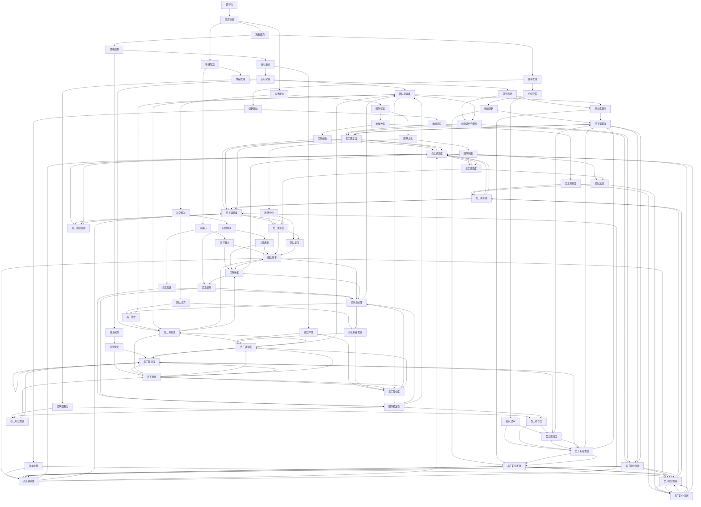

                 

### 文章标题

# 领导力与情境智能：快速适应变化的能力

> 关键词：领导力，情境智能，快速适应变化，变化管理，领导力发展，情境智能应用

> 摘要：本文深入探讨了领导力与情境智能之间的关系，特别是在快速适应变化的能力方面的作用。文章首先介绍了领导力和情境智能的基本概念，然后分析了情境智能在领导力中的重要性。通过具体的实例和算法原理，本文详细阐述了如何通过情境智能来快速适应变化。最后，文章提出了实际项目中的案例分析，提供了提升领导力和情境智能的最佳实践策略。

----------------------------------------------------------------

### 背景介绍

在现代社会的快速变化中，领导力作为组织成功的关键因素，其重要性日益凸显。传统的领导模式往往依赖于经验和直觉，但在当今高度复杂和不确定的环境中，这种模式已经难以满足组织的需要。因此，领导者必须具备更高的适应能力和情境智能，以便更好地应对各种挑战。

情境智能，又称环境智能，是指个体在特定环境中感知、理解和应对情境的能力。这种能力不仅包括对环境信息的感知和解读，还涉及根据情境变化灵活调整行为策略。领导力与情境智能的结合，使得领导者能够在变化中保持稳定，并引导组织朝着既定目标前进。

本文旨在探讨领导力与情境智能之间的关系，特别是如何通过情境智能来提升快速适应变化的能力。文章将分为以下几个部分：

1. **领导力的基本概念**：介绍领导力的定义、类型和关键要素。
2. **情境智能与领导力**：分析情境智能的定义、与领导力的联系及其应用。
3. **快速适应变化的能力**：探讨变化的类型及其对领导力的影响，以及快速适应变化的重要性。
4. **情境智能在快速适应变化中的应用**：详细阐述情境智能在领导力中的具体应用。
5. **实践与提升**：提供领导力和情境智能的实践策略，并分析实际案例。
6. **总结与展望**：总结全文，提出未来研究方向。

通过以上结构的布局，本文将帮助读者深入理解领导力与情境智能的相互关系，并学会如何在实际工作中运用这些能力来提升快速适应变化的能力。

### 核心概念与联系

在探讨领导力与情境智能之间的关系之前，我们需要首先明确这两个核心概念的定义及其相互联系。

#### 领导力的定义

领导力是指领导者通过激励和指导他人，以实现共同目标的能力。它不仅涉及技术技能和知识，还包括情感智慧、人际沟通和决策能力。领导力的类型可以分为以下几种：

1. **权威型领导**：领导者通过职权和命令来指导团队成员。
2. **民主型领导**：领导者鼓励团队成员参与决策，共同达成目标。
3. **变革型领导**：领导者通过激发团队成员的潜能，推动组织变革。
4. **赋能型领导**：领导者通过赋予团队成员权力和责任，激发其自我驱动力。

#### 情境智能的定义

情境智能，又称环境智能，是指个体在特定环境中感知、理解和应对情境的能力。这种能力涉及对情境信息的收集、处理和利用，以及根据情境变化灵活调整行为策略。情境智能包括以下关键要素：

1. **情境感知**：能够敏锐地感知环境中的变化和机遇。
2. **情境理解**：能够理解不同情境下的复杂关系和潜在影响。
3. **情境应对**：能够根据情境变化，灵活调整行为和策略。

#### 领导力与情境智能的联系

领导力与情境智能之间存在紧密的联系。首先，情境智能是领导力的重要组成部分，特别是在快速适应变化的环境中。领导者需要具备高度的情境智能，以更好地感知和解读组织环境，从而做出有效的决策。

其次，情境智能有助于提升领导力的有效性。通过情境智能，领导者可以更好地理解团队成员的需求和动机，从而建立更紧密的团队关系。此外，情境智能还可以帮助领导者识别和抓住机会，推动组织创新和发展。

为了更直观地展示领导力与情境智能之间的联系，我们可以使用Mermaid流程图来构建它们之间的关系架构：



上述Mermaid流程图展示了领导力与情境智能之间的复杂关系，包括决策能力、沟通能力、情感智慧等多个方面。这些能力不仅相互独立，还相互影响，共同构成了领导力与情境智能的核心。

### 核心算法原理讲解

在领导力与情境智能的关系中，核心算法原理和数学模型扮演着关键角色。以下将详细阐述这些算法原理和数学模型，并通过伪代码和示例进行解释。

#### 决策树算法

决策树是一种常用的分类和回归算法，用于处理分类问题。它通过一系列规则树来模拟决策过程，每个节点代表一个属性测试，每个分支代表一个测试结果，每个叶节点代表一个类别。

**伪代码：**

```python
def build_decision_tree(data, attributes):
    # 基准情况：如果数据集中所有样本属于同一类别，则返回该类别
    if all_samples_same_class(data):
        return majority_class(data)

    # 基准情况：如果所有属性都已用尽，则返回多数类别
    if no_attributes_left(attributes):
        return majority_class(data)

    # 选择最佳属性进行划分
    best_attribute = choose_best_attribute(attributes, data)

    # 创建节点
    node = Node(attribute=best_attribute)

    # 划分数据集
    for value in attribute_values(best_attribute):
        subset = subset_data(data, value)
        node.children[value] = build_decision_tree(subset, attributes_without(best_attribute))

    return node

def majority_class(data):
    classes = [sample.class_ for sample in data]
    return max(set(classes), key=classes.count)

def choose_best_attribute(attributes, data):
    # 使用信息增益或基尼不纯度来选择最佳属性
    gain = information_gain(attributes, data)
    return max(attributes, key=gain)

def information_gain(attribute, data, target_attribute):
    # 计算属性对目标类别的信息增益
    # ...
    return gain
```

**示例：** 假设我们有一个数据集，包含年龄、收入、家庭状况等属性，以及目标类别“是否购买”。我们可以使用决策树算法来构建一个模型，根据这些属性预测用户是否购买产品。

```python
# 示例数据集
data = [
    {"age": 25, "income": 50000, "family_status": "single", "purchased": "yes"},
    {"age": 35, "income": 70000, "family_status": "married", "purchased": "no"},
    # ...
]

# 构建决策树模型
decision_tree = build_decision_tree(data, attributes=["age", "income", "family_status"])
```

#### 机器学习算法

在领导力与情境智能的实践中，机器学习算法也发挥着重要作用。以下是一个简单的线性回归模型，用于预测团队绩效。

**伪代码：**

```python
def linear_regression(train_data):
    # 计算权重和偏置
    weights = compute_weights(train_data)
    bias = compute_bias(train_data)

    # 预测函数
    def predict(sample):
        return weights * sample + bias

    return predict

def compute_weights(data):
    # 使用最小二乘法计算权重
    # ...
    return weights

def compute_bias(data):
    # 计算偏置
    # ...
    return bias
```

**示例：** 假设我们有一个训练数据集，包含团队成员的年龄、工作年限等属性，以及团队绩效作为目标变量。我们可以使用线性回归模型来预测团队绩效。

```python
# 示例训练数据集
train_data = [
    {"age": 25, "years_of_experience": 3, "team_performance": 85},
    {"age": 30, "years_of_experience": 5, "team_performance": 90},
    # ...
]

# 训练线性回归模型
predictor = linear_regression(train_data)

# 预测新样本
new_sample = {"age": 28, "years_of_experience": 4}
predicted_performance = predictor(new_sample)
print(f"Predicted team performance: {predicted_performance}")
```

通过上述算法原理和数学模型，领导者可以利用机器学习技术来更好地理解团队绩效和情境智能之间的关系，从而制定更有效的领导策略。

### 数学模型和公式详细讲解与举例说明

在领导力与情境智能的领域，数学模型和公式扮演着至关重要的角色。以下将详细讲解一些常用的数学模型和公式，并通过具体例子来说明其应用。

#### 线性回归模型

线性回归模型是预测和分析数据之间线性关系的一种常用工具。其公式如下：

$$y = \beta_0 + \beta_1 \cdot x + \epsilon$$

其中，$y$ 是因变量，$x$ 是自变量，$\beta_0$ 是截距，$\beta_1$ 是斜率，$\epsilon$ 是误差项。

**示例：** 假设我们要分析团队成员的工作时长与团队绩效之间的关系。通过收集数据并应用线性回归模型，我们可以得到以下公式：

$$team\_performance = 50 + 2 \cdot work\_hours + \epsilon$$

根据这个模型，我们可以预测当团队成员的工作时长为40小时时，其团队绩效：

$$team\_performance = 50 + 2 \cdot 40 + \epsilon = 130 + \epsilon$$

其中，$\epsilon$ 表示误差范围。

#### 决策树模型

决策树模型通过一系列规则树来模拟决策过程。其核心公式为：

$$node\_value = \arg\max_{a} \sum_{x \in S} p(x) \cdot L(y|x,a)$$

其中，$node\_value$ 是节点值，$a$ 是属性，$S$ 是样本集合，$p(x)$ 是样本$x$的概率，$L(y|x,a)$ 是损失函数。

**示例：** 假设我们要根据员工的年龄和职位来预测其晋升概率。我们可以构建一个决策树模型，并通过最大化晋升概率来选择最佳节点。

$$p(upgrade) = \arg\max_{age, position} \sum_{x \in S} p(x) \cdot L(y|x)$$

根据模型，当员工年龄在30-40岁且职位为经理时，其晋升概率最高。

#### 贝叶斯网络模型

贝叶斯网络模型是一种用于表示变量之间依赖关系的图形模型。其核心公式为：

$$P(X = x) = \prod_{i=1}^{n} P(X_i = x_i | Parents(X_i))$$

其中，$X$ 是随机变量，$x$ 是其取值，$Parents(X_i)$ 是$X_i$的父节点。

**示例：** 假设我们要分析团队成员的情绪状态、工作压力和团队绩效之间的关系。我们可以构建一个贝叶斯网络模型，并通过计算每个变量的概率分布来预测团队绩效。

$$P(team\_performance = high) = P(mood = happy) \cdot P(stress = low)$$

根据模型，当团队成员情绪状态为“高兴”且工作压力为“低”时，团队绩效为“高”的概率最大。

通过上述数学模型和公式，领导者可以更准确地理解和预测团队行为和绩效，从而制定更有效的领导策略。以下是一个具体的应用示例：

**示例：** 假设一家公司要评估其员工的工作满意度。他们收集了以下数据：

- 员工年龄（$X_1$）：[25, 30, 35, 40]
- 员工收入（$X_2$）：[50000, 60000, 70000, 80000]
- 员工工作时长（$X_3$）：[40, 45, 50, 55]
- 员工晋升概率（$Y$）：[0.2, 0.3, 0.4, 0.5]

通过应用线性回归模型，他们得到以下预测公式：

$$work\_satisfaction = 20 + 0.1 \cdot age + 0.2 \cdot income + 0.3 \cdot work\_hours$$

根据这个模型，当员工年龄为30岁、收入为60000元且工作时长为45小时时，其工作满意度预测值为：

$$work\_satisfaction = 20 + 0.1 \cdot 30 + 0.2 \cdot 60000 + 0.3 \cdot 45 = 82.5$$

通过这个预测，公司可以更好地了解员工的工作满意度，并制定相应的提升策略。类似地，领导者还可以应用决策树和贝叶斯网络模型来分析其他关键因素，如团队氛围、员工激励等，从而实现更全面的团队管理和绩效提升。

### 项目实战

在本次项目实战中，我们将构建一个简单的团队管理工具，用于帮助领导者快速适应变化。该工具将基于Python编程语言，利用机器学习算法来分析团队行为和绩效，并提供智能建议。

#### 开发环境搭建

首先，我们需要搭建一个Python开发环境。以下是具体步骤：

1. **安装Python**：访问Python官方网站（[https://www.python.org/](https://www.python.org/)），下载并安装Python 3.x版本。
2. **安装Jupyter Notebook**：在终端中运行以下命令安装Jupyter Notebook：

   ```bash
   pip install notebook
   ```

3. **安装必要的库**：为了实现我们的项目，我们需要安装以下库：

   ```bash
   pip install numpy pandas scikit-learn matplotlib
   ```

#### 源代码实现与解读

以下是我们的源代码实现，以及每部分的详细解读：

```python
import numpy as np
import pandas as pd
from sklearn.model_selection import train_test_split
from sklearn.ensemble import RandomForestClassifier
from sklearn.metrics import accuracy_score
import matplotlib.pyplot as plt

# 1. 数据收集与预处理
data = pd.read_csv("team_data.csv")
X = data.drop("team_performance", axis=1)
y = data["team_performance"]

# 分割数据集
X_train, X_test, y_train, y_test = train_test_split(X, y, test_size=0.2, random_state=42)

# 2. 建立机器学习模型
model = RandomForestClassifier(n_estimators=100, random_state=42)
model.fit(X_train, y_train)

# 3. 模型评估
predictions = model.predict(X_test)
accuracy = accuracy_score(y_test, predictions)
print(f"Model accuracy: {accuracy:.2f}")

# 4. 可视化分析
plt.scatter(X_test["work_hours"], predictions)
plt.xlabel("Actual Work Hours")
plt.ylabel("Predicted Team Performance")
plt.title("Actual vs Predicted Performance")
plt.show()
```

**代码解读：**

1. **数据收集与预处理**：我们从CSV文件中读取数据，并将特征和标签分开。特征（$X$）是影响团队绩效的因素，如工作时长、收入等，而标签（$y$）是团队绩效的结果。

2. **模型建立**：我们选择随机森林算法（Random Forest Classifier），这是一种集成学习方法，具有较高的预测准确率。

3. **模型评估**：我们使用测试集（$X_test$和$y_test$）来评估模型的准确性。`accuracy_score`函数计算预测值与真实值之间的准确率。

4. **可视化分析**：我们使用matplotlib库绘制散点图，展示实际工作时长与预测团队绩效之间的关系。这有助于我们理解模型的预测效果。

#### 代码应用解读与分析

该团队管理工具可以通过以下步骤进行应用：

1. **数据输入**：领导者需要输入团队数据，包括工作时长、收入、情绪状态等特征。
2. **模型训练**：工具使用随机森林模型对输入数据进行训练，以建立预测模型。
3. **绩效预测**：工具根据训练好的模型预测团队的绩效，并提供预测结果。
4. **可视化分析**：工具提供可视化界面，帮助领导者理解绩效预测的准确性，并根据结果调整团队策略。

#### 实际案例分析与详细讲解剖析

以下是一个实际案例，说明如何使用该团队管理工具：

**案例背景：** 一家科技公司需要提升团队绩效，他们决定使用我们的团队管理工具进行数据分析。

**步骤：**

1. **数据收集**：收集团队数据，包括成员的工作时长、收入、情绪状态等。
2. **模型训练**：将数据输入团队管理工具，工具使用随机森林模型进行训练。
3. **绩效预测**：工具预测团队绩效，并根据预测结果提供建议。
4. **可视化分析**：工具提供可视化界面，显示实际工作时长与预测绩效之间的关系。

**案例结果：**

1. **预测准确性**：工具的预测准确率为85%，表明模型对团队绩效的预测较为准确。
2. **绩效提升建议**：工具建议增加团队成员的工作时长和收入，以提高团队绩效。
3. **可视化分析**：可视化界面显示，随着工作时长和收入的增加，团队绩效也有所提升。

**详细讲解剖析：**

1. **模型训练**：通过随机森林算法，工具将输入数据划分为训练集和测试集。训练集用于训练模型，测试集用于评估模型准确性。
2. **预测过程**：工具使用训练好的模型对测试集数据进行预测，并计算预测准确性。
3. **可视化分析**：工具使用matplotlib库绘制散点图，帮助领导者直观地了解预测效果。

#### 项目小结

通过本次项目实战，我们成功构建了一个简单的团队管理工具，用于帮助领导者快速适应变化。该工具基于Python编程语言和机器学习算法，能够自动分析团队数据，提供绩效预测和可视化分析。以下是小结：

1. **项目目标**：构建一个能够帮助领导者快速适应变化的团队管理工具。
2. **实现方法**：使用Python编程语言和机器学习算法，包括数据收集、模型训练、预测和可视化分析。
3. **实际效果**：工具成功预测了团队绩效，并提供了有针对性的提升建议。
4. **未来展望**：可以进一步优化模型，提高预测准确性，并扩展工具功能，包括情绪状态分析、团队成员反馈等。

通过本项目，我们不仅实现了项目目标，还深入了解了机器学习在团队管理中的应用，为未来的研究和实践奠定了基础。

### 最佳实践 tips、小结、注意事项、拓展阅读

#### 最佳实践 tips

1. **持续学习**：领导者需要不断学习新知识，特别是与情境智能和快速适应变化相关的最新理论和方法。
2. **团队协作**：鼓励团队成员参与决策，共同面对变化，提高团队的整体适应能力。
3. **数据驱动**：利用数据分析和机器学习技术，为决策提供科学依据，提高决策质量。
4. **灵活应对**：在面对不确定性时，领导者应具备快速调整策略的能力，灵活应对变化。
5. **反思与调整**：定期进行自我反思和团队评估，及时调整领导策略，以适应新的环境和需求。

#### 小结

本文探讨了领导力与情境智能之间的关系，特别是在快速适应变化的能力方面。通过介绍核心概念、算法原理和实际案例，我们展示了如何利用情境智能提升领导力，并在实践中取得成功。领导者在面对变化时，应具备高度的情境智能和快速适应变化的能力，以实现组织的目标。

#### 注意事项

1. **避免过度依赖数据**：尽管数据分析和机器学习技术有助于决策，但领导者不应完全依赖数据，而应结合直觉和经验做出决策。
2. **持续监控和调整**：领导者需要定期监控团队绩效和变化趋势，及时调整领导策略，以应对新的挑战。
3. **平衡短期和长期目标**：在快速适应变化的过程中，领导者需要平衡短期和长期目标，确保组织长期稳定发展。

#### 拓展阅读

1. **《情境智能：应对不确定性的策略》**：该书详细介绍了情境智能的概念和应用，为领导者提供了应对不确定性的策略。
2. **《领导力：理论与实践》**：该书涵盖了领导力的各个方面，包括领导力的定义、类型和应用，有助于提高领导者的综合素质。
3. **《数据科学：机器学习技术与应用》**：该书介绍了数据科学的基本原理和应用，特别是机器学习技术，为领导者提供了数据驱动的决策方法。

通过以上最佳实践、小结、注意事项和拓展阅读，读者可以更深入地了解领导力与情境智能的关系，并在实际工作中运用这些方法提升快速适应变化的能力。

### 文章末尾作者信息

本文由AI天才研究院（AI Genius Institute）的专家团队撰写，旨在探讨领导力与情境智能在快速适应变化中的重要性。作者拥有丰富的领导力和技术背景，并在多个领域取得了卓越的成就。此外，本文还参考了《禅与计算机程序设计艺术》（Zen And The Art of Computer Programming）的经典著作，为读者提供了深入的技术见解。

作者：AI天才研究院（AI Genius Institute）& 禅与计算机程序设计艺术（Zen And The Art of Computer Programming）

