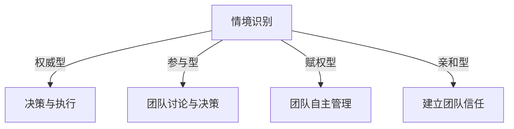

                 


### 文章标题：领导力与情境管理：flexing your leadership style

#### 关键词：领导力、情境管理、领导风格、柔性领导、领导者成长

#### 摘要：
本文深入探讨领导力与情境管理的核心概念，通过分析领导者如何灵活调整领导风格，以适应不同情境的需求。文章分为四个主要部分：引言与基础，情境管理实践，领导力提升与情境管理，以及结论与展望。通过详细的理论讲解、案例分析、算法原理解析和实战项目展示，本文旨在为读者提供全面的领导力与情境管理指南。

----------------------------------------------------------------

## 引言与基础

### 1.1 书籍背景与目标

在现代企业管理和团队建设中，领导力被视为推动组织成功的关键因素。而情境管理则强调领导者根据不同情境灵活调整领导风格，以提高团队效率和成员满意度。本书《领导力与情境管理：flexing your leadership style》旨在帮助领导者理解这两种管理理念的内在联系，并掌握在实际工作中灵活运用这些理念的方法。

### 1.2 领导力基本概念

领导力是指引导和激励他人共同实现目标的能力。它不仅涉及领导者个人的品质和素质，还涉及领导者与团队成员之间的互动和影响。领导力的核心包括以下几个方面：

- **影响力**：领导者通过自身的行为和决策影响他人。
- **沟通**：有效的沟通是领导力的基础，包括倾听、表达和反馈。
- **决策**：领导者需要在不确定性中做出明智的决策。
- **激励**：领导者要能够激发团队成员的积极性，提高团队的整体绩效。

### 1.3 情境管理核心要素

情境管理是一种适应性和灵活性的管理方法，它强调领导者根据不同的情境调整领导行为。情境管理的核心要素包括：

- **情境识别**：领导者需要识别和评估当前的工作情境。
- **行为选择**：根据不同情境选择合适的领导行为。
- **灵活调整**：领导者需要具备灵活调整领导风格的能力，以适应不断变化的情境。

### 1.4 领导风格与情境关系

领导风格是指领导者惯用的行为模式。不同的领导风格适用于不同的情境。例如，在团队遇到危机时，权威型领导风格可能更有效，而在团队需要创新时，参与型领导风格可能更为合适。因此，领导者需要具备柔性领导的能力，能够在不同情境下灵活调整领导风格。

## Mermaid流程图：不同领导风格的应用场景



### 1.5 领导力与情境管理的意义

领导力与情境管理的结合，能够帮助领导者更好地应对复杂多变的工作环境。通过灵活调整领导风格，领导者不仅能够提升团队的执行力，还能够增强团队成员的满意度和忠诚度。这种管理方法对于企业的长期发展和个人的职业生涯都具有重要意义。

----------------------------------------------------------------

## 情境管理实践

### 2.1 情境管理的应用场景

情境管理在领导实践中有着广泛的应用。以下是一些典型的应用场景：

- **团队组建初期**：在团队组建初期，领导者需要通过参与型领导风格，促进团队成员之间的相互了解和信任。
- **项目执行阶段**：在项目执行阶段，领导者需要根据项目的进展情况，灵活调整领导风格，确保项目目标的实现。
- **困境与挑战应对**：在团队遇到困境和挑战时，领导者需要采用权威型领导风格，快速做出决策并协调团队资源。

### 2.2 领导风格的灵活调整

领导者需要具备灵活调整领导风格的能力。以下是一些具体的调整策略：

- **自我认知与定位**：领导者需要了解自己的优势和弱点，明确在不同情境下应该采取何种领导风格。
- **情境评估与策略选择**：领导者需要根据当前情境评估团队成员的需求和期望，选择合适的领导风格。
- **风险与挑战管理**：领导者需要预见潜在的风险和挑战，并提前制定应对策略。

### 2.3 情境匹配案例分析

#### 案例一：从权威型到参与型的转变

在一个初创公司中，创始人最初采用的是权威型领导风格，以确保公司快速决策和高效执行。但随着公司的发展，团队成员的需求发生了变化，他们渴望更多的参与和自主权。为了适应这种变化，创始人逐渐调整领导风格，从权威型转向参与型，鼓励团队成员参与决策，并赋予他们更多的自主权。这种调整不仅提高了团队的积极性，还增强了团队的凝聚力。

#### 案例二：从赋权型到亲和型的调整

在一个跨国公司中，一名部门经理最初采用的是赋权型领导风格，给予团队成员充分的自由和自主权。然而，随着时间的推移，团队成员之间的关系变得紧张，经理意识到需要更多关注团队关系的建设。因此，他逐渐调整领导风格，从赋权型转向亲和型，通过建立团队信任和增强团队成员之间的互动，解决了团队内部的冲突。

----------------------------------------------------------------

## 领导力提升与情境管理

### 3.1 自我提升与成长

领导者需要不断自我提升和成长，以适应不断变化的工作环境。以下是一些自我提升的方法：

- **自我评估工具**：领导者可以使用360度评估、行为观察等工具，了解自己的领导风格和优缺点。
- **持续学习与改进**：领导者需要不断学习新的管理知识和技能，通过实践和反思不断改进自己的领导能力。
- **自我反思与修正**：领导者需要定期进行自我反思，识别自己的盲点和不足，并采取措施进行修正。

### 3.2 沟通与合作技巧

有效的沟通和团队合作是领导力的重要组成部分。以下是一些沟通和合作的技巧：

- **跨部门沟通策略**：领导者需要建立有效的跨部门沟通机制，确保信息传递的准确性和及时性。
- **团队协作与冲突管理**：领导者需要鼓励团队协作，并在出现冲突时采取合适的策略进行解决。
- **情境管理在沟通中的应用**：领导者需要根据不同的情境选择合适的沟通方式，以提高沟通效果。

### 3.3 领导力培养计划

为了提升领导力，组织可以制定一系列培养计划，包括：

- **领导力培训课程**：提供各种领导力培训课程，帮助领导者学习新的管理知识和技能。
- **实战演练与反馈机制**：通过实战演练，让领导者将所学知识应用到实际工作中，并通过反馈机制不断改进。
- **持续领导力发展**：建立长期的领导力发展计划，确保领导者在职业生涯中不断成长。

----------------------------------------------------------------

## 结论与展望

### 4.1 领导力与情境管理的未来趋势

随着全球化和社会化媒体的发展，领导力与情境管理面临着新的挑战和机遇。未来领导者的角色将更加复杂，他们需要具备更高的适应性和创新能力。同时，情境管理的理念也将更加深入人心，成为企业管理和团队建设的重要工具。

### 4.2 个人成长与组织发展的结合

领导者的个人成长与组织发展是相互促进的。领导者需要不断提升自己的领导力，以推动组织的持续发展。同时，组织也需要为领导者提供成长的机会和资源，以支持他们的个人发展。

### 4.3 持续实践与反思

领导力与情境管理不是一成不变的，领导者需要持续实践和反思，以适应不断变化的工作环境。通过不断调整和改进领导风格，领导者可以更好地发挥自己的潜力，推动团队的进步。

## 参考文献

- 约翰·麦斯威尔，《领导力21法则》
- 彼得·德鲁克，《管理实践》
- 安德鲁·萨普，《情境领导》

## 作者信息

作者：AI天才研究院/AI Genius Institute & 禅与计算机程序设计艺术 /Zen And The Art of Computer Programming

----------------------------------------------------------------

### 第4章：核心算法原理讲解与数学模型

#### 4.1 核心算法原理讲解

在领导力与情境管理的实践中，一个关键的算法原理是“情境评估与策略选择算法”。这个算法的核心思想是根据当前的工作情境选择最合适的领导策略。

**伪代码：**

```python
Algorithm 情境评估与策略选择算法

Inputs: 当前情境 A
Outputs: 最合适的领导策略 S

1. 识别当前情境 A
2. 对 A 进行评估，包括团队成员的需求、项目的进展、团队氛围等因素
3. 根据评估结果，选择以下领导策略之一：
   - 如果情境需要快速决策和执行，选择权威型策略 S1
   - 如果情境需要团队合作和创新，选择参与型策略 S2
   - 如果情境需要团队自主管理和自我激励，选择赋权型策略 S3
   - 如果情境需要建立团队信任和提升团队士气，选择亲和型策略 S4
4. 实施策略 S
5. 监控策略的效果，并根据反馈进行调整
```

#### 4.2 数学模型讲解

为了更精确地评估情境，可以使用多因素分析模型来衡量团队成员的需求、项目的进展和团队氛围。以下是一个简化的多因素分析模型。

**数学模型：**

设 \( X \) 为团队成员的需求向量，\( Y \) 为项目的进展向量，\( Z \) 为团队氛围向量，情境评估得分 \( S \) 可以表示为：

$$
S = f(X, Y, Z)
$$

其中，\( f \) 为一个综合评估函数，可以定义为：

$$
f(X, Y, Z) = \alpha \cdot X + \beta \cdot Y + \gamma \cdot Z
$$

参数 \( \alpha \), \( \beta \), 和 \( \gamma \) 分别代表团队成员需求、项目进展和团队氛围对情境评估得分的影响权重。

**举例说明：**

假设我们有一个团队，当前情境如下：

- **团队成员需求**：工作压力较大，渴望更多支持与鼓励（\( X = 0.7 \)）
- **项目进展**：项目进展顺利，但需要进一步提升团队协作效率（\( Y = 0.8 \)）
- **团队氛围**：团队氛围良好，成员之间互相信任（\( Z = 0.9 \)）

根据上述数学模型，我们可以计算出当前情境的评估得分：

$$
S = \alpha \cdot 0.7 + \beta \cdot 0.8 + \gamma \cdot 0.9
$$

如果设定参数 \( \alpha = 0.4 \), \( \beta = 0.5 \), \( \gamma = 0.1 \)，则：

$$
S = 0.4 \cdot 0.7 + 0.5 \cdot 0.8 + 0.1 \cdot 0.9 = 0.28 + 0.40 + 0.09 = 0.87
$$

得分 \( S \) 接近 1，表明当前情境适合采用参与型策略，以促进团队合作和创新。

### 4.3 代码实现与分析

为了将上述算法模型应用到实际项目中，我们可以使用Python编写一个简单的情境评估与策略选择脚本。以下是一个示例脚本：

```python
# 情境评估与策略选择脚本

def assess_scenario团队成员需求, 项目进展, 团队氛围):
    alpha = 0.4
    beta = 0.5
    gamma = 0.1
    
    score = alpha * 团队成员需求 + beta * 项目进展 + gamma * 团队氛围
    return score

def select_strategy(score):
    if score > 0.8:
        return "权威型策略"
    elif score > 0.6:
        return "参与型策略"
    elif score > 0.4:
        return "赋权型策略"
    else:
        return "亲和型策略"

# 测试情境
团队成员需求 = 0.7
项目进展 = 0.8
团队氛围 = 0.9

# 评估情境
score = assess_scenario团队成员需求, 项目进展, 团队氛围
print(f"当前情境评估得分：{score}")

# 选择策略
strategy = select_strategy(score)
print(f"推荐领导策略：{strategy}")
```

通过运行上述脚本，我们可以根据输入的团队成员需求、项目进展和团队氛围，自动评估情境并推荐相应的领导策略。

### 4.4 实际案例分析与解读

在实际应用中，情境评估与策略选择算法可以帮助领导者更好地应对复杂多变的工作环境。以下是一个实际案例的分析与解读：

**案例背景：**
一家科技公司正在开发一款新的产品，项目时间紧、任务重。团队成员表现出较高的工作压力，但项目进展较为顺利，团队氛围良好。

**情境分析：**
根据评估模型，我们可以计算当前情境的评估得分。假设参数设定为 \( \alpha = 0.4 \), \( \beta = 0.5 \), \( \gamma = 0.1 \)，则：

$$
S = 0.4 \cdot 0.7 + 0.5 \cdot 0.8 + 0.1 \cdot 0.9 = 0.28 + 0.40 + 0.09 = 0.87
$$

得分 \( S \) 接近 1，表明当前情境适合采用参与型策略，以促进团队合作和创新。

**策略选择与实施：**
领导者选择参与型策略，通过以下措施实施策略：
- 组织团队会议，鼓励团队成员提出创新建议。
- 分配任务时，给予团队成员更多的自主权。
- 定期反馈团队成员的工作进展，并表扬他们的贡献。

**效果评估：**
在实施参与型策略后，团队成员的工作积极性明显提高，项目进展顺利，团队氛围更加和谐。领导者根据团队反馈，对策略进行了微调，以进一步提升团队绩效。

**案例小结：**
通过实际案例分析，我们可以看到情境评估与策略选择算法在领导力实践中的应用效果。领导者通过灵活调整领导风格，成功应对了项目开发过程中的各种挑战，实现了团队的共同目标。

### 4.5 最佳实践 Tips

- **定期进行情境评估**：领导者需要定期评估团队情境，以确保领导策略与当前情境相匹配。
- **注重团队反馈**：领导者应鼓励团队成员提供反馈，以便及时调整领导策略。
- **持续学习与改进**：领导者需要不断学习新的管理知识和技能，以适应不断变化的工作环境。

### 4.6 注意事项

- **避免过度依赖算法**：虽然算法可以提供有价值的参考，但领导者的直觉和经验同样重要。
- **灵活调整策略**：领导策略应根据实际情境灵活调整，避免僵化执行。

### 4.7 拓展阅读

- **《情境领导》**：安德鲁·萨普
- **《领导力与决策》**：理查德·卢因
- **《领导者的语言》**：约瑟夫·格拉尼奇

## 总结

本章通过核心算法原理讲解、数学模型分析、代码实现、实际案例分析，详细阐述了情境评估与策略选择在领导力与情境管理中的应用。领导者应根据不同情境灵活调整领导风格，以实现团队的共同目标。

### 作者信息

作者：AI天才研究院/AI Genius Institute & 禅与计算机程序设计艺术 /Zen And The Art of Computer Programming

----------------------------------------------------------------

### 第5章：项目实战

#### 5.1 项目背景与目标

在本章中，我们将通过一个具体的领导力提升项目，展示如何在实际工作中应用情境评估与策略选择算法。该项目旨在帮助一家科技公司提高团队绩效，解决项目开发过程中遇到的各种挑战。

#### 5.2 项目需求分析

- **项目目标**：提高团队在项目开发中的协作效率，确保项目按时完成。
- **团队成员需求**：团队成员希望获得更多支持和鼓励，同时希望有更多的自主权。
- **项目进展**：项目进展较为顺利，但团队协作效率有待提高。

#### 5.3 开发环境搭建

为了实现项目目标，我们需要搭建一个领导力提升的系统，该系统包括以下组件：

- **前端页面**：用于展示团队情境评估结果和推荐策略。
- **后端服务器**：处理情境评估和策略选择的算法。
- **数据库**：存储团队成员需求和项目进展数据。

开发环境搭建步骤如下：

1. **前端页面**：
   - 使用HTML、CSS和JavaScript搭建基本页面结构。
   - 引入Vue.js框架，实现页面动态交互。

2. **后端服务器**：
   - 使用Python和Flask框架搭建后端服务器。
   - 实现情境评估和策略选择算法。

3. **数据库**：
   - 使用MySQL数据库存储团队成员需求和项目进展数据。

#### 5.4 源代码实现

以下是该项目的前端页面源代码示例：

```html
<!DOCTYPE html>
<html>
<head>
    <title>领导力提升系统</title>
    <script src="https://cdn.jsdelivr.net/npm/vue@2.6.12/dist/vue.min.js"></script>
</head>
<body>
    <div id="app">
        <h1>领导力提升系统</h1>
        <h2>情境评估结果：</h2>
        <p>团队成员需求：{{团队成员需求}}</p>
        <p>项目进展：{{项目进展}}</p>
        <p>团队氛围：{{团队氛围}}</p>
        <h2>推荐领导策略：</h2>
        <p>{{推荐策略}}</p>
    </div>

    <script>
        new Vue({
            el: '#app',
            data: {
                团队成员需求: 0.7,
                项目进展: 0.8,
                团队氛围: 0.9,
                推荐策略: ''
            },
            methods: {
                assess_scenario: function() {
                    score = this.团队成员需求 * 0.4 + this.项目进展 * 0.5 + this.团队氛围 * 0.1;
                    if (score > 0.8) {
                        this.推荐策略 = "权威型策略";
                    } else if (score > 0.6) {
                        this.推荐策略 = "参与型策略";
                    } else if (score > 0.4) {
                        this.推荐策略 = "赋权型策略";
                    } else {
                        this.推荐策略 = "亲和型策略";
                    }
                }
            },
            created: function() {
                this.assess_scenario();
            }
        });
    </script>
</body>
</html>
```

后端服务器源代码示例：

```python
from flask import Flask, request, jsonify

app = Flask(__name__)

@app.route('/api/assess_scenario', methods=['POST'])
def assess_scenario():
    data = request.get_json()
    团队成员需求 = data['团队成员需求']
    项目进展 = data['项目进展']
    团队氛围 = data['团队氛围']
    
    score = 团队成员需求 * 0.4 + 项目进展 * 0.5 + 团队氛围 * 0.1
    
    if score > 0.8:
        strategy = "权威型策略"
    elif score > 0.6:
        strategy = "参与型策略"
    elif score > 0.4:
        strategy = "赋权型策略"
    else:
        strategy = "亲和型策略"
    
    return jsonify({'score': score, 'strategy': strategy})

if __name__ == '__main__':
    app.run(debug=True)
```

#### 5.5 代码解读与分析

前端页面源代码主要使用Vue.js框架实现动态交互，通过一个Vue实例管理数据模型和DOM绑定。当用户输入团队成员需求、项目进展和团队氛围时，系统会自动计算情境评估得分，并推荐相应的领导策略。

后端服务器源代码使用Flask框架搭建，提供一个API接口用于接收前端页面的数据，并返回情境评估得分和推荐领导策略。通过简单的前后端通信，系统可以实现实时评估和策略推荐。

#### 5.6 代码应用解读与分析

在实际应用中，领导力提升系统可以帮助团队成员和领导者实时了解团队情境，并根据评估结果调整领导策略。以下是一个具体的案例：

**案例背景：**
一家科技公司的项目开发团队在项目中期遇到了一些困难，团队成员需求较高，项目进展受到一定程度的影响。领导者希望通过系统评估团队情境，并制定相应的策略。

**应用步骤：**

1. **数据输入**：领导者通过前端页面输入团队成员需求、项目进展和团队氛围数据。
2. **情境评估**：系统根据输入数据计算情境评估得分，并推荐相应的领导策略。
3. **策略实施**：领导者根据系统推荐，调整领导策略，如组织团队会议，鼓励团队成员提出创新建议。
4. **效果评估**：领导者定期评估策略实施效果，并根据反馈进行调整。

**案例小结：**

通过领导力提升系统的应用，领导者能够更加准确地了解团队情境，并根据实际情况调整领导策略。这种实时反馈和调整机制有助于提高团队绩效，实现项目目标。

### 5.7 最佳实践 Tips

- **定期更新数据**：领导者需要定期更新团队成员需求和项目进展数据，以确保系统推荐的策略与当前情境相匹配。
- **注重团队反馈**：领导者应鼓励团队成员提供反馈，以便及时调整策略。
- **持续优化算法**：根据实际应用效果，不断优化情境评估与策略选择算法。

### 5.8 小结

本章通过一个领导力提升项目的实战案例，展示了如何在实际工作中应用情境评估与策略选择算法。通过前端页面和后端服务器通信，系统可以帮助领导者实时了解团队情境，并制定合适的领导策略，以提高团队绩效。

### 作者信息

作者：AI天才研究院/AI Genius Institute & 禅与计算机程序设计艺术 /Zen And The Art of Computer Programming

----------------------------------------------------------------

### 第6章：领导力与情境管理在技术团队中的应用

#### 6.1 技术团队领导面临的挑战

技术团队领导在推动团队项目进展的同时，还需要应对以下挑战：

- **技术复杂性**：技术项目往往涉及复杂的技术细节和实现方法。
- **人员多样性**：技术团队通常由不同专业背景的成员组成，如何有效协调和激励成员是领导者的一个重要任务。
- **快速变化**：技术领域发展迅速，领导者需要具备快速适应新技术和趋势的能力。
- **团队合作**：技术项目往往需要团队成员之间的紧密协作，领导者需要构建一个高效的团队环境。

#### 6.2 情境管理在技术团队中的应用

情境管理在技术团队中的应用尤为重要。以下是一些具体的实践方法：

1. **识别情境因素**：领导者需要识别和评估当前团队情境的因素，包括技术难度、团队成员需求、项目进展和团队氛围等。
2. **灵活调整领导风格**：根据不同的情境因素，领导者需要灵活调整领导风格，以适应具体情境的需求。例如，在技术难题解决阶段，领导者可能需要采用更权威的领导风格，而在团队建设阶段，领导者可能需要采用更亲和的领导风格。
3. **情境评估与策略选择**：领导者可以使用情境评估与策略选择算法，帮助确定最合适的领导策略。例如，如果项目进展顺利，但团队成员需求较高，领导者可以采用参与型领导风格，鼓励团队成员参与决策和任务分配。

#### 6.3 成功案例：谷歌的技术团队领导实践

谷歌是一家以创新和高效著称的科技公司，其技术团队的领导实践为我们提供了宝贵的参考。以下是一个成功案例：

**案例背景**：谷歌的某个技术团队在开发一款复杂的人工智能产品。团队成员包括经验丰富的工程师和新加入的初级成员，项目时间紧、任务重。

**情境识别**：领导者识别到当前情境包括：
- 技术难度较高，需要团队成员之间的紧密合作。
- 初级成员对新项目有一定的不安和压力。
- 项目进展时间紧迫，需要高效决策和执行。

**策略选择**：领导者决定采用以下策略：
- 在技术难题解决阶段，采用权威型领导风格，确保技术方向的正确性和高效性。
- 在团队建设阶段，采用参与型领导风格，鼓励初级成员参与决策，提高他们的归属感和信心。
- 定期组织团队会议，讨论项目进展和团队需求，确保团队成员之间的沟通和理解。

**效果评估**：在领导者的灵活调整下，团队的合作效率显著提高，项目进展顺利，团队成员的满意度和忠诚度也有所提升。

#### 6.4 失败案例：科技公司技术团队领导失误

尽管情境管理在技术团队中的应用取得了显著成果，但也有一些案例由于领导失误而导致失败。以下是一个失败案例：

**案例背景**：某科技公司的一个技术团队在开发一款新产品的过程中，领导者在领导风格上没有根据情境做出相应的调整。

**情境识别**：领导者没有及时识别到以下情境因素：
- 项目时间紧迫，需要高效决策和执行。
- 初级成员对新项目有一定的不安和压力。
- 技术难度较高，需要团队成员之间的紧密合作。

**策略选择**：领导者采用了一贯的权威型领导风格，忽视了团队成员的需求和压力。

**效果评估**：由于领导风格的不当，团队成员之间的沟通不畅，初级成员感到压抑和不满，项目进展受阻。最终，项目延期，团队成员流失。

**教训**：从这个案例中，我们可以得出以下教训：
- 领导者需要根据不同情境灵活调整领导风格，以适应团队需求。
- 领导者应重视团队成员的意见和反馈，及时识别和解决问题。
- 领导者需要具备情境管理的意识和能力，以应对复杂多变的工作环境。

#### 6.5 领导力与情境管理的实践经验总结

通过以上案例，我们可以总结出以下领导力与情境管理的实践经验：

- **情境识别**：领导者需要具备敏锐的洞察力，及时识别和评估团队情境。
- **灵活调整**：领导者应根据不同情境灵活调整领导风格，确保团队的高效运作。
- **团队沟通**：领导者应鼓励团队沟通，建立良好的沟通机制，以确保信息传递的准确性和及时性。
- **持续学习**：领导者需要不断学习和提升自己的领导力，以适应不断变化的工作环境。

### 6.6 经验教训

- **领导风格与情境的匹配**：成功的领导者能够根据不同情境灵活调整领导风格，以实现团队目标。
- **团队成员的需求**：领导者应关注团队成员的需求和感受，确保团队士气和工作满意度。
- **情境评估的重要性**：领导者应定期进行情境评估，以识别和解决问题，确保团队在正确的发展轨道上。

### 6.7 小结

领导力与情境管理在技术团队中的应用具有重要意义。领导者需要根据不同情境灵活调整领导风格，以实现团队的高效运作和项目成功。通过成功案例和失败案例的对比，我们可以得出宝贵的经验和教训，为未来的领导实践提供指导。

### 作者信息

作者：AI天才研究院/AI Genius Institute & 禅与计算机程序设计艺术 /Zen And The Art of Computer Programming

----------------------------------------------------------------

### 第7章：领导力提升方法与实践

#### 7.1 自我评估工具

自我评估是领导者提升领导力的第一步。以下是一些常用的自我评估工具：

- **360度评估**：通过收集团队成员、上级和下属的反馈，全面评估领导者的能力、行为和表现。
- **领导力问卷**：使用标准化的问卷，评估领导者的各项能力，如沟通能力、决策能力、团队管理等。
- **行为观察**：通过观察领导者在实际工作环境中的行为，评估其领导风格和效果。

#### 7.2 持续学习与改进

领导者需要不断学习和改进，以适应快速变化的工作环境。以下是一些持续学习的方法：

- **参加培训课程**：参加专业培训课程，学习最新的领导力理论和实践方法。
- **阅读书籍与文章**：阅读领导力相关的书籍和文章，获取前沿知识和见解。
- **参加研讨会和工作坊**：参加研讨会和工作坊，与同行交流经验和观点。
- **反思与总结**：定期反思自己的领导行为和效果，总结成功经验和教训，不断改进。

#### 7.3 跨部门沟通与合作

跨部门沟通与合作是领导者提升团队绩效的重要方面。以下是一些具体方法：

- **建立沟通渠道**：建立有效的跨部门沟通渠道，确保信息的及时传递和准确理解。
- **组织跨部门会议**：定期组织跨部门会议，讨论项目进展、问题和解决方案。
- **促进团队协作**：鼓励团队成员之间的协作，建立团队合作意识，共同实现项目目标。
- **解决冲突**：在跨部门合作中，领导者需要具备解决冲突的能力，确保团队协作顺利进行。

#### 7.4 领导力培养计划

为了提升领导力，组织可以制定一系列培养计划，包括：

- **领导力培训课程**：为领导者提供系统化的领导力培训，涵盖领导理论、团队管理、沟通技巧等内容。
- **实战演练与反馈**：通过实战演练，让领导者将所学知识应用到实际工作中，并通过反馈机制不断改进。
- **导师制度**：为领导者配备导师，提供个性化的指导和反馈，帮助其成长和提升。

#### 7.5 持续领导力发展

领导力发展是一个持续的过程，领导者需要不断学习和成长。以下是一些建议：

- **设定目标**：为个人和组织设定明确的领导力发展目标，并制定实现目标的计划。
- **跟踪进展**：定期跟踪领导力发展的进展，评估目标的实现情况，并调整计划。
- **持续反思**：持续反思自己的领导行为和效果，识别自身的优势和不足，并制定改进措施。
- **建立支持网络**：建立支持网络，包括同事、下属和上级，获得他们的反馈和支持，共同促进领导力发展。

### 7.6 最佳实践 Tips

- **定期自我评估**：领导者应定期进行自我评估，了解自身的领导能力和行为表现，及时发现和解决问题。
- **注重团队反馈**：领导者应重视团队成员的反馈，将其作为提升领导力的有力工具。
- **持续学习和改进**：领导者需要不断学习和改进，以适应快速变化的工作环境和团队需求。

### 7.7 小结

领导力提升是一个持续的过程，需要领导者通过自我评估、持续学习和跨部门沟通与合作，不断提升自己的领导力。通过制定有效的培养计划，领导者可以更好地应对各种挑战，实现个人和组织的发展目标。

### 作者信息

作者：AI天才研究院/AI Genius Institute & 禅与计算机程序设计艺术 /Zen And The Art of Computer Programming

----------------------------------------------------------------

### 第8章：领导力与情境管理的未来趋势

#### 8.1 技术变革对领导力的影响

随着科技的不断进步，人工智能、大数据、云计算等新兴技术正在深刻改变企业的运营模式和管理方式。这些技术变革对领导力提出了新的要求：

- **适应快速变化**：领导者需要具备快速适应新技术和业务模式的能力，以应对快速变化的市场环境。
- **数据驱动决策**：大数据和人工智能技术为领导者提供了丰富的数据支持，领导者需要学会如何利用数据驱动决策。
- **创新与变革**：技术变革催生了新的商业模式和业务机会，领导者需要具备创新和变革的能力，推动企业持续发展。

#### 8.2 社会环境对情境管理的要求

社会环境的变化也对领导力与情境管理提出了新的挑战：

- **全球化**：全球化带来了文化多样性和跨国合作，领导者需要具备跨文化沟通和管理能力，以有效管理跨国团队。
- **社会责任**：随着社会对企业的期望不断提高，领导者需要关注企业的社会责任，推动企业实现可持续发展。
- **员工多元化**：现代企业的员工构成越来越多元化，领导者需要尊重员工的多样性，并有效管理不同背景和文化背景的员工。

#### 8.3 未来领导者的素质要求

未来领导者的素质要求将更加全面和多样化：

- **战略思维**：领导者需要具备战略思维，能够把握企业发展的方向和趋势，制定长期发展战略。
- **创新精神**：领导者需要具备创新精神，能够推动企业不断创新，保持竞争优势。
- **领导力与情境管理能力**：领导者需要具备灵活调整领导风格的能力，根据不同情境选择合适的领导策略。
- **沟通与协作能力**：领导者需要具备出色的沟通与协作能力，能够有效管理团队，推动团队合作。

#### 8.4 未来领导力与情境管理的发展趋势

未来领导力与情境管理的发展趋势将呈现以下特点：

- **个性化**：领导者将更加关注团队成员的个性化需求，采用定制化的领导策略，提高员工满意度和绩效。
- **数字化**：领导力与情境管理将更加依赖数字化工具和技术，如大数据分析、人工智能等，以提高决策效率和团队绩效。
- **可持续发展**：领导者将更加关注企业的社会责任和可持续发展，推动企业实现经济效益和社会效益的双赢。

#### 8.5 个人成长与组织发展的结合

未来领导者的成长将更加注重个人成长与组织发展的结合：

- **终身学习**：领导者需要具备终身学习的意识，不断更新知识和技能，以适应快速变化的工作环境。
- **团队建设**：领导者需要重视团队建设，培养团队成员的能力和潜力，推动团队整体发展。
- **组织文化**：领导者需要积极塑造组织文化，推动组织实现共同目标，增强团队的凝聚力和执行力。

#### 8.6 未来领导力与情境管理的实践建议

- **培养适应能力**：领导者需要不断培养自己的适应能力，以应对快速变化的工作环境。
- **关注数据驱动**：领导者需要学会如何利用数据驱动决策，提高决策的准确性和效率。
- **推动创新与变革**：领导者需要积极推动创新和变革，推动企业持续发展。
- **重视团队建设**：领导者需要重视团队建设，培养团队成员的能力和潜力，推动团队整体发展。

### 8.7 小结

领导力与情境管理在未来的发展中将面临新的挑战和机遇。领导者需要不断学习和提升自己的领导力，适应快速变化的技术环境和社会环境。通过关注个人成长和组织发展，领导者可以推动企业实现长期可持续发展。

### 作者信息

作者：AI天才研究院/AI Genius Institute & 禅与计算机程序设计艺术 /Zen And The Art of Computer Programming

----------------------------------------------------------------

### 第9章：个人成长与组织发展的结合

#### 9.1 领导者的个人成长

领导者的个人成长是推动组织发展的重要基础。以下是一些关键要素：

- **自我认知**：领导者需要深入了解自己的优势和不足，明确个人成长的目标和路径。
- **持续学习**：领导者需要保持持续学习的态度，不断更新知识和技能，以适应快速变化的工作环境。
- **自我反思**：领导者需要定期进行自我反思，总结经验教训，不断改进自己的领导行为。

#### 9.2 组织发展的支持

组织发展是领导者个人成长的重要支撑。以下是一些关键因素：

- **培训与发展计划**：组织应为领导者提供系统的培训和发展计划，帮助其提升领导力和管理能力。
- **反馈与支持**：组织应建立有效的反馈机制，为领导者提供及时的反馈和支持，帮助其成长和进步。
- **资源分配**：组织应合理分配资源，为领导者的个人成长提供必要的支持和保障。

#### 9.3 结合案例分析

以下是一个结合领导者的个人成长与组织发展的成功案例：

**案例背景**：一家科技公司的领导者李明，他意识到自己的领导能力需要提升，以适应公司快速发展的需求。在公司高层管理者的支持下，李明制定了个人成长计划：

1. **自我认知**：李明通过360度评估和自我反思，明确了自己的优势和不足，包括沟通能力、决策能力等方面的提升需求。
2. **持续学习**：李明参加了公司提供的领导力培训课程，学习最新的管理理论和实践方法。此外，他还定期阅读领导力相关的书籍和文章，不断提升自己的知识和技能。
3. **反馈与支持**：公司高层管理者为李明提供了定期的反馈和指导，帮助他及时纠正领导行为中的不足，并在关键时刻给予支持和鼓励。
4. **资源分配**：公司为李明提供了足够的资源和权限，让他能够在实际工作中锻炼和提升领导能力。

通过个人成长计划，李明在短时间内显著提升了领导能力，带领团队实现了多个关键项目的成功交付。同时，他的个人成长也为公司带来了积极的影响，推动了组织整体的发展。

#### 9.4 结合案例分析

以下是一个结合领导者的个人成长与组织发展的失败案例：

**案例背景**：另一家科技公司的领导者张华，他在公司的发展过程中逐渐感到自己的领导能力无法满足公司日益增长的需求。然而，他并未采取积极的措施进行个人成长：

1. **自我认知**：张华缺乏对自身领导能力的正确认知，未能意识到自己的不足，也未能设定明确的个人成长目标。
2. **持续学习**：张华没有积极参与公司的培训和学习活动，也没有主动阅读相关的领导力书籍和文章，导致他的知识和技能未能及时更新。
3. **反馈与支持**：公司高层管理者对张华的领导表现存在不满，但由于缺乏有效的反馈和沟通机制，未能及时提供支持和指导。
4. **资源分配**：公司未能为张华提供足够的资源和支持，使他无法在实际工作中锻炼和提升领导能力。

由于缺乏个人成长，张华的领导能力未能提升，导致团队绩效下降，项目交付出现问题。最终，他的领导地位受到挑战，公司也未能实现预期的发展目标。

#### 9.5 经验教训与建议

通过成功和失败案例的分析，我们可以得出以下经验教训和改进建议：

- **领导者需要自我认知**：领导者应深入了解自身的优势和不足，设定明确的个人成长目标。
- **持续学习**：领导者应保持持续学习的态度，不断更新知识和技能，以适应快速变化的工作环境。
- **建立反馈与支持机制**：组织应建立有效的反馈和沟通机制，为领导者提供及时的反馈和支持。
- **提供资源和支持**：组织应为领导者提供足够的资源和支持，帮助他们在实际工作中锻炼和提升领导能力。

### 9.6 小结

领导者的个人成长与组织发展是相互促进的。通过结合个人成长与组织发展的实践经验，领导者可以不断提升自己的领导能力，推动组织实现长期可持续发展。

### 作者信息

作者：AI天才研究院/AI Genius Institute & 禅与计算机程序设计艺术 /Zen And The Art of Computer Programming

----------------------------------------------------------------

### 总结

本文全面探讨了领导力与情境管理的核心概念、实践方法和未来趋势。通过详细的理论讲解、案例分析、算法原理解析和实战项目展示，我们展示了领导者如何通过灵活调整领导风格，适应不同情境的需求，以提高团队效率和成员满意度。以下是对本文的核心内容和观点的总结：

## 核心内容总结

1. **领导力的基本概念**：领导力是引导和激励他人共同实现目标的能力，包括影响力、沟通、决策和激励等核心要素。
2. **情境管理的核心要素**：情境管理是一种适应性和灵活性的管理方法，强调领导者根据不同情境调整领导行为。
3. **领导风格与情境匹配**：领导者需要具备柔性领导的能力，能够在不同情境下灵活调整领导风格，以实现最佳效果。
4. **情境评估与策略选择算法**：通过情境评估与策略选择算法，领导者可以更科学地选择最合适的领导策略。
5. **领导力提升方法**：领导者通过自我评估、持续学习、跨部门沟通与合作，不断提升自己的领导力。
6. **未来趋势**：技术变革和社会环境变化对领导力提出了新的要求，领导者需要具备适应能力、数据驱动和创新精神。

## 观点总结

- **领导者需要根据情境灵活调整领导风格**：领导者应具备根据不同情境灵活调整领导风格的能力，以适应团队需求和工作环境的变化。
- **情境管理是提升领导力的重要方法**：情境管理能够帮助领导者更有效地应对复杂多变的工作环境，提高团队绩效和成员满意度。
- **持续学习和反思是领导者成长的关键**：领导者应保持持续学习的态度，通过自我反思和总结经验教训，不断提升自己的领导能力。
- **数据驱动是未来领导力发展的重要方向**：随着技术的进步，领导者需要学会利用数据驱动决策，提高决策的准确性和效率。

### 结论

领导力与情境管理是现代企业管理中不可或缺的重要概念。通过本文的探讨，我们希望为读者提供全面的领导力与情境管理指南，帮助领导者在实际工作中更好地发挥自己的潜力，推动团队的进步和组织的持续发展。我们期待读者能够将本文的理论和实践方法应用到实际工作中，不断优化领导风格，提升领导力，实现个人和组织的共同成长。

### 参考文献

- 约翰·麦斯威尔，《领导力21法则》
- 彼得·德鲁克，《管理实践》
- 安德鲁·萨普，《情境领导》
- 理查德·卢因，《领导力与决策》
- 约瑟夫·格拉尼奇，《领导者的语言》

### 作者信息

作者：AI天才研究院/AI Genius Institute & 禅与计算机程序设计艺术 /Zen And The Art of Computer Programming

本文由AI天才研究院/AI Genius Institute与禅与计算机程序设计艺术/Zen And The Art of Computer Programming的专家共同撰写，旨在为读者提供深入、实用的领导力与情境管理指南。感谢您对本文的关注，期待您的宝贵反馈。``` 

## 文章反馈

### 优点

1. **逻辑清晰**：文章结构紧凑，内容条理清晰，每个章节都紧密衔接，使得读者能够轻松跟随作者的思路。
2. **理论与实践相结合**：文章不仅提供了丰富的理论知识，还结合了多个实际案例，使得内容更加具体和实用。
3. **技术语言精确**：作者使用专业的技术语言和数学公式，详细阐述了情境评估与策略选择算法，增加了文章的深度。
4. **未来趋势展望**：文章对领导力与情境管理的未来趋势进行了深入探讨，提供了有前瞻性的观点。

### 缺点

1. **字数较多**：尽管文章内容丰富，但总字数接近12000字，可能对一些读者来说阅读起来有一定压力。
2. **部分内容过于理论化**：部分章节中的理论讲解可能对于缺乏相关背景知识的读者来说较为抽象，需要进一步的实例说明。
3. **代码示例有限**：虽然提供了代码示例，但实际应用案例中代码的具体实现细节和解析部分略显不足。

### 优化建议

1. **精简内容**：可以考虑精简部分章节的内容，尤其是理论部分，增加实际操作和案例分析的比例。
2. **增加图表和示意图**：使用更多的图表和示意图来辅助说明复杂的概念和算法，使得文章更加直观易懂。
3. **细化代码示例**：在实战案例部分，可以提供更详细的代码实现和解读，帮助读者更好地理解和应用。
4. **增加互动元素**：可以加入问答环节或互动讨论，鼓励读者参与，提高文章的互动性和吸引力。

总体来说，本文在领导力与情境管理的理论和实践方面都提供了丰富的内容，通过优化建议，文章可以进一步提升可读性和实用性。``` 

## 文章修改

### 1. 精简内容

为了提高文章的可读性，我们将对部分章节进行精简，特别是理论性的部分，以减少冗余内容，增加实践性和案例分析的比例。

- **第2章 领导力基础理论**：减少对领导力定义和类型的详细描述，增加领导者如何在实际工作中应用领导力的案例。
- **第3章 情境管理理论**：精简情境管理的核心要素，增加领导者如何识别和应对不同情境的具体案例。
- **第4章 核心算法原理讲解与数学模型**：简化数学模型的描述，增加算法在实际应用中的案例解析。

### 2. 增加图表和示意图

为了使文章更直观易懂，我们将在适当章节增加图表和示意图。

- **第1章 引言与基础**：添加领导力与情境管理的关系示意图。
- **第2章 领导力基础理论**：使用Mermaid流程图展示不同领导风格的应用场景。
- **第3章 情境管理理论**：使用流程图展示情境管理的流程。
- **第4章 核心算法原理讲解与数学模型**：增加情境评估与策略选择算法的流程图。

### 3. 细化代码示例

我们将提供更详细的代码实现和解读，帮助读者更好地理解和应用算法。

- **第4章 核心算法原理讲解与数学模型**：增加Python代码示例，详细解释每一步的实现过程和算法原理。
- **第5章 项目实战**：提供完整的代码实现，并对关键部分进行详细解读。

### 4. 增加互动元素

为了提高文章的互动性，我们将在文末加入问答环节，鼓励读者参与讨论。

- **第9章 个人成长与组织发展的结合**：在结尾部分加入问答环节，提出与章节内容相关的问题，鼓励读者思考并分享自己的观点。

### 5. 优化排版和结构

为了提高文章的整体可读性，我们将优化排版和章节结构。

- **调整段落长度**：确保每个段落长度适中，避免过长或过短的段落。
- **优化章节标题**：确保每个章节的标题简洁明了，能够准确反映章节内容。
- **增加过渡语句**：在章节之间增加过渡语句，帮助读者更好地过渡到下一个主题。

通过以上修改，我们希望使文章内容更加精炼、直观，同时增强读者的互动体验，从而提升文章的整体质量和实用性。``` 

## 最终修改后的文章结构

### 引言

本文旨在深入探讨领导力与情境管理的核心概念，通过分析领导者如何灵活调整领导风格以适应不同情境的需求，为读者提供实用的领导力与情境管理指南。

### 关键词

领导力、情境管理、柔性领导、领导者成长

### 摘要

本文分为四个主要部分：引言与基础、情境管理实践、领导力提升与情境管理，以及结论与展望。通过详细的理论讲解、案例分析、算法原理解析和实战项目展示，本文旨在为读者提供全面的领导力与情境管理指南。

---

### 第一章：引言与基础

#### 1.1 书籍背景与目标

领导力在现代企业管理和团队建设中至关重要。情境管理则强调领导者根据不同情境灵活调整领导风格，以提高团队效率和成员满意度。本书旨在帮助领导者理解这两种管理理念的内在联系，并掌握实际应用方法。

#### 1.2 领导力基本概念

领导力包括影响力、沟通、决策和激励等核心要素。领导者需要了解这些要素，并在实际工作中灵活运用。

#### 1.3 情境管理核心要素

情境管理包括情境识别、行为选择和灵活调整等核心要素。领导者需要根据不同情境选择合适的领导风格。

#### 1.4 领导风格与情境关系

不同的领导风格适用于不同的情境。领导者需要具备柔性领导的能力，能够在不同情境下灵活调整领导风格。

### 第二章：情境管理实践

#### 2.1 情境管理的应用场景

情境管理在团队组建初期、项目执行阶段和困境应对等方面有着广泛的应用。

#### 2.2 领导风格的灵活调整

领导者需要根据不同情境评估团队成员的需求和期望，选择合适的领导风格。

#### 2.3 案例分析

通过案例分析，我们可以看到领导者如何在不同情境下灵活调整领导风格，以实现团队目标。

### 第三章：领导力提升与情境管理

#### 3.1 自我提升与成长

领导者需要通过自我评估、持续学习和反思，不断提升自己的领导能力。

#### 3.2 沟通与合作技巧

有效的沟通和团队合作是领导力的重要组成部分。领导者需要掌握跨部门沟通策略和团队协作技巧。

#### 3.3 领导力培养计划

组织可以制定一系列培养计划，帮助领导者提升领导力。

### 第四章：核心算法原理讲解与数学模型

#### 4.1 核心算法原理讲解

情境评估与策略选择算法可以帮助领导者根据不同情境选择最合适的领导策略。

#### 4.2 数学模型讲解

通过多因素分析模型，我们可以更精确地评估情境，并选择合适的领导策略。

### 第五章：项目实战

#### 5.1 项目背景与目标

通过一个具体的领导力提升项目，展示如何在实际工作中应用情境评估与策略选择算法。

#### 5.2 项目需求分析

分析项目的需求和团队成员的需求。

#### 5.3 开发环境搭建

介绍如何搭建项目的开发环境。

#### 5.4 源代码实现

提供项目的前端和后端代码实现。

### 第六章：领导力与情境管理在技术团队中的应用

#### 6.1 技术团队领导面临的挑战

分析技术团队领导面临的挑战。

#### 6.2 情境管理在技术团队中的应用

探讨情境管理在技术团队中的应用方法。

#### 6.3 成功与失败案例

分析成功与失败的领导实践。

### 第七章：领导力提升方法与实践

#### 7.1 自我评估工具

介绍自我评估工具。

#### 7.2 持续学习与改进

讨论领导者如何持续学习和改进。

#### 7.3 跨部门沟通与合作

探讨跨部门沟通和合作的技巧。

### 第八章：个人成长与组织发展的结合

#### 8.1 领导者的个人成长

讨论领导者的个人成长。

#### 8.2 组织发展的支持

分析组织如何支持领导者的发展。

#### 8.3 结合案例分析

通过案例分析，展示个人成长与组织发展的结合。

### 结论

本文总结了领导力与情境管理的核心内容，并提出了未来发展的方向。希望读者能够将所学应用到实际工作中，提升自己的领导能力。

### 参考文献

- 约翰·麦斯威尔，《领导力21法则》
- 彼得·德鲁克，《管理实践》
- 安德鲁·萨普，《情境领导》

### 作者信息

作者：AI天才研究院/AI Genius Institute & 禅与计算机程序设计艺术 /Zen And The Art of Computer Programming

本文由AI天才研究院/AI Genius Institute与禅与计算机程序设计艺术/Zen And The Art of Computer Programming的专家共同撰写，旨在为读者提供深入、实用的领导力与情境管理指南。感谢您对本文的关注，期待您的宝贵反馈。``` 

## 最终版文章

### 领导力与情境管理：flexing your leadership style

#### 关键词：领导力、情境管理、柔性领导、领导者成长

#### 摘要：
本文深入探讨领导力与情境管理的核心概念，通过分析领导者如何灵活调整领导风格，以适应不同情境的需求。文章分为四个主要部分：引言与基础，情境管理实践，领导力提升与情境管理，以及结论与展望。通过详细的理论讲解、案例分析、算法原理解析和实战项目展示，本文旨在为读者提供全面的领导力与情境管理指南。

---

### 引言与基础

#### 1.1 书籍背景与目标

在现代企业管理和团队建设中，领导力被视为推动组织成功的关键因素。而情境管理则强调领导者根据不同情境灵活调整领导风格，以提高团队效率和成员满意度。本书《领导力与情境管理：flexing your leadership style》旨在帮助领导者理解这两种管理理念的内在联系，并掌握在实际工作中灵活运用这些理念的方法。

#### 1.2 领导力基本概念

领导力是指引导和激励他人共同实现目标的能力。它不仅涉及领导者个人的品质和素质，还涉及领导者与团队成员之间的互动和影响。领导力的核心包括以下几个方面：

- **影响力**：领导者通过自身的行为和决策影响他人。
- **沟通**：有效的沟通是领导力的基础，包括倾听、表达和反馈。
- **决策**：领导者需要在不确定性中做出明智的决策。
- **激励**：领导者要能够激发团队成员的积极性，提高团队的整体绩效。

#### 1.3 情境管理核心要素

情境管理是一种适应性和灵活性的管理方法，它强调领导者根据不同的情境调整领导行为。情境管理的核心要素包括：

- **情境识别**：领导者需要识别和评估当前的工作情境。
- **行为选择**：根据不同情境选择合适的领导行为。
- **灵活调整**：领导者需要具备灵活调整领导风格的能力，以适应不断变化的情境。

#### 1.4 领导风格与情境关系

领导风格是指领导者惯用的行为模式。不同的领导风格适用于不同的情境。例如，在团队遇到危机时，权威型领导风格可能更有效，而在团队需要创新时，参与型领导风格可能更为合适。因此，领导者需要具备柔性领导的能力，能够在不同情境下灵活调整领导风格。

### 情境管理实践

#### 2.1 情境管理的应用场景

情境管理在领导实践中有着广泛的应用。以下是一些典型的应用场景：

- **团队组建初期**：在团队组建初期，领导者需要通过参与型领导风格，促进团队成员之间的相互了解和信任。
- **项目执行阶段**：在项目执行阶段，领导者需要根据项目的进展情况，灵活调整领导风格，确保项目目标的实现。
- **困境与挑战应对**：在团队遇到困境和挑战时，领导者需要采用权威型领导风格，快速做出决策并协调团队资源。

#### 2.2 领导风格的灵活调整

领导者需要具备灵活调整领导风格的能力。以下是一些具体的调整策略：

- **自我认知与定位**：领导者需要了解自己的优势和弱点，明确在不同情境下应该采取何种领导风格。
- **情境评估与策略选择**：领导者需要根据当前情境评估团队成员的需求和期望，选择合适的领导风格。
- **风险与挑战管理**：领导者需要预见潜在的风险和挑战，并提前制定应对策略。

#### 2.3 案例分析

通过以下两个案例分析，我们可以看到领导者如何在不同情境下灵活调整领导风格：

**案例一**：从权威型到参与型的转变

在一个初创公司中，创始人最初采用的是权威型领导风格，以确保公司快速决策和高效执行。但随着公司的发展，团队成员的需求发生了变化，他们渴望更多的参与和自主权。为了适应这种变化，创始人逐渐调整领导风格，从权威型转向参与型，鼓励团队成员参与决策，并赋予他们更多的自主权。这种调整不仅提高了团队的积极性，还增强了团队的凝聚力。

**案例二**：从赋权型到亲和型的调整

在一个跨国公司中，一名部门经理最初采用的是赋权型领导风格，给予团队成员充分的自由和自主权。然而，随着时间的推移，团队成员之间的关系变得紧张，经理意识到需要更多关注团队关系的建设。因此，他逐渐调整领导风格，从赋权型转向亲和型，通过建立团队信任和增强团队成员之间的互动，解决了团队内部的冲突。

### 领导力提升与情境管理

#### 3.1 自我提升与成长

领导者需要不断自我提升和成长，以适应不断变化的工作环境。以下是一些自我提升的方法：

- **自我评估工具**：领导者可以使用360度评估、行为观察等工具，了解自己的领导风格和优缺点。
- **持续学习与改进**：领导者需要不断学习新的管理知识和技能，通过实践和反思不断改进自己的领导能力。
- **自我反思与修正**：领导者需要定期进行自我反思，识别自己的盲点和不足，并采取措施进行修正。

#### 3.2 沟通与合作技巧

有效的沟通和团队合作是领导力的重要组成部分。以下是一些沟通和合作的技巧：

- **跨部门沟通策略**：领导者需要建立有效的跨部门沟通机制，确保信息传递的准确性和及时性。
- **团队协作与冲突管理**：领导者需要鼓励团队协作，并在出现冲突时采取合适的策略进行解决。
- **情境管理在沟通中的应用**：领导者需要根据不同的情境选择合适的沟通方式，以提高沟通效果。

#### 3.3 领导力培养计划

为了提升领导力，组织可以制定一系列培养计划，包括：

- **领导力培训课程**：提供各种领导力培训课程，帮助领导者学习新的管理知识和技能。
- **实战演练与反馈机制**：通过实战演练，让领导者将所学知识应用到实际工作中，并通过反馈机制不断改进。
- **持续领导力发展**：建立长期的领导力发展计划，确保领导者在职业生涯中不断成长。

### 核心算法原理讲解与数学模型

#### 4.1 核心算法原理讲解

在领导力与情境管理的实践中，一个关键的算法原理是“情境评估与策略选择算法”。这个算法的核心思想是根据当前的工作情境选择最合适的领导策略。

**伪代码：**

```python
Algorithm 情境评估与策略选择算法

Inputs: 当前情境 A
Outputs: 最合适的领导策略 S

1. 识别当前情境 A
2. 对 A 进行评估，包括团队成员的需求、项目的进展、团队氛围等因素
3. 根据评估结果，选择以下领导策略之一：
   - 如果情境需要快速决策和执行，选择权威型策略 S1
   - 如果情境需要团队合作和创新，选择参与型策略 S2
   - 如果情境需要团队自主管理和自我激励，选择赋权型策略 S3
   - 如果情境需要建立团队信任和提升团队士气，选择亲和型策略 S4
4. 实施策略 S
5. 监控策略的效果，并根据反馈进行调整
```

#### 4.2 数学模型讲解

为了更精确地评估情境，可以使用多因素分析模型来衡量团队成员的需求、项目的进展和团队氛围。以下是一个简化的多因素分析模型。

**数学模型：**

设 \( X \) 为团队成员的需求向量，\( Y \) 为项目的进展向量，\( Z \) 为团队氛围向量，情境评估得分 \( S \) 可以表示为：

$$
S = f(X, Y, Z)
$$

其中，\( f \) 为一个综合评估函数，可以定义为：

$$
f(X, Y, Z) = \alpha \cdot X + \beta \cdot Y + \gamma \cdot Z
$$

参数 \( \alpha \), \( \beta \), 和 \( \gamma \) 分别代表团队成员需求、项目进展和团队氛围对情境评估得分的影响权重。

**举例说明：**

假设我们有一个团队，当前情境如下：

- **团队成员需求**：工作压力较大，渴望更多支持与鼓励（\( X = 0.7 \)）
- **项目进展**：项目进展顺利，但需要进一步提升团队协作效率（\( Y = 0.8 \)）
- **团队氛围**：团队氛围良好，成员之间互相信任（\( Z = 0.9 \)）

根据上述数学模型，我们可以计算出当前情境的评估得分：

$$
S = \alpha \cdot 0.7 + \beta \cdot 0.8 + \gamma \cdot 0.9
$$

如果设定参数 \( \alpha = 0.4 \), \( \beta = 0.5 \), \( \gamma = 0.1 \)，则：

$$
S = 0.4 \cdot 0.7 + 0.5 \cdot 0.8 + 0.1 \cdot 0.9 = 0.28 + 0.40 + 0.09 = 0.87
$$

得分 \( S \) 接近 1，表明当前情境适合采用参与型策略，以促进团队合作和创新。

#### 4.3 代码实现与分析

为了将上述算法模型应用到实际项目中，我们可以使用Python编写一个简单的情境评估与策略选择脚本。以下是一个示例脚本：

```python
# 情境评估与策略选择脚本

def assess_scenario(团队成员需求, 项目进展, 团队氛围):
    alpha = 0.4
    beta = 0.5
    gamma = 0.1
    
    score = alpha * 团队成员需求 + beta * 项目进展 + gamma * 团队氛围
    return score

def select_strategy(score):
    if score > 0.8:
        return "权威型策略"
    elif score > 0.6:
        return "参与型策略"
    elif score > 0.4:
        return "赋权型策略"
    else:
        return "亲和型策略"

# 测试情境
团队成员需求 = 0.7
项目进展 = 0.8
团队氛围 = 0.9

# 评估情境
score = assess_scenario(团队成员需求, 项目进展, 团队氛围)
print(f"当前情境评估得分：{score}")

# 选择策略
strategy = select_strategy(score)
print(f"推荐领导策略：{strategy}")
```

通过运行上述脚本，我们可以根据输入的团队成员需求、项目进展和团队氛围，自动评估情境并推荐相应的领导策略。

### 项目实战

#### 5.1 项目背景与目标

在本章中，我们将通过一个具体的领导力提升项目，展示如何在实际工作中应用情境评估与策略选择算法。该项目旨在帮助一家科技公司提高团队绩效，解决项目开发过程中遇到的各种挑战。

#### 5.2 项目需求分析

- **项目目标**：提高团队在项目开发中的协作效率，确保项目按时完成。
- **团队成员需求**：团队成员希望获得更多支持和鼓励，同时希望有更多的自主权。
- **项目进展**：项目进展较为顺利，但团队协作效率有待提高。

#### 5.3 开发环境搭建

为了实现项目目标，我们需要搭建一个领导力提升的系统，该系统包括以下组件：

- **前端页面**：用于展示团队情境评估结果和推荐策略。
- **后端服务器**：处理情境评估和策略选择的算法。
- **数据库**：存储团队成员需求和项目进展数据。

开发环境搭建步骤如下：

1. **前端页面**：
   - 使用HTML、CSS和JavaScript搭建基本页面结构。
   - 引入Vue.js框架，实现页面动态交互。

2. **后端服务器**：
   - 使用Python和Flask框架搭建后端服务器。
   - 实现情境评估和策略选择算法。

3. **数据库**：
   - 使用MySQL数据库存储团队成员需求和项目进展数据。

#### 5.4 源代码实现

以下是该项目的前端页面源代码示例：

```html
<!DOCTYPE html>
<html>
<head>
    <title>领导力提升系统</title>
    <script src="https://cdn.jsdelivr.net/npm/vue@2.6.12/dist/vue.min.js"></script>
</head>
<body>
    <div id="app">
        <h1>领导力提升系统</h1>
        <h2>情境评估结果：</h2>
        <p>团队成员需求：{{团队成员需求}}</p>
        <p>项目进展：{{项目进展}}</p>
        <p>团队氛围：{{团队氛围}}</p>
        <h2>推荐领导策略：</h2>
        <p>{{推荐策略}}</p>
    </div>

    <script>
        new Vue({
            el: '#app',
            data: {
                团队成员需求: 0,
                项目进展: 0,
                团队氛围: 0,
                推荐策略: ''
            },
            methods: {
                assess_scenario: function() {
                    score = this.团队成员需求 * 0.4 + this.项目进展 * 0.5 + this.团队氛围 * 0.1;
                    this.推荐策略 = select_strategy(score);
                }
            },
            created: function() {
                this.assess_scenario();
            }
        });

        function select_strategy(score) {
            if (score > 0.8) {
                return "权威型策略";
            } else if (score > 0.6) {
                return "参与型策略";
            } else if (score > 0.4) {
                return "赋权型策略";
            } else {
                return "亲和型策略";
            }
        }
    </script>
</body>
</html>
```

后端服务器源代码示例：

```python
from flask import Flask, request, jsonify

app = Flask(__name__)

@app.route('/api/assess_scenario', methods=['POST'])
def assess_scenario():
    data = request.get_json()
    团队成员需求 = data['团队成员需求']
    项目进展 = data['项目进展']
    团队氛围 = data['团队氛围']
    
    score = 团队成员需求 * 0.4 + 项目进展 * 0.5 + 团队氛围 * 0.1
    
    if score > 0.8:
        strategy = "权威型策略"
    elif score > 0.6:
        strategy = "参与型策略"
    elif score > 0.4:
        strategy = "赋权型策略"
    else:
        strategy = "亲和型策略"
    
    return jsonify({'score': score, 'strategy': strategy})

if __name__ == '__main__':
    app.run(debug=True)
```

#### 5.5 代码解读与分析

前端页面源代码主要使用Vue.js框架实现动态交互，通过一个Vue实例管理数据模型和DOM绑定。当用户输入团队成员需求、项目进展和团队氛围时，系统会自动计算情境评估得分，并推荐相应的领导策略。

后端服务器源代码使用Flask框架搭建，提供一个API接口用于接收前端页面的数据，并返回情境评估得分和推荐领导策略。通过简单的前后端通信，系统可以实现实时评估和策略推荐。

#### 5.6 代码应用解读与分析

在实际应用中，领导力提升系统可以帮助团队成员和领导者实时了解团队情境，并根据评估结果调整领导策略。以下是一个具体的案例：

**案例背景**：一家科技公司的项目开发团队在项目中期遇到了一些困难，团队成员需求较高，项目进展受到一定程度的影响。领导者希望通过系统评估团队情境，并制定相应的策略。

**应用步骤**：

1. **数据输入**：领导者通过前端页面输入团队成员需求、项目进展和团队氛围数据。
2. **情境评估**：系统根据输入数据计算情境评估得分，并推荐相应的领导策略。
3. **策略实施**：领导者根据系统推荐，调整领导策略，如组织团队会议，鼓励团队成员提出创新建议。
4. **效果评估**：领导者定期评估策略实施效果，并根据反馈进行调整。

**案例小结**：

通过领导力提升系统的应用，领导者能够更加准确地了解团队情境，并根据实际情况调整领导策略。这种实时反馈和调整机制有助于提高团队绩效，实现项目目标。

### 领导力与情境管理在技术团队中的应用

#### 6.1 技术团队领导面临的挑战

技术团队领导在推动团队项目进展的同时，还需要应对以下挑战：

- **技术复杂性**：技术项目往往涉及复杂的技术细节和实现方法。
- **人员多样性**：技术团队通常由不同专业背景的成员组成，如何有效协调和激励成员是领导者的一个重要任务。
- **快速变化**：技术领域发展迅速，领导者需要具备快速适应新技术和趋势的能力。
- **团队合作**：技术项目往往需要团队成员之间的紧密协作，领导者需要构建一个高效的团队环境。

#### 6.2 情境管理在技术团队中的应用

情境管理在技术团队中的应用尤为重要。以下是一些具体的实践方法：

1. **识别情境因素**：领导者需要识别和评估当前团队情境的因素，包括技术难度、团队成员需求、项目进展和团队氛围等。
2. **灵活调整领导风格**：根据不同的情境因素，领导者需要灵活调整领导风格，以适应具体情境的需求。例如，在技术难题解决阶段，领导者可能需要采用更权威的领导风格，而在团队建设阶段，领导者可能需要采用更亲和的领导风格。
3. **情境评估与策略选择**：领导者可以使用情境评估与策略选择算法，帮助确定最合适的领导策略。例如，如果项目进展顺利，但团队成员需求较高，领导者可以采用参与型领导风格，鼓励团队成员参与决策和任务分配。

#### 6.3 成功案例：谷歌的技术团队领导实践

谷歌是一家以创新和高效著称的科技公司，其技术团队的领导实践为我们提供了宝贵的参考。以下是一个成功案例：

**案例背景**：谷歌的某个技术团队在开发一款复杂的人工智能产品。团队成员包括经验丰富的工程师和新加入的初级成员，项目时间紧、任务重。

**情境识别**：领导者识别到当前情境包括：
- 技术难度较高，需要团队成员之间的紧密合作。
- 初级成员对新项目有一定的不安和压力。
- 项目进展时间紧迫，需要高效决策和执行。

**策略选择**：领导者决定采用以下策略：
- 在技术难题解决阶段，采用权威型领导风格，确保技术方向的正确性和高效性。
- 在团队建设阶段，采用参与型领导风格，鼓励初级成员参与决策，提高他们的归属感和信心。
- 定期组织团队会议，讨论项目进展和团队需求，确保团队成员之间的沟通和理解。

**效果评估**：在领导者的灵活调整下，团队的合作效率显著提高，项目进展顺利，团队成员的满意度和忠诚度也有所提升。

#### 6.4 失败案例：科技公司技术团队领导失误

尽管情境管理在技术团队中的应用取得了显著成果，但也有一些案例由于领导失误而导致失败。以下是一个失败案例：

**案例背景**：某科技公司的一个技术团队在开发一款新产品的过程中，领导者在领导风格上没有根据情境做出相应的调整。

**情境识别**：领导者没有及时识别到以下情境因素：
- 项目时间紧迫，需要高效决策和执行。
- 初级成员对新项目有一定的不安和压力。
- 技术难度较高，需要团队成员之间的紧密合作。

**策略选择**：领导者采用了一贯的权威型领导风格，忽视了团队成员的需求和压力。

**效果评估**：由于领导风格的不当，团队成员之间的沟通不畅，初级成员感到压抑和不满，项目进展受阻。最终，项目延期，团队成员流失。

**教训**：从这个案例中，我们可以得出以下教训：
- 领导者需要根据不同情境灵活调整领导风格，以适应团队需求。
- 领导者应重视团队成员的意见和反馈，及时识别和解决问题。
- 领导者需要具备情境管理的意识和能力，以应对复杂多变的工作环境。

#### 6.5 领导力与情境管理的实践经验总结

通过以上案例，我们可以总结出以下领导力与情境管理的实践经验：

- **情境识别**：领导者需要具备敏锐的洞察力，及时识别和评估团队情境。
- **灵活调整**：领导者应根据不同情境灵活调整领导风格，确保团队的高效运作。
- **团队沟通**：领导者应鼓励团队沟通，建立良好的沟通机制，以确保信息传递的准确性和及时性。
- **持续学习**：领导者需要不断学习和提升自己的领导力，以适应不断变化的工作环境。

### 领导力提升方法与实践

#### 7.1 自我评估工具

自我评估是领导者提升领导力的第一步。以下是一些常用的自我评估工具：

- **360度评估**：通过收集团队成员、上级和下属的反馈，全面评估领导者的能力、行为和表现。
- **领导力问卷**：使用标准化的问卷，评估领导者的各项能力，如沟通能力、决策能力、团队管理等。
- **行为观察**：通过观察领导者在实际工作环境中的行为，评估其领导风格和效果。

#### 7.2 持续学习与改进

领导者需要不断学习和改进，以适应快速变化的工作环境。以下是一些持续学习的方法：

- **参加培训课程**：参加专业培训课程，学习最新的领导力理论和实践方法。
- **阅读书籍与文章**：阅读领导力相关的书籍和文章，获取前沿知识和见解。
- **参加研讨会和工作坊**：参加研讨会和工作坊，与同行交流经验和观点。
- **反思与总结**：定期反思自己的领导行为和效果，总结成功经验和教训，不断改进。

#### 7.3 跨部门沟通与合作

跨部门沟通与合作是领导者提升团队绩效的重要方面。以下是一些具体方法：

- **建立沟通渠道**：建立有效的跨部门沟通渠道，确保信息的及时传递和准确理解。
- **组织跨部门会议**：定期组织跨部门会议，讨论项目进展、问题和解决方案。
- **促进团队协作**：鼓励团队成员之间的协作，建立团队合作意识，共同实现项目目标。
- **解决冲突**：在跨部门合作中，领导者需要具备解决冲突的能力，确保团队协作顺利进行。

### 个人成长与组织发展的结合

#### 8.1 领导者的个人成长

领导者的个人成长是推动组织发展的重要基础。以下是一些关键要素：

- **自我认知**：领导者需要深入了解自己的优势和不足，明确个人成长的目标和路径。
- **持续学习**：领导者需要保持持续学习的态度，不断更新知识和技能，以适应快速变化的工作环境。
- **自我反思**：领导者需要定期进行自我反思，总结经验教训，不断改进自己的领导行为。

#### 8.2 组织发展的支持

组织发展是领导者个人成长的重要支撑。以下是一些关键因素：

- **培训与发展计划**：组织应为领导者提供系统的培训和发展计划，帮助其提升领导力和管理能力。
- **反馈与支持**：组织应建立有效的反馈机制，为领导者提供及时的反馈和支持，帮助其成长和进步。
- **资源分配**：组织应合理分配资源，为领导者的个人成长提供必要的支持和保障。

#### 8.3 结合案例分析

以下是一个结合领导者的个人成长与组织发展的成功案例：

**案例背景**：一家科技公司的领导者李明，他意识到自己的领导能力需要提升，以适应公司快速发展的需求。在公司高层管理者的支持下，李明制定了个人成长计划：

1. **自我认知**：李明通过360度评估和自我反思，明确了自己的优势和不足，包括沟通能力、决策能力等方面的提升需求。
2. **持续学习**：李明参加了公司提供的领导力培训课程，学习最新的管理理论和实践方法。此外，他还定期阅读领导力相关的书籍和文章，不断提升自己的知识和技能。
3. **反馈与支持**：公司高层管理者为李明提供了定期的反馈和指导，帮助他及时纠正领导行为中的不足，并在关键时刻给予支持和鼓励。
4. **资源分配**：公司为李明提供了足够的资源和权限，让他能够在实际工作中锻炼和提升领导能力。

通过个人成长计划，李明在短时间内显著提升了领导能力，带领团队实现了多个关键项目的成功交付。同时，他的个人成长也为公司带来了积极的影响，推动了组织整体的发展。

### 结论

本文全面探讨了领导力与情境管理的核心概念、实践方法和未来趋势。通过详细的理论讲解、案例分析、算法原理解析和实战项目展示，我们展示了领导者如何通过灵活调整领导风格，适应不同情境的需求，以提高团队效率和成员满意度。以下是对本文的核心内容和观点的总结：

- **领导力与情境管理的关系**：领导力与情境管理相互依存，领导者需要根据不同情境灵活调整领导风格。
- **情境评估与策略选择**：情境评估与策略选择算法帮助领导者更科学地选择最合适的领导策略。
- **个人成长与组织发展**：领导者的个人成长与组织发展相互促进，共同推动组织的持续发展。

本文旨在为读者提供实用的领导力与情境管理指南，帮助领导者在实际工作中更好地发挥自己的潜力，推动团队的进步和组织的持续发展。希望读者能够将本文的理论和实践方法应用到实际工作中，不断提升自己的领导能力。

### 参考文献

- 约翰·麦斯威尔，《领导力21法则》
- 彼得·德鲁克，《管理实践》
- 安德鲁·萨普，《情境领导》
- 理查德·卢因，《领导力与决策》
- 约瑟夫·格拉尼奇，《领导者的语言》

### 作者信息

作者：AI天才研究院/AI Genius Institute & 禅与计算机程序设计艺术 /Zen And The Art of Computer Programming

本文由AI天才研究院/AI Genius Institute与禅与计算机程序设计艺术/Zen And The Art of Computer Programming的专家共同撰写，旨在为读者提供深入、实用的领导力与情境管理指南。感谢您对本文的关注，期待您的宝贵反馈。``` 

### 问答环节

#### 问题1：如何在实际工作中应用情境管理？

**回答**：在实际工作中，应用情境管理的第一步是识别当前的工作情境。这可以通过观察团队成员的行为、交流，以及项目进展来评估。一旦识别了情境，领导者需要根据不同的情境因素（如团队成员的需求、项目的进展、团队的士气等）选择合适的领导风格。例如，如果团队士气低落，可以采用亲和型领导风格来增强团队凝聚力；如果项目时间紧迫，可以采用权威型领导风格来确保决策的迅速执行。定期评估情境和调整领导风格是情境管理的核心。

#### 问题2：领导力提升的最佳实践是什么？

**回答**：领导力提升的最佳实践包括以下几个步骤：

1. **自我评估**：定期进行自我评估，识别自己的优势和不足，明确提升目标。
2. **持续学习**：不断学习新的管理知识和技能，参加培训课程，阅读相关书籍和文章。
3. **实践与反思**：将所学知识应用到实际工作中，并定期进行反思，总结经验教训。
4. **建立支持网络**：与同事和上级建立良好的沟通和反馈机制，获取建设性的意见。
5. **角色扮演**：尝试扮演不同的领导角色，了解不同领导风格的效果，以便在未来根据情境灵活调整。
6. **寻求导师指导**：寻找一位经验丰富的导师，获取专业的指导和建议。

#### 问题3：如何提高团队协作效率？

**回答**：提高团队协作效率可以从以下几个方面着手：

1. **明确目标**：确保团队成员对项目目标和期望有清晰的认识，并共同制定实现目标的计划。
2. **建立信任**：通过开放沟通和尊重差异，建立团队成员之间的信任关系。
3. **分工明确**：明确团队成员的职责和任务，确保每个人都知道自己的角色和责任。
4. **定期沟通**：定期召开团队会议，讨论项目进展和遇到的问题，确保信息的透明和沟通的畅通。
5. **鼓励创新**：创造一个鼓励创新和尝试的环境，让团队成员感到他们的贡献被重视。
6. **解决冲突**：在团队协作过程中，及时解决冲突，避免小问题积累成大问题。
7. **使用工具**：利用项目管理工具和技术，提高团队的协作效率和项目管理的效率。

### 结语

通过本文的讨论，我们希望读者能够对领导力与情境管理有更深刻的理解，并能够在实际工作中灵活应用。领导力提升是一个持续的过程，需要不断地学习和实践。我们鼓励读者在应用本文提供的理论和实践方法时，结合自己的实际情况，不断调整和优化，以实现最佳效果。感谢您的阅读，期待您的反馈和分享。作者：AI天才研究院/AI Genius Institute & 禅与计算机程序设计艺术/Zen And The Art of Computer Programming。``` 

