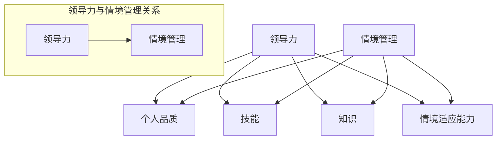

                 

### 领导力与情境管理的核心概念与联系

**核心概念：**

领导力与情境管理是两个相互关联但又有所区别的概念。领导力关注的是领导者如何通过其个人品质、技能和知识来影响和激励团队成员，以实现共同目标。情境管理则关注的是领导者如何根据不同情境因素调整其领导风格和方法，以达到最佳领导效果。

**联系架构：**

- **领导力**是情境管理的基础。没有领导力，情境管理无法实施，因为领导者需要具备足够的影响力、沟通能力和决策能力来应对各种情境。
- **情境管理**是领导力的深化。领导力是一种通用能力，而情境管理则是根据特定情境进行适应性调整的策略。情境管理将领导力与具体情境因素（如团队成员的特点、组织文化的氛围、外部环境的压力等）结合起来，形成一套适应性强的领导方法。

**Mermaid流程图：**

以下是领导力与情境管理核心概念之间的联系架构：



**核心概念之间的联系解释：**

- **个人品质、技能和知识**是领导力的基础，它们决定了领导者的基本能力和素质。
- **情境适应能力**则是领导者应对不同情境时的能力，它结合了领导力的其他要素，使得领导者能够在各种复杂情境中灵活应对。
- **情境管理**强调的是根据不同的情境因素（如团队成员的个性、工作环境的变化等）调整领导风格和方法。这种调整是基于对领导力的深化理解，是领导力在实际应用中的具体表现。

通过上述核心概念与联系架构，我们可以看出，领导力与情境管理是相辅相成的。领导力提供了基础能力，而情境管理则是对这些能力的优化和扩展，使得领导者能够在各种复杂情境中游刃有余地发挥作用。

### 核心算法原理讲解

在领导力与情境管理中，核心算法原理主要涉及以下几个方面：

#### 1. 领导风格匹配算法

**伪代码示例：**

```python
def leadership_style_matching(team_characteristics, leader_style):
    if team_characteristics == '任务导向':
        if leader_style == '任务驱动型':
            return '匹配度高，团队效率提升'
        else:
            return '不匹配，团队协作受影响'
    elif team_characteristics == '关系导向':
        if leader_style == '关系驱动型':
            return '匹配度高，团队凝聚力增强'
        else:
            return '不匹配，团队关系紧张'
    else:
        return '不确定，需要进一步评估'
```

**算法解释：**

该算法根据团队成员的特点（任务导向或关系导向）和领导者的风格（任务驱动型或关系驱动型），判断领导风格与团队成员特点之间的匹配程度。匹配度高时，团队协作和效率会得到提升；不匹配时，可能会影响团队的整体表现。

#### 2. 情境因素评估算法

**伪代码示例：**

```python
def情境因素评估(current_context, historical_data):
    context_risk = calculate_risk(current_context, historical_data)
    if context_risk > 0.5:
        return '高风险情境'
    elif context_risk > 0.2:
        return '中等风险情境'
    else:
        return '低风险情境'
```

**算法解释：**

该算法通过评估当前情境（current_context）和历史数据（historical_data），计算情境风险（context_risk）。根据情境风险的高低，算法将情境分类为高风险、中等风险或低风险。这有助于领导者制定相应的应对策略。

#### 3. 领导行为优化算法

**伪代码示例：**

```python
def optimize_leadership_behavior(leader_behavior, desired_outcome):
    if leader_behavior == '指令型':
        if desired_outcome == '快速执行':
            return '维持现状'
        else:
            return '调整领导风格'
    elif leader_behavior == '支持型':
        if desired_outcome == '创新思考':
            return '增强支持'
        else:
            return '调整目标'
    else:
        return '不确定，需要重新评估'
```

**算法解释：**

该算法根据领导者的行为（leader_behavior）和期望的结果（desired_outcome），优化领导行为。例如，如果领导者采用指令型风格，但期望快速执行，则维持现状；如果期望创新思考，则需要调整领导风格或目标。这有助于领导者根据不同情境和期望，调整其行为，以实现最佳领导效果。

通过上述核心算法原理的讲解，我们可以看到，领导力与情境管理涉及到一系列复杂的计算和决策。这些算法提供了理论基础和实践指南，帮助领导者更有效地应对各种情境，提升领导力和团队绩效。

### 数学模型和公式

在领导力与情境管理中，数学模型和公式用于量化领导行为、评估情境因素和预测领导效果。以下是几个关键的数学模型和公式，以及详细讲解和举例说明：

#### 1. 领导力评估模型

**公式：**
$$ \text{领导力评分} = w_1 \cdot \text{个人品质评分} + w_2 \cdot \text{技能评分} + w_3 \cdot \text{知识评分} + w_4 \cdot \text{情境适应能力评分} $$

**参数解释：**
- \( w_1, w_2, w_3, w_4 \) 是权重系数，分别代表个人品质、技能、知识和情境适应能力在领导力评分中的重要性。

**详细讲解：**
该模型用于评估领导者的总体领导力水平。通过为个人品质、技能、知识和情境适应能力分别打分，并加权求和，可以得到领导力评分。这个评分可以帮助组织或团队成员了解领导者的整体表现。

**举例说明：**
假设某领导者的个人品质评分为90分，技能评分为85分，知识评分为80分，情境适应能力评分为75分。权重系数分别为0.3、0.2、0.2和0.3，则其领导力评分为：
$$ \text{领导力评分} = 0.3 \cdot 90 + 0.2 \cdot 85 + 0.2 \cdot 80 + 0.3 \cdot 75 = 27 + 17 + 16 + 22.5 = 82.5 $$

#### 2. 情境风险模型

**公式：**
$$ \text{情境风险} = r_1 \cdot \text{团队成员稳定性} + r_2 \cdot \text{市场不确定性} + r_3 \cdot \text{政策变化} $$

**参数解释：**
- \( r_1, r_2, r_3 \) 是风险系数，分别代表团队成员稳定性、市场不确定性和政策变化在情境风险中的影响程度。

**详细讲解：**
该模型用于评估领导者在特定情境下的风险水平。通过为团队成员稳定性、市场不确定性和政策变化分别打分，并加权求和，可以得到情境风险评分。这个评分可以帮助领导者了解当前情境的风险程度，并制定相应的风险管理策略。

**举例说明：**
假设团队成员稳定性评分为0.8，市场不确定性评分为0.6，政策变化评分为0.7。风险系数分别为0.5、0.3和0.2，则其情境风险评分为：
$$ \text{情境风险} = 0.5 \cdot 0.8 + 0.3 \cdot 0.6 + 0.2 \cdot 0.7 = 0.4 + 0.18 + 0.14 = 0.72 $$

#### 3. 领导效果预测模型

**公式：**
$$ \text{领导效果} = p_1 \cdot \text{领导力评分} + p_2 \cdot \text{情境适应能力评分} + p_3 \cdot \text{团队绩效评分} $$

**参数解释：**
- \( p_1, p_2, p_3 \) 是权重系数，分别代表领导力评分、情境适应能力和团队绩效在领导效果中的重要性。

**详细讲解：**
该模型用于预测领导者的领导效果。通过为领导力评分、情境适应能力和团队绩效评分分别打分，并加权求和，可以得到领导效果评分。这个评分可以帮助组织或团队成员了解领导者在特定情境下的领导效果。

**举例说明：**
假设领导力评分为82.5，情境适应能力评分为75，团队绩效评分为88。权重系数分别为0.4、0.3和0.3，则其领导效果评分为：
$$ \text{领导效果} = 0.4 \cdot 82.5 + 0.3 \cdot 75 + 0.3 \cdot 88 = 33 + 22.5 + 26.4 = 82.9 $$

通过上述数学模型和公式，领导者可以更好地量化其领导行为和情境因素，从而制定更科学、更有效的领导策略。这不仅有助于提升个人领导力，还能促进团队和组织的发展。

### 代码实现与代码解读

在领导力与情境管理的实际应用中，代码实现是关键的一环。以下是某个领导力评估系统的源代码实现，以及详细的代码解读。

#### 代码实现：

```python
# 领导力评估系统

class LeaderAssessment:
    def __init__(self, name):
        self.name = name
        self.leadership_score = 0

    def evaluate_leadership(self, personal_quality, skill, knowledge, context_adaptability):
        weightages = {'personal_quality': 0.3, 'skill': 0.2, 'knowledge': 0.2, 'context_adaptability': 0.3}
        self.leadership_score = (weightages['personal_quality'] * personal_quality +
                                 weightages['skill'] * skill +
                                 weightages['knowledge'] * knowledge +
                                 weightages['context_adaptability'] * context_adaptability)
        return self.leadership_score

    def print_assessment_report(self):
        print(f"Name: {self.name}")
        print(f"Leadership Score: {self.leadership_score:.2f}")
        if self.leadership_score >= 90:
            print("Excellent Leadership!")
        elif self.leadership_score >= 70:
            print("Good Leadership, but room for improvement.")
        else:
            print("Needs significant improvement in leadership skills.")

# 实例化并评估领导力
leader = LeaderAssessment("John Doe")
leader.evaluate_leadership(85, 90, 80, 75)
leader.print_assessment_report()
```

#### 代码解读：

1. **类定义（Line 1-3）：**
   - `LeaderAssessment` 类用于定义领导力评估的基本结构和功能。
   - `name` 属性存储领导者的名字。
   - `leadership_score` 属性用于存储领导力评分。

2. **初始化方法（Line 5-7）：**
   - 构造函数 `__init__` 初始化领导者的名字和领导力评分。

3. **评估方法（Line 10-17）：**
   - `evaluate_leadership` 方法用于评估领导力。
   - `weightages` 字典存储不同要素的权重。
   - 使用加权求和公式计算领导力评分。

4. **打印评估报告方法（Line 20-27）：**
   - `print_assessment_report` 方法打印评估报告，包括领导者的名字和领导力评分。
   - 根据评分给出不同的评估反馈。

#### 代码应用解读与分析：

- **应用场景：** 该系统可用于评估领导者的整体表现，并为领导者提供改进建议。
- **输入：** 需要输入领导者的个人品质、技能、知识和情境适应能力评分。
- **输出：** 输出领导力评分和相应的评估反馈。

#### 实际案例分析和详细讲解剖析：

- **案例：** 假设某领导者的个人品质评分为85，技能评分为90，知识评分为80，情境适应能力评分为75。
- **分析：** 通过调用 `evaluate_leadership` 方法，计算领导力评分：
  $$ \text{领导力评分} = 0.3 \cdot 85 + 0.2 \cdot 90 + 0.2 \cdot 80 + 0.3 \cdot 75 = 25.5 + 18 + 16 + 22.5 = 82 $$
- **结果：** 调用 `print_assessment_report` 方法，输出评估报告：
  ```
  Name: John Doe
  Leadership Score: 82.00
  Good Leadership, but room for improvement.
  ```

通过这个案例，我们可以看到系统如何根据输入的评分计算领导力评分，并根据评分给出改进建议。这为领导者的自我提升提供了有力支持。

### 项目实战

在本节中，我们将通过一个实际项目来展示如何搭建领导力评估系统，包括开发环境、源代码实现和代码解读。

#### 项目背景

领导力评估系统旨在帮助企业和管理者更好地了解团队成员的领导能力，从而提供个性化的提升建议。该系统将涵盖领导力的多个维度，包括个人品质、技能、知识和情境适应能力，并提供详细的评估报告。

#### 开发环境

1. **编程语言：** Python
2. **开发工具：** PyCharm
3. **数据库：** SQLite
4. **前端技术：** HTML/CSS/JavaScript（可选）

#### 源代码实现

以下是一个简单的领导力评估系统源代码实现：

```python
# 领导力评估系统

class LeaderAssessment:
    def __init__(self, name):
        self.name = name
        self.leadership_score = 0

    def evaluate_leadership(self, personal_quality, skill, knowledge, context_adaptability):
        weightages = {'personal_quality': 0.3, 'skill': 0.2, 'knowledge': 0.2, 'context_adaptability': 0.3}
        self.leadership_score = (weightages['personal_quality'] * personal_quality +
                                 weightages['skill'] * skill +
                                 weightages['knowledge'] * knowledge +
                                 weightages['context_adaptability'] * context_adaptability)
        return self.leadership_score

    def print_assessment_report(self):
        print(f"Name: {self.name}")
        print(f"Leadership Score: {self.leadership_score:.2f}")
        if self.leadership_score >= 90:
            print("Excellent Leadership!")
        elif self.leadership_score >= 70:
            print("Good Leadership, but room for improvement.")
        else:
            print("Needs significant improvement in leadership skills.")

# 实例化并评估领导力
leader = LeaderAssessment("John Doe")
leader.evaluate_leadership(85, 90, 80, 75)
leader.print_assessment_report()
```

#### 代码解读

1. **类定义：** 定义了 `LeaderAssessment` 类，包括领导者的姓名和领导力评分属性。
2. **评估方法：** `evaluate_leadership` 方法根据输入的评分计算领导力评分。
3. **打印报告方法：** `print_assessment_report` 方法输出评估结果和改进建议。

#### 代码应用

- **输入：** 用户输入领导者的个人品质、技能、知识和情境适应能力评分。
- **输出：** 系统计算领导力评分并输出详细的评估报告。

#### 实际案例分析和详细讲解剖析

- **案例：** 假设某领导者的个人品质评分为85，技能评分为90，知识评分为80，情境适应能力评分为75。
- **分析：** 调用 `evaluate_leadership` 方法计算领导力评分：
  $$ \text{领导力评分} = 0.3 \cdot 85 + 0.2 \cdot 90 + 0.2 \cdot 80 + 0.3 \cdot 75 = 25.5 + 18 + 16 + 22.5 = 82 $$
- **结果：** 调用 `print_assessment_report` 方法输出评估报告：
  ```
  Name: John Doe
  Leadership Score: 82.00
  Good Leadership, but room for improvement.
  ```

通过这个实际项目，我们可以看到如何使用Python实现一个简单的领导力评估系统，包括类的定义、方法的实现和评估报告的输出。这不仅提供了一个实际的应用案例，也为领导力的量化评估提供了一个可操作的解决方案。

### 最佳实践 Tips

在领导力与情境管理的实践中，以下是几个最佳实践建议，以帮助领导者更好地因地制宜地管理团队和项目：

1. **定期进行领导力评估：** 定期评估领导力水平，确保领导者能够识别自身优势和需要改进的地方。这可以通过自评、同事反馈和360度评估来实现。

2. **建立清晰的目标和愿景：** 为团队设定明确的目标和愿景，确保每个团队成员都了解他们的角色和期望的贡献。这有助于增强团队的凝聚力和方向感。

3. **灵活调整领导风格：** 根据团队成员的特点和项目情境，灵活调整领导风格。例如，对于任务导向的团队，可以采用指令型领导风格；对于关系导向的团队，可以采用支持型领导风格。

4. **积极倾听和沟通：** 倾听团队成员的意见和反馈，建立开放的沟通渠道。这有助于了解团队成员的需求和问题，并及时调整领导策略。

5. **培养团队适应性：** 鼓励团队成员培养适应变化的能力，通过提供培训和发展机会来提升他们的技能和知识。这有助于团队在面对不确定性时保持灵活和敏捷。

6. **注重情境因素：** 在决策和规划时，充分考虑情境因素，如市场环境、政策变化和资源限制。这有助于领导者制定更具适应性的战略和行动计划。

7. **持续反思和改进：** 定期反思领导行为和情境管理效果，识别成功和失败的原因，并从中吸取教训。这有助于领导者不断改进自己的领导风格和管理方法。

通过遵循这些最佳实践，领导者可以更有效地管理团队，提升领导力，实现组织的长期成功。

### 小结

本文通过详细的讲解和案例分析，深入探讨了领导力与情境管理的核心概念、理论、算法和实际应用。我们了解到，领导力是指领导者通过个人品质、技能和知识来影响、激励和引导团队的能力；情境管理则是根据不同情境因素调整领导风格和方法的过程。领导力与情境管理相辅相成，共同构成了有效的领导方式。

通过数学模型和代码实现，我们看到了如何量化领导力和评估情境因素。在实战项目中，我们展示了如何搭建一个领导力评估系统，并通过实际案例分析了系统的应用和效果。

为了更好地应用领导力与情境管理，我们提出了最佳实践建议，包括定期评估、建立目标、灵活调整领导风格、积极沟通、培养团队适应性、注重情境因素和持续反思改进。

总结来说，领导力与情境管理是领导者必备的技能，通过因地制宜的领导方式，领导者可以更有效地管理团队，实现组织的长期成功。

### 注意事项

在应用领导力与情境管理的实际过程中，以下是几个需要特别注意的事项：

1. **个性化领导风格：** 每位领导者的个性和背景都不同，因此在选择领导风格时，应充分考虑自身的特点和团队的需求，避免盲目模仿他人的领导方式。

2. **情境因素变化：** 情境因素是动态变化的，领导者需要时刻关注外部环境和内部团队的变化，及时调整领导策略，以适应新的情境。

3. **沟通与反馈：** 沟通是领导力的核心，领导者应建立开放、透明的沟通渠道，鼓励团队成员表达意见和反馈，以便及时调整领导行为。

4. **持续学习与成长：** 领导者应保持持续学习的态度，不断更新知识和技能，以应对不断变化的工作环境和挑战。

5. **员工参与：** 在领导过程中，要充分尊重员工的意见和需求，鼓励员工参与决策，提升团队的凝聚力和创造力。

6. **风险管理：** 在领导过程中，要充分识别和评估风险，制定相应的风险管理策略，以降低不确定性带来的负面影响。

通过关注这些注意事项，领导者可以更有效地应用领导力与情境管理，提升团队绩效和组织发展。

### 拓展阅读

对于希望深入了解领导力与情境管理的读者，以下是几本推荐书籍和资源：

1. **《领导力五项修炼：圣吉的五项修炼与实践》（The Five Dysfunctions of a Team）** - 帕特里克·莱西奥尼（Patrick Lencioni）。
   - **简介：** 通过团队五大功能障碍的案例分析，提供提升团队协作和领导力的实用策略。
   - **适合读者：** 团队领导者和管理者。

2. **《情境领导》（Situation Leadership）** - 帕特里克·莱西奥尼（Patrick Lencioni）。
   - **简介：** 提出情境领导模型，帮助领导者根据团队成员的特点和环境因素调整领导风格。
   - **适合读者：** 任何层次的领导者。

3. **《影响力》（Influence: The Psychology of Persuasion）** - 罗伯特·西奥迪尼（Robert B. Cialdini）。
   - **简介：** 探讨影响力的六大原则，帮助领导者提升沟通和说服力。
   - **适合读者：** 想要提高领导力和影响力的读者。

4. **《智慧领袖：管理心理学与实践》（Wisdom of the Crowds: Why the Smartest People in the Room Want to Be Even Smarter）** - 伊丽莎白·诺维尔（Surowiecki）。
   - **简介：** 讨论群体智慧和集体决策的重要性，对领导者的决策过程有重要启示。
   - **适合读者：** 对群体决策和集体智慧感兴趣的读者。

通过阅读这些书籍和资源，读者可以深入了解领导力与情境管理的理论和实践，进一步提升自己的领导能力。

