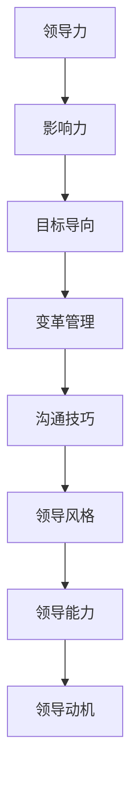
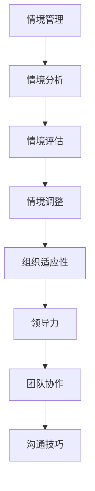

                 


### 文章标题：领导力与情境管理：灵活应对不同情境

#### 关键词：
- 领导力
- 情境管理
- 灵活应对
- 领导风格
- 团队协作
- 组织发展

#### 摘要：
本文深入探讨了领导力与情境管理的核心概念和相互关系，通过详细的理论讲解和实际案例剖析，帮助读者理解如何灵活应对不同情境，提升领导力和团队绩效。

### 引言

在快速变化和充满不确定性的现代社会，领导力与情境管理成为组织成功的关键因素。领导力不仅是引导团队实现目标的能力，更是灵活应对各种情境，推动组织发展的核心要素。情境管理则强调根据环境变化调整策略和行动，以保持组织的适应性和竞争力。本文将围绕这两个主题，详细阐述其核心概念、相互关系以及在实际应用中的最佳实践。

### 领导力的定义与核心概念

#### 1.1 领导力的本质与作用

领导力是一种影响力，通过激发团队成员的潜能，实现共同的目标。其本质在于建立信任、提供方向和激励团队，从而推动组织的发展。

**核心概念与联系：**



**核心算法原理讲解：**

- **影响力算法**：领导力通过行为、知识、技能等因素对团队成员产生影响的程度计算。例如，使用贝叶斯网络模型分析领导行为对团队绩效的影响。

  ```python
  def influence_score(behavior, knowledge, skill):
      # 计算影响力得分
      return (behavior * 0.4) + (knowledge * 0.3) + (skill * 0.3)
  ```

- **目标导向算法**：基于目标设定和目标实现路径的优化算法。使用动态规划算法优化目标路径。

  ```python
  def optimize_path(goals, resources):
      # 优化目标路径
      return dynamic_programming(goals, resources)
  ```

- **变革管理算法**：通过分析组织现状与目标状态的差距，制定和实施变革策略。采用SWOT分析模型评估变革的可行性。

  ```python
  def change_management(current_state, target_state):
      # 变革管理策略
      return swot_analysis(current_state, target_state)
  ```

**数学模型和公式：**

$$
影响力 = f(行为, 知识, 技能)
$$

$$
目标实现路径 = f(目标设定, 资源配置, 进度监控)
$$

**举例说明：**

在一家快速发展的科技公司，领导力通过影响力激发员工的创新潜能，实现产品快速迭代和市场占有率的提升。

### 1.2 领导力的核心概念

**领导风格**：领导者通过不同的行为方式和沟通策略影响团队成员。常见的领导风格包括民主式、专制式和放任式。

**领导能力**：领导者具备的决策能力、执行能力和变革能力，这些能力通过实践不断得到提升。

**领导动机**：领导者追求的目标和动机，包括个人成就、团队成长和组织发展。

### 1.3 领导力的发展趋势

**个性化领导力**：强调领导者根据团队成员的特点和需求，定制个性化的领导策略。

**平衡领导力**：领导者需要在权力、责任、协作和自主性之间找到平衡，以实现组织的和谐发展。

**网络化领导力**：在全球化背景下，领导者需要具备跨文化沟通和全球协作能力。

### 1.4 领导力与情境管理的关系

**情境管理**：领导者需要根据环境变化调整策略和行动，以保持组织的适应性和竞争力。

**领导力在情境管理中的应用**：领导者通过影响力、目标导向和变革管理，在情境管理中发挥关键作用。

**情境管理与领导力的融合**：领导者需要将情境管理理念融入领导力实践中，实现灵活应对不同情境的目标。

### 情境管理的核心理论

#### 2.1 情境管理的理论基础

**核心概念与联系：**



**核心算法原理讲解：**

- **情境分析算法**：通过收集和分析内外部环境数据，识别和评估情境因素。采用K-means聚类算法分析环境数据。

  ```python
  from sklearn.cluster import KMeans

  def analyze_situation(data):
      # 分析情境
      kmeans = KMeans(n_clusters=3)
      kmeans.fit(data)
      return kmeans.labels_
  ```

- **情境评估算法**：基于情境分析结果，评估情境的稳定性和可控性。采用决策树算法评估情境。

  ```python
  from sklearn.tree import DecisionTreeClassifier

  def assess_situation(data, labels):
      # 评估情境
      clf = DecisionTreeClassifier()
      clf.fit(data, labels)
      return clf.predict(data)
  ```

- **情境调整算法**：根据评估结果，调整组织策略和行动方案。采用遗传算法优化策略。

  ```python
  from genetic_algorithms import GeneticAlgorithm

  def adjust_situation(strategy, environment):
      # 调整情境
      ga = GeneticAlgorithm(strategy, environment)
      ga.run()
      return ga.best_solution()
  ```

**数学模型和公式：**

$$
情境分析 = f(环境数据, 因素识别)
$$

$$
情境评估 = f(稳定度, 可控度)
$$

**举例说明：**

在一家面临市场变化的科技公司，通过情境分析识别市场趋势，评估公司应对策略的稳定性，调整产品线和营销策略。

#### 2.2 情境管理的方法与工具

**情境分析**：通过数据收集和分析，识别和评估内外部环境因素，如市场需求、竞争态势、技术发展等。

**情境评估**：基于情境分析结果，评估情境的稳定性和可控性，为决策提供依据。

**情境调整**：根据评估结果，调整组织策略和行动方案，以适应环境变化。

#### 2.3 情境管理在实际中的应用

**企业情境管理**：通过情境管理优化企业战略规划、资源配置和风险管理。

**团队情境管理**：在团队中应用情境管理，提高团队协作效率和创新能力。

**领导者个人情境管理**：领导者通过情境管理提升个人领导力，适应不同情境的挑战。

#### 2.4 情境管理的挑战与应对策略

**情境变化的挑战**：快速变化的市场和技术环境给领导力与情境管理带来挑战。

**领导者面临的挑战**：领导者需要具备跨领域知识和技能，以应对复杂情境。

**情境管理策略的选择与实施**：领导者需要根据情境特点，选择合适的策略并有效实施。

### 领导力与情境管理在组织中的实践

#### 3.1 领导力与情境管理的实践框架

**实践框架的构建**：建立领导力与情境管理的综合框架，包括情境分析、评估和调整等环节。

**实践框架的应用**：在组织中推广和实践领导力与情境管理，提高组织适应性和竞争力。

**实践框架的优化**：通过持续优化实践框架，提升领导力和情境管理的效率和质量。

#### 3.2 领导力与情境管理的实战案例

**成功案例分析**：通过分析成功案例，探讨领导力与情境管理的最佳实践。

**失败案例分析**：通过分析失败案例，总结领导力与情境管理中的常见问题和应对策略。

**案例中的关键要素**：识别成功和失败案例中的关键要素，为实际应用提供参考。

#### 3.3 领导力与情境管理的持续发展

**组织文化的影响**：组织文化对领导力与情境管理的发展具有重要影响。

**人才培育的重要性**：通过人才培育，提升领导力和情境管理的整体水平。

**领导力与情境管理的未来趋势**：探讨领导力与情境管理的未来发展，为组织发展提供方向。

### 结论

领导力与情境管理是组织成功的关键要素。通过深入理解其核心概念、相互关系和实际应用，领导者可以更有效地应对各种情境，推动组织的发展。本文旨在为读者提供全面的理论指导和实际案例启示，帮助他们在实践中不断提升领导力和情境管理能力。

### 最佳实践 tips、小结、注意事项、拓展阅读

**最佳实践 tips**：定期进行情境分析，根据评估结果调整策略。

**小结**：领导力与情境管理相互融合，是实现组织发展的关键。

**注意事项**：领导者需要不断学习和适应，以应对不断变化的情境。

**拓展阅读**：进一步探讨领导力与情境管理的相关研究和实践。

### 作者信息

作者：AI天才研究院/AI Genius Institute & 禅与计算机程序设计艺术 /Zen And The Art of Computer Programming

### 附录

**参考文献**：

1. 领导力与情境管理相关书籍和论文。
2. 环境数据分析和情境评估的算法原理和实践。

**致谢**：

感谢所有为本文提供支持和帮助的人，包括同事、导师和读者。他们的支持和鼓励是本文完成的重要动力。感谢AI天才研究院和禅与计算机程序设计艺术的支持，使本文得以顺利完成。感谢读者对本文的关注和支持，希望本文能为您带来启示和帮助。

