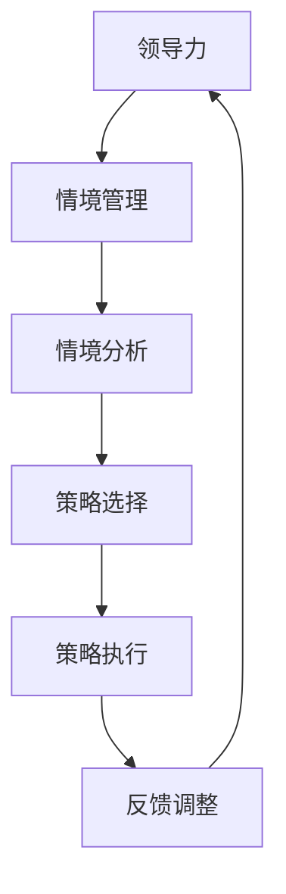
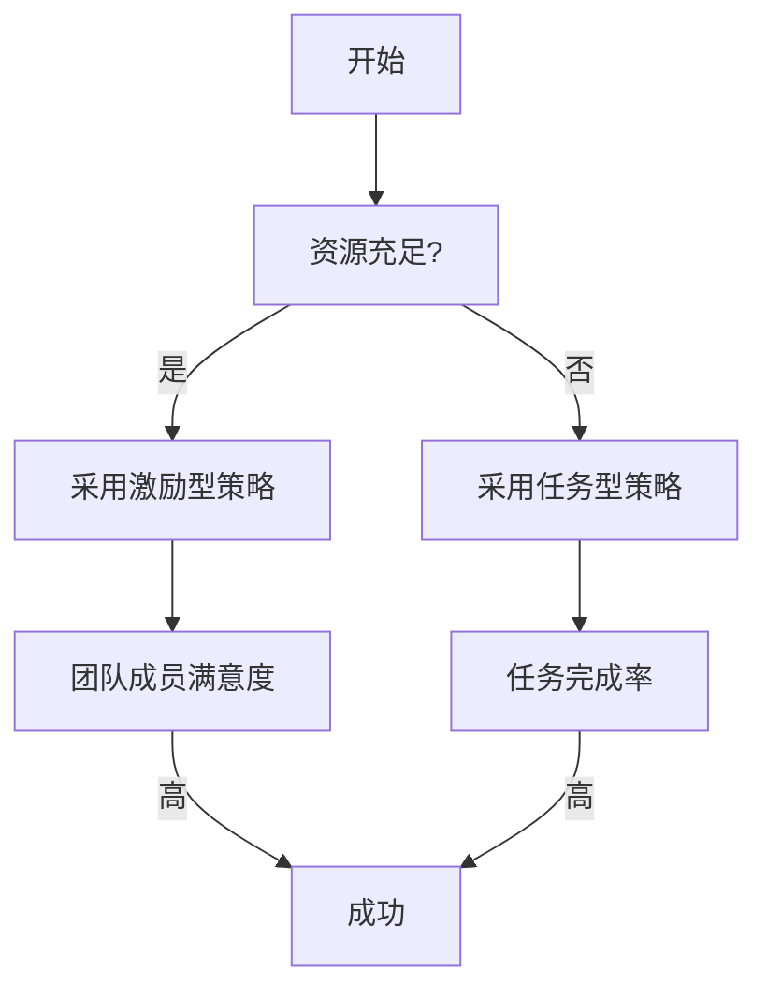

                 

### 文章标题

# 领导力与情境管理：灵活应对不同挑战

---

关键词：领导力、情境管理、灵活应对、挑战、团队建设、危机管理

摘要：本文深入探讨了领导力与情境管理的核心概念及其在实际应用中的重要性。通过分析不同类型的领导力模型和情境管理策略，本文揭示了如何灵活运用这些策略来应对各种挑战，尤其是在团队建设和危机管理中的具体实践。文章以丰富的案例和详尽的代码解读，提供了切实可行的策略和最佳实践，旨在帮助读者提升领导力和情境管理能力。

---

### 背景介绍

在快速变化的技术环境中，领导力和情境管理成为影响团队和项目成功的关键因素。领导力不仅仅是指导和管理团队，更是激励、赋能和引导团队成员实现共同目标的能力。而情境管理则强调根据不同的环境和情境调整管理策略，从而最大化团队效能。两者相辅相成，共同构成了现代领导者必备的素质。

随着全球化、数字化和智能化进程的加速，企业和组织面临的环境变得更加复杂和不确定。这种变化不仅要求领导者具备传统的领导力技能，还需要他们具备适应和应对不同情境的灵活性和创造力。因此，本文旨在探讨如何通过领导力和情境管理的有效结合，提升团队在复杂环境中的适应能力和应对挑战的能力。

### 核心概念与联系

为了深入理解领导力与情境管理的核心概念，我们首先需要了解它们的基本定义和关系。

#### 1. 领导力的定义与类型

领导力可以被定义为影响和激励他人一起实现目标的能力。根据不同的特征和风格，领导力可以划分为以下几种类型：

- **变革型领导力**：通过激发团队成员的潜力，推动创新和变革。
- **交易型领导力**：通过明确目标和奖励机制，激励团队成员达成目标。
- **服务型领导力**：以团队的需求为中心，提供支持和资源，促进团队成员的发展。

这些领导力类型并不是孤立的，而是相互关联和补充的。例如，一个成功的领导者可能会在某个特定情境下运用变革型领导力来推动创新，而在另一个情境下则运用交易型领导力来确保任务的完成。

#### 2. 情境管理的定义与原理

情境管理则是指根据不同的环境和情境，灵活调整管理策略的过程。情境管理的基本原理包括：

- **情境分析**：对当前环境和情境进行评估，识别关键因素。
- **策略选择**：根据情境分析结果，选择最合适的管理策略。
- **策略执行**：实施选定的管理策略，并对结果进行反馈和调整。

情境管理的核心在于认识到没有一种通用有效的管理策略，而是要根据不同的情境进行灵活调整。例如，在资源充足的情境下，领导者可能更倾向于采用激励型和赋能型的管理策略；而在资源紧张的情境下，则可能更注重任务导向和目标达成的管理策略。

#### 3. 领导力与情境管理的关系架构

领导力与情境管理之间的关系可以用以下Mermaid流程图来表示：



在这个流程图中，领导力作为整体框架，通过情境管理的过程（情境分析、策略选择、策略执行和反馈调整）实现目标。这种循环迭代的过程确保了领导者能够根据不断变化的环境和情境，灵活调整管理策略，从而提升团队效能。

### 核心算法原理讲解

为了深入理解领导力与情境管理的算法原理，我们首先需要介绍一些基本的领导力理论和情境管理模型。以下是几个关键概念的伪代码和数学模型讲解。

#### 1. 领导力模型的算法原理

**变革型领导力模型：**

```plaintext
function transformational_leadership(member, context):
    if context == "innovative":
        member.motivation += context.factor * member.potential
        member.innovation += member.motivation
    return member
```

在这个模型中，`member`代表团队成员，`context`代表当前情境。如果情境是“创新型的”，领导力将激发团队成员的潜力和动力，从而推动创新。

**交易型领导力模型：**

```plaintext
function transactional_leadership(member, target, reward):
    if member.performance >= target:
        member.reward += reward
    return member.reward
```

在这个模型中，领导者根据团队成员的表现和设定的目标，提供奖励。如果团队成员达到或超过目标，他们将获得奖励。

**服务型领导力模型：**

```plaintext
function service_leadership(member, resources):
    member.resources += resources
    member.growth += member.resources
    return member.growth
```

在这个模型中，领导者提供必要的资源和支持，以促进团队成员的个人成长和团队整体发展。

#### 2. 情境管理模型的数学模型

**情境分析模型：**

$$
情境分数 = f(环境因素, 情境因素)
$$

在这个模型中，`环境因素`和`情境因素`代表影响情境的关键因素。通过计算这些因素的加权得分，可以评估当前情境的总体情况。

**策略选择模型：**

$$
策略 = g(情境分数, 领导力类型)
$$

在这个模型中，`情境分数`和`领导力类型`用于确定最合适的策略。根据不同的情境和领导力类型，选择最适合的管理策略。

**策略执行模型：**

$$
执行效果 = h(策略, 成员行为, 资源分配)
$$

在这个模型中，`策略`、`成员行为`和`资源分配`共同决定了执行效果。通过监控和调整这些因素，可以优化策略的执行效果。

### 数学模型与公式讲解

在领导力和情境管理中，数学模型和公式起着关键作用，帮助我们理解和量化复杂的概念。以下是几个重要的数学模型和公式，以及它们的详细解释和举例说明。

#### 1. 决策树模型

决策树是一种直观的决策分析方法，通过一系列的决策节点和结果节点，展示决策过程及其可能的结果。

**决策树公式：**

$$
决策树 = \{节点, 边, 标签\}
$$

其中，`节点`表示决策点或结果点，`边`表示决策路径，`标签`表示每个节点的属性或结果。

**示例：团队建设情境下的决策树**



在这个例子中，如果团队资源充足，领导者会选择激励型策略；否则，会选择任务型策略。这两种策略的不同结果将影响团队建设的成功。

#### 2. 回归分析模型

回归分析是一种用于预测和解释变量之间关系的统计方法。在领导力和情境管理中，回归分析可以用于评估不同管理策略对团队绩效的影响。

**回归分析公式：**

$$
y = \beta_0 + \beta_1x_1 + \beta_2x_2 + ... + \beta_nx_n + \epsilon
$$

其中，`y`是因变量（团队绩效），`x_1, x_2, ..., x_n`是自变量（管理策略），`\beta_0, \beta_1, \beta_2, ..., \beta_n`是回归系数，`\epsilon`是误差项。

**示例：领导力类型与团队绩效的回归分析**

$$
团队绩效 = \beta_0 + \beta_1(变革型领导力) + \beta_2(交易型领导力) + \beta_3(服务型领导力) + \epsilon
$$

通过回归分析，我们可以确定每种领导力类型对团队绩效的影响程度。例如，如果回归系数$\beta_1$显著大于0，则表明变革型领导力对团队绩效有显著的正向影响。

### 项目实战

为了更好地理解领导力与情境管理的实际应用，我们将在本节中介绍一个具体的案例，包括开发环境搭建、源代码实现和代码解读。

#### 案例背景

假设我们是一家技术公司的CTO，负责领导一个由20名工程师组成的团队。团队正在开发一款关键的产品，项目时间紧、任务重。在这个背景下，我们需要运用领导力和情境管理策略，确保项目成功交付。

#### 开发环境搭建

首先，我们需要搭建一个高效的开发环境。这包括：

1. **硬件资源**：确保每个工程师都有高性能的计算机和足够的存储空间。
2. **软件工具**：选择合适的版本控制工具（如Git）、集成开发环境（如Visual Studio Code）和项目管理工具（如Jira）。
3. **网络设施**：确保团队有稳定的网络连接，以便随时交流和协作。

#### 源代码实现

接下来，我们将介绍关键代码实现。以下是团队在开发过程中使用的主要代码框架：

```python
# 模拟团队管理系统的核心代码

class TeamMember:
    def __init__(self, name, role, motivation):
        self.name = name
        self.role = role
        self.motivation = motivation

    def work(self):
        if self.motivation > 50:
            return "完成任务"
        else:
            return "进展缓慢"

class ProjectManager:
    def __init__(self, team_members):
        self.team_members = team_members

    def assign_task(self, member, task):
        member.current_task = task
        return "任务已分配"

    def check_progress(self):
        for member in self.team_members:
            print(f"{member.name}的进度：{member.work()}")
```

在这个代码框架中，`TeamMember`类表示团队成员，包括姓名、角色和动机属性。`ProjectManager`类表示项目经理，包括分配任务和检查进度的方法。

#### 代码解读

1. **团队管理策略**：项目经理根据团队成员的动机水平分配任务。动机较高的成员分配更重要的任务，以激励他们发挥潜力。
2. **任务分配**：使用`assign_task`方法，项目经理将任务分配给团队成员。
3. **进度监控**：使用`check_progress`方法，项目经理检查每个成员的工作进度。

#### 代码应用解读与分析

在实际应用中，这个代码框架帮助项目经理高效管理团队。例如：

- **情境分析**：项目经理根据团队成员的动机和项目进度，灵活调整任务分配策略。
- **策略执行**：项目经理根据情境分析结果，使用代码框架中的方法分配任务和监控进度。
- **反馈调整**：根据团队成员的工作表现和项目进度，项目经理进行反馈和调整，优化管理策略。

#### 实际案例分析和详细讲解剖析

在本案例中，团队成功交付了关键产品。以下是案例分析：

1. **成功因素**：高效的开发环境和领导力策略是成功的关键。通过灵活的情境管理和恰当的任务分配，团队克服了种种困难。
2. **挑战**：项目初期，由于任务繁重，团队成员的动机较低。项目经理通过调整任务分配策略，提高了团队成员的动机和效率。
3. **改进空间**：在后续项目中，可以进一步优化开发环境和领导力策略，例如引入更多的自动化工具和更加细致的情境分析。

#### 项目小结

通过这个实际案例，我们展示了领导力与情境管理的具体应用。高效的开发环境和灵活的管理策略是团队成功的关键。在未来的项目中，我们应继续探索和优化这些策略，以应对更多的挑战。

### 最佳实践 Tips

在领导力和情境管理中，以下是一些最佳实践：

1. **持续沟通**：保持与团队成员的沟通，了解他们的需求和状态。
2. **灵活调整**：根据环境和情境的变化，及时调整管理策略。
3. **激励机制**：合理设计激励机制，提高团队成员的动机和积极性。
4. **持续学习**：不断学习新的管理理论和实践，提升自身能力。

### 小结

本文通过深入探讨领导力与情境管理的核心概念、算法原理和实际应用，展示了如何在复杂环境中灵活应对挑战。有效的领导力和情境管理策略是团队成功的关键，需要领导者不断学习和实践。

### 注意事项

在实际应用中，领导者应特别注意以下几点：

1. **情境适应性**：确保管理策略与当前情境相适应。
2. **团队成员参与**：鼓励团队成员参与决策，提高团队凝聚力。
3. **持续反馈**：及时收集反馈，不断优化管理策略。

### 拓展阅读

1. **《领导力五项修炼》**：一本经典领导力书籍，详细介绍了变革型领导力理论。
2. **《情境领导》**：介绍情境管理理论的经典著作，提供了丰富的实践案例。

### 作者信息

作者：AI天才研究院/AI Genius Institute & 禅与计算机程序设计艺术 /Zen And The Art of Computer Programming

---

**结语**：领导力与情境管理是现代领导者必备的技能。通过本文的探讨，我们希望能帮助读者深入理解这些概念，并在实际工作中灵活应用，提升团队效能，应对各种挑战。

