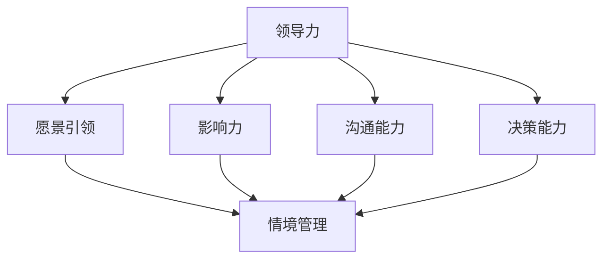

                 

### 文章标题：领导力与情境管理：灵活应对多变环境

> 关键词：领导力、情境管理、多变环境、策略、团队建设、变革管理

> 摘要：本文深入探讨了领导力与情境管理在多变环境中的应用与重要性。通过分析情境管理的基础概念、领导力的发展以及情境管理策略，结合实际案例，展示了如何通过领导力与情境管理来灵活应对环境变化，实现组织目标。

### 第1章：领导力与情境管理基础

#### 1.1 领导力的概念与特征

领导力是指引导和影响他人实现目标的能力。它不仅仅是管理技能，更是一种影响力，能够激发团队成员的潜能，促进团队协作。领导力的特征包括：

- **愿景引领**：领导者要有远大的愿景，能够为团队设定目标，并指引团队朝着目标前进。
- **影响力**：领导者能够通过言行影响他人，使其信服并愿意追随。
- **沟通能力**：有效的沟通是领导力的关键，领导者需要清晰、准确地传达信息，并倾听他人的意见。
- **决策能力**：在复杂多变的环境中，领导者需要迅速做出决策，并能够承担相应的责任。

#### 1.2 情境管理的定义与重要性

情境管理是一种根据不同的环境变化，灵活调整管理策略的方法。其定义包括：

- **情境**：指组织内外部的各种条件，如市场环境、技术变化、竞争态势等。
- **管理策略**：根据不同的情境，采取相应的管理措施，以达到组织目标。

情境管理的重要性体现在以下几个方面：

- **适应变化**：环境变化是不可避免的，情境管理能够帮助组织迅速适应环境变化。
- **提高效率**：通过情境管理，组织可以更有效地利用资源，提高工作效率。
- **增强竞争力**：灵活的情境管理策略能够使组织在竞争激烈的市场中占据优势。

#### 1.3 领导力与情境管理的联系

领导力与情境管理之间存在密切的联系。领导力为情境管理提供了基础，而情境管理则为领导力提供了实践的场景。具体来说：

- **领导力促进情境管理**：领导者通过其领导能力，能够帮助团队成员理解情境管理的意义，并推动其实施。
- **情境管理增强领导力**：通过情境管理，领导者能够更好地了解团队和组织的状况，从而提升自身的领导力。

#### 1.4 领导力与情境管理的框架结构图

为了更好地理解领导力与情境管理的联系，我们可以使用Mermaid流程图来展示其框架结构：

### 第2章：情境分析

#### 2.1 内外部环境评估

情境分析的第一步是对内外部环境进行评估。外部环境包括市场趋势、竞争态势、法律法规等，而内部环境则涉及组织结构、人力资源、财务状况等。具体步骤如下：

1. **收集信息**：通过市场调研、数据分析等方式收集内外部环境的信息。
2. **分析信息**：对收集到的信息进行整理和分析，识别出关键因素。
3. **评估影响**：评估这些关键因素对组织的影响程度，确定其优先级。

#### 2.2 情境分析工具与方法

为了更有效地进行情境分析，可以使用以下工具和方法：

- **SWOT分析**：通过分析组织的优势（Strengths）、劣势（Weaknesses）、机会（Opportunities）和威胁（Threats），全面评估组织所处的环境。
- **PEST分析**：从政治（Political）、经济（Economic）、社会（Social）和技术（Technological）四个方面分析外部环境。
- **五力模型**：通过分析行业中的五种力量（供应商、买家、潜在竞争者、替代品、行业内的竞争者），评估行业的竞争态势。

#### 2.3 趋势预测与风险评估

在情境分析中，趋势预测和风险评估是关键环节。具体步骤如下：

1. **趋势预测**：根据历史数据和现有信息，预测未来可能发生的变化。
2. **风险评估**：对预测出的趋势进行评估，确定其对组织的潜在影响，并制定应对措施。

#### 2.4 实际情境分析案例

为了更好地理解情境分析的应用，我们可以通过一个实际案例来进行分析。假设一家科技公司正在考虑是否进入一个新的市场。

1. **收集信息**：通过市场调研、数据分析等方式收集新市场的信息，如市场规模、增长趋势、竞争对手等。
2. **分析信息**：对新市场的信息进行整理和分析，识别出关键因素。
3. **评估影响**：评估这些关键因素对公司的潜在影响，如市场潜力、竞争态势等。
4. **趋势预测**：预测新市场的未来发展趋势，如市场规模的增长速度、新技术的应用等。
5. **风险评估**：评估这些趋势对公司的潜在影响，如市场风险、技术风险等，并制定应对措施。

### 第3章：情境管理策略

#### 3.1 稳定情境下的管理策略

在稳定情境下，组织可以采取以下管理策略：

1. **优化现有流程**：通过优化现有流程，提高工作效率，降低成本。
2. **加强团队协作**：通过加强团队协作，提高团队的整体执行力。
3. **持续创新**：通过持续创新，保持组织的竞争力。

#### 3.2 动态情境下的管理策略

在动态情境下，组织需要采取更加灵活的管理策略：

1. **快速响应**：通过建立快速响应机制，及时应对环境变化。
2. **灵活调整**：根据环境变化，灵活调整管理策略，以适应新的情况。
3. **培养创新能力**：通过培养创新能力，使组织能够迅速适应环境变化。

#### 3.3 应变情境下的管理策略

在应变情境下，组织需要采取紧急应对措施：

1. **紧急应对**：立即采取紧急措施，控制局面，防止事态恶化。
2. **资源调配**：根据实际情况，合理调配资源，确保关键资源的优先供应。
3. **团队协作**：通过加强团队协作，共同应对危机。

#### 3.4 管理策略的灵活应用

在实际应用中，管理策略需要根据具体情境进行灵活调整。例如：

- 在稳定情境下，可以侧重于优化流程和加强团队协作；
- 在动态情境下，可以侧重于快速响应和灵活调整；
- 在应变情境下，需要立即采取紧急措施，并确保团队协作。

### 第4章：领导力发展

#### 4.1 领导力发展的过程

领导力发展是一个持续的过程，包括以下几个阶段：

1. **自我认知**：了解自己的优势和不足，明确自己的价值观和目标。
2. **学习与成长**：通过学习新的知识和技能，不断提升自己的能力。
3. **实践与反思**：将学到的知识和技能应用于实践，通过反思不断优化自己的领导方式。
4. **持续改进**：在领导实践中，不断寻找改进的机会，持续提升领导力。

#### 4.2 关键领导力技能

关键领导力技能包括：

1. **沟通能力**：能够清晰、准确地传达信息，并倾听他人的意见。
2. **决策能力**：能够在复杂多变的环境中做出快速、准确的决策。
3. **团队合作**：能够建立和领导一个高效的团队，激发团队成员的潜能。
4. **创新思维**：能够不断探索新的解决方案，推动组织的持续创新。

#### 4.3 自我提升方法与工具

为了提升领导力，可以采用以下方法与工具：

1. **阅读与学习**：通过阅读相关书籍和文章，学习领导力的理论知识。
2. **培训与研讨会**：参加专业的培训课程和研讨会，与其他领导者交流经验。
3. **实践与反思**：将学到的知识和技能应用于实践，通过反思不断优化自己的领导方式。
4. **角色扮演**：通过角色扮演，模拟真实的领导情境，提升自己的领导能力。

#### 4.4 领导力发展的实际案例

为了更好地理解领导力发展的过程，我们可以通过一个实际案例来进行分析。假设一位中层管理者希望通过提升领导力来更好地领导团队。

1. **自我认知**：该管理者首先进行了自我认知，明确了自己的优势和不足，并明确了自身的价值观和目标。
2. **学习与成长**：该管理者通过阅读相关书籍和参加培训课程，学习了领导力的理论知识，并不断提升自己的能力。
3. **实践与反思**：该管理者将学到的知识和技能应用于实践，通过反思不断优化自己的领导方式，如改进沟通方式、提高决策能力等。
4. **持续改进**：在领导实践中，该管理者不断寻找改进的机会，如参加领导力研讨会、与其他管理者交流经验等，持续提升自己的领导力。

### 第5章：团队建设与管理

#### 5.1 团队建设的原则

团队建设是领导力的重要组成部分，遵循以下原则：

1. **目标一致性**：确保团队成员的目标一致，为团队的发展提供明确的方向。
2. **信任与尊重**：建立团队成员之间的信任和尊重，促进团队协作。
3. **透明与沟通**：保持团队内部的信息透明，促进有效的沟通。
4. **激励与奖励**：通过激励和奖励机制，激发团队成员的积极性和创造力。

#### 5.2 团队管理的方法

团队管理包括以下几个方面：

1. **目标管理**：明确团队的目标，确保团队成员了解并认同目标。
2. **绩效评估**：定期对团队成员进行绩效评估，提供反馈和指导。
3. **沟通协调**：促进团队内部的沟通和协调，解决团队冲突。
4. **激励与奖励**：通过激励和奖励机制，激发团队成员的积极性和创造力。

#### 5.3 团队冲突解决

团队冲突是不可避免的，解决团队冲突的方法包括：

1. **沟通解决**：通过有效的沟通，理解双方的立场和需求，找到共同点。
2. **调解解决**：通过第三方调解，帮助双方达成共识。
3. **回避解决**：在无法达成共识的情况下，选择回避冲突，以避免影响团队的正常运作。

#### 5.4 高效团队的案例分析

为了更好地理解团队建设与管理，我们可以通过一个实际案例来进行分析。假设一家科技公司希望通过团队建设来提高团队效率。

1. **目标一致性**：公司明确了团队的目标，即提高产品开发效率，并确保团队成员了解并认同目标。
2. **信任与尊重**：公司建立了团队信任和尊重的机制，鼓励团队成员分享意见和想法，并尊重每个人的贡献。
3. **透明与沟通**：公司保持了团队内部的信息透明，定期召开会议，确保团队成员了解项目进展和团队动态。
4. **激励与奖励**：公司制定了激励和奖励机制，对在项目开发中表现出色的团队成员给予奖励，激发了团队的积极性和创造力。

通过上述措施，这家科技公司的团队效率显著提高，产品开发周期缩短，产品质量也有所提升。

### 第6章：变革管理

#### 6.1 变革的驱动因素

变革是组织发展的必然趋势，驱动因素包括：

1. **外部压力**：如市场竞争、技术变革等。
2. **内部需求**：如组织发展、员工需求等。
3. **领导力推动**：领导者的远见和决心是推动变革的关键因素。

#### 6.2 变革的过程管理

变革过程管理包括以下几个阶段：

1. **准备阶段**：明确变革的目标、范围和策略。
2. **启动阶段**：宣传变革，动员团队成员参与。
3. **实施阶段**：按照计划推进变革，解决实施中的问题。
4. **评估阶段**：评估变革效果，总结经验教训，为后续变革提供参考。

#### 6.3 变革中的领导力挑战

变革过程中，领导者面临的挑战包括：

1. **应对抵制**：团队成员可能对变革持怀疑态度，甚至抵制。
2. **管理冲突**：变革过程中可能会产生各种冲突，领导者需要有效管理。
3. **维持动力**：保持团队成员在变革过程中的动力和积极性。

#### 6.4 变革成功的案例分析

为了更好地理解变革管理，我们可以通过一个实际案例来进行分析。假设一家传统制造企业希望通过数字化转型来提升竞争力。

1. **明确变革目标**：企业明确了数字化转型的目标，即提升生产效率、降低成本、提高产品质量。
2. **准备阶段**：企业进行了充分的准备工作，包括制定数字化转型计划、培训员工等。
3. **启动阶段**：企业通过内部宣传和动员，让员工了解数字化转型的意义和目标，并鼓励员工参与。
4. **实施阶段**：企业按照计划推进数字化转型，引入新的生产设备和技术，进行员工培训等。
5. **评估阶段**：企业对数字化转型效果进行了评估，发现生产效率提升了20%，成本降低了15%，产品质量得到了显著提升。

通过上述措施，这家传统制造企业成功实现了数字化转型，提升了竞争力。

### 第7章：领导力实践案例

#### 7.1 案例一：适应市场变化的领导力实践

在一个竞争激烈的市场环境中，一位公司领导者通过灵活的领导力和情境管理，成功帮助公司适应市场变化。

1. **情境分析**：领导者对市场环境进行了详细分析，识别出了市场的变化趋势和潜在风险。
2. **领导力发挥**：领导者通过沟通、激励和决策能力，带领团队制定应对策略，迅速调整产品线和营销策略。
3. **实践效果**：通过领导力的发挥，公司成功适应了市场变化，市场份额和收入都有了显著提升。

#### 7.2 案例二：团队建设与领导力发展的结合

在一个大型项目中，一位项目经理通过团队建设和领导力发展，成功推动了项目的顺利进行。

1. **团队建设**：项目经理通过加强团队协作和沟通，建立了高效的团队。
2. **领导力发展**：项目经理通过培训和激励，提升了团队成员的领导力，使其能够更好地应对项目中的挑战。
3. **实践效果**：通过团队建设和领导力发展，项目提前完成，质量也得到了保证。

#### 7.3 案例三：变革管理中的领导力应用

在一个需要变革的部门，一位部门经理通过领导力的应用，成功推动了部门的变革。

1. **变革驱动因素**：经理分析了部门的问题和外部环境，确定了变革的必要性。
2. **领导力应用**：经理通过沟通、激励和决策能力，推动了变革的实施，解决了变革中的冲突和问题。
3. **实践效果**：通过领导力的应用，部门实现了变革，工作效率和团队士气都有了显著提升。

#### 7.4 案例四：情境管理在危机应对中的应用

在一次突发危机中，一位公司领导者通过情境管理，成功应对了危机。

1. **情境分析**：领导者对危机的成因和影响进行了分析，制定了应对策略。
2. **领导力发挥**：领导者通过决策和协调能力，迅速采取行动，控制了危机的蔓延。
3. **实践效果**：通过情境管理和领导力的发挥，公司成功度过了危机，并从中吸取了宝贵的经验。

### 附录A：领导力与情境管理资源

#### 附录A.1 推荐书籍与文章

1. **《领导力五要素》**：作者：约翰·梅耶和彼得·萨拉蒙。本书详细介绍了领导力的五个要素，包括愿景、影响力、沟通、决策和团队合作。
2. **《情境领导》**：作者：保罗·赫塞和肯尼思·布兰查德。本书介绍了情境领导理论，帮助领导者根据不同情境调整领导方式。

#### 附录A.2 实用工具与软件

1. **SWOT分析工具**：可以使用在线SWOT分析工具，如SWOT Matrix Generator。
2. **PEST分析工具**：可以使用Excel或其他数据分析软件进行PEST分析。

#### 附录A.3 网络资源与社群

1. **领英（LinkedIn）**：可以在领英上关注领导力与情境管理的相关话题和专家。
2. **Twitter**：关注领导力与情境管理的相关话题和专家，获取最新资讯。

### 作者信息

作者：AI天才研究院/AI Genius Institute & 禅与计算机程序设计艺术 /Zen And The Art of Computer Programming

### 总结

领导力与情境管理是应对多变环境的两大关键能力。通过深入理解领导力的概念和特征，掌握情境分析的方法和工具，以及灵活应用情境管理策略，领导者可以更好地应对环境变化，推动组织发展。同时，领导力的发展、团队建设与管理、变革管理等方面的实践，也为领导力的提升提供了有力支持。希望本文能够为读者在领导力和情境管理方面提供有益的启示和指导。

