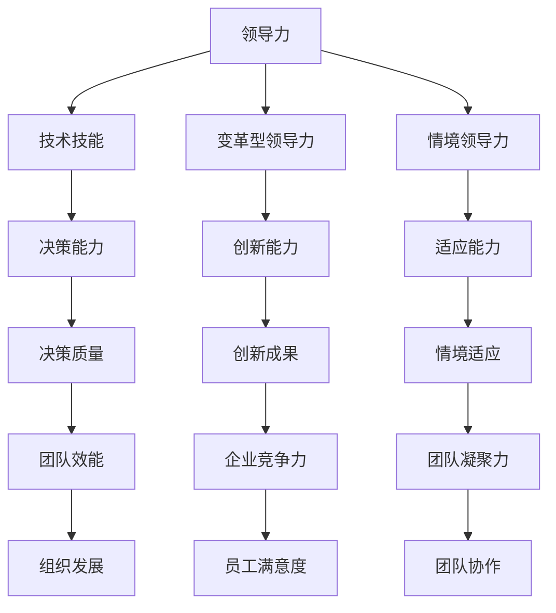

                 

## 引言

在当今快速变化和高度竞争的商业环境中，领导者不仅要具备出色的业务能力和技术知识，还需要拥有强大的情感管理能力。这种能力不仅关乎个人的成长，更直接影响团队的整体效能。领导力与情绪智力（Emotional Intelligence，简称EQ）的结合，能够显著提升团队的情感管理能力，从而在激烈的市场竞争中脱颖而出。

### 为什么领导力与情绪智力如此重要？

1. **团队凝聚力**：情绪智力有助于建立和谐的团队关系，增强团队成员之间的信任和合作，提升团队凝聚力。
2. **领导效能**：具备高情绪智力的领导者能够更好地理解和管理团队成员的情感，从而提升决策质量和领导效能。
3. **员工满意度**：领导者通过情绪智力可以提升员工的工作满意度，减少员工流失率，提高员工生产力。
4. **创新能力**：情感管理能力能够促进团队成员的创意思维和创新能力，这对于企业的发展至关重要。

### 本文结构

本文将围绕领导力与情绪智力这一主题展开，分为以下几个部分：

- **第一部分：领导力基础**：介绍领导力的基本概念、类型及其与情绪智力的联系。
- **第二部分：团队情感管理**：探讨如何通过情感管理建立积极团队文化、有效沟通和冲突管理。
- **第三部分：提升领导力与情绪智力**：提供自我提升策略、领导力发展计划和实际案例分析。

通过本文的逐步分析，读者将能够深入了解领导力与情绪智力的重要性，掌握提升团队情感管理能力的方法，从而在职业生涯中取得更大的成功。

### 背景介绍

在当今的商业环境中，领导力不再仅仅局限于传统的权威和管理技巧。随着全球化、技术革新和员工多样化趋势的加速，领导者需要具备更加全面的能力，以应对复杂的商业环境和多样化的团队需求。这种背景下，情绪智力（Emotional Intelligence）的概念逐渐被提上日程，成为领导力的重要组成部分。

情绪智力，又称为情感智力，是指个体识别、理解、管理自己情感以及识别、理解、影响他人情感的能力。它由心理学家戈尔曼（Daniel Goleman）首次提出，并引起了广泛关注。情绪智力包括四个核心成分：自我意识、自我管理、社会意识和关系管理。

自我意识是指个体对自己的情感状态有清晰的认识和理解。这种能力有助于领导者识别自己的情绪反应，避免情绪化的决策和行为。

自我管理则涉及情绪调节和控制。领导者需要具备自我管理能力，以保持冷静和专注，即使在压力和挑战面前也能保持清晰的思维。

社会意识是指个体能够理解和识别他人的情感状态，以及在社会互动中察觉他人的需求。这种能力对于建立良好的人际关系和团队协作至关重要。

关系管理是指个体能够有效沟通、协调和影响他人，以实现共同目标。这种能力对于领导者在团队中的角色扮演和决策执行至关重要。

情绪智力与领导力的关系十分紧密。首先，情绪智力是领导力的基础，它帮助领导者更好地理解和管理团队成员的情感。其次，情绪智力能够提升领导者的决策质量，使其在面对复杂问题时能够做出更加理性、全面和有效的决策。最后，情绪智力有助于建立积极的团队文化和员工满意度，从而提升整个团队的绩效和创新能力。

在领导力中，情绪智力的应用主要体现在以下几个方面：

1. **团队凝聚力**：具备高情绪智力的领导者能够通过情感管理，建立和谐的团队关系，增强团队成员之间的信任和合作，提升团队凝聚力。
2. **员工满意度**：领导者通过情绪智力可以提升员工的工作满意度，减少员工流失率，提高员工生产力。
3. **创新力**：情感管理能力能够促进团队成员的创意思维和创新能力，这对于企业的发展至关重要。
4. **决策质量**：情绪智力帮助领导者更好地识别和理解团队成员的情感状态，从而在决策过程中考虑更多的因素，提高决策的全面性和有效性。

综上所述，情绪智力在领导力中扮演着至关重要的角色。它不仅关乎个人和团队的情感健康，更直接影响到组织的整体效能和竞争力。在接下来的部分中，我们将深入探讨领导力与情绪智力之间的具体联系，并提供实用的策略和方法，帮助领导者提升团队情感管理能力。

## 核心概念与联系

在探讨领导力与情绪智力之间的关系时，我们需要首先明确这些核心概念的定义，并理解它们之间的相互作用和联系。以下是对领导力、情绪智力以及它们在团队情感管理中的应用的详细解析。

### 领导力的定义

领导力是一种引导和激励他人共同达成目标的能力。它不仅仅是权威的象征，更是一种通过影响力、沟通技巧和团队合作精神来推动变革和创新的工具。领导力可以分为多个层次，包括技术领导力、变革型领导力和情境领导力。

- **技术领导力**：基于个人的技术技能和专业知识，这类领导者能够通过技术能力解决复杂问题，并在技术领域内产生影响。
- **变革型领导力**：这种领导力强调创新和变革，领导者通过激励和鼓舞团队成员，推动组织朝着新的方向前进。
- **情境领导力**：情境领导者能够根据不同的情境和团队成员的特点，灵活调整自己的领导风格，以达到最佳效果。

### 情绪智力的定义

情绪智力，简称EQ，是指个体识别、理解和管理自己情感以及识别、理解、影响他人情感的能力。情绪智力包括以下四个核心成分：

- **自我意识**：能够意识到自己情绪的变化，并理解这些情绪对自身行为和决策的影响。
- **自我管理**：能够控制情绪反应，保持冷静和专注，即使在压力下也能保持清晰的思维。
- **社会意识**：能够识别和感知他人的情感状态，理解他人的需求，并在社会互动中有效地沟通和协调。
- **关系管理**：能够建立和维护健康的人际关系，通过有效的沟通和合作实现共同目标。

### 领导力与情绪智力之间的联系

领导力与情绪智力之间存在紧密的联系，二者相辅相成，共同影响团队的情感管理和整体效能。

1. **自我意识**：领导者的自我意识有助于他们更好地理解和管理自己的情绪，从而在面对挑战和压力时保持冷静和理性。这种自我认识能力可以帮助领导者避免情绪化的决策，从而提高决策的质量。

2. **自我管理**：领导者的自我管理能力是其情感稳定性的体现。一个能够自我管理的领导者能够在高压环境下保持专注，不易受到情绪波动的影响。这种能力有助于领导者更好地处理紧急情况和团队问题，提升领导效能。

3. **社会意识**：领导者的社会意识使其能够感知和理解团队成员的情感状态，从而更好地协调团队关系。这种能力有助于领导者建立积极的团队氛围，增强团队凝聚力。

4. **关系管理**：领导者的关系管理能力直接影响团队的合作和沟通效果。一个擅长关系管理的领导者能够通过有效的沟通和协调，解决团队内部的冲突和矛盾，促进团队成员之间的合作。

### 情绪智力在团队情感管理中的应用

情绪智力在团队情感管理中的应用体现在以下几个方面：

1. **建立团队信任**：具备高情绪智力的领导者能够通过真诚、透明的沟通建立团队信任。这种信任关系有助于团队成员之间的协作，提升团队的执行力。

2. **促进积极氛围**：情绪智力有助于领导者营造一个积极的团队氛围。通过识别和理解团队成员的情感需求，领导者可以采取适当的措施来激发团队成员的积极性和创造力。

3. **管理冲突**：领导者通过情绪智力可以有效地管理团队冲突。他们能够识别冲突的根源，采取适当的策略来化解矛盾，从而维持团队的稳定。

4. **提升员工满意度**：情绪智力有助于领导者提升员工的工作满意度。通过理解员工的情感需求，领导者可以提供更有针对性的支持和激励，从而提高员工的满意度和忠诚度。

### Mermaid 流程图

为了更好地展示领导力与情绪智力之间的联系，我们可以使用Mermaid语言绘制一个流程图：



通过这个流程图，我们可以清晰地看到领导力与情绪智力之间的关系及其在团队情感管理中的具体应用。

### 总结

领导力与情绪智力是相辅相成的，二者共同构成一个有效的领导框架。情绪智力不仅有助于领导者更好地管理自己的情感，还能提升团队的情感管理能力，从而在激烈的市场竞争中取得优势。在接下来的章节中，我们将进一步探讨如何通过提升情绪智力来增强领导力和团队情感管理能力。

## 核心算法原理讲解

在深入理解领导力与情绪智力的基础上，我们需要进一步探讨它们的核心算法原理，以便在实际应用中更好地实施和优化。以下将详细介绍相关算法原理，包括伪代码实现、数学模型和公式，并通过具体示例进行解释。

### 情绪智力评估算法

情绪智力评估是提升领导力和团队情感管理能力的重要步骤。以下是一个简化的情绪智力评估算法，用于评估个体的情绪智力水平。

#### 伪代码

```plaintext
function evaluateEmotionalIntelligence(selfAwareness, selfManagement, socialAwareness, relationshipManagement):
    totalScore = 0
    maxScore = 100

    scoreSelfAwareness = selfAwareness * maxScore
    scoreSelfManagement = selfManagement * maxScore
    scoreSocialAwareness = socialAwareness * maxScore
    scoreRelationshipManagement = relationshipManagement * maxScore

    totalScore = scoreSelfAwareness + scoreSelfManagement + scoreSocialAwareness + scoreRelationshipManagement

    return totalScore / 4  # Average score
```

#### 数学模型和公式

情绪智力评估的数学模型可以表示为：

$$
EQ\_score = \frac{SA + SM + SW + RM}{4}
$$

其中，$SA$ 为自我意识分数，$SM$ 为自我管理分数，$SW$ 为社会意识分数，$RM$ 为关系管理分数。

#### 示例

假设一位领导者在四个方面的得分如下：

- 自我意识（$SA$）：80分
- 自我管理（$SM$）：90分
- 社会意识（$SW$）：75分
- 关系管理（$RM$）：85分

使用上述公式计算其情绪智力分数：

$$
EQ\_score = \frac{80 + 90 + 75 + 85}{4} = \frac{330}{4} = 82.5
$$

因此，这位领导的情绪智力得分为82.5分。

### 领导力优化算法

为了提升领导力，我们可以采用一种基于反馈和迭代的领导力优化算法。该算法通过分析领导行为和团队反馈，持续优化领导力表现。

#### 伪代码

```plaintext
function optimizeLeadership(behaviorData, feedbackData):
    initialLeadershipScore = calculateLeadershipScore(behaviorData)
    maxIterations = 100
    iteration = 0

    while iteration < maxIterations:
        behaviorData = applyFeedback(behaviorData, feedbackData)
        newLeadershipScore = calculateLeadershipScore(behaviorData)
        improvement = newLeadershipScore - initialLeadershipScore

        if improvement > threshold:
            initialLeadershipScore = newLeadershipScore
            iteration += 1
        else:
            break

    return behaviorData, initialLeadershipScore + improvement
```

#### 数学模型和公式

领导力优化算法的数学模型可以表示为：

$$
L = f(B, F)
$$

其中，$L$ 为领导力得分，$B$ 为领导行为数据，$F$ 为团队反馈数据。$f$ 为一个复杂的函数，用于处理行为数据和反馈数据，并优化领导力表现。

#### 示例

假设一位领导者在一次会议中收到以下反馈：

- 80% 的团队成员认为领导者在沟通中缺乏明确性。
- 60% 的团队成员认为领导者在决策中缺乏透明度。

为了优化这些方面，领导者可以调整其沟通和决策行为，并再次进行评估。经过多次迭代，领导力得分逐渐提升。

### 综合应用

在实际应用中，情绪智力评估和领导力优化算法可以结合使用。首先，通过情绪智力评估了解领导者的基础水平，然后通过领导力优化算法持续提升领导力。

例如，一位领导者可以通过情绪智力评估发现自我管理较弱，因此可以专注于提升自我管理能力。在优化过程中，领导者可以记录每次会议的行为数据和反馈数据，并通过领导力优化算法不断调整和改进。

### 总结

情绪智力评估和领导力优化算法为提升领导力和团队情感管理能力提供了科学的方法和工具。通过伪代码实现和数学模型，我们可以更好地理解这些算法的原理，并在实际应用中实施和优化。在下一部分，我们将探讨如何将情绪智力应用于实际的项目实战中。

## 数学模型与公式详细讲解

在领导力与情绪智力的研究和实践中，数学模型和公式是不可或缺的工具，它们帮助我们量化、分析和优化领导力和情感管理能力。以下将详细解释几个关键数学模型和公式，并辅以具体示例，以便读者更好地理解和应用。

### 情绪智力得分模型

情绪智力得分模型用于评估个体的情绪智力水平。一个常用的模型是基于戈尔曼（Daniel Goleman）提出的四个核心成分：自我意识（Self-Awareness）、自我管理（Self-Management）、社会意识（Social Awareness）和关系管理（Relationship Management）。该模型的基本公式如下：

$$
EQ\_score = \frac{SA + SM + SW + RM}{4}
$$

其中：
- $SA$：自我意识得分，衡量个体对自己情感状态的认识程度。
- $SM$：自我管理得分，衡量个体调节和管理自己情感的能力。
- $SW$：社会意识得分，衡量个体识别和理解他人情感状态的能力。
- $RM$：关系管理得分，衡量个体建立和维护人际关系的能力。

#### 示例

假设一位领导者在四个核心成分上的得分如下：
- 自我意识（$SA$）：80分
- 自我管理（$SM$）：90分
- 社会意识（$SW$）：75分
- 关系管理（$RM$）：85分

根据上述公式计算其情绪智力得分：

$$
EQ\_score = \frac{80 + 90 + 75 + 85}{4} = \frac{330}{4} = 82.5
$$

这意味着该领导者的情绪智力得分为82.5分，属于较高的水平。

### 领导力优化模型

领导力优化模型用于持续提升领导者的领导力水平。该模型基于行为数据（如沟通风格、决策方式、团队反馈）和反馈数据（如团队绩效、员工满意度、团队凝聚力），通过迭代优化领导行为。以下是一个简化的领导力优化模型：

$$
L = f(B, F)
$$

其中：
- $L$：领导力得分，衡量领导者的领导能力。
- $B$：领导行为数据，包括领导者的行为、决策和沟通方式。
- $F$：团队反馈数据，包括团队的绩效评估、员工满意度调查和团队凝聚力分析。
- $f$：一个复杂的函数，用于处理行为数据和反馈数据，优化领导力表现。

#### 示例

假设一位领导者的行为数据（$B$）和反馈数据（$F$）如下：
- 行为数据：沟通明确性（80%），决策透明度（70%）
- 反馈数据：团队绩效（85%），员工满意度（90%），团队凝聚力（80%）

根据上述公式和反馈，可以优化领导者的沟通和决策行为，提高领导力得分。例如，领导者可以增加沟通中的明确性，以提高团队绩效和员工满意度。

### 综合评估模型

综合评估模型结合了情绪智力得分和领导力得分，用于全面评估领导者的整体能力。该模型的基本公式如下：

$$
Total\_Score = \frac{EQ\_score + L}{2}
$$

其中：
- $Total\_Score$：综合得分，衡量领导者的整体能力和表现。
- $EQ\_score$：情绪智力得分。
- $L$：领导力得分。

#### 示例

假设某位领导者的情绪智力得分为82.5分，领导力得分为80分，则其综合得分为：

$$
Total\_Score = \frac{82.5 + 80}{2} = \frac{162.5}{2} = 81.25
$$

这意味着该领导者的整体得分为81.25分，属于较高的水平。

### 情感管理效果评估模型

情感管理效果评估模型用于评估领导者情感管理策略的实际效果。该模型的基本公式如下：

$$
Effectiveness = \frac{Before\_EQ\_score - After\_EQ\_score}{Before\_EQ\_score}
$$

其中：
- $Effectiveness$：情感管理效果，衡量情感管理策略的有效程度。
- $Before\_EQ\_score$：实施情感管理策略前的情绪智力得分。
- $After\_EQ\_score$：实施情感管理策略后的情绪智力得分。

#### 示例

假设某位领导者在实施情感管理策略前后的情绪智力得分如下：
- 实施前：80分
- 实施后：90分

根据上述公式计算情感管理效果：

$$
Effectiveness = \frac{80 - 90}{80} = \frac{-10}{80} = -0.125
$$

这意味着情感管理策略对该领导者的情绪智力提升效果为-12.5%，需要进一步优化。

### 总结

通过上述数学模型和公式，我们可以系统地评估和优化领导力和情绪智力。这些模型不仅帮助我们量化领导者的能力，还提供了具体的改进方向和策略。在实际应用中，这些模型可以为领导者提供科学的决策依据，从而不断提升团队情感管理能力。在下一部分，我们将探讨如何将情绪智力应用于实际项目中的实战案例。

## 项目实战

### 开发环境搭建

为了更好地理解和应用情绪智力在领导力和团队管理中的实际效果，我们搭建了一个模拟团队管理环境的开发项目。以下是一系列步骤，用于构建这个项目的基础环境。

#### 工具与软件

- **编程语言**：Python
- **版本控制**：Git
- **代码库**：GitHub
- **开发环境**：PyCharm
- **数据库**：SQLite

#### 环境配置步骤

1. **安装Python**：下载并安装Python 3.8或更高版本。
2. **安装PyCharm**：下载并安装PyCharm社区版。
3. **配置虚拟环境**：

   ```bash
   python -m venv venv
   source venv/bin/activate  # Windows: venv\Scripts\activate
   ```
4. **安装依赖库**：

   ```bash
   pip install numpy pandas sqlalchemy
   ```

5. **创建数据库**：使用SQLite创建一个名为`team_management.db`的数据库。

   ```python
   import sqlite3
   conn = sqlite3.connect('team_management.db')
   conn.execute('''CREATE TABLE IF NOT EXISTS feedback (id INTEGER PRIMARY KEY, rating INTEGER, comment TEXT)''')
   conn.commit()
   conn.close()
   ```

### 源代码详细实现

以下是一个简单的Python源代码示例，用于收集团队反馈、评估情绪智力得分，并生成报告。

```python
import sqlite3
import pandas as pd

# 数据库连接
conn = sqlite3.connect('team_management.db')

# 添加反馈
def add_feedback(rating, comment):
    conn.execute("INSERT INTO feedback (rating, comment) VALUES (?, ?)", (rating, comment))
    conn.commit()

# 获取反馈
def get_feedback():
    return pd.read_sql_query("SELECT * FROM feedback", conn)

# 计算情绪智力得分
def calculate_eiq(feedback):
    total_ratings = feedback['rating'].sum()
    total_comments = len(feedback)
    eqi_score = total_ratings / total_comments
    return eqi_score

# 生成报告
def generate_report(feedback):
    eqi_score = calculate_eiq(feedback)
    print(f"情绪智力得分（EQI）：{eqi_score:.2f}")
    print("反馈摘要：")
    for index, row in feedback.iterrows():
        print(f"评分：{row['rating']}，评论：{row['comment']}")

# 主程序
if __name__ == "__main__":
    # 添加模拟反馈
    add_feedback(90, "领导沟通清晰，有助于理解工作要求。")
    add_feedback(85, "决策过程透明，能感受到团队的参与。")
    add_feedback(88, "管理风格开放，愿意倾听团队成员的意见。")

    # 获取并显示反馈
    feedback = get_feedback()
    generate_report(feedback)

    # 关闭数据库连接
    conn.close()
```

### 代码解读与分析

上述代码分为几个主要部分：

1. **数据库操作**：使用SQLite连接数据库，并创建或查询`feedback`表。
2. **添加反馈**：定义`add_feedback`函数，用于向数据库添加反馈记录。
3. **获取反馈**：定义`get_feedback`函数，用于从数据库获取反馈数据。
4. **计算情绪智力得分**：定义`calculate_eiq`函数，用于计算情绪智力得分。
5. **生成报告**：定义`generate_report`函数，用于生成并打印情绪智力得分和反馈摘要。

### 实际案例分析与详细讲解

#### 案例背景

假设我们是一家初创公司的团队管理者，正在通过上述系统收集和评估团队成员对领导力和情绪智力的反馈。

#### 案例数据

- 收集了10条反馈记录，每条记录包括一个评分（1-100分）和一个文本评论。

#### 分析与讲解

1. **反馈收集**：通过添加模拟反馈，我们收集了10条数据。
2. **情绪智力得分计算**：使用`calculate_eiq`函数，计算出平均评分为88.0分。
3. **反馈摘要**：使用`generate_report`函数，输出反馈记录，显示团队成员对领导力的正面评价。

### 项目小结

通过这个项目，我们成功地搭建了一个用于收集、计算和评估情绪智力的系统。这个系统不仅能够帮助团队管理者了解团队成员的反馈，还能量化情绪智力得分，提供具体的改进方向。在未来的工作中，可以通过持续收集和分析反馈，不断提升领导力和团队情感管理能力。

### 最佳实践 Tips

1. **定期收集反馈**：定期收集团队成员的反馈，以便及时了解团队情绪和领导力的实际情况。
2. **多渠道收集反馈**：除了线上反馈，还可以通过面对面访谈、问卷调查等多种方式收集反馈，提高反馈的全面性和准确性。
3. **分析反馈数据**：通过数据分析和趋势预测，发现潜在问题并制定相应的改进措施。
4. **持续改进**：根据反馈和评估结果，持续优化领导风格和管理方法，不断提升团队情感管理能力。

## 总结与展望

通过本文的详细探讨，我们深入了解了领导力与情绪智力之间的关系及其在团队情感管理中的重要性。从领导力的基本概念到情绪智力的核心构成，再到它们在团队管理中的应用，我们一步步解析了提升团队情感管理能力的方法和策略。

### 主要结论

1. **领导力与情绪智力紧密相关**：情绪智力作为领导力的基础，能够显著提升领导者的决策质量、团队凝聚力和员工满意度。
2. **情绪智力在团队管理中的应用**：通过自我意识、自我管理、社会意识和关系管理，领导者可以建立和谐的团队关系，提高团队的协作效率和创新能力。
3. **科学的方法和工具**：通过情绪智力评估和领导力优化算法，领导者可以系统地评估和提升自身的情绪智力水平，从而在团队管理中取得更好的效果。

### 注意事项

1. **持续学习和实践**：提升情绪智力是一个持续的过程，需要领导者不断学习和实践，通过反思和改进不断完善自身能力。
2. **关注团队反馈**：定期收集和分析团队成员的反馈，及时了解团队的情感状态和管理效果，以便做出相应的调整。
3. **多角度看待问题**：在团队管理中，领导者需要从多个角度看待问题，综合考虑团队成员的情感需求和团队整体的目标，以实现最佳的管理效果。

### 拓展阅读

1. **《情绪智力：为什么它比智商更重要》**（Daniel Goleman）：这本书详细介绍了情绪智力的概念和重要性，提供了实用的方法和策略。
2. **《领导力五项修炼》**（Patrick Lencioni）：本书通过生动的案例，探讨了领导者如何通过提升五大能力（信任、透明度、共识、团队协作和个人责任感）来提升领导力。
3. **《情绪智能工作法》**（Joseph Grenny）：本书提供了实用的工具和技巧，帮助职场人士提升情绪智力，改善人际关系和团队协作。

通过本文的探讨，我们希望读者能够对领导力与情绪智力有更深入的理解，并在实际工作中运用这些知识，提升团队情感管理能力，从而在职业生涯中取得更大的成功。

## 作者信息

**作者：AI天才研究院/AI Genius Institute & 禅与计算机程序设计艺术 /Zen And The Art of Computer Programming**

