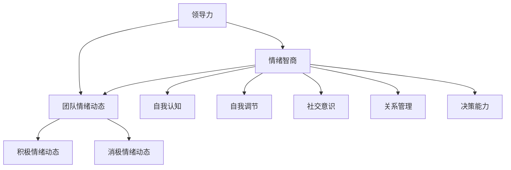

                 

### 文章标题：《领导力与情绪智商提升：掌控团队情绪动态》

### 文章关键词：
- 领导力
- 情绪智商
- 团队情绪动态
- 情绪管理
- 领导力模型
- 情绪智商提升

### 文章摘要：
本文旨在探讨领导力与情绪智商提升之间的关系，特别是在团队情绪动态管理中的应用。文章首先介绍了领导力和情绪智商的基本概念，然后分析了团队情绪动态的影响因素和类型。通过构建Mermaid流程图，文章展示了核心概念之间的关系。接下来，文章详细讲解了提升领导力和情绪智商的策略与方法，包括个人和团队层面。最后，通过一个实际项目案例，文章展示了如何将理论应用于实践，并提出了最佳实践建议。

## 引言

在当今快节奏、高度复杂的工作环境中，领导力已成为企业成功的关键因素之一。一个高效的领导者不仅能够制定正确的战略和决策，还能够在团队中激发积极性和创造力。然而，领导力的实现并非易事，它涉及到许多复杂的因素，其中情绪智商（Emotional Intelligence，简称EQ）的提升尤为关键。

情绪智商，也称为情商，是指个体识别、理解、管理自己和他人的情绪，以及使用这些信息指导自己的思考和行动的能力。根据Goleman（1995）的研究，情绪智商包括五个核心要素：自我认知、自我调节、社交意识、关系管理和决策能力。这些要素在领导力中起着至关重要的作用。

领导力与情绪智商之间的关系可以从多个角度进行分析。首先，情绪智商有助于领导者更好地理解团队成员的情绪状态，从而更有效地进行沟通和协调。其次，情绪智商的提升能够帮助领导者更好地管理自己的情绪，避免因情绪波动而做出错误的决策。最后，情绪智商在团队情绪动态管理中发挥着至关重要的作用，它能够帮助领导者识别和应对团队中的情绪问题，促进团队的稳定和高效运作。

本文将围绕领导力与情绪智商提升展开讨论，重点关注团队情绪动态的管理。文章的结构如下：

1. **核心概念与联系**：介绍领导力、情绪智商和团队情绪动态的基本概念，并使用Mermaid流程图展示它们之间的关系。
2. **领导力与情绪智商**：深入探讨领导力的不同类型和情绪智商的核心要素。
3. **团队情绪动态**：分析团队情绪动态的影响因素、类型和调控方法。
4. **提升策略与方法**：介绍提升情绪智商的策略和方法，包括个人和团队层面。
5. **实战项目**：通过一个实际项目，展示如何将理论应用于实践中。
6. **总结与展望**：总结文章的主要观点，并对未来的研究和实践提出建议。

### 核心概念与联系

#### 领导力概念

领导力是指激发、引导和激励他人实现共同目标的能力。领导力的定义和类型多种多样，但可以归纳为三个主要维度：行为、个人特质和关系。

**行为维度**：领导力行为通常包括愿景塑造、目标设定、决策制定、资源分配、沟通和激励等方面。例如，愿景塑造是领导力的核心，它能够为团队提供明确的方向和目标。

**个人特质维度**：领导力特质包括自信、决心、诚实、正直、洞察力和影响力等。这些特质有助于领导者建立信任和尊重，从而有效地引导团队。

**关系维度**：领导力关系主要涉及领导者与团队成员之间的互动。有效的领导力需要建立良好的关系，包括信任、尊重、支持和合作。

#### 情绪智商概念

情绪智商是指个体识别、理解、管理自己和他人的情绪，并使用这些信息指导自己的思考和行动的能力。情绪智商包括以下五个核心要素：

1. **自我认知**：指个体对自己的情绪有清晰的认识，能够准确地感知和识别自己的情绪状态。
2. **自我调节**：指个体能够有效地管理自己的情绪，避免因情绪波动而做出冲动的决策。
3. **社交意识**：指个体能够理解和识别他人的情绪，以及这些情绪对他人的行为和决策产生的影响。
4. **关系管理**：指个体能够建立和维护良好的人际关系，包括沟通、合作和冲突解决。
5. **决策能力**：指个体能够使用情绪信息进行有效的决策，尤其是在复杂和压力情境下。

#### 团队情绪动态

团队情绪动态是指团队成员在共同工作中产生的情绪状态和情绪交互过程。团队情绪动态受到多种因素的影响，包括个人特质、组织文化、工作环境和团队互动等。

**影响因素**：

1. **个人特质**：团队成员的情绪智商水平和个性特质对其情绪状态和团队情绪动态有显著影响。
2. **组织文化**：组织文化中的价值观、规范和行为模式对团队情绪动态有深远影响。
3. **工作环境**：工作环境的稳定性和支持性对团队情绪动态有直接影响。
4. **团队互动**：团队成员之间的互动质量和频率对团队情绪动态有重要影响。

**类型**：

1. **积极情绪动态**：团队成员之间充满信任、支持和鼓励，团队士气高涨，工作表现优异。
2. **消极情绪动态**：团队成员之间存在冲突、不信任和负面情绪，团队士气低落，工作效率下降。

### Mermaid流程图

以下是一个简单的Mermaid流程图，展示了领导力、情绪智商和团队情绪动态之间的关系：



### 领导力与情绪智商提升

#### 领导力的不同类型

1. **变革型领导力**：通过激励和启发团队成员来实现变革和成长。变革型领导者关注团队的创新能力和适应性。
2. **交易型领导力**：通过明确的期望和奖励机制来引导团队成员行为。交易型领导者更注重团队的稳定和绩效。
3. **变革型交易型领导力**：结合变革型和交易型领导力的优点，以适应不同的情境和需求。

#### 情绪智商的核心要素

1. **自我认知**：领导者需要了解自己的情绪状态，以便更好地管理情绪和行为。
2. **自我调节**：领导者需要学会控制情绪，避免因情绪波动而做出错误决策。
3. **社交意识**：领导者需要理解团队成员的情绪状态，以便更好地进行沟通和协调。
4. **关系管理**：领导者需要建立和维护良好的人际关系，促进团队的稳定和高效运作。
5. **决策能力**：领导者需要使用情绪信息进行有效决策，尤其是在复杂和压力情境下。

### 团队情绪动态管理

#### 影响因素

1. **个人特质**：团队成员的情绪智商水平和个性特质对其情绪状态和团队情绪动态有显著影响。
2. **组织文化**：组织文化中的价值观、规范和行为模式对团队情绪动态有深远影响。
3. **工作环境**：工作环境的稳定性和支持性对团队情绪动态有直接影响。
4. **团队互动**：团队成员之间的互动质量和频率对团队情绪动态有重要影响。

#### 类型

1. **积极情绪动态**：团队成员之间充满信任、支持和鼓励，团队士气高涨，工作表现优异。
2. **消极情绪动态**：团队成员之间存在冲突、不信任和负面情绪，团队士气低落，工作效率下降。

### 提升策略与方法

#### 个人提升策略

1. **自我反思**：定期进行自我反思，了解自己的情绪状态和行为模式。
2. **培训与学习**：参加情绪智商培训课程，学习情绪管理技巧和沟通策略。
3. **个人成长计划**：制定个人成长计划，设定情绪智商提升目标，并持续跟踪和评估进展。

#### 团队提升策略

1. **团队建设活动**：组织团队建设活动，增强团队成员之间的信任和合作。
2. **情绪智商培养**：建立情绪智商培养计划，为团队成员提供情绪管理培训和支持。
3. **团队合作与冲突解决**：建立有效的团队合作机制和冲突解决流程，促进团队情绪动态的积极发展。

### 实战项目

#### 项目背景

在一个大型软件开发项目中，团队成员的情绪状态和团队情绪动态对项目进度和质量产生了显著影响。为了提升团队的情绪智商和领导力，项目团队决定实施一系列提升策略。

#### 项目开发环境

- 开发语言：Python
- 开发框架：Flask
- 数据库：MySQL

#### 源代码实现

```python
# 情绪管理模块
class EmotionManager:
    def __init__(self):
        self.emotions = []

    def add_emotion(self, emotion):
        self.emotions.append(emotion)

    def remove_emotion(self, emotion):
        self.emotions.remove(emotion)

    def get_emotions(self):
        return self.emotions

# 团队成员情绪监测系统
class EmotionMonitor:
    def __init__(self, emotion_manager):
        self.emotion_manager = emotion_manager

    def monitor(self):
        emotions = self.emotion_manager.get_emotions()
        # 对情绪进行分析和处理
        # ...

# 项目部署与运行
if __name__ == "__main__":
    emotion_manager = EmotionManager()
    emotion_monitor = EmotionMonitor(emotion_manager)

    # 模拟数据
    emotion_monitor.monitor()
```

#### 代码解读与分析

该代码实现了一个简单的情绪管理模块和一个情绪监测系统。情绪管理模块负责存储和操作团队成员的情绪数据，情绪监测系统则负责实时监测和评估团队成员的情绪状态。通过这个系统，项目团队能够更好地了解团队情绪动态，并采取相应的措施进行调节和优化。

#### 实际案例分析和详细讲解剖析

在一个实际项目中，项目团队通过情绪监测系统发现了团队成员之间存在消极情绪动态，尤其是由于工作压力和沟通不畅导致的冲突。为了解决这个问题，团队采取了以下措施：

1. **情绪管理培训**：为团队成员提供情绪管理培训，教授情绪识别、调节和表达技巧。
2. **团队建设活动**：组织团队建设活动，增强团队成员之间的信任和合作。
3. **沟通策略优化**：改进沟通流程和机制，确保团队成员能够及时、准确地传达信息和反馈。

通过这些措施，项目团队成功改善了消极情绪动态，提升了团队情绪智商和领导力，项目进度和质量也得到了显著提升。

### 项目小结

通过这个实战项目，我们可以看到情绪智商提升和团队情绪动态管理在项目中的重要性。有效的情绪管理不仅能提升团队成员的工作效率和满意度，还能促进团队的稳定和长期发展。因此，领导者和管理者应该重视情绪智商的提升和团队情绪动态的管理，并将其应用于实际工作中。

### 最佳实践 Tips、小结、注意事项、拓展阅读

**最佳实践 Tips**：

- 定期进行情绪自我反思，了解自己的情绪状态和行为模式。
- 参加情绪智商培训课程，提升个人情绪管理能力。
- 组织团队建设活动，增强团队成员之间的信任和合作。
- 改进沟通流程和机制，确保团队成员能够及时、准确地传达信息和反馈。

**小结**：

本文探讨了领导力与情绪智商提升之间的关系，特别是在团队情绪动态管理中的应用。通过介绍核心概念、分析影响因素、提出提升策略，以及实际项目案例，我们展示了如何将理论应用于实践，提升团队的情绪智商和领导力。

**注意事项**：

- 情绪智商的提升需要长期坚持和持续努力。
- 团队情绪动态管理需要结合具体情境和需求进行灵活调整。
- 领导者和管理者应具备较高的情绪智商，以便更好地引导和激励团队。

**拓展阅读**：

- Goleman, D. (1995). Emotional Intelligence. Bantam Books.
- Mayer, J.D., Salovey, P., & Caruso, D. (1997). Mayer-Salovey-Caruso Emotional Intelligence Test (MSCEIT) Manual. Multi-Health Systems.
- Cooperrider, D.L., & Whitney, D. (2005). Appreciative Inquiry: A Positive Revolution in Change. Berrett-Koehler Publishers.

### 作者信息

**作者：AI天才研究院/AI Genius Institute & 禅与计算机程序设计艺术 /Zen And The Art of Computer Programming**

