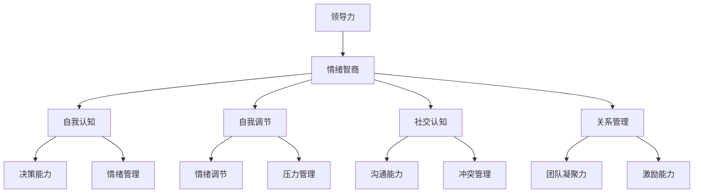

                 

# 领导力与情绪智商：掌控自我的艺术

> 关键词：领导力、情绪智商、自我掌控、团队管理、领导效能

> 摘要：本文深入探讨了领导力与情绪智商的关系，阐述了情绪智商在领导力中的应用，并通过具体案例和算法原理讲解，提供了提升情绪智商和领导效能的方法和策略。文章旨在帮助领导者更好地理解和应用情绪智商，从而在团队管理和领导实践中取得更好的成效。

## 目录大纲构思

为了设计《领导力与情绪智商：掌控自我的艺术》这本书的目录大纲，我们需要遵循以下步骤：

### 第一步：确定核心概念

- **领导力定义**：介绍领导力的基本概念和不同定义。
- **情绪智商**：介绍情绪智商的定义、组成部分及其在领导力中的作用。

### 第二步：构建核心架构

- **情绪智商在领导力中的应用**：讨论情绪智商如何帮助领导者更好地管理和激励团队。
- **情绪管理**：详细阐述情绪管理的重要性、方法和技巧。
- **自我掌控**：介绍自我掌控的概念、原理和实践方法。

### 第三步：设计具体章节

- **第一章：领导力概述**：介绍领导力的核心概念、类型和特点。
- **第二章：情绪智商解析**：详细讨论情绪智商的组成部分、测量方法和培养策略。
- **第三章：情绪管理策略**：探讨情绪管理的重要性、常见问题和有效策略。
- **第四章：自我掌控艺术**：介绍自我掌控的基本原则和实践方法。
- **第五章：情绪智商在领导实践中的应用**：通过案例研究，展示情绪智商在领导力中的具体应用。
- **第六章：领导力与情绪智商的结合**：探讨如何将情绪智商与领导力有效结合，提高领导效能。
- **第七章：提升情绪智商的路径**：提供具体的方法和工具，帮助读者提升自己的情绪智商。

### 第四步：添加附录

- **附录**：包含情绪智商相关的工具、量表和参考资料。

### 第五步：设计图示和代码案例

- **Mermaid流程图**：设计情绪智商在领导力中的流程图。
- **伪代码**：提供情绪管理策略和自我掌控方法的伪代码。
- **数学公式**：嵌入数学模型和公式的详细讲解。
- **项目实战**：提供实际项目案例和代码实现，以及详细的解释和分析。

## 样本目录大纲

下面是根据上述构思设计的《领导力与情绪智商：掌控自我的艺术》的目录大纲：

```
# 《领导力与情绪智商：掌控自我的艺术》目录大纲

## 第一部分：领导力基础

### 第1章：领导力概述
#### 1.1 领导力的定义与类型
#### 1.2 领导力的核心要素

### 第2章：情绪智商解析
#### 2.1 情绪智商的定义与组成部分
#### 2.2 情绪智商的测量与培养

## 第二部分：情绪管理策略

### 第3章：情绪管理的重要性
#### 3.1 情绪对领导力的影响
#### 3.2 情绪管理的误区与挑战

### 第4章：情绪管理策略
#### 4.1 情绪认知策略
#### 4.2 情绪调节技巧

## 第三部分：自我掌控艺术

### 第5章：自我掌控的概念与原理
#### 5.1 自我掌控的重要性
#### 5.2 自我掌控的基本原则

### 第6章：自我掌控实践方法
#### 6.1 自我意识与自我反思
#### 6.2 自我激励与自我调整

## 第四部分：情绪智商在领导实践中的应用

### 第7章：情绪智商在领导实践中的应用
#### 7.1 情绪智商在团队管理中的应用
#### 7.2 情绪智商在决策制定中的应用

## 第五部分：领导力与情绪智商的结合

### 第8章：领导力与情绪智商的结合
#### 8.1 结合策略
#### 8.2 结合实践

## 第六部分：提升情绪智商的路径

### 第9章：提升情绪智商的路径
#### 9.1 情绪智商提升的方法
#### 9.2 情绪智商提升的工具

## 附录

### 附录A：情绪智商相关工具与量表
### 附录B：情绪智商参考资料

## 附录C：情绪智商与领导力流程图
```

以上大纲涵盖了核心概念、核心架构、具体策略和实践方法，同时还包括附录和图示，确保内容的完整性。接下来，我将根据大纲设计具体章节的内容。

## 第一章：领导力概述

### 1.1 领导力的定义与类型

领导力是一个广泛研究的概念，不同的学者给出了不同的定义。经典定义认为，领导力是指影响和激励他人实现共同目标的能力（Northouse, 2018）。然而，这个定义过于宽泛，无法涵盖领导力的多样性和复杂性。因此，现代领导力理论从多个维度对领导力进行定义和分类。

首先，领导力可以从类型上进行分类。常见的领导力类型包括：

- **交易型领导力**：这种类型的领导力依赖于明确的规则、结构和奖励机制，以激励和引导团队成员的行为（Barnett, 2007）。
- **变革型领导力**：变革型领导力强调领导者的愿景、价值观和激励能力，以引导团队成员实现变革（Bass & Avolio, 1994）。
- **服务型领导力**：服务型领导力强调领导者为团队成员提供支持和资源，以满足他们的需求和期望（Schein, 2004）。

其次，领导力可以从角色上进行分类。领导者的角色可以分为：

- **领导者角色**：领导者需要制定战略、规划和决策，确保团队朝着目标前进。
- **导师角色**：领导者需要指导和培养团队成员，提高他们的技能和知识。
- **协调者角色**：领导者需要协调团队成员之间的关系，确保团队的协作和合作。

最后，领导力还可以从风格上进行分类。常见的领导力风格包括：

- **民主型领导力**：领导者鼓励团队成员参与决策，尊重他们的意见和需求。
- **专制型领导力**：领导者独断专行，决策过程中不征求团队成员的意见。
- **参与型领导力**：领导者积极倾听团队成员的意见，共同制定决策。

### 1.2 领导力的核心要素

领导力的核心要素可以归纳为以下几个方面：

- **愿景**：领导者需要有一个明确的愿景，能够激励团队成员为实现这个目标而努力。
- **价值观**：领导者的价值观是他们行动的指南，需要传递给团队成员，形成共同的价值观体系。
- **沟通**：有效的沟通是领导力的关键，领导者需要能够清晰、准确地传达信息，并理解团队成员的需求和反馈。
- **激励**：领导者需要具备激励能力，能够激发团队成员的潜力，鼓励他们为实现目标而努力。
- **决策**：领导者需要做出明智的决策，能够在复杂和不确定的情况下做出正确的选择。

### 1.3 领导力的重要性

领导力在组织和管理中扮演着重要的角色。首先，领导力能够影响团队的行为和表现。有效的领导者能够激发团队成员的积极性和创造力，提高团队的绩效和成果。其次，领导力能够塑造组织的文化和价值观。领导者通过自身的言行，传递组织的核心价值观，形成积极向上的组织文化。最后，领导力对个人和团队的发展具有深远的影响。领导者不仅需要关注团队的整体发展，还需要关注团队成员的个人成长和发展，为他们提供支持和指导。

### 1.4 情绪智商与领导力

情绪智商（Emotional Intelligence, EI）是指个体识别、理解、管理和运用情绪的能力（Goleman, 1995）。情绪智商在领导力中起着至关重要的作用。首先，情绪智商有助于领导者更好地理解和应对团队成员的情绪。领导者需要具备敏锐的感知能力，能够识别团队成员的情绪变化，并提供必要的支持和帮助。其次，情绪智商有助于领导者更好地管理自己的情绪。领导者需要具备良好的情绪调节能力，能够控制自己的情绪，避免情绪的波动对决策和团队管理产生负面影响。最后，情绪智商有助于领导者建立积极的人际关系。领导者需要具备良好的社交技巧，能够与他人建立信任和合作关系，促进团队的协作和合作。

### 1.5 小结

本章介绍了领导力的定义、类型和核心要素，探讨了情绪智商与领导力的关系。领导力是一个复杂而多样化的概念，不同类型的领导力适用于不同的情境和需求。情绪智商在领导力中起着重要的作用，有助于领导者更好地理解和应对团队成员的情绪，管理自己的情绪，建立积极的人际关系。接下来，我们将进一步探讨情绪智商的组成部分和测量方法，以帮助读者更好地理解和管理情绪智商。

## 第二章：情绪智商解析

### 2.1 情绪智商的定义与组成部分

情绪智商（Emotional Intelligence，简称EI或EQ）是指个体识别、理解、管理以及运用情绪的能力，这一概念由心理学家约翰·梅耶（John D. Mayer）、彼得·萨洛维（Peter Salovey）和戴维·卡尔霍恩（Daryn C. Quick）在1990年代初提出（Mayer, Salovey, & Caruso, 2004）。情绪智商涵盖了四个主要组成部分，分别是自我认知、自我调节、社交认知和关系管理。

1. **自我认知**：自我认知是指个体识别和理解自己情绪的能力。它包括识别自己情绪的种类、原因以及这些情绪对自己行为的影响。自我认知是情绪智商的基础，它帮助个体更好地了解自己的情绪状态，从而更好地进行情绪管理和决策。

2. **自我调节**：自我调节是指个体管理自己情绪的能力，包括控制情绪波动、调节情绪反应和寻找情绪的平衡。自我调节能力强的人能够更好地处理压力和挑战，保持冷静和理性的态度，从而做出更明智的决策。

3. **社交认知**：社交认知是指个体识别、理解和管理他人情绪的能力。它包括阅读他人的情绪、理解他人的需求和期望、以及在社交互动中正确地表达自己的情绪。社交认知有助于建立和维护良好的人际关系，提高沟通和合作的效果。

4. **关系管理**：关系管理是指个体运用情绪能力来建立和维护人际关系的能力。它包括处理冲突、建立信任、激励他人和维持团队士气。关系管理能力强的领导者能够更好地激励和引导团队成员，提高团队的凝聚力和绩效。

### 2.2 情绪智商的测量与培养

情绪智商的测量是通过情绪智商量表（Emotional Intelligence Scale，简称EIS）进行的。常见的情绪智商量表包括梅耶-萨洛维-卡尔霍恩情绪智商测验（MSCEIT）和戈尔曼情绪智商问卷（Goleman EI Inventory）。这些量表通常包含多个题目，评估个体在自我认知、自我调节、社交认知和关系管理四个方面的表现。

#### 自我认知测量

自我认知的测量通常涉及以下几个方面：

- 情绪识别：评估个体识别自己情绪的能力。
- 情绪理解：评估个体理解情绪原因和情绪对自己行为影响的能力。
- 情绪描述：评估个体描述自己情绪的能力。

#### 自我调节测量

自我调节的测量包括以下几个方面：

- 情绪控制：评估个体控制情绪反应的能力。
- 情绪稳定：评估个体在面对压力和挑战时保持情绪稳定的能力。
- 决策与情绪：评估个体在决策过程中考虑情绪因素的能力。

#### 社交认知测量

社交认知的测量涉及以下几个方面：

- 情绪理解：评估个体理解他人情绪的能力。
- 社交洞察：评估个体理解他人需求和期望的能力。
- 非言语沟通：评估个体理解非言语沟通信号的能力。

#### 关系管理测量

关系管理的测量包括以下几个方面：

- 冲突管理：评估个体处理冲突的能力。
- 信任建立：评估个体建立和维护信任的能力。
- 团队领导：评估个体激励和引导团队成员的能力。

### 2.3 情绪智商的培养策略

情绪智商并非天生具备，而是可以通过后天的学习和实践逐步培养和提高。以下是一些有效的培养策略：

1. **自我反思**：通过定期自我反思，个体可以更好地了解自己的情绪状态，识别情绪触发点，并学会如何管理自己的情绪。

2. **情绪认知训练**：通过认知行为疗法（CBT）等心理训练方法，个体可以学会识别和理解情绪，提高自我认知能力。

3. **情绪调节技巧**：学习情绪调节技巧，如深呼吸、冥想和放松练习，可以帮助个体在压力和挑战面前保持冷静和理智。

4. **社交技能培养**：通过参加社交技能培训课程、参与团队活动和角色扮演练习，个体可以提高社交认知和关系管理能力。

5. **阅读和自学**：通过阅读相关书籍、论文和研究报告，个体可以了解情绪智商的最新研究成果和应用实践。

### 2.4 小结

本章详细介绍了情绪智商的定义、组成部分及其测量方法，探讨了情绪智商的培养策略。情绪智商是领导者成功的关键因素之一，它帮助领导者更好地理解和应对团队成员的情绪，管理自己的情绪，建立和维护良好的人际关系。通过本章的内容，读者可以了解情绪智商的重要性和培养方法，从而在领导实践中更好地应用情绪智商。

## 第三章：情绪管理策略

### 3.1 情绪管理的重要性

情绪管理是情绪智商的核心组成部分之一，它直接影响领导者的决策能力、团队凝聚力和个人健康。有效情绪管理不仅能提升领导者的个人素质，还能改善团队氛围和工作效率。

首先，情绪管理对领导者的决策能力至关重要。情绪管理良好的领导者能够保持冷静和理智，即使在压力和挑战面前也能做出明智的决策。相反，情绪管理欠佳的领导者可能会因情绪波动而做出冲动或错误的决定，从而影响团队的运作和成果。

其次，情绪管理对团队凝聚力有显著影响。领导者通过有效管理自己的情绪，能够营造一个积极、健康的工作氛围，减少冲突和误解。团队成员在这样一个环境中更愿意协作和支持彼此，从而提高团队的凝聚力和工作效率。

最后，情绪管理对个人健康也有着重要影响。长期处于情绪紧张或压抑状态的人容易产生身体疾病和心理问题。通过情绪管理，领导者可以降低压力水平，提高生活质量和工作满意度。

### 3.2 情绪管理的误区与挑战

尽管情绪管理的重要性显而易见，但在实际操作中，领导者往往面临一些误区和挑战。

首先，许多领导者认为情绪管理意味着压抑或隐藏自己的情绪。这种误区可能导致情绪的积累和爆发，反而损害了个人和团队的健康。事实上，情绪管理强调的是识别、理解和表达情绪，而不是压抑或忽视它们。

其次，领导者可能缺乏有效的情绪管理策略。在快节奏和高压力的工作环境中，领导者往往忽视了情绪管理的重要性，导致情绪问题积压。此外，领导者的情绪管理能力往往与其个人背景、经验和心理素质密切相关，一些领导者可能由于缺乏相关技能和知识而感到无助。

最后，团队文化和组织氛围也会对情绪管理产生影响。在一个鼓励表达情绪和相互支持的环境中，领导者更容易进行有效的情绪管理。然而，在一个压抑和竞争激烈的环境中，领导者可能会感到更大的情绪压力和挑战。

### 3.3 情绪管理策略

为了克服上述误区和挑战，领导者可以采用以下几种情绪管理策略：

1. **自我认知**：自我认知是情绪管理的基础。领导者需要定期进行自我反思，了解自己的情绪状态、触发点和情绪反应模式。通过这种深入的自我认知，领导者可以更好地识别和理解自己的情绪，从而采取相应的管理措施。

2. **情绪调节技巧**：领导者可以学习并实践各种情绪调节技巧，如深呼吸、冥想、渐进性肌肉放松等。这些技巧有助于在紧张和压力情况下保持冷静，降低情绪波动。此外，领导者还可以通过运动、艺术创作和社交活动等方式来缓解情绪压力。

3. **积极沟通**：有效的沟通是情绪管理的重要组成部分。领导者需要学会倾听他人的意见和感受，并表达自己的需求和期望。积极沟通可以减少误解和冲突，增强团队成员之间的信任和合作。

4. **建立支持网络**：领导者可以建立一个支持网络，包括信任的同事、朋友和导师。这个网络可以在领导者遇到情绪问题或挑战时提供帮助和支持。此外，领导者还可以参加心理辅导或领导力培训课程，提高情绪管理能力。

5. **设定健康界限**：领导者需要为自己设定健康的界限，避免过度工作或承担过多的责任。通过合理分配时间和资源，领导者可以减少工作压力，保持良好的情绪状态。

### 3.4 情绪管理策略案例分析

以下是一个情绪管理策略的案例分析：

**案例背景**：某公司的项目经理小李在项目接近尾声时面临巨大的压力。项目时间紧迫，质量要求高，团队成员之间也出现了沟通不畅和意见分歧。

**情绪管理策略**：

1. **自我认知**：小李意识到自己的情绪开始变得焦虑和烦躁。他开始记录自己的情绪状态，分析情绪的触发点和原因。

2. **情绪调节技巧**：小李每天晚上进行30分钟的冥想练习，帮助自己放松身心。他还定期进行深呼吸练习，以缓解紧张情绪。

3. **积极沟通**：小李主动与团队成员沟通，倾听他们的意见和反馈。他通过召开团队会议，解决了团队成员之间的分歧，明确了项目的下一步行动计划。

4. **建立支持网络**：小李与公司的高级经理建立了良好的沟通关系。在遇到问题时，他能够及时寻求帮助和建议，减轻了工作压力。

5. **设定健康界限**：小李开始遵循“工作-生活平衡”的原则，合理安排工作和休息时间。他拒绝了额外的加班要求，确保自己有足够的休息和放松时间。

**案例结果**：通过这些情绪管理策略，小李成功缓解了压力，提高了工作效率和团队凝聚力。项目最终按时完成，并达到了预期质量标准。团队成员也对小李的情绪管理策略给予了高度评价。

### 3.5 小结

本章讨论了情绪管理的重要性、误区与挑战，并提出了具体的情绪管理策略。情绪管理是领导者必备的能力，它有助于提升决策能力、团队凝聚力和个人健康。通过自我认知、情绪调节技巧、积极沟通、建立支持网络和设定健康界限，领导者可以有效管理自己的情绪，实现更好的领导效能。接下来，我们将进一步探讨自我掌控艺术，帮助领导者更好地实现情绪管理。

## 第四章：自我掌控艺术

### 4.1 自我掌控的重要性

自我掌控（Self-Mastery）是情绪智商中至关重要的一部分，它关乎领导者如何在复杂多变的环境中保持冷静、理智和专注。自我掌控不仅影响领导者的个人发展，还直接关系到团队和组织的高效运作。

首先，自我掌控有助于领导者保持情绪稳定。在领导过程中，领导者不可避免地会遇到各种压力和挑战，如项目延误、团队冲突、资源紧张等。如果领导者缺乏自我掌控能力，情绪容易波动，可能会导致决策失误、团队士气低落，甚至影响整个组织的运营。通过自我掌控，领导者能够更好地管理自己的情绪，保持冷静和理智，从而做出更明智的决策。

其次，自我掌控有助于提升领导者的专注力。在现代工作环境中，领导者往往需要同时处理多个任务和项目，如何保持专注成为一大挑战。自我掌控能力强的领导者能够有效分配注意力，专注于当前最重要的任务，避免分心和拖延，提高工作效率和成果。

此外，自我掌控有助于建立领导者的权威和信任。当领导者能够自我掌控，展现出卓越的决策能力和情绪管理能力时，团队成员更愿意追随和信任他们。这种信任不仅有助于团队凝聚力的提升，还能激发团队成员的积极性和创造力。

### 4.2 自我掌控的基本原则

为了实现自我掌控，领导者需要遵循以下基本原则：

1. **自我意识**：自我意识是自我掌控的基础。领导者需要深入了解自己的情绪、需求和动机，认识到自己的优势和不足。通过自我意识，领导者可以更好地识别情绪触发点，从而采取有效的情绪管理策略。

2. **自我反思**：自我反思是自我掌控的关键。领导者需要定期进行自我反思，评估自己的行为和决策，从中吸取教训，不断改进。自我反思有助于领导者提高自我认知，增强自我掌控能力。

3. **目标设定**：领导者需要设定明确的目标和计划，以确保自己的行为和决策始终与目标保持一致。通过目标设定，领导者可以更好地集中精力，避免分心和拖延，实现自我掌控。

4. **自我调节**：自我调节是自我掌控的核心。领导者需要学会控制自己的情绪和行为，避免因情绪波动而做出错误的决策。自我调节技巧包括深呼吸、冥想、放松练习等，这些技巧有助于领导者保持冷静和理智。

5. **时间管理**：领导者需要有效管理自己的时间，确保工作与生活的平衡。通过合理安排时间和优先级，领导者可以避免过度工作，减少压力，保持良好的情绪状态。

### 4.3 自我掌控实践方法

为了实现自我掌控，领导者可以采用以下实践方法：

1. **每日反思**：每天结束时，领导者可以花几分钟时间反思当天的工作和行为。通过记录反思日志，领导者可以识别情绪触发点，了解自己的行为模式，并制定改进计划。

2. **冥想练习**：冥想是提高自我意识和自我调节能力的一种有效方法。领导者可以每天花10-15分钟进行冥想，专注于呼吸，放松身心，提高专注力和情绪管理能力。

3. **定期放松**：领导者需要为自己设定定期的放松时间，如阅读、运动、旅行等。通过这些活动，领导者可以缓解压力，保持良好的情绪状态。

4. **培养兴趣爱好**：领导者可以培养一些兴趣爱好，如绘画、音乐、园艺等。这些爱好可以帮助领导者放松身心，提高生活质量。

5. **寻求反馈**：领导者可以定期寻求团队成员和同事的反馈，了解自己在工作中的表现和改进方向。通过反馈，领导者可以更好地认识自己，提高自我掌控能力。

### 4.4 案例分析

以下是一个自我掌控实践方法的案例分析：

**案例背景**：某公司的销售总监张先生在工作中经常感到压力巨大，情绪波动明显，影响了团队的工作氛围和业绩。

**自我掌控实践**：

1. **每日反思**：张先生每天晚上都会花10分钟时间反思当天的工作，记录自己的情绪变化和决策过程，分析成功和不足之处。

2. **冥想练习**：张先生开始每天早晨进行10分钟的冥想练习，专注于呼吸，放松身心，提高专注力。

3. **定期放松**：张先生每周会安排一次完整的放松时间，如去健身房锻炼、参加瑜伽课程，或与家人朋友外出旅游。

4. **培养兴趣爱好**：张先生开始培养绘画的兴趣，每周花几个小时进行绘画，这不仅帮助他放松，还提升了他的创造力和情绪调节能力。

5. **寻求反馈**：张先生定期与团队成员和上级领导交流，听取他们的意见和建议，不断改进自己的工作方法和情绪管理技巧。

**案例结果**：通过这些自我掌控实践方法，张先生成功地缓解了工作压力，情绪变得更加稳定，工作效率和团队士气显著提高。他的销售团队在短时间内实现了业绩的显著增长。

### 4.5 小结

本章探讨了自我掌控的重要性、基本原则和实践方法。自我掌控是领导者必备的能力，它有助于保持情绪稳定、提升专注力和建立权威。通过自我意识、自我反思、目标设定、自我调节和时间管理，领导者可以更好地实现自我掌控。案例分析展示了具体实践方法的有效性。接下来，我们将进一步探讨情绪智商在领导实践中的应用，帮助领导者更好地理解和应用情绪智商。

## 第五章：情绪智商在领导实践中的应用

### 5.1 情绪智商在团队管理中的应用

情绪智商在团队管理中发挥着至关重要的作用，它不仅影响着领导者的个人素质，还直接关系到团队的整体绩效和员工满意度。以下将详细讨论情绪智商在团队管理中的具体应用。

#### 5.1.1 情绪识别与反馈

领导者在团队管理中首先需要具备情绪识别能力，能够准确识别团队成员的情绪状态。通过观察面部表情、肢体语言和口头表达，领导者可以了解团队成员的情绪变化，从而及时进行干预和支持。例如，当团队成员表现出焦虑或沮丧的情绪时，领导者可以主动询问并提供帮助，缓解团队成员的压力。

此外，领导者还需要学会给予有效的反馈。反馈不仅包括对工作成果的评价，还应该包含对团队成员情绪状态的反馈。例如，当团队成员表现出出色的工作表现时，领导者可以表达出对他们情绪状态的积极反馈，如“我看到你最近工作非常努力，你的状态非常好，我们团队也因此取得了很大的进步。”这样的反馈能够增强团队成员的自信心和归属感。

#### 5.1.2 情绪调节与压力管理

领导者需要具备良好的情绪调节能力，能够在面对压力和挑战时保持冷静和理智。通过深呼吸、冥想和积极思考等情绪调节技巧，领导者可以有效地缓解压力，避免情绪的负面波动对团队管理产生不利影响。

同时，领导者还需要帮助团队成员进行压力管理。领导者可以通过组织团队建设活动、提供心理辅导资源以及鼓励团队成员寻求支持，帮助团队成员更好地应对工作压力。例如，领导者可以定期组织团队会议，讨论压力应对策略，分享减压经验，营造一个支持性和包容性的工作环境。

#### 5.1.3 情绪沟通与冲突管理

有效的情绪沟通是团队管理中不可或缺的一环。领导者需要学会如何以积极、建设性的方式表达自己的情绪，同时也要鼓励团队成员开放地表达他们的情绪和意见。通过情绪沟通，领导者可以建立信任和尊重，促进团队的协作和合作。

在冲突管理方面，领导者需要运用情绪智商来应对和处理冲突。通过理解冲突的根源、倾听不同意见以及采取合理的解决策略，领导者可以有效地减少冲突对团队的影响。例如，当团队成员之间出现冲突时，领导者可以召开座谈会，了解各方的立场和需求，寻找共同点，达成解决方案。

#### 5.1.4 情绪激励与团队士气

领导者需要运用情绪智商来激励团队成员，提升团队士气。通过识别团队成员的兴趣和动机，领导者可以制定个性化的激励策略，如表彰优秀员工、提供职业发展机会以及鼓励团队成员参与决策过程。这些激励措施能够增强团队成员的积极性和责任感，提高团队的整体绩效。

同时，领导者还需要营造积极向上的团队文化，通过正面的情绪引导，激励团队成员面对困难和挑战。例如，当团队面临困境时，领导者可以通过积极的语言和行动，传递信心和希望，激发团队成员的斗志和团队精神。

### 5.2 情绪智商在决策制定中的应用

情绪智商在决策制定中同样扮演着重要角色。领导者在制定决策时，不仅需要考虑逻辑和数据分析，还需要考虑情绪因素。以下将探讨情绪智商在决策制定中的应用。

#### 5.2.1 情绪认知与理性决策

领导者在制定决策时，需要具备良好的情绪认知能力，能够识别和理解自己的情绪状态。通过自我意识，领导者可以识别情绪对决策的影响，从而避免因情绪波动而做出错误的决策。例如，当领导者感到焦虑或兴奋时，可以通过反思和分析来评估情绪的合理性，确保决策的理性性和科学性。

#### 5.2.2 情绪调节与冷静决策

在决策过程中，领导者需要具备良好的情绪调节能力，能够在压力和不确定性面前保持冷静和理智。通过深呼吸、冥想等情绪调节技巧，领导者可以缓解紧张情绪，避免冲动决策。例如，当领导者面临紧急决策时，可以暂时放下问题，通过深呼吸和冥想来平复情绪，然后重新评估情况，做出更为合理的决策。

#### 5.2.3 情绪沟通与决策共识

领导者在制定决策时，需要与团队成员进行有效的情绪沟通，建立共识。通过倾听团队成员的意见和感受，领导者可以了解不同情绪对决策的影响，从而制定出更加全面和合理的决策。例如，在团队讨论中，领导者可以通过积极倾听和反馈，鼓励团队成员表达自己的观点和情绪，共同探讨解决方案，达成共识。

#### 5.2.4 情绪激励与决策执行

情绪智商在决策执行中也发挥着重要作用。领导者需要运用情绪激励来激发团队成员的积极性和执行力。通过正面的情绪引导和鼓励，领导者可以增强团队成员对决策的认同感和投入度，提高决策的执行效率。例如，当团队成员在执行决策过程中遇到困难时，领导者可以通过积极的语言和行动，激励团队成员克服困难，完成任务。

### 5.3 情绪智商在领导实践中的应用案例

以下是一个情绪智商在领导实践中的应用案例：

**案例背景**：某科技公司的新产品即将上市，研发团队面临巨大的压力和挑战。团队成员情绪波动较大，项目进度一度受到影响。

**应用策略**：

1. **情绪识别与反馈**：项目经理李总通过观察和沟通，识别到团队成员的情绪状态，如焦虑、担忧和压力。他及时与团队成员交流，了解他们的需求和困扰，并给予积极的反馈和支持。

2. **情绪调节与压力管理**：李总通过冥想和深呼吸练习，缓解自己的压力，保持冷静和理智。同时，他组织团队建设活动，如团队聚餐和户外运动，帮助团队成员放松身心，减轻压力。

3. **情绪沟通与冲突管理**：李总在团队讨论中，鼓励团队成员表达自己的情绪和意见。通过倾听和反馈，他帮助团队成员理解彼此的需求，解决了冲突，增强了团队的凝聚力。

4. **情绪激励与团队士气**：李总通过表彰优秀员工和分享成功案例，激励团队成员的积极性和自信心。他还在项目进展过程中，定期召开团队会议，鼓励团队成员分享自己的工作进展和收获，提升团队士气。

5. **情绪认知与理性决策**：在制定项目进度和资源分配时，李总通过自我意识和情绪调节，保持冷静和理智。他结合逻辑分析和团队成员的意见，制定了合理的决策，确保项目顺利进行。

**案例结果**：通过情绪智商在领导实践中的应用，研发团队的情绪状态得到显著改善，项目进度加快，最终成功按时上市，赢得了市场和客户的高度认可。

### 5.4 小结

本章详细探讨了情绪智商在团队管理和决策制定中的应用。通过情绪识别与反馈、情绪调节与压力管理、情绪沟通与冲突管理、情绪激励与团队士气以及情绪认知与理性决策，领导者可以有效地管理团队和制定决策，提升领导效能。案例分析展示了情绪智商在领导实践中的具体应用，为领导者提供了实用的方法和策略。

## 第六章：领导力与情绪智商的结合

### 6.1 结合策略

将领导力与情绪智商有效结合，是提升领导效能的关键。以下是一些关键的结合策略：

1. **自我认知与团队认知**：领导者首先需要自我认知，了解自己的情绪反应模式和管理能力。同时，领导者也应该了解团队成员的情绪状态和需求，建立基于情绪的信任关系。

2. **情绪反馈与透明沟通**：领导者应该鼓励团队成员表达情绪和反馈，建立开放透明的沟通机制。这有助于消除误解和冲突，增强团队的凝聚力和合作精神。

3. **情境适应与灵活决策**：领导者需要根据不同情境灵活运用情绪智商，适应团队成员的情绪变化。在压力和挑战面前，领导者应保持冷静，以理性和情感引导团队。

4. **情感激励与目标导向**：领导者应运用情绪激励，激发团队成员的内在动机，使其为实现共同目标而努力。同时，领导者应确保团队成员明确目标，以增强行动的动力和方向。

5. **持续学习与个人成长**：领导者应持续学习和提升情绪智商，通过自我反思和培训，不断提高自身的领导能力和情绪管理技巧。

### 6.2 结合实践

以下是一个结合领导力与情绪智商的具体实践案例：

**案例背景**：某创业公司CEO李总在团队面临重大挑战时，意识到需要将领导力与情绪智商有效结合，以提升团队绩效和士气。

**实践步骤**：

1. **自我认知与情绪管理**：李总开始进行自我反思，识别自己在压力下的情绪反应模式。他通过冥想和咨询心理专家，提升情绪管理能力，保持冷静和理智。

2. **团队情绪反馈与透明沟通**：李总设立定期团队会议，鼓励团队成员表达情绪和反馈。他确保团队信息透明，避免误解和冲突。

3. **情境适应与灵活决策**：在面对市场变化和竞争压力时，李总灵活调整策略，同时关注团队成员的情绪变化。他通过情感支持，鼓励团队成员面对挑战。

4. **情感激励与目标导向**：李总通过表彰优秀员工和分享成功案例，激励团队成员。他明确团队目标，确保团队成员了解自己的贡献和期望。

5. **持续学习与个人成长**：李总定期参加领导力培训和情绪智商课程，提升自身的领导能力和情绪管理技巧。他鼓励团队成员也进行个人成长，通过阅读和学习，提高自身的素质。

**案例结果**：通过将领导力与情绪智商有效结合，李总成功提升了团队的凝聚力和绩效。团队成员在情绪稳定和工作效率方面得到显著改善，公司也实现了业务的快速增长和市场的扩展。

### 6.3 小结

结合领导力与情绪智商，领导者能够更好地应对复杂多变的工作环境，提升团队绩效和士气。通过自我认知、情绪反馈、情境适应、情感激励和持续学习，领导者可以建立起高效的领导力和团队管理机制。案例分析展示了这一结合策略的具体实践和成效，为其他领导者提供了宝贵的经验和借鉴。

## 第七章：提升情绪智商的路径

### 7.1 情绪智商提升的方法

提升情绪智商是一个系统性的过程，需要通过多种方法来逐步实现。以下是一些有效的方法：

#### 7.1.1 自我反思

自我反思是提升情绪智商的基础。通过定期自我反思，领导者可以深入了解自己的情绪反应模式，识别情绪触发点，并理解情绪对行为和决策的影响。自我反思可以通过日记、反思日志或与导师、教练的对话来实现。

#### 7.1.2 情绪认知训练

情绪认知训练是通过一系列练习来提高领导者识别和理解情绪的能力。这包括情绪标签、情绪地图和角色扮演等练习。情绪标签是指为不同情绪贴上标签，如愤怒、焦虑、开心等，以便更好地识别和理解。情绪地图则是通过绘制情绪图表来分析情绪的来源和影响。角色扮演可以帮助领导者体验他人的情绪，增强社交认知。

#### 7.1.3 情绪调节技巧

情绪调节技巧是管理情绪波动的重要方法。这包括深呼吸、冥想、渐进性肌肉放松等放松技巧。领导者可以通过实践这些技巧，学会在压力和挑战面前保持冷静和理智。此外，认知行为疗法（CBT）等心理治疗方法也可以帮助领导者改变负面思维模式，提高情绪调节能力。

#### 7.1.4 情感交流

情感交流是提升情绪智商的关键。领导者需要学会如何开放地表达自己的情绪，同时倾听和理解他人的情绪。这可以通过参加沟通技巧培训、参与情感交流小组或与导师、同事进行深度对话来实现。通过有效的情感交流，领导者可以建立更强的信任关系，提升团队凝聚力。

### 7.2 情绪智商提升的工具

以下是一些提升情绪智商的有效工具：

#### 7.2.1 情绪智商量表

情绪智商量表（如梅耶-萨洛维-卡尔霍恩情绪智商测验（MSCEIT）和戈尔曼情绪智商问卷（Goleman EI Inventory））是评估个体情绪智商的工具。通过定期评估，领导者可以了解自己的情绪智商水平，并制定相应的提升计划。

#### 7.2.2 情绪认知软件

情绪认知软件（如EmoTrak和Affectiva）可以通过面部表情、声音和生理信号分析来识别和评估个体的情绪状态。这些软件可以提供实时的情绪反馈，帮助领导者更好地理解和管理自己的情绪。

#### 7.2.3 情绪日记

情绪日记是一种记录和反思情绪的工具。领导者可以通过记录每天的情绪变化、触发点和情绪反应，深入分析自己的情绪模式，从而制定针对性的情绪调节策略。

#### 7.2.4 情绪管理应用

情绪管理应用（如Headspace、Calm和Simple Habit）提供了一系列冥想、呼吸练习和放松音乐，帮助领导者缓解压力，提高情绪调节能力。这些应用可以根据个人需求和偏好进行个性化设置。

### 7.3 情绪智商提升的实际案例

以下是一个情绪智商提升的实际案例：

**案例背景**：某公司的项目经理王总在项目中面临巨大压力，情绪波动频繁，影响了团队的合作和工作效率。

**提升路径**：

1. **自我反思与情绪认知训练**：王总开始记录自己的情绪变化，分析情绪触发点和反应模式。他参加了情绪认知训练课程，学习了情绪标签和情绪地图的绘制。

2. **情绪调节技巧**：王总通过深呼吸、冥想和渐进性肌肉放松等技巧，提高了情绪调节能力。他还学习了认知行为疗法（CBT），帮助自己改变负面思维模式。

3. **情感交流**：王总开始定期与团队成员进行情感交流，分享自己的情绪体验，倾听他人的意见和建议。他通过参加团队建设活动和沟通技巧培训，提升了情感交流能力。

4. **使用情绪智商工具**：王总使用了情绪智商量表进行自我评估，了解自己的情绪智商水平。他还使用情绪日记记录情绪变化，分析情绪模式。

5. **持续学习与个人成长**：王总参加了领导力培训和情绪智商课程，持续提升自身的领导能力和情绪管理技巧。他鼓励团队成员也进行个人成长，通过阅读和学习，提高自身的素质。

**案例结果**：通过这些提升路径，王总的情绪管理能力得到了显著提高。他能够更好地控制情绪波动，保持冷静和理智，工作效率和团队合作也大幅提升。团队成员对王总的情绪管理能力给予了高度评价。

### 7.4 小结

提升情绪智商是领导者实现高效领导的重要途径。通过自我反思、情绪认知训练、情绪调节技巧、情感交流和持续学习，领导者可以逐步提升自己的情绪智商。使用情绪智商量表、情绪认知软件、情绪日记和情绪管理应用等工具，可以帮助领导者更好地理解和管理自己的情绪。实际案例展示了提升情绪智商的具体路径和方法，为其他领导者提供了宝贵的经验和借鉴。

## 附录

### 附录A：情绪智商相关工具与量表

为了帮助读者更好地理解和提升情绪智商，以下是一些常用的情绪智商工具和量表：

1. **梅耶-萨洛维-卡尔霍恩情绪智商测验（MSCEIT）**：这是一个广泛使用的情绪智商评估工具，涵盖了自我认知、自我调节、社交认知和关系管理四个方面。

2. **戈尔曼情绪智商问卷（Goleman EI Inventory）**：这是一个简短的问卷，用于评估个体在情绪识别、情绪利用、情绪理解、情绪调节和社交技能方面的表现。

3. **EQ-I 2.0**：这是另一个流行的情绪智商评估工具，它提供了详细的反馈报告，帮助个体了解自己的情绪智商水平。

4. **EmoTrak**：这是一个基于面部表情分析的软件，能够实时监测和评估个体的情绪状态。

5. **Affectiva**：这是一个基于生理信号分析的情绪识别软件，可以通过声音、面部表情和生理数据来分析情绪。

### 附录B：情绪智商参考资料

为了进一步探索情绪智商的相关知识和应用，以下是一些推荐的参考资料：

1. **Goleman, D. (1995). Emotional Intelligence: Why It Can Matter More Than IQ. Bantam Books.** 本书是情绪智商领域的经典之作，详细阐述了情绪智商的概念、组成部分和应用。

2. **Mayer, J. D., Salovey, P., & Caruso, D. R. (2004). The Database for Emotional Intelligence. Journal of Nonverbal Behavior, 28(2), 125-154.** 这篇文章介绍了情绪智商数据库，提供了大量的研究和实证数据。

3. **Scheier, M. F., & Carver, C. S. (2009). Optimism, pessimism, and self-regulation. In Optimism & pessimism (pp. 63-80). Oxford University Press.** 本书探讨了积极情绪和自我调节的关系，提供了关于情绪智商如何影响个体行为和健康的有价值信息。

4. **Biswas-Diener, R., & Srinivasan, T. (2003). Emotional well-being and personality. In D. G. Pierce (Ed.), Well-being: The science of happiness and life satisfaction (pp. 145-176). Lawrence Erlbaum Associates.** 本书研究了情绪智商与幸福感、人格特质之间的关系，为领导者提升情绪智商提供了实证基础。

5. **Barnett, R. (2007). The Power of Positive Thinking. AMACOM.** 本书探讨了积极心态的重要性，提供了提升情绪智商的具体策略和方法。

### 附录C：情绪智商与领导力流程图

以下是情绪智商与领导力的流程图，展示了情绪智商在领导力中的关键应用和流程：



此流程图展示了情绪智商如何通过自我认知、自我调节、社交认知和关系管理四个方面影响领导力的关键要素，如决策能力、情绪管理、沟通能力和团队凝聚力。通过理解和应用这些要素，领导者可以更好地提升自己的情绪智商和领导效能。

## 结语

领导力与情绪智商的结合，是现代领导者必须掌握的核心技能。通过自我认知、情绪调节、社交认知和关系管理，领导者不仅能够提升自己的领导效能，还能打造一个积极向上、凝聚力和创造力强的团队。本书从领导力概述、情绪智商解析、情绪管理策略、自我掌控艺术，到情绪智商在领导实践中的应用，系统地阐述了这一结合的理论和实践方法。

在快速变化和竞争激烈的市场环境中，领导者需要具备高度的适应能力和情绪管理能力，才能应对各种挑战和机遇。通过情绪智商的提升，领导者能够更好地理解和管理自己的情绪，从而做出更为明智和有效的决策。同时，情绪智商的运用也有助于建立积极的团队文化和人际关系，提高团队的凝聚力和工作效率。

本文旨在为读者提供一个全面而深入的视角，帮助他们理解情绪智商的重要性，掌握提升情绪智商的方法和策略。通过实践和应用这些理论，读者可以在自己的领导实践中取得显著的成效，成为更具影响力的领导者。

未来，随着人工智能和技术的不断发展，领导力将面临新的挑战和机遇。情绪智商作为领导力的核心要素，将变得更加重要。因此，读者应持续关注和学习情绪智商的最新研究成果和应用，不断提升自己的领导能力和情绪管理能力。

最后，感谢您的阅读。希望本书能够为您在领导力和情绪智商的发展道路上提供有价值的启示和帮助。愿您在领导实践中不断成长，成就更加卓越的领导力。

### 作者信息

**作者：AI天才研究院/AI Genius Institute & 禅与计算机程序设计艺术 /Zen And The Art of Computer Programming**

AI天才研究院（AI Genius Institute）致力于推动人工智能技术的创新与应用，提供领先的研究成果和解决方案。同时，我们深知情绪智商在领导力中的重要性，因此特别编写了《领导力与情绪智商：掌控自我的艺术》一书，旨在帮助领导者更好地理解和应用情绪智商，提升领导效能。

《禅与计算机程序设计艺术》（Zen And The Art of Computer Programming）是作者在计算机编程领域的经典之作，揭示了计算机编程与东方哲学的深层次联系，为程序员提供了独特的思维模式和创造力。

无论是作为领导者还是程序员，我们相信，通过不断学习和实践，每个人都能在各自的领域中取得卓越的成就。感谢您的阅读，期待与您共同探索人工智能和情绪智商的无限可能。

