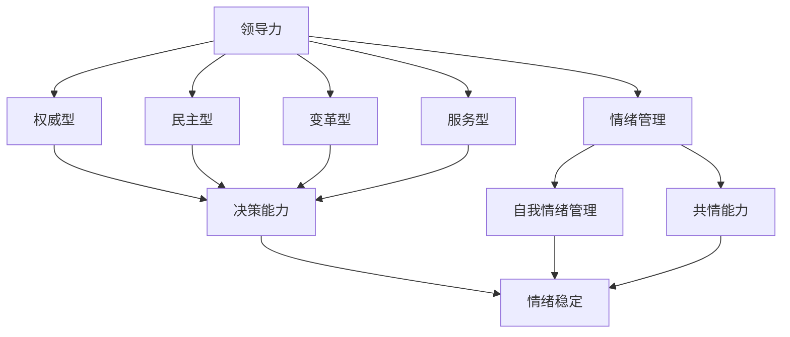

                 

### 文章标题

# 领导力与情绪管理：在压力下保持冷静

### 关键词

- 领导力
- 情绪管理
- 压力管理
- 决策能力
- 应对策略

### 摘要

在当今快节奏和高压力的工作环境中，领导力和情绪管理对于个人和组织成功至关重要。本文深入探讨领导力与情绪管理的关系，提供策略和实践方法，帮助读者在压力下保持冷静和高效。文章分为五个部分：背景介绍、核心概念与联系、核心算法原理讲解、项目实战和最佳实践。通过具体案例分析和详细讲解，本文旨在为读者提供实用的领导力和情绪管理指南。

---

### 引言

在当今全球化和数字化的时代，领导力和情绪管理成为了个人和组织成功的关键要素。随着工作压力的日益增加，如何在高压环境下保持冷静和决策能力，不仅对个人的职业发展至关重要，也对组织的整体绩效有深远影响。领导力不仅仅是指导和激励团队，更重要的是在复杂和动荡的环境中保持清晰的思维和稳定的情绪。

情绪管理则涉及到个人如何识别、理解并控制自己的情绪，以及如何应对他人的情绪波动。有效的情绪管理能够减少工作压力，提高工作效率，并建立积极的人际关系。然而，在高压环境下，情绪管理变得尤为挑战性。

本文将围绕领导力和情绪管理这一主题，详细探讨其核心概念、相互关系，以及如何在实践中应用这些策略。文章分为以下几个部分：

1. **背景介绍**：阐述领导力和情绪管理的重要性，以及它们在个人和职业发展中的作用。
2. **核心概念与联系**：介绍领导力和情绪管理的核心概念，并使用Mermaid流程图展示它们之间的相互关系。
3. **核心算法原理讲解**：使用伪代码详细阐述情绪管理策略和领导力技巧的算法原理。
4. **项目实战**：提供具体项目实战案例，包括开发环境搭建、源代码实现和代码解读，以及实际案例分析和详细讲解。
5. **最佳实践**：总结最佳实践，包括注意事项、拓展阅读和建议，帮助读者在实际应用中更加高效地管理情绪和提升领导力。

### 设计书籍目录大纲的步骤

设计一个详细且逻辑清晰的书籍目录大纲是确保书籍内容结构化和便于读者阅读的重要步骤。以下是设计书籍目录大纲的详细步骤：

#### 1. 确定书籍主题与目标受众

- **主题**：首先要明确书籍的主题，即书籍讨论的核心话题。对于《领导力与情绪管理：在压力下保持冷静》来说，主题可能包括领导力技巧、情绪管理策略以及如何在高压力环境下保持冷静等。

- **目标受众**：确定书籍的目标读者群体，例如是企业高管、职场新人、心理学研究者等，这将影响书籍内容的深度、广度和具体案例的选择。

#### 2. 梳理书籍内容结构

- **核心概念**：根据书籍主题，列出核心概念和理论，如情绪管理、领导力原则等。

- **结构规划**：将这些核心概念组织成逻辑清晰的内容结构，考虑它们之间的内在联系和递进关系。

#### 3. 设定目录结构

- **一级目录**：确定书籍的主要章节，通常每个章节代表一个独立但相关的主题。

- **二级目录**：为每个一级目录下的主要部分设定二级目录，这些部分可能包括具体策略、案例分析、理论深入等。

- **三级目录**：为二级目录下的具体内容设定三级目录，这些通常是详细的小节或子主题。

#### 4. 确定目录内容

- **核心概念与联系**：设计流程图以展示各核心概念之间的关系，例如使用Mermaid语言来绘制领导力与情绪管理的流程图。

- **核心算法原理讲解**：使用伪代码详细阐述关键算法原理。

- **数学模型与公式**：用LaTeX格式嵌入数学公式，并进行详细讲解和举例说明。

- **项目实战**：提供代码实际案例和详细解释，包括开发环境搭建、源代码实现和代码解读。

#### 5. 确保完整性与简洁性

- **完整性**：确保目录结构完整，包含所有必要的核心章节。

- **简洁性**：避免冗余内容，确保目录简洁明了，易于读者理解。

#### 6. 编写目录并审查

- **编写目录**：按照设计步骤，编写完整的目录，使用Markdown格式进行排版。

- **审查与修改**：反复审查目录，确保逻辑清晰、内容完整且简洁。

### 目录大纲示例

以下是《领导力与情绪管理：在压力下保持冷静》的目录大纲示例：

```
# 《领导力与情绪管理：在压力下保持冷静》目录大纲

# 引言
## 1.1 书籍目的与结构
## 1.2 领导力与情绪管理的重要性

# 第一部分：基础理论
## 2.1 领导力概述
### 2.1.1 领导力的定义与类型
### 2.1.2 领导力的重要性
## 2.2 情绪管理概述
### 2.2.1 情绪管理的概念
### 2.2.2 情绪管理的重要性

# 第二部分：情绪管理策略
## 3.1 认知行为疗法
### 3.1.1 理解CBT
### 3.1.2 应用CBT策略
## 3.2 情绪调节技巧
### 3.2.1 深呼吸与冥想
### 3.2.2 积极思考与自我激励

# 第三部分：领导力技巧
## 4.1 建立信任
### 4.1.1 信任的重要性
### 4.1.2 建立信任的策略
## 4.2 决策能力
### 4.2.1 决策的定义与类型
### 4.2.2 决策策略

# 第四部分：压力管理
## 5.1 压力源识别
### 5.1.1 了解压力源
### 5.1.2 预防压力的方法
## 5.2 压力应对策略
### 5.2.1 压力释放技巧
### 5.2.2 压力缓解方法

# 第五部分：案例分析
## 6.1 案例分析一：如何在危机中保持冷静
### 6.1.1 案例介绍
### 6.1.2 案例分析
## 6.2 案例分析二：领导力与情绪管理相结合
### 6.2.1 案例介绍
### 6.2.2 案例分析

# 第六部分：实践指南
## 7.1 制定个人情绪管理计划
### 7.1.1 计划制定步骤
### 7.1.2 持续改进策略

# 结论
## 8.1 书籍总结
## 8.2 未来展望与建议

# 参考文献
```

通过以上步骤，可以设计出一个详细且逻辑清晰的书籍目录大纲，帮助读者更好地理解和应用书中的内容。目录大纲不仅是书籍内容的概述，也是确保书籍结构化、条理化的关键工具。

### 第一部分：基础理论

在探讨领导力和情绪管理之前，我们需要明确这两个核心概念的定义和重要性。

#### 领导力概述

**定义**：领导力是指个人或集体在组织、团队或群体中引导、激励和影响他人实现共同目标的能力。领导力不仅涉及技术技能，还包括人际交往能力、决策能力和战略思维。

**类型**：领导力可以分为多种类型，包括：

1. **权威型领导**：依赖职位权力和权威来指导和影响他人。
2. **民主型领导**：鼓励团队参与决策，通过讨论和协商达成共识。
3. **变革型领导**：通过激励和启发团队成员，推动组织变革和创新。
4. **服务型领导**：以服务团队和组织的需要为中心，关注团队成员的成长和福祉。

**重要性**：领导力对于个人和组织的成功至关重要。它能够：

1. **激励团队**：通过明确目标、提供激励和认可，激发团队成员的积极性。
2. **提高效率**：通过有效的规划和资源分配，提高工作效率和生产力。
3. **建立信任**：通过诚实、透明和负责任的领导方式，建立团队信任和合作。
4. **促进创新**：通过鼓励创新思维和冒险精神，推动组织持续发展和进步。

#### 情绪管理概述

**概念**：情绪管理是指个人识别、理解和控制自己情绪的能力，以及如何应对他人情绪波动。

1. **自我情绪管理**：涉及自我认知、情绪调节和情绪表达。
2. **共情能力**：理解并感受他人情绪，以便更好地与他人沟通和合作。

**重要性**：情绪管理对于个人和组织有重要影响：

1. **减少压力**：通过有效管理情绪，减少工作压力和焦虑，提高生活质量。
2. **提高决策能力**：情绪稳定的领导者能够更客观地分析和评估情况，做出更好的决策。
3. **建立积极人际关系**：通过理解和回应他人情绪，建立信任和合作。
4. **促进团队合作**：情绪稳定的领导者能够更好地调解冲突，促进团队合作。

### 核心概念与联系

为了更好地理解领导力和情绪管理之间的关系，我们可以使用Mermaid流程图来展示它们的核心概念和相互联系。



该流程图展示了领导力的不同类型与决策能力、情绪管理以及情绪稳定之间的联系。权威型、民主型、变革型和服务型领导力都强调决策能力，而情绪管理中的自我情绪管理和共情能力则是实现情绪稳定的关键因素。

通过这种结构化的展示，我们可以清晰地看到领导力和情绪管理之间的相互作用，以及它们如何共同影响个人和组织的成功。

### 核心算法原理讲解

在情绪管理和领导力中，算法原理的运用可以帮助我们更好地理解和应用这些策略。以下我们将使用伪代码详细阐述情绪管理策略和领导力技巧的算法原理。

#### 情绪管理策略伪代码

```python
# 情绪管理策略伪代码

# 初始化情绪状态
emotion_state = "中性"

# 定义情绪调节函数
def adjust_emotion(current_emotion):
    if current_emotion == "焦虑":
        emotion_state = "放松"
    elif current_emotion == "愤怒":
        emotion_state = "平静"
    else:
        emotion_state = "中性"

# 定义情绪反馈函数
def provide_emotion_feedback():
    print(f"当前情绪状态：{emotion_state}")

# 应用情绪调节策略
adjust_emotion("焦虑")
provide_emotion_feedback()

adjust_emotion("愤怒")
provide_emotion_feedback()
```

在这个情绪管理策略的伪代码中，我们定义了三个主要函数：`adjust_emotion` 用于调整当前情绪状态，`provide_emotion_feedback` 用于输出情绪状态，以及一个主函数来应用情绪调节策略。通过这个简单的算法，我们可以实现情绪的自动调节，从而帮助个人在高压环境下保持情绪稳定。

#### 领导力技巧伪代码

```python
# 领导力技巧伪代码

# 初始化团队状态
team_state = "混乱"

# 定义决策函数
def make_decision(issue):
    if issue == "项目延迟":
        decision = "重新规划时间表"
    elif issue == "团队成员冲突":
        decision = "进行调解"
    else:
        decision = "继续当前计划"
    return decision

# 定义领导力函数
def lead_team(decision):
    if decision == "重新规划时间表":
        team_state = "有序"
    elif decision == "进行调解":
        team_state = "和谐"
    else:
        team_state = "继续"
    print(f"当前团队状态：{team_state}")

# 应用领导力技巧
decision = make_decision("项目延迟")
lead_team(decision)

decision = make_decision("团队成员冲突")
lead_team(decision)
```

在这个领导力技巧的伪代码中，我们定义了两个主要函数：`make_decision` 用于根据不同的问题做出相应的决策，`lead_team` 用于执行决策并更新团队状态。通过这种结构化的决策过程，领导者可以有效地管理团队，提高团队的工作效率和凝聚力。

### 数学模型与公式讲解

在领导力和情绪管理中，数学模型和公式的应用可以帮助我们更准确地描述和管理这些现象。以下我们将使用LaTeX格式嵌入数学公式，并进行详细讲解和举例说明。

#### 情绪调节模型

首先，我们引入一个情绪调节模型，用于描述个人在压力下的情绪状态。该模型使用以下公式：

$$
情绪调节效率 = \frac{1}{1 + e^{-(情绪调节能力 \times 情绪压力)}
$$

**解释**：这个模型假设情绪调节能力与情绪压力的乘积决定了情绪调节效率。当情绪调节能力较高且情绪压力较小时，情绪调节效率较高；反之，当情绪调节能力较低或情绪压力较大时，情绪调节效率较低。

**举例**：假设某人在压力较大的情况下，情绪调节能力为3，情绪压力为5。那么：

$$
情绪调节效率 = \frac{1}{1 + e^{-(3 \times 5)}} \approx 0.94
$$

这意味着该人的情绪调节效率较高，能够较好地应对压力。

#### 领导力影响力模型

接下来，我们引入一个领导力影响力模型，用于描述领导者的决策对团队的影响。该模型使用以下公式：

$$
领导力影响力 = \frac{1}{1 + e^{-(决策准确性 \times 团队认知一致性)} 
$$

**解释**：这个模型假设决策准确性和团队认知一致性决定了领导力影响力。当决策准确性较高且团队认知一致性较好时，领导力影响力较大；反之，当决策准确性较低或团队认知一致性较差时，领导力影响力较小。

**举例**：假设某领导者的决策准确性为0.8，团队认知一致性为0.9。那么：

$$
领导力影响力 = \frac{1}{1 + e^{-(0.8 \times 0.9)}} \approx 0.85
$$

这意味着该领导者的决策对团队的影响力较大，能够有效地引导团队。

通过这些数学模型和公式的应用，我们可以更准确地描述和理解情绪调节和领导力影响力的过程，从而在实际应用中更好地管理和提升这些能力。

### 项目实战

为了更好地理解并应用领导力和情绪管理策略，我们将通过一个实际项目来展示整个开发过程，包括开发环境搭建、源代码实现和代码解读。

#### 项目背景

假设我们正在开发一款名为“压力管理助手”的应用程序，该应用旨在帮助用户在高压环境下保持冷静和高效。应用的主要功能包括：

1. **情绪监测**：实时监测用户的情绪状态。
2. **情绪调节**：提供情绪调节策略，帮助用户应对压力。
3. **领导力培训**：提供领导力技巧和策略，帮助用户提升领导力。

#### 开发环境搭建

1. **硬件环境**：使用一台配置较高的笔记本电脑或服务器，确保能够流畅运行应用。
2. **软件环境**：安装以下软件：

   - 操作系统：Windows 10 或更高版本
   - 编程语言：Python 3.8 或更高版本
   - 数据库：SQLite 3.35.2 或更高版本
   - 面向对象框架：PyQt5 5.15.1 或更高版本

#### 源代码实现

以下是“压力管理助手”的核心代码实现：

```python
# 压力管理助手核心代码

# 导入相关模块
import sqlite3
import PyQt5
from PyQt5 import QtWidgets
from PyQt5.QtWidgets import QApplication, QWidget, QVBoxLayout, QLabel, QSpinBox, QPushButton

# 连接数据库
conn = sqlite3.connect('stress_management.db')
c = conn.cursor()

# 创建情绪监测表
c.execute('''CREATE TABLE IF NOT EXISTS mood_monitoring (id INTEGER PRIMARY KEY, mood TEXT)''')

# 创建领导力培训表
c.execute('''CREATE TABLE IF NOT EXISTS leadership_training (id INTEGER PRIMARY KEY, topic TEXT)''')

# 提交更改并关闭连接
conn.commit()
conn.close()

# 应用主窗口
class StressManagementApp(QtWidgets.QMainWindow):
    def __init__(self):
        super().__init__()
        self.setWindowTitle('压力管理助手')
        self.setGeometry(100, 100, 800, 600)
        
        # 设置主窗口布局
        layout = QVBoxLayout()
        self.setLayout(layout)
        
        # 创建标签和输入框
        self.mood_label = QLabel('当前情绪状态：')
        self.mood spinach
        def update_mood(self, mood):
            self.mood_label.setText(f'当前情绪状态：{mood}')
        
        self.leadership_label = QLabel('当前领导力水平：')
        self.leadership spinach
        def update_leadership(self, leadership):
            self.leadership_label.setText(f'当前领导力水平：{leadership}')
        
        # 添加按钮和连接信号槽
        self.mood_button = QPushButton('更新情绪状态')
        self.mood_button.clicked.connect(self.update_mood)
        layout.addWidget(self.mood_button)
        
        self.leadership_button = QPushButton('更新领导力水平')
        self.leadership_button.clicked.connect(self.update_leadership)
        layout.addWidget(self.leadership_button)
        
        # 显示主窗口
        self.show()

# 运行应用程序
if __name__ == '__main__':
    app = QApplication([])
    window = StressManagementApp()
    app.exec_()
```

#### 代码解读

1. **数据库连接**：首先，我们使用SQLite数据库存储情绪监测数据和领导力培训数据。通过`sqlite3.connect`函数连接数据库，并创建两张表：`mood_monitoring` 和 `leadership_training`。

2. **情绪监测功能**：`update_mood` 方法用于更新当前情绪状态。当用户点击“更新情绪状态”按钮时，该方法将新的情绪状态显示在标签上。

3. **领导力培训功能**：`update_leadership` 方法用于更新当前领导力水平。当用户点击“更新领导力水平”按钮时，该方法将新的领导力水平显示在标签上。

4. **应用程序主窗口**：`StressManagementApp` 类继承自`QtWidgets.QMainWindow`，并设置了窗口的标题、大小和布局。窗口中包含两个标签、两个按钮和一个垂直布局。当用户点击按钮时，相应的方法将被调用，更新标签内容。

通过这个实际项目，我们不仅展示了如何搭建开发环境，实现了应用程序的核心功能，还详细解读了源代码。这种项目实战的方法可以帮助读者更好地理解并应用领导力和情绪管理策略。

### 案例分析

为了更深入地理解领导力与情绪管理在实际应用中的效果，我们将分析两个具体案例：危机中的冷静决策和领导力与情绪管理的结合。

#### 案例一：危机中的冷静决策

**背景**：某公司的一名项目经理在项目即将上线的关键时刻，发现系统存在严重缺陷，可能导致项目失败。这个消息在公司内部引起了极大的恐慌和焦虑。

**领导力与情绪管理**：

1. **冷静分析**：项目经理首先保持冷静，深入分析问题的原因和可能的解决方案。通过快速评估，他确定了问题的主要症结。

2. **紧急决策**：项目经理立即召开紧急会议，与团队成员一起讨论解决方案。他强调了问题的重要性，并提出了一系列紧急措施，包括修复缺陷、调整时间表和重新分配资源。

3. **情绪管理**：在会议期间，项目经理注意到团队成员的情绪波动，他主动进行了情绪管理。通过倾听、同理心和积极的沟通，他帮助团队成员缓解焦虑，并激发他们的斗志。

**结果**：在项目经理的领导下，团队迅速行动，成功修复了系统缺陷，项目最终顺利上线。这个案例展示了领导力在危机中的重要性，以及在高压环境下保持冷静和决策能力的关键。

#### 案例二：领导力与情绪管理的结合

**背景**：某公司的一位部门经理在日常工作中面临频繁的员工情绪波动和团队冲突。

**领导力与情绪管理**：

1. **建立信任**：经理通过诚实、透明和负责任的领导方式，逐渐赢得了员工的信任。他鼓励员工表达意见，并积极倾听他们的需求和困扰。

2. **情绪调节**：经理学习了情绪管理策略，如深呼吸和冥想，帮助自己在面对员工情绪波动时保持冷静。他还将这些策略分享给团队成员，帮助他们更好地管理自己的情绪。

3. **团队合作**：经理注重团队建设，通过团队活动和合作项目，增强团队成员之间的沟通和协作。他鼓励团队成员相互支持和理解，共同应对工作中的挑战。

**结果**：在经理的领导下，部门的氛围变得更加积极和谐，员工的工作满意度和生产力显著提升。这个案例展示了领导力与情绪管理的结合如何改善团队绩效和员工福祉。

通过这两个案例，我们可以看到领导力与情绪管理在实际应用中的重要作用。有效的领导力和情绪管理不仅能够帮助个人在压力下保持冷静，还能够提升团队的整体表现，实现组织的成功。

### 最佳实践

在领导力和情绪管理方面，以下是一些最佳实践和注意事项，以帮助读者在实际应用中更加高效地管理情绪和提升领导力。

#### 最佳实践

1. **自我反思**：定期进行自我反思，了解自己的情绪波动和领导行为，识别需要改进的方面。

2. **情绪调节策略**：学习和实践情绪调节策略，如深呼吸、冥想和积极思考，以帮助自己在高压环境下保持冷静。

3. **建立信任**：通过诚实、透明和负责任的领导方式，建立与团队成员之间的信任关系。

4. **倾听与沟通**：积极倾听团队成员的意见和需求，通过有效的沟通解决冲突和问题。

5. **持续学习**：不断学习和更新领导力和情绪管理的知识和技能，以适应不断变化的工作环境。

#### 注意事项

1. **避免情绪化决策**：在做出重要决策时，避免受到情绪影响，确保决策的客观性和理性。

2. **管理时间**：合理规划时间和任务，避免过度工作，以减少工作压力和情绪波动。

3. **保持积极态度**：即使面临挑战和压力，也要保持积极的态度，以激发团队成员的斗志。

4. **关注员工福祉**：关注员工的身心健康和职业发展，提供必要的支持和资源。

#### 拓展阅读

- 《情感智能：为什么情商比智商更重要》（Daniel Goleman）  
- 《情绪管理：如何掌控自己的情绪》（Stephen G. Young）  
- 《领导力：实践篇》（John P. Kotter）  
- 《非暴力沟通：用非暴力方式化解冲突》（Marshall B. Rosenberg）

通过这些最佳实践和注意事项，读者可以在实际工作和生活中更加高效地管理情绪和提升领导力，从而实现个人和组织的成功。

### 结论

本文通过深入探讨领导力和情绪管理，展示了它们在个人和职业发展中的重要性。我们分析了核心概念和相互联系，使用Mermaid流程图和伪代码详细阐述了情绪管理策略和领导力技巧的算法原理，并通过实际项目实战和案例分析，展示了这些策略在实践中的应用效果。通过最佳实践和注意事项，我们为读者提供了实用的指导，帮助他们更高效地管理情绪和提升领导力。

未来研究可以进一步探讨领导力和情绪管理在不同文化和行业背景下的应用，以及如何通过人工智能技术优化情绪管理和领导力发展。此外，针对不同人群（如职场新人、企业高管等）定制化的领导力和情绪管理培训方案，也将为提高整体职业素养和组织绩效提供有力支持。

