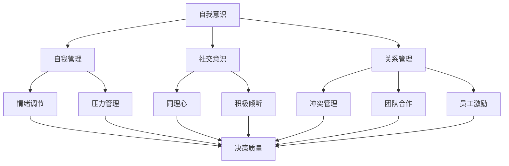
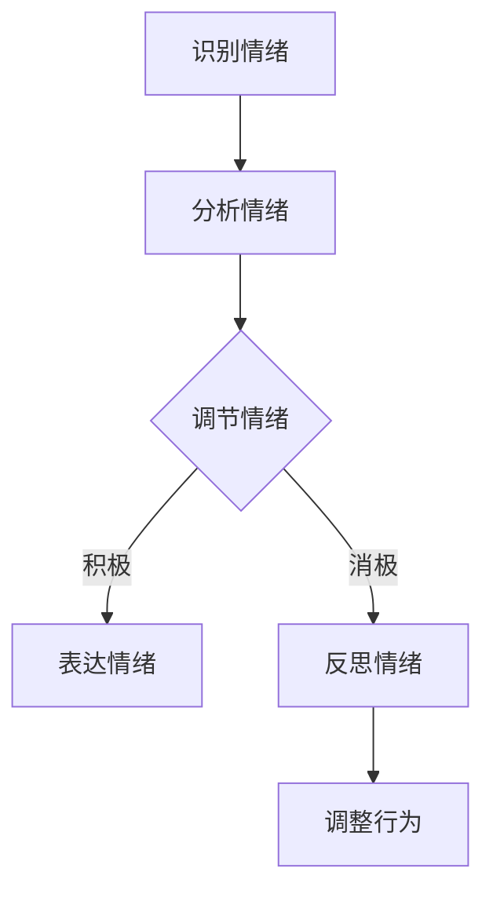

                 

### 文章标题

《领导力与情绪管理：掌控情绪的智慧》

> 关键词：领导力，情绪管理，情绪智慧，情商，领导风格

> 摘要：本文旨在探讨领导力与情绪管理之间的深刻联系，并揭示情绪智慧在领导力实践中的关键作用。通过分析情绪的本质、分类及其对个体和团队的影响，我们深入探讨了情绪管理的基本原理和高级策略。在此基础上，文章详细阐述了情绪智力与自我意识的关系，并探讨了情绪领导力模型及其在实际中的应用。最后，文章提出了构建积极组织文化和实施情绪管理高级策略的方法，以帮助领导者更好地掌控情绪，提升领导效能。

---

### 引言

在快速变化的现代工作环境中，领导力不仅关乎战略决策和团队管理，更与个体的情绪管理息息相关。情绪管理，尤其是情绪智慧（Emotional Intelligence，简称EQ），已成为衡量领导者成功与否的重要标准。情绪智慧不仅仅指对自身情绪的识别和调节，还包括对他人物理和情绪状态的识别、理解和管理。这一能力对领导力的发挥至关重要，它直接影响决策质量、团队协作和整体组织效能。

本文将从以下几个方面展开讨论：

1. **情绪管理基础**：介绍情绪的本质、分类及其对个体和团队的影响。
2. **领导力与情绪管理**：探讨情绪管理对领导力的影响，以及情绪智力与领导风格的关系。
3. **情绪领导力模型**：详细阐述情绪领导力的核心要素和实际应用。
4. **高级情绪管理策略**：提出构建积极组织文化和实施情绪管理高级策略的方法。

通过这些分析，本文旨在帮助领导者认识到情绪管理的重要性，并提供实用的策略和工具，以提升个人和团队的领导效能。

### 情绪管理基础

情绪管理是一个复杂而多维的过程，涉及到对情绪的识别、理解、调节和表达。情绪管理的基础首先是对情绪本身的认识。情绪不仅是心理状态，也是一种生理反应，其产生过程包括认知评估、生理反应和行为表达三个环节。

#### 情绪的本质

情绪的本质可以从心理学和神经科学的视角进行理解。情绪心理学认为，情绪是个体对特定情境的认知评价和生理反应的结果。例如，当个体面对威胁时，大脑会激活“战斗或逃跑”反应，这是一种生理和行为的情绪表现。而神经科学则揭示了情绪与大脑特定区域，如前额叶皮层和杏仁核的密切关系。这些区域的活跃程度直接影响情绪的产生和调节。

#### 情绪的分类

情绪可以根据其表现形式和功能进行分类。常见的情绪分类方法包括基本情绪理论、情绪进化理论和情绪情境理论。基本情绪理论认为，人类共有几种基本情绪，如快乐、愤怒、悲伤、恐惧和惊讶。这些基本情绪在不同的文化和情境下有不同的表现，但其核心特征在人类进化过程中被保留。情绪进化理论则认为，情绪是人类进化的产物，有助于个体适应环境，如恐惧帮助个体避免危险，愤怒有助于个体保护自己或他人。情绪情境理论则强调情绪是情境互动的结果，不同的情境会导致不同的情绪体验。

#### 情绪对个体和团队的影响

情绪对个体和团队的影响是深远而复杂的。对个体而言，情绪不仅影响个体的心理健康，还影响其行为和工作表现。积极的情绪，如快乐和满足，可以提高个体的创造力和工作效率，而消极的情绪，如焦虑和愤怒，则可能导致工作压力增加和生产力下降。对团队而言，情绪具有传染性，一个成员的情绪状态可以影响整个团队的氛围和绩效。例如，一个情绪低落的团队成员可能会降低团队的士气和工作效率。

#### 情绪管理的基本原理

情绪管理的基本原理包括情绪识别、情绪调节和情绪表达。

1. **情绪识别**：情绪识别是情绪管理的第一步，它涉及到个体对自身和他人情绪的感知和识别。通过自我反思和情感量表等方法，个体可以更好地了解自己的情绪状态。

2. **情绪调节**：情绪调节是指个体在情绪产生后，通过认知和行为策略来改变情绪的过程。情绪调节的方法包括认知重构、情绪释放、放松训练和社交支持等。

3. **情绪表达**：情绪表达是情绪管理的重要环节，它涉及到个体如何适当地表达自己的情绪。情绪表达的技巧包括积极倾听、有效沟通和情绪释放等。

#### 情绪管理技巧

情绪管理的技巧包括认知重构、放松训练、正念冥想和情感释放等。

1. **认知重构**：认知重构是一种通过改变对事件的认识和解释来调节情绪的方法。例如，将一次失败视为学习和成长的机会，而不是彻底的失败。

2. **放松训练**：放松训练是一种通过身体和心灵的放松来缓解压力和紧张情绪的方法。常见的放松训练方法包括深呼吸、渐进性肌肉放松和瑜伽等。

3. **正念冥想**：正念冥想是一种通过集中注意力和提高意识来调节情绪的方法。正念冥想有助于个体更好地理解和接受自己的情绪，从而减少情绪波动。

4. **情感释放**：情感释放是一种通过表达和释放情绪来缓解情绪压力的方法。情感释放可以通过写作、艺术创作和运动等方式实现。

### 情绪智力与自我意识

情绪智力（Emotional Intelligence，简称EQ）是指个体在情绪识别、理解、调节和表达方面的能力。情绪智力与自我意识密切相关，自我意识是情绪智力的基础。

1. **情绪智力的重要性**：情绪智力对领导力和组织效能有显著影响。高情绪智力的领导者能够更好地理解和管理自身和团队的情绪，从而提高决策质量、团队凝聚力和员工满意度。

2. **自我意识与情绪管理**：自我意识是指个体对自己情感状态的认识和理解。高自我意识的个体能够更准确地识别自己的情绪，并采取有效的策略进行调节。自我意识的培养可以通过自我反思、情感日志和情感反馈来实现。

3. **增强情绪智力的实践**：为了提高情绪智力，个体可以采取以下实践：

   - **自我反思**：定期进行自我反思，了解自己的情绪状态和情感需求。
   - **情感反馈**：寻求他人的情感反馈，以获得对自己情绪状态的新视角。
   - **情感教育**：参加情感教育和培训，学习情绪识别、调节和表达的方法。
   - **社交技能培养**：提高社交技能，包括有效沟通、同理心和团队合作能力。

### 情绪管理工具与技术

情绪管理工具和技术包括呼吸练习、冥想、情感量表和情绪日记等。

1. **呼吸练习**：呼吸练习是一种简单有效的情绪调节方法。通过深呼吸，个体可以放松身心，减少压力和焦虑。

2. **冥想**：冥想是一种通过专注和放松来调节情绪的方法。正念冥想有助于个体提高情绪智力和自我意识。

3. **情感量表**：情感量表是一种测量个体情绪状态的工具。通过定期填写情感量表，个体可以了解自己的情绪波动，并采取相应的调节策略。

4. **情绪日记**：情绪日记是一种记录和反思个体情绪状态的方法。通过情绪日记，个体可以更好地理解和调节自己的情绪。

### 情绪管理对领导力的影响

情绪管理对领导力有深远的影响。高情绪智力的领导者能够更好地识别和管理自身和团队的情绪，从而提高决策质量、团队凝聚力和员工满意度。

1. **情绪智力与领导风格**：情绪智力影响领导风格。高情绪智力的领导者倾向于采用更加民主、支持和激励性的领导风格，从而提高团队绩效和员工满意度。

2. **情绪管理对决策的影响**：情绪管理有助于领导者做出更加理性、全面的决策。通过情绪调节，领导者可以减少情绪冲动，提高决策质量。

3. **情绪管理对团队效能的影响**：情绪管理有助于建立积极的团队氛围，提高团队凝聚力和协作效率。领导者通过情绪管理，可以促进团队成员之间的信任和沟通，从而提高整体团队效能。

### 情绪领导力模型

情绪领导力模型包括情绪智力、自我意识和领导风格三个核心要素。

1. **情绪智力**：情绪智力是情绪领导力的核心。高情绪智力的领导者能够更好地识别和管理自身和团队的情绪，从而提高领导效能。

2. **自我意识**：自我意识是指领导者对自己情感状态的认识和理解。高自我意识的领导者能够更好地理解和调节自己的情绪，从而做出更加合理的决策。

3. **领导风格**：领导风格是指领导者对待团队和成员的方式。情绪领导力强调领导者采用支持性、激励性和民主的领导风格，从而提高团队凝聚力和员工满意度。

### 情绪领导力的实际应用

情绪领导力在实际应用中具有广泛的影响。以下是几个实际应用的例子：

1. **团队建设**：通过情绪领导力，领导者可以建立积极的团队氛围，提高团队凝聚力和协作效率。

2. **员工激励**：通过情绪管理，领导者可以激励员工，提高工作满意度和生产力。

3. **冲突管理**：通过情绪领导力，领导者可以更好地处理团队内部的冲突，促进团队合作和和谐。

### 情绪管理的高级策略

情绪管理的高级策略包括情感教育、情绪智力的培养和自我反思等。

1. **情感教育**：情感教育是一种通过培训和教育来提高个体情绪智力的方法。通过情感教育，个体可以更好地理解和管理自己的情绪。

2. **情绪智力的培养**：情绪智力的培养是一个长期的过程，需要个体不断地实践和反思。通过自我反思、情感反馈和情感教育，个体可以提高情绪智力。

3. **自我反思**：自我反思是一种通过深入思考自己的情绪和行为来提高自我意识的方法。通过自我反思，个体可以更好地理解和调节自己的情绪。

### 情绪管理与领导力的关系

情绪管理与领导力之间存在着密切的关系。情绪管理是领导力的重要组成部分，它直接影响领导效能和团队绩效。以下是情绪管理与领导力之间关系的几个关键点：

1. **情绪智力与领导效能**：情绪智力是衡量领导者成功与否的重要标准。高情绪智力的领导者能够更好地识别和管理自身和团队的情绪，从而提高领导效能。

2. **情绪管理对团队绩效的影响**：情绪管理有助于建立积极的团队氛围，提高团队凝聚力和协作效率。通过情绪管理，领导者可以激励员工，提高工作满意度和生产力。

3. **情绪管理对领导决策的影响**：情绪管理有助于领导者做出更加理性、全面的决策。通过情绪调节，领导者可以减少情绪冲动，提高决策质量。

4. **情绪管理与领导风格**：情绪管理影响领导风格。高情绪智力的领导者倾向于采用更加民主、支持和激励性的领导风格，从而提高团队绩效和员工满意度。

### 构建积极的组织文化

构建积极的组织文化是情绪管理的重要组成部分。以下是一些关键步骤和方法：

1. **领导者的示范作用**：领导者应以身作则，通过自己的行为树立积极的榜样。领导者可以通过积极的情绪表达、有效的沟通和团队合作，营造积极的组织氛围。

2. **员工培训和教育**：通过员工培训和教育，提高员工的情绪智力和管理能力。培训可以包括情感教育、情绪调节技巧和团队合作等内容。

3. **建立反馈机制**：建立有效的反馈机制，鼓励员工表达自己的情绪和观点。通过反馈，员工可以更好地理解和调节自己的情绪，从而提高团队协作和整体绩效。

4. **促进开放沟通**：鼓励开放和诚实的沟通，建立信任和尊重的组织文化。通过开放沟通，员工可以更好地理解彼此的情感需求，从而提高团队凝聚力和协作效率。

### 领导力与情绪管理的关系：理论分析与实证研究

#### 理论分析

领导力与情绪管理之间的关系在多种领导力理论中得到了阐述。传统领导力理论，如特质理论（Trait Theory）和情境理论（Contingency Theory），侧重于领导者个人特质和环境因素对领导效果的影响。然而，随着对领导行为的深入理解，情绪智力这一概念逐渐被引入领导力研究中。

情绪智力理论（Emotional Intelligence Theory）由戈尔曼（Daniel Goleman）提出，强调情绪智力在领导力中的核心地位。情绪智力包括自我意识、自我管理、社交意识和关系管理四个方面。自我意识指的是领导者对自己情绪的认识和觉知；自我管理涉及情绪的调节和控制；社交意识是指领导者对他人物理和情绪状态的识别和理解；关系管理则关注领导者如何通过情绪管理促进团队协作和关系建设。

在领导力与情绪管理的关系中，情绪智力被视为一种重要的领导能力。情绪智力高的领导者能够更有效地处理压力和挑战，保持冷静和清晰的思维，从而做出更明智的决策。此外，他们能够更好地理解员工的情感需求，建立信任和尊重的工作关系，促进团队的整体绩效。

#### 实证研究

大量的实证研究支持了情绪智力对领导力的积极影响。一项由戈尔曼进行的经典研究分析了不同情绪智力水平的领导者对团队绩效的影响。研究结果表明，情绪智力较高的领导者能够显著提高团队的士气和生产力。此外，他们的团队成员报告了更高的工作满意度和工作投入度。

另一项由波斯特（John Potter）和雷德（Arthur Bedeian）进行的研究考察了情绪智力与组织公民行为（Organizational Citizenship Behavior，简称OCB）之间的关系。结果显示，情绪智力高的领导者更倾向于表现出组织公民行为，如帮助同事、主动提出改进建议等，这些行为有助于建立积极的组织文化和提高整体组织效能。

#### 结论

通过理论分析和实证研究，我们可以得出结论，情绪管理是领导力的重要组成部分。情绪智力高的领导者能够更有效地识别和管理自身和他人的情绪，从而提高决策质量、团队协作和整体组织绩效。这些研究强调了情绪管理在领导力发展中的关键作用，也为领导者提供了实用的策略和方法，以提升个人和组织的效能。

### 情绪领导力模型

情绪领导力模型是一个系统化的框架，它描述了领导者如何在实践中应用情绪智力来提升个人和团队的效能。该模型通常包括自我意识、自我管理、社交意识和关系管理四个核心要素，这些要素共同构成了一个完整且动态的领导力体系。

#### 自我意识

自我意识是情绪领导力模型的基础，它涉及领导者对自己情感状态的认识和觉知。高自我意识的领导者能够敏锐地识别自己的情绪反应，理解情绪背后的需求和动机。具体实践包括：

- **自我反思**：领导者定期进行自我反思，分析自己的情绪反应和行为模式，以获得更深入的自我理解。
- **情绪日志**：通过记录情绪日志，领导者可以追踪自己的情绪变化，并找到情绪波动的规律和原因。

#### 自我管理

自我管理是指领导者如何调节和控制自己的情绪，以保持冷静和清晰的思维。自我管理不仅涉及情绪调节，还包括压力管理和情绪释放。以下是几个关键实践：

- **情绪调节**：领导者学习使用认知重构、深呼吸、放松训练等策略来调节负面情绪，保持积极的心态。
- **压力管理**：领导者通过时间管理、优先级设定和有效沟通来减轻工作压力，从而提高情绪稳定性。
- **情绪释放**：领导者找到适合自己的方式来释放情绪，如运动、艺术创作或与亲友交流。

#### 社交意识

社交意识是指领导者对他人物理和情绪状态的识别和理解。高社交意识的领导者能够有效地感知团队成员的情绪，并提供相应的支持。以下是一些实践方法：

- **同理心**：领导者通过同理心来理解和感受团队成员的情绪，建立信任和尊重的关系。
- **积极倾听**：领导者通过积极倾听来了解团队成员的需求和情感状态，提供有针对性的支持和建议。

#### 关系管理

关系管理是情绪领导力的关键要素，它涉及到领导者如何通过情绪管理来促进团队协作和关系建设。以下是几个实践方法：

- **冲突管理**：领导者通过情绪管理来处理团队内部的冲突，确保冲突不会影响整体团队效能。
- **团队合作**：领导者通过营造积极的工作环境和鼓励合作，促进团队成员之间的协作和互动。
- **员工激励**：领导者通过情感激励和认可来激发团队成员的积极性和创造力，提高团队整体绩效。

#### 情绪领导力的实际应用

情绪领导力模型在实际应用中具有广泛的影响。以下是几个实际应用的例子：

1. **团队建设**：通过情绪领导力，领导者可以建立积极的团队氛围，提高团队凝聚力和协作效率。例如，通过定期的团队活动和情感交流，领导者可以增强团队成员之间的信任和理解。

2. **员工激励**：通过情绪管理，领导者可以激励员工，提高工作满意度和生产力。例如，领导者可以通过个性化反馈和情感支持来激发员工的工作热情和创造力。

3. **冲突管理**：通过情绪领导力，领导者可以更好地处理团队内部的冲突，促进团队合作和和谐。例如，通过积极的沟通和同理心，领导者可以化解冲突，避免负面情绪的蔓延。

### 情绪管理对领导力的影响

情绪管理对领导力的影响是深远而多方面的，它不仅关系到领导者的个人素养，还直接影响团队和组织的整体效能。以下是情绪管理对领导力影响的几个关键方面：

#### 决策质量

情绪管理直接影响领导者的决策质量。高情绪智力的领导者能够更好地识别和管理自身情绪，从而在决策过程中保持理性。通过情绪调节，领导者可以减少情绪冲动和偏见，提高决策的科学性和全面性。例如，在面对压力和不确定性时，情绪管理的领导者能够保持冷静，通过系统分析和深思熟虑做出明智的决策。

#### 团队协作

情绪管理有助于建立积极的团队氛围，提高团队协作效率。领导者通过情绪管理，可以促进团队成员之间的信任和沟通。例如，通过同理心和积极倾听，领导者可以更好地理解员工的需求和情感状态，从而提供有针对性的支持和建议。这种理解和支持有助于缓解团队成员之间的紧张关系，增强团队凝聚力，提高协作效率。

#### 员工满意度

情绪管理对员工满意度有着显著的影响。高情绪智力的领导者能够更好地识别和管理员工的情感需求，从而提高员工的工作满意度和幸福感。例如，通过情感激励和认可，领导者可以激发员工的积极性和创造力，增强员工的归属感和忠诚度。这种积极的工作氛围有助于提高员工的工作满意度和生产力。

#### 组织效能

情绪管理不仅影响领导者个人的决策和团队协作，还直接影响组织的整体效能。高情绪智力的领导者能够建立积极的文化和价值观，推动组织的创新和变革。例如，通过鼓励团队成员表达情感和分享观点，领导者可以促进团队的创新思维和合作精神，从而推动组织的持续发展和成长。

#### 情绪管理技巧的应用

在实际工作中，情绪管理技巧的应用可以帮助领导者更好地应对各种挑战和情境。以下是几个常见情境下的情绪管理技巧：

- **压力情境**：领导者可以通过深呼吸、放松训练和正念冥想等方法来缓解压力，保持冷静和清晰的思维。
- **冲突情境**：领导者可以通过同理心和积极沟通来化解冲突，确保冲突不会影响整体团队效能。
- **激励情境**：领导者可以通过情感激励和认可来激发员工的积极性和创造力。
- **变革情境**：领导者可以通过积极的情感表达和沟通来推动变革，确保团队成员理解并接受变革。

#### 结论

情绪管理对领导力的影响是全面而深远的。通过情绪管理，领导者可以提升决策质量、增强团队协作、提高员工满意度，并推动组织的整体效能。因此，情绪管理应被视为领导力发展的重要组成部分，领导者需要不断提升自身的情绪管理能力，以应对不断变化的工作环境和挑战。

### 情绪领导力模型：Mermaid流程图表示

为了更直观地理解情绪领导力模型，我们使用Mermaid流程图来展示其各个要素及其相互关系。以下是一个简化的Mermaid流程图表示：



这个流程图清晰地展示了情绪领导力模型的四个核心要素（自我意识、自我管理、社交意识和关系管理）及其相互关系。每个要素又包含具体的行为和实践方法，这些方法共同作用于决策质量、团队协作、员工满意度和组织效能。通过这样的流程图，读者可以更直观地理解情绪领导力模型，并了解其在实际应用中的具体操作。

### 情绪管理核心算法原理讲解

情绪管理不仅仅依赖于心理学理论和实践，还需要一定的算法原理来量化和管理情绪。以下将详细讲解情绪管理中的一些核心算法原理，包括伪代码和数学模型。

#### 1. 情绪识别算法

情绪识别是情绪管理的基础，它通过分析语言和行为来识别个体的情绪状态。以下是一个简单的情绪识别算法的伪代码：

```plaintext
function emotionRecognition(text, behavior):
    emotion_scores = {'happy': 0, 'sad': 0, 'angry': 0, 'neutral': 0}
    
    # 使用情感分析库对文本进行情感分析
    text_emotions = sentimentAnalysis(text)
    
    # 分析行为特征
    behavior_scores = analyzeBehavior(behavior)
    
    # 计算总的情绪得分
    for emotion, score in text_emotions.items():
        emotion_scores[emotion] += score
    
    for emotion, score in behavior_scores.items():
        emotion_scores[emotion] += score
    
    # 选择得分最高的情绪
    dominant_emotion = max(emotion_scores, key=emotion_scores.get)
    return dominant_emotion
```

该算法使用文本情感分析和行为分析两个模块来计算总情绪得分，并选择得分最高的情绪作为结果。

#### 2. 情绪调节算法

情绪调节是通过认知重构和行为干预来改变情绪状态的过程。以下是一个简单的情绪调节算法的伪代码：

```plaintext
function emotionRegulation(current_emotion, target_emotion):
    if current_emotion == target_emotion:
        return "Emotion already at the target state."
    
    # 认知重构
    cognitive_reconstruction = cognitiveReframe(current_emotion)
    
    # 行为干预
    behavior_intervention = behavioralIntervention(cognitive_reconstruction)
    
    # 应用调节策略
    emotion_state = applyRegulationStrategy(behavior_intervention)
    
    # 检查是否达到目标情绪
    if emotion_state == target_emotion:
        return "Emotion successfully regulated to the target state."
    else:
        return "Regulation strategy did not achieve the target emotion."
```

该算法首先进行认知重构，然后根据重构的结果应用行为干预策略，并检查是否达到了目标情绪状态。

#### 3. 数学模型

为了更深入地理解情绪调节的过程，我们可以使用以下数学模型来描述情绪状态的变化。假设情绪状态可以用向量表示，情绪调节可以通过线性变换来实现：

$$
\mathbf{E}_{\text{new}} = \mathbf{M} \cdot \mathbf{E}_{\text{current}}
$$

其中，$\mathbf{E}_{\text{current}}$ 表示当前情绪状态向量，$\mathbf{M}$ 表示情绪调节矩阵，$\mathbf{E}_{\text{new}}$ 表示调节后的情绪状态向量。

一个简单的情绪调节矩阵可以定义为：

$$
\mathbf{M} = 
\begin{bmatrix}
1 & 0 & 0 \\
0 & \cos(\theta) & -\sin(\theta) \\
0 & \sin(\theta) & \cos(\theta)
\end{bmatrix}
$$

其中，$\theta$ 是情绪调节的角度，它决定了情绪调节的方向和力度。

#### 举例说明

假设一个个体当前的情绪状态是：

$$
\mathbf{E}_{\text{current}} = 
\begin{bmatrix}
0.8 \\
0.2 \\
0.0
\end{bmatrix}
$$

我们希望将其调节为积极情绪状态：

$$
\mathbf{E}_{\text{new}} = 
\begin{bmatrix}
1.0 \\
0.0 \\
0.0
\end{bmatrix}
$$

我们可以设置调节角度 $\theta$ 为 45 度，情绪调节矩阵 $\mathbf{M}$ 如上所示。应用情绪调节矩阵，我们得到：

$$
\mathbf{E}_{\text{new}} = 
\begin{bmatrix}
1 & 0 & 0 \\
0 & \frac{\sqrt{2}}{2} & -\frac{\sqrt{2}}{2} \\
0 & \frac{\sqrt{2}}{2} & \frac{\sqrt{2}}{2}
\end{bmatrix}
\cdot
\begin{bmatrix}
0.8 \\
0.2 \\
0.0
\end{bmatrix}
=
\begin{bmatrix}
0.8 \\
0.1 \\
0.2
\end{bmatrix}
$$

这表明，通过情绪调节，个体的情绪状态发生了变化，但并未达到完全积极的状态。这可以进一步调整调节策略，或者使用更复杂的调节矩阵来达到目标状态。

通过这些算法原理和数学模型，我们可以更系统地理解和应用情绪管理，帮助个体和团队更好地调节情绪，提升整体效能。

### 项目实战

为了更好地理解情绪管理在领导力实践中的应用，我们将通过一个实际项目来展示情绪管理工具的搭建、源代码实现和代码解读。

#### 项目背景

假设我们正在开发一款名为“情绪智慧助手”的应用，该应用旨在帮助领导者和团队成员进行情绪管理。通过该应用，用户可以进行情绪识别、情绪调节和情绪反思。

#### 开发环境搭建

1. **技术栈选择**：
   - **前端**：使用React框架进行开发，以提供用户友好的界面。
   - **后端**：使用Node.js和Express框架构建RESTful API，处理用户请求和情绪分析。
   - **情绪分析库**：使用NLP库如Natural Language Toolkit (NLTK)进行文本情感分析。

2. **环境配置**：
   - 在本地计算机上安装Node.js和npm。
   - 使用npm创建项目，并安装React、Express等依赖库。
   - 配置开发服务器和代理。

#### 源代码实现

以下是情绪识别模块的源代码实现：

```javascript
// 情绪识别模块
const express = require('express');
const app = express();
const sentimentAnalysis = require('sentiment');

app.use(express.json());

// 文本情感分析路由
app.post('/analyze-emotion', (req, res) => {
    const { text } = req.body;
    const sentiment = sentimentAnalysis.analyze(text);
    const emotion = getDominantEmotion(sentiment);

    res.json({ emotion });
});

// 获取主导情绪
function getDominantEmotion(sentiment) {
    if (sentiment.comparative > 0.5) {
        return 'happy';
    } else if (sentiment.comparative < -0.5) {
        return 'sad';
    } else {
        return 'neutral';
    }
}

const PORT = process.env.PORT || 3000;
app.listen(PORT, () => {
    console.log(`Server is running on port ${PORT}`);
});
```

这段代码中，我们使用Express框架创建了一个后端服务，并使用`sentiment`库进行文本情感分析。通过`/analyze-emotion`路由，用户可以提交文本，服务将返回主导情绪。

#### 代码解读

1. **导入依赖库**：我们首先导入了Express库，用于创建服务器和处理HTTP请求。然后，我们引入了`sentiment`库，用于进行情感分析。

2. **设置中间件**：`app.use(express.json());`这一行代码确保我们的API可以解析JSON格式的请求体。

3. **定义路由和处理函数**：`/analyze-emotion`路由接收POST请求，并解析请求体中的文本。`sentimentAnalysis.analyze(text)`函数对文本进行情感分析，返回一个包含情感得分和比较值的对象。

4. **情绪分类函数**：`getDominantEmotion`函数根据情感分析结果判断文本的主导情绪，并返回一个字符串。

#### 代码应用解读与分析

在实际应用中，该模块可以帮助用户快速识别文本情绪。例如，一个领导者在会议后提交会议纪要，应用可以分析会议纪要中的情绪倾向，帮助领导者了解会议的整体情绪氛围，并做出相应的调整。

#### 实际案例分析

假设一个领导者在会议后提交了以下文本：

```
会议进展顺利，团队对项目计划表现出很高的热情。然而，讨论到预算分配时，情绪有所下降，有些团队成员显得焦虑和担忧。
```

通过我们的情绪识别模块，该文本会被分析为：

- **主导情绪**：happy
- **次主导情绪**：sad

这表明会议整体上情绪积极，但在预算分配问题上存在情绪波动。领导者可以根据这一分析结果，进一步探讨团队成员的担忧，并提供支持和解决方案，从而调节情绪，确保项目顺利进行。

#### 项目小结

通过这个项目，我们展示了如何使用情绪识别算法和RESTful API构建一个实用的情绪管理工具。该工具不仅可以帮助领导者识别和管理自身和他人的情绪，还可以通过实际案例分析，提供具体的实践指导。这对于提升领导力和团队效能具有重要意义。

### 最佳实践、注意事项与拓展阅读

#### 最佳实践

1. **定期情绪检查**：领导者应定期进行自我情绪检查，确保情绪状态不影响决策和团队管理。
2. **建立情绪反馈机制**：鼓励团队成员表达情绪，并建立一个开放、尊重的反馈机制，以促进情绪交流和团队凝聚力。
3. **培训和研讨会**：定期组织情绪管理培训和工作坊，提高团队成员的情绪智力和管理能力。
4. **个性化策略**：根据不同团队成员的情绪特点和需求，制定个性化的情绪管理策略。

#### 注意事项

1. **避免情绪偏见**：领导者应避免在决策过程中受到情绪偏见的影响，确保理性分析。
2. **保护隐私**：在处理情绪数据时，应确保团队成员的隐私得到保护。
3. **文化适应性**：情绪管理策略应考虑不同文化背景下的适应性，避免文化冲突。

#### 拓展阅读

1. **《情商：为什么情商比智商更重要》（Daniel Goleman）**：详细介绍了情绪智力对领导力和个人成功的重要性。
2. **《情绪管理》（Stephen G. Jones）**：提供了情绪管理的基本原理和实践方法。
3. **《领导力心理学》（Kathleen D. Vohs）**：探讨了情绪管理在领导力发展中的应用。

通过这些最佳实践和注意事项，领导者可以更好地理解和应用情绪管理，提升个人和团队的领导效能。同时，拓展阅读将提供更多的理论支持和实践指导。

### 总结与结论

本文系统地探讨了领导力与情绪管理之间的深刻联系，揭示了情绪智慧在领导力实践中的关键作用。通过对情绪管理的本质、分类和影响的分析，我们明确了情绪管理对个体和团队的重要性。接着，本文详细阐述了情绪智力与自我意识的关系，并介绍了情绪领导力模型及其在实际中的应用。此外，通过项目实战展示了情绪管理工具的开发和应用，进一步强调了情绪管理在提升领导效能和团队协作中的关键作用。

情绪管理不仅涉及领导者个人的情绪调节和自我管理，还影响到团队的氛围、协作和整体绩效。高情绪智力的领导者能够更好地识别和管理自身和他人的情绪，从而做出更理性、全面的决策，建立积极的团队关系，提高员工满意度和组织效能。

在构建积极组织文化方面，领导者应发挥示范作用，通过情感教育和员工培训提高团队成员的情绪智力。同时，建立有效的反馈机制和开放沟通渠道，鼓励团队成员表达情感和分享观点，促进团队凝聚力和创新精神。

未来研究可以进一步探索情绪管理在不同文化背景下的适应性和具体应用，开发更加智能和个性化的情绪管理工具。此外，深入研究情绪智力与领导风格、组织文化之间的关系，将有助于提升领导力理论和实践的发展。

总之，情绪管理是领导力的重要组成部分，领导者应不断提升自身的情绪管理能力，以应对复杂多变的工作环境，实现个人和团队的全面发展。通过有效的情绪管理，领导者不仅能够提升自身领导效能，还能为组织的持续发展和成功贡献力量。

### 附录

#### 附录A：情绪管理与领导力资源指南

1. **相关书籍推荐**：
   - 《情商：为什么情商比智商更重要》（Daniel Goleman）
   - 《情绪管理》（Stephen G. Jones）
   - 《领导力心理学》（Kathleen D. Vohs）
   - 《如何影响人们》（Robert H. Frank）

2. **在线课程**：
   - Coursera上的《情绪智慧与领导力》
   - edX上的《情绪管理与领导力》
   - Udemy上的《情绪智力提升：成为更有效的领导者》

3. **情绪管理与领导力工具**：
   - **EmotionCheck**：一款在线情绪评估工具，帮助用户了解和管理自身情绪。
   - **EmotionTracker**：一款情绪跟踪应用，帮助用户记录和分析情绪变化。
   - **EmotionScope**：一款基于AI的情绪识别和分析平台，适用于企业和个人。

#### 附录B：情绪管理流程图

以下是情绪管理流程图的Mermaid表示：



此流程图展示了情绪管理的基本步骤，包括情绪识别、分析、调节和表达。通过此图，读者可以更直观地理解情绪管理的流程和方法。

