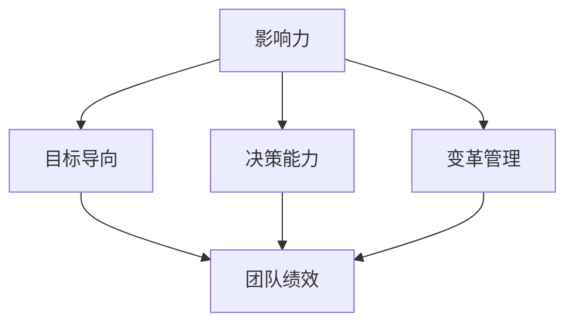
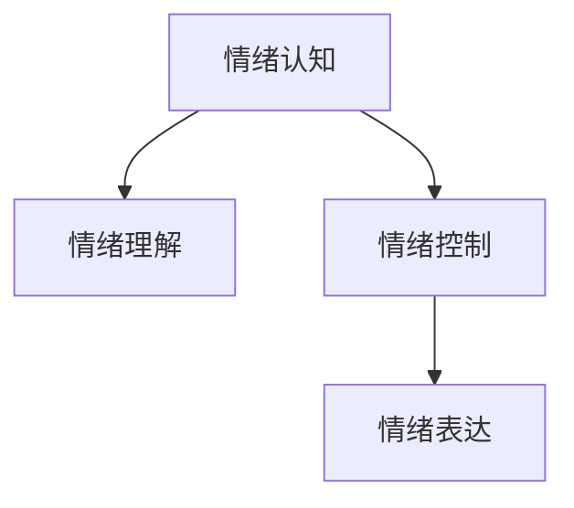
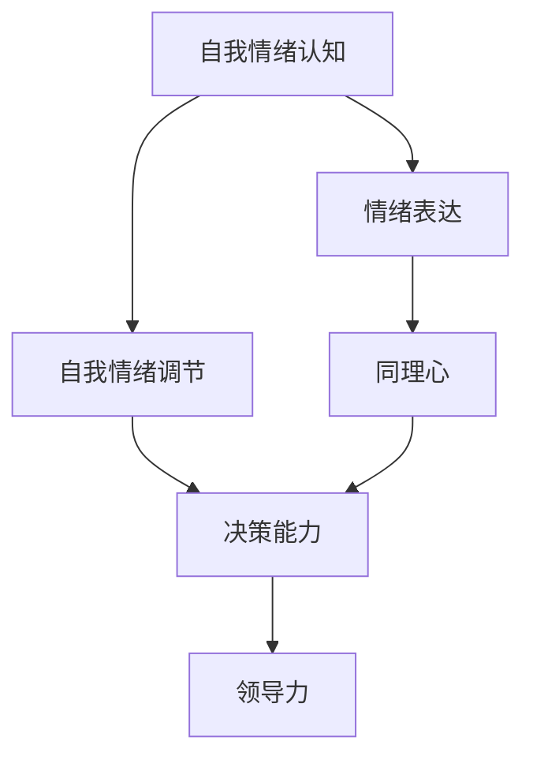

                 

### 文章标题：领导力与情绪管理：控制情绪对团队的影响

### 关键词：领导力、情绪管理、团队、影响、策略、发展

#### 摘要：
本文将深入探讨领导力与情绪管理之间的紧密联系，以及如何通过有效的情绪管理来提升团队的凝聚力和整体绩效。文章首先概述了领导力的基本概念和情绪管理的核心要素，随后分析了情绪管理对团队的影响。接着，文章提出了多种情绪管理策略，并讨论了这些策略在领导力发展中的应用。此外，文章还通过实际案例来展示情绪管理在团队建设和领导力提升中的重要性，并给出了最佳实践建议。

---

## 引言

在当今快速变化和竞争激烈的工作环境中，领导力的重要性不言而喻。领导者不仅需要具备战略眼光和决策能力，还需要具备出色的情绪管理技能。情绪管理不仅关乎个人的心理健康，更对团队的整体表现产生深远影响。有效的情绪管理能够促进团队的协作、提升工作效率，从而实现组织的长远发展。

本文旨在探讨领导力与情绪管理之间的互动关系，详细分析情绪管理对团队的影响，并提出实用的情绪管理策略。文章结构如下：

1. **领导力基础**：介绍领导力的定义、核心要素及其与情绪管理的联系。
2. **情绪管理原理**：探讨情绪的基本概念、情绪对个体和团队的影响。
3. **情绪管理策略**：介绍自我情绪管理技巧、情绪表达与沟通策略以及团队情绪管理的实践。
4. **情绪管理在领导力中的应用**：分析情绪管理对领导力的影响、情绪管理工具与实践、领导力与情绪管理培训。
5. **情绪管理与团队建设**：讨论构建高情商团队、情绪管理与团队绩效、团队发展。
6. **情绪管理与领导力发展**：探讨情绪管理与领导力发展的关系、情绪管理在领导力发展中的应用。
7. **总结与建议**：总结全文，提出最佳实践建议。

通过本文的详细分析，读者将更好地理解情绪管理在领导力和团队建设中的重要性，并掌握一系列实用的情绪管理策略。

---

## 第一部分：领导力基础

### 第1章：领导力概述

领导力是一种激励和引导他人实现共同目标的能力。它不仅仅是职位赋予的权力，更是一种影响力。有效的领导力能够激发团队的潜力，提升团队的绩效，并推动组织的持续发展。

### 核心概念与联系

领导力的核心概念包括：

1. **影响力**：领导者通过自身的知识、经验、品格和价值观来影响他人。
2. **目标导向**：领导者明确组织或团队的目标，并通过有效的沟通确保团队成员理解和接受这些目标。
3. **决策能力**：领导者能够在不确定性和压力下做出明智的决策。
4. **变革管理**：领导者推动组织或团队适应变化，克服变革中的挑战。

这些核心概念之间的关系可以用以下 Mermaid 流程图表示：



### 领导力与情绪管理的联系

情绪管理是领导力的重要组成部分。一个成功的领导者不仅需要具备战略眼光和决策能力，还需要具备良好的情绪管理技能。以下是领导力与情绪管理之间的一些联系：

1. **情感智商**：情绪管理能力是情感智商的核心组成部分，而情感智商又是领导力的关键要素之一。
2. **团队氛围**：领导者通过情绪管理影响团队氛围，营造积极的工作环境。
3. **沟通与协作**：情绪管理有助于提高沟通效果和协作效率，从而提升团队的整体绩效。

### 情绪管理对领导力的影响

情绪管理对领导力的影响主要体现在以下几个方面：

1. **决策质量**：良好的情绪管理有助于领导者保持冷静和理性，从而做出更高质量的决策。
2. **团队凝聚力**：通过有效的情绪管理，领导者能够增强团队的凝聚力，促进团队成员之间的信任和合作。
3. **领导力发展**：情绪管理技能的提升有助于领导者的个人成长和领导力的持续发展。

综上所述，领导力与情绪管理之间存在着密切的联系。一个成功的领导者必须具备良好的情绪管理技能，以便更好地实现团队目标，提升团队绩效，推动组织的持续发展。

---

### 第2章：情绪管理原理

情绪管理是指通过认识、理解、控制和管理自己的情绪，以达到更积极、健康的生活状态。在个人生活中，情绪管理能够帮助个体更好地应对压力，提高生活质量；在工作环境中，情绪管理对团队的绩效和氛围同样有着重要影响。

#### 核心概念与联系

情绪管理的核心概念包括：

1. **情绪认知**：认识到自己正在经历的情绪，并能够对其进行描述。
2. **情绪理解**：理解情绪背后的原因和影响，以及它们如何影响行为和思维。
3. **情绪控制**：通过行为和思维来调节情绪，使其更加积极和健康。
4. **情绪表达**：适当地表达情绪，避免情绪积累或压抑。

这些概念之间的关系可以用以下 Mermaid 流程图表示：



#### 情绪对个体的影响

情绪对个体的影响是多方面的，包括心理、生理和行为三个方面：

1. **心理影响**：情绪能够影响个体的思维模式、决策能力和心理状态。例如，积极的情绪能够提高个体的自信心和创造力，而消极的情绪则可能导致焦虑、抑郁和缺乏动力。
2. **生理影响**：情绪也会对个体的生理健康产生影响。长期处于高压或消极情绪状态的人可能会出现身体不适，如失眠、头痛和消化问题。
3. **行为影响**：情绪会影响个体的行为选择和社交互动。例如，愤怒的情绪可能导致个体采取攻击性行为，而积极的情绪则可能促进合作和积极的人际互动。

#### 情绪对团队的影响

情绪不仅影响个体，还通过团队互动对整个团队产生深远影响：

1. **团队氛围**：团队成员的情绪状态会直接影响团队氛围。积极情绪能够营造和谐、积极的工作环境，而消极情绪则可能导致紧张、敌对的工作氛围。
2. **沟通与协作**：情绪管理能力高的团队成员能够更好地进行沟通和协作，因为他们能够理解和尊重他人的情绪，避免因情绪冲突而影响工作效率。
3. **团队绩效**：情绪管理对团队绩效有着直接的影响。一个情绪稳定的团队能够更有效地应对挑战，提高工作效率，实现组织目标。

#### 情绪管理的重要性

情绪管理的重要性体现在以下几个方面：

1. **个人成长**：情绪管理有助于个体更好地认识自己，提高自我意识和自我调节能力，从而实现个人成长和职业发展。
2. **团队凝聚力**：有效的情绪管理能够增强团队的凝聚力，促进团队成员之间的信任和合作，提高团队整体绩效。
3. **领导力提升**：情绪管理是领导力的重要组成部分，一个具备良好情绪管理能力的领导者能够更好地领导团队，实现组织目标。

综上所述，情绪管理在个人和团队层面都具有重要意义。通过有效的情绪管理，个体和团队能够更好地应对压力，提高工作效率，实现长远发展。

---

### 第3章：情绪管理策略

情绪管理策略是指通过一系列方法和技术来认识和调节自己的情绪，以达到更积极、健康的生活状态。有效的情绪管理策略不仅有助于个人成长，还能提升团队凝聚力和整体绩效。以下是一些常见的情绪管理策略：

#### 自我情绪管理技巧

自我情绪管理技巧是指个体通过自我认知和行为调整来管理情绪的方法。以下是一些常见的自我情绪管理技巧：

1. **深呼吸**：深呼吸是一种简单但有效的情绪调节方法。通过缓慢而深长的呼吸，可以帮助个体放松身体和心灵，缓解紧张和焦虑情绪。
   
   ```plaintext
   // 伪代码：深呼吸调节情绪
   function deepBreathing() {
     for (int i = 1; i <= 5; i++) {
       System.out.println("吸气...保持...呼气...");
       // 实际上，这是一个循环，每个周期代表一次深呼吸
     }
   }
   ```

2. **认知重构**：认知重构是一种通过改变负面思维模式来调节情绪的方法。例如，将“我做不到”这种负面想法转变为“我可以尝试”，可以帮助个体克服挫败感和焦虑。

   ```plaintext
   // 伪代码：认知重构
   function cognitiveReframe(original Thought) {
     if (original Thought == "我做不到") {
       return "我可以尝试";
     }
     return original Thought;
   }
   ```

3. **积极自我对话**：积极自我对话是一种通过积极的内在语言来提升情绪的方法。例如，当面临挑战时，对自己说“我可以做到”或“这是一个机会”，可以帮助个体保持积极心态。

   ```plaintext
   // 伪代码：积极自我对话
   function positiveSelfTalk(challenge) {
     System.out.println("面对挑战：" + challenge + "，我可以做到！");
   }
   ```

#### 情绪表达与沟通

情绪表达与沟通是指个体通过适当的方式表达自己的情绪，并与他人进行有效沟通的方法。以下是一些常见的情绪表达与沟通技巧：

1. **非暴力沟通**：非暴力沟通是一种通过尊重和理解他人来有效表达情绪的方法。它包括四个步骤：观察、感受、需求和请求。

   ```plaintext
   // 伪代码：非暴力沟通
   function nonViolentCommunication(observable, feeling, need, request) {
     System.out.println("我观察到：" + observable);
     System.out.println("我感到：" + feeling);
     System.out.println("因为我的需要是：" + need);
     System.out.println("我请求你：" + request);
   }
   ```

2. **情绪倾听**：情绪倾听是一种通过理解和支持他人来有效接收情绪的方法。倾听者需要给予他人充分的注意，表达理解和同情，避免打断或评判。

   ```plaintext
   // 伪代码：情绪倾听
   function emotionalListening(message) {
     System.out.println("我理解你的感受，请继续分享...");
   }
   ```

3. **情绪调节后的沟通**：情绪调节后的沟通是指个体在情绪稳定后进行的沟通。这种方法可以帮助个体避免因情绪激动而导致的误解或冲突。

   ```plaintext
   // 伪代码：情绪调节后的沟通
   function regulatedCommunication() {
     System.out.println("我已经冷静下来，现在我们可以进行有建设性的对话了。");
   }
   ```

#### 团队情绪管理的实践

团队情绪管理的实践是指通过一系列策略和活动来管理团队情绪，提升团队整体绩效的方法。以下是一些常见的团队情绪管理实践：

1. **情绪温度计**：情绪温度计是一种通过定期调查团队成员情绪状态的工具。团队领导者可以通过情绪温度计了解团队成员的情绪状态，并采取相应的措施。

   ```plaintext
   // 伪代码：情绪温度计调查
   function emotionalTemperatureSurvey() {
     System.out.println("请回答以下问题，1表示非常不同意，5表示非常同意：");
     System.out.println("1. 我对当前工作感到满意。");
     System.out.println("2. 我感觉团队成员之间相互支持。");
     System.out.println("3. 我对团队的目标有清晰的认识。");
     // 收集并分析调查结果
   }
   ```

2. **团队建设活动**：团队建设活动是一种通过互动和合作来提升团队情绪和凝聚力的方法。这些活动可以帮助团队成员建立信任，增强团队协作。

   ```plaintext
   // 伪代码：团队建设活动
   function teamBuildingActivity() {
     System.out.println("今天我们将进行一系列团队建设活动，以增强我们的团队合作能力。");
     // 安排和执行团队建设活动
   }
   ```

3. **情绪调节培训**：情绪调节培训是一种通过培训和指导来提升团队成员情绪管理能力的策略。通过情绪调节培训，团队成员可以学习到一系列情绪管理技巧，从而更好地应对工作压力。

   ```plaintext
   // 伪代码：情绪调节培训
   function emotionalRegulationTraining() {
     System.out.println("我们将进行一次情绪调节培训，帮助大家更好地管理情绪。");
     // 安排和执行情绪调节培训
   }
   ```

通过以上情绪管理策略的实践，团队领导者可以有效地管理团队情绪，提升团队绩效，实现组织目标。

---

### 第4章：情绪管理对领导力的影响

情绪管理在领导力中扮演着至关重要的角色。一个具备良好情绪管理能力的领导者不仅能够更好地处理个人情绪，还能对团队产生积极影响。以下是情绪管理对领导力的几个关键方面：

#### 情绪智力与领导力

情绪智力（Emotional Intelligence，简称EQ）是领导力的核心要素之一。情绪智力包括以下几个关键组成部分：

1. **自我情绪认知**：领导者能够识别和理解自己的情绪，知道它们是如何影响自己的思维和行为的。
2. **自我情绪调节**：领导者能够有效地调节自己的情绪，保持冷静和理性，即使在压力和挑战下也能做出明智的决策。
3. **情绪表达**：领导者能够适当地表达自己的情绪，避免情绪失控或压抑。
4. **同理心**：领导者能够理解和感受到他人的情绪，建立良好的人际关系。

情绪智力与领导力之间的联系可以用以下 Mermaid 流程图表示：



#### 情绪管理能力对领导力的提升

情绪管理能力对领导力的提升具有以下几个方面的作用：

1. **增强决策能力**：通过情绪管理，领导者能够保持冷静和理性，减少情绪对决策的影响，从而做出更高质量的决策。
2. **提升沟通效果**：情绪管理能力有助于领导者更好地表达自己的情绪，理解他人的情绪，从而建立更有效的人际沟通。
3. **增强团队凝聚力**：领导者通过情绪管理能够营造积极的工作氛围，增强团队成员之间的信任和合作，提升团队的凝聚力。
4. **促进团队发展**：情绪管理能力有助于领导者更好地应对团队中的冲突和挑战，推动团队持续发展。

#### 情绪管理对团队氛围的影响

情绪管理对团队氛围的影响是显而易见的。一个具备良好情绪管理能力的领导者能够：

1. **营造积极的工作氛围**：通过情绪管理，领导者能够传递积极的情绪，影响团队成员，营造一个积极、健康的工作氛围。
2. **缓解压力和焦虑**：领导者通过情绪管理能够帮助团队成员缓解工作压力和焦虑，提高工作效率和生产力。
3. **减少冲突和摩擦**：情绪管理有助于领导者识别和解决团队中的情绪冲突，减少摩擦和内耗，促进团队和谐。

#### 情绪管理对领导力发展的促进作用

情绪管理不仅对当前领导力有直接影响，还对领导力发展具有长期促进作用。以下是情绪管理对领导力发展的几个方面：

1. **个人成长**：通过情绪管理，领导者能够更好地认识自己，提升自我意识，促进个人成长。
2. **情绪智力提升**：情绪管理能力的提升有助于领导者提高情绪智力，从而在领导力发展的各个方面取得更大成就。
3. **领导风格多样化**：情绪管理能力的提升使得领导者能够更好地适应不同的情境和团队，发展多样化的领导风格。

综上所述，情绪管理对领导力有着深远的影响。一个具备良好情绪管理能力的领导者不仅能够提升自身的领导力，还能对团队产生积极影响，推动组织的长远发展。

---

### 第5章：情绪管理工具与实践

#### 情绪温度计

情绪温度计是一种简单但有效的工具，用于评估团队成员的情绪状态。通过情绪温度计，团队领导者可以了解团队的整体情绪氛围，从而采取相应的措施。

**工作原理：** 情绪温度计通常采用一个量尺，一端表示非常积极，另一端表示非常消极。团队成员可以在每次会议或活动后，根据自己的情绪状态在量尺上进行标记。

**应用示例：**
1. 在每周团队会议后，团队成员在情绪温度计上标记自己的情绪状态。
2. 团队领导者定期收集情绪温度计的数据，分析团队的情绪变化趋势。
3. 根据情绪温度计的结果，团队领导者可以采取相应的措施，如调整工作计划、提供心理支持或组织团队建设活动。

```plaintext
// 伪代码：情绪温度计
function emotionalThermometer() {
  System.out.println("请在你当前的情绪状态上标记：1（非常消极）到5（非常积极）");
  int emotionScore = getUserInput();
  if (emotionScore <= 2) {
    System.out.println("团队情绪提示：我们需要关注团队成员的情绪，可能需要提供支持或调整工作计划。");
  } else if (emotionScore >= 4) {
    System.out.println("团队情绪提示：我们的团队氛围很积极，继续保持！继续努力实现目标。");
  }
}
```

#### 情绪轮

情绪轮是一种视觉工具，用于帮助团队成员识别和理解自己的情绪。通过情绪轮，团队成员可以更好地认识自己的情绪状态，从而进行有效的情绪管理。

**工作原理：** 情绪轮通常包含多种情绪状态，如高兴、愤怒、悲伤等。每种情绪状态都被表示为轮上的一个部分。团队成员可以通过情绪轮来识别和理解自己的情绪。

**应用示例：**
1. 在团队会议或个人反思时，团队成员使用情绪轮来识别和理解自己的情绪。
2. 团队领导者可以指导团队成员如何使用情绪轮，并提供相关的情绪管理技巧。
3. 通过情绪轮的使用，团队成员可以更好地识别情绪状态，从而采取适当的情绪管理策略。

```plaintext
// 伪代码：情绪轮
function emotionalWheel() {
  System.out.println("请使用情绪轮识别你的当前情绪状态，并选择相应的情绪状态。");
  String currentEmotion = getUserInput();
  if (currentEmotion == "happy") {
    System.out.println("你的情绪状态是高兴，这有助于提升工作效率。");
  } else if (currentEmotion == "angry") {
    System.out.println("你的情绪状态是愤怒，这可能影响工作效率，请尝试进行情绪调节。");
  }
}
```

#### 情绪管理案例研究

情绪管理案例研究通过具体实例展示了情绪管理工具在实践中的应用效果。以下是一个情绪管理案例研究的示例：

**案例背景：** 一家科技公司的一个项目团队在面临重要项目截止日期时，团队成员情绪普遍紧张，导致工作效率下降。

**解决方案：**
1. **使用情绪温度计：** 团队领导者通过情绪温度计收集团队成员的情绪数据，发现大多数成员的情绪状态为消极。
2. **组织团队建设活动：** 团队领导者组织了一次团队建设活动，帮助团队成员缓解压力，增强团队凝聚力。
3. **提供情绪管理培训：** 团队领导者为团队成员提供情绪管理培训，教授他们情绪调节技巧和沟通策略。
4. **定期跟进：** 团队领导者定期使用情绪温度计评估团队成员的情绪状态，并根据情况调整管理策略。

**效果评估：**
- 在团队建设活动和情绪管理培训之后，团队成员的情绪状态显著改善，工作效率逐渐提高。
- 项目最终成功交付，团队获得了客户的高度评价。
- 通过定期跟进和情绪管理，团队领导者的领导力得到了提升，团队的凝聚力也得到了增强。

综上所述，情绪管理工具和实践在团队管理和领导力提升中具有重要意义。通过有效的情绪管理，团队可以更好地应对挑战，提升整体绩效，实现长远发展。

---

### 第6章：情绪管理领导力培养

情绪管理领导力的培养是提升领导力的重要环节。一个具备良好情绪管理能力的领导者不仅能够更好地管理个人情绪，还能有效引导和激励团队成员，提升团队的整体绩效。以下是从领导力培训、情绪管理能力评估和实际案例三个方面，探讨情绪管理领导力的培养方法。

#### 领导力培训

领导力培训是培养情绪管理领导力的重要途径。通过领导力培训，领导者可以学习到一系列情绪管理技巧，包括自我情绪认知、情绪调节、同理心等。以下是一些具体的培训方法：

1. **情感智商培训**：情感智商培训专注于提升领导者的自我情绪认知和调节能力。通过一系列的练习和案例分析，领导者可以更好地理解自己的情绪，学会如何有效地调节情绪。

   ```plaintext
   // 伪代码：情感智商培训
   function emotionalIntelligenceTraining() {
     System.out.println("我们将进行情感智商培训，帮助你更好地理解和管理自己的情绪。");
     // 包括自我情绪认知、情绪调节、同理心等内容的培训课程
   }
   ```

2. **情境模拟训练**：情境模拟训练通过模拟不同的工作场景，帮助领导者学会如何在压力和挑战下保持冷静和理性。通过情境模拟，领导者可以练习如何有效地处理冲突和应对紧急情况。

   ```plaintext
   // 伪代码：情境模拟训练
   function situationalSimulationTraining() {
     System.out.println("我们将模拟一些工作场景，帮助你练习情绪管理和决策能力。");
     // 设计不同的情境，领导者进行实际操作并接受反馈
   }
   ```

3. **情绪管理研讨会**：情绪管理研讨会是一种集体学习方式，通过小组讨论和分享经验，领导者可以学习到其他领导者的情绪管理技巧。这种培训方法有助于建立领导者之间的信任和合作。

   ```plaintext
   // 伪代码：情绪管理研讨会
   function emotionalManagementWorkshop() {
     System.out.println("我们将举办一次情绪管理研讨会，分享情绪管理经验和方法。");
     // 组织小组讨论，领导者分享情绪管理技巧
   }
   ```

#### 情绪管理能力评估

情绪管理能力评估是培养情绪管理领导力的关键步骤。通过情绪管理能力评估，领导者可以了解自己在情绪管理方面的优势和不足，从而有针对性地进行改进。以下是一些常见的情绪管理能力评估方法：

1. **自我评估问卷**：自我评估问卷是一种简单的评估方法，领导者可以通过填写问卷来评估自己的情绪管理能力。问卷通常包括一系列关于情绪认知、情绪调节和同理心等方面的问题。

   ```plaintext
   // 伪代码：自我评估问卷
   function selfAssessmentQuestionnaire() {
     System.out.println("请回答以下问题，每题1-5分：");
     System.out.println("1. 我能识别和理解自己的情绪。");
     System.out.println("2. 我能有效地调节自己的情绪。");
     System.out.println("3. 我能理解和感受到他人的情绪。");
     // 收集并分析评估结果
   }
   ```

2. **360度评估**：360度评估是一种通过多个视角对领导者进行评估的方法。评估者包括领导者的上级、同事和下属，他们可以提供对领导者情绪管理能力的多方面反馈。

   ```plaintext
   // 伪代码：360度评估
   function360DegreeEvaluation() {
     System.out.println("我们将进行360度评估，收集对你情绪管理能力的多方面反馈。");
     // 设计评估问卷，收集评估结果
   }
   ```

3. **情绪管理能力测试**：情绪管理能力测试是一种标准化的评估方法，通过一系列的测试题目来评估领导者的情绪管理能力。测试结果可以提供定量数据，帮助领导者更全面地了解自己的情绪管理能力。

   ```plaintext
   // 伪代码：情绪管理能力测试
   function emotionalManagementTest() {
     System.out.println("我们将进行情绪管理能力测试，帮助你了解自己的情绪管理能力。");
     // 设计测试题目，进行测试并分析结果
   }
   ```

#### 情绪管理领导力实际案例

情绪管理领导力的培养不仅依赖于理论和实践，还需要通过实际案例来加深理解和应用。以下是一个情绪管理领导力的实际案例：

**案例背景：** 一家互联网公司的新产品开发团队在项目关键期遇到了技术难题，团队成员情绪紧张，导致工作效率下降。

**解决方案：**
1. **情绪温度计**：团队领导者通过情绪温度计了解团队成员的情绪状态，发现大部分成员情绪消极。
2. **情绪管理培训**：团队领导者组织了一次情绪管理培训，教授团队成员情绪调节技巧和沟通策略。
3. **团队建设活动**：团队领导者组织了一次户外拓展活动，帮助团队成员缓解压力，增强团队凝聚力。
4. **定期跟进**：团队领导者定期使用情绪温度计评估团队成员的情绪状态，根据情况调整管理策略。

**效果评估：**
- 在情绪管理培训和团队建设活动之后，团队成员的情绪状态显著改善，工作效率逐渐提高。
- 项目最终成功交付，团队获得了客户的高度评价。
- 通过定期跟进和情绪管理，团队领导者的领导力得到了提升，团队的凝聚力也得到了增强。

综上所述，情绪管理领导力的培养需要通过领导力培训、情绪管理能力评估和实际案例相结合的方法。通过这些方法，领导者可以提升自身的情绪管理能力，更好地激励和引导团队成员，推动团队的长远发展。

---

### 第7章：构建高情商团队

构建高情商团队是提升团队绩效和实现组织目标的关键。高情商团队具有以下特征：

1. **积极的工作氛围**：团队成员相互支持，共同努力，充满正能量。
2. **高效的沟通**：团队成员能够有效沟通，理解彼此的需求和情感，避免误解和冲突。
3. **良好的协作**：团队成员之间合作无间，能够共同解决问题，实现团队目标。
4. **持续的学习和成长**：团队成员不断学习新知识和技能，提高个人和团队的能力。

要构建高情商团队，需要采取以下策略：

#### 培养高情商团队成员

1. **情绪认知**：团队成员需要认识到自己的情绪，并能够描述和理解情绪对行为和思维的影响。
2. **情绪调节**：团队成员需要学会调节情绪，以保持积极的心态，提高工作效率。
3. **同理心**：团队成员需要培养同理心，理解他人的情绪和需求，建立良好的人际关系。

#### 团队情商建设实践

1. **定期情绪反馈**：团队领导者可以通过定期的情绪反馈会议，了解团队成员的情绪状态，并提供必要的支持和指导。
2. **团队建设活动**：组织团队建设活动，如拓展训练、团队游戏等，增强团队成员之间的信任和合作。
3. **情绪管理培训**：为团队成员提供情绪管理培训，教授情绪调节技巧和沟通策略。
4. **情绪温度计**：使用情绪温度计定期评估团队成员的情绪状态，了解团队的整体情绪氛围。

#### 高情商团队的挑战与解决策略

1. **情绪冲突**：团队成员之间的情绪冲突可能导致团队绩效下降。解决策略包括：
   - **开放沟通**：鼓励团队成员开放沟通，表达自己的情绪和观点。
   - **调解机制**：建立调解机制，帮助解决情绪冲突。

2. **压力管理**：高工作压力可能导致团队成员情绪紧张，影响团队绩效。解决策略包括：
   - **压力评估**：定期评估团队成员的工作压力，提供必要的支持。
   - **压力缓解活动**：组织压力缓解活动，如瑜伽、冥想等，帮助团队成员放松身心。

通过以上策略，团队可以构建高情商团队，提升团队绩效，实现组织目标。

---

### 第8章：情绪管理与团队绩效

情绪管理在提升团队绩效方面发挥着关键作用。一个情绪稳定、沟通高效的团队能够在面对挑战时保持积极态度，提高工作效率，实现组织目标。以下分析情绪管理对团队绩效的具体影响，并探讨提高团队绩效的情绪管理策略。

#### 情绪管理对团队绩效的影响

1. **提高工作效率**：情绪稳定的团队成员能够更好地集中注意力，减少因情绪波动导致的工作中断和错误。研究表明，积极情绪可以提高工作效率，而消极情绪则可能降低工作效率。

2. **促进团队协作**：情绪管理有助于团队成员建立信任和合作关系。通过情绪表达与沟通，团队成员能够更好地理解彼此的需求和观点，减少误解和冲突，提高协作效率。

3. **降低员工流失率**：情绪管理有助于营造积极的工作氛围，提升员工的工作满意度和忠诚度。员工在情绪稳定、支持性的环境中更愿意长期为公司贡献，降低员工流失率。

4. **提高决策质量**：情绪管理能力较高的团队成员能够更冷静和理性地分析问题，做出更高质量的决策。在高压和复杂的工作环境中，情绪稳定的领导者能够带领团队应对挑战，减少决策失误。

#### 提高团队绩效的情绪管理策略

1. **情绪温度计**：使用情绪温度计定期评估团队成员的情绪状态，了解团队的整体情绪氛围。团队领导者可以根据情绪温度计的结果，采取相应的措施，如组织情绪管理培训或调整工作安排。

   ```plaintext
   // 伪代码：情绪温度计
   function emotionalThermometer() {
     System.out.println("请在你当前的情绪状态上标记：1（非常消极）到5（非常积极）");
     int emotionScore = getUserInput();
     if (emotionScore <= 2) {
       System.out.println("团队情绪提示：我们需要关注团队成员的情绪，可能需要提供支持或调整工作计划。");
     } else if (emotionScore >= 4) {
       System.out.println("团队情绪提示：我们的团队氛围很积极，继续保持！继续努力实现目标。");
     }
   }
   ```

2. **情绪管理培训**：为团队成员提供情绪管理培训，教授情绪调节技巧和沟通策略。通过培训，团队成员可以学会如何更好地管理自己的情绪，提高工作满意度和绩效。

   ```plaintext
   // 伪代码：情绪管理培训
   function emotionalManagementTraining() {
     System.out.println("我们将进行情绪管理培训，帮助你更好地理解和管理自己的情绪。");
     // 包括自我情绪认知、情绪调节、同理心等内容的培训课程
   }
   ```

3. **团队建设活动**：组织团队建设活动，增强团队成员之间的信任和合作。通过活动，团队成员可以更好地了解彼此，提高团队的凝聚力。

   ```plaintext
   // 伪代码：团队建设活动
   function teamBuildingActivity() {
     System.out.println("今天我们将进行一系列团队建设活动，以增强我们的团队合作能力。");
     // 安排和执行团队建设活动
   }
   ```

4. **情绪支持系统**：建立情绪支持系统，为团队成员提供情绪支持和咨询。通过支持系统，团队成员可以及时倾诉自己的情绪问题，获得帮助和指导。

   ```plaintext
   // 伪代码：情绪支持系统
   function emotionalSupportSystem() {
     System.out.println("我们将建立一个情绪支持系统，为团队成员提供情绪支持和咨询。");
     // 提供定期的情绪支持会议，安排专业的心理咨询服务
   }
   ```

通过以上情绪管理策略，团队可以提升整体绩效，实现组织目标。

---

### 第9章：情绪管理与团队发展

情绪管理在团队发展过程中扮演着关键角色。一个情绪稳定、协作高效的团队能够更好地应对变化和挑战，实现长期发展。以下分析情绪管理对团队发展的影响，并探讨团队发展过程中的情绪管理策略。

#### 团队发展阶段与情绪管理

团队发展通常分为形成阶段、规范阶段、执行阶段和归属阶段。不同阶段需要不同的情绪管理策略：

1. **形成阶段**：团队成员初次接触，情绪管理重点在于建立信任和归属感。通过定期的团队活动和开放沟通，团队成员可以更好地了解彼此，建立信任关系。

2. **规范阶段**：团队开始形成明确的规范和价值观，情绪管理重点在于维持团队和谐。团队领导者需要关注团队成员的情绪变化，及时发现并解决潜在冲突，确保团队稳定运行。

3. **执行阶段**：团队开始高效执行任务，情绪管理重点在于激励和保持团队成员的积极状态。通过情绪温度计和定期的反馈，团队领导者可以了解成员的情绪状态，提供必要的支持和鼓励。

4. **归属阶段**：团队成员对团队有强烈的归属感，情绪管理重点在于维持团队的凝聚力和持续发展。通过定期的团队建设活动和培训，团队成员可以不断提升情绪管理能力，增强团队的凝聚力。

#### 团队发展的情绪管理策略

1. **情绪温度计**：定期使用情绪温度计评估团队成员的情绪状态，了解团队的整体情绪氛围。根据情绪温度计的结果，团队领导者可以采取相应的措施，如组织情绪管理培训或调整工作安排。

   ```plaintext
   // 伪代码：情绪温度计
   function emotionalThermometer() {
     System.out.println("请在你当前的情绪状态上标记：1（非常消极）到5（非常积极）");
     int emotionScore = getUserInput();
     if (emotionScore <= 2) {
       System.out.println("团队情绪提示：我们需要关注团队成员的情绪，可能需要提供支持或调整工作计划。");
     } else if (emotionScore >= 4) {
       System.out.println("团队情绪提示：我们的团队氛围很积极，继续保持！继续努力实现目标。");
     }
   }
   ```

2. **情绪管理培训**：为团队成员提供情绪管理培训，教授情绪调节技巧和沟通策略。通过培训，团队成员可以学会如何更好地管理自己的情绪，提高工作满意度和绩效。

   ```plaintext
   // 伪代码：情绪管理培训
   function emotionalManagementTraining() {
     System.out.println("我们将进行情绪管理培训，帮助你更好地理解和管理自己的情绪。");
     // 包括自我情绪认知、情绪调节、同理心等内容的培训课程
   }
   ```

3. **团队建设活动**：组织团队建设活动，增强团队成员之间的信任和合作。通过活动，团队成员可以更好地了解彼此，提高团队的凝聚力。

   ```plaintext
   // 伪代码：团队建设活动
   function teamBuildingActivity() {
     System.out.println("今天我们将进行一系列团队建设活动，以增强我们的团队合作能力。");
     // 安排和执行团队建设活动
   }
   ```

4. **情绪支持系统**：建立情绪支持系统，为团队成员提供情绪支持和咨询。通过支持系统，团队成员可以及时倾诉自己的情绪问题，获得帮助和指导。

   ```plaintext
   // 伪代码：情绪支持系统
   function emotionalSupportSystem() {
     System.out.println("我们将建立一个情绪支持系统，为团队成员提供情绪支持和咨询。");
     // 提供定期的情绪支持会议，安排专业的心理咨询服务
   }
   ```

通过有效的情绪管理策略，团队可以在不同发展阶段保持稳定和高效，实现持续发展。

---

### 第10章：情绪管理与领导力发展

情绪管理是领导力发展的重要组成部分，它不仅影响个人的心理健康，还直接影响领导力效能和组织绩效。情绪管理能力强的领导者能够更好地理解和管理自己的情绪，同时也能够有效地识别和影响团队成员的情绪，从而促进领导力的发展。

#### 情绪管理与领导力发展的关系

1. **自我情绪认知**：领导者通过自我情绪认知，能够更好地了解自己的情绪状态，这有助于他们在决策和行动中保持冷静和理性，避免情绪化决策。

2. **情绪调节**：领导者通过情绪调节，能够在压力和挑战面前保持镇定，这不仅有助于他们应对突发情况，还能为团队成员树立榜样，增强团队的凝聚力。

3. **同理心**：同理心是情绪管理的重要方面，领导者通过同理心能够更好地理解团队成员的情绪和需求，从而建立信任和合作关系。

4. **情绪影响力**：领导者通过情绪影响力，能够激励团队成员，激发他们的积极性和创造力，推动团队目标的实现。

#### 情绪管理能力对领导力发展的促进作用

1. **决策能力**：情绪管理能力强的领导者能够在复杂和不确定的环境中做出更明智、更合理的决策。

2. **沟通能力**：有效的情绪管理有助于领导者更好地表达自己的意图，同时也能够更好地理解他人的观点和需求，提升沟通效果。

3. **团队凝聚力**：情绪管理能力强的领导者能够创造一个积极、和谐的工作环境，增强团队成员之间的信任和合作，提高团队凝聚力。

4. **领导风格多样化**：通过情绪管理，领导者能够更好地适应不同情境和团队成员的需求，展现出多样化的领导风格。

#### 领导力发展中的情绪管理挑战

1. **情绪波动**：领导者在面对压力和挑战时，可能会出现情绪波动，影响决策和行动。

2. **情绪积累**：领导者如果长期压抑情绪，可能会导致情绪积累，影响心理健康和领导力效能。

3. **情感耗竭**：长时间的高强度工作和压力可能导致领导者出现情感耗竭，影响领导力和团队士气。

#### 解决策略

1. **自我反思**：领导者定期进行自我反思，了解自己的情绪状态，识别情绪管理的需求和改进空间。

2. **情绪调节技巧**：领导者学习并实践情绪调节技巧，如深呼吸、冥想、积极自我对话等，以应对压力和情绪波动。

3. **情绪支持系统**：建立情绪支持系统，为领导者提供专业的心理支持和咨询服务，帮助他们缓解工作压力。

4. **领导力培训**：通过领导力培训，领导者可以学习情绪管理的相关知识和技能，提高自身的情绪管理能力。

通过有效的情绪管理，领导者可以提升自身的领导力，更好地应对挑战，推动组织的长远发展。

---

### 第11章：领导力与情绪管理的综合实践

在现实工作中，领导力与情绪管理并非孤立存在，而是相互交织、共同作用于团队和组织的发展。通过具体的领导力与情绪管理的综合实践，领导者可以有效地提升团队绩效，推动组织的持续进步。

#### 领导力与情绪管理的综合应用

1. **情景模拟与反馈**：在团队会议上，领导者可以通过情景模拟，模拟工作中的实际挑战，让团队成员共同探讨解决方案。然后，领导者根据团队成员的表现，提供个性化的反馈和指导，帮助他们提升情绪管理能力和决策能力。

   ```plaintext
   // 伪代码：情景模拟与反馈
   function scenarioSimulationAndFeedback() {
     System.out.println("我们将进行一次情景模拟，模拟工作中的实际挑战。");
     // 设计情景，团队成员参与模拟
     System.out.println("现在我们将根据你们的表现提供反馈，帮助你们提升情绪管理和决策能力。");
     // 提供个性化的反馈和指导
   }
   ```

2. **定期的情绪温度计评估**：领导者定期使用情绪温度计，了解团队成员的情绪状态，发现团队情绪的波动。根据评估结果，领导者可以调整工作计划，提供必要的支持和资源，确保团队情绪稳定，提高工作效率。

   ```plaintext
   // 伪代码：定期的情绪温度计评估
   function regularEmotionalThermometerEvaluation() {
     System.out.println("请填写情绪温度计，评估你当前的情绪状态。");
     // 收集情绪数据，分析团队情绪趋势
     if (emotionScore < 3) {
       System.out.println("团队情绪提示：我们需要关注团队成员的情绪，提供必要的支持。");
     }
   }
   ```

3. **情绪管理培训与辅导**：领导者可以组织定期的情绪管理培训，教授团队成员情绪调节技巧和沟通策略。此外，通过一对一个别辅导，领导者可以更深入地了解团队成员的情绪问题，提供个性化的建议和帮助。

   ```plaintext
   // 伪代码：情绪管理培训与辅导
   function emotionalManagementTrainingAndCounseling() {
     System.out.println("我们将组织一次情绪管理培训，帮助大家更好地理解和管理情绪。");
     // 安排培训课程，进行个体辅导
   }
   ```

#### 实际案例分析与详细讲解剖析

**案例背景**：一家大型互联网公司的产品开发团队在项目攻坚阶段，由于时间紧、任务重，团队成员情绪普遍紧张，工作效率下降。

**解决方案**：
1. **情绪温度计评估**：团队领导者通过情绪温度计，发现团队成员的情绪状态普遍较低，主要集中在压力和焦虑方面。

2. **情景模拟与反馈**：团队领导者组织了一次情景模拟，模拟项目中的关键挑战，让团队成员共同探讨解决方案。在模拟过程中，领导者根据团队成员的表现，提供了及时的反馈和指导。

3. **情绪管理培训**：团队领导者组织了一次情绪管理培训，教授团队成员情绪调节技巧和沟通策略，帮助他们更好地应对压力。

4. **团队建设活动**：团队领导者组织了一次户外拓展活动，帮助团队成员缓解压力，增强团队凝聚力。

5. **定期的情绪温度计评估**：在团队建设活动后，领导者再次使用情绪温度计评估团队成员的情绪状态，发现情绪状态显著改善，工作效率逐渐提高。

**效果评估**：
- 在情绪管理培训和团队建设活动后，团队成员的情绪状态明显改善，工作效率逐步提升。
- 项目最终成功交付，团队获得了客户的高度评价。
- 通过定期的情绪温度计评估和领导者的个性化辅导，团队成员的情绪管理能力得到了显著提升，团队的凝聚力也得到了增强。

**项目小结**：
通过领导力与情绪管理的综合实践，该团队在压力和挑战面前保持了稳定和高效的工作状态，成功实现了项目目标。这一案例证明了情绪管理在提升团队绩效和推动组织发展中的重要性。领导者通过有效的情绪管理策略，不仅帮助团队成员提升了个人能力，还增强了团队的凝聚力和整体绩效。

---

## 总结与建议

本文深入探讨了领导力与情绪管理之间的紧密联系，分析了情绪管理对团队绩效和领导力发展的深远影响。通过一系列情绪管理策略和实际案例，我们明确了情绪管理在提升团队效率和推动组织发展中的重要性。

### 最佳实践 Tips

1. **定期情绪温度计评估**：定期使用情绪温度计评估团队成员的情绪状态，及时发现问题，采取相应的情绪管理措施。
2. **情绪管理培训**：组织定期的情绪管理培训，提升团队成员的情绪认知和调节能力。
3. **情景模拟与反馈**：通过情景模拟，帮助团队成员在实际工作中提升情绪管理和决策能力。
4. **团队建设活动**：定期组织团队建设活动，增强团队成员之间的信任和合作，提高团队凝聚力。

### 注意事项

1. **个性化支持**：在情绪管理中，领导者应关注每个团队成员的独特需求，提供个性化的支持和辅导。
2. **持续关注**：情绪管理不是一次性任务，领导者需要持续关注团队成员的情绪状态，并根据实际情况进行调整。

### 拓展阅读

- 《情绪智力：为什么情商比智商更重要》
- 《领导力：从概念到实践》
- 《高效能人士的七个习惯》

通过本文的深入分析和实践指导，我们希望读者能够更好地理解情绪管理在领导力和团队建设中的重要性，并掌握一系列实用的情绪管理策略，以提升团队绩效，实现组织的持续发展。

---

### 作者信息

**作者：AI天才研究院/AI Genius Institute & 禅与计算机程序设计艺术 /Zen And The Art of Computer Programming**

