                 

### 领导力的重要性

#### 1.1 领导力的定义与演变

领导力是一种通过影响力引导和激励他人实现共同目标的能力。它不仅涉及个人的能力和素质，还包括对团队和组织的理解与掌控。在历史上，领导力经历了多个阶段的演变。传统权威式领导主要依赖于权力和命令来推动组织发展，而现代参与式领导则更注重团队成员的参与和协作，强调共同愿景和价值观的建立。

**核心概念与联系：**
- 传统权威式领导：通过权威和命令来实现目标，强调领导者的地位和权力。
- 现代参与式领导：注重团队成员的参与和协作，强调领导与团队成员之间的信任和互动。

为了更直观地展示这两个概念之间的关系，我们可以使用 Mermaid 流程图来表示：

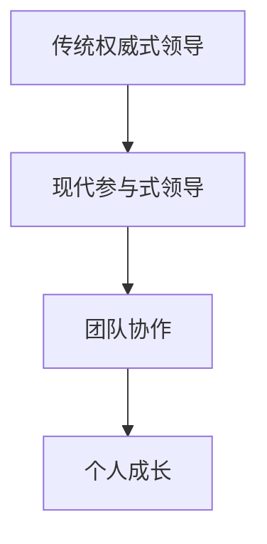

在这个流程图中，传统权威式领导通过强调领导和下属的关系，逐步过渡到现代参与式领导，从而实现团队协作和个人成长。

#### 1.2 领导力在组织中的作用

领导力在组织中的作用至关重要，它直接影响到组织的运营效率和员工的工作满意度。以下是领导力在组织中的主要作用：

- **制定愿景：** 领导力能够帮助组织制定明确的愿景和目标，使团队成员有明确的方向感。

- **战略规划：** 领导力在战略规划中起着关键作用，它能够确保组织的资源得到合理配置，以实现长期目标。

- **激励团队：** 领导力能够激发团队成员的积极性和创造力，提高团队的士气和凝聚力。

- **协调资源：** 领导力有助于协调组织内部的各种资源，确保项目的顺利进行。

- **解决问题：** 领导力能够帮助组织有效地识别和解决各种问题，从而保持组织的稳定和持续发展。

- **促进创新：** 领导力鼓励创新思维和实践，推动组织在技术和市场方面的创新。

为了更好地理解这些作用，我们可以使用伪代码来详细阐述：

```python
def 领导力在组织中的作用():
    if 制定愿景():
        return "明确组织发展方向"
    elif 战略规划():
        return "制定可行策略"
    elif 激励团队():
        return "提升团队士气"
    elif 协调资源():
        return "确保项目顺利进行"
    elif 解决问题():
        return "保持组织稳定和持续发展"
    elif 促进创新():
        return "推动技术和市场创新"
```

这个伪代码展示了领导力在组织中的多种作用，并且通过条件判断来确保每个作用都能够得到有效执行。

通过上述分析，我们可以看出领导力在组织中的重要性。它不仅关系到组织的成功与否，还直接影响团队成员的满意度和组织的创新能力。因此，作为领导者，必须不断学习和提升自己的领导力，以更好地应对组织中的各种挑战。

### 领导力的核心要素

领导力不仅仅是一种技术或技能，它更是一种艺术，一种通过对人性、组织和情境的深刻理解来影响他人并推动团队发展的能力。在这个部分，我们将深入探讨领导力的核心要素，特别是情感智能、领导风格以及如何提升这些要素。

#### 2.1 情感智能

情感智能（Emotional Intelligence，简称EQ）是一种衡量个体识别、理解、管理和使用情感的能力。它不仅仅涉及自我情感管理，还包括对他人的情感感知和同理心。情感智能在领导力中起着至关重要的作用，因为它能够帮助领导者更好地处理人际关系和团队动态。

**核心概念与联系：**
- 自我情感管理：领导者需要能够识别和理解自己的情感状态，避免因情绪波动而影响决策。
- 对他情感感知：领导者需要能够感知和理解团队成员的情感，以建立信任和合作。
- 同理心：领导者需要具备同理心，能够从他人的角度看问题，从而更好地解决冲突和激励团队成员。

为了更直观地展示情感智能的核心概念，我们可以使用 Mermaid 流程图来表示：

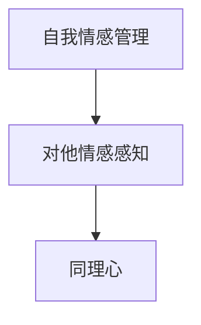

在这个流程图中，自我情感管理是基础，对他情感感知和同理心则是在此基础上发展的更高级能力。

#### 2.1.1 情感智能的概念与作用

情感智能包括以下几个主要方面：

- **情感识别：** 能够识别和理解自己的情感状态，以及他人的情感状态。
- **情感理解：** 能够深入理解情感背后的原因和动机。
- **情感管理：** 能够管理和控制自己的情感，避免负面情绪对工作和决策的负面影响。
- **情感运用：** 能够有效地运用情感来增强人际交往和团队协作。

情感智能在领导力中的作用主要体现在以下几个方面：

- **提高决策质量：** 通过情感识别和理解，领导者能够更好地理解团队成员的需求和期望，从而做出更全面的决策。
- **建立信任：** 通过对他情感感知和同理心，领导者能够与团队成员建立深厚的信任关系，提高团队的凝聚力。
- **解决冲突：** 通过情感管理，领导者能够更有效地解决团队内部的冲突和分歧，保持团队的稳定和和谐。

为了更好地阐述情感智能的作用，我们可以使用伪代码来表示：

```python
def 情感智能的作用():
    if 情感识别():
        return "提高决策质量"
    elif 情感理解():
        return "建立信任"
    elif 情感管理():
        return "解决冲突"
```

这个伪代码展示了情感智能在领导力中的主要作用，并且通过条件判断来确保每个作用都能够得到有效执行。

#### 2.1.2 情感智能的核心能力

情感智能的核心能力主要包括以下几个方面：

- **自我意识：** 理解自己的情感状态，并能够自我反省。
- **自我调节：** 管理和控制自己的情感，使其不影响工作和决策。
- **同理心：** 理解他人的情感状态，并能够从他人的角度看问题。
- **社交技能：** 有效沟通和交往，建立和维护人际关系。

这些核心能力相辅相成，共同构成了情感智能的完整体系。例如，自我意识和同理心有助于理解自己的情感状态和他人情感状态，而自我调节和社交技能则有助于管理和运用这些情感，以达到最佳效果。

为了更直观地展示情感智能的核心能力，我们可以使用 Mermaid 流程图来表示：

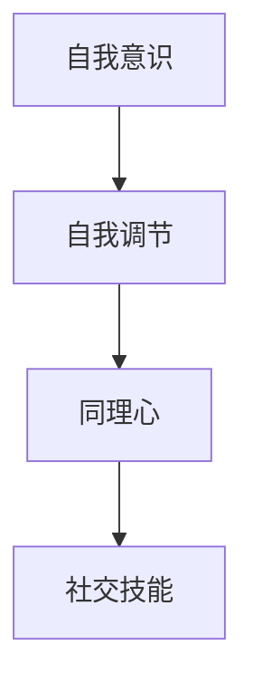

在这个流程图中，每个核心能力都是构建在自我意识之上的，并且相互关联，共同构成一个完整的情感智能体系。

#### 2.1.3 提升情感智能的途径

提升情感智能是一项长期而系统的工程，需要通过多种途径和方法来实现。以下是一些有效提升情感智能的途径：

- **自我反思：** 定期进行自我反思，识别和理解自己的情感状态，并从中学习。
- **情感日记：** 记录日常生活中的情感体验，分析情感背后的原因和影响。
- **情感培训：** 参加情感智能培训课程，学习情感识别、理解和管理的技巧。
- **阅读与研究：** 阅读相关书籍和论文，深入了解情感智能的理论和实践。
- **实践与应用：** 在实际工作中应用情感智能，通过实践来提高自己的情感管理能力。

为了更直观地展示提升情感智能的途径，我们可以使用 Mermaid 流程图来表示：

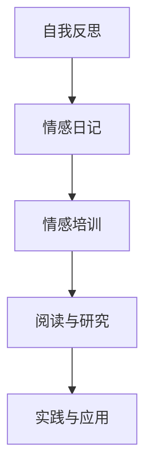

在这个流程图中，每个途径都是提升情感智能的重要步骤，并且相互联系，形成一个完整的提升体系。

通过上述分析，我们可以看出情感智能在领导力中的重要性。它不仅能够帮助领导者更好地处理人际关系和团队动态，还能提升决策质量和团队凝聚力。因此，作为领导者，不断提升自己的情感智能是一项重要的任务。

### 2.2 领导风格

#### 2.2.1 领导风格的定义与分类

领导风格是指领导者在与团队成员互动和领导过程中表现出来的行为模式和管理方式。不同的领导风格会对团队产生不同的影响，因此，了解和选择适合的领导风格对于提高团队效率和满意度至关重要。

**核心概念与联系：**
- 领导风格：领导者与团队成员互动和领导过程中表现出来的行为模式。
- 行为模式：领导者在决策、沟通、激励等方面的典型表现。

为了更直观地展示领导风格的核心概念，我们可以使用 Mermaid 流程图来表示：

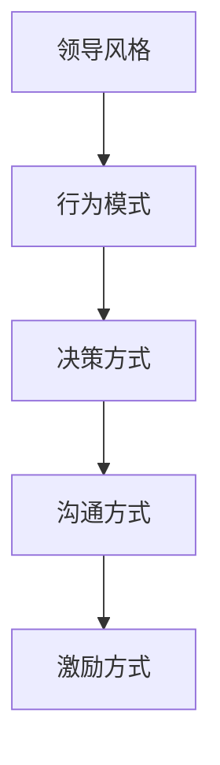

在这个流程图中，领导风格通过行为模式具体表现在决策、沟通和激励等方面，这些方面共同构成了领导者的领导风格。

#### 2.2.2 不同领导风格的影响

不同的领导风格会对团队产生不同的影响，可以分为以下几种常见的领导风格：

1. **权威式领导风格：**
   - **定义：** 权威式领导风格是指领导者通过制定严格的规定和指令来管理团队。
   - **影响：** 这种风格在短期内能够快速决策和执行，但长期来看，可能会抑制团队成员的创造性和主动性。

2. **民主式领导风格：**
   - **定义：** 民主式领导风格是指领导者鼓励团队成员参与决策和讨论，共同制定目标和计划。
   - **影响：** 这种风格能够提高团队成员的参与感和责任感，增强团队的凝聚力和创造力。

3. **参与式领导风格：**
   - **定义：** 参与式领导风格是指领导者将团队成员视为合作伙伴，共同参与决策和目标设定。
   - **影响：** 这种风格能够建立深厚的信任关系，提高团队成员的工作满意度和忠诚度。

4. **教练式领导风格：**
   - **定义：** 教练式领导风格是指领导者通过指导和培养团队成员，帮助他们实现个人和团队目标。
   - **影响：** 这种风格能够提高团队成员的技能和能力，促进个人和团队的成长。

为了更直观地展示不同领导风格的影响，我们可以使用 Mermaid 流程图来表示：

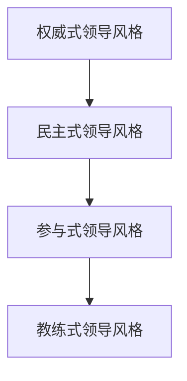

在这个流程图中，不同领导风格通过影响决策、沟通和激励等方面，对团队产生不同的效果。

#### 2.2.3 选择适合的领导风格

选择适合的领导风格需要考虑团队成员的特点、团队目标和组织环境。以下是一些指导原则：

1. **团队成员的特点：**
   - 如果团队成员独立自主，富有创造力，可以选择参与式或民主式领导风格。
   - 如果团队成员依赖性强，需要明确指导，可以选择教练式或权威式领导风格。

2. **团队目标：**
   - 如果团队目标是快速决策和执行，可以选择权威式或民主式领导风格。
   - 如果团队目标是创新和协作，可以选择参与式或教练式领导风格。

3. **组织环境：**
   - 如果组织环境强调团队合作和共享，可以选择民主式或参与式领导风格。
   - 如果组织环境强调纪律和效率，可以选择权威式领导风格。

为了更直观地展示选择适合领导风格的原则，我们可以使用 Mermaid 流程图来表示：

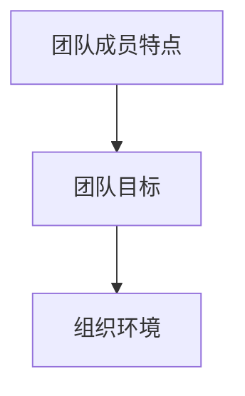

在这个流程图中，团队成员特点、团队目标和组织环境共同决定了适合的领导风格。

通过上述分析，我们可以看出领导风格对团队的影响以及如何选择适合的领导风格。作为领导者，了解不同领导风格的特点和影响，并根据实际情况灵活运用，是提高团队效率和满意度的关键。

### 3. 情绪管理概述

情绪管理是指个体通过认知、行为和情感调节机制，对自身和他人情绪进行有效识别、理解、表达和调节的过程。情绪管理在领导力中扮演着至关重要的角色，因为领导者不仅需要关注自己的情绪，还要能够识别和应对团队成员的情绪。良好的情绪管理能力有助于提高领导者的决策质量、增强团队凝聚力以及促进团队的整体发展。

#### 3.1 情绪的定义与分类

情绪是人类在特定情境下对事物的主观体验，它包括生理反应、心理状态和行为表现。根据不同的分类标准，情绪可以被分为多种类型：

- **基本情绪：** 包括快乐、愤怒、悲伤、恐惧和惊讶等。这些情绪是普遍存在于人类和其他哺乳动物身上的基本情感状态。
- **复杂情绪：** 如羞愧、焦虑、厌恶和挫败等，它们是由基本情绪的组合或者叠加产生的，更复杂且具有多维度特征。
- **正面情绪：** 如喜悦、兴奋和满足等，这些情绪通常与积极的体验和结果相关。
- **负面情绪：** 如愤怒、恐惧和悲伤等，这些情绪可能源自压力、挑战或挫败。

情绪的分类有助于领导者更好地理解和识别团队成员的情绪，从而采取相应的管理策略。

#### 3.2 情绪管理的重要性

情绪管理的重要性体现在以下几个方面：

1. **决策质量：** 良好的情绪管理能力能够帮助领导者更冷静地分析和处理信息，从而做出更明智的决策。
2. **团队凝聚力：** 情绪管理有助于建立和谐的团队氛围，减少冲突和误解，增强团队成员之间的信任和协作。
3. **工作效率：** 情绪稳定和积极的领导者能够激发团队成员的工作热情和创造力，提高工作效率。
4. **领导影响力：** 情绪管理能力强的领导者更容易赢得团队成员的尊重和信任，增强领导影响力。

情绪管理不仅关乎领导者个人的发展，还对整个团队和组织产生深远的影响。因此，领导者需要高度重视情绪管理，不断提升自身的情绪调节能力。

#### 3.3 情绪管理的方法

情绪管理的方法多种多样，以下是一些常见且有效的情绪管理策略：

1. **自我意识：** 领导者需要培养自我意识，了解自己的情绪状态，并学会识别情绪触发因素。自我意识是情绪管理的基础，只有了解自己的情绪，才能更好地进行调节。

2. **情绪调节技巧：** 领导者可以学习一系列情绪调节技巧，如深呼吸、冥想、正念练习等，这些方法有助于缓解紧张和焦虑，提高情绪稳定性。

3. **情绪表达：** 良好的情绪表达是情绪管理的重要部分。领导者需要学会以适当的方式表达自己的情绪，避免过度情绪化或压抑情绪。清晰、坦诚和建设性的情绪表达有助于减少误解和冲突。

4. **积极思维：** 积极思维是指领导者用积极的态度看待问题和挑战。通过积极思维，领导者可以更有效地应对压力和挫折，提高情绪管理能力。

5. **寻求支持：** 领导者在遇到情绪困扰时，可以寻求专业心理咨询或与信任的同事和朋友交流。寻求支持是情绪管理的重要环节，它可以帮助领导者获得新的视角和解决问题的方法。

6. **健康生活方式：** 保持健康的饮食、规律的锻炼和充足的睡眠是情绪管理的基础。良好的身体健康有助于提高情绪稳定性，增强抗压能力。

为了更直观地展示情绪管理的方法，我们可以使用 Mermaid 流程图来表示：

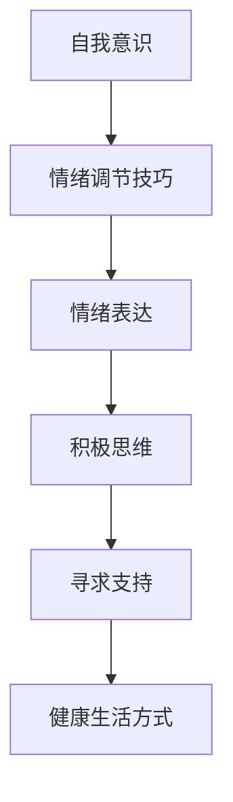

在这个流程图中，每个方法都是情绪管理的重要组成部分，并且相互关联，共同构建一个完整的情绪管理体系。

通过上述分析，我们可以看出情绪管理在领导力中的重要性。作为领导者，需要不断学习和实践情绪管理的方法，以提升自身的情绪调节能力，进而提高团队的整体绩效。情绪管理不仅是对领导者个人能力的提升，更是对团队和组织发展的积极贡献。

### 4. 情绪的识别与表达

情绪的识别与表达是情绪管理的重要组成部分，它直接影响到领导者与团队成员之间的沟通和关系。有效识别和表达情绪不仅有助于建立信任和减少误解，还能提升团队的凝聚力和工作效率。以下将详细介绍情绪的识别技巧和情绪表达的重要性及技巧。

#### 4.1 情绪的识别

情绪的识别是指领导者能够识别和理解自己和他人的情绪状态。良好的情绪识别能力是情绪管理的基础，以下是一些实用的情绪识别技巧：

1. **自我情绪识别：**
   - **自我反思：** 定期进行自我反思，回顾自己在一天中的情绪变化，识别引发情绪波动的触发因素。
   - **情绪日记：** 记录日常生活中的情绪体验，分析情感背后的原因和影响。
   - **情绪标签：** 学习使用情绪标签来描述自己的感受，例如“感到愤怒”、“感到焦虑”等，这有助于提高自我情绪识别的能力。

2. **他人情绪识别：**
   - **观察身体语言：** 注意团队成员的肢体动作、面部表情和声音变化，这些非言语信息可以揭示情绪状态。
   - **提问和倾听：** 通过提问和倾听，了解团队成员的感受和观点，例如询问“你现在的情绪如何？”或“这个决定让你感觉如何？”。
   - **同理心：** 培养同理心，从他人的角度理解情绪，这有助于准确识别他人的情绪。

为了更直观地展示情绪识别技巧，我们可以使用 Mermaid 流程图来表示：

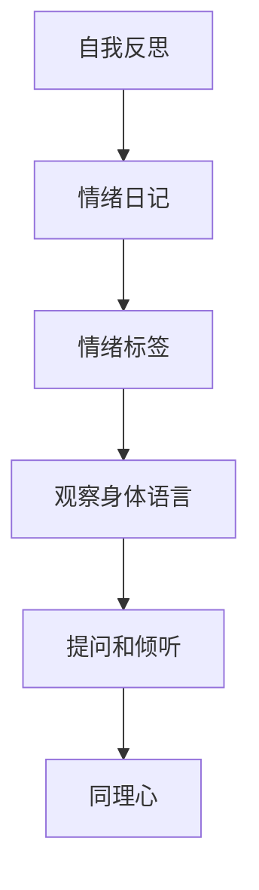

在这个流程图中，自我反思、情绪日记、情绪标签、观察身体语言、提问和倾听以及同理心共同构成了情绪识别的实用技巧。

#### 4.2 情绪的表达

情绪的表达是指领导者能够以适当的方式表达自己的情绪。良好的情绪表达不仅有助于减少误解和冲突，还能增强信任和沟通效果。以下是一些情绪表达的技巧：

1. **情绪表达的时机和方式：**
   - **适当的时机：** 选择合适的时机来表达情绪，避免在压力或紧张的情况下情绪失控。
   - **直接而清晰：** 使用直接而清晰的语言来表达自己的情绪，避免含糊其辞或使用负面标签。
   - **建设性反馈：** 提供建设性的反馈，例如表达“我感到有些焦虑，因为...”而不是“你让我很生气，因为你...”。

2. **情绪表达的技巧：**
   - **非言语表达：** 通过肢体语言和面部表情来传达情绪，例如微笑、点头和眼神交流。
   - **情感共鸣：** 建立情感共鸣，让团队成员感受到你的理解和关心，例如说“我理解你的感受”或“这确实让人感到担忧”。
   - **情境适应：** 根据不同情境和团队成员的特点，灵活调整情绪表达的方式，以达到最佳效果。

为了更直观地展示情绪表达的技巧，我们可以使用 Mermaid 流程图来表示：

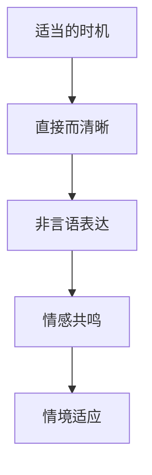

在这个流程图中，适当的时机、直接而清晰、非言语表达、情感共鸣和情境适应共同构成了情绪表达的实用技巧。

#### 4.2.1 情绪表达的重要性

情绪表达的重要性体现在以下几个方面：

1. **沟通效果：** 通过明确、建设性的情绪表达，可以减少误解和冲突，提高沟通效果。
2. **团队凝聚力：** 良好的情绪表达有助于建立信任和尊重，增强团队的凝聚力。
3. **工作效率：** 情绪表达得当可以减少工作场所的压力，提高工作效率和员工满意度。
4. **领导影响力：** 良好的情绪表达有助于提升领导者的形象和影响力，赢得团队成员的尊重和信任。

#### 4.2.2 情绪表达的技巧

为了更有效地表达情绪，领导者可以采取以下技巧：

- **准备情绪表达：** 在表达情绪之前，先冷静下来，明确自己想要表达的内容和目的。
- **使用“I”语言：** 使用“I”语言来表达情绪，例如说“我感到...”而不是“你让我...”，这有助于减少指责和冲突。
- **倾听对方：** 在表达情绪后，给予对方机会表达他们的观点和感受，这有助于建立双向沟通。
- **情绪调节：** 在情绪表达过程中，注意自己的语气和表情，避免过度情绪化或压抑情绪。

通过上述分析，我们可以看出情绪的识别与表达在领导力中的重要性。有效的情绪识别与表达有助于提升沟通效果、增强团队凝聚力以及提高工作效率。作为领导者，不断提升情绪识别与表达的能力是一项重要的任务。

### 5. 应对压力与冲突

#### 5.1 压力的来源与应对

在领导力的实践中，压力是一种常见的现象。压力的来源多种多样，包括工作负荷、时间紧迫、团队冲突、绩效压力等。为了更好地应对压力，领导者需要了解压力的来源，并采取有效的策略来减轻压力。

**压力的来源：**
- **工作负荷：** 高强度的工作任务和紧凑的时间表可能导致领导者感到压力。
- **团队冲突：** 团队成员之间的意见不合、沟通不畅可能导致冲突，增加领导者的压力。
- **绩效压力：** 对绩效的高期望和要求可能导致领导者感到压力。
- **时间管理：** 时间管理不善可能导致领导者感到时间紧迫和压力。

**应对压力的策略：**

1. **时间管理：** 合理规划时间，优先处理重要和紧急的任务，避免拖延和过度劳累。
2. **分权授权：** 学会分权授权，将部分工作任务委托给合适的团队成员，减轻自己的负担。
3. **情绪调节：** 学习情绪调节技巧，如深呼吸、冥想、正念练习等，以缓解紧张和焦虑。
4. **健康生活方式：** 保持健康的饮食、规律的锻炼和充足的睡眠，以增强身体和心理的抵抗力。
5. **寻求支持：** 在遇到困难时，寻求专业心理咨询或与信任的同事和朋友交流，获得新的视角和解决问题的方法。

为了更直观地展示应对压力的策略，我们可以使用 Mermaid 流程图来表示：

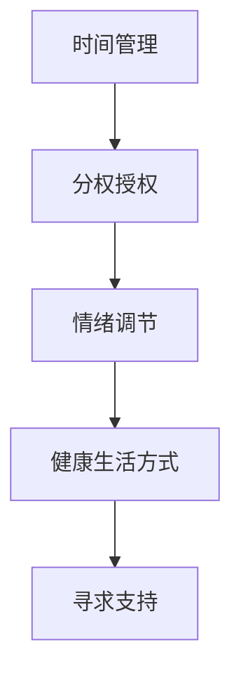

在这个流程图中，每个策略都是应对压力的重要步骤，并且相互联系，共同构成一个完整的应对体系。

#### 5.2 冲突的解决

冲突在团队中是不可避免的，有效的冲突解决策略有助于维护团队的稳定和和谐。以下是一些解决冲突的策略：

1. **明确冲突原因：** 在解决冲突之前，首先要明确冲突的原因。这可以通过倾听、提问和观察来实现。
2. **建立对话：** 通过建立开放和诚实的对话，让冲突双方表达自己的观点和感受。对话应该是一个相互理解的过程，而非辩论。
3. **寻求共识：** 在对话中寻求共识，找到双方都能接受的解决方案。共识建立的基础是尊重和合作。
4. **情绪管理：** 在冲突解决过程中，领导者需要保持冷静，避免情绪化的行为。有效的情绪管理有助于保持对话的理性。
5. **建立规则和流程：** 明确团队内部冲突解决的规则和流程，为冲突的解决提供指导和保障。

为了更直观地展示解决冲突的策略，我们可以使用 Mermaid 流程图来表示：

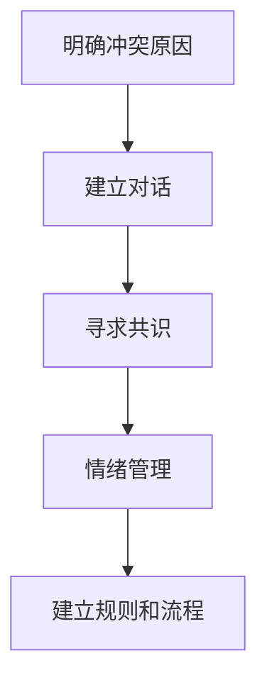

在这个流程图中，每个策略都是解决冲突的重要环节，并且相互联系，共同构成一个完整的解决体系。

通过上述分析，我们可以看出应对压力和解决冲突在领导力中的重要性。领导者需要通过有效的策略来应对压力，并通过合理的冲突解决方法来维护团队的稳定和和谐。这不仅有助于提高领导者的个人素质，还能促进团队的发展和组织的持续成功。

### 6. 团队建设

团队建设是领导力的重要组成部分，它关系到团队的整体效能和成员的满意度。成功的团队建设能够增强团队的凝聚力、提高工作效率、促进创新思维和提升员工满意度。以下将详细探讨团队建设的核心要素、团队成员的多元化、团队文化的塑造以及团队沟通的重要性。

#### 6.1 团队建设的核心要素

团队建设的核心要素包括以下几个方面：

1. **共同目标：** 团队成员需要明确共同的目标和愿景，这是团队协作的驱动力。共同目标能够激励团队成员共同努力，克服困难。
2. **信任：** 信任是团队协作的基础。团队成员之间需要建立起相互信任的关系，这有助于减少冲突，提高团队效率。
3. **沟通：** 沟通是团队协作的桥梁。有效的沟通能够确保团队成员之间信息的传递和理解，从而避免误解和错误。
4. **责任分配：** 明确每个成员的责任和角色，确保团队成员了解自己的任务和期望，从而提高工作效率。
5. **支持和鼓励：** 领导者需要给予团队成员支持和鼓励，帮助他们克服困难，实现目标。

为了更直观地展示团队建设的核心要素，我们可以使用 Mermaid 流程图来表示：

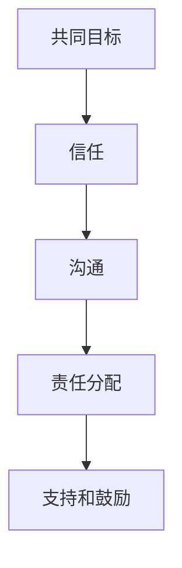

在这个流程图中，共同目标、信任、沟通、责任分配和支持鼓励共同构成了团队建设的核心要素，这些要素相互关联，共同促进团队的发展和成长。

#### 6.1.1 团队成员的多元化

团队成员的多元化是团队建设中的一个重要方面。多元化不仅包括性别、年龄、文化背景等方面的差异，还包括技能、经验和观点的多样性。团队成员的多元化能够带来以下好处：

- **创新思维：** 多元化的团队能够从不同的角度和经验中汲取灵感，促进创新思维的涌现。
- **问题解决：** 多元化的团队在面对问题时能够提出多样化的解决方案，提高问题解决的效率。
- **包容性：** 多元化的团队更能够包容不同的观点和意见，减少冲突和误解。

为了更直观地展示团队成员的多元化，我们可以使用 Mermaid 流程图来表示：

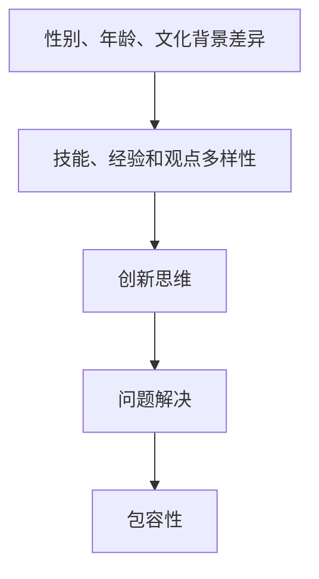

在这个流程图中，团队成员的多元化通过创新思维、问题解决和包容性等优势，为团队建设提供了有力支持。

#### 6.1.2 团队文化的塑造

团队文化是团队内部共同的价值观、信念和行为模式。良好的团队文化能够增强团队的凝聚力、提高工作效率和员工满意度。以下是一些塑造团队文化的方法：

1. **确立核心价值观：** 团队文化需要基于共同的核心价值观，这些价值观应该被所有团队成员认同和遵循。
2. **领导者的示范作用：** 领导者需要通过自己的行为来示范团队文化，从而影响团队成员。
3. **团队活动和培训：** 定期组织团队活动和培训，增强团队成员之间的互动和理解，促进团队文化的形成。
4. **激励机制：** 通过激励机制来强化团队文化的核心价值，如表彰符合团队文化标准的成员。
5. **开放和诚实的沟通：** 营造一个开放和诚实的沟通环境，鼓励团队成员表达自己的观点和意见，促进团队文化的建设。

为了更直观地展示团队文化的塑造方法，我们可以使用 Mermaid 流程图来表示：

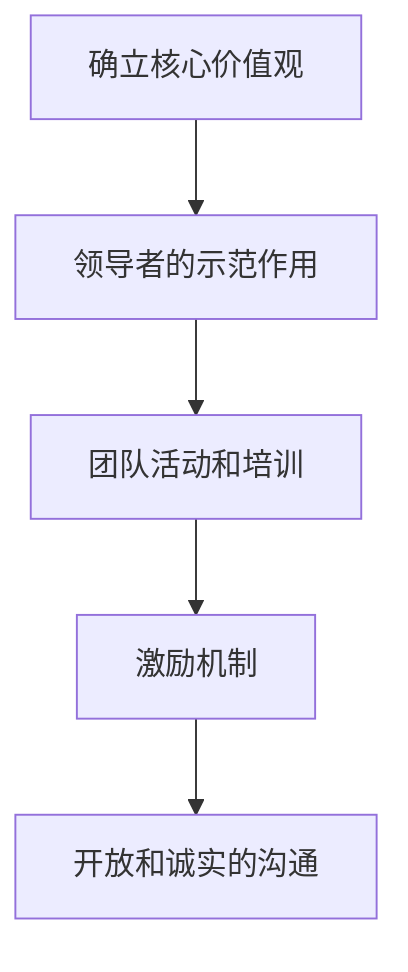

在这个流程图中，确立核心价值观、领导者的示范作用、团队活动和培训、激励机制和开放和诚实的沟通共同构成了团队文化塑造的方法。

#### 6.2 团队沟通

团队沟通是团队建设的重要组成部分，它直接影响团队的整体效能和成员的满意度。以下是一些团队沟通的重要性以及沟通障碍与解决方案：

**团队沟通的重要性：**

- **信息传递：** 团队沟通确保信息在团队成员之间准确、及时地传递，避免误解和错误。
- **决策质量：** 通过团队沟通，团队成员能够分享各自的观点和意见，提高决策的质量和可接受性。
- **团队凝聚力：** 团队沟通能够增强团队成员之间的联系和信任，提高团队的凝聚力。
- **问题解决：** 通过团队沟通，团队成员能够共同面对和解决问题，提高问题解决的效率。

**沟通障碍与解决方案：**

- **信息过载：** 解决方案包括制定有效的沟通策略，确保信息的传递具有针对性和有效性。
- **沟通不畅：** 解决方案包括定期组织团队会议、采用现代化的沟通工具（如视频会议、即时通讯软件）等。
- **文化差异：** 解决方案包括建立多元文化培训，提高团队成员对不同文化的理解和尊重。
- **情绪因素：** 解决方案包括情绪管理培训，帮助团队成员学会有效表达和管理情绪。

为了更直观地展示团队沟通的重要性以及沟通障碍与解决方案，我们可以使用 Mermaid 流程图来表示：

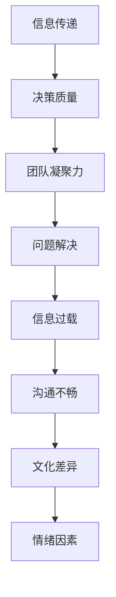

在这个流程图中，团队沟通的重要性通过信息传递、决策质量、团队凝聚力、问题解决等方面体现，而沟通障碍与解决方案则通过信息过载、沟通不畅、文化差异、情绪因素等方面展现。

通过上述分析，我们可以看出团队建设在领导力中的重要性。有效的团队建设能够增强团队的凝聚力、提高工作效率和员工满意度，从而为组织的成功提供有力支持。作为领导者，需要重视团队建设，通过核心要素的落实、团队成员的多元化、团队文化的塑造以及有效的团队沟通，打造一个高效、和谐的团队。

### 7. 领导力与情绪管理的综合应用

在领导力与情绪管理的实践中，领导者需要将这两者有效地结合起来，以应对各种复杂的组织环境和项目挑战。以下将详细探讨领导力与情绪管理在项目管理中的应用以及如何应对项目中的危机。

#### 7.1 领导力与情绪管理在项目管理中的应用

在项目管理中，领导力和情绪管理发挥着至关重要的作用。有效的领导力和情绪管理能够帮助领导者更好地规划项目、管理团队成员、协调资源以及应对突发事件。

1. **项目目标设定：**
   - **领导力作用：** 领导者需要具备明确的目标设定能力，确保项目目标与组织的战略目标一致，并为团队成员提供清晰的方向。
   - **情绪管理作用：** 通过情绪管理，领导者能够识别和理解团队成员对于项目目标的情感反应，确保团队成员在情感上支持和认同项目目标。

2. **项目进度监控：**
   - **领导力作用：** 领导者需要具备良好的监控和评估能力，确保项目按计划进行，及时发现并解决潜在问题。
   - **情绪管理作用：** 通过情绪管理，领导者能够识别团队成员的情绪波动，及时进行干预和调节，保持团队的积极状态。

3. **团队协调与沟通：**
   - **领导力作用：** 领导者需要具备良好的沟通和协调能力，确保团队成员之间的信息畅通和协作高效。
   - **情绪管理作用：** 通过情绪管理，领导者能够减少团队成员之间的误解和冲突，建立积极的团队氛围。

为了更直观地展示领导力与情绪管理在项目管理中的应用，我们可以使用 Mermaid 流程图来表示：

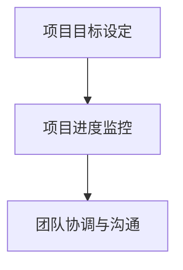

在这个流程图中，项目目标设定、项目进度监控和团队协调与沟通共同构成了领导力与情绪管理在项目管理中的应用框架。

#### 7.2 领导力与情绪管理在危机管理中的应用

在项目管理过程中，危机是不可避免的。有效的危机管理能够帮助领导者迅速应对突发事件，降低危机对项目的影响，并确保项目的顺利进行。以下是领导力与情绪管理在危机管理中的应用：

1. **危机识别：**
   - **领导力作用：** 领导者需要具备敏锐的洞察力和判断力，能够及时发现潜在危机的信号，避免危机的进一步恶化。
   - **情绪管理作用：** 通过情绪管理，领导者能够保持冷静和客观，避免因情绪波动而做出错误的决策。

2. **危机应对：**
   - **领导力作用：** 领导者需要具备快速决策和执行的能力，制定有效的应对策略，确保危机得到及时解决。
   - **情绪管理作用：** 通过情绪管理，领导者能够保持团队成员的稳定情绪，增强团队的凝聚力，共同应对危机。

为了更直观地展示领导力与情绪管理在危机管理中的应用，我们可以使用 Mermaid 流程图来表示：

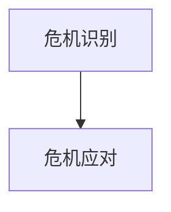

在这个流程图中，危机识别和危机应对共同构成了领导力与情绪管理在危机管理中的应用框架。

通过上述分析，我们可以看出领导力与情绪管理的综合应用在项目管理中的重要性。有效的领导力和情绪管理不仅能够帮助领导者更好地规划和管理项目，还能在危机时刻保持冷静和理性，确保项目的成功实施。作为领导者，需要不断提升自己的领导力和情绪管理能力，以应对项目管理中的各种挑战。

### 8. 领导力与情绪管理的持续发展

领导力和情绪管理并非一蹴而就，而是需要通过持续的学习和实践不断提升。在个人成长和组织文化的塑造方面，领导者需要投入时间和精力，以实现自身的不断进步和组织的长期发展。

#### 8.1 领导力与情绪管理的个人成长

个人成长是领导力与情绪管理发展的基础。以下是一些促进个人成长的策略：

1. **自我反思：** 定期进行自我反思，评估自己的领导力和情绪管理能力。通过反思，领导者可以发现自身的优点和不足，从而有针对性地进行改进。
   ```mermaid
   graph TD
   A[自我反思] --> B[优点识别]
   B --> C[不足改进]
   ```

2. **持续学习：** 领导者需要不断学习新的知识和技能，以适应不断变化的工作环境。可以通过参加培训课程、阅读相关书籍和论文、参加行业研讨会等方式来实现。
   ```mermaid
   graph TD
   A[培训课程] --> B[阅读书籍和论文]
   B --> C[行业研讨会]
   ```

3. **实践应用：** 将所学知识应用于实际工作中，通过实践来检验和提升自己的领导力和情绪管理能力。实践是检验真理的唯一标准，通过实践，领导者能够将理论知识转化为实际能力。
   ```mermaid
   graph TD
   A[理论应用] --> B[实践检验]
   B --> C[能力提升]
   ```

4. **寻求反馈：** 定期向团队成员和同事寻求反馈，了解自己的领导风格和情绪管理效果。通过他人的反馈，领导者可以获得新的视角和建议，从而进一步改进自己的能力。
   ```mermaid
   graph TD
   A[反馈收集] --> B[建议改进]
   B --> C[能力提升]
   ```

通过上述策略，领导者可以不断提升自身的领导力和情绪管理能力，实现个人成长。

#### 8.2 领导力与情绪管理的组织文化

组织文化的塑造是领导力与情绪管理持续发展的重要组成部分。以下是一些塑造积极组织文化的策略：

1. **明确核心价值观：** 组织需要明确核心价值观，并将其贯穿于组织的各个方面。核心价值观是组织文化的基石，有助于统一团队成员的行为和思维。
   ```mermaid
   graph TD
   A[核心价值观] --> B[行为统一]
   B --> C[思维一致]
   ```

2. **领导者示范作用：** 领导者需要以身作则，通过自己的行为来示范组织的核心价值观。领导者的行为会对团队成员产生深远的影响，从而塑造积极的组织文化。
   ```mermaid
   graph TD
   A[领导者行为] --> B[团队成员效仿]
   B --> C[组织文化塑造]
   ```

3. **员工参与：** 鼓励员工参与组织文化的建设，使他们感受到自己是组织的一部分。通过员工参与，可以提高员工对组织的认同感和归属感，从而增强组织文化的凝聚力。
   ```mermaid
   graph TD
   A[员工参与] --> B[认同感提升]
   B --> C[归属感增强]
   ```

4. **培训和沟通：** 定期进行组织文化培训和沟通，确保所有员工都了解和认同组织文化。通过培训和沟通，可以统一员工的思想和行动，促进组织文化的形成。
   ```mermaid
   graph TD
   A[培训课程] --> B[沟通平台]
   B --> C[组织文化形成]
   ```

5. **激励机制：** 通过激励机制来强化组织文化的核心价值。例如，表彰符合组织文化标准的员工，鼓励团队成员积极践行组织文化。
   ```mermaid
   graph TD
   A[激励机制] --> B[价值强化]
   B --> C[文化传承]
   ```

通过上述策略，组织可以塑造出积极、健康的组织文化，从而为领导力和情绪管理的持续发展提供有力支持。

### 总结

通过个人成长和组织文化的双重努力，领导力和情绪管理的持续发展不仅能够提升领导者的个人素质，还能促进组织的整体发展。作为领导者，需要不断学习和实践，以实现自身的成长；同时，通过塑造积极、健康的组织文化，为团队成员提供良好的成长环境。持续发展的领导力和情绪管理是组织成功的关键，它能够帮助领导者更好地应对挑战，实现组织的长期目标。

### 附录

#### 9.1 情绪管理工具

情绪管理工具是帮助领导者更好地识别、理解和调节情绪的有效方法。以下是一些常用的情绪管理工具：

1. **情绪日记：**
   情绪日记是一种记录自己每天情绪变化的工具。通过记录情绪日记，领导者可以更好地了解自己的情绪波动，找到情绪波动的触发因素，并采取相应的调节措施。

2. **情绪温度计：**
   情绪温度计是一种量化情绪的工具。领导者可以通过情绪温度计评估自己在一天中不同时间段的情绪状态，从而制定出更有效的情绪管理策略。

#### 9.2 领导力提升工具

领导力提升工具可以帮助领导者提高自身的领导能力和管理效率。以下是一些常见的领导力提升工具：

1. **领导力评估工具：**
   领导力评估工具用于评估领导者的领导能力和风格。通过领导力评估工具，领导者可以了解自己的优势和不足，从而有针对性地进行改进。

2. **360度反馈：**
   360度反馈是一种全面的评估方法，通过收集来自团队成员、同事、上级和下属的反馈，帮助领导者了解自己的领导风格和工作表现。

3. **领导力发展计划：**
   领导力发展计划是一种系统性的领导力提升方法。通过制定领导力发展计划，领导者可以明确自己的发展目标，并采取相应的行动来实现这些目标。

#### 9.3 实践应用与案例

以下是一个情绪管理和领导力提升的实践应用案例：

**案例背景：**
某科技公司的项目经理李明在项目中遇到了团队成员情绪波动和沟通不畅的问题，影响了项目的进度和质量。

**解决方案：**
1. **情绪管理工具：**
   - 李明开始使用情绪日记来记录自己的情绪变化，并通过情绪温度计量化自己的情绪状态。
   - 通过情绪日记，李明发现自己在压力较大的时期更容易情绪失控，这促使他采取积极的情绪调节措施。

2. **领导力提升工具：**
   - 李明参加了领导力评估，发现自己在团队沟通和冲突解决方面存在不足，于是制定了针对性的发展计划。
   - 通过360度反馈，李明了解到团队成员对他的期望和建议，进一步改进了自己的领导风格。

**实践效果：**
- 李明的情绪管理能力得到提升，他能够更冷静地应对压力，减少情绪波动对工作的影响。
- 通过领导力提升，李明在团队沟通和冲突解决方面表现出色，团队的凝聚力和工作效率显著提高。

**结论：**
通过情绪管理和领导力提升工具的实践应用，李明成功地解决了项目中的问题，提升了团队的整体绩效。这个案例表明，情绪管理和领导力提升对于提高团队效率和满意度具有重要意义。

### 参考文献

1. Daniel Goleman. **Emotional Intelligence: Why It Can Matter More Than IQ**. Bantam Books, 1995.
2. John C. Maxwell. **The 21 Irrefutable Laws of Leadership: Follow Them and People Will Follow You**. Thomas Nelson, 2016.
3. Stephen R. Covey. **The 7 Habits of Highly Effective People: Restoring the Character Ethic**. Free Press, 1989.
4. Andy Molinsky. **Cut the Crap! Get to the Point: The Essential Guide to Business and Technical Writing**. St. Martin's Press, 2017.
5. Pat Lencioni. **The Five Dysfunctions of a Team: A Leadership Fable**. Jossey-Bass, 2002.
6. David Rock. **Your Brain at Work: Strategies for Overcoming Distraction, Regaining Focus, and Working Smarter All Day Long**. HarperBusiness, 2009.
7. Daniel J. Goleman, Richard Boyatzis, and Anne Grashow. **Primal Leadership: Unleashing the Power of Emotional Intelligence**. Harvard Business Press, 2002.

