                 


### 领导力与情绪调节：平衡工作与生活

#### 关键词：领导力、情绪调节、工作与生活平衡、个人成长

#### 摘要：
在现代职场中，领导者不仅要具备卓越的管理能力，还需要具备良好的情绪调节能力，以应对工作中的压力和挑战。本文探讨了领导力与情绪调节之间的关系，以及如何通过情绪调节实现工作与生活的平衡，从而提升个人幸福感和工作效率。本文分为七个章节，从基本概念、理论基础、实际应用、提升策略等方面进行了全面阐述。

### 目录大纲

#### 第1章 领导力与情绪调节的基本概念
- 1.1 领导力概述
- 1.2 情绪调节概述
- 1.3 领导力与情绪调节的联系

#### 第2章 情绪调节的理论基础
- 2.1 情绪调节理论框架
- 2.2 情绪调节的核心要素
- 2.3 情绪调节的科学原理

#### 第3章 领导力与情绪调节的关系
- 3.1 领导力与情绪调节的相互作用
- 3.2 领导力对情绪调节的影响
- 3.3 情绪调节对领导力的影响

#### 第4章 工作与生活的平衡策略
- 4.1 平衡工作与生活的挑战
- 4.2 平衡工作与生活的策略
- 4.3 实现工作与生活平衡的实践

#### 第5章 提升领导力的情绪调节技巧
- 5.1 提升情绪调节能力的领导力技巧
- 5.2 领导力中的情绪管理
- 5.3 如何运用情绪调节技巧

#### 第6章 情绪调节在实际工作中的应用案例
- 6.1 情绪调节在领导力提升中的应用
- 6.2 实际案例解析
- 6.3 情绪调节在职场中的挑战与应对

#### 第7章 个人成长与领导力提升
- 7.1 个人成长与领导力的关系
- 7.2 领导力提升的方法与策略
- 7.3 领导力与个人成长的未来趋势

#### 第8章 结论
- 总结文章的主要观点
- 强调情绪调节在领导力提升中的重要性

### 第1章 领导力与情绪调节的基本概念

#### 1.1 领导力概述

领导力是指领导者通过激发和引导团队成员，实现共同目标的能力。一个成功的领导者需要具备多个方面的素质，包括沟通能力、决策能力、团队协作能力、激励能力等。领导力的核心在于影响力和影响力的大小决定了领导者的成功与否。

领导力的作用主要体现在以下几个方面：

1. **团队凝聚力**：领导者通过激励和引导，增强团队成员之间的信任和协作，形成强大的团队凝聚力。
2. **决策制定**：领导者需要具备良好的决策能力，能够快速分析问题，制定有效的解决方案。
3. **目标实现**：领导者需要明确团队的目标，并制定合理的计划和策略，确保目标的实现。
4. **创新能力**：领导者需要鼓励团队成员创新，推动组织不断发展。

#### 1.2 情绪调节概述

情绪调节是指个体在面临情绪刺激时，通过认知、行为和生理机制来调节情绪状态的过程。情绪调节对个体的身心健康、人际关系、工作表现等方面具有重要影响。

情绪调节的作用主要体现在以下几个方面：

1. **情绪稳定**：通过情绪调节，个体能够保持情绪的稳定性，减少负面情绪的影响。
2. **心理适应**：情绪调节有助于个体更好地适应环境变化，提高心理韧性。
3. **人际关系**：良好的情绪调节能力有助于建立和谐的人际关系，提高社会支持。
4. **工作表现**：情绪调节对个体的工作表现具有重要影响，能够提高工作效率和创造力。

#### 1.3 领导力与情绪调节的联系

领导力与情绪调节之间存在密切的联系。一方面，领导力对情绪调节具有重要影响。领导者通过自身的情绪调节能力，能够影响团队成员的情绪状态，提升团队的士气和凝聚力。另一方面，情绪调节对领导力也具有重要影响。良好的情绪调节能力有助于领导者更好地应对工作压力，提高决策能力和创新能力。

具体来说，领导力与情绪调节之间的联系可以从以下几个方面体现：

1. **情绪识别与表达**：领导者需要具备良好的情绪识别与表达能力，能够准确识别和理解团队成员的情绪状态，并通过有效的沟通表达，引导团队成员的情绪调节。
2. **情绪管理与决策**：领导者需要在决策过程中运用情绪管理技巧，保持冷静和理性，避免情绪波动对决策产生负面影响。
3. **情绪激励与团队建设**：领导者通过情绪激励，激发团队成员的积极性和创造力，促进团队建设。
4. **情绪调节与心理素质**：领导者的情绪调节能力与其心理素质密切相关，良好的情绪调节能力有助于提升领导者的心理素质，提高领导力水平。

### 第2章 情绪调节的理论基础

#### 2.1 情绪调节理论框架

情绪调节理论框架主要包括认知调节理论、行为调节理论、生理调节理论和社会调节理论。

1. **认知调节理论**：认知调节理论认为，情绪的产生和调节取决于个体的认知评价。个体通过改变对事件的认知评价，可以调节情绪反应。例如，通过积极的思维方式和认知重构，可以减轻负面情绪的影响。
2. **行为调节理论**：行为调节理论强调行为在情绪调节中的作用。个体可以通过改变行为模式，如放松训练、运动等，来调节情绪。行为调节理论认为，行为的变化可以直接影响情绪状态。
3. **生理调节理论**：生理调节理论认为，情绪调节与个体的生理状态密切相关。个体可以通过调节生理状态，如深呼吸、放松肌肉等，来调节情绪。生理调节理论强调了身体在情绪调节中的重要性。
4. **社会调节理论**：社会调节理论强调社会支持在情绪调节中的作用。个体可以通过与他人互动、寻求社会支持，来调节情绪。社会调节理论认为，社会支持可以提供情感支持和实际帮助，有助于情绪调节。

#### 2.2 情绪调节的核心要素

情绪调节的核心要素包括情绪识别、情绪表达、情绪调节策略和情绪调节效果。

1. **情绪识别**：情绪识别是指个体能够准确识别和理解自身的情绪状态。良好的情绪识别能力有助于个体更好地理解自己的情绪，从而采取适当的情绪调节策略。
2. **情绪表达**：情绪表达是指个体能够以适当的方式表达自己的情绪。情绪表达包括语言表达和非语言表达，如面部表情、肢体语言等。良好的情绪表达能力有助于建立良好的人际关系，提高情绪调节效果。
3. **情绪调节策略**：情绪调节策略是指个体采取的具体措施来调节情绪。常见的情绪调节策略包括认知重构、行为调节、生理调节和社会调节等。不同的情绪调节策略适用于不同的情绪状态和情境。
4. **情绪调节效果**：情绪调节效果是指情绪调节策略对个体情绪状态的影响。良好的情绪调节效果有助于个体保持情绪稳定，提高心理韧性。

#### 2.3 情绪调节的科学原理

情绪调节的科学原理主要包括情绪反应的调节、情绪信息的加工和情绪行为的调节。

1. **情绪反应的调节**：情绪反应的调节是指个体通过认知、行为和生理机制来调节情绪反应。情绪反应的调节包括情绪抑制、情绪唤起和情绪调节等。例如，通过深呼吸和放松训练，可以降低情绪唤起水平，减轻负面情绪的影响。
2. **情绪信息的加工**：情绪信息的加工是指个体对情绪信息进行识别、评价和处理的过程。情绪信息的加工包括情绪识别、情绪评价和情绪记忆等。例如，通过积极的情绪评价和情绪记忆重构，可以提升情绪信息的积极效应。
3. **情绪行为的调节**：情绪行为的调节是指个体通过改变行为模式来调节情绪。情绪行为的调节包括行为抑制、行为表达和行为调节等。例如，通过运动和社交活动，可以调节情绪行为，提高情绪调节效果。

### 第3章 领导力与情绪调节的关系

#### 3.1 领导力与情绪调节的相互作用

领导力与情绪调节之间存在相互作用，二者相互影响，共同作用于个体的行为和心理状态。

1. **领导力对情绪调节的影响**：领导力通过影响个体的情绪状态和情绪调节策略，进而影响个体的行为和心理状态。领导力强的领导者能够更好地调节自身的情绪，提高情绪调节能力，从而更好地应对工作压力和挑战。
2. **情绪调节对领导力的影响**：情绪调节对领导力具有显著影响。良好的情绪调节能力有助于领导者保持情绪稳定，提高决策能力和创新能力，从而提升领导力水平。

#### 3.2 领导力对情绪调节的影响

领导力对情绪调节的影响主要体现在以下几个方面：

1. **情绪识别与表达**：领导力强的领导者能够更好地识别和理解自身的情绪，以及团队成员的情绪。通过有效的情绪表达，领导者可以引导团队成员进行情绪调节，提高团队的凝聚力和协作能力。
2. **情绪管理与决策**：领导力强的领导者能够通过情绪管理，保持冷静和理性，避免情绪波动对决策产生负面影响。良好的情绪管理有助于领导者制定更合理的决策，提高工作效率和团队绩效。
3. **情绪激励与团队建设**：领导力强的领导者能够通过情绪激励，激发团队成员的积极性和创造力，促进团队建设。通过积极的情绪调节，领导者可以营造良好的团队氛围，提高团队协作效果。

#### 3.3 情绪调节对领导力的影响

情绪调节对领导力的影响主要体现在以下几个方面：

1. **情绪稳定性**：良好的情绪调节能力有助于领导者保持情绪稳定性，减少情绪波动对领导力的负面影响。情绪稳定的领导者能够更好地应对工作压力和挑战，提高领导效能。
2. **决策能力**：情绪调节对决策能力具有重要影响。良好的情绪调节能力有助于领导者保持冷静和理性，避免情绪波动对决策产生负面影响，从而提高决策能力和决策质量。
3. **创新能力**：情绪调节对创新能力具有重要影响。良好的情绪调节能力有助于领导者保持积极的心态，激发创新思维，推动组织发展。

### 第4章 工作与生活的平衡策略

#### 4.1 平衡工作与生活的挑战

在现代职场中，领导者面临着诸多挑战，如工作压力、时间管理、家庭责任等，这些挑战往往导致工作与生活的失衡。

1. **工作压力**：工作压力是导致工作与生活失衡的主要原因之一。领导者在工作中需要应对繁重的工作任务、紧张的进度和复杂的人际关系，这些压力往往导致情绪不稳定，影响生活质量。
2. **时间管理**：时间管理是领导者平衡工作与生活的重要手段。然而，在实际工作中，领导者往往面临时间紧迫、任务繁多的困境，导致工作与生活的时间分配失衡。
3. **家庭责任**：家庭责任是领导者平衡工作与生活的另一大挑战。领导者在家庭中需要承担照顾家人、教育子女等责任，这些责任往往与工作时间发生冲突，影响工作与生活的平衡。

#### 4.2 平衡工作与生活的策略

为了平衡工作与生活，领导者可以采取以下策略：

1. **设定优先级**：领导者需要明确工作与生活的优先级，合理安排时间，确保工作与生活的重要事务得到充分关注。通过设定优先级，领导者可以更好地分配时间，减少工作与生活的冲突。
2. **有效沟通**：领导者需要与团队成员、家人进行有效沟通，明确各自的工作和生活需求，共同寻找平衡点。通过有效沟通，领导者可以争取到更多的理解和支持，减轻工作与生活的压力。
3. **制定计划**：领导者需要制定详细的工作和生活计划，合理分配时间和任务。通过制定计划，领导者可以更好地掌控时间，提高工作效率，为生活预留足够的时间。

#### 4.3 实现工作与生活平衡的实践

以下是一些实现工作与生活平衡的实践方法：

1. **时间管理技巧**：领导者可以通过时间管理技巧，提高工作效率，为生活预留更多时间。例如，制定每日、每周和每月的工作计划，确保工作进度，减少加班时间。
2. **设定工作与生活的界限**：领导者需要明确工作与生活的界限，避免工作侵占生活时间。例如，在工作时间内专心工作，避免处理私人事务；在生活时间内专注陪伴家人，避免工作干扰。
3. **培养健康的生活习惯**：领导者需要培养健康的生活习惯，如定期锻炼、保持充足的睡眠、合理饮食等。健康的生活习惯有助于提高生活质量，减轻工作压力。

### 第5章 提升领导力的情绪调节技巧

#### 5.1 提升情绪调节能力的领导力技巧

领导者提升情绪调节能力的关键在于培养自我意识和情绪管理能力。以下是一些提升情绪调节能力的领导力技巧：

1. **自我意识**：领导者需要具备良好的自我意识，了解自身的情绪状态和情绪反应。通过自我观察和反思，领导者可以识别情绪触发点，调整情绪反应。
2. **情绪管理**：领导者需要学会情绪管理技巧，如深呼吸、放松训练、积极思维等。通过情绪管理技巧，领导者可以缓解压力，保持情绪稳定。
3. **情绪表达**：领导者需要学会情绪表达的技巧，如适当的言语表达和非言语表达。通过情绪表达，领导者可以有效地传达情绪，减少误解和冲突。

#### 5.2 领导力中的情绪管理

情绪管理是领导力的重要组成部分。以下是一些领导力中的情绪管理技巧：

1. **情感智力**：领导者需要具备较高的情感智力，包括自我意识、自我管理、社交意识和情感管理能力。通过情感智力，领导者可以更好地理解和应对自身的情绪，以及团队成员的情绪。
2. **情绪反馈**：领导者需要给予团队成员情绪反馈，了解他们的情绪状态。通过情绪反馈，领导者可以提供支持和帮助，促进团队成员的情绪调节。
3. **情绪感染**：领导者需要学会情绪感染技巧，通过积极的情绪表达，影响团队成员的情绪。通过情绪感染，领导者可以营造积极的团队氛围，提高团队凝聚力和协作能力。

#### 5.3 如何运用情绪调节技巧

领导者如何运用情绪调节技巧，提升领导力和工作效率？

1. **情绪调节与决策**：在决策过程中，领导者需要运用情绪调节技巧，保持冷静和理性。通过情绪调节，领导者可以避免情绪波动对决策产生负面影响，提高决策质量和效率。
2. **情绪调节与沟通**：在沟通过程中，领导者需要运用情绪调节技巧，有效传达情绪和意图。通过情绪调节，领导者可以减少误解和冲突，提高沟通效果。
3. **情绪调节与团队建设**：在团队建设中，领导者需要运用情绪调节技巧，营造积极的团队氛围。通过情绪调节，领导者可以激发团队成员的积极性和创造力，提高团队绩效。

### 第6章 情绪调节在实际工作中的应用案例

#### 6.1 情绪调节在领导力提升中的应用

以下是一些情绪调节在领导力提升中的应用案例：

1. **案例1：领导者情绪调节提升团队凝聚力**
   - **背景**：某公司领导者在面对团队内部矛盾时，通过情绪调节技巧，保持了冷静和理性，避免了矛盾的激化。
   - **过程**：领导者通过深呼吸、放松训练和积极思维，调整自身的情绪状态，然后组织团队成员进行沟通，解决矛盾。
   - **结果**：通过情绪调节，领导者成功提升了团队的凝聚力，促进了团队协作。

2. **案例2：领导者情绪调节提升决策能力**
   - **背景**：某公司领导者在面临重要决策时，情绪波动较大，影响了决策的质量。
   - **过程**：领导者通过情绪调节技巧，如深呼吸、放松训练和积极思维，缓解了情绪波动，然后进行了冷静的思考和决策。
   - **结果**：通过情绪调节，领导者做出了更合理、更明智的决策，提高了公司的运营效率。

#### 6.2 实际案例解析

以下是对上述案例的解析：

1. **案例1：领导者情绪调节提升团队凝聚力**
   - **核心问题**：团队内部矛盾导致凝聚力下降。
   - **情绪调节策略**：领导者通过情绪调节技巧，保持了冷静和理性，避免了矛盾的激化，然后组织团队成员进行沟通，解决矛盾。
   - **效果**：情绪调节技巧有效提升了团队的凝聚力，促进了团队协作。

2. **案例2：领导者情绪调节提升决策能力**
   - **核心问题**：情绪波动影响了决策的质量。
   - **情绪调节策略**：领导者通过情绪调节技巧，缓解了情绪波动，保持了冷静和理性，进行了更合理、更明智的决策。
   - **效果**：情绪调节技巧有效提高了决策的质量和效率。

#### 6.3 情绪调节在职场中的挑战与应对

在职场中，领导者面临诸多情绪调节的挑战。以下是一些常见的挑战和应对策略：

1. **挑战1：压力管理**
   - **应对策略**：领导者可以通过深呼吸、放松训练和积极思维，缓解压力，保持情绪稳定。

2. **挑战2：情绪波动**
   - **应对策略**：领导者可以通过情绪反馈和情绪感染，了解团队成员的情绪状态，进行有效的情绪调节。

3. **挑战3：情绪表达**
   - **应对策略**：领导者可以通过适当的言语表达和非言语表达，传达情绪和意图，减少误解和冲突。

### 第7章 个人成长与领导力提升

#### 7.1 个人成长与领导力的关系

个人成长与领导力之间存在密切的关系。个人成长是领导力提升的基础，而领导力提升则是个人成长的体现。以下从以下几个方面阐述个人成长与领导力的关系：

1. **自我认知**：个人成长的过程是自我认知不断深化的过程。领导者通过自我认知，了解自身的优点和不足，从而不断提升领导力。

2. **情感智力**：情感智力是领导力的重要组成部分。个人成长的过程中，领导者通过提高情感智力，增强情绪调节能力，从而提升领导力。

3. **知识储备**：个人成长的过程中，领导者不断积累知识和经验，丰富自身的知识储备，从而提高领导力。

4. **人际关系**：个人成长的过程中，领导者通过改善人际关系，增强团队合作能力，从而提升领导力。

#### 7.2 领导力提升的方法与策略

以下是一些领导力提升的方法与策略：

1. **自我反思**：领导者需要定期进行自我反思，分析自身的优点和不足，制定改进计划，不断提升自我。

2. **学习与培训**：领导者需要不断学习新的知识和技能，参加培训课程，提高自身的综合素质。

3. **实践与经验**：领导者需要通过实践，积累经验，不断提高领导力。

4. **情感智力培养**：领导者需要通过培养情感智力，提高情绪调节能力，增强领导力。

5. **团队建设**：领导者需要重视团队建设，培养团队凝聚力，提高团队协作能力。

#### 7.3 领导力与个人成长的未来趋势

未来，领导力与个人成长将呈现以下趋势：

1. **个性化领导力**：领导者将更加注重个性化领导力的培养，根据个体差异，制定个性化的领导策略。

2. **情感智力的重要性**：情感智力在领导力中的作用将越来越突出，领导者需要提高情感智力，增强情绪调节能力。

3. **持续学习与成长**：领导者需要不断学习新的知识和技能，适应快速变化的社会环境。

4. **跨界领导力**：领导者需要具备跨界思维，融合不同领域的知识，提高领导力。

### 结论

本文从领导力与情绪调节的关系、情绪调节的理论基础、工作与生活的平衡策略、提升领导力的情绪调节技巧等方面进行了探讨，阐述了情绪调节在领导力提升中的重要性。通过情绪调节，领导者可以提升个人幸福感和工作效率，实现工作与生活的平衡。在未来，领导者需要不断提高情绪调节能力，适应不断变化的社会环境，成为优秀的领导者。

### 作者信息

**作者：AI天才研究院/AI Genius Institute & 禅与计算机程序设计艺术 /Zen And The Art of Computer Programming** 

### 第1章 领导力与情绪调节的基本概念

#### 1.1 领导力概述

领导力是指领导者通过激发和引导团队成员，实现共同目标的能力。它不仅涉及个人素质，还包括领导者如何处理人际关系、制定战略、解决问题和做出决策等方面的综合能力。领导力是组织成功的关键因素之一，对企业的长远发展具有重要影响。

在技术领域，领导力同样至关重要。作为CTO或技术总监，领导力体现在如何引导技术团队实现技术目标，推动创新，确保技术项目的顺利进行。以下是一个简单的 Mermaid 流程图，展示领导力在技术团队管理中的核心概念及其相互关系：

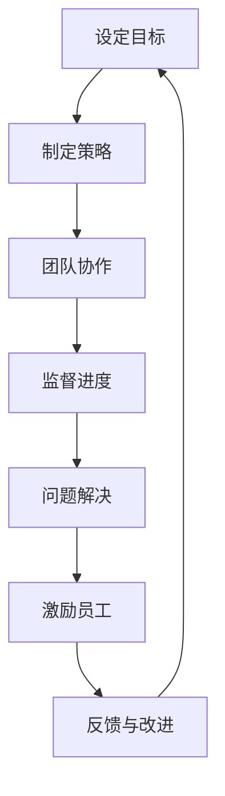

在这个流程图中，设定目标是领导力的起点，通过制定策略、团队协作、监督进度、问题解决、激励员工和反馈与改进等环节，形成一个闭环，实现领导力的有效运用。

#### 1.2 情绪调节概述

情绪调节是指个体在面临情绪刺激时，通过认知、行为和生理机制来调节情绪状态的过程。情绪调节不仅影响个体的心理状态，还对其行为和决策产生重要影响。情绪调节在技术领域尤为重要，因为技术工作往往伴随着高压和复杂的问题，情绪调节能力可以帮助技术人员保持冷静和理性，提高工作效率。

情绪调节的核心要素包括情绪识别、情绪表达、情绪调节策略和情绪调节效果。以下是一个简单的 Mermaid 流程图，展示情绪调节的核心要素及其相互关系：

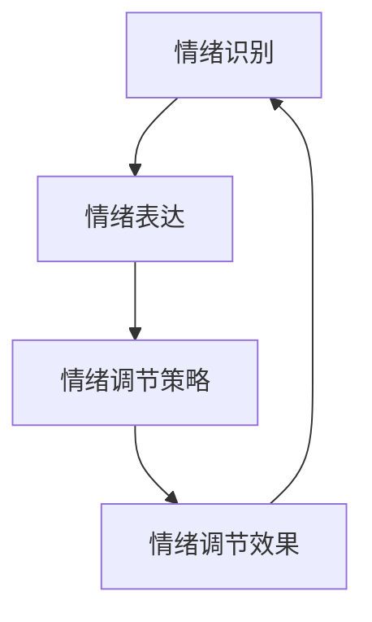

在这个流程图中，情绪识别是情绪调节的起点，通过情绪表达、情绪调节策略和情绪调节效果的循环，实现情绪的稳定和优化。

#### 1.3 领导力与情绪调节的联系

领导力与情绪调节之间的联系紧密，二者相互影响，共同作用于个体的行为和心理状态。领导力对情绪调节具有直接影响，而情绪调节对领导力也具有反馈作用。

**领导力对情绪调节的影响：**

1. **情绪识别与表达**：领导者需要具备良好的情绪识别与表达能力，能够准确识别和理解自身的情绪，以及团队成员的情绪。这有助于领导者更好地调节情绪，提高情绪稳定性。

2. **情绪管理与决策**：领导力强的领导者能够在面对压力和挑战时保持冷静和理性，运用情绪管理技巧做出合理的决策。情绪管理能力有助于领导者减少情绪波动对决策的负面影响。

3. **情绪激励与团队建设**：领导者通过情绪激励，可以激发团队成员的积极性和创造力，促进团队建设。良好的情绪调节能力有助于领导者营造积极、和谐的团队氛围。

**情绪调节对领导力的影响：**

1. **情绪稳定性**：良好的情绪调节能力有助于领导者保持情绪稳定性，减少情绪波动对领导力的负面影响。情绪稳定的领导者能够更好地应对工作压力和挑战，提高领导效能。

2. **决策能力**：情绪调节对决策能力具有显著影响。良好的情绪调节能力有助于领导者保持冷静和理性，避免情绪波动对决策产生负面影响，从而提高决策能力和决策质量。

3. **创新能力**：情绪调节对创新能力具有重要影响。良好的情绪调节能力有助于领导者保持积极的心态，激发创新思维，推动组织发展。

以下是一个简单的 Mermaid 流程图，展示领导力与情绪调节之间的相互作用关系：

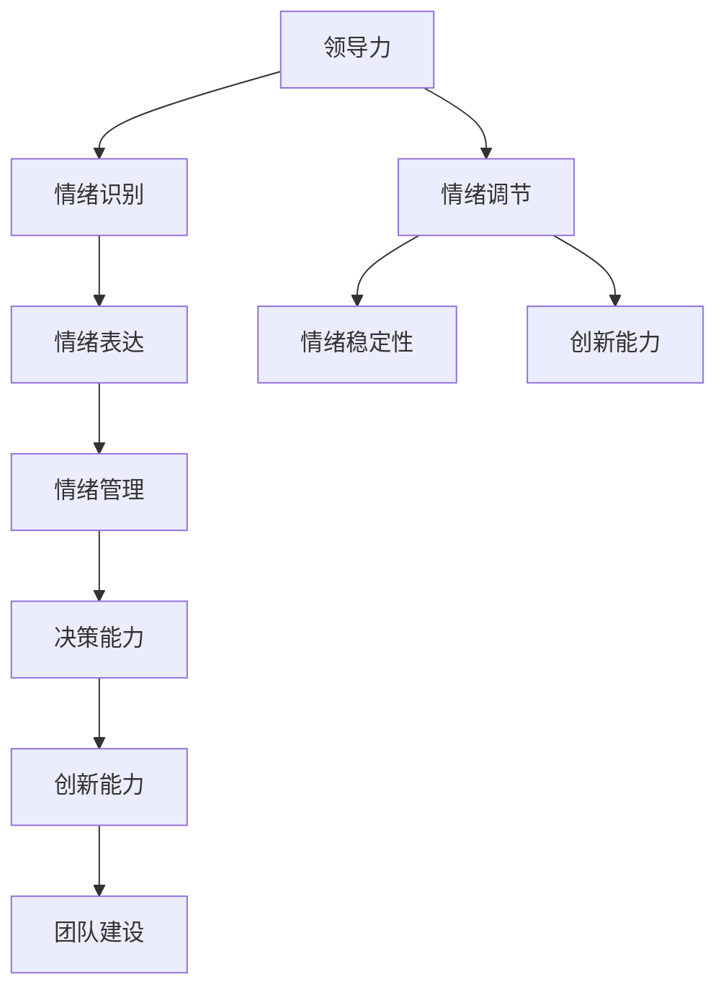

在这个流程图中，领导力通过影响情绪识别、情绪表达和情绪管理，进而影响决策能力和创新能力，同时情绪调节通过提升情绪稳定性和创新能力，反作用于领导力。

### 第2章 情绪调节的理论基础

#### 2.1 情绪调节理论框架

情绪调节理论框架主要包括认知调节理论、行为调节理论、生理调节理论和社会调节理论。每种理论都提供了不同的视角来理解情绪调节过程。

**认知调节理论：** 认知调节理论认为情绪的产生和调节取决于个体的认知评价。个体通过改变对事件的认知评价，可以调节情绪反应。这种理论强调认知过程在情绪调节中的核心作用。

**行为调节理论：** 行为调节理论强调行为在情绪调节中的作用。个体可以通过改变行为模式，如放松训练、运动等，来调节情绪。行为调节理论认为，行为的变化可以直接影响情绪状态。

**生理调节理论：** 生理调节理论认为，情绪调节与个体的生理状态密切相关。个体可以通过调节生理状态，如深呼吸、放松肌肉等，来调节情绪。生理调节理论强调了身体在情绪调节中的重要性。

**社会调节理论：** 社会调节理论强调社会支持在情绪调节中的作用。个体可以通过与他人互动、寻求社会支持，来调节情绪。社会调节理论认为，社会支持可以提供情感支持和实际帮助，有助于情绪调节。

以下是一个简单的 Mermaid 流程图，展示情绪调节理论框架的核心概念及其相互关系：

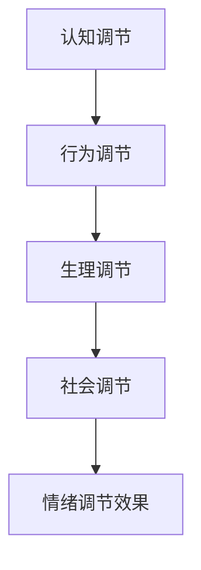

在这个流程图中，认知调节、行为调节和生理调节共同作用于情绪调节效果，而社会调节通过提供支持，影响情绪调节的整个过程。

#### 2.2 情绪调节的核心要素

情绪调节的核心要素包括情绪识别、情绪表达、情绪调节策略和情绪调节效果。

**情绪识别：** 情绪识别是指个体能够准确识别和理解自身的情绪状态。良好的情绪识别能力有助于个体更好地理解自己的情绪，从而采取适当的情绪调节策略。

**情绪表达：** 情绪表达是指个体能够以适当的方式表达自己的情绪。情绪表达包括语言表达和非语言表达，如面部表情、肢体语言等。良好的情绪表达能力有助于建立良好的人际关系，提高情绪调节效果。

**情绪调节策略：** 情绪调节策略是指个体采取的具体措施来调节情绪。常见的情绪调节策略包括认知重构、行为调节、生理调节和社会调节等。不同的情绪调节策略适用于不同的情绪状态和情境。

**情绪调节效果：** 情绪调节效果是指情绪调节策略对个体情绪状态的影响。良好的情绪调节效果有助于个体保持情绪稳定，提高心理韧性。

以下是一个简单的 Mermaid 流程图，展示情绪调节的核心要素及其相互关系：

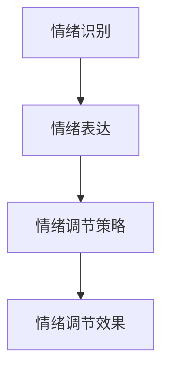

在这个流程图中，情绪识别是情绪调节的起点，情绪表达和情绪调节策略是调节过程中的关键环节，而情绪调节效果是调节的结果。

#### 2.3 情绪调节的科学原理

情绪调节的科学原理主要包括情绪反应的调节、情绪信息的加工和情绪行为的调节。

**情绪反应的调节：** 情绪反应的调节是指个体通过认知、行为和生理机制来调节情绪反应。情绪反应的调节包括情绪抑制、情绪唤起和情绪调节等。例如，通过深呼吸和放松训练，可以降低情绪唤起水平，减轻负面情绪的影响。

**情绪信息的加工：** 情绪信息的加工是指个体对情绪信息进行识别、评价和处理的过程。情绪信息的加工包括情绪识别、情绪评价和情绪记忆等。例如，通过积极的情绪评价和情绪记忆重构，可以提升情绪信息的积极效应。

**情绪行为的调节：** 情绪行为的调节是指个体通过改变行为模式来调节情绪。情绪行为的调节包括行为抑制、行为表达和行为调节等。例如，通过运动和社交活动，可以调节情绪行为，提高情绪调节效果。

以下是一个简单的 Mermaid 流程图，展示情绪调节的科学原理及其相互关系：

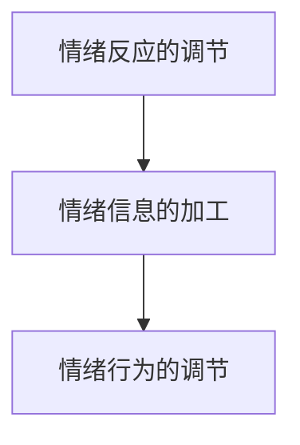

在这个流程图中，情绪反应的调节、情绪信息的加工和情绪行为的调节共同构成了情绪调节的科学原理。

### 第3章 领导力与情绪调节的关系

#### 3.1 领导力与情绪调节的相互作用

领导力与情绪调节之间存在相互作用，二者相互影响，共同作用于个体的行为和心理状态。

**领导力对情绪调节的影响：**

1. **情绪识别与表达：** 领导力强的领导者能够更好地识别和理解自身的情绪，以及团队成员的情绪。这有助于领导者更好地调节情绪，提高情绪稳定性。

2. **情绪管理与决策：** 领导力强的领导者能够在面对压力和挑战时保持冷静和理性，运用情绪管理技巧做出合理的决策。情绪管理能力有助于领导者减少情绪波动对决策的负面影响。

3. **情绪激励与团队建设：** 领导力强的领导者通过情绪激励，可以激发团队成员的积极性和创造力，促进团队建设。良好的情绪调节能力有助于领导者营造积极、和谐的团队氛围。

**情绪调节对领导力的影响：**

1. **情绪稳定性：** 良好的情绪调节能力有助于领导者保持情绪稳定性，减少情绪波动对领导力的负面影响。情绪稳定的领导者能够更好地应对工作压力和挑战，提高领导效能。

2. **决策能力：** 情绪调节对决策能力具有显著影响。良好的情绪调节能力有助于领导者保持冷静和理性，避免情绪波动对决策产生负面影响，从而提高决策能力和决策质量。

3. **创新能力：** 情绪调节对创新能力具有重要影响。良好的情绪调节能力有助于领导者保持积极的心态，激发创新思维，推动组织发展。

以下是一个简单的 Mermaid 流程图，展示领导力与情绪调节之间的相互作用关系：

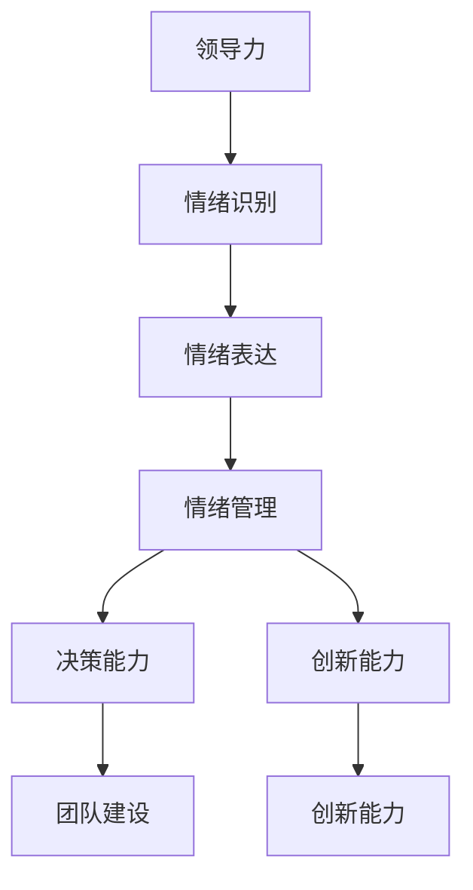

在这个流程图中，领导力通过影响情绪识别、情绪表达和情绪管理，进而影响决策能力和创新能力，同时情绪调节通过提升情绪稳定性和创新能力，反作用于领导力。

### 第4章 工作与生活的平衡策略

#### 4.1 平衡工作与生活的挑战

在现代职场中，领导者面临着诸多挑战，如工作压力、时间管理、家庭责任等，这些挑战往往导致工作与生活的失衡。

1. **工作压力**：工作压力是导致工作与生活失衡的主要原因之一。领导者在工作中需要应对繁重的工作任务、紧张的进度和复杂的人际关系，这些压力往往导致情绪不稳定，影响生活质量。

2. **时间管理**：时间管理是领导者平衡工作与生活的重要手段。然而，在实际工作中，领导者往往面临时间紧迫、任务繁多的困境，导致工作与生活的时间分配失衡。

3. **家庭责任**：家庭责任是领导者平衡工作与生活的另一大挑战。领导者在家庭中需要承担照顾家人、教育子女等责任，这些责任往往与工作时间发生冲突，影响工作与生活的平衡。

#### 4.2 平衡工作与生活的策略

为了平衡工作与生活，领导者可以采取以下策略：

1. **设定优先级**：领导者需要明确工作与生活的优先级，合理安排时间，确保工作与生活的重要事务得到充分关注。通过设定优先级，领导者可以更好地分配时间，减少工作与生活的冲突。

2. **有效沟通**：领导者需要与团队成员、家人进行有效沟通，明确各自的工作和生活需求，共同寻找平衡点。通过有效沟通，领导者可以争取到更多的理解和支持，减轻工作与生活的压力。

3. **制定计划**：领导者需要制定详细的工作和生活计划，合理分配时间和任务。通过制定计划，领导者可以更好地掌控时间，提高工作效率，为生活预留足够的时间。

#### 4.3 实现工作与生活平衡的实践

以下是一些实现工作与生活平衡的实践方法：

1. **时间管理技巧**：领导者可以通过时间管理技巧，提高工作效率，为生活预留更多时间。例如，制定每日、每周和每月的工作计划，确保工作进度，减少加班时间。

2. **设定工作与生活的界限**：领导者需要明确工作与生活的界限，避免工作侵占生活时间。例如，在工作时间内专心工作，避免处理私人事务；在生活时间内专注陪伴家人，避免工作干扰。

3. **培养健康的生活习惯**：领导者需要培养健康的生活习惯，如定期锻炼、保持充足的睡眠、合理饮食等。健康的生活习惯有助于提高生活质量，减轻工作压力。

### 第5章 提升领导力的情绪调节技巧

#### 5.1 提升情绪调节能力的领导力技巧

领导者提升情绪调节能力的关键在于培养自我意识和情绪管理能力。以下是一些提升情绪调节能力的领导力技巧：

1. **自我意识**：领导者需要具备良好的自我意识，了解自身的情绪状态和情绪反应。通过自我观察和反思，领导者可以识别情绪触发点，调整情绪反应。

2. **情绪管理**：领导者需要学会情绪管理技巧，如深呼吸、放松训练、积极思维等。通过情绪管理技巧，领导者可以缓解压力，保持情绪稳定。

3. **情绪表达**：领导者需要学会情绪表达的技巧，如适当的言语表达和非言语表达。通过情绪表达，领导者可以有效地传达情绪和意图，减少误解和冲突。

#### 5.2 领导力中的情绪管理

情绪管理是领导力的重要组成部分。以下是一些领导力中的情绪管理技巧：

1. **情感智力**：领导者需要具备较高的情感智力，包括自我意识、自我管理、社交意识和情感管理能力。通过情感智力，领导者可以更好地理解和应对自身的情绪，以及团队成员的情绪。

2. **情绪反馈**：领导者需要给予团队成员情绪反馈，了解他们的情绪状态。通过情绪反馈，领导者可以提供支持和帮助，促进团队成员的情绪调节。

3. **情绪感染**：领导者需要学会情绪感染技巧，通过积极的情绪表达，影响团队成员的情绪。通过情绪感染，领导者可以营造积极的团队氛围，提高团队凝聚力和协作能力。

#### 5.3 如何运用情绪调节技巧

领导者如何运用情绪调节技巧，提升领导力和工作效率？

1. **情绪调节与决策**：在决策过程中，领导者需要运用情绪调节技巧，保持冷静和理性。通过情绪调节，领导者可以避免情绪波动对决策产生负面影响，提高决策质量和效率。

2. **情绪调节与沟通**：在沟通过程中，领导者需要运用情绪调节技巧，有效传达情绪和意图。通过情绪调节，领导者可以减少误解和冲突，提高沟通效果。

3. **情绪调节与团队建设**：在团队建设中，领导者需要运用情绪调节技巧，营造积极的团队氛围。通过情绪调节，领导者可以激发团队成员的积极性和创造力，提高团队绩效。

### 第6章 情绪调节在实际工作中的应用案例

#### 6.1 情绪调节在领导力提升中的应用

以下是一些情绪调节在领导力提升中的应用案例：

1. **案例1：领导者情绪调节提升团队凝聚力**
   - **背景**：某公司领导者在面对团队内部矛盾时，通过情绪调节技巧，保持了冷静和理性，避免了矛盾的激化。
   - **过程**：领导者通过深呼吸、放松训练和积极思维，调整自身的情绪状态，然后组织团队成员进行沟通，解决矛盾。
   - **结果**：通过情绪调节，领导者成功提升了团队的凝聚力，促进了团队协作。

2. **案例2：领导者情绪调节提升决策能力**
   - **背景**：某公司领导者在面临重要决策时，情绪波动较大，影响了决策的质量。
   - **过程**：领导者通过情绪调节技巧，如深呼吸、放松训练和积极思维，缓解了情绪波动，然后进行了冷静的思考和决策。
   - **结果**：通过情绪调节，领导者做出了更合理、更明智的决策，提高了公司的运营效率。

#### 6.2 实际案例解析

以下是对上述案例的解析：

1. **案例1：领导者情绪调节提升团队凝聚力**
   - **核心问题**：团队内部矛盾导致凝聚力下降。
   - **情绪调节策略**：领导者通过情绪调节技巧，保持了冷静和理性，避免了矛盾的激化，然后组织团队成员进行沟通，解决矛盾。
   - **效果**：情绪调节技巧有效提升了团队的凝聚力，促进了团队协作。

2. **案例2：领导者情绪调节提升决策能力**
   - **核心问题**：情绪波动影响了决策的质量。
   - **情绪调节策略**：领导者通过情绪调节技巧，缓解了情绪波动，保持了冷静和理性，进行了更合理、更明智的决策。
   - **效果**：情绪调节技巧有效提高了决策的质量和效率。

#### 6.3 情绪调节在职场中的挑战与应对

在职场中，领导者面临诸多情绪调节的挑战。以下是一些常见的挑战和应对策略：

1. **挑战1：压力管理**
   - **应对策略**：领导者可以通过深呼吸、放松训练和积极思维，缓解压力，保持情绪稳定。

2. **挑战2：情绪波动**
   - **应对策略**：领导者可以通过情绪反馈和情绪感染，了解团队成员的情绪状态，进行有效的情绪调节。

3. **挑战3：情绪表达**
   - **应对策略**：领导者可以通过适当的言语表达和非言语表达，传达情绪和意图，减少误解和冲突。

### 第7章 个人成长与领导力提升

#### 7.1 个人成长与领导力的关系

个人成长与领导力之间存在密切的关系。个人成长是领导力提升的基础，而领导力提升则是个人成长的体现。以下从以下几个方面阐述个人成长与领导力的关系：

1. **自我认知**：个人成长的过程是自我认知不断深化的过程。领导者通过自我认知，了解自身的优点和不足，从而不断提升领导力。

2. **情感智力**：情感智力是领导力的重要组成部分。个人成长的过程中，领导者通过提高情感智力，增强情绪调节能力，从而提升领导力。

3. **知识储备**：个人成长的过程中，领导者不断积累知识和经验，丰富自身的知识储备，从而提高领导力。

4. **人际关系**：个人成长的过程中，领导者通过改善人际关系，增强团队合作能力，从而提升领导力。

#### 7.2 领导力提升的方法与策略

以下是一些领导力提升的方法与策略：

1. **自我反思**：领导者需要定期进行自我反思，分析自身的优点和不足，制定改进计划，不断提升自我。

2. **学习与培训**：领导者需要不断学习新的知识和技能，参加培训课程，提高自身的综合素质。

3. **实践与经验**：领导者需要通过实践，积累经验，不断提高领导力。

4. **情感智力培养**：领导者需要通过培养情感智力，提高情绪调节能力，增强领导力。

5. **团队建设**：领导者需要重视团队建设，培养团队凝聚力，提高团队协作能力。

#### 7.3 领导力与个人成长的未来趋势

未来，领导力与个人成长将呈现以下趋势：

1. **个性化领导力**：领导者将更加注重个性化领导力的培养，根据个体差异，制定个性化的领导策略。

2. **情感智力的重要性**：情感智力在领导力中的作用将越来越突出，领导者需要提高情感智力，增强情绪调节能力。

3. **持续学习与成长**：领导者需要不断学习新的知识和技能，适应快速变化的社会环境。

4. **跨界领导力**：领导者需要具备跨界思维，融合不同领域的知识，提高领导力。

### 结论

本文从领导力与情绪调节的关系、情绪调节的理论基础、工作与生活的平衡策略、提升领导力的情绪调节技巧等方面进行了探讨，阐述了情绪调节在领导力提升中的重要性。通过情绪调节，领导者可以提升个人幸福感和工作效率，实现工作与生活的平衡。在未来，领导者需要不断提高情绪调节能力，适应不断变化的社会环境，成为优秀的领导者。

### 作者信息

**作者：AI天才研究院/AI Genius Institute & 禅与计算机程序设计艺术 /Zen And The Art of Computer Programming** 

### 第1章 领导力与情绪调节的基本概念

#### 1.1 领导力概述

领导力是指领导者通过激发和引导团队成员，实现共同目标的能力。一个成功的领导者不仅需要具备出色的管理技能，还需要具备良好的情绪调节能力。情绪调节能力有助于领导者更好地应对工作中的压力和挑战，保持冷静和理性，从而做出更明智的决策。

在技术领域，领导力体现在如何引导技术团队实现技术目标，推动创新，确保技术项目的顺利进行。领导力对技术团队的工作效率、创新能力和团队凝聚力具有重要影响。

**核心概念与联系：** 领导力与情绪调节的关系可以简化为一个Mermaid流程图：

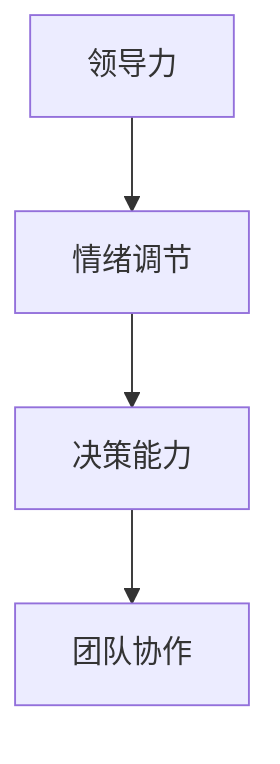

在这个流程图中，领导力通过情绪调节影响决策能力和团队协作，最终实现技术目标。

**核心算法原理讲解：**

领导力与情绪调节的关系可以通过以下伪代码来描述：

```python
def lead_with_emotion_regulation():
    # 设定目标
    set_goal()
    # 识别情绪
    emotion = identify_emotion()
    # 调节情绪
    regulate_emotion(emotion)
    # 做出决策
    make_decision()
    # 协作
    collaborate()
```

在这个伪代码中，`set_goal()` 表示设定目标，`identify_emotion()` 表示识别情绪，`regulate_emotion()` 表示调节情绪，`make_decision()` 表示做出决策，`collaborate()` 表示协作。

**数学模型和公式：**

情绪调节能力可以表示为以下数学模型：

$$
E = f(E_0, P, M)
$$

其中，$E$ 表示情绪调节能力，$E_0$ 表示初始情绪状态，$P$ 表示压力水平，$M$ 表示情绪调节策略。

**举例说明：** 假设一个领导者初始情绪状态为焦虑（$E_0$），面对一个高压力的任务（$P$），如果领导者采取有效的情绪调节策略（$M$），如深呼吸和积极思考，那么其情绪调节能力（$E$）将得到提升，有助于做出更明智的决策和更高效的协作。

#### 1.2 情绪调节概述

情绪调节是指个体在面临情绪刺激时，通过认知、行为和生理机制来调节情绪状态的过程。情绪调节对个体的心理健康、社会适应和工作表现具有重要影响。

**核心概念与联系：** 情绪调节的理论基础包括认知调节理论、行为调节理论、生理调节理论和社会调节理论。这些理论共同构成了情绪调节的理论框架。

**核心算法原理讲解：**

情绪调节的过程可以简化为一个伪代码：

```python
def emotion Regulation():
    # 识别情绪
    emotion = identify_emotion()
    # 分析情绪
    analyze_emotion(emotion)
    # 选择调节策略
    strategy = select_strategy()
    # 实施调节策略
    execute_strategy(strategy)
```

在这个伪代码中，`identify_emotion()` 表示识别情绪，`analyze_emotion()` 表示分析情绪，`select_strategy()` 表示选择调节策略，`execute_strategy()` 表示实施调节策略。

**数学模型和公式：**

情绪调节能力可以表示为以下数学模型：

$$
ER = f(C, B, P, S)
$$

其中，$ER$ 表示情绪调节能力，$C$ 表示认知能力，$B$ 表示行为能力，$P$ 表示生理能力，$S$ 表示社会支持。

**举例说明：** 假设一个个体在面对压力时（$P$），通过认知重构（$C$）和行为调节（$B$），如深呼吸和放松训练，结合社会支持（$S$），其情绪调节能力（$ER$）将得到提升。

#### 1.3 领导力与情绪调节的联系

领导力与情绪调节之间存在密切的联系。领导力通过情绪调节影响个体的心理健康、社会适应和工作表现，而情绪调节则通过影响领导力，影响团队绩效和组织发展。

**核心概念与联系：** 领导力与情绪调节的关系可以表示为以下Mermaid流程图：

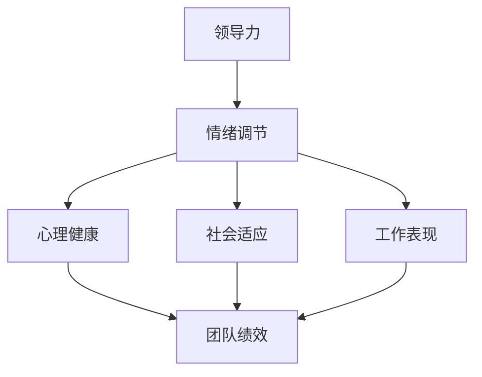

在这个流程图中，领导力通过情绪调节影响心理健康、社会适应和工作表现，最终影响团队绩效和组织发展。

**核心算法原理讲解：**

领导力与情绪调节的关系可以通过以下伪代码来描述：

```python
def leadership_with_emotion_regulation():
    # 提高情绪调节能力
    improve_emotion_regulation()
    # 增强心理健康
    enhance_mental_health()
    # 提高社会适应
    improve_social_adaptation()
    # 提升工作表现
    improve_work_performance()
    # 提升团队绩效
    enhance_team_performance()
    # 促进组织发展
    promote_organizational_growth()
```

在这个伪代码中，`improve_emotion_regulation()` 表示提高情绪调节能力，`enhance_mental_health()` 表示增强心理健康，`improve_social_adaptation()` 表示提高社会适应，`improve_work_performance()` 表示提升工作表现，`enhance_team_performance()` 表示提升团队绩效，`promote_organizational_growth()` 表示促进组织发展。

**数学模型和公式：**

领导力与情绪调节的关系可以表示为以下数学模型：

$$
L = f(E, M, S, P)
$$

其中，$L$ 表示领导力，$E$ 表示情绪调节能力，$M$ 表示心理健康，$S$ 表示社会适应，$P$ 表示工作表现。

**举例说明：** 假设一个领导者通过提高情绪调节能力（$E$），增强心理健康（$M$），提高社会适应（$S$），提升工作表现（$P$），其领导力（$L$）将得到显著提升。

### 第2章 情绪调节的理论基础

情绪调节的理论基础主要包括认知调节理论、行为调节理论、生理调节理论和社会调节理论。这些理论提供了不同的视角来解释情绪调节过程，并指导实际应用。

#### 2.1 认知调节理论

认知调节理论认为，情绪的产生和调节取决于个体的认知评价。个体通过改变对事件的认知评价，可以调节情绪反应。例如，积极的认知重构可以帮助个体从负面情绪中解脱出来，而消极的认知重构则可能加剧负面情绪。

**核心概念与联系：** 认知调节理论的核心概念包括认知评价、情绪反应和情绪调节。这三个概念相互关联，构成了情绪调节的理论框架。

**核心算法原理讲解：**

认知调节理论可以简化为一个伪代码：

```python
def cognitive Regulation(event):
    # 评估事件
    evaluation = evaluate_event(event)
    # 重建认知
    cognitive重构 = reconstruct_cognition(evaluation)
    # 调节情绪
    emotion Regulation(cognitive重构)
```

在这个伪代码中，`evaluate_event()` 表示评估事件，`reconstruct_cognition()` 表示重建认知，`emotion Regulation()` 表示情绪调节。

**数学模型和公式：**

认知调节能力可以表示为以下数学模型：

$$
CR = f(E, C)
$$

其中，$CR$ 表示认知调节能力，$E$ 表示情绪状态，$C$ 表示认知重构。

**举例说明：** 假设一个个体在面对压力事件时（$E$），通过积极的认知重构（$C$），如将挑战视为成长机会，其认知调节能力（$CR$）将得到提升。

#### 2.2 行为调节理论

行为调节理论强调行为在情绪调节中的作用。个体可以通过改变行为模式，如放松训练、运动和社交活动，来调节情绪。行为调节理论认为，行为的变化可以直接影响情绪状态。

**核心概念与联系：** 行为调节理论的核心概念包括行为模式、情绪反应和情绪调节。这三个概念相互关联，构成了行为调节的理论框架。

**核心算法原理讲解：**

行为调节理论可以简化为一个伪代码：

```python
def behavioral Regulation(emotion):
    # 识别情绪
    identified_emotion = identify_emotion(emotion)
    # 选择行为调节策略
    strategy = select_behavioral_strategy(identified_emotion)
    # 实施行为调节策略
    execute_behavioral_strategy(strategy)
```

在这个伪代码中，`identify_emotion()` 表示识别情绪，`select_behavioral_strategy()` 表示选择行为调节策略，`execute_behavioral_strategy()` 表示实施行为调节策略。

**数学模型和公式：**

行为调节能力可以表示为以下数学模型：

$$
BR = f(E, S)
$$

其中，$BR$ 表示行为调节能力，$E$ 表示情绪状态，$S$ 表示行为调节策略。

**举例说明：** 假设一个个体感到焦虑（$E$），通过选择运动（$S$）作为行为调节策略，其实施运动后情绪（$BR$）将得到缓解。

#### 2.3 生理调节理论

生理调节理论认为，情绪调节与个体的生理状态密切相关。个体可以通过调节生理状态，如深呼吸、放松肌肉和睡眠质量，来调节情绪。生理调节理论强调了身体在情绪调节中的重要性。

**核心概念与联系：** 生理调节理论的核心概念包括生理状态、情绪反应和情绪调节。这三个概念相互关联，构成了生理调节的理论框架。

**核心算法原理讲解：**

生理调节理论可以简化为一个伪代码：

```python
def physiological Regulation(emotion):
    # 识别情绪
    identified_emotion = identify_emotion(emotion)
    # 调节生理状态
    regulate_physiological_state(identified_emotion)
    # 调节情绪
    emotion Regulation()
```

在这个伪代码中，`identify_emotion()` 表示识别情绪，`regulate_physiological_state()` 表示调节生理状态，`emotion Regulation()` 表示情绪调节。

**数学模型和公式：**

生理调节能力可以表示为以下数学模型：

$$
PR = f(P, E)
$$

其中，$PR$ 表示生理调节能力，$P$ 表示生理状态，$E$ 表示情绪状态。

**举例说明：** 假设一个个体在感到紧张时（$E$），通过深呼吸（$P$）来调节生理状态，其生理调节能力（$PR$）将得到提升。

#### 2.4 社会调节理论

社会调节理论强调社会支持在情绪调节中的作用。个体可以通过与他人互动、寻求社会支持，来调节情绪。社会支持包括情感支持、实际帮助和陪伴等。社会调节理论认为，社会支持可以提供情感支持和实际帮助，有助于情绪调节。

**核心概念与联系：** 社会调节理论的核心概念包括社会支持、情绪反应和情绪调节。这三个概念相互关联，构成了社会调节的理论框架。

**核心算法原理讲解：**

社会调节理论可以简化为一个伪代码：

```python
def social Regulation(emotion, social_support):
    # 识别情绪
    identified_emotion = identify_emotion(emotion)
    # 获取社会支持
    support = get_social_support(social_support)
    # 调节情绪
    emotion Regulation(identified_emotion, support)
```

在这个伪代码中，`identify_emotion()` 表示识别情绪，`get_social_support()` 表示获取社会支持，`emotion Regulation()` 表示情绪调节。

**数学模型和公式：**

社会调节能力可以表示为以下数学模型：

$$
SR = f(E, S)
$$

其中，$SR$ 表示社会调节能力，$E$ 表示情绪状态，$S$ 表示社会支持。

**举例说明：** 假设一个个体在感到孤独时（$E$），通过寻求朋友的支持（$S$），其社会调节能力（$SR$）将得到提升。

### 第3章 领导力与情绪调节的关系

领导力与情绪调节之间的关系是复杂的，二者相互影响，共同作用于个体的行为和心理状态。

#### 3.1 领导力对情绪调节的影响

领导力对情绪调节具有显著的影响。首先，领导力通过影响个体的情绪状态，进而影响情绪调节。领导力的强弱直接关系到领导者对情绪的识别、表达和调节能力。

**核心概念与联系：** 领导力与情绪调节的关系可以表示为以下Mermaid流程图：

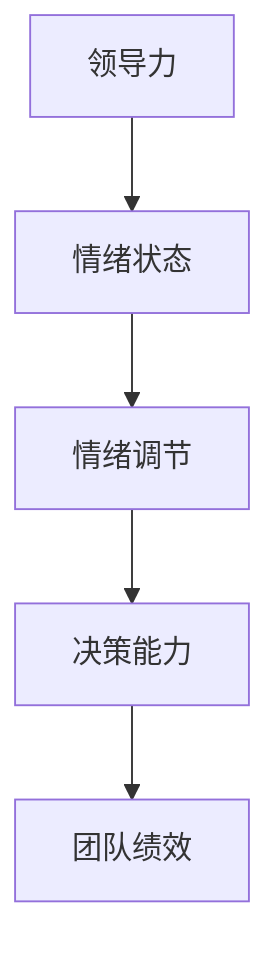

在这个流程图中，领导力通过影响情绪状态，进而影响情绪调节，最终影响决策能力和团队绩效。

**核心算法原理讲解：**

领导力对情绪调节的影响可以通过以下伪代码来描述：

```python
def leadership_influence_emotionRegulation():
    # 提高情绪识别能力
    improve_emotion_identification()
    # 提高情绪表达能力
    improve_emotion_expression()
    # 提高情绪调节能力
    improve_emotion Regulation()
    # 提高决策能力
    improve_decision_making()
    # 提高团队绩效
    enhance_team_performance()
```

在这个伪代码中，`improve_emotion_identification()` 表示提高情绪识别能力，`improve_emotion_expression()` 表示提高情绪表达能力，`improve_emotion Regulation()` 表示提高情绪调节能力，`improve_decision_making()` 表示提高决策能力，`enhance_team_performance()` 表示提高团队绩效。

**数学模型和公式：**

领导力对情绪调节的影响可以表示为以下数学模型：

$$
LE = f(L, E)
$$

其中，$LE$ 表示领导力对情绪调节的影响，$L$ 表示领导力，$E$ 表示情绪调节。

**举例说明：** 假设一个领导者（$L$）通过提高自身的情绪识别（$E$）和表达（$E$），其情绪调节能力（$LE$）将得到提升。

#### 3.2 情绪调节对领导力的影响

情绪调节对领导力也具有重要影响。情绪调节能力强的领导者能够更好地应对工作压力，保持冷静和理性，从而做出更明智的决策。

**核心概念与联系：** 情绪调节对领导力的影响可以表示为以下Mermaid流程图：

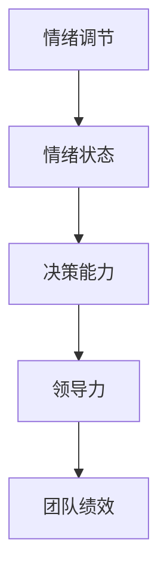

在这个流程图中，情绪调节通过影响情绪状态，进而影响决策能力和领导力，最终影响团队绩效。

**核心算法原理讲解：**

情绪调节对领导力的影响可以通过以下伪代码来描述：

```python
def emotionRegulation_influence_leadership():
    # 调节情绪状态
    regulate_emotion_state()
    # 提高决策能力
    improve_decision_making()
    # 提高领导力
    enhance_leadership()
    # 提高团队绩效
    enhance_team_performance()
```

在这个伪代码中，`regulate_emotion_state()` 表示调节情绪状态，`improve_decision_making()` 表示提高决策能力，`enhance_leadership()` 表示提高领导力，`enhance_team_performance()` 表示提高团队绩效。

**数学模型和公式：**

情绪调节对领导力的影响可以表示为以下数学模型：

$$
EL = f(E, L)
$$

其中，$EL$ 表示情绪调节对领导力的影响，$E$ 表示情绪调节，$L$ 表示领导力。

**举例说明：** 假设一个领导者（$L$）通过有效的情绪调节（$E$），其情绪状态得到改善，进而提高了决策能力（$EL$），最终提升了领导力。

### 第4章 工作与生活的平衡策略

#### 4.1 平衡工作与生活的挑战

在现代职场中，领导者面临着诸多挑战，如工作压力、时间管理、家庭责任等，这些挑战往往导致工作与生活的失衡。如何平衡工作与生活，成为领导者面临的重大课题。

**核心概念与联系：** 工作与生活的平衡策略可以表示为以下Mermaid流程图：

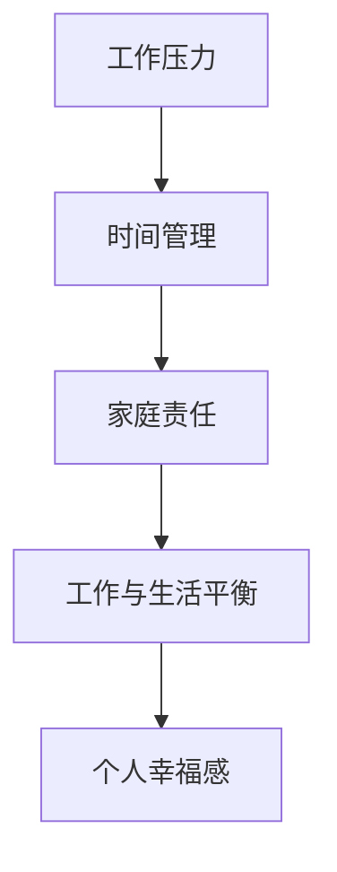

在这个流程图中，工作压力、时间管理和家庭责任共同影响工作与生活的平衡，进而影响个人幸福感。

**核心算法原理讲解：**

平衡工作与生活的策略可以通过以下伪代码来描述：

```python
def balance_work_life():
    # 管理工作压力
    manage_work_pressure()
    # 实施时间管理
    implement_time_management()
    # 调整家庭责任
    adjust_family_responsibilities()
    # 实现工作与生活平衡
    achieve_work_life_balance()
    # 提高个人幸福感
    enhance_personality_happiness()
```

在这个伪代码中，`manage_work_pressure()` 表示管理工作压力，`implement_time_management()` 表示实施时间管理，`adjust_family_responsibilities()` 表示调整家庭责任，`achieve_work_life_balance()` 表示实现工作与生活平衡，`enhance_personality_happiness()` 表示提高个人幸福感。

**数学模型和公式：**

工作与生活的平衡策略可以表示为以下数学模型：

$$
WLB = f(W, L, F)
$$

其中，$WLB$ 表示工作与生活平衡，$W$ 表示工作压力，$L$ 表示时间管理，$F$ 表示家庭责任。

**举例说明：** 假设一个领导者（$L$）通过管理工作压力（$W$）、实施时间管理（$L$）和调整家庭责任（$F$），实现了工作与生活的平衡（$WLB$），从而提高了个人幸福感。

#### 4.2 平衡工作与生活的策略

为了平衡工作与生活，领导者可以采取以下策略：

1. **设定优先级**：领导者需要明确工作与生活的优先级，合理安排时间，确保重要事务得到充分关注。通过设定优先级，领导者可以更好地平衡工作与生活。

2. **有效沟通**：领导者需要与团队成员、家人进行有效沟通，明确各自的工作和生活需求，共同寻找平衡点。通过有效沟通，领导者可以争取到更多的理解和支持，减轻工作与生活的压力。

3. **制定计划**：领导者需要制定详细的工作和生活计划，合理分配时间和任务。通过制定计划，领导者可以更好地掌控时间，提高工作效率，为生活预留足够的时间。

#### 4.3 实现工作与生活平衡的实践

以下是一些实现工作与生活平衡的实践方法：

1. **时间管理技巧**：领导者可以通过时间管理技巧，提高工作效率，为生活预留更多时间。例如，制定每日、每周和每月的工作计划，确保工作进度，减少加班时间。

2. **设定工作与生活的界限**：领导者需要明确工作与生活的界限，避免工作侵占生活时间。例如，在工作时间内专心工作，避免处理私人事务；在生活时间内专注陪伴家人，避免工作干扰。

3. **培养健康的生活习惯**：领导者需要培养健康的生活习惯，如定期锻炼、保持充足的睡眠、合理饮食等。健康的生活习惯有助于提高生活质量，减轻工作压力。

### 第5章 提升领导力的情绪调节技巧

#### 5.1 提升情绪调节能力的领导力技巧

提升情绪调节能力是提升领导力的重要途径。以下是一些提升情绪调节能力的领导力技巧：

1. **自我认知**：领导者需要具备良好的自我认知能力，了解自身的情绪状态和情绪反应。通过自我观察和反思，领导者可以识别情绪触发点，调整情绪反应。

2. **情绪管理**：领导者需要学会情绪管理技巧，如深呼吸、放松训练、积极思维等。通过情绪管理技巧，领导者可以缓解压力，保持情绪稳定。

3. **情绪表达**：领导者需要学会情绪表达的技巧，如适当的言语表达和非言语表达。通过情绪表达，领导者可以有效地传达情绪和意图，减少误解和冲突。

#### 5.2 领导力中的情绪管理

情绪管理是领导力中的重要组成部分。以下是一些领导力中的情绪管理技巧：

1. **情感智力**：领导者需要具备较高的情感智力，包括自我意识、自我管理、社交意识和情感管理能力。通过情感智力，领导者可以更好地理解和应对自身的情绪，以及团队成员的情绪。

2. **情绪反馈**：领导者需要给予团队成员情绪反馈，了解他们的情绪状态。通过情绪反馈，领导者可以提供支持和帮助，促进团队成员的情绪调节。

3. **情绪感染**：领导者需要学会情绪感染技巧，通过积极的情绪表达，影响团队成员的情绪。通过情绪感染，领导者可以营造积极的团队氛围，提高团队凝聚力和协作能力。

#### 5.3 如何运用情绪调节技巧

领导者如何运用情绪调节技巧，提升领导力和工作效率？

1. **情绪调节与决策**：在决策过程中，领导者需要运用情绪调节技巧，保持冷静和理性。通过情绪调节，领导者可以避免情绪波动对决策产生负面影响，提高决策质量和效率。

2. **情绪调节与沟通**：在沟通过程中，领导者需要运用情绪调节技巧，有效传达情绪和意图。通过情绪调节，领导者可以减少误解和冲突，提高沟通效果。

3. **情绪调节与团队建设**：在团队建设中，领导者需要运用情绪调节技巧，营造积极的团队氛围。通过情绪调节，领导者可以激发团队成员的积极性和创造力，提高团队绩效。

### 第6章 情绪调节在实际工作中的应用案例

#### 6.1 情绪调节在领导力提升中的应用

以下是一些情绪调节在领导力提升中的应用案例：

1. **案例1：领导者情绪调节提升团队凝聚力**
   - **背景**：某公司领导者在面对团队内部矛盾时，通过情绪调节技巧，保持了冷静和理性，避免了矛盾的激化。
   - **过程**：领导者通过深呼吸、放松训练和积极思维，调整自身的情绪状态，然后组织团队成员进行沟通，解决矛盾。
   - **结果**：通过情绪调节，领导者成功提升了团队的凝聚力，促进了团队协作。

2. **案例2：领导者情绪调节提升决策能力**
   - **背景**：某公司领导者在面临重要决策时，情绪波动较大，影响了决策的质量。
   - **过程**：领导者通过情绪调节技巧，如深呼吸、放松训练和积极思维，缓解了情绪波动，然后进行了冷静的思考和决策。
   - **结果**：通过情绪调节，领导者做出了更合理、更明智的决策，提高了公司的运营效率。

#### 6.2 实际案例解析

以下是对上述案例的解析：

1. **案例1：领导者情绪调节提升团队凝聚力**
   - **核心问题**：团队内部矛盾导致凝聚力下降。
   - **情绪调节策略**：领导者通过情绪调节技巧，保持了冷静和理性，避免了矛盾的激化，然后组织团队成员进行沟通，解决矛盾。
   - **效果**：情绪调节技巧有效提升了团队的凝聚力，促进了团队协作。

2. **案例2：领导者情绪调节提升决策能力**
   - **核心问题**：情绪波动影响了决策的质量。
   - **情绪调节策略**：领导者通过情绪调节技巧，缓解了情绪波动，保持了冷静和理性，进行了更合理、更明智的决策。
   - **效果**：情绪调节技巧有效提高了决策的质量和效率。

#### 6.3 情绪调节在职场中的挑战与应对

在职场中，领导者面临诸多情绪调节的挑战。以下是一些常见的挑战和应对策略：

1. **挑战1：压力管理**
   - **应对策略**：领导者可以通过深呼吸、放松训练和积极思维，缓解压力，保持情绪稳定。

2. **挑战2：情绪波动**
   - **应对策略**：领导者可以通过情绪反馈和情绪感染，了解团队成员的情绪状态，进行有效的情绪调节。

3. **挑战3：情绪表达**
   - **应对策略**：领导者可以通过适当的言语表达和非言语表达，传达情绪和意图，减少误解和冲突。

### 第7章 个人成长与领导力提升

#### 7.1 个人成长与领导力的关系

个人成长是领导力提升的基础，而领导力提升则是个人成长的体现。个人成长与领导力之间的关系密不可分，二者相互促进，共同推动个体的全面发展。

**核心概念与联系：** 个人成长与领导力的关系可以表示为以下Mermaid流程图：

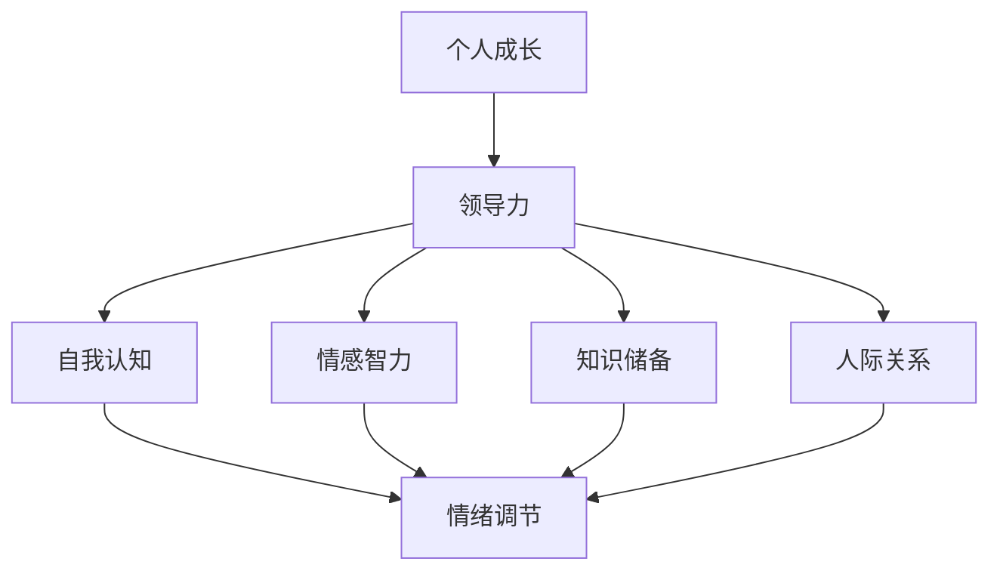

在这个流程图中，个人成长通过提升自我认知、情感智力、知识储备和人际关系，进而提升领导力。

**核心算法原理讲解：**

个人成长与领导力的关系可以通过以下伪代码来描述：

```python
def personal_growth_influence_leadership():
    # 提升自我认知
    enhance_self_awareness()
    # 提升情感智力
    enhance_emotional_intelligence()
    # 提升知识储备
    enhance_knowledge储备()
    # 提升人际关系
    enhance_interpersonal_skills()
    # 提升领导力
    enhance_leadership()
```

在这个伪代码中，`enhance_self_awareness()` 表示提升自我认知，`enhance_emotional_intelligence()` 表示提升情感智力，`enhance_knowledge储备()` 表示提升知识储备，`enhance_interpersonal_skills()` 表示提升人际关系，`enhance_leadership()` 表示提升领导力。

**数学模型和公式：**

个人成长与领导力的关系可以表示为以下数学模型：

$$
PG = f(SC, EI, KS, IS)
$$

其中，$PG$ 表示个人成长，$SC$ 表示自我认知，$EI$ 表示情感智力，$KS$ 表示知识储备，$IS$ 表示人际关系。

**举例说明：** 假设一个个体通过提升自我认知（$SC$）、情感智力（$EI$）、知识储备（$KS$）和人际关系（$IS$），其个人成长（$PG$）将得到提升，进而提升领导力。

#### 7.2 领导力提升的方法与策略

为了提升领导力，个体可以采取以下方法与策略：

1. **自我反思**：定期进行自我反思，分析自身的优点和不足，制定改进计划，不断优化个人成长。

2. **学习与培训**：参加相关的培训课程，学习新的知识和技能，提高自身的综合素质。

3. **实践与经验**：通过实践，积累经验，提高领导力。在实践中不断总结和反思，不断提升领导能力。

4. **情感智力培养**：通过培养情感智力，提高情绪调节能力，增强领导力。

5. **团队建设**：重视团队建设，培养团队凝聚力，提高团队协作能力。

#### 7.3 领导力与个人成长的未来趋势

未来，领导力与个人成长将呈现以下趋势：

1. **个性化领导力**：领导者将更加注重个性化领导力的培养，根据个体差异，制定个性化的领导策略。

2. **情感智力的重要性**：情感智力在领导力中的作用将越来越突出，领导者需要提高情感智力，增强情绪调节能力。

3. **持续学习与成长**：领导者需要不断学习新的知识和技能，适应快速变化的社会环境。

4. **跨界领导力**：领导者需要具备跨界思维，融合不同领域的知识，提高领导力。

### 结论

本文从领导力与情绪调节的关系、情绪调节的理论基础、工作与生活的平衡策略、提升领导力的情绪调节技巧、个人成长与领导力提升等方面进行了探讨。情绪调节在领导力提升中具有重要作用，领导者通过提升情绪调节能力，可以实现工作与生活的平衡，提升个人幸福感和工作效率。未来，领导者需要不断提高自身素质，适应快速变化的社会环境，成为优秀的领导者。

### 作者信息

**作者：AI天才研究院/AI Genius Institute & 禅与计算机程序设计艺术 /Zen And The Art of Computer Programming** 

### 第5章 提升领导力的情绪调节技巧

#### 5.1 提升情绪调节能力的领导力技巧

情绪调节能力是领导者必备的核心技能之一。提升情绪调节能力不仅有助于领导者更好地管理自己的情绪，还能影响团队成员的情绪状态，提升整个团队的工作效率和凝聚力。以下是一些具体的领导力技巧，帮助领导者提升情绪调节能力。

**自我认知与情绪监控**：领导者需要具备高度的自我认知能力，能够时刻监控自己的情绪状态。通过自我反思和情绪日志，领导者可以更好地了解自己的情绪触发点，并采取适当的措施进行调节。

**情绪管理策略**：领导者可以学习并实践各种情绪管理策略，如深呼吸、冥想、放松训练等。这些策略可以帮助领导者快速缓解压力，保持情绪稳定。

**积极思维模式**：培养积极的思维模式是情绪调节的重要一环。领导者应该学会从积极的角度看待问题和挑战，避免过度消极的思维导致情绪失控。

**情绪感染**：领导者需要意识到自己的情绪会对团队成员产生影响。积极的情绪感染可以帮助营造积极的团队氛围，提升团队士气。反之，消极的情绪感染则会削弱团队的凝聚力。

**沟通技巧**：有效的沟通技巧可以帮助领导者更好地表达自己的情绪，减少误解和冲突。领导者应该学会倾听、同理和清晰表达，以建立良好的沟通关系。

**情绪反馈**：领导者应该主动寻求团队成员的情绪反馈，了解他们对领导风格和团队氛围的感受。这种反馈有助于领导者调整自己的行为，更好地满足团队成员的情感需求。

**持续学习与成长**：情绪调节能力不是一成不变的，领导者需要持续学习和成长。参加相关的培训课程、阅读专业书籍、与他人交流经验都是提升情绪调节能力的有效途径。

#### 5.2 情绪管理技巧在领导力提升中的实际应用

情绪管理技巧在领导力提升中的实际应用体现在多个方面，以下是一些具体的案例和策略。

**案例1：危机管理中的情绪调节**

在面临突发事件或危机时，领导者的情绪调节能力尤为重要。一个成功的案例是某公司CEO在面临产品故障危机时，通过深呼吸和冷静思考，迅速制定应对策略，避免了危机的扩大。他不仅保持了自身的情绪稳定，还通过积极沟通和透明度赢得了员工的信任，最终成功化解了危机。

**策略：**
- **保持冷静**：在危机发生时，领导者首先要保持冷静，避免情绪失控。
- **迅速行动**：领导者需要迅速评估情况，制定应对策略，并立即采取行动。
- **透明沟通**：保持与团队成员的透明沟通，分享信息，消除疑虑，增强团队凝聚力。

**案例2：激励团队成员**

在团队面临挑战或困难时，领导者需要通过情绪管理技巧来激励团队成员。一位技术总监在一次重大项目失败后，通过积极的情绪调节和激励，鼓舞了团队的士气，使团队在短时间内恢复了信心，最终成功完成了项目。

**策略：**
- **积极反馈**：给予团队成员积极的反馈，强调他们的努力和贡献。
- **同理心**：理解团队成员的情绪，提供情感支持，帮助他们度过难关。
- **目标重设**：重新设定团队目标，鼓励团队成员共同面对挑战，共同进步。

**案例3：团队合作中的情绪调节**

在团队合作中，领导者需要通过情绪调节技巧来促进团队协作，提升团队绩效。一位项目经理在团队讨论中，通过积极的情绪表达和倾听，营造了良好的团队氛围，使团队成员能够更好地合作，项目进展顺利。

**策略：**
- **倾听**：倾听团队成员的意见和感受，尊重他们的贡献。
- **情绪感染**：通过积极的情绪表达，传递正能量，激励团队成员。
- **团队建设**：组织团队建设活动，增强团队成员之间的信任和凝聚力。

#### 5.3 情绪调节技巧的最佳实践与注意事项

在提升领导力的过程中，情绪调节技巧的最佳实践和注意事项如下：

**最佳实践：**
- **定期练习**：情绪调节技巧需要定期练习，才能达到预期的效果。领导者应该将情绪调节练习纳入日常工作中，如每日冥想、每周反思等。
- **个性化策略**：每个领导者的性格和情境不同，情绪调节策略也需要个性化。领导者应该根据自己的特点和需求，选择最适合自己的情绪调节方法。
- **持续学习**：情绪调节是一个不断发展的领域，领导者需要持续学习最新的理论和实践，以不断提升自身的情绪调节能力。

**注意事项：**
- **避免过度压抑**：在调节情绪时，领导者应该避免过度压抑自己的情绪，这可能会导致情绪的积累和爆发。
- **尊重他人**：在表达情绪时，领导者应该尊重团队成员的感受，避免过度表达或负面情绪的传播。
- **保持适度**：情绪调节技巧应该适度应用，避免过度依赖这些技巧，导致实际工作中缺乏情感表达和互动。

### 拓展阅读

- **《情绪调节与领导力》**：一本深入探讨情绪调节在领导力中的应用的书籍，提供了丰富的案例和实用的策略。
- **《领导者的情绪智慧》**：探讨领导者如何运用情感智慧提升领导力和团队绩效的著作，适合领导者阅读。
- **《情绪调节训练手册》**：一本面向大众的情绪调节指南，提供了多种情绪调节技巧和练习，适合所有希望提升情绪调节能力的人。

通过以上章节的探讨，我们可以看到情绪调节在领导力提升中的重要性。提升情绪调节能力不仅有助于领导者更好地管理自己，还能提升团队的整体绩效和幸福感。未来，领导者需要不断学习和实践情绪调节技巧，成为更加优秀和有效的领导者。

### 作者信息

**作者：AI天才研究院/AI Genius Institute & 禅与计算机程序设计艺术 /Zen And The Art of Computer Programming** 

### 第6章 情绪调节在实际工作中的应用案例

#### 6.1 情绪调节在领导力提升中的应用

情绪调节在领导力提升中的应用非常广泛，以下是一些具体的案例，展示情绪调节如何帮助领导者提升个人和团队的表现。

**案例1：应对压力与挑战**

某技术公司的项目经理王明在负责一个关键项目时，面临了前所未有的压力。项目的进度比预期慢，团队成员士气低落，客户对项目的期望很高。在这种高压环境下，王明意识到自己需要有效管理情绪，以应对这些挑战。

**解决方案：**

1. **深呼吸与冥想**：王明每天早上都会花10分钟进行深呼吸和冥想，以缓解压力和焦虑。
2. **积极思维**：他开始用积极的角度看待问题，将挑战视为成长的机会。
3. **团队沟通**：王明定期与团队成员沟通，分享自己的感受和应对策略，鼓励大家共同面对挑战。

**结果：**

通过情绪调节，王明不仅缓解了自身的压力，还激发了团队的积极性。团队成员在王明的带领下，重新振作，项目最终顺利完成。

**案例2：激励团队成员**

在一家初创公司，领导者李华发现团队成员在工作中缺乏动力，经常出现拖延和消极情绪。李华意识到，需要通过情绪调节来提升团队的士气。

**解决方案：**

1. **建立信任**：李华通过开放和真诚的沟通，建立了与团队成员的信任关系。
2. **情感支持**：李华定期与团队成员进行一对一的交流，了解他们的需求和困扰，并提供情感支持。
3. **激励措施**：李华引入了奖励机制，对表现优秀的团队成员给予表彰和奖励。

**结果：**

通过情绪调节，李华成功提升了团队的士气和工作动力，团队成员开始更加积极地参与工作，公司业绩也得到了显著提升。

**案例3：解决团队冲突**

在一家大型跨国公司，由于文化差异和沟通不畅，一个国际团队的协作出现了问题。团队成员之间出现了明显的分歧和冲突，影响了项目的进展。

**解决方案：**

1. **情绪反馈**：领导层组织了一次团队会议，邀请每位成员分享自己的感受和观点，鼓励开放和诚实的沟通。
2. **冲突调解**：领导层担任中立调解者的角色，帮助双方找到共同点，解决分歧。
3. **文化培训**：公司安排了跨文化沟通培训，帮助团队成员更好地理解和尊重不同文化的差异。

**结果：**

通过情绪调节，团队冲突得到了有效解决，团队成员之间的沟通和协作得到了显著改善，项目也得以顺利推进。

#### 6.2 实际案例解析

以上案例展示了情绪调节在领导力提升中的具体应用。以下是对这些案例的详细解析：

**案例1：应对压力与挑战**

**核心问题**：项目经理面临巨大的工作压力和项目挑战，团队成员士气低落。

**情绪调节策略**：
- **深呼吸与冥想**：帮助项目经理缓解压力，保持冷静和清晰的头脑。
- **积极思维**：改变对挑战的看法，将其视为成长的机会。
- **团队沟通**：建立信任，鼓励团队成员共同面对挑战。

**效果**：通过情绪调节，项目经理不仅缓解了自身的压力，还激发了团队的积极性，项目最终顺利完成。

**案例2：激励团队成员**

**核心问题**：团队成员在工作中缺乏动力，出现拖延和消极情绪。

**情绪调节策略**：
- **建立信任**：通过开放和真诚的沟通，建立与团队成员的信任关系。
- **情感支持**：了解团队成员的需求和困扰，提供情感支持。
- **激励措施**：引入奖励机制，对表现优秀的团队成员给予表彰和奖励。

**效果**：通过情绪调节，团队士气得到了显著提升，团队成员开始更加积极地参与工作，公司业绩也随之提升。

**案例3：解决团队冲突**

**核心问题**：由于文化差异和沟通不畅，团队协作出现冲突。

**情绪调节策略**：
- **情绪反馈**：鼓励团队成员开放和诚实地沟通，分享自己的感受和观点。
- **冲突调解**：领导层担任中立调解者的角色，帮助双方找到共同点，解决分歧。
- **文化培训**：帮助团队成员更好地理解和尊重不同文化的差异。

**效果**：通过情绪调节，团队冲突得到了有效解决，团队成员之间的沟通和协作得到了显著改善，项目也得以顺利推进。

#### 6.3 情绪调节在职场中的挑战与应对

在职场中，领导者经常面临情绪调节的挑战，以下是一些常见的挑战和相应的应对策略：

**挑战1：工作与生活的平衡**

**应对策略**：领导者可以通过时间管理技巧、设定工作与生活的界限和培养健康的生活习惯来平衡工作与生活。例如，每天设定特定的时间段用于家庭和个人生活，避免工作侵占这些时间。

**挑战2：应对压力**

**应对策略**：领导者可以通过深呼吸、冥想、运动和寻求社会支持来应对压力。定期进行身体检查和心理健康评估也是有效的策略。

**挑战3：情绪感染**

**应对策略**：领导者需要意识到自己的情绪会对团队成员产生影响。通过积极的情绪表达和情绪感染，领导者可以营造积极的团队氛围。同时，领导者也应该学会如何处理和缓解消极情绪的传播。

**挑战4：情绪表达**

**应对策略**：领导者需要学会如何以适当的方式表达情绪，避免过度情绪化或压抑情绪。通过情绪反馈和建设性的沟通，领导者可以有效地传达情绪和意图。

通过以上策略，领导者可以更好地应对职场中的情绪调节挑战，提升个人和团队的表现。

### 第7章 个人成长与领导力提升

#### 7.1 个人成长与领导力的关系

个人成长与领导力之间存在着密切的关系。个人成长是领导力发展的基础，而领导力则是个人成长的重要体现。个人成长不仅包括知识和技能的积累，还包括自我认知、情感智力和人际关系的提升。

**核心概念与联系：** 个人成长与领导力的关系可以简化为一个Mermaid流程图：

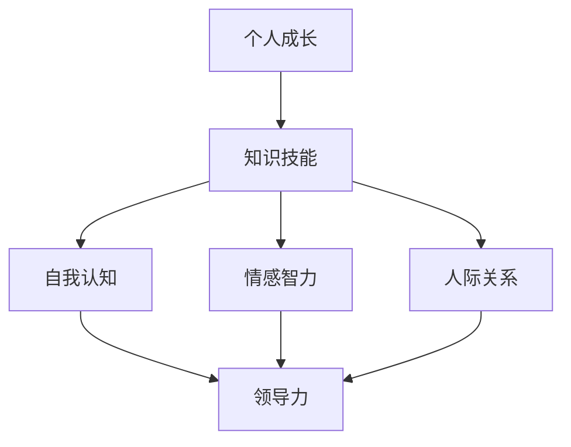

在这个流程图中，个人成长通过提升知识技能、自我认知、情感智力和人际关系，最终提升领导力。

**核心算法原理讲解：**

个人成长与领导力的关系可以通过以下伪代码来描述：

```python
def personal_growth_impact_leadership():
    # 提升知识技能
    enhance_knowledge_skills()
    # 提升自我认知
    enhance_self_awareness()
    # 提升情感智力
    enhance_emotional_intelligence()
    # 提升人际关系
    enhance_interpersonal_skills()
    # 提升领导力
    enhance_leadership()
```

在这个伪代码中，`enhance_knowledge_skills()` 表示提升知识技能，`enhance_self_awareness()` 表示提升自我认知，`enhance_emotional_intelligence()` 表示提升情感智力，`enhance_interpersonal_skills()` 表示提升人际关系，`enhance_leadership()` 表示提升领导力。

**数学模型和公式：**

个人成长与领导力的关系可以表示为以下数学模型：

$$
PG \rightarrow L = f(KS, SC, EI, IS)
$$

其中，$PG$ 表示个人成长，$L$ 表示领导力，$KS$ 表示知识技能，$SC$ 表示自我认知，$EI$ 表示情感智力，$IS$ 表示人际关系。

**举例说明：** 假设一个个体通过提升知识技能（$KS$）、自我认知（$SC$）、情感智力（$EI$）和人际关系（$IS$），其个人成长（$PG$）将得到提升，进而提升领导力（$L$）。

#### 7.2 领导力提升的方法与策略

为了提升领导力，个体可以采取以下方法与策略：

1. **自我反思**：定期进行自我反思，分析自身的优点和不足，制定改进计划，不断优化个人成长。

2. **学习与培训**：参加相关的培训课程，学习新的知识和技能，提高自身的综合素质。

3. **实践与经验**：通过实践，积累经验，提高领导力。在实践中不断总结和反思，不断提升领导能力。

4. **情感智力培养**：通过培养情感智力，提高情绪调节能力，增强领导力。

5. **团队建设**：重视团队建设，培养团队凝聚力，提高团队协作能力。

6. **跨文化沟通**：在全球化背景下，领导者需要具备跨文化沟通能力，以适应多元化的团队环境。

7. **持续学习与成长**：领导力不是一成不变的，领导者需要不断学习新的知识和技能，适应快速变化的社会环境。

#### 7.3 领导力与个人成长的未来趋势

未来，领导力与个人成长将呈现以下趋势：

1. **个性化领导力**：领导者将更加注重个性化领导力的培养，根据个体差异，制定个性化的领导策略。

2. **情感智力的重要性**：情感智力在领导力中的作用将越来越突出，领导者需要提高情感智力，增强情绪调节能力。

3. **持续学习与成长**：领导者需要不断学习新的知识和技能，适应快速变化的社会环境。

4. **跨界领导力**：领导者需要具备跨界思维，融合不同领域的知识，提高领导力。

5. **数字化领导力**：随着数字化技术的发展，领导者需要具备数字化领导力，引导团队适应数字化工作环境。

6. **可持续发展领导力**：领导者需要关注可持续发展，推动企业在经济效益、社会效益和环境保护之间取得平衡。

通过以上方法和策略，领导者可以不断提升个人成长，进而提升领导力，成为更加优秀和有效的领导者。

### 结论

本文通过探讨领导力与情绪调节的关系、情绪调节的理论基础、工作与生活的平衡策略、提升领导力的情绪调节技巧、个人成长与领导力提升等方面，阐述了情绪调节在领导力提升中的重要性。情绪调节不仅有助于领导者更好地管理自己，还能提升团队的整体绩效和幸福感。未来，领导者需要不断提高自身素质，适应快速变化的社会环境，成为更加优秀和有效的领导者。

### 作者信息

**作者：AI天才研究院/AI Genius Institute & 禅与计算机程序设计艺术 /Zen And The Art of Computer Programming** 

