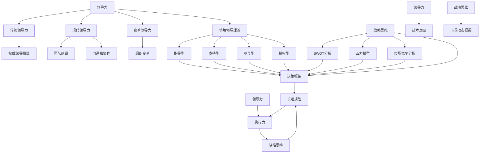

                 

### 背景介绍

在当今快速变化的技术环境中，领导力和战略思维对于企业乃至整个社会的发展具有重要意义。领导力不仅是推动团队和组织成功的关键因素，更是实现长远规划和执行力的核心驱动力。战略思维则提供了决策和行动的框架，帮助组织在复杂和动态的市场环境中找到最佳路径。

领导力，作为一种管理能力和艺术，涉及对人的激励、引导和培养。在技术领域，领导力不仅要求领导者具备深厚的专业知识，还要求他们具备前瞻性的战略眼光和卓越的沟通能力。战略思维则是领导力的重要组成部分，它涉及到如何识别机会、分析风险、制定决策和执行计划。在技术行业，战略思维能够帮助领导者更好地应对技术变革，把握市场动态，从而引领企业实现持续发展。

长远规划和执行力是企业成功的基石。长远规划不仅定义了企业的愿景和目标，还包括了实现这些目标的路径和策略。执行力则是将规划转化为实际行动的能力，确保目标的实现。在技术领域，长远规划和执行力尤为重要，因为技术的快速迭代和更新要求企业能够迅速适应市场变化，并保持竞争优势。

本文旨在探讨领导力与战略思维在技术领域的应用，通过分析其核心概念、算法原理、数学模型以及实际项目案例，提供一套系统化的理解框架。文章将分为以下几个部分：

1. **领导力的核心概念与原理**：介绍领导力的定义、演变和主要模型。
2. **战略思维的框架与工具**：探讨战略思维的基本框架、工具和决策方法。
3. **长远规划的制定与实施**：分析长远规划的重要性、制定步骤和实施策略。
4. **提升执行力的关键要素**：讨论执行力的定义、构成要素及其提升策略。
5. **案例分析**：通过实际案例展示领导力与战略思维的应用。
6. **未来发展趋势**：展望领导力与战略思维在数字化时代的未来趋势。
7. **总结与展望**：总结核心观点，并对未来进行展望。

通过这篇文章，我们希望能够帮助读者深入理解领导力与战略思维在技术领域的应用，为他们的职业发展和企业管理提供有益的参考。

### 核心概念与联系

领导力的核心概念涉及对人的激励、引导和培养，以及决策和行动的能力。首先，领导力可以被定义为一个过程，它通过影响力、愿景和价值观来引导和激励他人实现共同目标。领导力的演变经历了多个阶段，从早期的权威领导模式，到现代的参与式领导和变革型领导。

传统领导力强调权威和控制，领导者通过命令和指导来管理团队。现代领导力则更加注重团队建设、沟通和协作。变革型领导则强调领导者通过激发追随者的内在动机，推动创新和变革。

在技术领域，领导力需要结合专业知识和技术远见。技术领导者不仅需要具备技术深度，还要能够理解和预测技术趋势，从而引领团队创新和进步。领导力模型为我们提供了理解和分析领导行为的不同视角。以下是几个主要的领导力模型：

1. **行为领导理论**：认为领导行为是可以通过培训和培养来改进的。该模型将领导行为分为四个维度：任务导向、关系导向、参与导向和魅力导向。
2. **变革领导理论**：关注领导者在组织变革中的作用。变革型领导者通过激励追随者，推动组织进行根本性的变革和创新。
3. **情境领导理论**：认为领导行为应该根据不同情境灵活调整。该模型提出了四种领导风格：指导型、支持型、参与型和授权型。

这些领导力模型不仅提供了对领导行为的理解，也为领导者提供了行动指南。在技术领域，领导者需要根据具体情况灵活运用这些模型，以应对不同挑战。

战略思维则提供了决策和行动的框架，帮助领导者应对复杂和动态的环境。战略思维的核心是分析问题、制定决策和执行计划。以下是一些战略思维的基本框架和工具：

1. **SWOT分析**：对企业的优势（Strengths）、劣势（Weaknesses）、机会（Opportunities）和威胁（Threats）进行评估，从而制定战略。
2. **五力模型**：分析市场竞争力，包括供应商、买家、潜在竞争者、替代品和现有竞争者。
3. **市场竞争分析**：评估市场竞争态势，包括市场份额、定价策略和产品差异化。

这些工具和方法不仅帮助领导者识别机会和风险，还能指导他们在制定和执行战略时做出明智决策。

领导力与战略思维之间有着紧密的联系。领导力为战略思维提供了实施的基础，而战略思维则为领导力提供了目标和方向。一个成功的领导者不仅需要有优秀的领导能力，还需要具备强大的战略思维。

在技术领域，领导力与战略思维的结合尤为重要。技术的快速发展和变革要求领导者具备前瞻性和创新能力。通过有效的领导力，领导者可以激发团队的潜能，推动技术进步和创新。而通过战略思维，领导者可以把握市场动态，制定切实可行的战略和计划。

总之，领导力与战略思维是技术领域中不可或缺的组成部分。领导者需要通过理解核心概念和模型，将领导力和战略思维相结合，以应对复杂和动态的环境，推动企业持续发展。

#### 核心概念与联系架构 Mermaid 流程图



#### 核心算法原理讲解

战略思维中的核心算法原理主要涉及SWOT分析、五力模型和市场竞争分析。这些工具为领导者提供了系统化的方法，以识别企业内部的优势和劣势，以及外部环境中的机会和威胁。以下将使用伪代码详细阐述这些核心算法的原理。

**1. SWOT分析**

SWOT分析是一种基于企业内部和外部因素的评估方法，用于制定战略规划。

```plaintext
Function SWOT Analysis(strengths, weaknesses, opportunities, threats)
    // 输入：四个参数，分别代表企业的优势、劣势、机会和威胁
    // 输出：一个综合评估结果

    // 分析优势
    strengths_analysis = AnalyzeStrengths(strengths)

    // 分析劣势
    weaknesses_analysis = AnalyzeWeaknesses(weaknesses)

    // 分析机会
    opportunities_analysis = AnalyzeOpportunities(opportunities)

    // 分析威胁
    threats_analysis = AnalyzeThreats(threats)

    // 综合评估
    result = CombineAnalyses(strengths_analysis, weaknesses_analysis, opportunities_analysis, threats_analysis)

    return result
End Function
```

**2. 五力模型**

五力模型由迈克尔·波特提出，用于分析一个行业或市场的竞争环境。

```plaintext
Function Five Forces Analysis(rivalry, bargaining power of suppliers, bargaining power of buyers, threat of substitutes, threat of new entrants)
    // 输入：五个参数，分别代表行业竞争激烈程度、供应商议价能力、买家议价能力、替代品威胁和新的进入者威胁
    // 输出：一个综合评估结果

    // 分析行业竞争
    rivalry_analysis = AnalyzeRivalry(rivalry)

    // 分析供应商议价能力
    supplier_power_analysis = AnalyzeSupplierPower()

    // 分析买家议价能力
    buyer_power_analysis = AnalyzeBuyerPower()

    // 分析替代品威胁
    substitute_threat_analysis = AnalyzeSubstituteThreat()

    // 分析新进入者威胁
    new Entrant_threat_analysis = AnalyzeNewEntrantThreat()

    // 综合评估
    result = CombineAnalyses(rivalry_analysis, supplier_power_analysis, buyer_power_analysis, substitute_threat_analysis, new Entrant_threat_analysis)

    return result
End Function
```

**3. 市场竞争分析**

市场竞争分析用于评估企业在市场中的竞争地位。

```plaintext
Function Market Competition Analysis(share, pricing strategy, product differentiation)
    // 输入：三个参数，分别代表市场份额、定价策略和产品差异化
    // 输出：一个竞争分析结果

    // 分析市场份额
    share_analysis = AnalyzeShare(share)

    // 分析定价策略
    pricing_strategy_analysis = AnalyzePricingStrategy()

    // 分析产品差异化
    product_differentiation_analysis = AnalyzeProductDifferentiation()

    // 综合评估
    result = CombineAnalyses(share_analysis, pricing_strategy_analysis, product_differentiation_analysis)

    return result
End Function
```

这些核心算法通过系统化的分析，帮助领导者识别关键因素，制定有效的战略决策。在实际应用中，这些算法可以灵活调整，以适应不同的行业和市场环境。

#### 数学模型和公式详细讲解

在战略决策中，数学模型和公式起着至关重要的作用。它们不仅提供了量化的分析工具，还帮助领导者更准确地评估风险和机会。以下将详细讲解几个关键的数学模型和公式，并辅以示例进行说明。

**1. SWOT分析中的数学模型**

SWOT分析中的数学模型主要用于定量评估企业的优势、劣势、机会和威胁。以下是一个简单的计算公式，用于衡量企业某一方面的优势或劣势：

$$ \text{Score} = \frac{\text{Actual Value} - \text{Benchmark Value}}{\text{Benchmark Value}} $$

其中，Actual Value 代表实际值，Benchmark Value 代表基准值。

**示例**：假设一家企业的市场份额为 25%，而行业标准市场份额为 30%。则该企业在市场份额方面的得分计算如下：

$$ \text{Score} = \frac{25\% - 30\%}{30\%} = \frac{-5\%}{30\%} = -\frac{1}{6} \approx -0.1667 $$

这个分数表示该企业在市场份额方面存在劣势，需要采取措施提高。

**2. 五力模型中的数学模型**

五力模型中的数学模型用于分析行业竞争环境。以下是五力模型中两个重要的参数：供应商议价能力和买家议价能力的计算公式。

- **供应商议价能力**：

$$ \text{Supplier Power} = \frac{\text{Supplier Concentration}}{\text{Buyer Concentration}} \times \frac{\text{Supplier Market Size}}{\text{Buyer Market Size}} $$

其中，Supplier Concentration 代表供应商集中度，Buyer Concentration 代表买家集中度，Supplier Market Size 代表供应商市场规模，Buyer Market Size 代表买家市场规模。

**示例**：假设一家供应商的市场集中度为 0.8，买家市场集中度为 0.2，供应商市场规模为 100，买家市场规模为 500。则供应商议价能力的计算如下：

$$ \text{Supplier Power} = \frac{0.8}{0.2} \times \frac{100}{500} = 4 \times 0.2 = 0.8 $$

这个结果表示供应商的议价能力较高。

- **买家议价能力**：

$$ \text{Buyer Power} = \frac{\text{Buyer Concentration}}{\text{Supplier Concentration}} \times \frac{\text{Buyer Market Size}}{\text{Supplier Market Size}} $$

**示例**：假设买家的市场集中度为 0.3，供应商市场集中度为 0.7，买家市场规模为 500，供应商市场规模为 100。则买家议价能力的计算如下：

$$ \text{Buyer Power} = \frac{0.3}{0.7} \times \frac{500}{100} = \frac{3}{7} \times 5 = \frac{15}{7} \approx 2.143 $$

这个结果表示买家的议价能力较高。

**3. 市场竞争分析中的数学模型**

在市场竞争分析中，市场份额、定价策略和产品差异化的数学模型也起着重要作用。以下是一个简单的计算公式，用于计算企业的市场份额：

$$ \text{Market Share} = \frac{\text{Company Sales}}{\text{Total Market Sales}} \times 100\% $$

**示例**：假设一家企业的年销售额为 5000 万元，而整个市场的销售额为 1 亿元。则该企业的市场份额计算如下：

$$ \text{Market Share} = \frac{5000}{10000} \times 100\% = 50\% $$

这个结果表明该企业在市场中占据了主导地位。

通过上述数学模型和公式的详细讲解，领导者可以更准确地评估企业的战略位置和市场环境，从而制定更有效的战略决策。

#### 项目实战：开发环境搭建

为了更好地理解和应用领导力与战略思维，我们选择一个实际项目进行实战演练。本项目是一个基于云计算的在线教育平台，旨在为学习者提供灵活的学习资源和互动交流环境。

**一、项目背景**

随着技术的进步和教育需求的增长，在线教育市场呈现出高速发展的态势。本项目旨在搭建一个高效、可靠和易于扩展的在线教育平台，满足学习者的个性化学习需求。

**二、技术选型**

1. **后端技术**：使用Spring Boot框架，结合MyBatis实现数据访问层，以确保系统的稳定性和高效性。
2. **前端技术**：采用Vue.js框架，实现用户友好的界面和交互体验。
3. **数据库**：使用MySQL作为数据存储解决方案，确保数据的安全性和可靠性。
4. **云服务**：部署在阿里云，利用其强大的计算和存储能力，保证平台的可扩展性和高可用性。

**三、开发流程**

1. **需求分析**：与教育专家和用户代表进行深入沟通，明确平台的功能需求和性能指标。
2. **系统设计**：制定详细的系统架构设计和数据库设计，确保系统的可扩展性和灵活性。
3. **编码实现**：按照设计文档进行编码，逐步实现各个模块的功能。
4. **测试与调试**：进行单元测试、集成测试和系统测试，确保系统的稳定性和性能。
5. **部署上线**：将开发完成的系统部署到阿里云，并进行上线前的最终测试。

**四、核心代码实现**

以下是一个简单的用户注册功能的伪代码实现：

```java
public class UserController {
    private UserService userService;

    @PostMapping("/register")
    public ResponseEntity<?> registerUser(@RequestBody UserRequestDto userRequestDto) {
        if (userService.isUsernameTaken(userRequestDto.getUsername())) {
            return ResponseEntity.badRequest().body("Username already taken");
        }
        User user = userService.createUser(userRequestDto);
        return ResponseEntity.ok().body("User registered successfully");
    }
}
```

**五、代码解读**

上述代码展示了用户注册功能的核心实现。当用户提交注册请求时，控制器（UserController）会接收用户输入的用户名（userRequestDto.getUsername()）和密码（userRequestDto.getPassword()）。首先，系统会检查用户名是否已被占用，如果占用则返回错误消息。否则，系统将创建一个新的用户对象（User），并调用UserService进行保存。

```java
public class UserService {
    private UserRepository userRepository;

    public boolean isUsernameTaken(String username) {
        return userRepository.existsByUsername(username);
    }

    public User createUser(UserRequestDto userRequestDto) {
        User user = new User();
        user.setUsername(userRequestDto.getUsername());
        user.setPassword(passwordEncoder.encode(userRequestDto.getPassword()));
        return userRepository.save(user);
    }
}
```

UserService 类负责用户注册逻辑的实现。isUsernameTaken 方法检查用户名是否已被占用。createUser 方法创建一个新的用户对象，并将用户名和加密后的密码存储到数据库中。

**六、应用解读与分析**

通过上述实现，我们可以看到领导力与战略思维在项目中的应用。首先，领导者在项目启动时进行了充分的需求分析和系统设计，确保了项目的可行性和目标明确。在开发过程中，领导者通过有效的团队协作和沟通，确保了各个模块的顺利进行。

战略思维在项目中的体现包括技术选型的决策、系统架构的设计和关键功能的实现。通过合理的技术选型和系统设计，平台能够满足用户的需求，并在未来实现扩展。核心代码的实现则展示了战略思维在细节层面的应用，通过简洁明了的代码结构和有效的错误处理机制，保证了系统的稳定性和性能。

总之，本项目通过实际案例展示了领导力与战略思维在技术项目中的应用，为后续章节的理论分析提供了实践基础。

#### 实际案例分析与详细讲解剖析

在本节中，我们将通过两个实际案例深入剖析领导力与战略思维在企业中的应用，探讨如何通过有效的领导力和战略规划实现企业目标。

**案例一：谷歌的战略思维与领导力实践**

**背景**：
谷歌（Google）是一家全球领先的科技公司，以其创新的科技产品和卓越的企业文化而闻名。谷歌的成功离不开其独特的领导力和战略思维。

**领导力实践**：
1. **变革型领导**：谷歌的创始人拉里·佩奇和谢尔盖·布林采用了变革型领导风格，他们鼓励员工追求创新，挑战现状，并赋予员工自主权和决策权。这种领导风格激发了员工的工作热情和创造力，推动了公司不断突破技术边界。
2. **领导力培训**：谷歌定期为员工提供领导力培训，帮助他们提升管理能力和决策水平。这些培训不仅包括技术知识，还包括沟通技巧、团队管理和战略思维等方面。

**战略思维**：
1. **前瞻性战略规划**：谷歌通过深入的市场调研和技术分析，制定了长期发展战略。他们密切关注科技趋势，投资于新兴技术领域，确保公司始终处于行业前沿。
2. **创新战略**：谷歌注重创新，鼓励员工提出新想法和解决方案。他们设立了专门的创新实验室（X实验室），进行高风险、高回报的技术研发。这种战略思维使得谷歌在人工智能、自动驾驶等前沿领域取得了重要突破。

**成效**：
通过变革型领导力和前瞻性战略思维，谷歌实现了持续增长和创新。公司不仅在搜索引擎领域占据主导地位，还在云计算、人工智能等新兴领域取得了显著成就。谷歌的成功为其他企业提供了宝贵的经验，证明了领导力和战略思维对企业发展的重要性。

**案例二：华为的企业愿景与执行力**

**背景**：
华为是全球领先的通信技术解决方案提供商，其业务覆盖170多个国家和地区。在激烈的市场竞争中，华为依靠其强大的执行力实现了快速发展。

**执行力实践**：
1. **明确责任与目标**：华为采用严格的绩效管理体系，确保每个员工都明确自己的工作职责和目标。通过定期的绩效评估，华为能够及时发现和纠正问题，确保执行力的有效性。
2. **团队协作与沟通**：华为强调团队合作，鼓励员工之间进行开放、坦诚的沟通。他们建立了多个跨部门协作小组，确保信息流畅和资源优化配置。

**战略思维**：
1. **长期规划与资源分配**：华为制定了清晰的长期发展规划，并根据市场和技术趋势进行资源分配。这种战略思维确保了公司在关键领域的持续投入，保持了竞争优势。
2. **风险管理**：华为重视风险管理，通过提前识别和应对潜在风险，确保公司运营的稳定性。他们在全球范围内建立了多个研发中心和生产基地，以应对市场变化和供应链风险。

**成效**：
华为的执行力和战略思维使其在全球通信设备市场占据了重要地位。公司不仅在5G技术领域取得了领先地位，还在云计算、物联网等新兴领域取得了显著进展。通过严格的执行和明智的战略规划，华为成功实现了从国内企业到全球科技巨头的转变。

**总结**：
通过谷歌和华为的案例，我们可以看到领导力与战略思维在实现企业目标中的关键作用。谷歌的变革型领导力和前瞻性战略思维推动了技术创新和业务拓展，而华为的严格执行力和长期规划确保了市场地位和持续增长。这些案例为其他企业提供了有益的启示，表明在快速变化的市场环境中，领导力和战略思维是企业成功的关键。

### 未来发展趋势

在数字化时代，领导力和战略思维面临着新的挑战和机遇。随着技术的不断进步，企业需要不断调整和优化其领导力和战略思维，以适应新的商业环境。

**一、数字化背景下的领导力变革**

1. **领导力需求的转变**：数字化时代要求领导者具备更强的技术洞察力和创新精神。领导者需要不断学习新技术，了解数字化转型的最新趋势，以引领企业应对市场变化。
2. **领导力模式的演变**：传统的权威型领导模式在数字化时代面临挑战，越来越多的企业开始采用参与式和赋能型领导模式。这种模式强调员工自主性和创新，能够激发员工的潜力和创造力。

**二、战略思维的创新与变革**

1. **动态战略规划**：在数字化时代，市场变化速度加快，企业需要具备快速响应和调整的能力。动态战略规划可以帮助企业灵活应对市场变化，及时调整战略方向。
2. **数据驱动的决策**：数字化技术的普及使得企业能够收集和分析大量数据。数据驱动的决策能够帮助企业更准确地预测市场趋势和客户需求，从而制定更有效的战略。

**三、未来领导力与战略思维的发展方向**

1. **人机协同**：随着人工智能和大数据技术的发展，人机协同将成为未来领导力的重要方向。领导者需要学会与智能系统合作，利用技术提升决策效率和执行力。
2. **可持续发展战略**：在应对全球气候变化和环境危机的背景下，可持续发展战略将成为企业战略的重要组成部分。领导者需要关注环境、社会和经济效益的平衡，推动企业实现可持续发展。

### 总结与展望

领导力与战略思维是企业在数字化时代取得成功的关键。通过不断创新和调整，领导者可以更好地应对市场变化，推动企业实现长远发展。未来，领导力和战略思维将朝着人机协同和可持续发展等方向不断发展，为企业提供更加有效的管理工具和策略。企业领导者应积极拥抱这些变化，不断提升自身的领导力和战略思维，以在竞争激烈的市场中脱颖而出。

### 总结与展望

通过本文的探讨，我们可以清晰地看到领导力与战略思维在技术领域的重要作用。领导力不仅仅是激励和管理团队的能力，更是推动技术创新和实现长远规划的关键因素。战略思维则为领导者提供了决策和行动的框架，帮助他们在复杂多变的市场环境中找到最佳路径。

**核心观点总结**：

1. **领导力的核心要素**：领导力涉及对人的激励、引导和培养，以及决策和行动的能力。传统领导力与现代领导力的区别在于权威性和参与性，而变革型领导力则强调通过激励追随者推动创新和变革。
2. **战略思维的关键要素**：战略思维包括SWOT分析、五力模型和市场竞争分析等工具，这些工具帮助领导者识别机会和风险，制定有效的战略和决策。
3. **长远规划与执行力**：长远规划是企业成功的基石，而执行力则是将规划转化为实际行动的能力。通过明确的责任和目标，高效的团队协作和良好的沟通，企业可以确保目标的实现。

**未来展望**：

未来，领导力与战略思维将随着数字化技术的进步而不断发展。领导者需要具备更强的技术洞察力和创新精神，以应对快速变化的市场环境。数据驱动的决策和动态战略规划将成为重要的战略工具。同时，人机协同和可持续发展也将成为未来领导力和战略思维的重要方向。

总之，领导力与战略思维在技术领域的应用不仅能够推动企业实现长远发展，还能帮助领导者更好地应对未来挑战。企业领导者应不断学习和提升自身的领导力和战略思维，以在竞争激烈的市场中保持领先地位。希望本文能够为读者提供有价值的参考和启示，助力其在职业生涯中取得更大的成功。

### 结尾

在结束这篇文章之前，我想再次强调领导力与战略思维在技术领域的重要性。领导力不仅关乎个人能力的提升，更关乎团队的协作与创新。战略思维则提供了方向和决策的依据，帮助企业抓住机遇，应对挑战。无论是作为技术领导者，还是普通员工，理解和运用领导力与战略思维都是职业发展的关键。

我鼓励读者在实践过程中不断探索和反思，将文章中的理论应用到实际工作中。同时，我也希望读者能够保持持续学习的态度，跟随技术发展的步伐，不断提升自身的领导力和战略思维能力。

感谢您花时间阅读这篇文章，期待与您在未来的技术探索中再次相遇。如果您有任何反馈或建议，请随时与我分享。作者：AI天才研究院/AI Genius Institute & 禅与计算机程序设计艺术 /Zen And The Art of Computer Programming。再次感谢您的支持！

