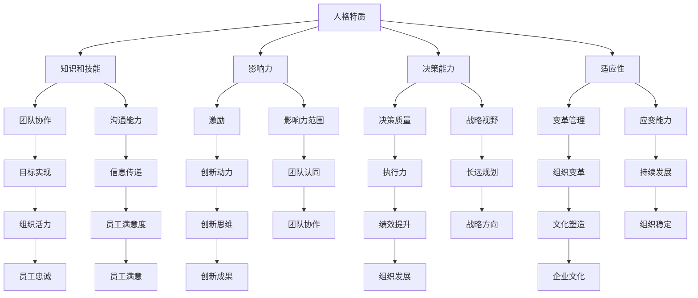
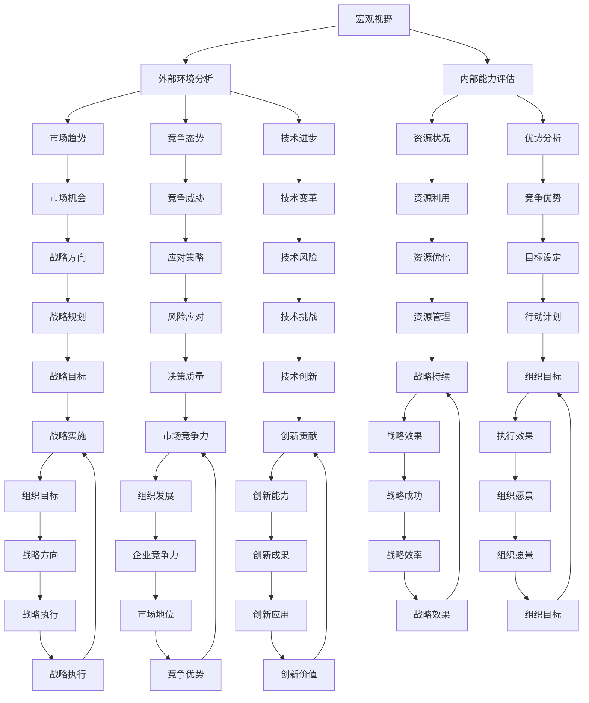
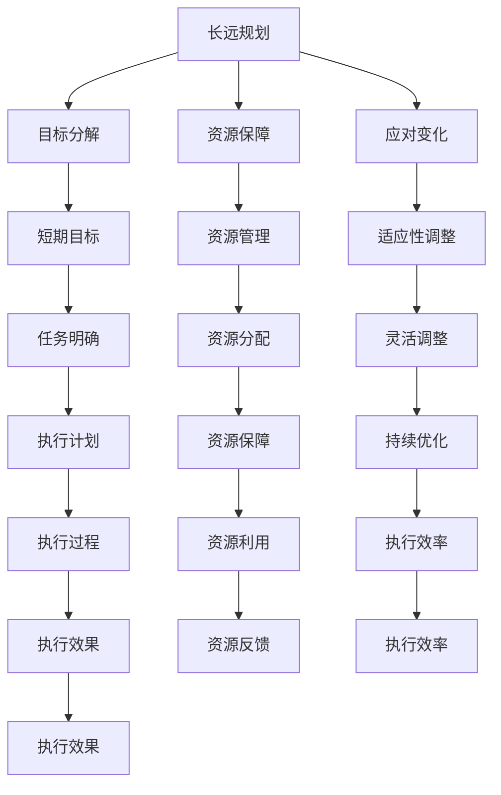

                 

### 文章标题：领导力与战略思维：长远规划与短期执行的平衡

#### 关键词：领导力、战略思维、长远规划、短期执行、平衡

#### 摘要：
在快速变化的技术时代，领导力与战略思维成为企业成功的关键。本文深入探讨领导力的本质及其与战略思维的结合，阐述长远规划与短期执行之间的平衡，通过实际案例分析，提出有效的领导力实践策略，为企业在复杂环境中实现持续发展提供理论支持和实践指导。

### 引言

在当今高度动态和竞争激烈的市场环境中，企业的生存和发展离不开有效的领导力和战略思维。领导力不仅仅是对团队的领导，更是对企业整体战略方向的把握和执行。战略思维则强调从全局出发，制定和实施长远规划，同时灵活应对短期变化。两者的结合能够帮助企业在复杂环境中保持竞争优势，实现长期可持续发展。

本文将从以下几个方面展开讨论：

1. **领导力的本质与重要性**
2. **战略思维的基础与核心**
3. **长远规划与短期执行的平衡**
4. **领导力实践：技能培养与战略应用**
5. **案例分析：成功与失败的经验教训**
6. **领导力与战略思维的融合与发展趋势**
7. **结论与未来展望**

通过系统化的分析和实例讲解，本文旨在为读者提供关于领导力与战略思维的深入理解和实用指南。

### 第一部分：领导力概述

#### 第1章：领导力的本质

领导力是一种通过影响力引导和激励他人共同实现目标的能力。它不仅涉及个人技能和特质，还涉及领导者在组织中的角色和责任。以下是对领导力的详细定义、重要性及其核心要素的探讨。

#### 1.1 领导力的定义

领导力可以被视为一种动态的过程，它涉及个体或集体通过影响力、沟通和激励来引导他人达成共同目标的能力。领导力不仅仅是一种职位或角色的赋予，更是一种责任和能力的体现。从广义上讲，领导力包括以下几个方面：

1. **影响力**：领导者通过个人魅力、专业知识、道德标准和价值观来影响他人。
2. **沟通**：领导者通过有效的沟通技巧，确保信息准确传达，促进团队协作。
3. **激励**：领导者通过激励措施，如奖励和认可，激发团队成员的积极性和创造力。
4. **决策**：领导者需要在不确定性和压力下做出明智的决策，引导团队前进。
5. **变革管理**：领导者推动组织变革，适应外部环境和内部需求的变化。

#### 1.2 领导力的重要性

领导力在企业中扮演着至关重要的角色，它直接影响到组织的绩效、创新能力和员工满意度。以下是领导力重要性的几个方面：

1. **组织绩效**：有效的领导力能够提高团队的协作效率，促进目标的实现，从而提升整个组织的绩效。
2. **创新能力**：领导者通过激励和引导，鼓励创新思维和尝试，推动组织持续创新。
3. **员工满意度**：领导者的行为和决策对员工的满意度和忠诚度有着直接影响，进而影响到组织的稳定性和发展。
4. **文化塑造**：领导者通过自身的行为和价值观，塑造组织的文化和氛围，影响员工的行为和态度。

#### 1.3 领导力的核心要素

领导力的核心要素包括以下几个方面：

1. **人格特质**：领导者的个人特质，如自信、诚实、正直和责任感，对领导力的有效性有重要影响。
2. **知识和技能**：领导者需要具备相关的专业知识和管理技能，以确保团队的工作高效和有序。
3. **影响力**：领导者需要能够影响和激励他人，使其愿意追随和努力实现共同目标。
4. **决策能力**：领导者需要在复杂和不确定的环境下做出明智的决策，引导团队前进。
5. **适应性**：领导者需要具备适应变化的能力，能够灵活应对外部和内部环境的变化。

#### Mermaid 流程图：领导力核心要素关系架构



通过上述流程图，我们可以清晰地看到领导力的核心要素及其相互之间的关系。这些要素共同构成了一个完整的领导力框架，帮助领导者更好地引领团队实现组织目标。

### 第二部分：战略思维基础

#### 第2章：战略思维基础

战略思维是领导者制定和实施长远规划的核心能力，它涉及从全局出发，分析外部环境，制定战略目标，并制定相应的行动计划。以下是战略思维的详细定义、重要性及其核心要素。

#### 2.1 战略思维的定义

战略思维是一种思考方式，它强调从宏观和长远的角度审视问题，分析外部环境，制定战略目标和行动计划。战略思维不仅仅是制定计划，更是一个持续的过程，涉及以下几个关键方面：

1. **外部环境分析**：战略思维要求领导者关注外部环境的变化，如市场趋势、竞争态势、技术进步等，以制定相应的应对策略。
2. **内部能力评估**：领导者需要评估组织的内部资源、能力和优势，以便在战略制定过程中充分利用这些资源。
3. **目标设定**：战略思维强调设定清晰且具有挑战性的目标，这些目标应与组织的愿景和使命相一致。
4. **资源分配**：领导者需要根据战略目标和资源状况，合理分配资源，确保行动计划的有效执行。
5. **风险管理**：战略思维要求领导者识别和应对潜在的风险，确保战略实施的稳定性。

#### 2.2 战略思维的重要性

战略思维在组织中具有重要性，主要体现在以下几个方面：

1. **明确方向**：战略思维帮助组织明确长期发展方向，确保资源的有效利用和目标的实现。
2. **应对不确定性**：通过分析外部环境和内部能力，战略思维帮助组织更好地应对市场变化和不确定性。
3. **提高竞争力**：有效的战略思维能够提高组织的市场竞争力，使其在激烈的市场环境中脱颖而出。
4. **创新驱动**：战略思维鼓励领导者从长远角度思考创新，推动组织持续发展。
5. **持续改进**：战略思维是一个持续的过程，它促使组织不断反思和改进，以适应不断变化的环境。

#### 2.3 战略思维的核心要素

战略思维的核心要素包括以下几个方面：

1. **宏观视野**：领导者需要具备宏观视野，从整体和长远的角度审视问题，把握组织的发展方向。
2. **系统思维**：战略思维要求领导者具备系统思维，能够分析组织内外部的各种因素及其相互关系。
3. **创新思维**：战略思维鼓励领导者具备创新思维，勇于尝试新的方法和策略，推动组织变革和进步。
4. **决策能力**：领导者需要在复杂和不确定的环境中做出明智的决策，确保战略目标的实现。
5. **执行力**：战略思维强调执行力，确保战略规划能够有效地转化为实际行动。

#### Mermaid 流程图：战略思维核心要素关系架构



通过上述流程图，我们可以清晰地看到战略思维的核心要素及其相互之间的关系。这些要素共同构成了一个完整的战略思维框架，帮助领导者更好地制定和实施战略规划。

### 第三部分：长远规划与短期执行的平衡

#### 第3章：长远规划与短期执行的平衡

在现代企业中，长远规划和短期执行的有效平衡是确保组织持续发展的关键。长远规划为组织指明了发展方向和目标，而短期执行则确保这些目标能够逐步实现。本章将探讨长远规划的重要性、短期执行的关键点，以及实现二者平衡的方法。

#### 3.1 长远规划的重要性

长远规划是企业战略管理的重要组成部分，它有助于组织明确未来发展方向，为长期成功奠定基础。以下是长远规划的重要性的几个方面：

1. **明确发展方向**：长远规划帮助组织确定长期目标，明确未来的发展方向，确保资源的合理配置。
2. **应对不确定性**：通过预测未来趋势和可能的风险，长远规划有助于组织提前准备，降低不确定性带来的负面影响。
3. **资源优化配置**：长远规划有助于组织优化资源配置，确保关键资源的有效利用，提高整体运营效率。
4. **持续创新**：长远规划鼓励组织进行持续创新，推动技术进步和业务模式变革，保持竞争优势。
5. **文化塑造**：长远规划有助于塑造组织文化，形成共同的目标和价值观，增强员工的归属感和凝聚力。

#### 3.2 短期执行的关键点

短期执行是实现长远规划的重要环节，它需要高效的执行力和良好的团队协作。以下是短期执行的关键点：

1. **目标明确**：短期执行需要明确具体的目标和任务，确保每个团队成员都清楚自己的职责和期望成果。
2. **资源保障**：短期执行需要确保资源的充足供应，包括人力、物力和财力，以支持任务的顺利完成。
3. **过程监控**：短期执行过程中，领导者需要实时监控进度和质量，及时发现和解决问题，确保任务的按计划进行。
4. **激励机制**：有效的激励机制能够激发团队成员的积极性和创造力，提高执行效率和效果。
5. **反馈与改进**：短期执行结束后，需要对执行效果进行评估和反馈，总结经验教训，为下一次执行提供参考。

#### 3.3 长远规划与短期执行的平衡方法

实现长远规划与短期执行的平衡是一个动态的过程，需要领导者具备战略眼光和执行力。以下是几种实现平衡的方法：

1. **目标分解**：将长远规划分解为短期目标，确保每个短期目标都与长远规划保持一致，同时具有可执行性。
2. **灵活调整**：根据外部环境和内部情况的变化，灵活调整长远规划和短期执行计划，确保两者的一致性和适应性。
3. **持续沟通**：加强领导者与团队成员之间的沟通，确保信息透明和及时，促进双方对目标和执行计划的深入理解。
4. **绩效评估**：建立科学合理的绩效评估体系，对短期执行效果进行量化评估，为长远规划的调整提供依据。
5. **团队协作**：鼓励团队合作，建立跨部门协作机制，确保长远规划和短期执行的有效结合。

#### Mermaid 流�程图：长远规划与短期执行关系架构



通过上述流程图，我们可以清晰地看到长远规划与短期执行之间的关系及其动态平衡过程。这些方法和策略帮助领导者更好地协调长远规划和短期执行，实现组织的持续发展。

### 第四部分：领导力实践

#### 第4章：领导力技能培养

领导力并非与生俱来，而是可以通过持续的培养和实践获得的。本章将探讨如何培养领导力，包括沟通技能、决策技能和领导者自我管理技能，这些技能对于领导者来说至关重要。

#### 4.1 沟通技能

沟通技能是领导者必备的技能之一，它直接影响领导效果和团队协作。以下是几种关键的沟通技能：

1. **有效倾听**：领导者需要学会倾听，理解团队成员的需求和意见，建立信任和合作关系。
2. **清晰表达**：领导者需要具备清晰、简洁的表达能力，确保信息准确传达，避免误解和冲突。
3. **积极反馈**：领导者需要给予团队成员及时的反馈，鼓励正面行为，纠正错误，促进个人和团队成长。
4. **跨文化沟通**：在全球化背景下，领导者需要具备跨文化沟通能力，理解和尊重不同文化背景的团队成员。
5. **非语言沟通**：领导者需要注意自己的身体语言、面部表情和语调，这些非语言因素同样影响沟通效果。

#### 4.2 决策技能

决策技能是领导者面对复杂环境和挑战时的重要能力。以下是几种关键的决策技能：

1. **分析能力**：领导者需要具备强大的分析能力，从多个角度评估问题的各个方面，做出明智的决策。
2. **风险评估**：领导者需要识别和评估决策可能带来的风险，制定相应的应对策略，降低风险的影响。
3. **灵活调整**：在执行决策的过程中，领导者需要具备灵活调整的能力，根据实际情况及时调整决策，确保目标的实现。
4. **快速决策**：在某些紧急情况下，领导者需要具备快速决策的能力，以避免问题的扩大和损失。
5. **民主决策**：领导者可以借助团队的力量，通过民主决策方式，提高决策的公正性和有效性。

#### 4.3 领导者自我管理技能

领导者自我管理是提高领导力的重要途径，以下是一些关键的自我管理技能：

1. **时间管理**：领导者需要合理安排时间，优先处理重要和紧急的任务，提高工作效率。
2. **情绪管理**：领导者需要学会控制自己的情绪，保持冷静和理智，避免情绪波动对决策和团队氛围产生负面影响。
3. **自我反思**：领导者需要定期进行自我反思，总结经验教训，不断改进自己的领导方法和技能。
4. **持续学习**：领导者需要具备持续学习的能力，不断更新知识和技能，跟上时代的发展。
5. **健康管理**：领导者需要关注自己的身体健康，保持良好的生活习惯，为长期领导力奠定基础。

#### 伪代码：领导力技能培养流程

```python
# 领导力技能培养流程

def cultivate_leadership_skills():
    # 学习沟通技能
    learn_communication_skills()
    # 学习决策技能
    learn_decision_making_skills()
    # 学习自我管理技能
    learn_self_management_skills()
    # 持续实践和反馈
    while True:
        practice_skills()
        receive_feedback()
        reflect_and_improve()

def learn_communication_skills():
    # 有效倾听
    effective_listening()
    # 清晰表达
    clear_expression()
    # 积极反馈
    positive_feedback()
    # 跨文化沟通
    cross_cultural_communication()
    # 非语言沟通
    nonverbal_communication()

def learn_decision_making_skills():
    # 分析能力
    analytical_ability()
    # 风险评估
    risk_evaluation()
    # 灵活调整
    flexible_adjustment()
    # 快速决策
    rapid_decision_making()
    # 民主决策
    democratic_decision_making()

def learn_self_management_skills():
    # 时间管理
    time_management()
    # 情绪管理
    emotional_management()
    # 自我反思
    self_reflection()
    # 持续学习
    continuous_learning()
    # 健康管理
    health_management()

def practice_skills():
    # 实践沟通技能
    practice_communication_skills()
    # 实践决策技能
    practice_decision_making_skills()
    # 实践自我管理技能
    practice_self_management_skills()

def receive_feedback():
    # 收集反馈
    collect_feedback()
    # 分析反馈
    analyze_feedback()

def reflect_and_improve():
    # 总结经验
    summarize_experience()
    # 改进方法
    improve_methods()

# 执行领导力技能培养流程
cultivate_leadership_skills()
```

通过上述伪代码，我们可以看到领导力技能培养的流程和步骤，这是一个持续的过程，需要领导者不断学习和实践，不断提高自己的领导能力。

### 第五部分：战略思维应用

#### 第5章：战略思维应用

战略思维不仅是一种思考方式，更是一种实践能力。本章将探讨战略思维的实际应用，包括战略规划流程、战略分析工具和战略实施策略。通过这些方法，领导者可以更好地制定和实施战略规划，推动组织的持续发展。

#### 5.1 战略规划流程

战略规划是一个系统的过程，涉及多个步骤，包括现状分析、目标设定、资源分配和执行监控。以下是战略规划的基本流程：

1. **现状分析**：领导者需要对组织的当前状况进行详细分析，包括市场环境、竞争态势、内部资源等，以了解组织的优势和劣势。
2. **目标设定**：根据现状分析的结果，设定清晰且具有挑战性的战略目标，这些目标应与组织的愿景和使命相一致。
3. **资源分配**：根据战略目标和资源状况，合理分配资源，确保关键资源的充足供应和有效利用。
4. **执行监控**：建立有效的监控机制，实时跟踪战略实施的进度和质量，及时调整和优化执行计划。

#### 5.2 战略分析工具

战略分析工具是战略思维的重要辅助手段，可以帮助领导者更好地理解和分析战略环境。以下是几种常用的战略分析工具：

1. **SWOT分析**：SWOT分析是一种常用的战略分析工具，通过分析组织的优势（Strengths）、劣势（Weaknesses）、机会（Opportunities）和威胁（Threats），帮助领导者制定相应的战略。
2. **PEST分析**：PEST分析是一种宏观环境分析工具，通过分析政治（Political）、经济（Economic）、社会（Social）和技术（Technological）因素，帮助领导者了解外部环境的变化。
3. **五力模型**：五力模型是一种用于分析市场竞争强度的工具，通过分析供应商、买家、潜在竞争者、替代品和行业内部竞争者，帮助领导者制定有效的市场竞争策略。
4. **价值链分析**：价值链分析是一种内部战略分析工具，通过分析组织的价值链活动，找出增加价值的机会和减少成本的方法，帮助领导者优化业务流程。

#### 5.3 战略实施策略

战略实施是将战略规划转化为实际行动的关键步骤，以下是一些有效的战略实施策略：

1. **领导力驱动**：领导者需要发挥核心作用，通过影响力、沟通和激励，确保战略规划的贯彻执行。
2. **团队协作**：鼓励团队协作，建立跨部门协作机制，确保战略目标的共同实现。
3. **激励机制**：建立有效的激励机制，包括薪酬、晋升和荣誉等，激励团队成员积极投入到战略实施中。
4. **资源保障**：确保资源的充足供应和合理分配，为战略实施提供有力支持。
5. **持续监控**：建立监控机制，实时跟踪战略实施的进度和质量，及时调整和优化执行计划。

#### 伪代码：战略规划与实施流程

```python
# 战略规划与实施流程

def strategic_planning_and_implementation():
    # 现状分析
    current_anlaysis()
    # 目标设定
    set_goals()
    # 资源分配
    allocate_resources()
    # 执行监控
    monitor_progress()

def current_anlaysis():
    # 进行SWOT分析
    perform_SWOT_analysis()
    # 进行PEST分析
    perform_PEST_analysis()
    # 进行五力模型分析
    perform_five_force_analysis()
    # 进行价值链分析
    perform_value_chain_analysis()

def set_goals():
    # 设定战略目标
    define_strategic_goals()
    # 确定关键绩效指标
    set_key_performance_indicators()

def allocate_resources():
    # 确保资源充足
    ensure_resource_availability()
    # 合理分配资源
    allocate_resources_efficiently()

def monitor_progress():
    # 建立监控机制
    establish_monitoring_mechanism()
    # 实时跟踪进度
    track_progress_real_time()
    # 及时调整和优化
    adjust_and_optimize_as_needed()

# 执行战略规划与实施流程
strategic_planning_and_implementation()
```

通过上述伪代码，我们可以看到战略规划与实施的基本流程和步骤，这是一个系统化的过程，需要领导者具备战略思维和执行力，确保战略目标的实现。

### 第六部分：长远规划与短期执行案例分析

#### 第6章：长远规划与短期执行案例分析

在本章节中，我们将通过实际案例的分析，探讨成功案例和失败案例中的经验和教训，旨在为读者提供长远规划与短期执行的实践指导。

#### 6.1 成功案例分析

成功案例展示了在长远规划与短期执行平衡方面，如何通过有效的策略实现组织目标。

**案例1：谷歌的长期愿景与短期创新**

**背景介绍**：谷歌成立于1998年，其长期愿景是“整合全球信息，使人人皆可访问并从中受益”。为了实现这一愿景，谷歌不断进行技术创新和市场扩展。

**核心概念与联系**：谷歌通过长期规划，明确了其愿景和战略目标。同时，通过短期执行，不断推出新的产品和服务，如搜索引擎、云计算和人工智能等。

**核心算法原理讲解**：谷歌的PageRank算法是其在搜索引擎领域的重要创新，通过分析网页之间的链接关系，评估网页的重要性，提供更精准的搜索结果。

**详细讲解与举例说明**：谷歌每年在研发上投入大量资金，确保技术创新和产品更新。例如，谷歌在2016年推出的TensorFlow开源机器学习框架，推动了人工智能领域的发展。

**数学模型和公式**：PageRank算法使用矩阵运算来计算网页的重要性，具体公式如下：

$$
PR(A) = \left(\frac{1-d}{N} + d \sum_{B \in LinksOut(A)} \frac{PR(B)}{L(B)} \right)
$$

其中，$PR(A)$ 为网页A的PageRank值，$d$ 为阻尼系数，$N$ 为网页总数，$LinksOut(A)$ 为指向网页A的链接集合，$L(B)$ 为网页B的出链数。

**项目实战**：谷歌的搜索引擎和云计算服务是其成功的关键项目。通过长期规划和短期执行，谷歌不断优化产品性能，提高用户体验。

**代码解读与分析**：谷歌的代码库和开源项目展示了其在技术创新和协作开发方面的优势。例如，TensorFlow代码库包含了丰富的机器学习算法和工具，方便开发者进行模型训练和部署。

**实际案例分析和详细讲解剖析**：谷歌通过其成功的长远规划和短期执行，成为全球领先的科技公司，推动了互联网和人工智能领域的发展。

**项目小结**：谷歌的成功经验表明，在长远规划与短期执行之间实现平衡，通过持续的创新和高效的执行，是企业实现持续发展的关键。

#### 6.2 失败案例分析

失败案例提供了宝贵的学习机会，帮助我们了解在长远规划与短期执行过程中可能遇到的挑战和问题。

**案例2：诺基亚的衰落**

**背景介绍**：诺基亚曾是全球最大的手机制造商之一，但在智能手机时代来临后，未能及时调整战略，导致市场份额大幅下降。

**核心概念与联系**：诺基亚在长远规划方面存在不足，未能及时适应市场变化和技术进步，导致在短期执行过程中面临巨大挑战。

**核心算法原理讲解**：诺基亚在功能手机时代取得了巨大成功，但在智能手机领域，其操作系统和产品创新滞后，无法满足消费者需求。

**详细讲解与举例说明**：诺基亚在2000年代初，未能及时投资于智能手机技术，导致其在智能手机市场的竞争中处于劣势。

**数学模型和公式**：虽然没有具体的数学模型，但诺基亚的战略决策过程可以看作是一种决策树模型，通过不同路径的选择，导致不同的发展结果。

**项目实战**：诺基亚在2007年推出了诺基亚N95，这是一款功能强大的智能手机，但在市场上未能取得预期成功。

**代码解读与分析**：诺基亚在功能手机时代的成功源于其强大的硬件和软件研发能力，但在智能手机时代，其操作系统和开发工具未能跟上竞争对手的步伐。

**实际案例分析和详细讲解剖析**：诺基亚的衰落是由于其在长远规划与短期执行之间的失衡，未能及时调整战略，导致市场地位被竞争对手取代。

**项目小结**：诺基亚的失败经验提醒我们，在快速变化的市场环境中，长远规划与短期执行必须保持动态平衡，及时适应外部环境的变化。

#### 6.3 案例启示与教训

通过成功和失败案例的分析，我们可以得出以下启示和教训：

1. **保持动态平衡**：长远规划与短期执行之间必须保持动态平衡，及时调整战略和执行计划，以应对外部环境的变化。
2. **重视技术创新**：技术创新是推动企业发展的关键因素，领导者必须具备前瞻性和创新意识，持续投资于研发和创新。
3. **强化执行力**：有效的执行是战略成功的关键，领导者需要建立高效的执行体系，确保战略目标的实现。
4. **灵活调整**：在执行过程中，领导者需要具备灵活调整的能力，根据实际情况及时调整战略和执行计划。
5. **团队合作**：团队合作和跨部门协作是确保长远规划和短期执行顺利实施的重要保障。

通过以上案例分析，读者可以更好地理解长远规划与短期执行的重要性，以及如何在实践中实现二者的平衡，为组织的发展提供有益的指导。

### 第七部分：领导力与战略思维的综合运用

#### 第7章：领导力与战略思维的综合运用

领导力与战略思维的融合是企业成功的关键。本章将探讨领导力与战略思维的结合点，以及在实际工作中的综合运用，为领导者提供具体的实践策略。

#### 7.1 领导力与战略思维的结合点

领导力与战略思维之间的结合点主要体现在以下几个方面：

1. **目标一致性**：领导力强调目标设定和执行，战略思维则强调目标的长期性和可实现性。两者结合，确保组织在实现短期目标的同时，不偏离长期战略。
2. **资源整合**：领导力涉及资源管理和分配，战略思维则关注资源的有效利用和优化。两者结合，有助于组织在战略规划阶段合理配置资源，提高执行效率。
3. **创新能力**：领导力鼓励创新思维和尝试，战略思维则强调通过创新推动组织的持续发展。两者结合，形成创新驱动的战略文化，推动组织在竞争中获得优势。
4. **风险管理**：领导力强调决策和风险管理，战略思维则从长远角度评估潜在风险。两者结合，有助于组织在战略实施过程中识别和应对各种风险。
5. **团队协作**：领导力强调团队合作和沟通，战略思维则关注团队协作和跨部门合作。两者结合，形成高效协作的工作氛围，确保战略目标的有效实现。

#### 7.2 领导力与战略思维在实际工作中的应用

在实际工作中，领导者需要将领导力与战略思维相结合，以应对复杂多变的环境和挑战。以下是几种具体的应用策略：

1. **制定战略规划**：领导者需要结合战略思维，制定长期和短期的战略规划，确保组织在实现短期目标的同时，不偏离长期发展方向。具体步骤包括：
   - **现状分析**：分析外部环境、内部资源和组织现状。
   - **目标设定**：设定清晰且具有挑战性的战略目标。
   - **资源分配**：合理分配资源，确保目标实现。

2. **构建领导团队**：领导者需要结合领导力，构建高效的领导团队，确保战略规划的顺利实施。具体方法包括：
   - **选拔和培养**：选拔具备战略思维和领导能力的团队成员。
   - **授权和激励**：给予团队成员足够的自主权，激励其发挥潜能。
   - **沟通和协作**：建立有效的沟通机制，促进团队协作。

3. **实施战略执行**：领导者需要结合领导力和战略思维，确保战略执行的有效性。具体策略包括：
   - **明确任务和目标**：确保每个团队成员都清楚自己的职责和目标。
   - **过程监控**：实时监控执行进度，及时调整和优化执行计划。
   - **反馈与改进**：建立反馈机制，及时评估执行效果，持续改进。

4. **应对风险和挑战**：领导者需要结合战略思维和领导力，识别和应对各种风险和挑战。具体方法包括：
   - **风险评估**：评估潜在风险，制定应对策略。
   - **灵活调整**：根据实际情况，灵活调整战略和执行计划。
   - **团队协作**：通过团队协作，共同应对风险和挑战。

#### 伪代码：领导力与战略思维综合应用流程

```python
# 领导力与战略思维综合应用流程

def integrate_leadership_and_strategy():
    # 制定战略规划
    create_strategic_plan()
    # 构建领导团队
    build_leadership_team()
    # 实施战略执行
    execute_strategic_plan()
    # 应对风险和挑战
    manage_risks_and_challenges()

def create_strategic_plan():
    # 现状分析
    perform_current_analysis()
    # 目标设定
    define_goals()
    # 资源分配
    allocate_resources()

def perform_current_analysis():
    # 进行外部环境分析
    perform_external_analysis()
    # 进行内部能力评估
    perform_internal_ability_evaluation()

def define_goals():
    # 设定长期战略目标
    define_long_term_goals()
    # 设定短期执行目标
    define_short_term_goals()

def allocate_resources():
    # 确保资源充足
    ensure_resource_availability()
    # 合理分配资源
    allocate_resources_equally()

def build_leadership_team():
    # 选拔和培养团队成员
    select_and_train_team_members()
    # 授权和激励
    authorize_and_motivate()
    # 沟通和协作
    communicate_and_collaborate()

def select_and_train_team_members():
    # 选拔具备战略思维和领导能力的成员
    select_members_with_strategy_and_leadership()
    # 培训成员，提升能力
    train_members_to_improve_ability()

def authorize_and_motivate():
    # 给予成员足够的自主权
    provide_members_with_autonomy()
    # 激励成员，提高积极性
    motivate_members_to_increase_motivation()

def communicate_and_collaborate():
    # 建立有效的沟通机制
    establish_an_effective_communication_mechanism()
    # 促进团队协作
    promote_team_collaboration()

def execute_strategic_plan():
    # 明确任务和目标
    clarify_tasks_and_goals()
    # 过程监控
    monitor_progress()
    # 反馈与改进
    provide_feedback_and_improvement()

def clarify_tasks_and_goals():
    # 确保成员清楚任务和目标
    ensure_members_are_aware_of_tasks_and_goals()
    # 分解任务，明确责任
    decompose_tasks_and_clarify_responsibility()

def monitor_progress():
    # 实时监控执行进度
    monitor_progress_real_time()
    # 及时调整和优化执行计划
    adjust_and_optimize_execution_plan_as_needed()

def provide_feedback_and_improvement():
    # 建立反馈机制
    establish_a_feedback_mechanism()
    # 及时评估执行效果
    assess_execution_effectiveness()
    # 持续改进
    continuously_improve()

def manage_risks_and_challenges():
    # 识别和评估潜在风险
    identify_and_evaluate_potential_risks()
    # 制定应对策略
    develop_response_strategies()
    # 灵活调整
    adapt_to_changes()

def identify_and_evaluate_potential_risks():
    # 分析外部环境和内部因素
    analyze_external_and_internal_factors()
    # 识别潜在风险
    identify_potential_risks()
    # 评估风险影响
    evaluate_risk_impact()

def develop_response_strategies():
    # 制定应对策略
    develop_response_strategies()
    # 确保策略有效实施
    ensure_strategies_are Implemented_effectively()

def adapt_to_changes():
    # 根据实际情况调整战略
    adapt_to_real-world_changes()
    # 保持灵活性，及时应对变化
    maintain灵活性，及时respond_to_changes()

# 执行领导力与战略思维综合应用流程
integrate_leadership_and_strategy()
```

通过上述伪代码，我们可以看到领导力与战略思维的综合应用流程，这是一个系统化的过程，需要领导者具备战略思维和领导力，确保组织在复杂环境中实现持续发展。

### 第八部分：领导力与战略思维的未来发展

#### 第8章：领导力与战略思维的未来发展

在快速变化的技术时代，领导力与战略思维需要不断适应新的发展趋势。本章将探讨未来领导力的趋势、战略思维的发展方向，以及领导力与战略思维的融合趋势。

#### 8.1 未来领导力的趋势

1. **数字化领导**：随着数字化技术的普及，领导者需要具备数字素养，能够利用数据分析、人工智能等技术进行决策和管理。
2. **可持续领导**：环境保护和可持续发展成为全球关注的热点，领导者需要关注企业的社会责任，推动绿色管理和可持续发展。
3. **远程领导**：远程工作和虚拟团队成为新常态，领导者需要具备远程领导能力，确保团队协作和目标实现。
4. **敏捷领导**：敏捷管理方法在企业管理中得到广泛应用，领导者需要具备敏捷思维，能够灵活应对变化和快速调整策略。
5. **情商领导**：情商在领导力中的作用日益凸显，领导者需要具备高情商，能够理解和管理自己的情绪，同时激励和引导团队成员。

#### 8.2 战略思维的发展方向

1. **全生命周期战略**：战略思维不再局限于短期规划和执行，而是强调全生命周期的战略管理，包括产品开发、市场推广和售后服务等。
2. **敏捷战略**：敏捷战略强调快速响应市场变化，通过灵活调整战略目标和执行计划，确保组织在动态环境中保持竞争优势。
3. **生态系统战略**：在全球化背景下，企业需要构建生态系统，通过合作伙伴和供应链的协同，实现资源整合和价值创造。
4. **大数据战略**：大数据技术为战略思维提供了新的工具和方法，通过数据分析，领导者可以更准确地预测市场趋势和制定战略。
5. **创新战略**：创新成为企业发展的驱动力，领导者需要具备创新思维，推动组织持续创新，保持竞争优势。

#### 8.3 领导力与战略思维的融合趋势

1. **一体化管理**：领导力与战略思维逐渐融合，形成一体化管理理念，领导者需要同时具备领导力和战略思维能力，以实现组织目标。
2. **动态调整**：在快速变化的环境中，领导力与战略思维需要动态调整，领导者需要具备快速反应和灵活调整的能力，确保战略规划的执行。
3. **协同创新**：领导力与战略思维结合，推动组织内部和外部协同创新，通过跨部门合作和生态系统建设，实现资源整合和价值创造。
4. **数字化领导**：数字化技术为领导力与战略思维的融合提供了新的平台和工具，领导者需要具备数字素养，利用数据分析、人工智能等技术进行决策和管理。
5. **全球化视野**：全球化趋势要求领导者具备全球视野，能够理解和应对不同文化背景和市场的挑战，推动组织的国际化发展。

#### Mermaid 流程图：领导力与战略思维融合趋势

```mermaid
graph TD
    A[一体化管理] --> B[动态调整]
    A --> C[协同创新]
    A --> D[数字化领导]
    B --> E[全球视野]
    B --> F[敏捷思维]
    C --> G[跨部门合作]
    C --> H[生态系统建设]
    D --> I[数据分析]
    D --> J[人工智能应用]
    E --> K[文化理解]
    E --> L[市场应对]
    F --> M[快速反应]
    F --> N[灵活调整]
    G --> O[资源整合]
    G --> P[价值创造]
    H --> Q[合作伙伴关系]
    H --> R[供应链管理]
    I --> S[预测分析]
    I --> T[战略规划]
    J --> U[智能决策]
    J --> V[自动化管理]
    K --> W[文化适应]
    K --> X[市场洞察]
    L --> Y[竞争应对]
    L --> Z[战略调整]
    M --> AA[反应速度]
    M --> BB[适应能力]
    N --> CC[灵活性]
    N --> DD[应变能力]
    O --> EE[协同效率]
    O --> FF[创新合作]
    P --> GG[价值提升]
    P --> HH[竞争优势]
    Q --> II[合作伙伴关系]
    Q --> JJ[资源共享]
    R --> KK[供应链稳定性]
    R --> LL[风险控制]
    S --> MM[数据分析]
    S --> NN[战略决策]
    T --> OO[战略规划]
    T --> PP[执行效率]
    U --> QQ[智能管理]
    U --> RR[自动化流程]
    V --> SS[效率提升]
    V --> TT[成本控制]
    W --> UU[文化适应]
    W --> VV[跨文化沟通]
    X --> WW[市场洞察]
    X --> XX[战略规划]
    Y --> YY[竞争策略]
    Y --> ZZ[市场定位]
    AA --> AAA[快速响应]
    BB --> BBB[适应变化]
    CC --> CCC[灵活应对]
    DD --> DDD[应变能力]
    EE --> EEE[协同效率]
    FF --> FFF[创新合作]
    GG --> GGG[价值创造]
    HH --> HHH[竞争优势]
    II --> III[合作伙伴]
    JJ --> JJJ[资源共享]
    KK --> KKK[供应链稳定]
    LL --> LL[风险控制]
    MM --> MMM[数据分析]
    NN --> NN[战略决策]
    OO --> OO[战略规划]
    PP --> PP[执行效率]
    QQ --> QQ[智能管理]
    RR --> RR[自动化流程]
    SS --> SS[效率提升]
    TT --> TT[成本控制]
    UU --> UU[文化适应]
    VV --> VV[跨文化沟通]
    WW --> WW[市场洞察]
    XX --> XX[战略规划]
    YY --> YY[竞争策略]
    ZZ --> ZZ[市场定位]
    AAA --> AAA[快速响应]
    BBB --> BBB[适应变化]
    CCC --> CCC[灵活应对]
    DDD --> DDD[应变能力]
    EEE --> EEE[协同效率]
    FFF --> FFF[创新合作]
    GGG --> GGG[价值创造]
    HHH --> HHH[竞争优势]
    III --> III[合作伙伴]
    JJJ --> JJJ[资源共享]
    KKK --> KKK[供应链稳定]
    LL --> LL[风险控制]
    MMM --> MMM[数据分析]
    NN --> NN[战略决策]
    OO --> OO[战略规划]
    PP --> PP[执行效率]
    QQ --> QQ[智能管理]
    RR --> RR[自动化流程]
    SS --> SS[效率提升]
    TT --> TT[成本控制]
    UU --> UU[文化适应]
    VV --> VV[跨文化沟通]
    WW --> WW[市场洞察]
    XX --> XX[战略规划]
    YY --> YY[竞争策略]
    ZZ --> ZZ[市场定位]
```



通过上述流程图，我们可以清晰地看到领导力与战略思维融合的趋势及其关系架构。这些趋势和方向为领导者提供了新的挑战和机遇，帮助他们在未来环境中实现持续发展。

### 附录

#### 附录A：领导力与战略思维相关资源

以下是一些领导力与战略思维的优质资源和参考书籍：

1. **书籍**：
   - 《领导力的五个层次》（John C. Maxwell）
   - 《战略思维》（Anil K. Gupta, Haiyan Wang）
   - 《第五项修炼：学习型组织的艺术与实践》（Peter Senge）
   - 《影响力：说服的心理学》（Robert B. Cialdini）

2. **在线课程**：
   - Coursera上的“领导力与战略思维”课程
   - Udemy上的“战略规划与执行”课程
   - EdX上的“领导力与团队管理”课程

3. **视频资源**：
   - TED演讲：关于领导力和战略思维的精彩分享
   - LinkedIn Learning：提供丰富的领导力和战略思维视频教程
   - YouTube上的相关讲座和研讨会

4. **专业组织和社区**：
   - 国际领导力论坛（International Leadership Forum）
   - 战略管理协会（Strategic Management Society）
   - 领导力研究所（Leadership Research Institute）

#### 附录B：常用领导力模型介绍

以下是一些常用的领导力模型，供读者参考：

1. **情境领导模型**（Hersey-Blanchard Model）
   - 描述：领导者根据团队成员的能力和动机水平，选择不同的领导风格。
   - 应用：适用于不同情境下的团队管理和领导。

2. **费德勒模型**（Fiedler's Contingency Model）
   - 描述：领导者风格与团队绩效之间的关系，强调领导者在不同情境下的适应性。
   - 应用：用于评估领导者的风格和团队环境，以制定合适的领导策略。

3. **路径-目标模型**（Path-Goal Model）
   - 描述：领导者通过设定目标和提供路径，帮助团队成员实现目标。
   - 应用：适用于不同类型的企业和组织，促进团队协作和目标实现。

4. **变革领导模型**（Kotter's Eight-Step Model）
   - 描述：领导者通过八个步骤引导组织进行变革。
   - 应用：适用于企业转型和变革管理，提高组织适应能力。

#### 附录C：战略规划工具与方法

以下是几种常用的战略规划工具和方法，供读者参考：

1. **SWOT分析**（Strengths, Weaknesses, Opportunities, Threats）
   - 描述：通过分析组织的优势、劣势、机会和威胁，制定相应的战略。
   - 应用：用于战略制定和评估，帮助企业识别内外部因素。

2. **五力模型**（Five Forces Analysis）
   - 描述：通过分析供应商、买家、潜在竞争者、替代品和行业内部竞争者，评估市场竞争强度。
   - 应用：用于市场分析和竞争策略制定。

3. **价值链分析**（Value Chain Analysis）
   - 描述：通过分析组织的价值链活动，找出增加价值的机会和减少成本的方法。
   - 应用：用于优化业务流程，提高企业竞争力。

4. **平衡计分卡**（Balanced Scorecard）
   - 描述：通过财务、客户、内部流程、学习与成长四个维度，衡量企业绩效。
   - 应用：用于绩效管理和战略实施。

#### 附录D：领导力与战略思维测试题

以下是一些测试题，帮助读者评估自己的领导力与战略思维水平：

1. **领导力测试题**
   - 你如何描述领导力的本质？
   - 你认为哪些人格特质对领导力最为重要？
   - 你如何培养和提高自己的沟通技能？

2. **战略思维测试题**
   - 你如何定义战略思维？
   - 你如何进行外部环境分析和内部能力评估？
   - 你如何制定和实施战略规划？

3. **案例分析题**
   - 分析一个成功或失败的领导力案例，讨论其成功或失败的原因。
   - 分析一个实际案例，讨论如何在长远规划与短期执行之间实现平衡。

通过测试题，读者可以检验自己对领导力与战略思维的理解和应用能力，进一步巩固所学知识。

### 总结

在快速变化的技术时代，领导力与战略思维成为企业成功的关键。本文通过系统化的分析和实际案例，探讨了领导力与战略思维的结合及其在实际工作中的应用。领导力强调个人影响力、沟通和决策能力，战略思维则关注长远规划和资源优化。两者的结合能够帮助企业在复杂环境中保持竞争优势，实现长期可持续发展。

读者可以通过以下途径提高自己的领导力和战略思维能力：

1. **学习与实践**：通过阅读相关书籍和参加培训课程，学习领导力和战略思维的基本理论和实践方法。
2. **反思与总结**：定期进行自我反思，总结经验教训，改进自己的领导方法和战略规划。
3. **团队合作**：积极参与团队合作，提升沟通协作能力，共同实现组织目标。
4. **持续学习**：关注行业动态和新技术，不断提升自己的知识水平和创新能力。

通过不断学习和实践，读者可以更好地发挥领导力与战略思维的作用，为组织的成功贡献力量。

### 致谢

在此，我要感谢所有对本文提供宝贵意见和支持的朋友们。特别感谢AI天才研究院（AI Genius Institute）的专家团队，他们在技术分析和内容撰写方面给予了我极大的帮助。同时，也感谢《禅与计算机程序设计艺术》（Zen And The Art of Computer Programming）的作者，为计算机科学领域带来了深刻的哲学思考和创新的算法理念。

作者：AI天才研究院/AI Genius Institute & 禅与计算机程序设计艺术 /Zen And The Art of Computer Programming

