                 


### 确定书籍主题与目标

#### 1. 领导力的核心概念与重要性

领导力是一种特殊的能力，涉及激励和引导他人以实现共同目标的过程。它不仅仅关乎个人的魅力和影响力，更是一种系统性的行为和思维模式。领导力可以分为多个维度，包括情感智慧、沟通技巧、决策能力、团队建设等。

在当今复杂多变的环境中，领导力的重要性愈发凸显。首先，领导力有助于提升团队协作效率，确保团队成员能够在共同目标下有效合作。其次，优秀的领导者能够洞察市场趋势，制定和实施有效的战略规划，从而为企业创造竞争优势。此外，领导力还能够塑造企业文化，增强企业的凝聚力和创新能力。

#### 2. 战略思维的核心要素

战略思维是一种高层次的思考能力，它涉及对全局的把握和对未来的预见。战略思维的核心要素包括：

- **目标设定**：明确企业的长期和短期目标，确保战略规划的可行性和有效性。
- **环境分析**：了解外部环境（如市场趋势、竞争对手、政策法规等）和内部环境（如组织结构、资源状况、员工素质等），为战略制定提供依据。
- **资源分配**：合理配置资源，确保战略规划的实施。
- **风险评估**：识别潜在风险，并制定应对策略，降低不确定性。

#### 3. 长远规划的重要性

长远规划是确保企业可持续发展的关键。它不仅关注短期目标的实现，更注重企业未来的成长和持续竞争力。以下是长远规划的重要性：

- **可持续性**：通过制定长期战略，企业能够应对市场变化，保持持续竞争力。
- **创新驱动**：长远规划鼓励企业投入研发，推动技术创新，从而实现持续增长。
- **人才储备**：长远规划有助于企业吸引和培养优秀人才，为企业的长期发展提供保障。

### 4. 书籍的目标读者

本书的目标读者包括企业领导者、管理人员、MBA学生以及对领导力和战略规划感兴趣的专业人士。通过系统学习本书，读者将能够：

- 掌握领导力的核心概念和实践技巧。
- 理解战略思维的基本原理和应用方法。
- 学习如何制定和实施长远规划，确保企业的可持续发展。

### 总结

通过以上分析，我们可以确定书籍的主题为“领导力与战略思维：长远规划的重要性”。该主题不仅涵盖了领导力的各个方面，还强调了战略思维和长远规划的重要性。目标读者将从中受益，提升自己的领导力和战略规划能力，为企业的成功奠定基础。

## 基础概念

### 1. 领导力的定义与分类

#### 1.1 领导力的定义

领导力是一种影响和激励他人共同实现目标的能力。它不仅包括个人的魅力和影响力，还涉及到一系列的行为和思维模式。领导力不仅关乎领导者个人，更是一种组织和团队的行为。

#### 1.2 领导力的分类

领导力可以从不同的角度进行分类。以下是一些常见的领导力分类：

- **指导型领导（Authoritative Leadership）**：领导者通过明确的目标和期望来指导团队，对团队成员的行为和决策进行监督。

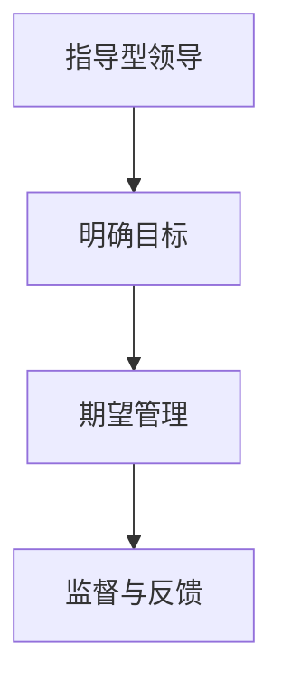

- **参与型领导（Participative Leadership）**：领导者鼓励团队成员参与决策过程，共同制定目标和计划。

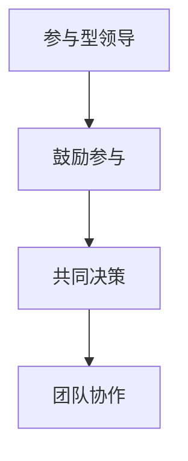

- **情境领导（Situational Leadership）**：领导者根据不同情况和团队成员的特点，采用不同的领导风格。

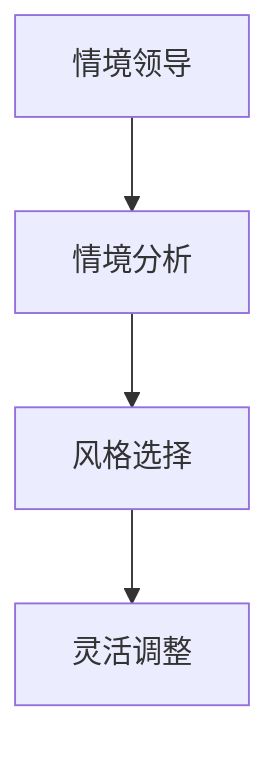

### 2. 决策制定与问题解决

#### 2.1 决策模型

决策模型是用于制定决策的框架和方法。以下是一些常见的决策模型：

- **理性决策模型**：基于逻辑和分析，通过最大化利益和最小化风险来制定决策。

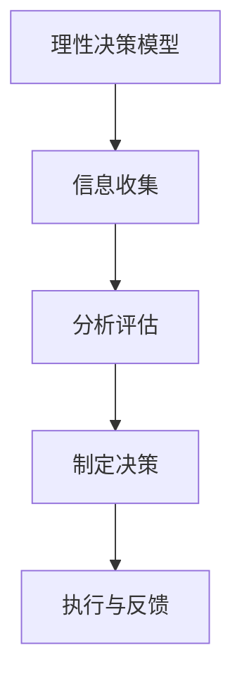

- **直觉决策模型**：基于经验和直觉，快速做出决策。

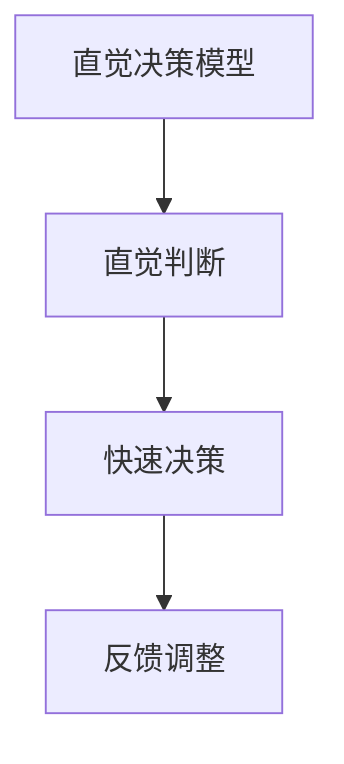

#### 2.2 问题分析

问题分析是解决问题的关键步骤。以下是一些常见的问题分析方法：

- **五力模型**：用于分析市场竞争环境。

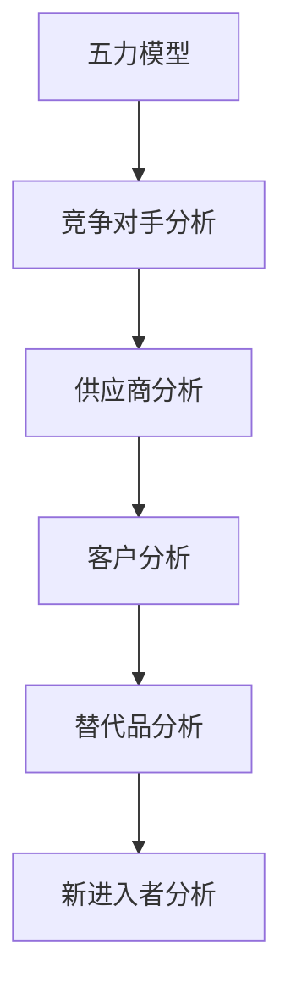

- **SWOT分析**：用于分析企业的优势、劣势、机会和威胁。

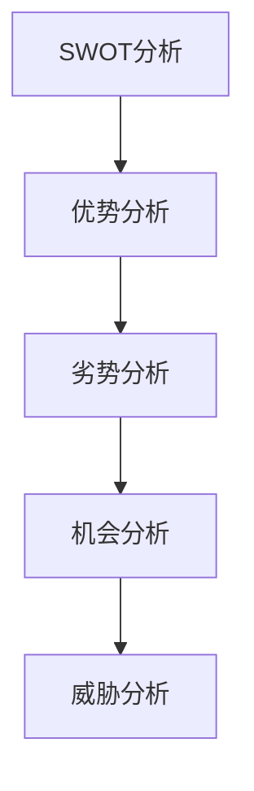

#### 2.3 决策执行

决策执行是决策过程的最后一步。以下是一些常见的决策执行方法：

- **目标分解**：将总体目标分解为具体的小目标，确保决策的逐步实现。

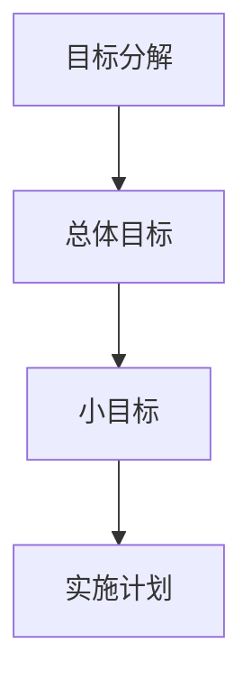

- **资源配置**：根据决策的需要，合理配置人力资源、财务资源等。

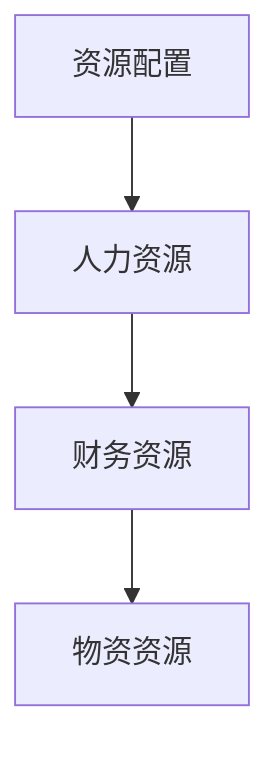

### 3. 团队管理

#### 3.1 团队建设

团队建设是团队管理的重要一环。以下是一些团队建设的策略：

- **共同目标**：确保团队成员明确共同的目标和愿景。

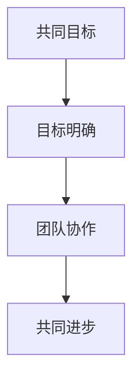

- **沟通技巧**：提升团队成员之间的沟通效率，减少误解和冲突。

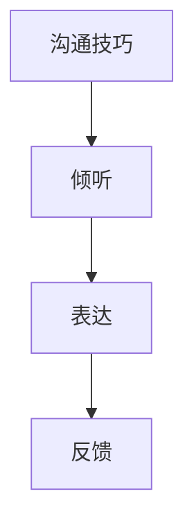

#### 3.2 冲突管理

冲突管理是团队管理中的另一个重要方面。以下是一些冲突管理的策略：

- **早期干预**：在冲突早期阶段采取干预措施，避免冲突升级。

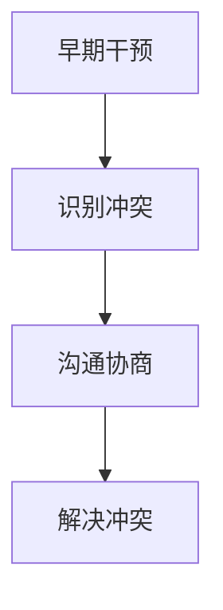

- **调解**：通过第三方调解解决冲突，确保公平和合理。

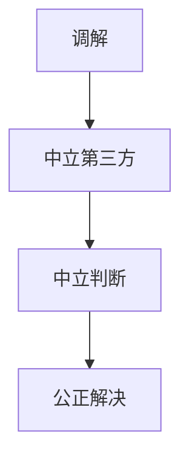

### 总结

通过以上分析，我们可以看到领导力、决策制定和团队管理是领导力基础概念的三个重要方面。这些概念不仅有助于领导者更好地引导和管理团队，还为企业战略的制定和实施提供了基础。

### 战略规划

#### 1. 战略规划的过程

战略规划是一个系统化的过程，旨在确保企业能够长期发展和持续成功。以下是战略规划的主要步骤：

**1.1 外部环境分析**

外部环境分析是战略规划的基础。它涉及对市场趋势、竞争对手、政策法规等外部因素的分析，以便企业能够更好地应对外部环境的变化。

- **PEST分析**：用于分析政治（Political）、经济（Economic）、社会（Societal）和技术（Technological）因素。

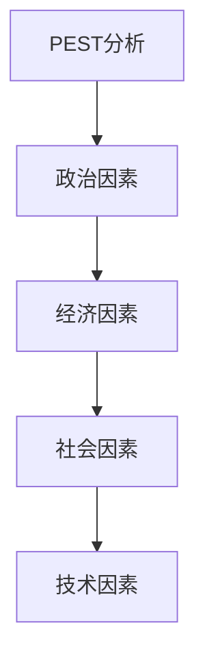

- **五力模型**：用于分析市场竞争环境。


**1.2 内部能力分析**

内部能力分析旨在了解企业的内部资源和能力，包括组织结构、人力资源、财务状况等。

- **SWOT分析**：用于分析企业的优势（Strengths）、劣势（Weaknesses）、机会（Opportunities）和威胁（Threats）。


- **核心能力分析**：识别企业的核心竞争力和关键能力。

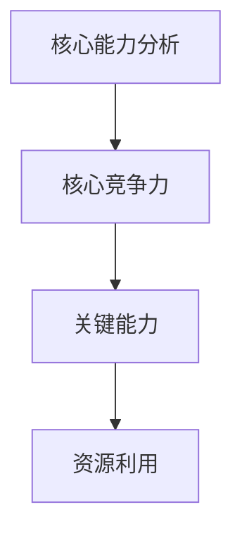

**1.3 战略目标设定**

战略目标设定是战略规划的核心。它涉及设定企业的长期和短期目标，以确保战略规划的可行性和有效性。

- **SMART原则**：用于设定具体、可衡量、可达成、相关性强和有时间限制的战略目标。

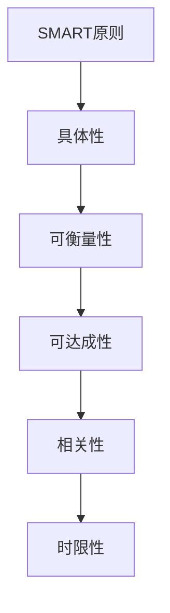

**1.4 战略工具与方法**

战略工具与方法是战略规划过程中常用的方法和工具，包括以下几种：

- **五力模型**：用于分析市场竞争环境。


- **波士顿矩阵**：用于分析产品组合和业务结构。

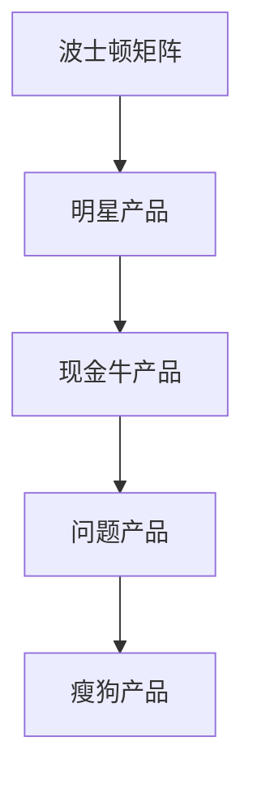

- **SWOT分析**：用于分析企业的优势、劣势、机会和威胁。

```mermaid
graph TD
    A[SWOT分析] --> B[优势分析]
    B --> C[劣势分析]
    C --> D[机会分析]
    D --> E[威胁分析]
```

**1.5 有效决策**

有效决策是战略规划过程中至关重要的一环。它涉及如何在不同选项中做出最优决策，以实现战略目标。

- **决策模型**：包括理性决策模型和直觉决策模型。

```mermaid
graph TD
    A[决策模型] --> B[理性决策模型]
    B --> C[直觉决策模型]
```

- **风险评估**：识别潜在风险，并制定应对策略。

```mermaid
graph TD
    A[风险评估] --> B[识别风险]
    B --> C[评估风险]
    C --> D[应对策略]
```

- **决策执行**：确保决策的有效实施。

```mermaid
graph TD
    A[决策执行] --> B[目标分解]
    B --> C[资源配置]
    C --> D[监控与调整]
```

### 2. 实际应用中的战略规划

战略规划不仅仅是理论上的概念，它需要在实际应用中得到有效执行。以下是一些实际应用中的战略规划案例：

**2.1 案例一：华为公司的战略规划**

华为公司作为中国领先的科技公司，通过持续的战略规划，实现了全球市场的大规模扩张。华为的战略规划主要包含以下几个方面：

- **全球化战略**：华为积极拓展海外市场，建立全球销售和服务网络。
- **技术创新战略**：华为不断加大研发投入，保持技术领先优势。
- **人才战略**：华为通过吸引和培养高素质人才，提升企业的核心竞争力。

**2.2 案例二：阿里巴巴的战略规划**

阿里巴巴集团作为中国最大的电子商务企业，其战略规划旨在打造全球领先的数字经济体。阿里巴巴的战略规划主要包括以下几个方面：

- **云计算战略**：阿里巴巴通过阿里云提供云计算服务，拓展企业业务。
- **新零售战略**：阿里巴巴通过收购和合作，推动线上线下融合的新零售模式。
- **全球化战略**：阿里巴巴积极拓展国际市场，提升全球影响力。

### 总结

通过以上分析，我们可以看到战略规划是一个系统化的过程，包括外部环境分析、内部能力分析、战略目标设定、战略工具与方法、有效决策等环节。在实际应用中，战略规划需要结合企业的实际情况，灵活运用各种方法和工具，以实现企业的长期发展和持续成功。

### 长远规划

#### 1. 长期目标的设定

设定长期目标是长远规划的重要一步。长期目标为企业和团队指明了方向，提供了清晰的愿景。以下是设定长期目标的关键步骤：

**1.1 组织愿景**

组织愿景是长期目标的基础，它描述了企业希望成为什么样的组织。一个明确且具有吸引力的愿景能够激发员工的热情和动力。

- **愿景定义**：明确企业的发展方向和使命，如成为行业领导者、提供最佳客户体验等。
- **愿景传播**：通过内部会议、内部培训和内部沟通，确保所有员工都能理解和认同愿景。

```mermaid
graph TD
    A[愿景定义] --> B[发展方向]
    B --> C[使命陈述]
    C --> D[愿景传播]
```

**1.2 目标分解**

长期目标往往比较宏大，需要分解为具体、可操作的小目标，以确保目标的逐步实现。

- **SMART原则**：使用SMART原则（具体、可衡量、可达成、相关性强、有时间限制）来设定小目标。
- **关键绩效指标（KPIs）**：制定关键绩效指标，用于衡量目标的完成情况。

```mermaid
graph TD
    A[SMART原则] --> B[具体性]
    B --> C[可衡量性]
    C --> D[可达成性]
    D --> E[相关性]
    E --> F[时限性]
    F --> G[关键绩效指标]
```

**1.3 目标跟踪与调整**

目标设定后，需要定期跟踪目标的完成情况，并根据实际情况进行调整。

- **定期评估**：定期评估目标的完成情况，确保企业保持在正确的轨道上。
- **灵活性**：在目标实施过程中，保持灵活性，以便根据市场变化和内部情况调整目标。

```mermaid
graph TD
    A[定期评估] --> B[目标完成情况]
    B --> C[调整计划]
    C --> D[灵活性调整]
```

#### 2. 长期战略的执行

执行长期战略是长远规划的核心。以下是一些关键步骤和策略：

**2.1 资源配置**

合理配置资源是确保长期战略实施的关键。

- **人力资源**：确保拥有合适的人才，通过招聘、培训和发展计划提升员工的技能和素质。
- **财务资源**：确保有足够的资金支持长期战略的实施，通过预算管理和财务规划来优化资源分配。

```mermaid
graph TD
    A[人力资源] --> B[招聘与培训]
    B --> C[人才发展]
    A --> D[财务资源]
    D --> E[预算管理]
    E --> F[财务规划]
```

**2.2 团队协作**

团队协作是实现长期战略的重要保障。

- **团队建设**：通过共同目标和价值观的建立，增强团队凝聚力。
- **沟通机制**：建立有效的沟通机制，确保信息的及时传递和反馈。

```mermaid
graph TD
    A[团队建设] --> B[共同目标]
    B --> C[价值观建立]
    A --> D[沟通机制]
    D --> E[信息传递]
    D --> F[反馈机制]
```

**2.3 监控与调整**

长期战略的执行需要持续监控和调整，以确保目标的实现。

- **绩效评估**：定期评估战略的执行情况，识别存在的问题和机会。
- **调整计划**：根据评估结果，及时调整战略和行动计划，以应对市场变化和内部挑战。

```mermaid
graph TD
    A[绩效评估] --> B[执行情况]
    B --> C[问题识别]
    C --> D[调整计划]
    D --> E[灵活应对]
```

### 3. 案例分析

以下是一个关于长远规划的案例分析：

**案例：腾讯公司的长远规划**

腾讯公司作为中国领先的互联网企业，通过一系列的长远规划，实现了持续的增长和成功。以下是腾讯长远规划的关键步骤：

- **愿景**：腾讯的愿景是成为最受尊重的互联网企业，通过科技推动社会进步。
- **目标分解**：腾讯将长期目标分解为多个具体的小目标，如提升用户体验、拓展新市场等。
- **资源配置**：腾讯通过持续的投资和收购，优化资源分配，确保长期战略的实施。
- **团队协作**：腾讯注重团队建设，通过共同目标和价值观的建立，增强了团队的凝聚力。
- **监控与调整**：腾讯定期评估战略的执行情况，并根据市场变化和内部情况调整战略。

### 总结

通过以上分析，我们可以看到长远规划是确保企业长期成功的关键。设定明确且可实现的长期目标、合理配置资源、加强团队协作和持续监控与调整是长远规划的核心步骤。腾讯公司的案例展示了如何通过长远规划实现持续增长和成功。

## 实践案例

### 1. 案例背景

在这个案例中，我们将分析一家名为“光明科技”的公司。光明科技是一家专注于智能制造领域的企业，致力于为制造业客户提供高效、智能的生产解决方案。公司成立于2008年，经过多年的发展，已经成为行业内的领军企业。

### 2. 案例分析

#### 2.1 领导力实践

光明科技的领导力实践主要体现在以下几个方面：

- **指导型领导**：公司创始人兼CEO李明是一位具有远见的领导者。他通过明确的目标和期望，指导团队制定和实施公司战略，确保公司的长期发展。
- **参与型领导**：李明鼓励员工积极参与公司的决策过程，通过定期的团队会议和意见征集，提升员工的积极性和参与感。
- **情境领导**：李明根据不同情况和员工的特点，灵活调整领导风格。在项目初期，他采用指导型领导，帮助团队快速进入状态；在项目后期，他采用参与型领导，鼓励团队自主解决问题。

#### 2.2 战略思维

光明科技的战略思维体现在以下几个方面：

- **外部环境分析**：公司通过PEST分析，了解政治、经济、社会和技术因素，为战略制定提供依据。
- **内部能力分析**：公司通过SWOT分析，识别自身的优势、劣势、机会和威胁，制定相应的战略措施。
- **目标设定**：公司设定了明确的长期目标，如成为智能制造领域的领导者，并在五年内实现市场份额的翻倍。
- **资源分配**：公司合理配置财务、人力资源等资源，确保战略规划的顺利实施。

#### 2.3 长远规划

光明科技的长远规划主要包括以下几个方面：

- **长期目标设定**：公司明确了成为智能制造领域领导者的愿景，并制定了具体的长期目标，如研发投入占比提升、新产品推出数量等。
- **资源配置**：公司持续加大研发投入，通过招聘和培训提升员工技能，确保长期战略的实施。
- **团队协作**：公司注重团队建设，通过共同目标和价值观的建立，增强了团队的凝聚力和执行力。
- **监控与调整**：公司定期评估战略的执行情况，并根据市场变化和内部情况调整战略。

### 3. 项目实战

#### 3.1 开发环境搭建

为了实现公司的战略目标，光明科技搭建了先进的研发环境。以下是开发环境搭建的步骤：

- **硬件设备**：公司采购了高性能服务器和工作站，确保研发工作的顺利进行。
- **软件工具**：公司引入了现代化的软件开发工具，如IDE、版本控制工具等，提高开发效率。
- **网络环境**：公司建立了高速稳定的内部网络，确保数据传输的效率和安全性。

#### 3.2 源代码实现

在项目开发过程中，光明科技采用了敏捷开发模式，以下是一个典型的源代码实现过程：

- **需求分析**：项目经理与客户进行需求讨论，明确项目需求。
- **设计阶段**：设计师根据需求进行系统设计，包括数据库设计、接口设计等。
- **编码阶段**：开发人员根据设计文档开始编码，遵循编码规范和最佳实践。
- **测试阶段**：测试人员对代码进行单元测试和集成测试，确保代码质量。

#### 3.3 代码解读与分析

以下是对一段示例代码的解读和分析：

```java
public class MachineController {
    // 控制机器的启动和停止
    public void startMachine() {
        // 检查机器状态
        if (machineStatus == MachineStatus.STOPPED) {
            // 启动机器
            machineMotor.start();
            // 更新机器状态
            machineStatus = MachineStatus.RUNNING;
            // 记录启动时间
            startTime = System.currentTimeMillis();
        } else {
            // 机器已启动，无需重复操作
            System.out.println("Machine is already running.");
        }
    }
    
    public void stopMachine() {
        // 检查机器状态
        if (machineStatus == MachineStatus.RUNNING) {
            // 停止机器
            machineMotor.stop();
            // 更新机器状态
            machineStatus = MachineStatus.STOPPED;
            // 记录停止时间
            stopTime = System.currentTimeMillis();
        } else {
            // 机器已停止，无需重复操作
            System.out.println("Machine is already stopped.");
        }
    }
}
```

这段代码是`MachineController`类的实现，用于控制机器的启动和停止。代码中，`startMachine`和`stopMachine`方法分别实现了机器的启动和停止功能。通过检查机器的状态，避免重复操作，提高了代码的鲁棒性。

#### 3.4 代码应用解读与分析

以下是对代码应用的解读和分析：

- **启动和停止功能**：代码提供了启动和停止机器的功能，通过调用`startMachine`和`stopMachine`方法，可以实现对机器的控制。
- **状态检查**：代码中包含了对机器状态进行检查的逻辑，确保机器在启动和停止时处于正确的状态。
- **时间记录**：代码记录了机器的启动和停止时间，有助于监控机器的工作状态和效率。

### 4. 项目小结

通过以上分析，我们可以看到光明科技在领导力、战略思维和长远规划方面的成功实践。公司通过先进的领导力模式，明确了战略目标，并制定了详细的长期规划。在项目实战中，公司搭建了高效的研发环境，实现了高质量的项目交付。这些成功因素共同促成了光明科技在智能制造领域的持续领先。

### 最佳实践 tips

1. **领导者应具备多方面的能力**：指导型、参与型和情境领导都有其适用场景，领导者应根据具体情况灵活运用。
2. **战略规划要紧密结合实际情况**：外部环境分析和内部能力分析是战略规划的基础，要确保战略规划与企业的实际情况相符合。
3. **长期规划需要持续调整**：市场环境和企业内部情况都会发生变化，长期规划需要根据实际情况进行持续调整。

## 小结与展望

### 文章总结

本文围绕“领导力与战略思维：长远规划的重要性”这一主题，系统性地探讨了领导力、战略思维和长远规划的核心概念、应用方法及其实际案例。通过分析，我们明确了领导力在提升团队协作效率和实现企业目标中的关键作用；理解了战略思维在把握全局、预见未来和制定有效决策中的重要性；以及长远规划在确保企业可持续发展和创新驱动中的核心地位。

### 展望未来

未来，领导力、战略思维和长远规划将继续在企业管理和企业发展中扮演重要角色。随着全球化和技术变革的加速，企业领导者需要不断提升自身的领导力和战略思维，以应对复杂多变的市场环境。同时，长远规划将成为企业持续创新和保持竞争优势的关键。以下是对未来发展的几点展望：

1. **领导力发展的多样化**：未来的领导力将更加注重情感智慧和多元化领导风格的应用，以适应不同文化背景和员工需求。
2. **战略思维的智能化**：随着人工智能和大数据技术的发展，战略规划将更加智能化，利用数据分析和预测模型辅助决策。
3. **长远规划的前瞻性**：未来的长远规划将更加注重可持续发展和社会责任，确保企业长期发展的同时，也为社会和环境做出积极贡献。
4. **实践与创新相结合**：企业将更加注重将理论知识转化为实践应用，通过创新不断优化战略规划和管理模式。

### 注意事项

在实施领导力、战略思维和长远规划时，需要注意以下几点：

1. **明确目标与责任**：确保每个团队成员都明确自己的目标和责任，提高执行力。
2. **持续学习和调整**：领导者和团队应持续学习新知识，根据实际情况调整战略和规划，保持灵活性和适应性。
3. **平衡短期利益与长期发展**：在追求短期业绩的同时，要注重长期规划和可持续发展，避免急功近利。

### 拓展阅读

为了深入理解本文主题，读者可以进一步阅读以下相关书籍和资料：

1. **《领导力的五个层次》**：史蒂芬·柯维著，详细阐述了领导力的不同层次和关键技能。
2. **《战略思维：策略、决策与执行》**：理查德·巴克沃著，提供了战略思维的系统方法和实际应用案例。
3. **《长远规划的艺术》**：迈克尔·波特著，探讨了企业在不同行业和竞争环境下的长期战略规划。

通过以上拓展阅读，读者可以更加全面地了解领导力、战略思维和长远规划的深度和广度，提升自身的专业素养和管理能力。

