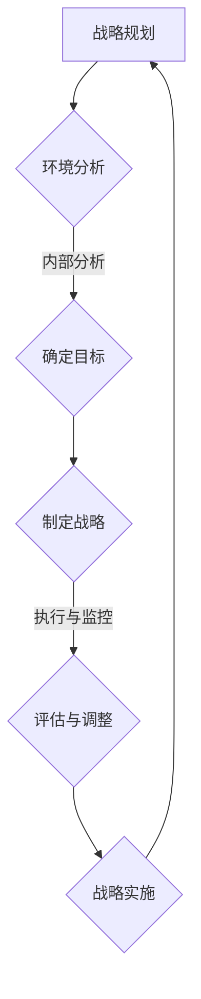

                 

### 文章标题：领导力与战略执行：从计划到落地

#### 关键词：领导力、战略执行、计划落地、团队管理、组织文化

#### 摘要：
本文旨在深入探讨领导力与战略执行之间的关系，从理论基础到实际操作，提供一套完整的战略实施方法论。文章首先介绍了领导力的基本概念和重要性，解析了领导力与管理的区别及其核心要素。接着，文章阐述了战略规划与执行的基本概念、过程、挑战与对策，并探讨了领导力在组织文化和变革管理中的作用。随后，通过案例分析，为读者提供了宝贵的实践经验。文章第二部分聚焦战略执行实践，详细分析了策略实施的关键步骤、跨部门协作与沟通技巧、执行文化的建立以及领导力发展计划。最后，文章展望了领导力与战略执行的数字化趋势和全球视野，总结了当前现状及未来发展趋势，为组织和个人提供了深刻的启示。

### 第一部分：领导力基础理论

#### 引言

领导力是一种独特的力量，它不仅影响着组织的成功，也深刻影响着团队成员的个人成长和幸福感。在信息技术快速发展的今天，领导力的作用愈加凸显。有效的领导力能够激发团队的潜力，推动战略目标的实现，从而提升组织的竞争力。本部分将首先介绍领导力的重要性，随后分析领导力的定义及其与管理的区别，最后探讨领导力的核心要素。

#### 1.1 领导力的重要性

领导力是一种核心能力，对于个人、团队和组织的发展至关重要。首先，领导力能够激发团队成员的潜力，提升团队的整体绩效。有效的领导力可以营造积极的工作氛围，增强团队成员的归属感和工作满意度，从而提高生产力。其次，领导力对于战略目标的实现具有关键作用。领导者能够清晰地定义愿景和目标，并通过有效的沟通和激励，使团队成员朝着共同的目标努力。最后，领导力有助于组织的可持续发展。通过建立良好的组织文化和推动变革管理，领导者可以为组织创造一个稳定、创新和有活力的环境。

#### 1.2 本书结构

本文将分为三个主要部分进行讨论。第一部分将深入探讨领导力基础理论，包括领导力的定义、核心要素和领导风格等。第二部分将聚焦战略执行实践，详细分析策略实施的关键步骤、跨部门协作与沟通技巧、执行文化的建立以及领导力发展计划。第三部分将展望领导力与战略执行的数字化趋势和全球视野，探讨未来发展趋势及其对组织和个人的启示。

#### 2. 领导力概念解析

#### 2.1 领导力定义

领导力是一种复杂的多维能力，它不仅包括个人品质和技能，还涉及到领导行为和领导情境。从广义上讲，领导力是指引导和激励他人实现共同目标的能力。这个定义强调了领导力的核心要素：目标、他人和影响力。具体来说，领导力包括以下几个方面：

1. **目标导向**：领导者能够明确组织的愿景和目标，并引导团队成员共同努力实现这些目标。
2. **影响力**：领导者通过言行和行动影响他人，使他们愿意为实现共同目标而努力。
3. **人际技能**：领导者需要具备良好的人际沟通、关系建立和团队管理能力。
4. **决策能力**：领导者能够在复杂和不确定的情况下做出明智的决策。
5. **变革能力**：领导者需要具备推动组织变革和适应外部环境变化的能力。

#### 2.2 领导力与管理的区别

领导力和管理是两个紧密相关但有所区别的概念。管理是组织运作的基础，它包括计划、组织、领导和控制等活动。管理侧重于维持现有秩序，确保组织的日常运作。而领导力则更多地关注未来的方向和目标，它是一种变革力量，旨在推动组织向前发展。

领导力与管理的区别主要体现在以下几个方面：

1. **目标**：管理侧重于当前的目标和任务，而领导力则关注未来和长远的目标。
2. **角色**：管理者是负责执行和维持组织运作的，而领导者则是负责激发和引导团队成员。
3. **方法**：管理主要通过制度和流程来确保组织的效率，而领导力则通过影响力和激励来推动变革。
4. **效果**：管理的效果体现在组织的稳定和持续运作，而领导力的效果则体现在组织的创新和成长。

#### 2.3 领导力的核心要素

领导力的核心要素包括个人品质、技能和行为。个人品质是指领导者应具备的道德和精神特质，如正直、诚信、责任感等。技能是指领导者应具备的能力，如沟通、决策、解决问题等。行为是指领导者的实际行动，如激励团队、制定目标、推动变革等。以下是领导力的核心要素：

1. **愿景和目标**：领导者需要有远大的愿景和明确的目标，这能够激发团队成员的积极性和动力。
2. **影响力**：领导者需要具备强大的影响力，能够引导和激励团队成员。
3. **人际技能**：领导者需要具备良好的人际沟通、关系建立和团队管理能力。
4. **决策能力**：领导者需要在复杂和不确定的情况下做出明智的决策。
5. **变革能力**：领导者需要具备推动组织变革和适应外部环境变化的能力。

#### 3. 领导风格与团队管理

#### 3.1 领导风格的类型

领导风格是指领导者处理团队和管理活动的方式。不同的领导风格适合不同的情境和团队。常见的领导风格包括：

1. ** authoritarian style（权威型）**：领导者集中决策权，严格管理，强调纪律和效率。
2. ** democratic style（民主型）**：领导者鼓励团队成员参与决策，尊重团队成员的意见和建议。
3. ** Laissez-faire style（自由放任型）**：领导者放权给团队成员，让他们自由决策和行动。
4. ** transformational style（变革型）**：领导者通过激励和激发团队成员的潜能，推动团队实现变革和成长。

#### 3.2 团队管理的策略

团队管理是领导力的关键组成部分，有效的团队管理能够提升团队的效率和绩效。以下是一些团队管理的策略：

1. **明确目标和角色**：确保团队成员明确自己的工作目标和职责，这有助于提高工作效率。
2. **建立信任**：建立信任是团队协作的基础，领导者需要通过言行一致和透明度来建立信任。
3. **激励和奖励**：领导者需要通过激励和奖励机制来激发团队成员的积极性和创造力。
4. **沟通和反馈**：领导者需要保持与团队成员的沟通，及时提供反馈，帮助他们改进和提高。

#### 3.3 情境领导理论

情境领导理论是由保罗·赫塞和肯尼斯·布兰查德提出的，它认为领导风格应根据不同的情境和团队成员的能力来调整。情境领导理论将领导行为和团队成员的能力分为四种类型：

1. **S1：指导型**：领导者明确指示团队成员应该做什么，如何做。
2. **S2：支持型**：领导者提供支持和鼓励，帮助团队成员发展。
3. **S3：参与型**：领导者与团队成员共同决策，鼓励参与。
4. **S4：授权型**：领导者给予团队成员自主权和责任，让他们自我管理。

情境领导理论强调领导者需要根据不同的情境和团队成员的能力来调整领导行为，以达到最佳效果。

### 第二部分：战略规划与执行

#### 4.1 战略规划的基本概念

战略规划是指组织为了实现长期目标而制定的一系列行动计划。它不仅包括组织的目标和愿景，还涉及到如何通过有效的资源配置和行动来实现这些目标。战略规划的基本概念包括：

1. **愿景**：愿景是组织长期发展的目标和方向，它为组织提供了前进的方向。
2. **使命**：使命是组织存在的目的和意义，它指导着组织的价值观和行为准则。
3. **目标**：目标是实现愿景和使命的具体指标，它们是组织努力的方向。
4. **战略**：战略是实现目标的一系列决策和行动，它明确了组织如何利用资源和能力来实现目标。

#### 4.2 战略规划的过程

战略规划是一个系统化的过程，包括以下几个阶段：

1. **环境分析**：通过外部环境分析，了解组织所处的市场、竞争状况和行业趋势。
2. **内部分析**：通过内部资源、能力和竞争优势分析，了解组织的优势和劣势。
3. **确定目标**：明确组织的长期和短期目标，确保这些目标与愿景和使命相一致。
4. **制定战略**：根据环境分析和内部分析的结果，制定实现目标的战略和行动方案。
5. **执行与监控**：实施战略规划，并定期评估和调整，确保战略目标的实现。

#### 4.3 战略执行的挑战与对策

战略执行是将战略规划转化为实际行动的过程，它面临着诸多挑战。以下是一些常见的挑战和相应的对策：

1. **组织文化**：如果组织的文化不支持变革，战略执行就会受到阻碍。对策是通过培训和沟通，改变组织文化，使之更加开放和灵活。
2. **资源分配**：资源分配不当可能导致战略执行受阻。对策是进行有效的资源规划和分配，确保战略实施所需的资源得到充分利用。
3. **沟通不畅**：沟通不畅可能导致团队成员对战略执行的理解不一致，从而影响执行效果。对策是建立有效的沟通机制，确保信息的准确传达和反馈。
4. **执行力不足**：执行力不足是战略执行中的常见问题。对策是建立明确的执行计划，加强监督和评估，提高团队成员的执行能力。

#### 5. 领导力与组织文化

组织文化是组织内部共同的价值观、信仰和行为准则，它对组织的运作和发展具有深远影响。领导力在塑造和维持组织文化方面起着关键作用。

#### 5.1 组织文化的定义与作用

组织文化是指组织成员共同持有的价值观、信仰、行为准则和工作方式。它不仅反映了组织的核心价值观，也影响着组织成员的行为和工作态度。组织文化的作用包括：

1. **增强凝聚力**：组织文化能够增强团队成员的归属感和团队凝聚力，使团队成员更加愿意为组织的共同目标而努力。
2. **提高工作效率**：组织文化能够规范团队成员的行为，提高工作效率和团队协作效果。
3. **塑造组织形象**：组织文化是组织形象的重要组成部分，它能够塑造组织在公众和客户心中的形象。
4. **推动组织发展**：健康和积极的组织文化能够激发创新和变革，推动组织的持续发展。

#### 5.2 领导力如何塑造组织文化

领导力在塑造组织文化方面起着关键作用。以下是一些领导力如何塑造组织文化的途径：

1. **树立榜样**：领导者通过自己的言行和行为树立榜样，影响和引导团队成员。
2. **沟通与传播**：领导者通过沟通和传播，将组织的核心价值观和行为准则传达给团队成员。
3. **培训与发展**：领导者通过培训和发展，帮助团队成员理解和认同组织文化，提升其文化素养。
4. **激励机制**：领导者通过激励机制，鼓励团队成员遵守组织文化，并为组织文化的维护和发展做出贡献。

#### 5.3 健康组织文化的特征

健康组织文化具有以下特征：

1. **共同价值观**：组织文化能够得到全体成员的共同认同和遵循。
2. **透明度**：组织文化强调信息的透明和公开，避免信息不对称和信任问题。
3. **开放性**：组织文化鼓励创新和变革，愿意接受和吸纳外部的新思想和新方法。
4. **责任感**：组织文化强调个人和团队的责任感，每个人都对自己的行为和结果负责。

### 第三部分：领导力与变革管理

#### 6.1 变革管理的必要性

在当今快速变化的市场环境中，组织需要不断适应外部环境的变化，进行变革管理。变革管理是指组织在面临外部或内部压力时，通过系统的变革过程，实现组织目标的变化和调整。变革管理的必要性体现在以下几个方面：

1. **应对市场变化**：市场环境的变化要求组织不断调整和优化自身的运营模式，以保持竞争力。
2. **提升组织效能**：通过变革管理，组织可以消除内部低效和冗余，提高整体运营效能。
3. **激发创新能力**：变革管理能够激发组织的创新活力，推动技术创新和管理创新。
4. **实现可持续发展**：通过变革管理，组织可以更好地适应未来发展的挑战，实现可持续发展。

#### 6.2 变革管理的策略

变革管理是一个复杂的过程，需要领导者制定和实施一系列策略。以下是一些常见的变革管理策略：

1. **明确变革目标**：领导者需要明确变革的目标，确保变革的方向和路径清晰。
2. **建立变革团队**：领导者需要组建一支专门的变革团队，负责推动变革的实施和管理。
3. **沟通与宣传**：领导者需要通过有效的沟通和宣传，让全体成员了解变革的必要性和目标。
4. **培训与发展**：领导者需要提供培训和发展机会，帮助团队成员适应变革。
5. **激励与奖励**：领导者需要通过激励和奖励机制，鼓励团队成员积极参与变革。
6. **持续监控与调整**：领导者需要持续监控变革的进展，并根据实际情况进行调整。

#### 6.3 领导者在变革管理中的作用

领导者在变革管理中扮演着至关重要的角色，他们的作用主要体现在以下几个方面：

1. **愿景和目标**：领导者需要明确变革的愿景和目标，为变革提供方向和动力。
2. **沟通和协调**：领导者需要通过沟通和协调，确保团队成员理解和支持变革。
3. **激励和引导**：领导者需要通过激励和引导，激发团队成员的积极性和创造力。
4. **监督和反馈**：领导者需要监督变革的进展，及时提供反馈和指导。
5. **危机管理**：领导者需要应对变革过程中可能出现的危机和挑战，确保变革的顺利进行。

#### 7. 案例分析

为了更好地理解领导力与战略执行的关系，下面我们将通过国际知名企业国内成功企业的案例，探讨它们在领导力与战略执行方面的实践经验。

#### 7.1 国际知名企业领导力与战略执行案例

##### 案例一：苹果公司的创新驱动策略

苹果公司以其创新的产品和出色的领导力而闻名于世。乔布斯作为苹果公司的领导者，他的愿景和创新精神对公司的战略执行产生了深远的影响。以下是苹果公司的一些关键策略：

1. **愿景和目标**：乔布斯始终强调苹果公司的愿景，即通过创新的产品改变世界。这一愿景为公司的战略执行提供了明确的方向。
2. **领导风格**：乔布斯采用变革型领导风格，通过激励和激发团队成员的潜能，推动创新和变革。
3. **组织文化**：苹果公司强调创新、质量和用户体验，这种组织文化激励着员工不断追求卓越。
4. **战略执行**：苹果公司通过严格的研发管理和产品迭代策略，确保其创新产品能够迅速推向市场。

##### 案例二：谷歌公司的扁平化管理

谷歌公司以其创新的企业文化和扁平化管理模式而著称。以下是谷歌公司的一些关键策略：

1. **领导风格**：谷歌的领导风格注重民主和参与，鼓励员工参与决策和表达意见。
2. **组织文化**：谷歌强调创新、开放和自由的工作环境，这种文化鼓励员工提出新的想法和解决方案。
3. **战略执行**：谷歌通过灵活的工作安排和开放的沟通渠道，确保战略执行的高效和顺利。
4. **变革管理**：谷歌通过持续的变革和创新，保持其市场竞争力，并在全球化背景下实现持续增长。

#### 7.2 国内成功企业的领导力与战略执行案例

##### 案例一：华为公司的国际化战略

华为公司作为中国领先的科技公司，其国际化战略和领导力建设为国内企业提供了宝贵的经验。以下是华为公司的关键策略：

1. **愿景和目标**：华为公司一直致力于成为全球领先的信息和通信技术（ICT）解决方案提供商。
2. **领导风格**：华为的领导者注重团队合作和全球视野，鼓励员工在不同文化背景下工作。
3. **组织文化**：华为强调创新、拼搏和长期主义，这种文化激励着员工追求卓越。
4. **战略执行**：华为通过全球化布局和持续研发投入，确保其战略执行的高效和成功。

##### 案例二：阿里巴巴的数字化转型

阿里巴巴作为中国电商巨头，其数字化转型战略和领导力建设为国内企业提供了重要的启示。以下是阿里巴巴的一些关键策略：

1. **愿景和目标**：阿里巴巴致力于构建全球领先的数字经济生态系统。
2. **领导风格**：阿里巴巴的领导者注重创新和数字化转型，推动企业向数字化和智能化方向发展。
3. **组织文化**：阿里巴巴强调创新、协作和客户至上，这种文化为数字化转型提供了坚实的基础。
4. **战略执行**：阿里巴巴通过大数据、云计算和人工智能等技术的应用，实现了战略执行的高效和成功。

#### 7.3 案例启示与借鉴

通过以上案例分析，我们可以得出以下启示和借鉴：

1. **明确的愿景和目标**：领导者需要明确组织的愿景和目标，为战略执行提供明确的方向。
2. **灵活的领导风格**：领导者需要根据不同情境和团队特点，采用灵活的领导风格，以激发团队的潜能。
3. **健康的组织文化**：领导者需要塑造健康和积极的组织文化，以支持战略执行和组织的持续发展。
4. **有效的沟通和协作**：领导者需要建立有效的沟通和协作机制，确保战略执行的高效和顺利。
5. **持续的变革和创新**：领导者需要推动持续的变革和创新，以保持组织的竞争力和适应外部环境的变化。

### 第二部分：战略执行实践

#### 8. 从计划到落地：策略实施

战略执行是将战略规划转化为实际行动的过程，是组织实现目标的关键环节。有效的策略实施能够确保战略目标的顺利实现，提高组织的运营效率和竞争力。本节将详细分析策略实施的关键步骤、制定可执行的计划以及风险管理。

#### 8.1 策略实施的关键步骤

策略实施是一个系统化的过程，通常包括以下关键步骤：

1. **明确目标和指标**：首先，需要明确战略执行的具体目标和关键绩效指标（KPIs），以确保执行过程有明确的方向和衡量标准。
2. **制定详细的执行计划**：根据目标和指标，制定详细的执行计划，明确每个阶段的具体任务、责任人和时间表。
3. **资源分配和协调**：确保战略执行所需的资源得到合理配置，并协调不同部门之间的协作，确保执行计划的顺利实施。
4. **执行和监控**：按照执行计划执行任务，并持续监控执行过程，及时调整和优化执行策略。
5. **评估和反馈**：在执行过程中，定期评估执行效果，收集反馈信息，并根据评估结果进行调整。

#### 8.2 制定可执行的计划

制定可执行的计划是策略实施的关键。以下是一些制定可执行计划的步骤和技巧：

1. **目标分解**：将战略目标分解为具体的、可衡量的子目标，确保每个子目标都与战略目标紧密相关。
2. **任务细化**：将每个子目标细化成具体的任务，明确每个任务的负责人、所需资源和时间表。
3. **风险评估**：在制定计划时，要考虑可能的风险因素，并制定相应的应对措施。
4. **可操作性**：确保计划具有可操作性，即每个任务都可以被具体执行，而不是空泛的口号。
5. **持续沟通**：在制定计划的过程中，要确保与相关利益相关者进行充分的沟通，以确保他们对计划的了解和认同。

#### 8.3 风险管理

风险管理是策略实施的重要组成部分，有效的风险管理能够降低战略执行过程中的不确定性，确保计划的顺利实施。以下是一些风险管理的方法：

1. **识别风险**：在制定计划时，要全面识别可能影响战略执行的风险因素，包括外部环境和内部因素。
2. **评估风险**：对识别出的风险进行评估，确定其可能性和影响程度。
3. **制定应对措施**：根据风险评估结果，制定相应的应对措施，包括风险规避、风险转移、风险减轻等。
4. **持续监控**：在战略执行过程中，持续监控风险的变化，并根据实际情况调整应对措施。
5. **应急计划**：制定应急计划，以应对可能发生的突发事件。

#### 9. 跨部门协作与沟通

跨部门协作和沟通在战略执行中起着至关重要的作用。有效的跨部门协作和沟通能够确保各部门之间的协调一致，提高整体执行效率。以下是一些跨部门协作和沟通的技巧：

1. **建立共同目标**：确保各部门都清楚组织的整体目标和战略方向，这有助于促进跨部门协作。
2. **明确沟通渠道**：建立明确的沟通渠道，确保信息能够迅速、准确地传递。
3. **定期会议和汇报**：定期召开跨部门会议，分享进展和问题，确保各部门之间的信息同步。
4. **跨部门团队**：组建跨部门团队，负责协调和解决跨部门之间的协作问题。
5. **沟通技巧培训**：对团队成员进行沟通技巧培训，提高沟通的有效性和效率。

#### 9.1 跨部门协作的挑战

跨部门协作在战略执行中面临诸多挑战，以下是一些常见的挑战：

1. **部门壁垒**：各部门之间存在壁垒，可能导致信息不对称和协作不畅。
2. **资源冲突**：各部门在资源分配上可能存在竞争，导致资源无法有效利用。
3. **目标不一致**：各部门的目标可能不一致，导致协作难以推进。
4. **责任不清**：跨部门协作中，责任划分可能不清晰，导致问题难以解决。

#### 9.2 沟通技巧在战略执行中的应用

有效的沟通技巧在战略执行中至关重要，以下是一些沟通技巧在战略执行中的应用：

1. **倾听**：倾听是沟通的重要环节，领导者需要倾听团队成员的意见和建议，确保理解他们的需求和关切。
2. **清晰表达**：领导者需要清晰、简洁地表达自己的观点和期望，避免产生误解和歧义。
3. **积极反馈**：领导者需要给予团队成员积极的反馈，鼓励他们提出问题和改进建议。
4. **透明沟通**：建立透明的沟通环境，确保信息的公开和共享，避免信息不对称。
5. **冲突管理**：在沟通中，领导者需要善于管理冲突，通过协商和调解，找到解决冲突的最佳方式。

#### 9.3 跨部门协作的最佳实践

以下是一些跨部门协作的最佳实践：

1. **明确责任和角色**：在跨部门协作中，明确每个部门的责任和角色，确保任务分工清晰。
2. **建立协作机制**：建立跨部门协作机制，如定期会议、协作平台等，促进各部门之间的沟通和协作。
3. **共享资源和信息**：鼓励各部门共享资源和信息，提高整体协作效率。
4. **共同目标**：确保各部门都认同组织的整体目标，共同为实现目标而努力。
5. **培训与发展**：对团队成员进行跨部门协作的培训，提高他们的协作能力和沟通技巧。

#### 10. 建立执行文化

执行文化是指组织内部对执行力的重视和推崇，是一种以结果为导向的文化。建立执行文化能够提升组织的执行力和竞争力，确保战略目标的顺利实现。以下是一些建立执行文化的步骤和方法：

1. **树立榜样**：领导者需要通过自己的言行树立执行文化的榜样，以实际行动践行执行文化。
2. **明确目标和期望**：组织需要明确执行文化的目标和期望，确保所有成员都清楚执行文化的要求和标准。
3. **培训与发展**：对员工进行执行力培训和发展，提高他们的执行能力和工作素养。
4. **激励与奖励**：建立激励和奖励机制，鼓励员工积极参与执行文化建设和实践。
5. **持续沟通**：通过定期的沟通和反馈，确保执行文化在组织内部的传播和落实。

#### 10.1 执行文化的要素

执行文化包括以下几个关键要素：

1. **明确的目标和期望**：组织需要明确执行文化的目标和期望，确保所有成员都清楚执行文化的要求和标准。
2. **积极的态度**：执行文化要求员工具备积极的工作态度，勇于承担责任，面对困难和挑战时不退缩。
3. **高效的工作方式**：执行文化倡导高效的工作方式，通过优化流程和资源利用，提高工作效率和效果。
4. **持续的学习和改进**：执行文化鼓励员工不断学习和改进，提高自己的能力和素质，以适应不断变化的环境。
5. **开放的沟通和协作**：执行文化强调开放的沟通和协作，鼓励员工分享信息、经验和知识，共同解决问题和实现目标。

#### 10.2 培养执行力的方法

以下是一些培养执行力的方法：

1. **制定明确的目标和计划**：确保员工了解自己的工作目标和任务，并制定具体的执行计划。
2. **提供必要的资源和支持**：为员工提供完成任务所需的资源和支持，确保他们能够顺利执行任务。
3. **建立反馈和评估机制**：建立有效的反馈和评估机制，及时了解员工的执行情况，提供改进意见和建议。
4. **鼓励学习和创新**：鼓励员工不断学习和创新，提高他们的执行能力和工作效率。
5. **激励和奖励**：建立激励和奖励机制，鼓励员工积极参与执行文化和实践。

#### 10.3 执行文化的评估与改进

评估和改进执行文化是确保其持续发展的关键。以下是一些评估和改进执行文化的方法：

1. **员工反馈**：通过员工反馈了解他们对执行文化的看法和建议，识别存在的问题和改进方向。
2. **绩效评估**：通过绩效评估了解执行文化对组织绩效的影响，评估执行文化的效果。
3. **培训和研讨**：定期组织培训和研讨，提高员工的执行能力和执行文化素养。
4. **沟通和协作**：加强组织内部的沟通和协作，确保执行文化在组织内部的传播和落实。
5. **调整和优化**：根据评估结果，调整和优化执行文化策略，确保其持续适应组织发展的需求。

### 第三部分：领导力与战略执行的未来趋势

#### 11.1 数字化趋势的影响

数字化技术正在深刻改变领导力与战略执行的各个方面。首先，数字化技术提供了大量数据，这些数据可以帮助领导者更好地了解市场趋势和客户需求，从而制定更精准的战略。其次，数字化工具如人工智能和机器学习可以协助领导者进行更高效的数据分析和决策。此外，云计算和物联网等技术使得跨部门和跨地域的协作变得更加容易，提高了战略执行的效率和效果。

#### 11.2 数据驱动决策

在数字化时代，数据驱动决策成为战略执行的重要手段。通过分析大量数据，领导者可以识别潜在的市场机会和风险，优化资源配置，提高决策的准确性和效率。以下是一些关键步骤和注意事项：

1. **数据收集**：确保收集到的数据是准确和全面的，这是数据驱动决策的基础。
2. **数据分析**：利用先进的分析工具和技术，对数据进行深入分析，提取有价值的信息。
3. **决策支持**：将分析结果转化为决策支持，帮助领导者做出更明智的决策。
4. **持续优化**：根据决策效果不断调整和优化数据分析和决策流程。

#### 11.3 数字化领导力的发展

数字化领导力是指领导者具备的利用数字化技术推动组织创新和发展的能力。以下是一些关键要素：

1. **技术素养**：领导者需要具备一定的技术素养，了解数字化工具的基本原理和应用。
2. **数据意识**：领导者需要具备数据意识，能够理解和利用数据来指导决策和战略执行。
3. **创新精神**：领导者需要鼓励创新，推动组织不断探索和应用新的数字化技术。
4. **人才培养**：领导者需要培养和引进具备数字化技能的人才，确保组织在数字化时代具备竞争力。

#### 12. 全球视野下的领导力与战略执行

全球化带来了新的机遇和挑战，对领导力和战略执行提出了更高的要求。以下是一些关键点：

1. **跨文化领导力**：领导者需要具备跨文化领导力，能够理解和尊重不同文化的差异，有效管理多元文化团队。
2. **国际市场战略**：领导者需要制定适合国际市场的战略，考虑不同市场的特点和需求。
3. **全球化管理**：领导者需要具备全球化管理能力，能够处理跨地域的业务和团队合作。
4. **风险评估与应对**：领导者需要重视全球化的风险，包括政治、经济、社会等方面，并制定相应的风险应对策略。

#### 12.1 全球化背景下的领导力

全球化使得领导力的重要性更加凸显。以下是一些全球化背景下的领导力特点：

1. **全球视野**：领导者需要具备全球视野，了解不同国家和地区的市场动态和文化差异。
2. **跨文化沟通**：领导者需要具备跨文化沟通能力，能够有效地与来自不同文化背景的团队成员进行沟通和协作。
3. **全球协作**：领导者需要具备全球协作能力，能够协调和管理跨地域的团队和项目。
4. **持续学习**：全球化背景下，领导者需要具备持续学习的能力，不断更新自己的知识和技能，以适应不断变化的环境。

#### 12.2 国际市场战略执行策略

在国际市场中执行战略，领导者需要采取一系列策略：

1. **市场调研**：在进入新市场之前，进行充分的市场调研，了解目标市场的需求、竞争状况和法规政策。
2. **本地化战略**：根据目标市场的特点，制定本地化战略，包括产品、营销、服务等方面。
3. **供应链管理**：优化供应链管理，确保国际市场的供应稳定和高效。
4. **风险管理**：识别和管理国际市场的风险，包括政治风险、经济风险和文化风险。

#### 12.3 跨文化领导力

跨文化领导力是全球化背景下领导者不可或缺的能力。以下是一些关键要素：

1. **文化敏感性**：领导者需要具备文化敏感性，能够理解和尊重不同文化的价值观和行为方式。
2. **沟通技巧**：领导者需要掌握有效的跨文化沟通技巧，确保信息的准确传达和团队的协作。
3. **团队建设**：领导者需要构建多元文化团队，促进不同文化背景的员工之间的理解和合作。
4. **文化融合**：领导者需要推动文化融合，将不同文化的优点结合起来，创造一个包容和创新的组织环境。

### 13. 总结与展望

#### 13.1 领导力与战略执行的现状

当前，领导力与战略执行在全球范围内都受到广泛关注。随着数字化技术的快速发展，领导者需要不断提升自身的能力，以应对全球化背景下的复杂挑战。同时，组织文化对战略执行的影响也日益凸显，健康和积极的组织文化能够为战略执行提供坚实的基础。

#### 13.2 未来发展趋势

未来，领导力与战略执行将继续向数字化和全球化方向发展。数据驱动决策和数字化领导力将成为领导者的重要技能。同时，跨文化领导力和国际市场战略执行能力也将成为领导者必须具备的核心能力。此外，随着人工智能和大数据技术的进一步发展，领导者需要不断更新自己的知识和技能，以适应不断变化的技术环境。

#### 13.3 对组织和个人的启示

对于组织而言，领导者需要注重培养和提升领导力，推动组织文化的建设，确保战略执行的高效和成功。同时，组织需要建立完善的战略规划和执行机制，以应对市场变化和外部挑战。

对于个人而言，领导者需要不断学习和成长，提升自己的领导力和战略执行能力。此外，个人需要具备良好的沟通和协作能力，以适应多元文化和全球化背景下的工作环境。

#### 13.4 对未来工作的启示

未来的工作环境将更加复杂和多元化，领导者需要具备以下几方面的能力：

1. **技术创新**：领导者需要关注新兴技术的趋势和应用，提升组织的数字化水平。
2. **战略思维**：领导者需要具备战略思维，能够从全局出发，制定和实施有效的战略规划。
3. **跨文化沟通**：领导者需要具备跨文化沟通能力，能够与来自不同文化背景的团队成员有效沟通和协作。
4. **持续学习**：领导者需要保持持续学习的态度，不断提升自己的知识和技能。

### 附录

#### 附录 A：领导力与战略执行相关资源

##### A.1 基础读物推荐

1. **《领导力》（Leadership）** by John C. Maxwell
2. **《战略规划》（Strategic Management and Business Policy）** by Peter Drucker
3. **《数字化领导力》（Digital Leadership）** by Eric Sheninger

##### A.2 学术论文与报告

1. **“Leadership and Organizational Culture”** by John P. Kotter
2. **“Strategic Planning in Turbulent Times”** by Michael E. Porter
3. **“The Impact of Digital Technology on Leadership”** by McKinsey & Company

##### A.3 在线课程与培训

1. **Coursera - "Leading Effective Virtual Teams"** by University of Illinois at Urbana-Champaign
2. **edX - "Digital Transformation and Leadership"** by Babson College
3. **LinkedIn Learning - "Strategic Management and Leadership"** by University of California, Irvine

#### 附录 B：Mermaid 流程图示例

以下是一个简单的 Mermaid 流程图示例，展示了领导力与战略执行的基本流程：



#### 附录 C：核心算法伪代码示例

以下是一个简单的线性回归算法的伪代码示例，用于计算模型的参数：

```python
def linear_regression(x, y):
    n = len(x)
    x_mean = sum(x) / n
    y_mean = sum(y) / n

    x_squared_sum = sum([xi**2 for xi in x])
    xy_sum = sum([xi * yi for xi, yi in zip(x, y)])

    # 计算斜率 b1
    b1 = (xy_sum - n * x_mean * y_mean) / (x_squared_sum - n * x_mean**2)

    # 计算截距 b0
    b0 = y_mean - b1 * x_mean

    # 预测
    predicted_y = b0 + b1 * x

    return predicted_y
```

### 结论

本文从领导力的定义和重要性出发，详细探讨了领导力与战略执行之间的关系，以及战略规划与执行的过程、挑战与对策。通过分析领导风格、组织文化、变革管理以及跨部门协作，提供了全面的领导力与战略执行方法论。同时，通过案例分析展示了成功企业的实践经验，并对未来的发展趋势进行了展望。希望本文能够为读者提供有价值的启示，帮助他们在实际工作中提升领导力和战略执行能力。**作者：AI天才研究院/AI Genius Institute & 禅与计算机程序设计艺术 /Zen And The Art of Computer Programming**

