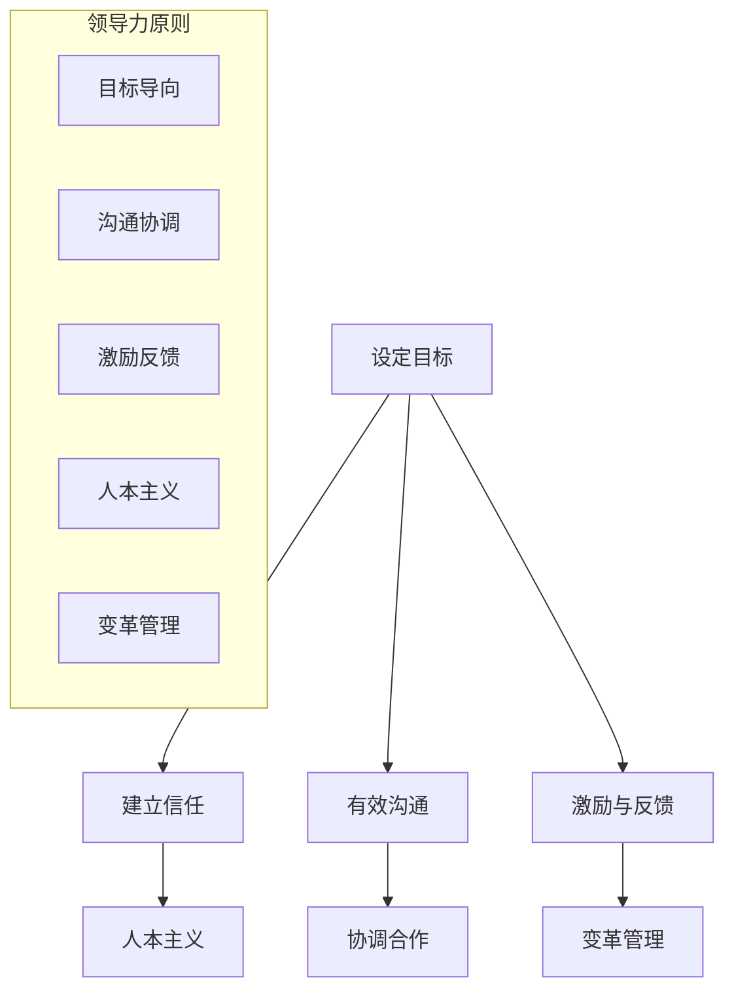

                 

### 引言：领导力与时间管理的重要性

在现代信息技术飞速发展的背景下，工作效率已成为企业和个人成功的关键因素。而提高工作效率的关键在于领导力和时间管理的有效结合。领导力不仅是管理团队、推动项目进展的核心能力，也是提升个人执行力、实现职业生涯发展的关键要素。时间管理则是一种通过合理安排时间、优化工作流程来提高工作效率的方法论。

领导力与时间管理的关系密不可分。领导力强调的是如何激发团队潜能、提升团队协作效率，而时间管理则关注如何高效利用时间，确保任务按时完成。有效的领导力可以激发团队成员的工作热情和创造力，而科学的时间管理则能帮助团队更好地规划和执行任务，从而提高整体工作效率。

本文旨在探讨领导力与时间管理的结合点，通过逻辑清晰的分析和实例讲解，帮助读者深入了解这两者在提高工作效率中的作用和实现路径。文章将首先介绍领导力的定义和基本原理，然后深入探讨时间管理的策略和实践，接着分析领导力与时间管理在实际工作中的应用，最后总结并反思提高工作效率的最佳实践。希望通过本文的阅读，读者能够掌握提升工作效率的有效方法，从而在职业生涯中取得更好的成果。

### 领导力的定义与基本原理

领导力，作为推动团队和组织进步的关键因素，其定义和基本原理在学术界和实践界有着广泛而深入的探讨。首先，领导力的定义可以概括为：一种通过影响和激励他人来实现共同目标的能力。这个定义强调了领导力的核心在于影响力，即领导者如何通过言语、行为和情感引导团队成员朝着既定目标努力。

领导力的基本原理可以从以下几个方面进行理解：

**1. 目标导向**：
领导力的一个重要原则是明确目标。领导者需要明确组织的愿景和使命，并将其转化为具体的工作目标。通过设定清晰的目标，领导者能够引导团队成员理解工作的重要性和紧迫性，从而提高工作效率和团队凝聚力。

**2. 人本主义**：
人本主义是领导力的另一核心原则。这意味着领导者应注重团队成员的个人需求和成长，关注他们的职业发展和心理健康。通过建立信任和尊重的关系，领导者能够激发团队成员的积极性和创造力，从而实现更好的工作表现。

**3. 沟通与协调**：
有效的沟通是领导力的重要组成部分。领导者需要通过清晰、及时的沟通来传达目标、策略和期望，确保团队成员了解各自的角色和责任。同时，领导者还需具备协调能力，能够解决团队内部的冲突，促进团队合作，确保项目顺利进行。

**4. 激励与反馈**：
激励是领导力的关键，通过正面激励和反馈机制，领导者可以提升团队成员的工作动力和自我价值感。正向激励包括表彰、奖励和认可，而有效的反馈则能够帮助团队成员了解自己的工作表现，并找到改进的方向。

**5. 倡导变革**：
在快速变化的环境中，领导者需要具备变革管理能力。这包括识别和预测变化趋势，设计适应变化的战略，并推动团队接受和适应这些变化。通过倡导变革，领导者能够确保组织保持竞争力和创新能力。

为了更好地理解领导力的基本原理，我们可以通过一个简单的 Mermaid 流程图来展示其关键要素：



在这个流程图中，我们可以看到，领导力是一个多维度的概念，涉及目标设定、人本主义、有效沟通、激励与反馈和变革管理等多个方面。这些要素相互交织，共同构成了领导力的完整框架。

**核心算法原理讲解**：

在实际应用中，领导力的核心算法原理可以理解为一种决策树模型。这个模型通过以下几个关键步骤来实现领导目标：

1. **目标设定**：领导者首先需要明确组织或项目的目标，并将其分解为具体的、可衡量的任务目标。
2. **人本主义分析**：通过了解团队成员的个人需求和期望，领导者可以制定相应的人本主义策略，如职业发展计划和心理支持。
3. **沟通协调**：领导者需通过有效的沟通机制确保信息透明，并解决团队内部的协作和冲突。
4. **激励与反馈**：领导者通过设定激励机制和提供及时有效的反馈，激发团队成员的工作动力和改进意愿。
5. **变革管理**：领导者需具备预见变化并推动变革的能力，确保团队能够适应外部环境和内部需求的变化。

**数学模型与公式**：

为了量化领导力的效果，我们可以引入一些数学模型。例如，可以使用 **绩效评估模型** 来衡量领导力对团队绩效的影响：

$$
\text{绩效} = f(\text{目标明确度}, \text{沟通效率}, \text{激励效果}, \text{变革能力})
$$

其中，目标明确度、沟通效率、激励效果和变革能力是影响绩效的关键因素，通过这个公式，我们可以对领导力进行量化评估。

**举例说明**：

假设一个团队在实施新的项目管理工具时，遇到了沟通不畅和团队成员积极性不高的问题。通过引入有效的领导力策略，如设定明确的目标、增强沟通机制和提供职业发展支持，团队的绩效得到了显著提升。这个案例展示了领导力在具体情境中的实际应用和效果。

通过上述介绍和举例，我们可以看到领导力不仅仅是一种能力，更是一种系统性的方法论。了解和掌握这些基本原理，对于提高工作效率具有重要意义。在接下来的章节中，我们将进一步探讨时间管理的策略和实践，帮助读者更全面地理解和应用领导力与时间管理的结合。

### 时间管理的理论与实践

时间管理作为一种提高工作效率的重要方法，其理论和实践对于个人和团队的成功至关重要。首先，我们需要明确时间管理的定义，时间管理是指通过合理安排和分配时间，以最大化利用时间和提高工作效率的一种方法。具体来说，时间管理包括设定目标、规划任务、优先级排序、执行和监控等环节。

**1. 设定目标**

时间管理的第一步是设定目标。明确的目标是时间管理的基础，它可以帮助我们聚焦于最重要和最有价值的工作。设定目标时，我们需要遵循SMART原则，即目标应当是具体（Specific）、可衡量（Measurable）、可达成（Achievable）、相关（Relevant）和有时限（Time-bound）。例如，一个SMART目标可能是：“在两周内完成市场调研报告，并提交给管理层进行审批。”

**2. 规划任务**

在设定目标之后，我们需要将目标分解为具体的任务。规划任务的关键在于明确每个任务的负责人、开始时间、截止时间和所需的资源。通过任务规划，我们可以清晰地了解整个项目的时间线和进度，从而确保任务能够按时完成。例如，市场调研报告可以分解为以下几个任务：收集数据、数据分析、撰写报告和报告审核。

**3. 优先级排序**

任务规划完成后，我们需要对任务进行优先级排序。优先级排序的原则是基于任务的重要性和紧迫性。重要且紧迫的任务应优先处理，而重要但不紧急的任务则可以稍后安排。同时，我们需要识别和避免那些既不重要也不紧急的“浪费时间”任务。例如，紧急的会议和需要立即处理的项目应优先安排，而日常的电子邮件处理可以放在相对不那么紧急的时间段。

**4. 执行与监控**

任务执行是时间管理的关键环节，它涉及到如何高效地完成分配的任务。在执行任务时，我们需要避免干扰，集中注意力，确保工作的高质量和高效率。为了实现这一点，可以使用番茄工作法（Pomodoro Technique），这种方法将工作时间分为25分钟的工作周期，每个周期后休息5分钟，通过这种方法，可以提高工作效率和避免疲劳。

监控任务是确保任务按时完成的重要手段。通过定期检查任务的进展，我们可以及时发现和解决潜在的问题，确保项目按照计划进行。例如，每周定期检查任务清单，与团队成员进行进度汇报和讨论，以确保所有任务都在按计划推进。

**5. 时间管理工具**

为了有效地实施时间管理，我们可以使用一系列工具和方法。以下是一些常用的工具：

- **日历和日程表**：用于记录和安排日常活动和任务。
- **任务管理软件**：如Trello、Asana等，可以帮助团队协作和任务管理。
- **时间跟踪工具**：如Toggl、RescueTime等，用于跟踪和分析工作时间的使用情况。
- **时间块（Time Blocking）**：将一天分为几个固定的时间块，并为每个时间块安排特定的任务。

**6. 高效工作习惯的培养**

除了使用工具和方法外，培养高效的工作习惯也是时间管理的关键。以下是一些有效的工作习惯：

- **早起**：早起可以为一天的工作留出更多的时间，减少时间压力。
- **避免多任务处理**：多任务处理会分散注意力，降低工作效率。专注于一项任务，直到完成再进行下一项。
- **定期休息**：长时间工作会导致疲劳和效率降低。定期休息和锻炼可以恢复体力和精神状态。
- **设定明确的截止日期**：为任务设定明确的截止日期，可以增强时间意识和紧迫感。

通过上述理论与实践，我们可以看到时间管理是一个系统性的过程，需要设定目标、规划任务、优先级排序、执行和监控。同时，使用合适的工具和培养高效的工作习惯，可以帮助我们更好地实施时间管理，提高工作效率。在接下来的章节中，我们将结合实际案例，进一步探讨时间管理策略的有效应用。

### 实际工作中的应用：领导力与时间管理策略的结合

在实际工作中，领导力与时间管理的结合对于提高工作效率具有显著效果。以下通过具体案例展示如何在团队管理中运用这些策略，同时结合伪代码和数学模型来详细分析其实现过程。

#### 案例背景

假设一个软件公司正在开发一款新的移动应用程序，项目团队成员包括项目经理、开发人员、测试人员、UI/UX设计师和市场经理。项目周期为三个月，需要在规定时间内完成所有开发、测试和上线工作。项目经理需要利用领导力和时间管理策略来确保项目按期完成并达到预期质量。

#### 领导力策略应用

1. **目标设定**：
   项目经理首先与团队成员共同讨论并明确项目目标，包括功能需求、性能指标和用户满意度。通过设定明确的目标，项目经理能够引导团队理解项目的重要性和紧迫性。

   **伪代码示例**：
   ```python
   define_project_goals(goal_list):
       for goal in goal_list:
           print(goal)
           collect_feedback(goal)
   ```

2. **人本主义**：
   项目经理注重团队成员的个人需求和成长，定期组织团队建设活动，如团队培训、分享会和团建活动，以增强团队凝聚力和成员的归属感。

   **伪代码示例**：
   ```python
   organize_team_activities(activity_list):
       for activity in activity_list:
           schedule_activity(activity)
           monitor_activity_outcome(activity)
   ```

3. **沟通与协调**：
   项目经理通过定期会议和即时通讯工具保持与团队成员的密切沟通，确保信息透明和及时传达。同时，项目经理设立了一个沟通协调机制，解决团队内部的冲突和问题。

   **伪代码示例**：
   ```python
   hold_regular_meetings(meeting_schedule):
       for meeting in meeting_schedule:
           send_agenda(meeting)
           record_meeting_outcomes(meeting)
   ```

4. **激励与反馈**：
   项目经理通过设定激励机制，如奖励计划、表彰大会和团队成员之间的互相认可，激励团队成员保持高工作动力。同时，定期提供反馈，帮助团队成员了解自己的工作表现和改进方向。

   **伪代码示例**：
   ```python
   implement_incentive_program(reward_list):
       for reward in reward_list:
           grant_reward(reward)
           recognize_contributors(reward)
   ```

5. **变革管理**：
   在项目开发过程中，项目经理面对技术难题和市场需求变化，能够快速适应并推动团队进行必要的技术调整和策略更新，确保项目持续前进。

   **伪代码示例**：
   ```python
   manage_changes(change_list):
       for change in change_list:
           evaluate_impact(change)
           implement_change(change)
   ```

#### 时间管理策略应用

1. **任务规划**：
   项目经理将项目目标分解为具体的任务，并分配给相关团队成员。每个任务都明确了负责人、开始时间和截止时间。

   **伪代码示例**：
   ```python
   plan_tasks(task_list):
       for task in task_list:
           assign责任人(task)
           set_start_and_end_dates(task)
   ```

2. **优先级排序**：
   项目经理根据任务的重要性和紧迫性，对任务进行优先级排序，确保紧急且重要的任务首先完成。

   **伪代码示例**：
   ```python
   sort_tasks_by_priority(task_list):
       sorted_list = sort_by_importance_and_urgency(task_list)
       return sorted_list
   ```

3. **执行与监控**：
   项目经理使用时间块方法，将工作时间分为固定的时间段，并为每个时间段安排具体的任务。同时，通过定期检查任务进展，及时发现并解决问题。

   **伪代码示例**：
   ```python
   execute_and_monitor_tasks(task_list):
       for task in task_list:
           start_task(task)
           monitor_progress(task)
           if task_is_completed(task):
               close_task(task)
   ```

4. **时间管理工具**：
   项目经理采用Trello和Asana等任务管理工具，记录和跟踪任务进度，同时使用Toggl进行工作时间统计和分析。

   **伪代码示例**：
   ```python
   use_project_management_tools(tool_list):
       for tool in tool_list:
           configure_and_track_project_progress(tool)
           analyze_time_usage(tool)
   ```

#### 数学模型与公式

为了量化项目进度和团队绩效，项目经理引入了 **项目管理指数（PMI）** 模型，该模型通过计算计划价值（PV）、实际成本（AC）和挣值（EV）来评估项目的进展情况。

$$
\text{项目管理指数} = \frac{\text{挣值}}{\text{实际成本}} = \frac{EV}{AC}
$$

其中，PV 为计划价值，即按照项目进度计划应完成的工作量所对应的成本；AC 为实际成本，即实际完成工作所需的成本；EV 为挣值，即按照已完成的工作量计算的成本。

假设在一个月内，项目计划完成的工作量（PV）为1000小时，实际成本（AC）为800小时，而实际完成的工作量（EV）为900小时，则项目管理指数为：

$$
\text{项目管理指数} = \frac{900}{800} = 1.125
$$

这个指数表明项目进度领先于预算，团队的工作效率较高。

通过上述领导力与时间管理策略的结合应用，项目经理不仅确保了项目按期完成，还提升了团队的整体工作效率和绩效。这个案例展示了在实际工作中如何将领导力和时间管理理论转化为具体实践，为项目成功提供了有力保障。

### 实际案例与分析

在本节中，我们将深入分析两个实际案例，分别展示领导力与时间管理策略在不同工作环境下的应用与效果。通过这些案例，我们将探讨成功和失败的教训，并总结出提升工作效率的宝贵经验。

#### 案例一：成功案例——敏捷开发团队的效率提升

**背景**：某初创公司开发一款智能家居应用，采用敏捷开发模式。团队成员包括项目经理、开发人员、测试工程师和产品经理。项目周期为六个月，需在规定时间内发布产品。

**领导力策略**：
1. **明确目标与愿景**：项目经理与团队成员共同讨论并明确了产品愿景和关键功能，确保大家理解项目的核心目标和意义。
2. **人本主义**：项目经理注重团队成员的个人发展，通过定期培训和分享会提升团队成员的专业技能和团队凝聚力。
3. **沟通与协调**：采用每日站立会议和迭代回顾会议，确保团队成员之间的信息透明和协作顺畅。

**时间管理策略**：
1. **任务分解与优先级排序**：将项目目标分解为多个迭代任务，并按照重要性和紧迫性进行排序，确保关键任务优先完成。
2. **敏捷开发方法**：采用Scrum框架，将开发周期划分为多个短期迭代，每个迭代结束时进行评审和调整，确保项目进度和质量。
3. **实时监控与反馈**：通过工具如JIRA和Trello跟踪任务进度，并及时调整计划，确保项目按预期进行。

**结果**：
经过六个月的开发，该智能家居应用顺利发布，用户反馈良好，项目成功完成。团队成员的工作效率显著提高，项目质量也达到了预期标准。

**教训与启示**：
1. 明确的目标和愿景是团队高效工作的驱动力。
2. 沟通与协调是保证项目顺利推进的关键。
3. 实时监控和反馈机制有助于及时发现并解决问题。

#### 案例二：失败案例——大型项目管理失控

**背景**：某大型企业启动一个复杂的IT系统升级项目，涉及多个部门协同工作。项目周期为一年，但由于多种因素导致项目延期，最终未能按计划完成。

**领导力策略**：
1. **目标不明确**：项目初期，团队成员对项目目标和预期成果理解不一，导致工作方向不一致。
2. **人本主义不足**：项目经理忽视了团队成员的个人需求和职业发展，导致团队士气低落。
3. **沟通不畅**：各部门之间缺乏有效的沟通和协调，信息传递滞后，导致项目进度受阻。

**时间管理策略**：
1. **任务分配不合理**：任务分配缺乏科学依据，导致部分任务堆积，而另一些任务则资源不足。
2. **进度监控不足**：项目进度监控不到位，未能在早期发现并解决问题。
3. **变更管理不当**：在项目进行过程中，频繁的需求变更和计划调整，导致项目进度失控。

**结果**：
项目最终未能按计划完成，导致企业损失了大量时间和资金。团队成员对项目感到失望和困惑。

**教训与启示**：
1. 明确的目标和详细的规划是项目成功的基础。
2. 充分重视团队成员的个人需求和职业发展，提升团队士气。
3. 强调沟通与协调，确保各部门之间的信息传递畅通。
4. 建立有效的变更管理机制，控制需求变更对项目的影响。

通过以上两个案例的分析，我们可以看到领导力与时间管理策略在项目成功与失败中的关键作用。成功的项目需要明确的目标、有效的沟通、合理的任务分配和严格的进度监控，而失败的项目则往往由于目标不明确、沟通不畅、管理不当等因素导致。这些教训和启示对我们在实际工作中提升工作效率具有重要意义。

### 提高工作效率的策略评估

为了全面评估和提高工作效率，我们需要从多个维度进行综合分析。以下列出几种关键策略及其评估方法和实践效果：

**1. 明确目标与计划**

评估方法：目标明确度是提高工作效率的基础。可以通过SMART原则（具体、可衡量、可实现、相关、有时限）来评估目标的设定是否科学合理。

实践效果：设定明确的目标有助于团队成员集中精力，减少资源浪费，提高工作效率。

改进建议：定期回顾和调整目标，确保其与项目进展和企业战略保持一致。

**2. 时间管理工具**

评估方法：通过使用时间管理工具（如Trello、Asana、JIRA）来跟踪任务进度，评估工具的有效性。

实践效果：有效的工具可以提高任务分配和进度管理的透明度，减少沟通成本。

改进建议：选择适合团队需求的管理工具，定期培训团队成员，提高工具使用效率。

**3. 沟通与协作**

评估方法：通过团队反馈和项目绩效评估来评估沟通与协作的效率。

实践效果：良好的沟通与协作能够确保信息畅通，减少误解和冲突，提高工作效率。

改进建议：建立定期的沟通机制，如每日站立会议和周报，确保团队成员及时获取最新信息。

**4. 激励与反馈**

评估方法：通过员工满意度调查和绩效评估来评估激励与反馈机制的有效性。

实践效果：有效的激励与反馈可以提升员工的工作动力和自我价值感，提高工作效率。

改进建议：建立透明的奖励和认可机制，定期提供具体且有针对性的反馈。

**5. 技能提升与培训**

评估方法：通过技能测试和培训效果评估来评估团队成员的技能提升情况。

实践效果：提升团队成员的技能水平可以增强团队的专业能力，提高工作效率。

改进建议：定期组织技能培训和分享会，鼓励团队成员参加外部培训课程。

**6. 工作环境优化**

评估方法：通过员工调查和工作环境评估来评估办公环境对工作效率的影响。

实践效果：良好的工作环境可以提高员工的工作舒适度和工作效率。

改进建议：提供舒适的办公环境，配备适当的办公设备和软件，优化工作流程。

通过上述策略的综合评估和实践，可以有效地提高工作效率，确保项目按时按质完成。同时，根据具体情况进行调整和改进，以持续优化工作流程和团队绩效。

### 未来工作趋势与展望

随着技术的不断进步，未来工作将面临诸多新趋势。首先，人工智能和自动化技术的广泛应用将极大地改变传统的工作模式。自动化工具能够处理大量重复性、规则性任务，从而释放人类劳动力，专注于更高层次的创新性工作。这要求领导者具备前瞻性的战略眼光，能够快速适应并引导团队拥抱新技术。

其次，远程工作和灵活办公将成为主流。疫情的爆发加速了远程办公的普及，越来越多的企业开始接受和推广这一模式。领导者需要关注如何管理远程团队，提高远程协作的效率。通过数字化工具和虚拟会议平台，领导者可以保持与团队成员的密切联系，确保项目进展和团队凝聚力。

此外，工作环境的个性化需求也将日益增加。员工对于工作环境和职业发展的期望更加多元化，领导者需要关注员工的心理需求和职业成长，提供个性化的支持和培养计划。这不仅有助于提升员工满意度，还能增强团队的凝聚力和工作效率。

展望未来，领导者需具备以下关键能力：

1. **技术敏感度**：保持对新技术和趋势的敏感度，能够预见和引导团队走向未来。
2. **远程管理能力**：掌握远程协作工具，提高远程团队的管理效率。
3. **个性化领导力**：关注员工的个性化需求，提供有针对性的支持和培养。
4. **持续学习**：具备终身学习的态度，不断提升自身的领导力和专业能力。

通过这些关键能力的提升，领导者将能够更好地应对未来工作的挑战，引领团队在快速变化的环境中持续取得成功。

### 总结与反思

本文通过深入探讨领导力与时间管理的结合，揭示了其在提高工作效率中的重要作用。首先，我们介绍了领导力的定义与基本原理，包括目标导向、人本主义、沟通与协调、激励与反馈和变革管理等方面。随后，我们详细阐述了时间管理的理论与实践，包括设定目标、规划任务、优先级排序、执行与监控等环节，并通过具体案例展示了领导力与时间管理策略在实际工作中的应用。

通过实际案例的分析，我们总结了成功与失败的经验教训，强调了明确目标、有效沟通、合理规划和激励反馈在提高工作效率中的关键作用。此外，我们还评估了提高工作效率的多种策略，并提出了改进建议。

在反思部分，我们展望了未来工作的新趋势，强调了技术敏感度、远程管理能力和个性化领导力等关键能力的重要性。希望读者能够从本文中获得启示，结合自身实际情况，提升领导力和时间管理能力，从而在职业生涯中取得更好的成就。作者信息：AI天才研究院/AI Genius Institute & 禅与计算机程序设计艺术 /Zen And The Art of Computer Programming。

### 拓展阅读

为了帮助读者进一步深入学习和应用领导力与时间管理的策略，以下推荐几本经典书籍和资源，涵盖领导力、时间管理和工作效率提升的各个方面：

1. **《高效能人士的七个习惯》（Stephen R. Covey）**
   - 本书是领导力与个人发展的经典之作，详细阐述了七个习惯对个人和职业成功的重要性。

2. **《时间管理的艺术》（Alan Lakein）**
   - 这本书提供了全面的时间管理策略和实践方法，帮助读者提高时间利用效率和生产力。

3. **《深度工作》（Cal Newport）**
   - 作者提出了深度工作的概念，并提供了具体的方法和技巧，帮助读者在分散和多任务环境中保持高效。

4. **《领导者的法则》（John C. Maxwell）**
   - 这本书是领导力领域的权威之作，涵盖了领导者的核心职责和提升领导力的策略。

5. **《极效能人士的日常习惯》（James K. A. Smith）**
   - 本书提供了具体的工作习惯和日常实践，帮助读者在繁忙的生活中保持高效。

6. **《敏捷软件开发实践指南》（Alistair Cockburn & Martin Fowler）**
   - 对于采用敏捷开发模式的团队，这本书提供了详细的实践指南和案例分析。

7. **《领导者如何思考》（Michael Useem）**
   - 作者探讨了领导者的思考方式和决策过程，提供了提升领导力的宝贵建议。

8. **在线资源与工具**
   - **Trello**：一个功能强大的任务管理工具，适合团队协作和项目跟踪。
   - **Asana**：全面的团队协作平台，支持任务分配和进度跟踪。
   - **JIRA**：适用于软件开发团队的敏捷项目管理工具，提供详细的进度报表和任务跟踪。
   - **Pomodoro Timer**：一个简单实用的番茄工作法工具，帮助提升个人专注力和工作效率。

通过阅读这些书籍和使用相关工具，读者可以更好地理解和应用领导力与时间管理的策略，提升工作效率和职业成就。希望这些拓展阅读资源能够为您的学习和实践提供有力的支持。

