                 

### 引言

#### 工作效率的重要性

在当今快速发展的社会和竞争激烈的工作环境中，工作效率成为企业和个人成功的关键因素。随着技术的发展和商业环境的不断变化，人们面临着越来越多的任务和挑战，如何在有限的时间内高效地完成任务变得至关重要。对于企业管理者而言，提高团队的工作效率不仅能提升企业的竞争力，还能促进企业的可持续发展。对于职场人士而言，高效的工作不仅能够减轻工作压力，还能提高个人的职业成就感和生活质量。

#### 领导力与时间管理的结合

领导力与时间管理是两个看似独立但实际紧密关联的概念。领导力涉及如何激发和引导团队成员，提高团队的整体效能；而时间管理则关注如何在有限的时间内合理分配任务，确保工作的高效完成。两者结合，能够为企业和个人带来显著的工作效率提升。例如，优秀的领导者能够通过有效的时间管理策略，确保团队目标的实现，并激励团队成员充分发挥潜力。

#### 目的与内容

本文旨在探讨领导力与时间管理在提高工作效率方面的实用技巧。我们将首先详细阐述领导力的核心概念与原则，包括自信、决策能力和领导风格等。接着，我们将深入分析时间管理的理论基础，介绍各种时间管理技巧和实践方法。文章还将通过具体的案例和实践，展示如何将领导力和时间管理策略应用于实际工作中，从而提高工作效率。最终，我们将总结全文，提出一些建议和最佳实践，帮助读者更好地理解和应用这些技巧。

### 关键词

- 领导力
- 时间管理
- 工作效率
- 自我领导力
- 决策能力
- 领导风格
- 时间管理模型
- 时间管理工具

### 摘要

本文将探讨领导力与时间管理在提高工作效率方面的实用技巧。首先，我们介绍了领导力的核心概念与原则，包括自信、决策能力和领导风格等。接着，我们详细分析了时间管理的理论基础，介绍了各种时间管理技巧和实践方法。通过具体案例和实践，我们展示了如何将领导力和时间管理策略应用于实际工作中，以提高工作效率。最后，我们总结了全文，提出了一些实用的建议和最佳实践，帮助读者更好地应用这些技巧。

## 目录大纲

### 第一部分：领导力基础

### 第1章：领导力的核心概念与原则

### 第2章：领导力的核心特质

### 第3章：领导力的实践应用

### 第二部分：时间管理策略

### 第4章：时间管理的理论基础

### 第5章：时间管理技巧

### 第6章：提高个人工作效率

### 第7章：时间管理工具与应用

### 结论

### 附录

### 附录A：领导力与时间管理模型图

### 附录B：时间管理工具推荐

### 结束语：最佳实践与拓展阅读

## 第一部分：领导力基础

### 第1章：领导力的核心概念与原则

#### 1.1 领导力的定义与类型

领导力是一种影响和激励他人共同实现目标的能力。它不仅仅涉及管理职责，更是一种影响力和魅力的体现。根据不同的分类方法，领导力可以分为多种类型，如变革型领导、交易型领导、民主型领导等。

首先，变革型领导是一种激励团队成员超越自身利益，为组织共同目标而奋斗的领导方式。这种领导风格通常能够激发团队成员的创新精神和工作热情。

其次，交易型领导则更多依赖于明确的奖惩机制来管理团队，通过达成协议或合同来确保团队成员的行为符合组织目标。

最后，民主型领导注重团队参与和共识达成，通过开放、透明和包容的方式来领导团队。

#### 1.2 领导力的关键原则

领导力的核心原则主要包括以下几方面：

1. **信任与透明**：领导力建立在信任基础上。领导者应保持透明，与团队成员分享信息，建立互信关系。

2. **激励与认可**：领导者应善于激励团队成员，通过认可和奖励来提升团队士气和工作效率。

3. **决策能力**：领导者在面对挑战和问题时，应具备快速决策的能力，并能够承担相应的责任。

4. **自我领导力**：自我领导力是领导者对自己进行管理和激励的能力。它包括自我反思、自我调节和自我提升等方面。

#### 1.3 自我领导力的重要性

自我领导力是领导力的核心要素之一。它不仅关乎个人的职业发展，更直接影响到团队和组织的效能。以下是一些自我领导力的关键要素：

1. **自我认知**：领导者应深刻认识自己的优势和劣势，明确自己的职业目标和价值观。

2. **自我反思**：领导者应定期进行自我反思，评估自己的行为和决策，以便不断改进和提升。

3. **自我调节**：领导者需要学会在压力和挑战面前保持冷静和理性，有效调节自己的情绪和行为。

4. **自我提升**：领导者应不断学习和成长，提升自己的专业技能和领导能力。

#### 1.4 领导力的应用与挑战

在实际工作中，领导力不仅体现在决策和执行层面，更体现在对团队成员的激励和引导上。以下是一些常见的领导力应用和挑战：

1. **团队建设**：领导者应通过有效的沟通和协作，建立高效的团队，提升团队的整体效能。

2. **冲突管理**：在团队中难免会出现冲突，领导者应具备处理冲突的能力，确保团队和谐。

3. **目标设定**：领导者应明确团队的目标和期望，与团队成员共同制定实现目标的计划和策略。

4. **创新能力**：领导者应鼓励团队成员创新，为团队提供支持和资源，推动组织的持续发展。

通过上述内容，我们可以看到，领导力不仅是领导者个人能力的体现，更是影响团队和组织效能的关键因素。掌握领导力的核心概念和原则，对于提升工作效率具有重要意义。

### 第2章：领导力的核心特质

#### 2.1 自信

自信是领导力的核心特质之一。一个自信的领导者不仅能够对自己的能力有清晰的认识，还能够通过自信的态度感染和激励团队成员。以下是自信对领导力的影响和培养方法：

1. **影响力和权威**：自信的领导者往往具备更强的领导影响力。他们的自信态度能够赢得团队成员的尊重和信任，从而更容易推动团队目标的实现。

2. **决策能力**：自信的领导者能够迅速做出决策，并在面对挑战时保持冷静和果断。这种能力有助于避免因犹豫不决而错失机会或导致团队失去方向。

3. **激励员工**：自信的领导者能够激发团队成员的积极性，鼓励他们克服困难、挑战自我。通过正面积极的言语和行为，领导者能够增强团队成员的信心，提高工作效率。

#### 培养自信的方法：

- **自我反思**：通过定期反思自己的行为和决策，识别自己的优势和不足，从而提升自我认知和自信心。

- **积极心态**：培养积极的心态，对待困难和挑战时保持乐观，相信自己能够克服一切障碍。

- **持续学习**：不断学习和提升自己的技能和知识，增强对自身能力的信心。

#### 2.2 决策能力

决策能力是领导者必须具备的重要能力。一个优秀的领导者不仅需要具备快速决策的能力，还需要能够做出明智且有效的决策。

1. **影响决策的因素**：决策过程中可能会受到多种因素的影响，包括信息准确性、风险承受能力、团队成员的意见等。领导者需要在这些因素之间找到平衡，做出最优决策。

2. **决策模型**：常见的决策模型包括理性决策模型、经验决策模型和直觉决策模型。领导者应根据具体情况选择合适的决策模型，提高决策的有效性。

3. **风险评估**：在决策过程中，领导者应进行充分的风险评估，考虑各种可能的结果和应对策略，降低决策风险。

#### 培养决策能力的方法：

- **经验积累**：通过不断参与决策过程，积累经验，提高对问题的分析和判断能力。

- **数据支持**：在决策过程中，充分利用数据和信息，确保决策的准确性和科学性。

- **团队合作**：与团队成员进行充分讨论和交流，利用集体智慧做出更明智的决策。

#### 2.3 领导风格

领导风格是领导者管理团队的方式和方法。不同的领导风格适用于不同的情境和团队，因此领导者需要具备灵活调整领导风格的能力。

1. **变革型领导**：变革型领导通过激励和鼓舞团队成员，推动团队实现变革和进步。这种领导风格适用于需要创新和改革的团队。

2. **民主型领导**：民主型领导注重团队合作和共识达成，鼓励团队成员参与决策，适用于需要团队协作和创新的情境。

3. **交易型领导**：交易型领导通过明确的奖惩机制激励团队成员，适用于需要高效执行和严格控制质量的团队。

#### 培养不同领导风格的方法：

- **情境适应**：根据不同情境和团队特点，灵活调整领导风格，以实现最佳效果。

- **角色扮演**：通过角色扮演和模拟训练，体验不同领导风格的应用，提高适应能力。

- **反馈与改进**：定期收集团队成员的反馈，了解领导风格的效果，不断改进和优化。

通过上述内容，我们可以看到，领导力的核心特质包括自信、决策能力和领导风格。这些特质不仅影响领导者的个人形象和团队效能，还直接关系到工作效率的提升。因此，领导者需要不断培养和提升这些核心特质，以更好地应对工作挑战。

### 第3章：领导力的实践应用

#### 3.1 团队领导

团队领导是领导力的核心实践之一。一个高效的团队领导能够激发团队成员的潜力，提高团队的整体效能。以下是一些关键的团队领导策略：

1. **明确目标**：团队领导应首先明确团队的目标和期望，确保团队成员对目标有清晰的认识。通过共同设定目标，可以增强团队的凝聚力和动力。

2. **角色分配**：根据团队成员的特长和能力，合理分配角色和任务，确保每个成员都能发挥其优势。有效的角色分配可以提升团队的协作效率。

3. **沟通与协作**：团队领导应保持开放和透明的沟通，鼓励团队成员之间的协作和互动。通过定期的会议和讨论，可以及时解决团队中的问题和冲突。

4. **激励与认可**：团队领导应善于激励团队成员，通过表扬和奖励来认可他们的贡献。这不仅可以提升团队成员的积极性，还能增强团队的整体士气。

5. **持续反馈**：团队领导应定期与团队成员进行一对一的沟通，提供反馈和指导。通过持续反馈，可以帮助团队成员改进工作，提升个人和团队的能力。

#### 3.2 激励员工

激励员工是提升工作效率的关键。一个有效的激励机制不仅能够激发员工的潜能，还能提高团队的整体绩效。以下是一些激励员工的方法：

1. **目标导向**：为员工设定具体、明确的个人目标，并与团队目标相结合。通过目标导向，可以增强员工的动力和责任感。

2. **奖励与认可**：为员工提供奖励和认可，如奖金、晋升、荣誉称号等。这些奖励不仅能够激励员工，还能增强他们的工作满意度。

3. **职业发展**：为员工提供职业发展的机会和培训，帮助他们在工作中不断成长和进步。通过职业发展，可以增强员工的归属感和忠诚度。

4. **工作环境**：营造一个积极、健康的工作环境，包括良好的工作条件、合理的工作时间、公平的待遇等。一个良好的工作环境能够提升员工的工作满意度和工作效率。

5. **关注员工需求**：了解员工的需求和期望，提供个性化的激励方案。通过关注员工需求，可以增强员工的满意度和忠诚度。

#### 3.3 解决冲突

在团队中，冲突是不可避免的。有效的冲突解决能力是团队领导的重要素质。以下是一些解决冲突的方法：

1. **积极沟通**：冲突发生时，团队领导应积极与双方进行沟通，了解冲突的原因和影响。通过积极沟通，可以缓解紧张情绪，找到解决问题的方法。

2. **中立立场**：在解决冲突时，团队领导应保持中立立场，不偏袒任何一方。通过中立立场，可以增强双方对解决方案的接受度。

3. **寻求共识**：团队领导应通过引导双方寻求共识，找到解决问题的最佳方案。通过寻求共识，可以增强团队的凝聚力和协作性。

4. **制定行动计划**：在解决冲突后，团队领导应与双方共同制定行动计划，确保冲突不再发生。通过制定行动计划，可以提升团队的稳定性和执行力。

通过上述内容，我们可以看到，团队领导、激励员工和解决冲突是领导力在实际应用中的关键方面。有效的团队领导、激励员工和解决冲突策略，不仅能够提升团队的工作效率，还能增强团队的凝聚力和战斗力。因此，领导者需要不断学习和实践这些策略，以更好地应对工作挑战。

## 第二部分：时间管理策略

### 第4章：时间管理的理论基础

时间管理是提高工作效率的重要手段，其理论基础涵盖了多个领域，包括心理学、管理学和经济学。了解这些理论，有助于我们更好地理解和应用时间管理策略。

#### 4.1 心理学理论

心理学理论对时间管理的理解提供了重要视角。例如，行为心理学中的“习惯形成”理论指出，改变时间管理习惯需要持续的努力和坚持。另外，认知心理学中的“注意力分配”理论提示我们，在处理多项任务时，注意力分配至关重要。有效的注意力分配可以显著提高工作效率。

1. **习惯形成**：要改变时间管理习惯，需要持续的努力和坚持。研究者发现，形成一个新的习惯需要大约66天的时间。因此，领导者应通过持续的努力，逐步培养良好的时间管理习惯。

2. **注意力分配**：在处理多项任务时，领导者需要合理分配注意力。研究表明，频繁切换任务会导致“认知负荷”，降低工作效率。因此，领导者应尽可能集中注意力处理一项任务，直到完成。

#### 4.2 管理学理论

管理学理论为时间管理提供了实用的方法。例如，泰勒的“科学管理理论”强调通过优化工作流程来提高效率。此外，彼得·德鲁克的“目标管理”理论也强调了设定明确目标的重要性。

1. **科学管理理论**：泰勒的科学管理理论强调通过优化工作流程来提高效率。领导者可以运用这一理论，分析工作流程中的瓶颈和浪费，寻找优化方案。

2. **目标管理**：德鲁克的目标管理理论强调设定明确的目标和关键绩效指标（KPI），以驱动团队的工作。领导者可以通过这一理论，明确团队和个人的目标，确保工作方向的一致性。

#### 4.3 经济学理论

经济学理论为时间管理提供了成本效益分析的方法。例如，机会成本理论提示我们，每一项决策都涉及机会成本的考量。此外，经济学中的“边际效益”理论也提醒我们，时间的价值是随着使用量增加而变化的。

1. **机会成本**：在决策时，领导者需要考虑机会成本。例如，选择一个项目意味着放弃其他可能的项目。因此，领导者应权衡各种机会成本，做出最优决策。

2. **边际效益**：随着时间的推移，每增加一单位时间所带来效益的变化。领导者应了解边际效益的变化，合理安排工作时间，提高工作效率。

#### 4.4 时间管理模型

时间管理模型是理论在实践中的应用，常见的模型包括时间管理矩阵、GTD（Getting Things Done）等方法。

1. **时间管理矩阵**：由埃克哈特提出的时间管理矩阵将任务分为四个象限，根据重要性和紧急性进行分类。领导者可以根据矩阵来安排任务优先级，提高工作效率。

2. **GTD方法**：戴维·艾伦的GTD方法强调通过收集、整理、组织、回顾和执行，系统化地管理任务。领导者可以运用这一方法，实现高效的时间管理。

通过上述理论基础的探讨，我们可以看到，时间管理不仅仅是一种技能，更是一种系统化的方法。了解心理学、管理学和经济学等理论，有助于我们更好地理解和应用时间管理策略，从而提高工作效率。

### 第5章：时间管理技巧

时间管理技巧是提高工作效率的关键，以下将详细介绍几种实用的时间管理技巧，包括制定目标和计划、优先级排序以及避免拖延。

#### 5.1 制定目标和计划

制定明确的目标和计划是时间管理的基础。以下是一些建议和步骤：

1. **SMART原则**：设定目标时，应遵循SMART原则，即目标应具备具体性（Specific）、可测量性（Measurable）、可实现性（Achievable）、相关性（Relevant）和时限性（Time-bound）。例如，“提高项目完成效率，每周增加产出20%”是一个具体的、可测量的目标。

2. **分解目标**：将大目标分解为小目标，并设定明确的截止日期。这有助于将长期目标具体化，并便于追踪进度。

3. **使用工具**：利用项目管理工具（如Trello、Asana）或日历（如Google Calendar）来规划任务和日程。这些工具可以帮助领导者更好地管理时间和任务。

4. **定期回顾**：每周或每月定期回顾目标完成情况，调整计划以适应实际情况。这有助于确保目标的实现，并发现和解决潜在问题。

#### 5.2 优先级排序

优先级排序是有效时间管理的关键。以下是一些实用的优先级排序技巧：

1. **四象限法则**：将任务分为四个象限，根据任务的重要性和紧急性进行排序。重要且紧急的任务应立即处理，重要但不紧急的任务应提前安排，不重要的紧急任务可以委托他人，不重要的不紧急任务可以暂时搁置。

2. **紧急-重要矩阵**：使用紧急-重要矩阵来评估任务。紧急且重要的任务应立即处理，紧急但不重要的任务可以暂时搁置或委托他人，不紧急但重要的任务应提前安排，不紧急且不重要的任务可以暂时搁置。

3. **单点关注**：将注意力集中在一项任务上，直到完成。这有助于避免多任务处理带来的认知负荷，提高工作效率。

4. **优先级调整**：根据实际情况，灵活调整优先级。例如，如果某个任务的重要性突然增加，应立即将其提升到优先级较高的位置。

#### 5.3 避免拖延

拖延是影响时间管理的重要因素。以下是一些避免拖延的技巧：

1. **明确任务**：明确每个任务的具体要求和完成时间，避免模糊和不确定性。

2. **分解任务**：将大任务分解为小任务，每完成一个小任务就获得一定的成就感，这有助于减少拖延。

3. **设定截止日期**：为每个任务设定明确的截止日期，并定期提醒自己。这有助于保持紧迫感，避免拖延。

4. **使用番茄工作法**：番茄工作法是一种时间管理技巧，将工作时间分为25分钟的工作周期和5分钟的休息时间。通过这种方法，可以保持专注，减少拖延。

5. **克服完美主义**：接受完成任务即可，不必追求完美。完美主义往往导致拖延，影响工作效率。

通过上述时间管理技巧，领导者可以更有效地安排和管理时间，提高工作效率。制定明确的目标和计划、合理排序任务优先级以及避免拖延，是提高工作效率的重要方法。领导者应不断实践和优化这些技巧，以实现更高的工作效率和团队效能。

### 第6章：提高个人工作效率

提高个人工作效率是职场成功的关键。在这一章中，我们将探讨几种实用的方法，帮助个人在短时间内高效完成任务。

#### 6.1 减少干扰

干扰是影响工作效率的主要因素之一。以下是一些减少干扰的方法：

1. **专注工作时段**：设定固定的专注工作时段，例如使用番茄工作法（25分钟工作，5分钟休息）来保持专注。

2. **屏蔽干扰**：在专注工作时段内，关闭手机通知、社交媒体等可能分散注意力的应用程序。

3. **环境优化**：选择一个安静、舒适的工作环境，减少噪音和其他干扰。

4. **团队协作**：与团队成员明确沟通工作时间和任务，避免在工作时段内被打扰。

#### 6.2 提高专注力

专注力是高效工作的基础。以下是一些提高专注力的方法：

1. **分阶段任务**：将大任务分解为小任务，每完成一个小任务后，给自己一个短暂的休息，以保持专注。

2. **避免多任务处理**：避免同时处理多个任务，多任务处理会导致注意力分散，降低工作效率。

3. **定期休息**：使用番茄工作法等技巧，定期休息，以恢复专注力和精力。

4. **心理调适**：保持积极的心态，避免过度焦虑和压力，有助于提高专注力。

#### 6.3 高效沟通

高效沟通是提高工作效率的重要手段。以下是一些高效沟通的方法：

1. **明确沟通目标**：在沟通前明确目标，确保信息传递的准确性和效率。

2. **主动倾听**：倾听对方的意见和需求，避免打断对方，确保理解对方的意图。

3. **简洁表达**：用简洁明了的语言表达自己的观点和需求，避免使用复杂的术语和冗长的句子。

4. **反馈机制**：建立有效的反馈机制，及时反馈沟通结果，确保信息的准确传递。

通过上述方法，个人可以更高效地完成任务，提高工作效率。减少干扰、提高专注力和高效沟通是关键。领导者应不断实践和优化这些方法，以实现更高的工作效率和个人成就。

### 第7章：时间管理工具与应用

在现代社会，高效的时间管理工具已成为提高工作效率的重要手段。以下将介绍几种常用的时间管理工具及其设置与应用，帮助读者更好地管理和优化时间。

#### 7.1 时间管理软件介绍

1. **Trello**：Trello是一款基于看板（Kanban）方法的任务管理工具，用户可以通过创建卡片、列表和板来组织和跟踪任务。Trello界面直观，易于操作，适合个人和团队使用。

2. **Asana**：Asana是一款功能强大的项目管理工具，支持任务分配、进度跟踪和协作。Asana提供丰富的报告和数据分析功能，帮助团队更好地管理项目和时间。

3. **Google Calendar**：Google Calendar是一款免费的日历应用，用户可以创建事件、设置提醒和同步多个日历。Google Calendar的跨平台兼容性使其成为个人和团队日程管理的理想选择。

4. **Notion**：Notion是一款集成性强的笔记和组织工具，用户可以使用其创建任务列表、笔记、数据库和看板。Notion的灵活性和扩展性使其在时间管理和项目管理中广泛应用。

#### 7.2 时间管理工具的设置与应用

1. **Trello**：

   - **创建任务列表**：将任务按照项目或主题创建为列表，以便于分类和管理。
   - **分配任务**：将任务指派给团队成员，并设置截止日期，确保任务按时完成。
   - **跟踪进度**：通过查看卡片状态和成员进度，实时了解任务的进展情况。

2. **Asana**：

   - **创建项目**：创建项目，将任务分组，便于集中管理。
   - **分配任务**：指派任务给团队成员，并设置任务的优先级和截止日期。
   - **进度跟踪**：通过项目报表和任务进度条，实时监控项目进展。

3. **Google Calendar**：

   - **创建事件**：在日历中创建事件，设置提醒和时间，确保不会错过重要事项。
   - **共享日历**：与团队成员共享日历，方便协同安排会议和活动。
   - **自动化提醒**：利用Google Calendar的自动化提醒功能，提前收到事件提醒。

4. **Notion**：

   - **创建数据库**：创建任务数据库，记录任务名称、负责人、截止日期等详细信息。
   - **使用看板**：利用看板视图，将任务按照进度分类，方便团队成员查看和管理。
   - **集成其他工具**：通过集成其他工具（如Trello、GitHub），实现任务和项目的一站式管理。

#### 7.3 时间管理工具的评价与选择

在选择时间管理工具时，应考虑以下因素：

- **需求匹配**：根据个人或团队的具体需求，选择最适合的工具。
- **用户友好性**：工具应易于使用和操作，避免复杂的设置和流程。
- **跨平台兼容性**：工具应支持多平台（如电脑、手机、平板），方便随时查看和管理。
- **扩展性**：工具应具备扩展性，能够与其他工具和系统集成，实现数据共享和协同工作。

通过上述内容，我们可以看到，时间管理工具在提高工作效率方面发挥着重要作用。选择合适的工具，并合理设置和应用，可以帮助个人和团队更高效地管理时间，提升工作效率。

### 结论

本文围绕领导力与时间管理，探讨了提高工作效率的实用技巧。首先，我们介绍了领导力的核心概念与原则，包括自信、决策能力和领导风格。通过自我领导力、团队领导、激励员工和解决冲突等方面的实践应用，领导者可以更好地提升团队效能。接着，我们详细分析了时间管理的理论基础，涵盖了心理学、管理学和经济学等领域的知识。在实际操作中，制定目标和计划、优先级排序以及避免拖延等时间管理技巧，有助于提高工作效率。最后，我们介绍了多种时间管理工具，并提供了评价与选择的标准。

通过本文的探讨，我们可以得出以下结论：

1. **领导力与时间管理的结合**：领导力与时间管理相互补充，通过有效结合，可以显著提升工作效率。

2. **持续学习和实践**：领导者应不断学习和实践领导力与时间管理技巧，通过持续改进，不断提升个人和团队的工作效能。

3. **工具的合理选择和应用**：选择合适的时间管理工具，并合理设置和应用，可以显著提高工作效率。

总之，领导力与时间管理是提高工作效率的重要途径。通过本文的探讨，希望读者能够更好地理解和应用这些技巧，实现个人和团队的可持续发展。

### 附录

#### 附录A：领导力与时间管理模型图

以下是领导力与时间管理模型图，该图展示了领导力与时间管理之间的关联，以及各核心概念的相互关系。

```mermaid
graph TD
    A[领导力] --> B[自信]
    A --> C[决策能力]
    A --> D[领导风格]
    B --> E[自我领导力]
    C --> F[目标设定]
    C --> G[风险评估]
    D --> H[团队领导]
    D --> I[激励员工]
    D --> J[解决冲突]
    E --> K[自我认知]
    E --> L[自我反思]
    E --> M[自我调节]
    E --> N[自我提升]
    F --> O[优先级排序]
    F --> P[时间管理模型]
    G --> Q[机会成本]
    G --> R[边际效益]
    H --> S[明确目标]
    H --> T[角色分配]
    H --> U[沟通与协作]
    I --> V[目标导向]
    I --> W[奖励与认可]
    I --> X[职业发展]
    I --> Y[工作环境]
    J --> Z[积极沟通]
    J --> AA[中立立场]
    J --> AB[寻求共识]
    J --> AC[制定行动计划]
    K --> AD[习惯形成]
    K --> AE[注意力分配]
    B --> AF[影响力]
    B --> AG[决策能力]
    B --> AH[激励员工]
    C --> AI[决策模型]
    C --> AJ[风险评估]
    D --> AK[团队建设]
    D --> AL[冲突管理]
    D --> AM[创新能力]
    E --> AN[自我认知]
    E --> AO[自我反思]
    E --> AP[自我调节]
    E --> AQ[自我提升]
    F --> AR[SMART原则]
    F --> AS[分解目标]
    F --> AT[使用工具]
    F --> AU[定期回顾]
    G --> AV[机会成本]
    G --> AW[风险评估]
    H --> AX[明确目标]
    H --> AY[角色分配]
    H --> AZ[沟通与协作]
    I --> BA[目标导向]
    I --> BB[奖励与认可]
    I --> BC[职业发展]
    I --> BD[工作环境]
    J --> BE[积极沟通]
    J --> BF[中立立场]
    J --> BG[寻求共识]
    J --> BH[制定行动计划]
```

#### 附录B：时间管理工具推荐

以下是一些推荐的时间管理工具，这些工具可以帮助个人和团队更高效地管理时间和任务。

1. **Trello**：适用于任务清单和项目管理，简单直观，适合各种规模和类型的团队。

2. **Asana**：功能强大的项目管理工具，支持任务分配、进度跟踪和团队协作，适合复杂的项目管理。

3. **Google Calendar**：免费的日历应用，跨平台兼容，适合个人和团队安排日程和会议。

4. **Notion**：集成性强的笔记和组织工具，支持多种数据格式，适合创建数据库、任务列表和文档。

5. **Evernote**：多功能笔记应用，适合记录灵感、任务和参考资料，便于同步和搜索。

6. **RescueTime**：时间跟踪工具，帮助用户了解时间使用情况，优化时间管理。

7. **Todoist**：简单易用的任务管理工具，支持多种平台，适合个人和组织任务管理。

通过这些工具的合理使用，个人和团队可以更好地管理时间和任务，提高工作效率。

### 结束语：最佳实践与拓展阅读

在领导力与时间管理方面，本文提供了一些实用的技巧和工具，旨在帮助读者提升工作效率。以下是一些最佳实践建议：

1. **持续学习和反思**：定期学习新的领导力与时间管理技巧，并反思自己的实践，不断改进。

2. **灵活运用工具**：根据实际需求选择合适的时间管理工具，并灵活运用其功能，提高工作效率。

3. **设定明确目标**：使用SMART原则设定具体、可衡量的目标，确保工作方向一致。

4. **优先级排序**：合理排序任务优先级，确保关键任务优先处理，避免拖延。

5. **保持积极心态**：保持积极的心态，面对挑战时保持冷静和乐观，提升团队士气。

此外，以下是一些拓展阅读资源，供读者深入了解领导力与时间管理的相关理论和方法：

1. **《原则》**：雷·达里奥的《原则》一书，提供了实用的领导力和时间管理原则。

2. **《高效能人士的七个习惯》**：史蒂芬·柯维的《高效能人士的七个习惯》，详细介绍了提高个人效能的方法。

3. **《时间管理的艺术》**：艾伦·拉金（Alan Lakein）的经典著作，系统介绍了时间管理的理论和方法。

通过不断学习和实践，读者可以更好地应用这些技巧，提升个人和团队的工作效率，实现职业和个人发展目标。

### 作者信息

**作者：AI天才研究院/AI Genius Institute & 禅与计算机程序设计艺术 /Zen And The Art of Computer Programming**

