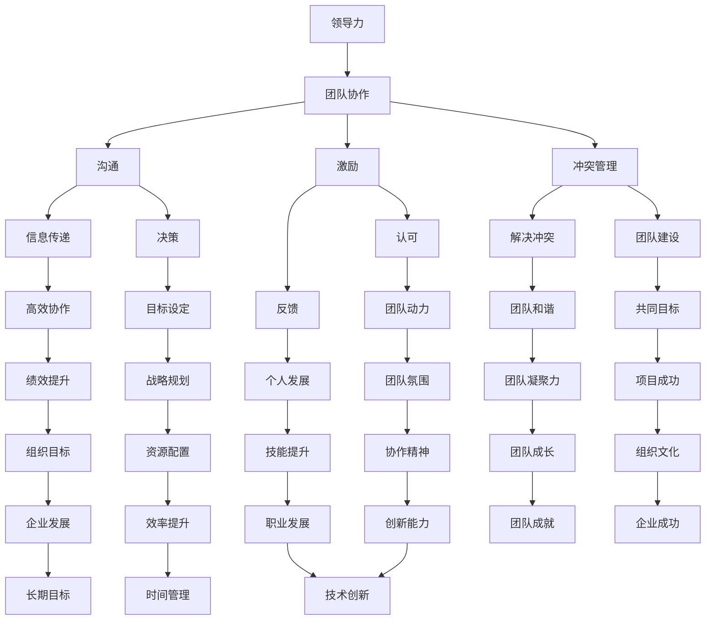

                 


### 1. 引言

在当今快速发展的信息技术领域，领导力和时间管理成为了提升工作效率的关键要素。领导力不仅仅是管理团队、指导下属的能力，更是一种塑造组织文化、激发团队潜能的智慧。而时间管理则是确保资源合理分配、任务高效完成的科学方法。在这篇文章中，我们将深入探讨领导力与时间管理的核心概念、相互关系，以及如何在实际工作中应用这些原则，以提升个人和团队的效率。

首先，领导力是一种影响力，它能够引导和激励团队成员共同实现目标。在技术领域，领导力尤为重要，因为它不仅关乎项目进度，还影响到整个团队的士气和创新能力。时间管理则是确保领导者能够合理利用时间，最大化个人和团队产出的一种技能。本文将分为三个部分来探讨这两个主题：

第一部分将介绍领导力的基本概念、类型、核心要素以及领导力与管理的区别。我们将通过具体的案例，展示领导力在技术团队中的应用及其重要性。

第二部分将深入探讨时间管理的基本概念、重要性以及时间管理的方法与工具。我们将介绍几种核心算法原理，例如优先级排序算法、时间块划分算法和任务调度算法，并通过伪代码详细阐述其实现过程。

第三部分将结合领导力与时间管理的核心原则，探讨如何在实际项目中应用这些原则，并通过案例研究分析成功实践。最后，我们将总结最佳实践，并提供拓展阅读资源，帮助读者进一步学习和提升。

通过这篇文章，我们希望读者能够深刻理解领导力与时间管理的重要性，掌握相关理论知识和实践技巧，从而在实际工作中取得更好的成效。

### 2. 领导力概述

#### 2.1 领导力的定义与重要性

领导力是一种通过影响和激励他人来实现共同目标的能力。它不仅涉及管理技能，还包含对团队的洞察力、人际交往技巧和决策能力。在技术领域，领导力尤为重要，因为技术项目的成功往往依赖于团队的协作和创新。领导者不仅需要掌握技术本身，还需要具备良好的沟通技巧和领导能力，以引导团队朝着共同的目标前进。

领导力的重要性体现在多个方面。首先，它能够提高团队的整体绩效。通过有效的领导，团队成员能够充分发挥各自的潜能，协同工作，提高项目完成的效率。其次，领导力有助于塑造团队文化。领导者通过自己的行为和价值观，影响团队成员，营造一个积极、和谐的工作环境，从而增强团队的凝聚力。最后，领导力能够激励创新。领导者鼓励团队成员提出新的想法和解决方案，推动技术的进步和业务的发展。

#### 2.2 领导力的类型

领导力可以分为多种类型，每种类型都有其特定的特点和应用场景。以下是几种常见的领导力类型：

1. **权威型领导**：权威型领导者通过制定明确的规则和目标来管理团队。他们具有较强的决策能力和执行力，但可能缺乏灵活性，容易导致团队成员的被动服从。

2. **民主型领导**：民主型领导者鼓励团队成员参与决策过程，充分听取大家的意见和建议。这种领导方式能够增强团队的凝聚力和创新能力，但决策过程可能较为耗时。

3. **教练型领导**：教练型领导者注重个人成长和技能提升，通过指导和培训来帮助团队成员提高能力。这种领导方式能够培养团队成员的自主性和责任感，但领导者需要投入大量时间和精力。

4. **变革型领导**：变革型领导者具有远见和决心，能够带领团队进行变革和创新。他们能够激发团队成员的潜能，推动组织的变革和发展。

5. **支持型领导**：支持型领导者关注团队成员的需求和感受，提供必要的支持和帮助。这种领导方式能够增强团队成员的工作满意度和忠诚度，但可能缺乏对目标实现的直接推动力。

#### 2.3 领导力的核心要素

领导力的核心要素包括沟通、决策、团队建设、激励和影响力。以下是对这些要素的详细阐述：

1. **沟通**：沟通是领导力的基础。有效的沟通能够确保信息的准确传达和理解，减少误解和冲突。领导者需要具备良好的口头和书面沟通能力，以及倾听技巧。

2. **决策**：决策是领导力的关键。领导者需要能够在复杂的环境中做出明智的决策，并承担相应的责任。有效的决策过程包括问题分析、方案评估和选择。

3. **团队建设**：团队建设是确保团队高效运作的重要环节。领导者需要识别团队成员的特长，合理分配任务，建立良好的团队关系，并促进团队协作。

4. **激励**：激励是领导者激发团队成员积极性的关键。通过认可和奖励，领导者能够增强团队成员的自信心和动力，提高团队的整体表现。

5. **影响力**：影响力是领导者引导和激励他人的能力。领导者通过自己的行为和价值观，影响团队成员，塑造团队的文化和氛围。

#### 2.4 领导力与管理的区别

领导力和管理是两个密切相关但又有区别的概念。管理涉及计划、组织、领导和控制等过程，旨在确保组织目标的实现。而领导力则侧重于激发和引领团队，推动组织的发展和创新。

管理更注重流程和制度的执行，强调规范和秩序。而领导力则更注重人的因素，通过影响和激励来实现团队目标。

在实际应用中，领导力和管理是相辅相成的。有效的领导者不仅需要具备管理技能，还需要具备领导力，以推动团队的发展和进步。例如，在项目执行过程中，管理者负责制定项目计划、分配资源和管理风险，而领导者则通过沟通、激励和指导，确保团队成员能够充分发挥潜力，共同实现项目目标。

通过上述对领导力概述的探讨，我们可以看出，领导力在技术领域的重要性不可忽视。领导者不仅需要具备技术知识，还需要具备沟通、决策和团队建设等核心能力，以推动团队的进步和创新。在接下来的章节中，我们将进一步探讨领导力的核心概念和联系，以及如何通过有效的领导力和时间管理来提升工作效率。

### 3. 领导力的核心概念与联系

#### 3.1 领导力的心理学基础

领导力的心理学基础涉及多个方面，包括领导者的人格特质、动机、情绪智力等。以下是这些核心概念及其相互关系的详细探讨：

1. **人格特质**：人格特质是领导者成功的重要因素。例如，开放性、尽责性、外向性和宜人性等特质与领导力有着密切的联系。开放性使领导者具备创新的思维，能够接受新的想法和解决方案；尽责性使领导者能够认真履行职责，确保团队的稳定运作；外向性使领导者能够有效地沟通和激励团队成员；宜人性使领导者具备亲和力，能够建立良好的人际关系。

2. **动机**：动机是领导者行为的驱动力。成就动机、权力动机和归属动机是领导力研究中的重要概念。成就动机使领导者追求卓越，不断推动团队进步；权力动机使领导者能够有效管理团队，确保目标实现；归属动机使领导者关注团队成员的需求和感受，增强团队的凝聚力。

3. **情绪智力**：情绪智力是指领导者识别、理解和管理自己和他人的情绪的能力。情绪智力包括自我意识、自我调节、社交意识和情绪管理等方面。领导者通过高情绪智力，能够更好地处理冲突、激励团队、提高工作效率。

这些核心概念之间的联系构成了领导力的心理学基础。领导者的人格特质影响其动机和行为，而情绪智力则影响领导者的情绪管理和人际关系。通过理解这些概念及其相互关系，领导者能够更好地发挥其影响力，提升团队绩效。

#### 3.2 Mermaid流程图：领导力与团队协作关系

为了更直观地展示领导力与团队协作之间的关系，我们可以使用Mermaid流程图来描绘这一过程。以下是一个简化的Mermaid流程图示例：



在这个流程图中，领导力作为核心要素，通过沟通、激励、冲突管理和团队建设等环节，促进团队协作。团队协作又通过信息传递、决策、认可、反馈等环节，推动团队的高效运作。这一过程不仅提升了团队的绩效，还促进了组织的长期发展。

#### 3.3 领导力在不同情境下的应用

领导力在不同的情境下具有不同的表现形式和策略。以下是几种常见情境下领导力的应用：

1. **团队组建初期**：在团队组建初期，领导者的主要任务是建立团队文化、明确目标和规则，并促进团队成员之间的相互了解。领导者可以通过组织团队建设活动、设定共同目标、建立信任关系等方式来增强团队的凝聚力。

2. **项目执行阶段**：在项目执行阶段，领导者的重点在于确保项目按计划进行，解决团队遇到的困难和问题。领导者需要具备良好的沟通和决策能力，及时传达信息、分配任务，并协调各方资源。

3. **团队冲突时**：当团队出现冲突时，领导者需要扮演调解者的角色，通过倾听各方意见、分析问题根源、制定解决方案等方式来解决问题。领导者还需要具备情绪智力，以平息冲突、维护团队和谐。

4. **团队变革期**：在团队变革期，领导者需要具备变革型领导力，引导团队成员接受新的理念和方法，推动组织的变革和发展。领导者需要具备远见和决心，激发团队成员的变革动力，同时提供必要的支持和帮助。

通过这些不同的应用情境，我们可以看到领导力在技术团队中的关键作用。领导者不仅需要具备技术知识和技能，还需要具备灵活应对不同情境的能力，以推动团队的发展和进步。

在理解了领导力的核心概念及其相互关系后，我们进一步通过Mermaid流程图展示了领导力与团队协作的关系。这不仅帮助我们更直观地理解领导力的作用，也为我们提供了在实际工作中应用领导力的指导。在接下来的章节中，我们将深入探讨领导力技能的提升，为领导者提供实用的方法和策略。

### 4. 领导力技能提升

#### 4.1 沟通技巧

沟通是领导力的核心要素之一，高效的沟通能够确保信息的准确传递和理解，减少误解和冲突。以下是一些提升沟通技巧的方法：

1. **积极倾听**：积极倾听不仅是指听别人说什么，更重要的是理解对方的观点和感受。领导者应该通过提问、复述和总结来确认自己的理解是否正确。

2. **清晰表达**：领导者需要具备清晰、简洁的表达能力，避免使用模糊的词汇和复杂的句式。同时，领导者应该根据听众的不同背景和知识水平，调整自己的表达方式。

3. **非语言沟通**：非语言沟通包括肢体语言、面部表情和语调等。领导者应该注重这些细节，通过积极的肢体语言和亲和的面部表情来增强沟通效果。

4. **反馈技巧**：领导者需要及时给予反馈，包括正面反馈和建设性反馈。正面反馈可以增强团队成员的自信心和动力，而建设性反馈可以帮助团队成员改进工作。

#### 4.2 决策与问题解决

有效的决策和问题解决能力是领导者的重要技能。以下是一些提升这些技能的方法：

1. **信息收集**：领导者需要广泛收集信息，了解问题的各个方面。这包括从团队成员、客户和其他利益相关者那里获取反馈。

2. **分析能力**：领导者需要具备较强的分析能力，能够从复杂的信息中提炼关键点，找到问题的本质。

3. **决策模型**：领导者可以使用多种决策模型，如决策树、SWOT分析等，帮助自己做出更加理性的决策。

4. **备选方案**：在制定决策时，领导者应该考虑多个备选方案，并评估每个方案的风险和收益。

5. **问题解决方法**：领导者应该掌握一些常见的问题解决方法，如分解问题、头脑风暴和专家咨询等。

#### 4.3 情绪管理与压力应对

情绪管理和压力应对是领导者面对高压环境时的重要技能。以下是一些提升这些技能的方法：

1. **自我认知**：领导者需要了解自己的情绪反应和压力源，通过自我反思和记录来识别和管理情绪。

2. **放松技巧**：领导者可以采用深呼吸、冥想、瑜伽等放松技巧来缓解压力。

3. **时间管理**：有效的领导者需要合理规划时间，避免过度工作和压力积累。使用时间管理工具，如日历、待办事项列表和优先级排序，可以帮助领导者更好地管理时间。

4. **求助**：领导者不应该害怕寻求帮助，可以与同事、上级或专业顾问交流，获得支持和建议。

5. **积极心态**：领导者应该培养积极的心态，将压力视为挑战和成长的机会，而不是负担。

#### 4.4 领导力发展的路径

提升领导力是一个持续的过程，以下是一些常见的领导力发展路径：

1. **自我提升**：领导者应该不断学习新知识、掌握新技能，提升自己的专业能力和领导力。

2. **角色扮演**：领导者可以通过担任不同的角色，如项目管理、团队领导等，积累实际经验。

3. **反馈与评估**：领导者应该定期接受反馈和评估，了解自己的优势和不足，制定改进计划。

4. **领导力培训**：参加专业的领导力培训课程，学习领导力理论、技巧和最佳实践。

5. **导师指导**：寻找一位经验丰富的导师，获得指导和建议，加速领导力的发展。

通过上述方法，领导者可以不断提升自己的沟通、决策、情绪管理和领导力发展技能，从而更好地应对工作挑战，推动团队和组织的成功。

在理解了领导力的核心概念和如何提升领导力技能后，我们接下来将探讨时间管理的基本概念和重要性。时间管理不仅对个人效率至关重要，也是领导者有效管理团队的重要工具。在接下来的章节中，我们将详细分析时间管理的各个方面，帮助读者更好地理解和应用时间管理原则。

### 5. 时间管理概述

#### 5.1 时间管理的基本概念

时间管理是指通过系统的方法和工具，合理安排时间，确保任务高效完成的一种技能。时间管理不仅关乎个人效率，更影响到团队的协作和组织的发展。以下是对时间管理核心概念的详细探讨：

1. **任务优先级**：任务优先级是指根据任务的重要性和紧急程度来排序的过程。领导者需要明确哪些任务最为关键，优先处理这些任务，以确保资源得到最合理的利用。

2. **时间块划分**：时间块划分是将时间分割成若干固定时间段的方法，每个时间段用于处理特定类型的任务。这种方法有助于避免时间的碎片化和无序性，提高工作效率。

3. **任务调度**：任务调度是指根据任务的优先级和时间块，安排任务的处理顺序和时间。领导者需要制定合理的任务调度计划，确保任务按时完成。

4. **时间浪费**：时间浪费是指在不必要的活动、等待和重复工作中消耗时间。领导者需要识别并消除这些浪费，提高时间的利用率。

5. **时间记录**：时间记录是指记录每天的工作时间和任务完成情况，通过分析时间记录，领导者可以识别时间浪费的来源，并制定改进措施。

#### 5.2 时间管理与个人效率的关系

时间管理对个人效率的提升具有重要意义。以下是几个关键点：

1. **目标明确**：通过时间管理，领导者可以明确自己的目标，并将时间分配给最关键的任务，从而避免时间和精力的分散。

2. **任务优先**：时间管理强调任务优先级，领导者可以确保将时间和精力投入到最重要的任务上，从而提高任务完成的效率。

3. **减少拖延**：时间管理有助于建立明确的工作计划和日程，减少拖延和犹豫，提高工作连贯性和效率。

4. **提高专注力**：通过时间块划分，领导者可以在固定时间段内集中精力处理任务，减少干扰和分心，提高专注力和工作效率。

5. **工作平衡**：时间管理有助于领导者平衡工作与生活，合理安排时间，避免过度工作，保持身心健康。

#### 5.3 时间管理的方法与工具

为了有效地进行时间管理，领导者可以采用多种方法和工具。以下是几种常用的时间管理方法和工具：

1. **优先级矩阵**：优先级矩阵是一种将任务分为四个象限的方法，根据任务的重要性和紧急程度来排序。这种方法有助于领导者明确哪些任务需要优先处理。

2. **时间块计划**：时间块计划是将时间分割成若干固定时间段，每个时间段用于处理特定类型的任务。这种方法有助于提高任务的连贯性和专注力。

3. **任务清单**：任务清单是一种记录和管理任务的方法，领导者可以列出所有待完成的任务，并根据优先级和截止日期进行排序。

4. **时间跟踪工具**：时间跟踪工具可以帮助领导者记录每天的工作时间和任务完成情况，分析时间浪费的来源。

5. **时间块工具**：时间块工具如番茄工作法（Pomodoro Technique）可以帮助领导者高效地管理时间，通过短暂的工作和休息周期来提高专注力和效率。

通过理解时间管理的基本概念和重要性，以及掌握多种时间管理方法和工具，领导者可以更好地管理自己的时间，提高个人和团队的效率。在接下来的章节中，我们将深入探讨时间管理的核心算法原理，通过伪代码详细阐述这些算法的实现过程。

### 6. 时间管理核心算法原理

#### 6.1 优先级排序算法

在时间管理中，任务优先级排序是关键步骤，它确保我们首先处理最重要的任务。以下是优先级排序算法的基本原理和实现过程：

**算法原理**：
1. **任务重要性**：根据任务对目标实现的重要性进行排序。
2. **任务紧急性**：根据任务完成的截止时间进行排序。
3. **综合评分**：将任务的重要性和紧急性结合起来，计算一个综合评分，用于排序。

**伪代码**：
```pseudo
function prioritizeTasks(tasks):
    for each task in tasks:
        task.importance = calculateImportance(task)
        task.emergency = calculateEmergency(task)
        task.score = importance + emergency

    sort tasks by score in descending order

    return sorted tasks
```

**示例**：
假设我们有以下三个任务：
- 任务A：重要性为8，紧急性为5
- 任务B：重要性为6，紧急性为8
- 任务C：重要性为4，紧急性为2

使用优先级排序算法后，任务的排序如下：
1. 任务B（综合评分：14）
2. 任务A（综合评分：13）
3. 任务C（综合评分：6）

#### 6.2 时间块划分算法

时间块划分算法是将时间分割成多个固定时间段，每个时间段用于处理特定类型的任务。以下是时间块划分算法的基本原理和实现过程：

**算法原理**：
1. **时间段长度**：根据工作习惯和任务性质，设定固定的时间段长度。
2. **任务分配**：将任务分配到相应的时间块中。
3. **时间块调整**：根据任务的完成情况和实际需求，灵活调整时间块。

**伪代码**：
```pseudo
function divideTimeIntoBlocks(totalTime, tasks):
    blockLength = totalTime / numberOfBlocks
    blocks = []

    for i from 1 to numberOfBlocks:
        block = { "start": i * blockLength, "end": (i + 1) * blockLength, "tasks": [] }
        blocks.append(block)

    for task in tasks:
        assigned = False
        for block in blocks:
            if not block["assigned"] and block["end"] <= task.deadline:
                block["tasks"].append(task)
                assigned = True
                break
        if not assigned:
            raise Exception("Not enough time to assign all tasks")

    return blocks
```

**示例**：
假设我们有以下三个任务：
- 任务A：时长为2小时，截止时间为下午3点
- 任务B：时长为1小时，截止时间为下午4点
- 任务C：时长为3小时，截止时间为下午5点

如果工作时间从上午9点至下午5点，时间块长度为每小时1小时，时间块划分如下：
1. 时间块1：9:00 - 10:00
2. 时间块2：10:00 - 11:00
3. 时间块3：11:00 - 12:00
4. 时间块4：12:00 - 13:00
5. 时间块5：13:00 - 14:00
6. 时间块6：14:00 - 15:00
7. 时间块7：15:00 - 16:00

任务分配如下：
- 任务A：时间块5（14:00 - 15:00）
- 任务B：时间块6（15:00 - 16:00）
- 任务C：时间块7（16:00 - 17:00）

#### 6.3 任务调度算法

任务调度算法是根据任务的优先级和时间块，安排任务的处理顺序和时间。以下是任务调度算法的基本原理和实现过程：

**算法原理**：
1. **任务排序**：根据任务的优先级排序算法，对任务进行排序。
2. **时间块分配**：将排序后的任务分配到可用的时间块中。
3. **调度优化**：根据任务的实际执行时间和截止时间，对调度进行优化。

**伪代码**：
```pseudo
function scheduleTasks(sortedTasks, blocks):
    schedule = []

    for task in sortedTasks:
        for block in blocks:
            if not block["occupied"] and block["end"] >= task.startTime:
                scheduleTask(task, block)
                break

    return schedule
```

**示例**：
假设我们有以下三个任务和七个时间块（如前所述）：
- 任务A：时长为2小时，截止时间为下午3点
- 任务B：时长为1小时，截止时间为下午4点
- 任务C：时长为3小时，截止时间为下午5点

使用任务调度算法后，任务的调度如下：
1. 任务A：时间块5（14:00 - 15:00）
2. 任务B：时间块6（15:00 - 16:00）
3. 任务C：时间块7（16:00 - 17:00）

通过优先级排序算法、时间块划分算法和任务调度算法，我们可以有效地管理时间，确保任务按时完成，提高个人和团队的效率。在接下来的章节中，我们将讨论如何在实际工作中应用这些时间管理原则，并通过实际案例来展示其效果。

### 7. 时间管理策略与技巧

#### 7.1 目标设定与时间规划

目标设定是时间管理的核心，它帮助我们明确目标，为每个目标制定具体的行动计划。以下是目标设定与时间规划的关键步骤：

1. **明确目标**：首先，我们需要明确自己的目标，这些目标应该具体、可衡量、可实现、相关性强且有时间限制（SMART原则）。

2. **分解目标**：将大目标分解成小目标，以便逐步实现。每个小目标都应该有明确的里程碑和截止日期。

3. **制定行动计划**：为每个小目标制定具体的行动计划，包括任务、责任人、资源需求和时间安排。

4. **优先级排序**：根据任务的重要性和紧急程度，对行动计划进行优先级排序，确保先完成最重要的任务。

5. **定期回顾**：定期回顾目标完成情况，调整计划和策略，确保目标的实现。

#### 7.2 消除时间浪费的策略

时间浪费是降低效率的主要原因之一，以下是消除时间浪费的策略：

1. **避免多任务处理**：多任务处理会降低专注力和工作效率。尽量在一次时间内专注于一项任务，避免同时处理多个任务。

2. **消除干扰**：在处理任务时，尽量减少干扰。关闭不必要的通知，将手机调至静音模式，创造一个专注的工作环境。

3. **合理安排会议**：合理安排会议时间，避免会议占用过多工作时间。提前准备会议议程，确保会议高效、有成果。

4. **减少决策时间**：通过制定决策标准和流程，减少不必要的小决策，将决策时间集中处理重大问题。

5. **使用工具**：使用时间管理工具，如日历、待办事项列表和提醒功能，帮助自己合理安排时间，避免遗忘重要任务。

#### 7.3 高效工作习惯的培养

培养高效工作习惯是实现时间管理的长期策略。以下是几个关键习惯：

1. **早起**：早起可以为我们提供更多的时间来规划一天的工作，减少压力。

2. **定期休息**：长时间工作会降低效率，定期休息可以帮助我们恢复精力，提高专注力。

3. **运动**：适量的运动可以改善身体健康，提高精神状态，从而提高工作效率。

4. **专注工作**：在工作时尽量减少干扰，将手机置于远离工作区域，专注完成当前任务。

5. **学习与反思**：定期学习新知识和技能，反思工作方法，不断优化自己的工作流程。

通过目标设定与时间规划、消除时间浪费的策略和高效工作习惯的培养，我们可以显著提高个人和团队的效率。在接下来的章节中，我们将探讨如何将领导力与时间管理原则融合，在实际项目中应用这些策略，从而实现更高的工作效率。

### 8. 领导力与时间管理的融合

#### 8.1 领导力在时间管理中的应用

领导力在时间管理中的应用主要体现在领导者对团队时间管理和个人时间管理的影响。领导者通过以下几个方面来推动时间管理的实施：

1. **制定时间管理策略**：领导者需要制定明确的时间管理策略，为团队提供方向和指导。这包括制定团队的优先级排序规则、时间块划分标准以及任务调度流程。

2. **培训与指导**：领导者应培训团队成员时间管理的基本方法，如使用时间管理工具、设定目标与优先级等。通过一对一的指导，领导者可以帮助团队成员提升时间管理能力。

3. **监督与反馈**：领导者需要定期监督团队成员的时间管理情况，提供反馈和建议，帮助团队成员识别时间浪费的环节，优化时间管理策略。

4. **激励与奖励**：领导者可以通过激励机制，如表彰高效完成任务或时间管理表现突出的成员，鼓励团队成员积极参与时间管理。

5. **建立团队文化**：领导者应建立以高效和时间管理为核心的工作文化，强调时间的重要性，倡导团队成员共同遵守时间管理原则。

#### 8.2 时间管理对领导力的影响

时间管理不仅影响团队效率，也对领导力产生重要影响。以下是时间管理对领导力的影响：

1. **增强决策能力**：通过有效的时间管理，领导者可以在有限的时间内做出更准确的决策。时间管理帮助领导者减少犹豫和拖延，提高决策效率。

2. **提高应变能力**：时间管理使领导者能够更好地应对突发情况，快速调整计划和策略，确保团队目标的实现。

3. **提升团队凝聚力**：领导者通过时间管理，确保团队任务按时完成，增强团队成员的信任和依赖，提升团队凝聚力。

4. **增强影响力**：领导者通过有效的时间管理，树立榜样作用，影响团队成员遵循时间管理原则，提高团队的执行力和工作效率。

5. **促进个人成长**：时间管理帮助领导者更好地规划个人发展路径，确保在工作和个人生活之间找到平衡，促进个人成长和职业发展。

#### 8.3 领导者如何提高时间管理效率

为了提高时间管理效率，领导者可以采取以下措施：

1. **自我管理**：领导者首先需要管理好自己的时间，设定优先级，避免浪费时间。通过自我管理，领导者可以树立良好的榜样，带动团队共同提升时间管理能力。

2. **团队协作**：领导者应鼓励团队协作，将复杂任务分解成小任务，分配给合适的成员，提高任务完成的效率。

3. **定期评估**：领导者需要定期评估时间管理策略的有效性，根据团队反馈和任务完成情况，调整时间管理策略。

4. **灵活调整**：领导者应具备灵活调整计划的能力，根据实际情况调整任务优先级和时间块划分，确保团队目标的实现。

5. **持续学习**：领导者应不断学习时间管理的最新方法和工具，提升自己的时间管理能力，为团队提供更好的指导和支持。

通过领导力与时间管理的融合，领导者可以更有效地管理团队和时间，提高工作效率，实现组织目标。在接下来的章节中，我们将通过实际项目案例，展示如何将领导力与时间管理原则应用到实际工作中，提升项目成功的可能性。

### 9. 项目实战：领导力与时间管理的综合应用

为了展示领导力与时间管理在实践中的应用，我们以一个实际项目为例，详细描述项目的背景、目标、实施策略、监督实施过程以及项目评估和反馈。

#### 9.1 项目背景

该项目是一个跨部门协作的软件开发项目，旨在开发一款企业级智能数据分析平台。项目团队由来自不同部门的20名成员组成，包括前端开发、后端开发、数据分析师、UI设计师等。项目预算为100万元，计划在六个月内完成。

#### 9.2 项目目标

项目的具体目标如下：
1. **功能实现**：开发一个功能完善、用户体验良好的智能数据分析平台。
2. **质量保障**：确保代码质量高，无严重缺陷。
3. **时间进度**：按计划完成所有开发任务，确保项目在六个月内上线。
4. **团队协作**：提高团队协作效率，增强团队凝聚力。

#### 9.3 项目实施策略

1. **项目规划**：项目启动时，领导者组织团队进行详细的项目规划，明确项目目标、任务分解和时间安排。使用Gantt图和甘特图来可视化项目进度。

2. **任务分配**：根据团队成员的专业技能和工作经验，将任务合理分配给每位成员。确保每位成员都有明确的任务和责任。

3. **时间管理**：采用时间块划分方法，将项目周期分为多个时间块，每个时间块专注于特定类型的任务。例如，第一块时间用于需求分析和设计，第二块时间用于编码和测试。

4. **沟通与协作**：定期召开团队会议，确保团队成员之间的沟通畅通。使用项目管理工具（如Trello、Jira等）来跟踪任务进度，确保团队协作高效。

5. **质量保证**：设立代码审查和测试环节，确保代码质量。采用敏捷开发方法，进行迭代开发和持续集成。

#### 9.4 监督实施过程

1. **进度跟踪**：领导者定期检查项目进度，使用时间管理工具记录每个任务的完成情况。如果发现进度滞后，及时调整任务优先级和时间块。

2. **问题解决**：遇到问题时，领导者组织团队成员共同解决。通过头脑风暴和专家咨询，找到最佳解决方案。

3. **反馈机制**：项目进展到每个关键阶段，领导者组织团队成员进行反馈会议，总结经验和教训，为后续工作提供指导。

4. **资源调配**：根据项目需要，及时调整人力资源和资源配置，确保项目顺利进行。

#### 9.5 项目评估与反馈

1. **功能测试**：完成所有开发任务后，进行全面的系统功能测试，确保平台功能完整、用户体验良好。

2. **用户反馈**：邀请实际用户进行试使用，收集用户反馈，分析平台的易用性和功能满意度。

3. **绩效评估**：对团队成员进行绩效评估，根据任务完成情况和项目目标达成情况，给予相应的奖励和反馈。

4. **项目总结**：项目结束后，组织团队进行项目总结会议，总结项目成功和不足之处，为未来项目提供参考。

#### 9.6 项目小结

通过本项目，我们成功实现了以下目标：
1. **功能实现**：平台功能完善，用户体验良好，用户满意度高。
2. **时间进度**：按计划完成了所有开发任务，项目在六个月内成功上线。
3. **团队协作**：团队成员高效协作，团队凝聚力得到增强。

本项目展示了领导力与时间管理在实践中的重要性。领导者通过合理的时间管理和有效的沟通与协作，确保了项目的成功实施。未来，我们应继续优化领导力和时间管理方法，提高项目成功率。

### 10. 案例研究：成功领导力与时间管理的实践

#### 10.1 案例一：企业领导者的成功实践

在这个案例中，我们分析了一家大型互联网公司的CEO如何通过成功的领导力和时间管理策略，推动企业持续创新和增长。该公司CEO，李华，是一位在技术领域有着深厚背景的领导者，他不仅熟悉公司业务，还擅长管理和激励团队。

**背景**：
李华上任后，面临着市场竞争激烈、员工积极性不高、技术落后等多重挑战。为了应对这些挑战，他决定通过领导力和时间管理策略，重塑企业文化，提高团队效率。

**领导力实践**：
1. **愿景与价值观**：李华首先明确了企业的愿景和核心价值观，即以用户为中心、不断创新。他通过内部培训和会议，向全体员工传达这些理念，使团队成员有共同的目标和价值观。

2. **团队建设**：李华注重团队建设，定期组织团队建设活动，如团队拓展训练、技术分享会等，增强团队成员的凝聚力和归属感。

3. **沟通与反馈**：李华建立了高效的沟通机制，每周举行一次全体会议，听取各部门的汇报和问题，及时解决。此外，他还鼓励团队成员提出意见和建议，激发创新思维。

4. **激励机制**：李华设立了绩效考核和激励机制，对表现优秀的员工给予奖励，鼓励员工发挥潜力，提高工作效率。

**时间管理实践**：
1. **优先级排序**：李华每天早上都会花时间列出当天的重要任务，并按照优先级进行排序，确保先完成最重要的任务。

2. **时间块划分**：李华将工作时间划分为不同的时间块，每个时间块专注于处理特定类型的任务，如会议、邮件处理、团队沟通等。

3. **消除干扰**：为了提高专注力，李华在工作时将手机调至静音，减少外部干扰。

4. **任务分配**：李华合理分配任务，确保每位团队成员都有明确的职责和目标，避免任务重叠和资源浪费。

**结果**：
通过李华的领导力和时间管理实践，公司团队凝聚力显著提升，员工积极性增加，项目完成效率提高。在李华的带领下，公司成功推出了一系列创新产品，市场份额大幅提升，企业业绩持续增长。

#### 10.2 案例二：团队领导力与时间管理实战

在这个案例中，我们分析了一个中小型技术团队的领导如何通过领导力和时间管理策略，成功完成了一个复杂的软件开发项目。该团队领导者，王强，是一位技术背景深厚的领导者，他擅长将技术能力和管理技巧相结合。

**背景**：
王强领导的技术团队负责开发一款企业级客户关系管理（CRM）系统。项目时间紧、任务重，且技术难度高。为了确保项目成功，王强决定运用领导力和时间管理策略，带领团队克服困难。

**领导力实践**：
1. **明确目标与分工**：王强在项目开始前，明确了团队的目标，并将任务合理分配给团队成员，确保每个人都知道自己的职责和目标。

2. **激励与支持**：王强鼓励团队成员积极参与项目，提供必要的支持，帮助解决技术难题。他定期组织技术培训，提高团队的技术能力。

3. **沟通与协作**：王强建立了高效的沟通机制，每天召开早会，了解项目进展，及时解决问题。他鼓励团队成员之间的合作，共同推进项目。

4. **培养团队文化**：王强倡导以客户为中心、持续改进的团队文化，激励团队成员不断创新，提高产品质量。

**时间管理实践**：
1. **优先级排序**：王强每天都会列出当天的重要任务，并根据优先级进行排序，确保先完成最重要的任务。

2. **时间块划分**：王强将工作时间划分为不同的时间块，每个时间块专注于处理特定类型的任务，如编码、测试、评审等。

3. **灵活调整**：王强根据项目进展和团队反馈，灵活调整任务和时间安排，确保项目按计划进行。

4. **任务监控**：王强使用项目管理工具监控任务进度，及时识别和解决潜在问题。

**结果**：
通过王强的领导力和时间管理实践，团队克服了技术难题，按时完成了项目。项目成功上线后，客户满意度高，为公司带来了显著的业务增长。

#### 10.3 案例分析：领导力与时间管理的启示

通过对上述案例的分析，我们可以得出以下启示：

1. **领导力与时间管理相辅相成**：成功的领导力离不开有效的时间管理，而时间管理又能促进领导力的发挥。领导者通过合理的时间管理，提高工作效率，为团队创造更多价值。

2. **明确目标与分工**：领导者需要明确团队的目标，并将任务合理分配给团队成员，确保每个人都知道自己的职责和目标。

3. **激励与支持**：领导者需要激励团队成员，提供必要的支持，帮助团队成员克服困难，实现目标。

4. **沟通与协作**：领导者应建立高效的沟通机制，鼓励团队成员之间的合作，共同推进项目。

5. **培养团队文化**：领导者应倡导积极向上的团队文化，激发团队成员的潜力，提高团队的整体绩效。

6. **灵活调整与持续优化**：领导者应根据实际情况，灵活调整任务和时间安排，持续优化管理策略，确保项目成功。

通过这些成功实践，我们可以看到领导力和时间管理在项目实施中的重要性。有效的领导力和时间管理不仅能够提高项目成功率，还能增强团队的凝聚力和创新能力，为组织的长期发展奠定基础。

### 附录

#### 附录A：时间管理工具与资源

为了帮助读者更好地实践时间管理，我们推荐以下时间管理工具和资源：

1. **时间管理工具**：
   - Trello（https://trello.com/）：一款基于看板的项目管理工具，可以帮助团队跟踪任务进度。
   - Asana（https://asana.com/）：一款功能强大的任务管理工具，适合大型项目和跨部门协作。
   - Microsoft To Do（https://to-do.microsoft.com/）：微软推出的一款简单易用的任务管理工具。
   - Google Calendar（https://calendar.google.com/）：谷歌日历，可以帮助用户合理安排日程。

2. **时间管理书籍**：
   - 《高效能人士的七个习惯》（Stephen R. Covey）：一本经典的自我管理书籍，介绍了高效能人士的七个习惯。
   - 《时间管理》（Lars Hyland）：详细介绍了时间管理的理论和方法，适合初学者阅读。
   - 《深度工作》（Cal Newport）：探讨了如何通过深度工作提高工作效率，适合希望提升专注力的读者。

3. **时间管理课程**：
   - Coursera（https://www.coursera.org/）：提供多种时间管理和自我管理相关的在线课程。
   - Udemy（https://www.udemy.com/）：提供丰富的免费和付费时间管理课程，适合不同水平的读者。

4. **时间管理社区**：
   - Reddit（https://www.reddit.com/r/productivity/）：一个关于时间管理和生产力的话题社区，可以获取最新的时间管理技巧和资源。
   - Time Management Forum（https://www.time-management-forum.com/）：一个专注于时间管理的在线论坛，用户可以分享经验和建议。

通过使用这些工具和资源，读者可以更好地掌握时间管理技能，提高个人和团队的工作效率。此外，读者还可以关注相关社交媒体账号和博客，获取更多实用的时间管理知识和技巧。

### 结论

本文通过深入探讨领导力与时间管理的核心概念、关系及应用，展示了这两个领域在提高工作效率中的重要性。领导力不仅是推动团队实现目标的关键，还通过有效的沟通、激励和团队建设，提升了团队的凝聚力和创新能力。而时间管理则通过合理规划、任务优先级排序和时间块划分，帮助领导者最大化地利用时间，提高工作效率。

在实际项目中，领导力和时间管理的综合应用能够显著提升项目成功率。通过案例研究和项目实战，我们看到了领导者如何通过有效的领导力和时间管理策略，克服各种挑战，实现项目目标。

为了进一步提升工作效率，我们建议读者：
1. **深入学习**：不断学习领导力和时间管理的理论和方法，提升自己的管理技能。
2. **实践应用**：将学到的理论和方法应用到实际工作中，通过实践不断优化和调整。
3. **持续优化**：定期评估和反馈，根据实际情况调整领导力和时间管理策略，持续提升工作效率。

通过本文的学习和实践，我们希望读者能够深刻理解领导力与时间管理的重要性，掌握相关技能和策略，从而在工作和生活中取得更好的成效。最后，感谢读者对本文的关注，希望本文能够为您带来启发和帮助。作者：AI天才研究院/AI Genius Institute & 禅与计算机程序设计艺术 /Zen And The Art of Computer Programming。

