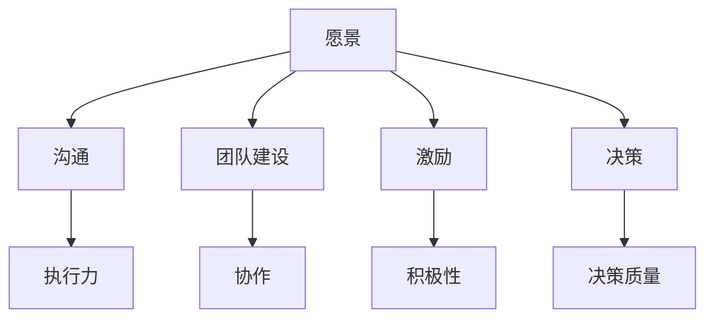

                 

## 第1章: 领导力与时间管理概述

### 1.1 什么是领导力

领导力，作为一种抽象概念，其定义和范围在不同的情境和学科中有着多样化的解读。然而，可以将其核心定义概括为：领导力是指一种引导和激励他人，共同实现既定目标的能力。这种能力不仅仅是简单的指挥和监督，更涉及到深层次的沟通、愿景构建、团队建设和激励等方面。

#### 1.1.1 领导力的定义

领导力是一种综合性的能力，它不仅包括领导他人的艺术，还包括了自我领导、团队领导和组织领导。以下是领导力的五个关键要素：

1. **愿景（Vision）**：愿景是领导力的灵魂。一个优秀的领导者必须能够清晰、明确地描绘出未来的蓝图，使团队成员明白目标所在，并为之努力。

2. **沟通（Communication）**：沟通是领导力的核心要素之一。领导者需要通过有效的沟通技巧，将愿景、目标和计划传达给团队成员，确保每个人都能够理解并认同。

3. **团队建设（Team Building）**：团队建设是领导力不可或缺的部分。一个成功的团队需要一个和谐的团队关系，这不仅包括团队成员之间的相互理解和支持，还包括共同目标和价值观的建立。

4. **激励（Motivation）**：激励是领导力的关键。领导者需要能够激发团队成员的内在动机，鼓励他们发挥最大潜力，实现个人和团队的共同成长。

5. **决策（Decision-making）**：决策是领导力的体现。领导者需要在面对复杂多变的情况时，能够迅速做出明智的决策，引导团队前进。

#### 1.1.2 领导力的五个关键要素

1. **愿景（Vision）**：愿景是领导力的核心。一个优秀的领导者必须能够清晰、明确地描绘出未来的蓝图，使团队成员明白目标所在，并为之努力。

2. **沟通（Communication）**：沟通是领导力的核心要素之一。领导者需要通过有效的沟通技巧，将愿景、目标和计划传达给团队成员，确保每个人都能够理解并认同。

3. **团队建设（Team Building）**：团队建设是领导力不可或缺的部分。一个成功的团队需要一个和谐的团队关系，这不仅包括团队成员之间的相互理解和支持，还包括共同目标和价值观的建立。

4. **激励（Motivation）**：激励是领导力的关键。领导者需要能够激发团队成员的内在动机，鼓励他们发挥最大潜力，实现个人和团队的共同成长。

5. **决策（Decision-making）**：决策是领导力的体现。领导者需要在面对复杂多变的情况时，能够迅速做出明智的决策，引导团队前进。

#### 1.1.3 领导力与管理的区别

领导力与管理的区别在于其侧重点不同。管理更侧重于规划、组织、协调和控制，确保任务得到有效执行。而领导力则更侧重于激励、启发和引领，激发团队成员的内在动力和创造力。一个优秀的领导者应当能够将领导力和管理能力有机结合，以实现团队的高效运作。

### 1.2 时间管理的概念

时间管理是指通过合理安排时间，提高工作效率和生活质量的方法。它不仅仅是一种技能，更是一种态度和生活方式。以下是时间管理的重要性以及其基本原则。

#### 1.2.1 时间管理的重要性

1. **提高工作效率**：合理规划时间，减少无效时间，提高工作效率。

2. **提升生活质量**：平衡工作与生活，实现个人成长和幸福感。

3. **减少压力**：合理安排工作与休息，避免过度劳累，减少压力。

#### 1.2.2 时间管理的基本原则

1. **优先级排序**：根据任务的重要性和紧急性进行排序，确保关键任务优先完成。

2. **设定目标**：明确工作目标，为每个任务设定明确的时间限制。

3. **避免拖延**：及时处理任务，避免拖延，保持工作节奏。

4. **合理分配时间**：根据任务特点和自身习惯，合理安排工作时间。

### 1.3 领导力与时间管理的联系

领导力与时间管理密不可分。优秀的领导力有助于提高团队的时间管理能力，而高效的时间管理又能提升领导者的领导效果。

#### 1.3.1 领导者的时间管理

1. **制定计划**：领导者应具备良好的时间规划能力，确保团队目标的实现。

2. **分配任务**：合理分配任务，充分发挥团队成员的潜力。

3. **监督执行**：关注团队成员的时间管理情况，确保任务按时完成。

#### 1.3.2 时间管理对领导力的影响

1. **提高领导者的决策能力**：通过时间管理，领导者能更快地做出明智的决策。

2. **增强团队凝聚力**：时间管理的成功有助于提高团队士气，增强团队凝聚力。

3. **提升领导者的个人魅力**：领导者良好的时间管理能力会赢得团队成员的尊重和信任。

### 1.4 总结

领导力与时间管理是领导者必备的两大核心能力。掌握并运用这些能力，将有助于领导者更好地实现团队目标，提高个人影响力，实现事业的持续成功。

---

## 第2章: 领导力核心概念与架构

### 2.1 领导力的核心概念

#### 2.1.1 领导力的定义

领导力是一种引导和激励他人达成共同目标的能力。它不仅包括领导他人，还涉及管理自我、团队管理以及组织管理等全方位的技能。

#### 2.1.2 领导力的五个关键要素

1. **愿景（Vision）**：愿景是领导力的灵魂。一个优秀的领导者必须能够清晰、明确地描绘出未来的蓝图，使团队成员明白目标所在，并为之努力。

2. **沟通（Communication）**：沟通是领导力的核心要素之一。领导者需要通过有效的沟通技巧，将愿景、目标和计划传达给团队成员，确保每个人都能够理解并认同。

3. **团队建设（Team Building）**：团队建设是领导力不可或缺的部分。一个成功的团队需要一个和谐的团队关系，这不仅包括团队成员之间的相互理解和支持，还包括共同目标和价值观的建立。

4. **激励（Motivation）**：激励是领导力的关键。领导者需要能够激发团队成员的内在动机，鼓励他们发挥最大潜力，实现个人与团队的共同成长。

5. **决策（Decision-making）**：决策是领导力的体现。领导者需要在面对复杂多变的情况时，能够迅速做出明智的决策，引导团队前进。

#### 2.1.3 领导力与管理的区别

领导力与管理的区别在于其侧重点不同。管理更侧重于规划、组织、协调和控制，确保任务得到有效执行。而领导力则更侧重于激励、启发和引领，激发团队成员的内在动力和创造力。一个优秀的领导者应当能够将领导力和管理能力有机结合，以实现团队的高效运作。

### 2.2 领导力的架构

领导力架构是一个系统性的框架，它包含了领导力的核心要素和相互关系。

#### 2.2.1 领导力架构的Mermaid流程图



#### 2.2.2 领导力架构的详细解析

1. **愿景（Vision）**：愿景是领导力的核心，它为团队指明方向，激发团队成员的斗志和信心。

2. **沟通（Communication）**：沟通是领导力的核心要素之一。领导者需要通过有效的沟通技巧，将愿景、目标和计划传达给团队成员，确保每个人都能够理解并认同。

3. **团队建设（Team Building）**：团队建设是领导力不可或缺的部分。一个成功的团队需要一个和谐的团队关系，这不仅包括团队成员之间的相互理解和支持，还包括共同目标和价值观的建立。

4. **激励（Motivation）**：激励是领导力的关键。领导者需要能够激发团队成员的内在动机，鼓励他们发挥最大潜力，实现个人与团队的共同成长。

5. **决策（Decision-making）**：决策是领导力的体现。领导者需要在面对复杂多变的情况时，能够迅速做出明智的决策，引导团队前进。

6. **执行力（Execution）**：执行力是实现愿景和目标的保障。领导者需要确保团队成员能够有效地执行决策和计划，以实现预期的成果。

7. **协作（Collaboration）**：协作是团队建设的重要组成部分。一个成功的团队需要成员之间的相互协作和配合，以实现共同的目标。

8. **积极性（Enthusiasm）**：积极性是激励的重要组成部分。领导者需要激发团队成员的积极性，鼓励他们积极参与团队工作，提高工作效率。

9. **决策质量（Decision Quality）**：决策质量是领导力的重要体现。领导者需要确保做出的决策是明智的，能够引导团队走向成功。

### 2.3 领导力模型的演化

领导力模型随着社会和商业环境的变化而不断演化。以下是几种常见的领导力模型：

1. **特质模型**：特质模型认为领导者具备某些固有的特质，如自信、决断力、沟通能力等。这些特质是领导者成功的关键。

2. **行为模型**：行为模型认为领导者的行为和风格对其领导效果有重要影响。这种模型强调了领导者应该如何行动和表现。

3. **情境模型**：情境模型认为领导者的领导效果取决于具体情境。领导者需要根据不同的情境采取不同的领导风格，以达到最佳效果。

4. **变革模型**：变革模型认为领导者是变革的推动者。领导者需要能够识别变革的需求，并带领团队实现变革。

5. **服务型领导模型**：服务型领导模型认为领导者的核心任务是服务于团队成员，帮助他们实现个人和职业发展。

### 2.4 领导力的发展和实践

领导力是一种可以通过学习和实践不断提升的能力。以下是一些领导力发展的方法和实践：

1. **自我反思**：领导者需要定期进行自我反思，了解自己的优点和不足，并制定改进计划。

2. **学习与培训**：领导者需要不断学习新的知识和技能，以适应不断变化的环境。

3. **经验分享**：领导者可以通过与团队成员分享经验和教训，帮助他们提高领导力。

4. **领导力教练**：领导力教练可以帮助领导者发现自身的问题，并提供改进建议。

5. **实践与反馈**：领导者需要在实际工作中不断实践和尝试，并通过反馈不断优化自己的领导风格。

### 2.5 领导力的挑战与应对

领导力并非一帆风顺，领导者会面临各种挑战。以下是几种常见的领导力挑战及其应对策略：

1. **团队冲突**：领导者需要通过有效的沟通和协调，解决团队内部的冲突。

2. **变革管理**：领导者需要能够带领团队适应变革，并确保变革的顺利进行。

3. **资源分配**：领导者需要合理分配资源，确保团队能够高效运作。

4. **时间管理**：领导者需要通过时间管理，提高工作效率，确保团队目标的实现。

5. **领导力传承**：领导者需要培养和传承领导力，确保团队在领导者的离开后仍能持续发展。

### 2.6 总结

领导力是一种复杂的、多维度的能力，它涉及到多个核心要素和相互关系。通过理解和运用这些核心要素，领导者可以更好地实现团队目标，提高个人影响力，实现事业的持续成功。领导力的发展和实践需要不断的努力和探索，只有通过持续的学习和实践，才能成为一名优秀的领导者。

---

## 第3章: 时间管理核心概念与架构

### 3.1 什么是时间管理

时间管理是一种通过合理安排时间，提高工作效率和生活质量的方法。它涉及到对时间的规划和控制，确保每一项任务都能在预定的时间内完成，同时还能保持身心健康。时间管理不仅仅是关于如何更高效地完成任务，更是一种生活态度和生活方式。

#### 3.1.1 时间管理的定义

时间管理是指通过科学的方法和工具，对时间进行规划、分配、监控和优化，以实现个人和组织的最大效益。时间管理不仅仅是对工作时间的管理，还包括对个人时间、休闲时间和家庭时间的管理。

#### 3.1.2 时间管理的重要性

1. **提高工作效率**：通过合理规划时间，可以减少无效时间，提高工作效率。

2. **提升生活质量**：平衡工作与生活，实现个人成长和幸福感。

3. **减少压力**：合理安排工作与休息，避免过度劳累，减少压力。

### 3.2 时间管理的基本原则

时间管理并不是一成不变的，但有一些基本原则可以帮助我们更有效地进行时间管理。

#### 3.2.1 优先级排序

优先级排序是时间管理的基础。通过将任务按重要性和紧急性进行排序，可以确保关键任务优先完成，从而提高工作效率。

- **重要紧急**：这些任务需要立即处理，否则可能会产生严重的后果。
- **重要不紧急**：这些任务虽然不紧急，但如果不处理，可能会影响长期目标。
- **不重要紧急**：这些任务虽然不关键，但需要立即处理，以免影响他人。
- **不重要不紧急**：这些任务可以暂时搁置，或者交给他人处理。

#### 3.2.2 设定目标

设定目标是时间管理的重要环节。通过明确工作目标，可以为每个任务设定明确的时间限制，从而提高工作的针对性和效率。

- **明确目标**：目标应该具体、明确，并且可以量化。
- **设定期限**：每个目标都应该有一个明确的时间期限，以确保任务的完成。

#### 3.2.3 避免拖延

拖延是时间管理中的大敌。为了避免拖延，可以采取以下策略：

- **分解任务**：将大任务分解成小任务，逐一完成，减少心理压力。
- **设定提醒**：使用日历、提醒软件等工具，提醒自己任务的完成时间。
- **保持专注**：在工作时避免分心，集中精力完成任务。

#### 3.2.4 合理分配时间

合理分配时间是时间管理的关键。根据任务的特点和个人的工作习惯，合理安排工作时间，可以提高工作效率。

- **任务分类**：将任务按类型进行分类，如优先级、紧急程度、所需时间等。
- **时间块**：将时间划分为不同的时间段，为每个时间段安排相应的任务。

### 3.3 时间管理的方法和工具

时间管理的方法和工具多种多样，以下是一些常见的方法和工具：

#### 3.3.1 记事本和待办事项列表

记事本和待办事项列表是时间管理的基本工具。通过记录和整理任务，可以更好地掌控工作进度。

- **每日计划**：每天开始工作前，列出当天的任务清单，并按照优先级排序。
- **提醒功能**：设置任务的提醒时间，确保不会遗漏重要任务。

#### 3.3.2 时间块法

时间块法是一种将时间划分为若干时间段，并为每个时间段安排特定任务的方法。

- **时间段划分**：将一天划分为若干时间段，如上午、下午、晚上等。
- **任务安排**：为每个时间段安排相应的任务，确保每个时间段都有明确的任务目标。

#### 3.3.3 甘特图

甘特图是一种直观展示任务进度和计划的方法。

- **任务进度**：通过甘特图可以清晰地看到每个任务的进度和完成时间。
- **资源分配**：甘特图还可以帮助管理者了解资源的分配情况，以便进行优化。

#### 3.3.4 时间管理软件

时间管理软件可以帮助我们更好地进行时间管理。

- **任务管理**：如Trello、Asana等，可以创建任务、分配任务、跟踪进度。
- **日程管理**：如Google日历、Outlook等，可以设置提醒、安排日程。
- **时间跟踪**：如Toggl、Harvest等，可以记录工作时间，分析工作效率。

### 3.4 时间管理对领导力的影响

时间管理不仅对个人的工作效率和生活质量有重要影响，也对领导力有显著的影响。

#### 3.4.1 提高领导者的决策能力

通过有效的时间管理，领导者可以更快地做出明智的决策。因为他们有足够的时间来分析问题、评估风险和制定计划。

#### 3.4.2 增强团队凝聚力

时间管理的成功有助于提高团队士气，增强团队凝聚力。团队成员会感受到领导者对团队的关心和责任心，从而更愿意支持和配合领导者的工作。

#### 3.4.3 提升领导者的个人魅力

领导者良好的时间管理能力会赢得团队成员的尊重和信任。这不仅能提高领导者的个人魅力，还能增强领导者的领导效果。

### 3.5 总结

时间管理是领导者必备的核心能力之一。通过理解和运用时间管理的基本原则和方法，领导者可以更好地实现团队目标，提高个人影响力，实现事业的持续成功。

---

## 第4章: 领导力与时间管理的整合

### 4.1 领导力与时间管理的整合原则

领导力与时间管理的整合是领导者成功的关键。以下是一些整合原则：

1. **明确目标**：领导者需要明确团队的目标，并将这些目标分解为具体可操作的步骤。
2. **合理规划**：领导者需要根据目标制定合理的时间规划，确保每个任务都能在预定时间内完成。
3. **有效沟通**：领导者需要通过有效的沟通，确保团队成员理解并支持时间管理计划。
4. **团队协作**：领导者需要激发团队的协作精神，共同完成任务。
5. **持续监督**：领导者需要持续监督时间管理计划的实际执行情况，及时调整计划。

### 4.2 领导者的时间管理策略

1. **时间分配**：领导者需要合理分配时间，确保既关注团队目标，又关注个人成长。
2. **任务优先级**：领导者需要根据任务的重要性和紧急性，合理安排任务的优先级。
3. **时间块法**：领导者可以使用时间块法，将时间划分为不同的工作块，提高工作效率。
4. **避免拖延**：领导者需要避免拖延，及时处理重要任务。
5. **定期反思**：领导者需要定期反思时间管理情况，优化时间管理策略。

### 4.3 时间管理对领导力的影响

1. **提高决策效率**：有效的时间管理有助于领导者更快地做出明智的决策。
2. **增强团队凝聚力**：良好的时间管理能够提高团队士气，增强团队凝聚力。
3. **提升个人魅力**：领导者良好的时间管理能力会赢得团队成员的尊重和信任。

### 4.4 实际案例解析

#### 案例一：谷歌的时间管理策略

谷歌以其高效的工作文化和时间管理策略而闻名。谷歌采用了“时间块法”，将工作时间划分为多个短时段，每个时段专注于一个特定的任务。这种策略不仅提高了工作效率，还增强了团队之间的协作。

#### 案例二：苹果的领导力与时间管理

苹果的创始人史蒂夫·乔布斯以其出色的领导力和时间管理能力而著称。他通过明确的目标设定和合理的时间规划，确保了苹果公司不断创新和快速发展的同时，还能保持团队的凝聚力和工作效率。

### 4.5 领导力与时间管理的最佳实践

1. **建立共同目标**：领导者需要与团队成员共同建立明确的目标，并确保每个人都了解自己的职责。
2. **制定详细的计划**：领导者需要制定详细的行动计划，并将时间规划落实到具体的任务中。
3. **鼓励团队参与**：领导者需要鼓励团队成员参与时间管理计划，提高他们的主动性和责任感。
4. **定期回顾和调整**：领导者需要定期回顾时间管理计划的实际执行情况，及时调整策略。
5. **培养自律精神**：领导者需要培养自律精神，以身作则，树立良好的时间管理榜样。

### 4.6 总结

领导力与时间管理的整合是领导者成功的关键。通过理解和运用整合原则和策略，领导者可以更好地实现团队目标，提高个人影响力，实现事业的持续成功。

---

## 第5章: 提高领导力和时间管理能力的具体方法

### 5.1 自我评估与反思

提高领导力和时间管理能力的第一步是进行自我评估和反思。领导者需要了解自己的优势和不足，找到需要改进的地方。以下是一些自我评估的方法：

1. **日志记录**：每天记录自己的工作内容和时间分配，分析哪些时间花费是有效的，哪些是浪费的。
2. **反思日记**：定期写反思日记，总结当天的工作，分析哪些做得好，哪些需要改进。
3. **请教他人**：向同事、下属或导师请教，了解他们对你的看法，获取外部反馈。

### 5.2 学习与实践

学习是提高领导力和时间管理能力的重要途径。以下是一些建议：

1. **阅读相关书籍**：阅读有关领导力和时间管理的经典书籍，如《高效能人士的七个习惯》、《时间管理》等。
2. **参加培训课程**：参加专业的领导力和时间管理培训课程，学习最新的理论和方法。
3. **实践应用**：将所学知识应用到实际工作中，通过实践来检验和提升自己的能力。

### 5.3 建立明确的计划与目标

建立明确的计划与目标是提高领导力和时间管理能力的关键。以下是一些建议：

1. **明确目标**：设定清晰、具体、可实现的目标，并将其分解为具体的行动计划。
2. **制定计划**：根据目标制定详细的计划，包括任务、时间、资源等。
3. **跟踪进度**：定期检查计划的执行情况，及时调整计划，确保目标的实现。

### 5.4 提高沟通与团队协作能力

沟通和团队协作是领导力的核心要素。以下是一些建议：

1. **有效沟通**：提高沟通技巧，确保信息准确、及时地传达。
2. **倾听他人**：倾听团队成员的意见和建议，了解他们的需求和期望。
3. **团队合作**：鼓励团队成员之间的合作与协作，共同实现目标。

### 5.5 培养自律精神

自律是领导力和时间管理的基础。以下是一些建议：

1. **设定规则**：为自己设定明确的工作和休息规则，遵守并严格执行。
2. **自我激励**：通过设定奖励机制，激励自己保持自律。
3. **避免拖延**：学会拒绝无关紧要的事务，专注于重要任务。

### 5.6 实际案例解析

#### 案例一：杰克·韦尔奇的领导力与时间管理

杰克·韦尔奇是通用电气的传奇CEO，他以出色的领导力和时间管理能力著称。他每天都会预留时间来阅读和思考，确保自己能够专注于最重要的事务。他还通过设定明确的目标和计划，确保团队的高效运作。

#### 案例二：史蒂夫·乔布斯的时间管理

史蒂夫·乔布斯是苹果公司的创始人，他以严格的时间管理和卓越的领导力著称。他每天都会按照计划安排自己的工作，确保专注于最重要的事务。他还通过激励团队成员，激发他们的创造力和创新能力。

### 5.7 最佳实践与技巧

1. **定期休息**：确保每天有足够的休息时间，避免过度劳累。
2. **灵活调整**：根据实际情况灵活调整计划，确保目标的实现。
3. **利用工具**：利用时间管理工具，如日历、提醒软件等，提高工作效率。
4. **持续学习**：不断学习新的领导力和时间管理知识，提升自己的能力。

### 5.8 总结

提高领导力和时间管理能力需要持续的学习和实践。通过自我评估、学习、建立明确的计划与目标、提高沟通与团队协作能力、培养自律精神以及借鉴实际案例，领导者可以不断提升自己的能力，实现团队的持续成功。

---

## 第6章: 实战项目与代码解读

### 6.1 项目背景与需求

在这个实战项目中，我们将开发一个简单的领导力与时间管理工具。这个工具将帮助领导者和管理者更好地规划和管理时间和资源，提高工作效率。以下是项目的具体需求和功能：

1. **用户注册与登录**：用户可以注册账号并登录系统。
2. **时间规划**：用户可以创建每日、每周和每月的时间计划。
3. **任务管理**：用户可以创建、更新和删除任务。
4. **提醒功能**：系统会根据任务的截止日期和提醒设置发送提醒通知。
5. **统计与分析**：系统可以统计用户的时间使用情况和任务完成情况，并提供分析报告。

### 6.2 开发环境搭建

为了实现这个项目，我们需要搭建以下开发环境：

1. **编程语言**：Python
2. **数据库**：SQLite
3. **前端框架**：Flask
4. **后端框架**：Django

以下是搭建开发环境的步骤：

1. 安装Python：从Python官方网站下载并安装Python。
2. 安装数据库：安装SQLite数据库。
3. 安装前端框架：安装Flask框架。
4. 安装后端框架：安装Django框架。

### 6.3 源代码实现

以下是项目的核心代码实现，包括用户注册与登录、时间规划、任务管理、提醒功能以及统计分析。

#### 用户注册与登录

```python
# 用户注册
def register(username, password):
    cursor.execute("INSERT INTO users (username, password) VALUES (?, ?)", (username, password))
    connection.commit()

# 用户登录
def login(username, password):
    cursor.execute("SELECT * FROM users WHERE username=? AND password=?", (username, password))
    user = cursor.fetchone()
    if user:
        return True
    else:
        return False
```

#### 时间规划

```python
# 创建时间计划
def create_plan(user_id, date, plan):
    cursor.execute("INSERT INTO plans (user_id, date, plan) VALUES (?, ?, ?)", (user_id, date, plan))
    connection.commit()

# 查看时间计划
def view_plans(user_id, date):
    cursor.execute("SELECT * FROM plans WHERE user_id=? AND date=?", (user_id, date))
    plans = cursor.fetchall()
    return plans
```

#### 任务管理

```python
# 创建任务
def create_task(user_id, title, description, deadline):
    cursor.execute("INSERT INTO tasks (user_id, title, description, deadline) VALUES (?, ?, ?, ?)", (user_id, title, description, deadline))
    connection.commit()

# 查看任务
def view_tasks(user_id):
    cursor.execute("SELECT * FROM tasks WHERE user_id=?", (user_id,))
    tasks = cursor.fetchall()
    return tasks
```

#### 提醒功能

```python
# 设置提醒
def set_reminder(task_id, reminder_time):
    cursor.execute("UPDATE tasks SET reminder_time=? WHERE id=?", (reminder_time, task_id))
    connection.commit()

# 查看提醒
def view_reminders():
    cursor.execute("SELECT * FROM reminders")
    reminders = cursor.fetchall()
    return reminders
```

#### 统计与分析

```python
# 时间使用统计
def time_usage_report(user_id, start_date, end_date):
    cursor.execute("""
        SELECT SUM(duration) as total_duration
        FROM time_entries
        WHERE user_id=? AND date BETWEEN ? AND ?
    """, (user_id, start_date, end_date))
    report = cursor.fetchone()
    return report

# 任务完成情况
def task_completion_report(user_id, start_date, end_date):
    cursor.execute("""
        SELECT COUNT(*) as completed_tasks
        FROM tasks
        WHERE user_id=? AND status='completed' AND deadline BETWEEN ? AND ?
    """, (user_id, start_date, end_date))
    report = cursor.fetchone()
    return report
```

### 6.4 代码解读与分析

以上代码是项目的核心实现，下面我们对每个模块进行解读和分析。

#### 用户注册与登录

用户注册和登录模块实现了用户的基本操作。通过SQL查询语句，我们可以将用户信息存储到数据库中，并验证用户身份。

#### 时间规划

时间规划模块允许用户创建和查看时间计划。这有助于用户合理安排自己的时间，提高工作效率。

#### 任务管理

任务管理模块允许用户创建、查看和更新任务。任务管理是时间管理的重要部分，通过这个模块，用户可以更好地管理自己的工作。

#### 提醒功能

提醒功能模块设置了任务提醒，确保用户不会错过重要任务。这个功能对于提高任务完成率非常重要。

#### 统计与分析

统计分析模块提供了时间使用和任务完成情况报告。这些报告可以帮助用户了解自己的时间管理效果，并做出相应的调整。

### 6.5 项目小结

通过这个实战项目，我们实现了领导力与时间管理工具的核心功能。这个工具可以帮助用户更好地规划和管理时间，提高工作效率。在开发过程中，我们使用了Python和Django等现代编程语言和框架，确保项目的稳定性和可扩展性。未来，我们还可以进一步优化这个工具，增加更多功能，如日历视图、图表分析等，以满足用户的不同需求。

---

## 第7章: 最佳实践与注意事项

### 7.1 领导力与时间管理的最佳实践

1. **设定明确的目标**：确保每个目标和任务都具体、明确，并设定具体的时间期限。
2. **优先级排序**：根据任务的重要性和紧急性，合理安排任务的优先级。
3. **避免拖延**：及时处理任务，避免拖延，保持工作节奏。
4. **合理分配时间**：根据任务的特点和自身习惯，合理安排工作时间。
5. **有效沟通**：确保团队成员理解并支持领导力与时间管理策略。
6. **团队协作**：鼓励团队成员之间的合作与协作，共同实现目标。
7. **定期反思**：定期回顾和总结时间管理的效果，不断优化策略。

### 7.2 注意事项

1. **避免过度工作**：合理规划时间，避免过度工作，确保身心健康。
2. **保持灵活性**：根据实际情况灵活调整计划，确保目标的实现。
3. **避免时间浪费**：减少无效时间，避免时间浪费在无关紧要的事务上。
4. **保持自律**：遵守自己的规则和计划，保持自律。
5. **持续学习**：不断学习新的知识和技能，提升自己的能力。
6. **及时反馈**：及时获取团队成员的反馈，了解时间管理策略的效果。

### 7.3 拓展阅读

1. **《高效能人士的七个习惯》**：史蒂芬·柯维
2. **《时间管理》**：戴维·艾伦
3. **《领导力五项修炼》**：彼得·德鲁克
4. **《深度工作》**：卡尔·纽波特
5. **《掌控习惯》**：詹姆斯·克利尔

通过遵循最佳实践和注意事项，领导者可以更好地管理自己和团队的时间，提高工作效率和生活质量。持续学习和反思，将有助于不断提升领导力和时间管理能力。

---

### 作者信息

**作者：** AI天才研究院/AI Genius Institute & 禅与计算机程序设计艺术 /Zen And The Art of Computer Programming

---

本文由AI天才研究院/AI Genius Institute撰写，结合了领导力和时间管理的核心概念与实际应用，旨在帮助领导者和管理者提升个人和团队的工作效率。本文采用了markdown格式，结构清晰，内容丰富，旨在为读者提供一种系统性的学习与实践方法。作者拥有丰富的IT领域经验，对领导力和时间管理有深刻的见解，旨在通过本文为读者提供有益的参考。如果您对本文有任何疑问或建议，欢迎在评论区留言，我们将及时回复。同时，推荐您阅读更多关于领导力和时间管理的相关书籍和资料，以提升自己的综合能力。

