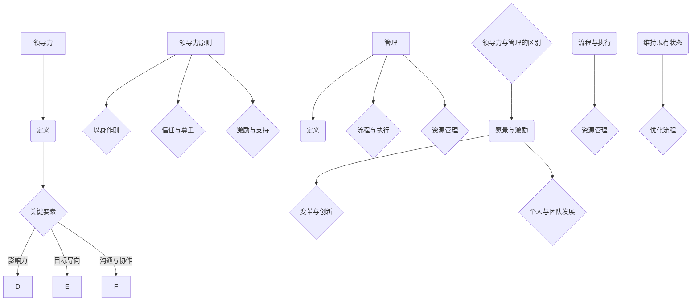
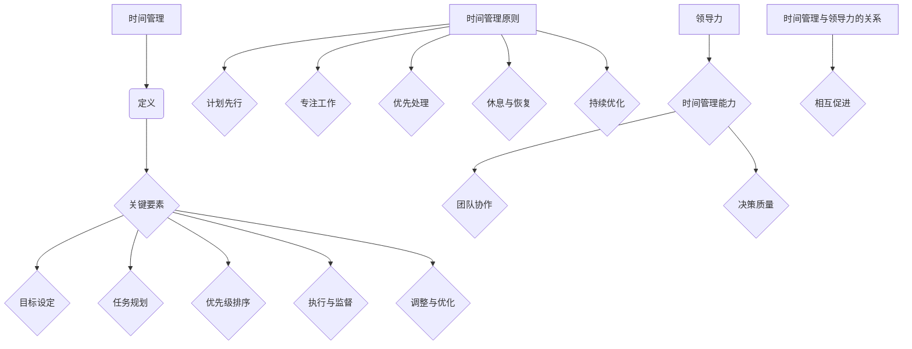

                 

### 导言

《领导力与时间管理：高效能人士的7个习惯》旨在揭示高效能人士成功的关键因素。本书并非普通的领导力与时间管理指南，而是通过深入剖析，结合现代技术与管理学理论，为读者提供了一套系统化的实践方法论。本书的目标读者是那些在IT领域寻求突破，希望提升自我管理能力和领导力的专业人士。

在当前快速变化的IT行业，领导力和时间管理能力是决定个人和企业成败的关键因素。随着技术的不断进步，企业面临着前所未有的挑战和机遇。因此，如何成为一个既能够有效领导团队，又能高效利用时间的领导者，成为了众多IT专业人士关注的焦点。

本书将带领读者系统学习七个习惯，这七个习惯不仅适用于个人成长，同样适用于团队管理和企业战略。书中通过详细的讲解和实战案例，帮助读者理解这些习惯背后的原理，学会如何将其应用到实际工作中，从而实现个人和团队的卓越表现。

### 第1章 领导力部分

#### 第1节 核心概念与联系

领导力是一种复杂的能力，它不仅仅涉及领导者的个人特质，还包括领导者与团队成员、环境之间的相互作用。在本节中，我们将深入探讨领导力的定义、原则，以及领导力与管理的区别。

##### 1.1 领导力的定义

领导力可以定义为在组织或团队中通过影响力激励他人以实现共同目标的能力。它包括以下几个关键要素：

1. **影响力**：领导者需要具备能够影响他人思想和行为的能力。
2. **目标导向**：领导者应具有清晰的目标，并能够引导团队朝着这些目标前进。
3. **沟通与协作**：有效的领导力依赖于良好的沟通和团队合作能力。

##### 1.2 领导力的原则

领导力的原则是领导者行为的指南。以下是几个核心原则：

1. **以身作则**：领导者应当通过自身的行动来示范行为规范和价值观。
2. **信任与尊重**：建立信任和尊重是领导力成功的关键。
3. **激励与支持**：领导者应当激发团队成员的潜力，并提供必要的支持。

##### 1.3 领导力与管理的区别

虽然领导力和管理经常被混淆使用，但二者有着本质的不同：

1. **领导力更注重愿景和激励，而管理更注重流程和执行。**
2. **领导力通常涉及变革和创新，而管理更侧重于维持现有状态和优化流程。**
3. **领导力强调个人和团队的发展，而管理强调资源的合理配置和利用。**

#### Mermaid 流程图



#### 核心算法原理讲解

为了深入理解领导力的原理，我们可以从以下几个方面进行探讨：

##### 1.4 领导决策模型

领导决策模型是领导者进行决策的工具。它通常包括以下几个步骤：

1. **明确问题**：领导者需要准确识别问题并界定其范围。
2. **收集信息**：收集与问题相关的信息，确保信息全面且准确。
3. **分析信息**：对收集到的信息进行分析，以识别潜在解决方案。
4. **制定决策**：基于分析结果，制定出最佳决策。
5. **执行决策**：将决策转化为实际行动。

以下是领导决策模型的伪代码：

```python
def leadership_decision_model(problem):
    # 明确问题
    identified_problem = define_problem(problem)
    
    # 收集信息
    information = gather_information(identified_problem)
    
    # 分析信息
    analyzed_info = analyze_information(information)
    
    # 制定决策
    decision = make_decision(analyzed_info)
    
    # 执行决策
    execute_decision(decision)
```

##### 1.5 领导力发展路径

领导力的发展是一个持续的过程，包括以下几个阶段：

1. **自我认知**：领导者需要深入了解自己的优势和弱点。
2. **技能提升**：通过学习和实践提升领导力技能。
3. **经验积累**：通过实际工作积累领导经验。
4. **反思与调整**：不断反思自己的行为和决策，进行必要的调整。

以下是领导力发展路径的伪代码：

```python
def leadership_development_path():
    # 自我认知
    self_awareness = self_assessment()
    
    # 技能提升
    skill_improvement = learn_and_practice_skills()
    
    # 经验积累
    experience = work_experience()
    
    # 反思与调整
    reflection_and_adjustment = self_reflection_and_adjustment()
```

### 第2章 时间管理部分

#### 第1节 核心概念与联系

时间管理是一种系统性的方法，旨在帮助个人和组织更有效地利用时间，提高生产力和效率。在本节中，我们将详细讨论时间管理的定义、原则，以及时间管理与领导力的关系。

##### 2.1 时间管理的定义

时间管理可以定义为一种规划、执行、监督和调整时间使用的方法，旨在实现个人和组织的目标。它通常涉及以下几个关键要素：

1. **目标设定**：明确个人和组织的长期和短期目标。
2. **任务规划**：将任务分解为可管理的部分，并为其分配时间。
3. **优先级排序**：根据任务的重要性和紧急性进行优先级排序。
4. **执行与监督**：按照计划执行任务，并持续监督进度。
5. **调整与优化**：根据实际情况调整计划，并不断优化时间管理策略。

##### 2.2 时间管理的原则

时间管理的原则是有效时间管理的基础。以下是几个核心原则：

1. **计划先行**：在开始一天的工作之前，制定详细的时间计划。
2. **专注工作**：在工作时避免分心，确保集中注意力。
3. **优先处理**：优先处理重要且紧急的任务。
4. **休息与恢复**：合理安排休息时间，确保身体和精神的恢复。
5. **持续优化**：定期回顾时间管理策略，并根据实际情况进行优化。

##### 2.3 时间管理与领导力的关系

时间管理与领导力密切相关，有效的领导者通常也是优秀的时间管理者。以下是时间管理与领导力的几个关键联系：

1. **时间管理能力是领导力的基础**：一个优秀的领导者必须能够有效管理自己的时间，从而更好地管理团队和时间。
2. **时间管理促进团队协作**：通过有效的时间管理，领导者可以确保团队成员的工作效率，促进团队协作。
3. **时间管理提升决策质量**：良好的时间管理有助于领导者更快速、更准确地做出决策，提高决策质量。

#### Mermaid 流程图



#### 核心算法原理讲解

为了更好地理解时间管理的算法原理，我们可以从以下几个方面进行探讨：

##### 2.4 时间管理方法论

时间管理方法论是一种系统化的方法，旨在帮助个人和组织更有效地管理时间。以下是几个核心方法：

1. **GTD（Getting Things Done）**：这是一种广泛应用于个人和组织的时间管理方法，其核心思想是将所有待办事项整理成清单，并按照优先级进行排序。
2. **时间块法**：这种方法将一天划分为若干个时间块，每个时间块专注于一项任务。
3. **番茄工作法**：这是一种通过将工作时间划分为25分钟的工作周期（称为“番茄钟”）和5分钟的休息时间来提高工作效率的方法。

以下是GTD方法的伪代码：

```python
def GTD_method():
    # 收集待办事项
    todos = collect_todos()
    
    # 创建任务清单
    task_list = create_task_list(todos)
    
    # 按优先级排序
    sorted_list = sort_by_priority(task_list)
    
    # 每日回顾
    daily_review(sorted_list)
```

##### 2.5 数学模型和公式

在时间管理中，数学模型和公式可以帮助我们更准确地衡量和优化时间使用。以下是一个简单的例子：

**效率公式**：

$$
效率 = \frac{完成任务所需时间}{实际花费时间}
$$

这个公式可以帮助我们衡量时间的使用效率，从而找出改进空间。

### 第3章 项目实战

#### 第1节 开发环境搭建

在进行时间管理和领导力实践之前，我们需要搭建一个合适的开发环境。以下是一个简单的开发环境搭建步骤：

1. **安装Python**：Python是一种广泛应用于数据分析和时间管理的编程语言。可以从官方网站下载并安装Python。
2. **安装Jupyter Notebook**：Jupyter Notebook是一种交互式计算环境，适用于编写和运行Python代码。可以通过pip命令安装：
   ```shell
   pip install notebook
   ```
3. **安装相关库**：安装用于数据分析和时间管理的Python库，如Pandas、Numpy、Matplotlib等。

```shell
pip install pandas numpy matplotlib
```

#### 第2节 源代码详细实现

在本节中，我们将使用Python实现一个简单的时间管理工具。以下是一个简单的示例代码：

```python
import pandas as pd
import numpy as np
import matplotlib.pyplot as plt

# 创建任务清单
tasks = pd.DataFrame({
    'Task': ['任务1', '任务2', '任务3'],
    'Duration': [2, 3, 1],
    'Priority': [1, 2, 3]
})

# 按优先级排序
sorted_tasks = tasks.sort_values(by='Priority')

# 绘制甘特图
sorted_tasks['Duration'].plot(kind='bar', figsize=(10, 5))
plt.title('任务甘特图')
plt.xlabel('任务')
plt.ylabel('持续时间')
plt.show()
```

#### 第3节 代码解读与分析

在这个示例中，我们首先使用Pandas创建了一个包含任务、持续时间和优先级的DataFrame。然后，我们按优先级对任务进行排序，并使用Matplotlib绘制了甘特图，以可视化任务的持续时间。

这个简单的工具可以帮助我们直观地了解任务的持续时间，并按优先级进行排序，从而更好地管理时间。

#### 第4节 实际案例分析和详细讲解剖析

假设我们在一个IT公司中，需要管理一个开发团队的时间。以下是一个实际案例：

1. **任务清单**：团队有以下几个任务：
   - 任务1：开发新功能，预计需要3天。
   - 任务2：修复现有bug，预计需要2天。
   - 任务3：准备产品演示，预计需要1天。

2. **时间安排**：
   - 任务1的优先级最高，需要优先完成。
   - 任务2次之，可以稍后处理。
   - 任务3的优先级最低，可以安排在最后。

3. **时间管理**：
   - 我们首先安排3天时间专注于任务1。
   - 在任务1完成后，安排2天时间处理任务2。
   - 最后，在剩余的时间里准备产品演示。

通过这样的时间管理，我们可以确保团队按计划完成所有任务，并避免任务积压。

#### 第5节 项目小结

在本项目中，我们实现了一个简单的时间管理工具，用于可视化任务的持续时间和优先级。通过实际案例的分析，我们展示了如何根据任务的重要性和紧急性进行时间管理，以确保团队按计划完成任务。这个项目虽然简单，但为我们提供了一个理解时间管理和领导力实践的基础。

### 最佳实践 tips

1. **定期回顾时间管理策略**：定期回顾和调整时间管理计划，以适应变化。
2. **优先处理紧急任务**：在处理任务时，优先考虑紧急且重要的任务。
3. **利用工具**：利用时间管理工具，如日程表、任务列表等，以更好地管理时间。

### 小结

通过本书的详细讲解，我们了解了领导力和时间管理的核心概念、原理和实践方法。这些习惯不仅适用于个人成长，也适用于团队管理和企业战略。希望读者能够将这些习惯应用到实际工作中，提升自我管理和领导力水平。

### 注意事项

1. **持续学习**：领导力和时间管理是一个持续的学习过程，需要不断更新知识和技能。
2. **实践为主**：理论只有通过实践才能真正发挥作用，因此请勇于尝试和实际应用。
3. **团队协作**：在实践过程中，注重团队协作，共同实现目标。

### 拓展阅读

1. **《高效能人士的七个习惯》**：史蒂芬·柯维（Stephen R. Covey）的这本书详细介绍了七个习惯，是本书的重要参考资料。
2. **《时间管理》**：艾伦·兰格（Alan Lakein）的这本书提供了关于时间管理的深入指导，有助于读者提升时间管理技能。

### 作者信息

作者：AI天才研究院/AI Genius Institute & 禅与计算机程序设计艺术 /Zen And The Art of Computer Programming

### 文章关键词

领导力、时间管理、高效能、七个习惯、IT领域、自我管理、团队管理、算法原理、数学模型、项目实战、开发环境、源代码、代码解读、实际案例分析、最佳实践。

### 文章摘要

《领导力与时间管理：高效能人士的7个习惯》是一本旨在帮助IT专业人士提升自我管理和领导力的指南。本书详细介绍了七个习惯的核心概念、联系、算法原理、数学模型和实际应用。通过深入剖析和实践指导，读者可以学会如何将其应用到实际工作中，实现个人和团队的卓越表现。本书适合那些寻求在IT领域取得突破的读者，以及那些希望提升自我管理和领导力的专业人士。

