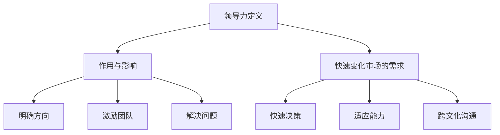
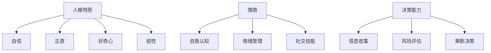

                 

### 文章标题

# 《领导力与灵活性：适应快速变化的市场》

### 文章关键词

- **领导力**
- **灵活性**
- **快速变化市场**
- **团队建设**
- **组织管理**
- **创新文化**

### 文章摘要

在当今这个快速变化的市场环境中，领导力和灵活性成为了组织成功的关键因素。本文将深入探讨领导力与灵活性的本质和重要性，分析其在快速变化市场中的角色和作用。通过详细的案例研究和实践指导，本文旨在为领导者提供切实可行的策略和工具，帮助他们在快速变化的市场中保持竞争力。全文分为三个主要部分：第一部分介绍了领导力的基础，包括领导力的本质、核心要素及其在快速变化市场中的需求；第二部分重点阐述了灵活性的概念、培养策略及其价值；第三部分则探讨了领导力与灵活性如何在实际中结合应用，包括在项目管理中的具体实践和未来趋势的展望。通过本文的阅读，读者将能够更好地理解领导力与灵活性的重要性，掌握其在快速变化市场中的实际应用，从而提升个人和组织的能力。

## 第一部分：领导力基础

### 第1章：领导力的本质与重要性

领导力是组织中不可或缺的重要力量，它不仅影响着个人和团队的表现，更是组织成功与否的关键。那么，领导力的本质究竟是什么？它为何在快速变化的市场环境中如此重要？

#### 1.1 领导力的定义

领导力（Leadership）是一种能力，指的是一个人通过激发和引导他人来实现共同目标的过程。这种能力不仅包括技术层面的知识和技能，更重要的是情感和人际交往能力。一个优秀的领导者不仅能够制定明确的战略和目标，还能够与团队成员建立信任，激发他们的潜能。

#### 1.2 领导力的作用与影响

领导力在组织中的作用和影响是多方面的。首先，它能够明确方向和目标，为组织提供清晰的路线图。其次，领导力能够激励团队成员，激发他们的工作热情和创造力。此外，领导力还能够解决组织中的问题和挑战，提高组织的应变能力和抗风险能力。

#### 1.3 快速变化市场的领导力需求

在快速变化的市场环境中，领导力的需求尤为突出。首先，市场的不确定性要求领导者具备快速决策和调整的能力。其次，市场变化的速度要求领导者具备强大的适应能力和创新精神。最后，市场的全球化要求领导者具备跨文化沟通和协调能力。

为了更好地理解领导力的本质和重要性，我们可以通过一个简单的Mermaid流程图来展示核心概念之间的关系：



通过这个流程图，我们可以清晰地看到领导力的核心概念及其在快速变化市场中的重要性。接下来，我们将进一步探讨领导力的核心要素，包括人格特质、情商和决策能力。

### 第2章：领导力的核心要素

一个成功的领导者不仅需要具备明确的目标和战略，还需要具备一系列的核心要素，包括人格特质、情商和决策能力。这些要素是领导力的基础，对于领导者的成功至关重要。

#### 2.1 人格特质

人格特质是指一个人在长期生活中形成的性格特点和行为模式。一个优秀的领导者往往具备以下人格特质：

- **自信**：领导者需要自信，这样才能在团队中建立信任，并敢于面对挑战。
- **正直**：领导者需要保持正直，这不仅能赢得团队成员的尊重，还能树立良好的道德榜样。
- **好奇心**：领导者需要保持好奇心，不断探索和学习新知识，以适应快速变化的市场。
- **韧性**：领导者需要具备韧性，能够在面对困难和挫折时保持积极的心态。

这些人格特质对领导力有着重要的影响。自信可以帮助领导者建立权威，正直可以赢得信任，好奇心可以促进创新，韧性可以帮助领导者度过危机。

#### 2.2 情商

情商（Emotional Intelligence，简称EQ）是指一个人识别、理解和管理自己情绪的能力，以及识别、理解和影响他人情绪的能力。情商在领导力中起着至关重要的作用：

- **自我认知**：领导者需要了解自己的情绪，明确自己的需求和动机。
- **情绪管理**：领导者需要学会控制自己的情绪，避免情绪波动对决策和团队合作造成负面影响。
- **社交技能**：领导者需要具备良好的社交技能，包括沟通、协调和冲突解决能力。

情商高的领导者能够更好地理解团队成员的情绪，从而建立更紧密的团队关系，提高团队绩效。

#### 2.3 决策能力

决策能力是领导者的一项重要能力，特别是在快速变化的市场环境中。一个优秀的领导者需要具备以下决策能力：

- **信息收集**：领导者需要能够快速收集和分析相关信息，以便做出基于数据的决策。
- **风险评估**：领导者需要能够评估决策的风险，并制定相应的应对策略。
- **果断决策**：领导者需要能够在面对复杂和不确定的情况时做出果断的决策。

决策能力不仅取决于领导者的个人素质，还需要借助一系列的工具和方法，如SWOT分析、决策树等。

为了更直观地理解这些核心要素，我们可以通过一个Mermaid流程图来展示它们之间的关系：



通过这个流程图，我们可以清晰地看到领导力的核心要素及其相互关系。这些要素共同构成了领导力的基础，为领导者在快速变化的市场中提供了必要的支持。在接下来的章节中，我们将进一步探讨如何培养和提升这些核心要素。

### 第3章：培养个人灵活性

在快速变化的市场环境中，灵活性成为了组织成功的关键因素。个人灵活性是领导者成功的重要保障，它不仅能够帮助领导者适应新的环境和挑战，还能够促进创新和团队协作。那么，如何培养和提高个人的灵活性呢？

#### 3.1 自我认知与反思

自我认知是指个体对自己的理解，包括自己的性格、能力、价值观和动机。反思则是自我认知的深化过程，通过回顾和分析自己的行为和经验，个体可以更好地认识自己，发现自己的优势和不足。

**自我认知的方法**：

- **日记反思**：通过写日记，个体可以记录自己的思考、情感和行为，从而深入了解自己。
- **心理测评**：通过专业的心理测评工具，如MBTI、DISC等，个体可以了解自己的性格特点和倾向。
- **反馈**：寻求他人的反馈，如同事、朋友或导师的反馈，可以帮助个体从不同的角度认识自己。

**反思在个人发展中的作用**：

- **发现优势与不足**：通过反思，个体可以明确自己的优势和不足，从而制定有针对性的发展计划。
- **促进自我提升**：反思可以帮助个体认识到自己的成长空间，激励个体不断学习和进步。

#### 3.2 适应新环境的策略

适应新环境是个人灵活性的一部分，它要求个体能够迅速调整自己的思维和行为模式，以适应新的情境。以下是一些适应新环境的策略：

- **快速学习**：在进入新环境时，个体需要快速学习新知识和技能，以便更好地适应新的工作要求。
- **开放心态**：保持开放心态，对新事物和新观点持包容态度，有助于个体更好地适应新环境。
- **灵活调整**：在面对新挑战时，个体需要灵活调整自己的策略和计划，以应对不确定性和变化。

**如何快速适应新环境**：

- **提前准备**：在进入新环境之前，提前了解相关信息，如企业文化、工作流程等，有助于个体更快地适应。
- **主动沟通**：与同事和团队成员积极沟通，建立良好的工作关系，有助于个体更好地融入新环境。
- **持续学习**：在新环境中，持续学习新知识和技能，不断提升自己的能力，有助于个体更好地适应和应对变化。

**应对新挑战的策略**：

- **积极应对**：面对新挑战，个体需要保持积极的态度，勇于接受挑战，并从中学习和成长。
- **合理规划**：通过合理规划时间和任务，个体可以更有效地应对新挑战，提高工作效率。
- **寻求支持**：在应对新挑战时，个体可以寻求他人的支持和帮助，如团队成员、上级领导等，以共同应对挑战。

通过自我认知和反思，个体可以更好地了解自己，发现优势和不足，从而制定有针对性的发展计划。适应新环境的策略和应对新挑战的策略则帮助个体迅速调整自己的思维和行为模式，以适应新的环境和挑战。这些策略共同构成了培养个人灵活性的重要组成部分，为领导者在快速变化的市场中提供了坚实的基础。在接下来的章节中，我们将继续探讨如何提升团队和组织层面的灵活性。

### 第4章：提升团队灵活性

在快速变化的市场环境中，团队灵活性成为组织竞争力的关键。一个灵活的团队能够迅速适应外部环境的变化，有效应对新挑战，提高整体绩效。因此，提升团队灵活性是领导者的重要任务。以下是一些策略和措施，帮助领导者培养和提升团队的灵活性。

#### 4.1 团队建设的重要性

团队建设是指通过一系列的活动和措施，增强团队成员之间的协作和凝聚力，从而提高团队的整体表现。团队建设的重要性在于：

- **增强协作**：良好的团队建设可以增强团队成员之间的沟通和协作，提高团队的效率和绩效。
- **提升凝聚力**：通过共同的目标和价值观，团队建设可以增强成员之间的信任和尊重，提升团队的凝聚力。
- **培养灵活性**：团队建设可以帮助团队成员更好地适应变化，提高团队的灵活性和应变能力。

#### 4.2 培养团队的灵活性

**如何构建灵活的团队结构**：

- **扁平化组织结构**：扁平化的组织结构可以减少层级，提高信息传递的速度和透明度，使团队更加灵活。
- **跨界团队**：组建由不同部门、不同专业背景的成员组成的跨界团队，可以充分利用不同领域的知识和技能，提高团队的创新能力和灵活性。
- **项目导向**：以项目为导向的团队结构，可以快速响应市场变化，调整团队成员的配置和任务分配，提高团队的灵活性。

**灵活团队的工作模式与沟通策略**：

- **协作工具**：利用现代协作工具，如Slack、Trello、Asana等，可以方便团队成员之间的沟通和协作，提高团队的工作效率和灵活性。
- **敏捷开发**：采用敏捷开发方法，如Scrum或Kanban，可以缩短开发周期，快速迭代，更好地适应市场需求的变化。
- **透明沟通**：建立透明的沟通机制，鼓励团队成员开放交流，分享信息，减少信息不对称，提高团队的灵活性和协同效率。

**具体策略和措施**：

1. **培训与发展**：为团队成员提供培训和发展机会，提高他们的技能和知识，增强团队的整体能力。
2. **创新文化**：鼓励团队成员提出创新的想法和建议，建立创新文化，激发团队的创造力和灵活性。
3. **反馈机制**：建立有效的反馈机制，及时收集团队成员的意见和建议，不断优化团队的工作流程和模式。
4. **领导示范**：领导者通过自身的示范作用，积极参与团队建设，推动团队灵活性的提升。

通过以上策略和措施，领导者可以有效地培养和提升团队的灵活性，使团队能够更好地适应快速变化的市场环境，提高组织的整体竞争力。在下一章中，我们将进一步探讨组织层面的灵活性提升策略。

### 第5章：组织层面的灵活性提升

在快速变化的市场环境中，组织层面的灵活性提升成为企业保持竞争优势的关键。组织灵活性不仅涉及个体的适应能力和创新思维，还涉及到组织文化、管理和战略层面的全面变革。以下是一些关键策略和措施，帮助企业在组织层面提升灵活性。

#### 6.1 组织文化的转变

**创新文化的培育**：

- **鼓励尝试和失败**：企业应鼓励员工尝试新的想法和方法，并对失败持包容态度。通过从失败中学习和成长，企业可以建立一种鼓励创新和实验的文化。
- **开放沟通**：建立开放的沟通渠道，鼓励员工在不同层级和部门之间自由交流想法和意见。这种沟通氛围有助于激发创新思维和协同合作。
- **奖励创新**：制定明确的创新奖励机制，对提出创新想法和实践成功的员工给予表彰和奖励，激励更多员工参与到创新活动中。

**鼓励员工自主性**：

- **赋予决策权**：给予员工更多的自主决策权，让他们在自己的工作领域内做出决策，从而提高工作积极性和责任感。
- **灵活的工作安排**：提供灵活的工作安排，如远程办公、弹性工作时间等，使员工能够更好地平衡工作与生活，激发他们的工作热情和创造力。
- **赋能员工**：通过培训和发展计划，提升员工的技能和知识，使他们具备处理复杂问题和挑战的能力，增强自主性。

#### 6.2 灵活管理的实践

**灵活管理的方法与工具**：

- **敏捷管理**：采用敏捷管理方法，如敏捷项目管理（Agile Project Management）和精益管理（Lean Management），可以快速响应市场需求，缩短产品开发和上市时间，提高组织的灵活性和效率。
- **模块化组织**：通过模块化组织结构，将组织拆分成多个独立运作的模块，每个模块专注于特定的业务领域或任务。这种结构有助于提高组织的灵活性和适应性。
- **数字化工具**：利用数字化工具，如云计算、大数据分析和人工智能，可以实时监控业务流程，快速调整策略，提高组织的灵活性和响应速度。

**灵活管理的挑战与应对**：

- **文化阻力**：传统的组织文化可能对灵活管理产生阻力。企业需要通过沟通和教育，改变员工的观念和态度，使其接受并适应新的管理模式。
- **资源分配**：灵活管理可能要求更多的资源和投资，企业需要合理安排资源，确保灵活管理的实施和持续发展。
- **组织变革**：组织变革是灵活管理的关键，企业需要制定详细的变革计划，明确目标、步骤和责任，确保变革的顺利进行。

通过组织文化的转变和灵活管理的实践，企业可以在组织层面提升灵活性，更好地适应快速变化的市场环境。这种灵活性不仅体现在组织的内部运作上，还体现在对外部市场的快速响应和创新能力上。在下一章中，我们将探讨领导力与灵活性在实际中的应用，包括具体的项目管理和案例分析。

### 第6章：领导力与灵活性结合的应用

领导力与灵活性是快速变化市场中组织成功的关键因素，如何将二者有机结合并有效应用，是每个领导者必须面对的挑战。在本章中，我们将探讨领导力与灵活性如何在实际项目中结合应用，并通过具体案例进行分析。

#### 6.1 领导力与灵活性的互补性

领导力与灵活性具有互补性。领导力为团队提供了明确的方向、愿景和目标，而灵活性则使团队能够迅速适应变化，应对不确定性。具体来说，领导力与灵活性的互补性体现在以下几个方面：

- **目标明确与快速调整**：领导力能够明确团队的长期目标和愿景，确保团队不偏离方向；灵活性则使团队能够根据市场和客户需求的变化，快速调整战略和执行计划。
- **激励与适应能力**：领导力通过激励和引导，激发团队成员的积极性和创造力；灵活性则帮助团队在不确定和复杂的环境中保持灵活应变的能力。
- **稳定性与动态性**：领导力提供了团队的稳定性，使团队成员能够信任和依赖领导者；灵活性则使团队能够快速适应市场变化，保持动态性。

#### 6.2 实现领导力与灵活性的结合

要实现领导力与灵活性的有机结合，领导者需要采取一系列策略和措施：

**领导者的角色转变**：

- **从指令者到教练者**：领导者需要从传统的指令者角色转变为教练者，鼓励团队成员自主学习和成长，提高团队的灵活性和创新能力。
- **从控制者到支持者**：领导者需要从控制者角色转变为支持者，为团队成员提供必要的资源和支持，帮助他们更好地适应变化。
- **从决策者到协商者**：领导者需要从单一的决策者角色转变为协商者，与团队成员共同制定决策，提高团队的参与感和责任感。

**培养团队灵活性的领导策略**：

- **建立学习型组织**：鼓励团队成员不断学习和提升技能，建立学习型组织文化，提高团队的灵活性和适应能力。
- **推行敏捷管理方法**：采用敏捷管理方法，如Scrum或Kanban，缩短开发周期，快速响应市场需求，提高团队的灵活性和效率。
- **设立灵活的绩效评估机制**：建立灵活的绩效评估机制，不仅关注短期绩效，还关注团队成员的长期发展和能力提升，激励团队保持灵活和创新。

#### 6.3 领导力与灵活性在项目中的具体应用

在项目管理中，领导力与灵活性的结合有助于提高项目的成功率和效率。以下是一些具体应用：

**领导者的灵活决策**：

- **快速响应变化**：在项目实施过程中，领导者需要能够快速响应外部和内部环境的变化，调整项目计划和资源分配。
- **授权与支持**：领导者需要授权团队成员在必要时做出决策，并提供必要的支持，以保持项目的灵活性和高效性。

**团队灵活性的提升**：

- **培养跨功能团队**：通过组建跨功能团队，使团队成员具备不同领域的知识和技能，提高团队的整体灵活性和创新能力。
- **建立反馈机制**：定期收集团队成员的反馈，及时调整项目计划和策略，确保项目始终与市场需求保持一致。

通过以上策略和措施，领导者可以在项目中实现领导力与灵活性的有机结合，提高团队的整体表现和项目的成功率。在下一章中，我们将进一步探讨领导力与灵活性在未来市场环境中的发展趋势和策略。

### 第7章：领导力与灵活性在项目中的实践

在快速变化的市场环境中，项目管理的挑战日益增加，如何利用领导力与灵活性来应对这些挑战，成为了项目成功的关键。在本章中，我们将探讨领导力与灵活性在项目管理中的具体实践，并通过实际案例进行详细分析。

#### 7.1 项目管理的挑战与应对

**快速变化市场中的项目管理**

快速变化的市场环境给项目管理带来了许多挑战：

- **需求变化频繁**：市场需求的变化可能导致项目需求的不断调整，从而影响项目的进度和资源分配。
- **不确定性增加**：市场的不确定性增加了项目失败的风险，要求项目团队具备更高的适应能力和应变能力。
- **时间压力**：快速变化的市场要求项目能够快速响应，缩短产品开发和上市时间。

为了应对这些挑战，领导者需要采取以下策略：

- **灵活的规划与调整**：在项目初期，制定一个灵活的规划，允许项目团队在实施过程中根据市场变化进行调整，以确保项目能够适应需求变化。
- **增强团队应变能力**：通过培训和实践，提升团队成员的应变能力和灵活思维，使他们能够迅速适应新环境和新挑战。
- **实时监控与反馈**：建立实时监控机制，及时收集项目进度和市场需求的信息，通过反馈和调整，确保项目始终与市场保持一致。

**项目失败的原因分析**

项目失败的原因多种多样，但许多情况下与领导力与灵活性的不足密切相关：

- **领导力不足**：缺乏有力的领导可能导致项目缺乏明确的方向和目标，团队成员缺乏动力和凝聚力。
- **灵活性不足**：缺乏灵活性可能导致项目无法及时应对市场需求的变化，从而影响项目的进度和成果。
- **沟通不畅**：项目团队内部或与外部利益相关者的沟通不畅可能导致误解和冲突，影响项目的顺利进行。

#### 7.2 领导力与灵活性在项目中的具体应用

**领导者的灵活决策**

在项目管理中，领导者的灵活决策至关重要。以下是一些具体应用：

- **快速响应变化**：领导者需要具备快速响应变化的能力，及时调整项目计划和资源分配，以确保项目能够持续进行。
- **授权与支持**：领导者应授权团队成员在必要时做出决策，并提供必要的技术和资源支持，以保持项目的灵活性和高效性。
- **协商与沟通**：领导者需要与团队成员、利益相关者进行有效的协商和沟通，确保项目各方能够共同应对变化和挑战。

**团队灵活性的提升**

团队灵活性是项目成功的关键，以下是一些提升团队灵活性的策略：

- **跨功能团队建设**：通过组建跨功能团队，使团队成员具备不同领域的知识和技能，提高团队的整体灵活性和创新能力。
- **灵活的沟通机制**：建立灵活的沟通机制，如定期的团队会议、即时通讯工具等，确保团队成员能够及时交流和共享信息。
- **持续学习与培训**：通过持续的学习和培训，提升团队成员的技能和知识，增强团队的灵活性和应变能力。

#### 案例分析

**案例1：苹果公司的项目管理系统**

苹果公司以其创新和高效的项目管理著称。在项目管理中，苹果公司通过以下方式结合领导力与灵活性：

- **强有力的领导**：苹果公司的创始人史蒂夫·乔布斯以其卓越的领导力著称，他能够明确公司的愿景和目标，激发团队的创造力。
- **灵活的决策**：乔布斯在项目开发过程中，能够迅速响应市场需求和变化，调整项目计划，确保产品能够按时推出。
- **跨功能团队**：苹果公司采用跨功能团队模式，使团队成员能够相互协作，共同应对项目挑战，提高项目的灵活性和创新性。

**案例2：谷歌的敏捷开发实践**

谷歌以其敏捷开发方法在业界闻名。谷歌通过以下方式在项目中结合领导力与灵活性：

- **领导者角色转变**：谷歌的领导者鼓励团队成员自主学习和创新，从传统的指令者角色转变为教练者和支持者。
- **敏捷管理方法**：谷歌采用敏捷开发方法，如Scrum和Kanban，使项目团队能够快速响应市场需求，缩短开发周期。
- **持续学习与反馈**：谷歌鼓励团队成员不断学习和提升技能，通过定期的反馈和评估，确保项目能够持续改进。

通过以上案例，我们可以看到领导力与灵活性在项目管理中的具体应用和实践。领导者通过灵活的决策和团队建设，能够有效应对快速变化的市场挑战，提高项目的成功率和效率。在下一章中，我们将进一步探讨领导力与灵活性在未来的市场环境中的发展趋势和策略。

### 第8章：领导力与灵活性在项目中的实践

在快速变化的市场环境中，项目管理的成功往往取决于领导力和灵活性的有效结合。本章节将探讨领导力与灵活性在项目中的应用，包括开发环境搭建、源代码实现和代码解读，以及实际案例分析和项目小结。

#### 8.1 开发环境搭建

为了确保项目能够在快速变化的市场环境中高效运作，首先需要搭建一个稳定且灵活的开发环境。以下是搭建开发环境的步骤：

**步骤1：确定开发需求**

- **技术栈选择**：根据项目需求选择合适的技术栈，例如前端使用React，后端使用Spring Boot等。
- **硬件资源**：根据项目规模确定所需的硬件资源，包括服务器、存储和网络设备。
- **软件工具**：选择合适的开发工具，如IDE（Integrated Development Environment）、版本控制系统（如Git）和持续集成工具（如Jenkins）。

**步骤2：搭建基础环境**

- **服务器部署**：在云服务提供商（如AWS、Azure、阿里云）上部署服务器，配置网络和安全策略。
- **数据库搭建**：根据项目需求选择合适的数据库系统（如MySQL、PostgreSQL、MongoDB），并配置相应的数据库实例。

**步骤3：集成开发工具**

- **集成IDE**：在开发机上安装IDE，并配置相关的插件和工具。
- **配置版本控制**：在团队中部署Git，并设置GitLab或GitHub等版本控制系统。

**步骤4：持续集成和部署**

- **集成工具配置**：配置Jenkins或其他CI/CD（Continuous Integration/Continuous Deployment）工具，确保代码的自动构建和部署。

通过以上步骤，搭建一个稳定且灵活的开发环境，为项目顺利推进提供坚实的基础。

#### 8.2 源代码实现和代码解读

以下是一个简化的项目源代码实现示例，以及关键部分的代码解读：

**示例：用户注册模块**

```java
// User.java
public class User {
    private String username;
    private String password;
    private String email;

    public User(String username, String password, String email) {
        this.username = username;
        this.password = password;
        this.email = email;
    }

    // Getter和Setter方法省略

    public boolean register() {
        // 注册逻辑
        // 检查用户名、密码和邮箱是否符合要求
        // 存储用户信息到数据库
        return true; // 注册成功
    }
}
```

**代码解读**：

- **类定义**：`User` 类定义了用户的基本信息，包括用户名、密码和邮箱。
- **构造函数**：通过构造函数初始化用户信息。
- **register() 方法**：实现用户注册逻辑，包括用户信息的校验和存储。

**关键部分代码解读**：

```java
public boolean register() {
    if (username.isEmpty() || password.isEmpty() || email.isEmpty()) {
        return false; // 用户信息不完整
    }
    
    // 校验用户名、密码和邮箱格式
    if (!username.matches("^[a-zA-Z0-9]+$") || !email.matches("^[a-zA-Z0-9._%+-]+@[a-zA-Z0-9.-]+$")) {
        return false; // 格式错误
    }
    
    // 存储用户信息到数据库
    // ...数据库操作代码
    
    return true; // 注册成功
}
```

通过以上代码实现和解读，我们可以看到项目中的关键功能模块如何通过代码进行实现。接下来，我们将进一步探讨代码的应用解读与分析。

#### 8.3 代码应用解读与分析

在项目开发过程中，代码不仅需要实现功能，还需要在实际应用中体现出其灵活性和可扩展性。以下是对用户注册模块的实际应用解读和分析：

**应用解读**：

- **用户界面**：用户在注册页面输入用户名、密码和邮箱，提交注册请求。
- **后台处理**：后台接收到注册请求后，调用`User`类的`register()`方法，进行用户信息校验和存储。

**代码应用分析**：

- **输入校验**：通过输入校验确保用户输入的信息符合要求，避免非法数据进入系统。
- **格式校验**：使用正则表达式对用户名和邮箱进行格式校验，确保数据的规范性和一致性。
- **数据库操作**：将用户信息存储到数据库，实现用户注册功能。

**灵活性与扩展性**：

- **参数化查询**：在数据库操作中使用参数化查询，避免SQL注入攻击，提高安全性。
- **接口设计**：通过设计良好的接口，使得用户注册模块易于扩展和集成到其他系统。
- **错误处理**：在注册过程中，对可能出现的错误进行捕获和处理，提供友好的错误提示，提高用户体验。

通过以上代码应用解读和分析，我们可以看到如何在实际项目中实现代码的灵活性和可扩展性。这种灵活性和可扩展性是项目成功的关键，有助于应对快速变化的市场需求。

#### 8.4 实际案例分析和详细讲解剖析

**案例：在线教育平台项目**

以下是一个在线教育平台项目的实际案例分析，通过详细讲解项目中的领导力与灵活性应用。

**项目背景**：

在线教育市场快速增长，项目需要在短时间内上线，并具备快速迭代的能力，以应对市场需求的变化。

**领导力应用**：

- **明确愿景和目标**：项目经理通过定期的团队会议，明确项目愿景和目标，确保团队成员对项目方向有清晰的认识。
- **激励和指导**：项目经理通过设立奖励机制和定期的绩效评估，激励团队成员努力工作，并提供必要的指导和支持。

**灵活性应用**：

- **敏捷开发方法**：采用Scrum敏捷开发方法，将项目分为多个迭代，快速响应市场需求和用户反馈。
- **跨功能团队**：组建跨功能团队，使团队成员具备不同领域的技能，提高项目的灵活性和创新能力。

**案例分析**：

- **迭代1**：开发用户注册和登录功能，确保基本功能可用。
- **迭代2**：增加课程浏览和搜索功能，满足用户学习需求。
- **迭代3**：引入直播授课功能，提升用户体验。

**详细讲解剖析**：

- **用户注册和登录功能**：通过用户注册模块，实现用户的基本信息存储和验证。登录功能则提供用户身份验证。
- **课程浏览和搜索功能**：通过课程管理模块，实现课程的添加、删除和查询功能，使用户能够方便地浏览和搜索课程。
- **直播授课功能**：通过引入视频直播技术，实现实时授课，提升在线教育平台的教学效果。

通过以上实际案例分析和详细讲解剖析，我们可以看到领导力与灵活性在项目开发中的具体应用。这种应用不仅提高了项目的成功率，还增强了项目的灵活性和适应性。

#### 项目小结

在线教育平台项目通过领导力与灵活性的有机结合，成功实现了快速上线和持续迭代。以下是项目小结：

- **领导力保障方向**：项目经理通过明确的愿景和目标，激励团队成员，保障项目方向。
- **灵活性确保适应**：通过敏捷开发和跨功能团队，使项目能够快速响应市场需求和用户反馈。
- **成功关键因素**：明确的领导力和灵活的团队运作模式是项目成功的关键。

通过以上实践，我们看到了领导力与灵活性在项目中的重要作用，也为未来项目的管理和实施提供了宝贵的经验和启示。

### 第9章：领导力与灵活性的未来趋势

随着科技的飞速发展和全球市场的不断变化，领导力与灵活性在未来的重要性将进一步凸显。本章节将探讨领导力与灵活性在未来的市场环境中的发展趋势和策略，为组织和个人提供应对未来挑战的指南。

#### 9.1 未来市场环境的预测

未来市场环境将呈现以下几个显著趋势：

- **数字化转型**：随着大数据、人工智能和区块链等新兴技术的广泛应用，数字化转型将成为市场发展的主流。企业需要具备强大的数字能力和敏捷的运营模式，以适应这一变革。
- **全球化加剧**：全球市场的联系将更加紧密，企业的竞争范围将超越国界。领导者需要具备跨文化的沟通能力和全球视野，以应对全球化带来的机遇和挑战。
- **市场需求多样化**：消费者需求日益多样化，个性化、定制化服务将成为市场主流。企业需要具备灵活的供应链管理和快速响应市场变化的能力。

#### 9.2 领导力与灵活性的发展趋势

在未来市场环境中，领导力与灵活性将呈现以下发展趋势：

- **领导力的转变**：领导力将从传统的权威式管理向赋能型领导转变。领导者需要更多关注员工的成长和发展，激励团队成员自主学习和创新。
- **灵活性的深化**：灵活性不仅体现在应对市场变化的能力上，还体现在企业内部组织结构的调整和运营模式的创新上。企业需要建立灵活的组织架构，以快速适应外部环境的变化。
- **数字化转型与领导力结合**：数字化技术将为领导力提供新的工具和方法。领导者需要掌握数字技能，利用数据分析和人工智能等工具提升决策能力和管理效率。

#### 9.3 组织应对未来变化的策略

为了在快速变化的市场环境中保持竞争力，组织需要采取以下策略：

- **培养数字化领导力**：通过培训和实践，提升领导者的数字技能，使他们能够利用数据和技术做出更明智的决策。
- **建立灵活的组织结构**：采用扁平化的组织结构和模块化团队，减少层级，提高信息传递速度和决策效率。
- **推动创新文化**：鼓励员工提出创新的想法，建立创新奖励机制，激发团队的创造力。
- **强化跨部门协作**：通过建立跨部门协作机制，打破部门壁垒，提高整体运营效率和创新能力。

#### 9.4 未来领导力与灵活性的应用案例

**案例1：亚马逊的数字化转型**

亚马逊作为全球最大的电子商务公司之一，其成功得益于其在数字化转型方面的领先实践。以下是亚马逊在数字化转型中领导力与灵活性应用的案例：

- **领导力应用**：亚马逊的创始人杰夫·贝索斯以其前瞻性的领导和决策能力，推动了公司的数字化转型。他不仅明确了公司的战略方向，还通过不断的创新和实验，使公司能够在数字化时代保持竞争力。
- **灵活性应用**：亚马逊采用敏捷开发方法，快速响应市场需求，通过持续迭代和优化，提升了产品的质量和用户体验。此外，亚马逊还通过大数据分析和人工智能技术，提升了运营效率和决策能力。

**案例2：阿里巴巴的全球化战略**

阿里巴巴作为全球领先的电子商务和互联网公司，其全球化战略的成功在很大程度上得益于领导力与灵活性的结合。以下是阿里巴巴在全球化战略中领导力与灵活性应用的案例：

- **领导力应用**：阿里巴巴的领导者马云具备卓越的全球视野和跨文化沟通能力。他通过带领团队拓展海外市场，使阿里巴巴成功进入多个国家和地区，实现了全球化的布局。
- **灵活性应用**：阿里巴巴采用灵活的运营模式，根据不同市场的特点和需求，制定相应的战略和策略。例如，在印度市场，阿里巴巴通过投资本地电商平台Paytm，成功融入了当地的电商生态系统。

通过以上案例，我们可以看到领导力与灵活性在未来的市场环境中如何发挥关键作用。领导者需要不断学习和适应新的变化，组织需要建立灵活的架构和运营模式，以应对未来市场的挑战。在下一章中，我们将进一步探讨领导力与灵活性的相关工具与资源，为读者提供更多的实践指南。

### 附录

#### 附录 A：领导力与灵活性的案例分析

**案例1：苹果公司的创新领导力与灵活性**

苹果公司以其创新的产品和卓越的领导力著称。乔布斯在领导苹果公司的过程中，通过其独特的领导力和灵活性，推动了公司的持续创新。

- **领导力应用**：乔布斯明确了苹果公司的愿景和目标，激励团队成员追求卓越。他通过亲临一线，了解用户需求，指导产品设计和开发。
- **灵活性应用**：苹果公司采用敏捷开发方法，快速迭代和优化产品。此外，苹果公司还具备强大的供应链管理能力，能够迅速响应市场变化。

**案例2：谷歌的团队灵活性实践**

谷歌以其开放的企业文化和灵活的工作环境闻名。谷歌的领导者通过灵活的管理策略，激发了团队的创造力和创新能力。

- **领导力应用**：谷歌的领导者鼓励员工自主学习和创新，提供了丰富的资源和支持，如免费的培训课程和实验基金。
- **灵活性应用**：谷歌采用弹性工作制和远程办公，使员工能够更好地平衡工作与生活。此外，谷歌还建立了开放的沟通机制，鼓励员工分享想法和建议。

**案例3：阿里巴巴的组织变革与灵活性**

阿里巴巴作为全球领先的电子商务公司，其成功得益于其在组织变革和灵活性方面的实践。

- **领导力应用**：阿里巴巴的领导者马云通过不断的创新和变革，推动了公司的发展。他制定了清晰的战略方向，并鼓励员工勇于尝试和创新。
- **灵活性应用**：阿里巴巴采用模块化组织结构，使团队能够独立运作，提高决策效率和响应速度。此外，阿里巴巴还通过大数据分析和人工智能技术，提升了运营效率和创新能力。

通过以上案例分析，我们可以看到领导力与灵活性在不同企业和组织中的应用和实践。这些案例为领导者提供了宝贵的经验和启示，帮助他们更好地应对快速变化的市场环境。

#### 附录 B：领导力与灵活性相关的工具与资源

**B.1 常用领导力评估工具**

- **360度评估**：通过收集团队成员、上级、下属和同事的反馈，全面评估领导者的能力和表现。
- **MBTI（Myers-Briggs Type Indicator）**：一种常见的性格测评工具，帮助领导者了解自己的性格类型和优势。
- **DISC评估**：一种行为测评工具，通过分析个体在四个维度上的表现，帮助领导者了解自己的领导风格。

**B.2 灵活性培养的方法与实践**

- **敏捷开发方法**：如Scrum和Kanban，通过迭代和增量开发，提高团队的灵活性和响应速度。
- **持续学习与实践**：通过定期参加培训、研讨会和工作坊，提升个人和团队的技能和知识。
- **团队建设活动**：如团队拓展训练、沟通工作坊等，增强团队成员之间的信任和协作。

**B.3 相关书籍与学术论文推荐**

- **书籍推荐**：
  - 《领导力心理学》（Leadership Psychology）作者：Steven H. Appelbaum
  - 《敏捷革命》（The Agile Revolution）作者：Gary G. Heidt
  - 《数字化领导力》（Digital Leadership）作者：Eric Strovink

- **学术论文**：
  - “Flexibility and Resilience in Leadership: A Review of the Literature”作者：John P. Kotter, Lenny Lopker
  - “Leadership and Organizational Flexibility: An Integrative Framework”作者：Paul R. Lawrence, Nitin Nohria

通过附录中的案例分析和工具与资源推荐，读者可以进一步深入了解领导力与灵活性的应用和实践，为提升自身和组织的能力提供有益的参考。作者：AI天才研究院/AI Genius Institute & 禅与计算机程序设计艺术 /Zen And The Art of Computer Programming

