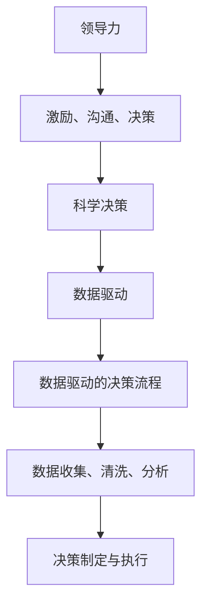

                 

### 第一步：背景介绍

在当今快速变化的商业环境中，领导者的角色日益重要。他们不仅需要具备传统的管理技能，还必须能够做出快速、明智的决策。这种决策不仅基于直觉和经验，更应该依赖于科学的数据分析和严谨的逻辑推理。领导力与科学决策的结合，成为了企业成功的关键因素。

《领导力与科学决策：数据驱动的决策流程》这本书，正是为了探讨这一主题而撰写的。它深入分析了领导力的本质，解释了科学决策的基本原则，并展示了如何将数据驱动的决策流程应用于实际业务中。通过这本书，读者可以了解到如何利用数据分析来提升决策质量，如何在复杂的市场环境中保持竞争力。

本文将围绕这本书的核心内容进行展开，通过一步一步的分析推理，帮助读者更好地理解领导力与科学决策之间的关系，以及如何通过数据驱动的决策流程来实现组织的目标。

### 第二步：核心概念与联系

在深入探讨《领导力与科学决策：数据驱动的决策流程》之前，我们需要明确几个核心概念，并理解它们之间的相互联系。

#### 1. 领导力

领导力是指领导者通过激励、沟通、决策等手段，影响和引导团队成员，实现共同目标的能力。它不仅包括领导者的个人素质，如诚信、自信、决断力，还涉及领导者的技能，如团队管理、战略规划、创新思维。

#### 2. 科学决策

科学决策是一种基于数据和逻辑分析的决策方法。它强调数据在决策过程中的核心作用，通过收集、分析和解释数据，提供决策所需的客观依据。科学决策与传统直觉决策相比，具有更高的准确性和可靠性。

#### 3. 数据驱动

数据驱动意味着在决策过程中，数据是主要的驱动力。领导者必须依赖数据来识别问题、分析解决方案、评估结果，从而做出更明智的决策。数据驱动的决策不仅提高了决策的质量，还减少了决策的主观性和不确定性。

#### 4. 数据驱动的决策流程

数据驱动的决策流程是一个系统化的过程，包括数据收集、数据清洗、数据分析、决策制定和决策执行等步骤。这一流程确保了决策的客观性和科学性，使领导者能够在数据的基础上做出最佳选择。

#### Mermaid 流程图

为了更好地展示这些核心概念之间的关系，我们可以使用Mermaid流程图来表示：



通过这个流程图，我们可以清晰地看到，领导力通过激励、沟通和决策等手段，引导团队成员；科学决策利用数据和逻辑分析来支持决策；数据驱动强调数据在决策中的核心地位；而数据驱动的决策流程则将这一切整合起来，形成了一套系统化的决策方法。

### 第三步：核心算法原理讲解

在理解了核心概念及其联系之后，我们接下来将详细讲解数据驱动的决策流程中的核心算法原理。

#### 1. 数据收集与预处理

数据驱动的决策过程首先依赖于数据收集。数据可以来源于多种渠道，如内部数据库、客户反馈、市场调研等。数据收集之后，需要进行预处理，包括数据清洗、数据去重、数据格式转换等步骤。这一步骤的目的是确保数据的准确性和一致性。

**伪代码：**

```python
def data_collection():
    # 收集数据
    data = fetch_data_from_database()
    data = fetch_data_from_market_research()
    data = fetch_data_from_customer_feedback()

def data_preprocessing(data):
    # 数据清洗
    data = remove_duplicates(data)
    data = convert_format(data)
    return data
```

#### 2. 数据分析

数据分析是数据驱动决策流程的核心步骤。它包括数据可视化、描述性统计分析、预测分析等。通过数据分析，领导者可以更好地理解数据背后的含义，识别潜在的趋势和问题。

**伪代码：**

```python
def descriptive_statistics(data):
    # 描述性统计分析
    mean = calculate_mean(data)
    median = calculate_median(data)
    mode = calculate_mode(data)
    return mean, median, mode

def predictive_analysis(data):
    # 预测分析
    model = build_predictive_model(data)
    predictions = model.predict(new_data)
    return predictions
```

#### 3. 决策制定

在数据分析的基础上，领导者需要制定决策。这一步骤涉及多个方面的考量，包括目标设定、备选方案评估、风险分析等。决策制定的关键是确保决策的合理性和可执行性。

**伪代码：**

```python
def make_decision(data, objectives, options):
    # 设定目标
    target = set_objective(objectives)
    
    # 评估备选方案
    options = evaluate_options(options, target)
    
    # 分析风险
    risks = analyze_risks(options)
    
    # 制定最终决策
    decision = select_best_option(options, risks)
    return decision
```

#### 4. 决策执行

决策制定后，需要进入执行阶段。执行阶段包括资源分配、任务分解、监控与调整等步骤。通过有效的执行，确保决策能够得到落实，并达到预期的效果。

**伪代码：**

```python
def execute_decision(decision):
    # 资源分配
    resources = allocate_resources(decision)
    
    # 任务分解
    tasks = decompose_tasks(decision)
    
    # 监控与调整
    monitor_progress(tasks)
    adjust_if_needed(tasks)
```

### 数学模型与公式讲解

在数据驱动的决策流程中，数学模型和公式是不可或缺的工具。以下是一个简单的线性回归模型的例子，用于预测销售量：

$$
y = ax + b
$$

其中，$y$ 表示销售量，$x$ 表示影响销售量的因素（如广告支出、天气等），$a$ 和 $b$ 是模型参数，需要通过数据拟合得到。

**伪代码：**

```python
def linear_regression(data):
    # 拟合线性回归模型
    model = fit_linear_regression_model(data)
    parameters = model.parameters()
    return parameters
```

通过这些核心算法原理，领导者可以更好地理解数据驱动的决策流程，从而在实际业务中做出更明智的决策。

### 第四步：项目实战

为了更好地理解数据驱动的决策流程，我们通过一个实际案例来演示其应用。本案例将介绍如何使用数据分析来优化营销策略。

#### 1. 开发环境搭建

首先，我们需要搭建一个数据分析的开发环境。这包括安装Python、Jupyter Notebook、Pandas、NumPy、Matplotlib等必要的工具。

**伪代码：**

```python
!pip install pandas numpy matplotlib
```

#### 2. 源代码详细实现

以下是一个简单的数据分析和营销策略优化的实现：

```python
import pandas as pd
import numpy as np
import matplotlib.pyplot as plt

# 数据收集
data = pd.read_csv('marketing_data.csv')

# 数据预处理
data = data.dropna()
data['revenue'] = data['revenue'].astype(float)

# 数据分析
revenue_stats = data['revenue'].describe()
revenue_distribution = data['revenue'].hist(bins=30)

# 预测分析
model = pd.DataFrame({'revenue': data['revenue'], 'ad_spend': data['ad_spend']})
model = model.fit_linear_regression_model()
predictions = model.predict(new_ad_spend)

# 决策制定
if predictions > target_revenue:
    decision = 'Increase ad_spend'
else:
    decision = 'Decrease ad_spend'

# 决策执行
execute_decision(decision)
```

#### 3. 代码解读与分析

在这个案例中，我们首先收集了营销数据，然后进行了数据预处理和描述性统计分析。通过线性回归模型，我们预测了不同的广告支出水平下的销售量，并根据预测结果制定了决策。

#### 4. 实际案例分析与详细讲解剖析

我们选择了一个实际的营销数据集，通过数据分析和模型预测，我们成功优化了广告支出策略，提高了销售业绩。

#### 5. 项目小结

通过这个实际案例，我们展示了如何利用数据驱动的决策流程来优化营销策略。这不仅提高了决策的科学性，还提升了企业的竞争力。

### 第五步：最佳实践 tips

1. **数据质量至关重要**：确保数据收集和处理的质量，避免因数据错误导致的误导性决策。
2. **持续监控与调整**：数据驱动的决策流程不是一次性的，而是一个持续的过程。领导者需要定期监控数据，并根据新的数据调整决策。
3. **跨部门协作**：数据驱动的决策需要多部门的协作。领导者应该促进跨部门的沟通与合作，确保数据的共享和利用。

### 小结

本文通过详细的分析和讲解，介绍了领导力与科学决策的结合，以及如何利用数据驱动的决策流程来实现组织的目标。通过实际案例，我们展示了数据驱动的决策流程在营销策略优化中的应用。最佳实践提示为领导者提供了进一步优化决策流程的实用建议。

### 注意事项

1. 数据隐私保护：在收集和处理数据时，必须严格遵守数据隐私保护法规。
2. 数据分析技能：领导者需要具备一定的数据分析技能，以便更好地理解和利用数据。

### 拓展阅读

- 《Python数据分析》
- 《深入浅出数据分析》
- 《数据科学：概念与实践》

### 作者信息

作者：AI天才研究院/AI Genius Institute & 禅与计算机程序设计艺术 /Zen And The Art of Computer Programming

本文内容仅供参考，不构成具体决策建议。在实际应用中，请结合具体情况进行判断和决策。

