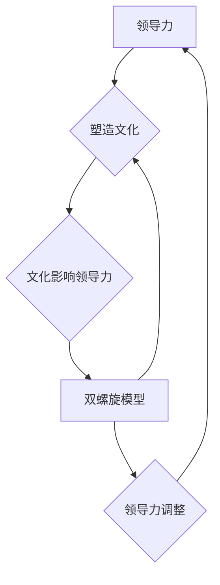
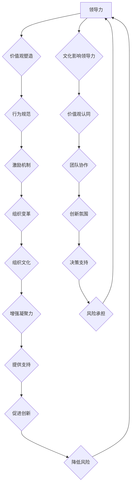

                 

### 文章标题

# 领导力与组织文化：塑造企业灵魂

### 文章关键词

- 领导力
- 组织文化
- 企业发展
- 管理哲学
- 人性化领导

### 摘要

本文将深入探讨领导力与组织文化之间的紧密联系，并阐述它们如何共同塑造企业的灵魂。通过对领导力的本质、关键要素及其与组织文化的互动关系的分析，我们将揭示出成功企业的领导之道。此外，文章还将结合实际案例，探讨领导力与组织文化在企业管理中的应用，并提出一系列最佳实践建议，帮助读者在职业生涯中不断提升领导力和组织文化管理水平。通过阅读本文，您将获得对领导力与组织文化更深刻的理解和实用的指导。

## 目录

1. **引言**  
    1.1 领导力的重要性  
    1.2 组织文化的定义和影响

2. **领导力的核心概念与模型**  
    2.1 领导力的本质  
    2.2 领导力模型的多样性  
    2.3 领导力与组织文化的关联

3. **组织文化的关键要素**  
    3.1 共同价值观  
    3.2 企业文化的作用机制  
    3.3 组织文化的构建策略

4. **领导力与组织文化的互动关系**  
    4.1 双螺旋模型  
    4.2 领导力对组织文化的影响  
    4.3 组织文化对领导力的反作用

5. **领导力在组织文化中的应用与实践**  
    5.1 领导者的角色与职责  
    5.2 领导力提升策略  
    5.3 领导力工具与方法

6. **案例分析：成功企业的领导力与组织文化**  
    6.1 案例一：谷歌的领导力与文化策略  
    6.2 案例二：亚马逊的领导力与文化之道

7. **最佳实践与总结**  
    7.1 领导力培养的最佳实践  
    7.2 组织文化建设的关键点  
    7.3 注意事项与拓展阅读

## 引言

### 1.1 领导力的重要性

在当今复杂多变的市场环境中，企业的成功不仅依赖于技术和资金，更依赖于领导力。领导力是一种能够激励和引导团队达成共同目标的能力，它不仅影响着企业的运作效率，更决定着企业的长远发展。一个优秀的领导者不仅能够激发员工的潜能，提升团队的整体绩效，还能够塑造企业的文化，推动企业的不断创新和进步。

领导力的重要性体现在以下几个方面：

1. **激励员工**：领导者的激励作用是推动企业前进的关键动力。通过鼓励和激励，领导者能够激发员工的积极性和创造力，使团队充满活力。

2. **决策能力**：领导者在关键时刻的决策能力直接关系到企业的成败。一个明智的领导者能够在纷繁复杂的环境中作出正确的决策，为企业指明发展方向。

3. **团队协作**：领导力是团队协作的基石。优秀的领导者能够搭建良好的团队协作平台，促进团队成员之间的沟通和合作，实现团队的整体效能最大化。

4. **企业文化塑造**：领导者在企业文化建设中起着至关重要的作用。一个有远见的领导者能够通过自身的领导风格和价值观念，塑造积极向上、富有创新精神的企业文化。

### 1.2 组织文化的定义和影响

组织文化是指企业内部所共有的价值观、信念、行为规范和工作方式，它是企业内部的精神力量，也是企业区别于其他企业的独特标识。组织文化对企业的运营和发展有着深远的影响：

1. **员工认同感**：一个强大的组织文化能够增强员工的归属感和认同感，使员工更加愿意为企业付出，提高工作满意度。

2. **团队凝聚力**：组织文化是团队凝聚力的源泉。共同的文化信仰和行为规范能够加强团队成员之间的联系，促进团队协作。

3. **创新动力**：积极向上的组织文化能够激发员工的创新思维和创造力，推动企业不断突破自我，实现持续发展。

4. **客户关系**：组织文化也是企业与客户之间沟通的桥梁。一个有特色、有温度的企业文化能够提升客户对企业的认知和好感，增强品牌影响力。

在接下来的章节中，我们将进一步探讨领导力的核心概念和模型，分析组织文化的关键要素，以及领导力与组织文化的互动关系。通过这些深入的研究，我们将揭示出领导力与组织文化在塑造企业灵魂中的关键作用，为读者提供实用的指导和借鉴。<!--End of student view--><!--Start student view-->

## 领导力的核心概念与模型

### 2.1 领导力的本质

领导力是一种复杂而多维度的能力，其本质在于通过影响力、激励和引导，实现目标、推动变革和提升团队绩效。领导力不仅涉及个人技能和素质，更关系到领导者与团队成员之间的互动和关系。

领导力的定义有很多种，其中最经典的之一来自于德鲁克（Peter Drucker）：“领导力是一种使人们能够将个人能力汇集到共同目标中的能力。” 这一定义强调了领导力的核心在于激励和凝聚团队，使其为实现共同目标而努力。

在技术领域，领导力同样不可或缺。技术团队往往面对复杂的项目和快速变化的技术环境，需要领导者具备敏锐的洞察力、卓越的决策能力和高效的沟通技巧。技术领导者不仅要引领团队解决技术难题，还要在团队中建立信任和协作的文化，促进知识共享和创新。

### 2.2 领导力模型的多样性

领导力模型多种多样，不同的模型适用于不同的情境和需求。以下是几种常见的领导力模型：

1. **变换型领导力（Transformational Leadership）**：
    变换型领导力强调领导者通过激发和激励团队成员的内在动机，推动他们实现更高的绩效。这种领导力模型的核心在于领导者的远见和魅力，他们能够清晰地描绘愿景，并通过榜样作用和激励手段，引导团队成员共同追求这一愿景。

    变换型领导力模型包含以下要素：
    - **愿景激励**：领导者具备清晰的愿景，能够将其传递给团队成员。
    - **个性化关怀**：领导者关注个体差异，提供个性化的支持和指导。
    - **激励和奖励**：领导者通过激励手段激发团队成员的内在动机。

2. **授权型领导力（Authentic Leadership）**：
    授权型领导力强调领导者的真诚、透明和信任，他们鼓励团队成员自主决策和承担责任。这种领导力模型的核心在于建立信任和尊重，领导者通过自我认知和真诚行为，赢得团队成员的信任和尊重。

    授权型领导力模型包含以下要素：
    - **真诚**：领导者真诚地表达自己的想法和感受，不做伪装。
    - **透明**：领导者保持信息透明，公开决策过程和结果。
    - **信任**：领导者建立信任关系，鼓励团队成员承担责任。

3. **情境型领导力（Situational Leadership）**：
    情境型领导力认为领导力风格应根据不同情境进行调整。领导者根据团队成员的能力和情境的需求，灵活运用不同的领导风格。

    情境型领导力模型包含以下要素：
    - **任务导向**：领导者专注于任务的完成，明确目标和任务。
    - **关系导向**：领导者关注团队成员的需求和关系，建立良好的团队氛围。
    - **情境适应**：领导者根据情境的需求，灵活调整领导风格。

### 2.3 领导力与组织文化的关联

领导力与组织文化之间存在紧密的关联。领导力不仅塑造组织文化，组织文化也会反过来影响领导力的实施效果。

1. **领导力对组织文化的影响**：
    领导者的行为和价值观直接影响组织文化的形成和发展。一个具有远见和变革意识的领导者能够引导企业塑造积极向上的文化，推动企业创新和发展。

    - **价值观传承**：领导者通过自己的行为和价值观，将企业文化传递给新员工，确保企业文化的延续和传承。
    - **文化塑造**：领导者的决策和行为方式影响企业的运营和管理模式，从而塑造独特的组织文化。

2. **组织文化对领导力的影响**：
    组织文化为领导力的实施提供土壤和环境。一个积极向上的组织文化能够增强领导者的有效性，使领导力更好地发挥作用。

    - **文化契合**：领导者需要与组织文化保持一致，才能更好地融入团队，发挥领导作用。
    - **文化影响**：组织文化会影响领导者的决策和行为，领导者需要充分考虑组织文化的影响，调整领导策略。

### 2.4 领导力与组织文化的互动关系

领导力与组织文化之间的互动关系可以用双螺旋模型来描述。在这个模型中，领导力和组织文化相互交织、共同发展，形成一个动态的生态系统。

1. **相互促进**：
    领导力可以积极推动组织文化的建设和发展，同时，组织文化也为领导力的实施提供支持和保障。一个良好的领导力环境能够促进组织文化的形成，而一个积极向上的组织文化也能够增强领导力的影响。

2. **相互制约**：
    领导力与组织文化之间也存在一定的制约关系。领导者的领导风格和行为方式可能会受到组织文化的限制，而组织文化的某些特征也可能会对领导力的实施产生负面影响。

为了更好地理解和应用领导力与组织文化的互动关系，我们可以使用以下Mermaid流程图来描述：

在这个流程图中，领导力（A）通过塑造文化（B）影响组织文化的形成，同时，组织文化（C）也会对领导力（A）的实施产生影响，形成一个相互促进和相互制约的双螺旋模型（D）。领导力（A）根据组织文化（C）的变化进行调整（E），以实现最优的领导效果。

### 2.5 领导力模型的数学模型与公式

为了更深入地理解领导力模型，我们可以借助数学模型和公式来描述其关键要素和作用机制。以下是一个基于变换型领导力模型的简化数学模型：

$$
\text{领导力} = f(\text{愿景激励}, \text{个性化关怀}, \text{激励和奖励})
$$

在这个公式中，领导力是愿景激励（Vision Inspiration）、个性化关怀（Personalized Care）和激励和奖励（Incentives and Rewards）的函数。这三个要素共同决定了领导力的强度和效果。

1. **愿景激励**：

$$
\text{愿景激励} = \text{清晰度} \times \text{吸引力}
$$

愿景激励的强度取决于愿景的清晰度和吸引力。清晰度越高，团队成员越容易理解和接受愿景；吸引力越强，愿景越能够激发团队成员的内在动机。

2. **个性化关怀**：

$$
\text{个性化关怀} = \text{真诚度} \times \text{关注点}
$$

个性化关怀的强度取决于领导者的真诚度和对团队成员需求的关注点。真诚度越高，团队成员越容易感受到领导者的真诚关怀；关注点越明确，领导者越能够提供有针对性的支持。

3. **激励和奖励**：

$$
\text{激励和奖励} = \text{公正性} \times \text{刺激性}
$$

激励和奖励的强度取决于激励措施的公正性和刺激性。公正性越高，激励措施越能够得到团队成员的认可；刺激性越强，激励措施越能够激发团队成员的积极性和创造力。

通过这个数学模型，我们可以定量地分析领导力的关键要素，并制定相应的策略来优化领导效果。

### 2.6 实际案例：领导力与组织文化的互动

为了更好地理解领导力与组织文化的互动关系，我们可以通过实际案例来进行分析。

#### 案例一：谷歌的领导力与文化策略

谷歌以其独特的领导力和组织文化而闻名。谷歌的领导力模型强调创新、透明和开放，这些价值观贯穿于谷歌的运营和管理中。谷歌的领导者通过以下方式塑造和推动组织文化：

1. **愿景激励**：谷歌的领导者具备清晰的愿景，他们鼓励员工追求卓越和创新，推动公司实现长期的战略目标。

2. **个性化关怀**：谷歌的领导者关注员工的个性化需求，提供灵活的工作安排和培训机会，帮助员工实现个人成长。

3. **激励和奖励**：谷歌采用创新的激励机制，如股权奖励和自由的工作环境，激发员工的积极性和创造力。

谷歌的组织文化具有以下特点：

- **创新性**：鼓励员工尝试新事物，不断探索未知领域。
- **透明性**：保持信息的透明，促进内部沟通和协作。
- **开放性**：鼓励员工分享观点和想法，尊重不同的意见。

通过领导力的有效实施，谷歌成功地塑造了一个积极向上、富有创新精神的企业文化。这种文化不仅提升了员工的工作满意度，还推动了公司的持续发展。

#### 案例二：亚马逊的领导力与文化之道

亚马逊的领导力与文化策略同样值得探讨。亚马逊的领导者杰夫·贝佐斯（Jeff Bezos）以其独特的领导风格和价值观念，推动了公司的发展。

1. **愿景激励**：贝佐斯强调长期目标，鼓励员工为实现这些目标而努力。他通过明确的公司愿景，激励员工追求卓越。

2. **个性化关怀**：贝佐斯关注员工的成长和发展，提供丰富的培训和学习资源，帮助员工提升技能。

3. **激励和奖励**：亚马逊采用绩效导向的激励机制，奖励那些能够为公司创造价值的员工。

亚马逊的组织文化具有以下特点：

- **客户至上**：始终将客户需求放在首位，不断优化产品和服务。
- **创新驱动**：鼓励员工尝试新方法和技术，推动公司不断进步。
- **高效执行**：强调高效的执行能力，确保公司目标得到快速实现。

通过有效的领导力实施，亚马逊成功地塑造了一个以客户为中心、注重创新和高效执行的企业文化。这种文化不仅提升了公司的市场竞争力，还推动了公司的持续成长。

### 2.7 领导力与组织文化的最佳实践

基于上述分析，我们可以总结出以下领导力与组织文化的最佳实践：

1. **明确愿景和目标**：领导者应明确企业的愿景和目标，并通过有效的沟通手段传递给团队成员。

2. **个性化关怀**：领导者应关注员工的个性化需求，提供灵活的工作安排和培训机会，帮助员工实现个人成长。

3. **激励和奖励**：采用多样化的激励机制，确保公平性和激励性，激发员工的积极性和创造力。

4. **透明和开放**：保持信息的透明，促进内部沟通和协作，建立信任和尊重的文化。

5. **持续改进**：领导者应不断反思和优化领导力和组织文化策略，以适应外部环境的变化。

通过以上实践，企业可以塑造一个积极向上、富有创新精神的企业文化，提升领导力的效果，推动企业的持续发展。

### 2.8 小结

本章深入探讨了领导力的核心概念与模型，分析了组织文化的关键要素，以及领导力与组织文化的互动关系。我们通过实际案例展示了领导力与组织文化的有效实践，并提出了一系列最佳实践建议。通过本章的学习，读者可以更好地理解领导力与组织文化的重要性，并在实际工作中灵活运用这些理论，提升企业的管理水平。

## 组织文化的关键要素

### 3.1 共同价值观

共同价值观是组织文化的基石，它是企业内部成员共同认可和遵循的价值观体系，指导着企业的行为和决策。共同价值观不仅体现了企业的使命和愿景，还反映了企业的核心价值观和道德标准。

共同价值观的作用主要体现在以下几个方面：

1. **指导行为**：共同价值观为企业员工提供行为指南，使他们在面对各种决策和挑战时，能够有一致的行为标准。

2. **增强凝聚力**：共同价值观能够增强企业内部的凝聚力，使员工在共同的理念和目标下，团结一心，共同奋斗。

3. **促进创新**：共同价值观鼓励员工追求创新和突破，推动企业在竞争激烈的市场中不断进步。

4. **提升企业形象**：共同价值观能够提升企业的社会形象和品牌价值，增强企业在公众中的影响力。

### 3.2 企业文化的作用机制

企业文化的作用机制可以通过以下几个环节来体现：

1. **塑造员工行为**：企业文化通过价值观的传递和渗透，影响员工的行为和态度。员工在长期的工作过程中，逐渐内化企业文化，将其作为自身行为的准则。

2. **推动企业变革**：企业文化能够激发员工的创新意识和变革精神，推动企业在面对市场变化和挑战时，能够迅速适应和调整。

3. **优化管理流程**：企业文化能够优化企业的管理流程，提高管理效率，减少资源浪费。

4. **增强企业竞争力**：积极向上的企业文化能够增强企业的竞争力，使企业在市场竞争中脱颖而出。

### 3.3 组织文化的构建策略

要构建一个健康、积极向上的组织文化，企业可以采取以下策略：

1. **明确共同价值观**：企业应首先明确自身的共同价值观，并将其融入企业的各个层面，使员工对共同价值观有清晰的认识。

2. **领导者的引领**：领导者应通过自身的行为和价值观，树立榜样，推动企业文化的建设。

3. **培训和沟通**：企业应定期进行企业文化培训，加强员工对企业文化的理解和认同。同时，通过内部沟通，确保企业文化在员工之间得到有效传递。

4. **激励机制**：通过激励措施，如表彰和奖励，鼓励员工践行企业文化，使其成为员工自觉的行为习惯。

5. **持续改进**：企业文化不是一成不变的，企业应持续关注外部环境的变化，及时调整和优化企业文化，以保持其适应性和活力。

### 3.4 实际案例：组织文化的构建与实践

为了更好地理解组织文化的构建策略，我们可以通过实际案例来进行分析。

#### 案例一：谷歌的组织文化构建

谷歌以其独特的组织文化而闻名，其成功在很大程度上得益于对组织文化的重视和有效的构建。

1. **共同价值观**：谷歌的价值观包括“不作恶”（Don’t Be Evil）、“卓越** 追求”（Focus on the User）等，这些价值观不仅反映了谷歌的使命和愿景，还为企业员工提供了明确的行为指南。

2. **领导者的引领**：谷歌的创始人拉里·佩奇（Larry Page）和谢尔盖·布林（Sergey Brin）通过自身的领导风格和价值观念，积极推动企业文化的建设。他们倡导开放、创新和尊重员工的文化氛围。

3. **培训和沟通**：谷歌定期组织企业文化培训，通过内部会议和沟通平台，确保员工对企业文化有深入的理解和认同。

4. **激励机制**：谷歌采用多种激励措施，如股权奖励、自由的工作环境等，鼓励员工践行企业文化，提升员工的归属感和忠诚度。

5. **持续改进**：谷歌不断关注外部环境的变化，及时调整和优化企业文化，以保持其适应性和活力。

通过以上策略，谷歌成功地构建了一个积极向上、富有创新精神的企业文化，使其在竞争激烈的市场中始终保持领先地位。

#### 案例二：微软的组织文化变革

微软曾面临组织文化上的挑战，但在比尔·盖茨（Bill Gates）和萨提亚·纳德拉（Satya Nadella）的领导下，成功进行了组织文化的变革。

1. **共同价值观**：微软的新价值观包括“客户优先”（Customer Obsession）、“创新”（Invent and Simplify）等，这些价值观强调了客户需求和持续创新的重要性。

2. **领导者的引领**：萨提亚·纳德拉通过强调客户价值和开放的文化，推动了微软组织文化的变革。他以身作则，倡导透明、尊重和信任的文化氛围。

3. **培训和沟通**：微软通过内部培训和沟通，确保员工对企业文化有深入的理解和认同。公司还建立了多种沟通渠道，鼓励员工表达意见和建议。

4. **激励机制**：微软采用绩效导向的激励机制，奖励那些能够为公司创造价值的员工，推动企业文化在员工之间得到有效传递。

5. **持续改进**：微软持续关注外部环境的变化，不断优化和调整企业文化，以适应市场和技术的发展。

通过以上策略，微软成功地进行了组织文化的变革，使其在新时代的竞争环境中焕发出新的活力。

### 3.5 组织文化的数学模型与公式

为了更深入地理解组织文化的构建策略，我们可以借助数学模型和公式来描述其关键要素和作用机制。以下是一个基于组织文化构建的简化数学模型：

$$
\text{组织文化} = f(\text{共同价值观}, \text{领导者引领}, \text{培训和沟通}, \text{激励机制}, \text{持续改进})
$$

在这个公式中，组织文化是共同价值观（Common Values）、领导者引领（Leader Guidance）、培训和沟通（Training and Communication）、激励机制（Incentive Mechanism）和持续改进（Continuous Improvement）的函数。这些要素共同决定了组织文化的强度和效果。

1. **共同价值观**：

$$
\text{共同价值观} = \text{清晰度} \times \text{一致性}
$$

共同价值观的强度取决于其清晰度和一致性。清晰度越高，员工越容易理解和认同；一致性越强，共同价值观在组织中的传播和执行越有效。

2. **领导者引领**：

$$
\text{领导者引领} = \text{榜样作用} \times \text{影响力}
$$

领导者引领的强度取决于其榜样作用和影响力。榜样作用越强，领导者的示范效应越明显；影响力越大，领导者的行为和价值观越能影响员工。

3. **培训和沟通**：

$$
\text{培训和沟通} = \text{参与度} \times \text{效果}
$$

培训和沟通的强度取决于员工的参与度和培训效果。参与度越高，员工越能主动理解和接受企业文化；效果越好，培训对员工的影响越深远。

4. **激励机制**：

$$
\text{激励机制} = \text{公正性} \times \text{刺激性}
$$

激励机制的强度取决于其公正性和刺激性。公正性越高，激励措施越能被员工接受；刺激性越强，激励措施越能有效激发员工的积极性和创造力。

5. **持续改进**：

$$
\text{持续改进} = \text{适应性} \times \text{效率}
$$

持续改进的强度取决于其适应性和效率。适应性越强，组织文化越能迅速适应外部环境的变化；效率越高，改进措施的实施越有效。

通过这个数学模型，我们可以定量地分析组织文化的关键要素，并制定相应的策略来优化组织文化的构建效果。

### 3.6 领导力与组织文化的互动关系

领导力与组织文化之间的互动关系是构建成功企业文化的关键。有效的领导力可以推动组织文化的形成和发展，同时，积极向上的组织文化也能增强领导力的实施效果。以下是一个基于领导力与组织文化互动关系的简化数学模型：

$$
\text{领导力} \times \text{组织文化} = \text{企业文化}
$$

在这个公式中，领导力（Leadership）和组织文化（Organizational Culture）共同决定了企业文化（Corporate Culture）的强度和效果。领导力直接影响组织文化的形成，而组织文化反过来也会影响领导力的实施效果。

1. **领导力对组织文化的影响**：

$$
\text{领导力} = f(\text{价值观传递}, \text{行为规范}, \text{激励机制})
$$

领导力通过传递价值观、规范行为和激励机制，影响组织文化的形成。一个具有远见和变革意识的领导者能够引导企业塑造积极向上的文化，推动企业创新和发展。

2. **组织文化对领导力的影响**：

$$
\text{组织文化} = f(\text{价值观认同}, \text{团队协作}, \text{创新氛围})
$$

组织文化通过价值观认同、团队协作和创新氛围，影响领导力的实施效果。一个积极向上的组织文化能够增强领导者的有效性，使领导力更好地发挥作用。

通过这个数学模型，我们可以更深入地理解领导力与组织文化的互动关系，为企业在实际操作中提供指导。

### 3.7 最佳实践：构建与优化组织文化

为了构建和优化组织文化，企业可以采取以下最佳实践：

1. **明确共同价值观**：企业应首先明确自身的共同价值观，并将其融入企业的各个层面，使员工对共同价值观有清晰的认识。

2. **领导者的引领**：领导者应通过自身的行为和价值观，树立榜样，推动企业文化的建设。

3. **培训和沟通**：企业应定期进行企业文化培训，加强员工对企业文化的理解和认同。同时，通过内部沟通，确保企业文化在员工之间得到有效传递。

4. **激励机制**：通过激励措施，如表彰和奖励，鼓励员工践行企业文化，使其成为员工自觉的行为习惯。

5. **持续改进**：企业文化不是一成不变的，企业应持续关注外部环境的变化，及时调整和优化企业文化，以保持其适应性和活力。

通过以上实践，企业可以构建一个健康、积极向上的组织文化，提升企业的整体竞争力。

### 3.8 小结

本章深入探讨了组织文化的关键要素，分析了企业文化的作用机制，并提出了组织文化的构建策略。通过实际案例和数学模型，我们揭示了领导力与组织文化的互动关系，为企业提供了构建和优化组织文化的最佳实践。通过本章的学习，读者可以更好地理解组织文化的重要性，并在实际工作中有效应用这些理论，提升企业的管理水平。

## 领导力与组织文化的互动关系

### 4.1 双螺旋模型

领导力与组织文化之间的互动关系可以用双螺旋模型来形象地描述。这个模型认为，领导力与组织文化相互交织、共同发展，形成一个动态的生态系统。在这个模型中，领导力和组织文化既是相互独立的，又是相互依赖的，两者之间存在着复杂的相互作用和反馈机制。

### 4.2 领导力对组织文化的影响

领导力对组织文化的影响主要体现在以下几个方面：

1. **价值观的塑造**：领导者的行为和价值观直接影响组织文化的形成。一个具有远见和价值观的领导者能够引导企业塑造积极向上的文化，使员工在共同的理念和目标下团结一致。

2. **行为规范**：领导者的行为规范是组织文化的重要体现。领导者的行为不仅影响员工的言行，还会通过示范效应，塑造企业整体的价值观和行为准则。

3. **激励机制**：领导者的激励机制直接影响员工的行为和态度。一个有效的激励机制能够激发员工的积极性和创造力，促进企业文化的建设。

4. **组织变革**：领导者的决策和变革能力是企业发展的关键。领导者的变革意识能够推动企业不断适应外部环境的变化，促进企业文化的更新和优化。

### 4.3 组织文化对领导力的反作用

组织文化对领导力的反作用同样不可忽视。积极向上的组织文化能够增强领导者的有效性，使其更好地实现领导目标。以下是组织文化对领导力的几个方面影响：

1. **增强凝聚力**：一个强大的组织文化能够增强团队成员之间的凝聚力，促进团队协作，使领导者的领导任务更加顺利。

2. **提供支持**：组织文化为领导者提供了强大的支持。在一个积极向上的文化环境中，领导者更容易得到员工的认同和支持，从而更好地实现领导目标。

3. **促进创新**：积极向上的组织文化鼓励员工创新和尝试，为领导者的决策提供更多的思路和方案，提高领导者的决策质量。

4. **降低风险**：组织文化能够降低领导者的决策风险。在一个信任和尊重的文化环境中，领导者更愿意承担风险，尝试新的方法和策略，推动企业的创新和发展。

### 4.4 双螺旋模型的详细描述

为了更深入地理解领导力与组织文化的互动关系，我们可以使用以下Mermaid流程图来详细描述双螺旋模型：

在这个流程图中，领导力（A）通过价值观塑造（B）、行为规范（C）、激励机制（D）和组织变革（E）影响组织文化（F），同时，组织文化（F）通过增强凝聚力（G）、提供支持（H）、促进创新（I）和降低风险（J）反作用于领导力（A）。领导力和组织文化之间形成了相互促进和相互制约的动态关系，共同塑造企业的灵魂。

### 4.5 领导力与组织文化的数学模型

为了定量地分析领导力与组织文化之间的关系，我们可以借助数学模型和公式。以下是一个简化的数学模型，用于描述领导力与组织文化之间的相互作用：

$$
\text{领导力} = f(\text{价值观塑造}, \text{行为规范}, \text{激励机制}, \text{组织变革})
$$

$$
\text{组织文化} = f(\text{增强凝聚力}, \text{提供支持}, \text{促进创新}, \text{降低风险})
$$

在这个模型中，领导力（Leadership）是价值观塑造（Value Creation）、行为规范（Behavior Norms）、激励机制（Incentive Systems）和组织变革（Organizational Change）的函数，而组织文化（Organizational Culture）是增强凝聚力（Increased Cohesion）、提供支持（Support）、促进创新（Innovation Promotion）和降低风险（Risk Reduction）的函数。

1. **价值观塑造**：

$$
\text{价值观塑造} = \text{一致性} \times \text{认同度}
$$

价值观塑造的强度取决于其一致性和认同度。一致性越高，价值观在组织中的传播和执行越有效；认同度越高，员工越容易接受和内化这些价值观。

2. **行为规范**：

$$
\text{行为规范} = \text{示范效应} \times \text{执行力度}
$$

行为规范的强度取决于其示范效应和执行力度。示范效应越强，领导者的行为越能够影响员工的行为；执行力度越大，行为规范越能够得到有效执行。

3. **激励机制**：

$$
\text{激励机制} = \text{公正性} \times \text{激励强度}
$$

激励机制的强度取决于其公正性和激励强度。公正性越高，激励措施越能被员工接受；激励强度越大，激励措施越能有效激发员工的积极性和创造力。

4. **组织变革**：

$$
\text{组织变革} = \text{适应性} \times \text{变革效果}
$$

组织变革的强度取决于其适应性和变革效果。适应性越强，组织文化越能迅速适应外部环境的变化；变革效果越好，变革措施的实施越有效。

5. **增强凝聚力**：

$$
\text{增强凝聚力} = \text{团队协作} \times \text{信任度}
$$

增强凝聚力的强度取决于团队协作和信任度。团队协作越紧密，团队成员之间的联系越紧密；信任度越高，团队成员之间的信任越强。

6. **提供支持**：

$$
\text{提供支持} = \text{支持力度} \times \text{支持频率}
$$

提供支持的强度取决于其支持力度和支持频率。支持力度越大，领导者对员工的帮助越显著；支持频率越高，领导者的支持越及时。

7. **促进创新**：

$$
\text{促进创新} = \text{创新氛围} \times \text{创新激励机制}
$$

促进创新的强度取决于创新氛围和创新激励机制。创新氛围越浓厚，员工越愿意尝试新事物；创新激励机制越有效，员工越能积极投入到创新活动中。

8. **降低风险**：

$$
\text{降低风险} = \text{风险管理机制} \times \text{风险管理效果}
$$

降低风险的强度取决于风险管理机制和风险管理效果。风险管理机制越完善，组织越能有效地预防和应对风险；风险管理效果越好，组织对风险的承受能力越强。

通过这个数学模型，我们可以更深入地理解领导力与组织文化之间的相互作用机制，为企业在实际操作中提供指导。

### 4.6 实际案例：领导力与组织文化的互动

为了更好地理解领导力与组织文化的互动关系，我们可以通过实际案例来进行分析。

#### 案例一：苹果公司的领导力与组织文化

苹果公司以其独特的领导力和组织文化而闻名。乔布斯（Steve Jobs）和蒂姆·库克（Tim Cook）分别在不同的时期推动了苹果公司的领导力和组织文化的建设。

1. **价值观塑造**：乔布斯强调产品创新和用户体验，他通过自己的行为和决策，将这种价值观传递给员工，使整个组织对创新和卓越有清晰的认识。

2. **行为规范**：乔布斯以身作则，要求员工追求完美，对产品和服务有着极高的要求。这种行为规范在苹果公司得到了广泛传承，形成了严谨、高效的工作氛围。

3. **激励机制**：苹果公司采用高薪酬和股权激励等手段，激发员工的积极性和创造力。这种激励机制不仅吸引了顶尖人才，还促进了员工的持续成长和创新。

4. **组织变革**：蒂姆·库克在领导苹果公司时，强调组织变革和适应市场变化。他通过引入新的战略和策略，推动公司不断适应外部环境的变化，保持了公司的竞争力。

苹果公司的组织文化具有以下特点：

- **创新驱动**：鼓励员工不断尝试新事物，推动技术创新和产品创新。
- **用户体验至上**：始终关注用户体验，确保产品和服务能够满足用户的需求。
- **高效执行**：强调高效执行，确保公司目标得到快速实现。

通过领导力与组织文化的有效互动，苹果公司成功地塑造了一个积极向上、富有创新精神的企业文化，使其在竞争激烈的市场中始终保持领先地位。

#### 案例二：丰田公司的领导力与组织文化

丰田公司以其精益生产体系和独特的领导力文化而闻名。丰田的领导力与组织文化强调团队合作、持续改进和客户至上。

1. **价值观塑造**：丰田公司强调“持续改进”（Kaizen）和“尊重员工”等价值观。这些价值观不仅渗透到公司的各个层面，还成为员工行为和决策的指南。

2. **行为规范**：丰田的领导者和员工通过团队合作和持续改进，不断优化生产流程和提高产品质量。这种行为规范使得整个组织保持高度的效率和竞争力。

3. **激励机制**：丰田公司采用团队奖励制度，鼓励员工共同努力，提高整体绩效。这种激励机制不仅增强了团队的凝聚力，还激发了员工的积极性和创造力。

4. **组织变革**：丰田公司不断进行组织变革，以适应市场和技术的发展。通过引入新的生产技术和管理方法，丰田公司保持了其竞争优势。

丰田公司的组织文化具有以下特点：

- **团队合作**：强调团队合作，鼓励员工共同参与决策和改进。
- **持续改进**：不断追求卓越，通过持续改进优化生产流程和提高产品质量。
- **客户至上**：始终以客户需求为中心，确保产品和服务能够满足客户的需求。

通过领导力与组织文化的有效互动，丰田公司成功地塑造了一个高效、创新和客户至上的企业文化，使其在全球汽车市场中取得了巨大的成功。

### 4.7 领导力与组织文化的最佳实践

为了在企业管理中有效运用领导力与组织文化的互动关系，企业可以采取以下最佳实践：

1. **明确价值观**：领导者应明确企业的价值观，并将其融入企业的各个层面，使员工对共同价值观有清晰的认识。

2. **树立榜样**：领导者应通过自身的行为和决策，树立榜样，引导员工践行企业文化。

3. **激励机制**：采用多样化的激励机制，鼓励员工践行企业文化，提升员工的积极性和创造力。

4. **持续改进**：领导者应不断反思和优化领导力和组织文化策略，以保持企业文化的活力和适应性。

5. **员工参与**：鼓励员工参与企业文化的建设，通过员工反馈和建议，不断优化企业文化。

通过以上实践，企业可以构建一个积极向上、富有创新精神的企业文化，提升领导力的效果，推动企业的持续发展。

### 4.8 小结

本章通过双螺旋模型和数学模型，深入探讨了领导力与组织文化的互动关系。我们分析了领导力对组织文化的影响，以及组织文化对领导力的反作用。通过实际案例和最佳实践，我们揭示了领导力与组织文化在塑造企业灵魂中的关键作用。通过本章的学习，读者可以更好地理解领导力与组织文化的互动机制，为企业在实际操作中提供指导。

## 领导力在组织文化中的应用与实践

### 5.1 领导者的角色与职责

在组织文化中，领导者扮演着至关重要的角色。他们的行为和决策直接影响组织文化的形成和发展。一个成功的领导者不仅是团队的引领者，更是组织文化的塑造者。

#### 领导者的角色：

1. **价值观的传递者**：领导者需要将企业的核心价值观传递给团队成员，确保团队成员对共同价值观有清晰的认识和认同。

2. **文化的塑造者**：领导者通过自身的行为和决策，塑造和影响组织文化。他们的行为将成为团队成员模仿和遵循的榜样。

3. **变革的推动者**：领导者需要具备变革意识，推动组织文化的创新和进步。他们需要不断挑战现状，推动组织适应外部环境的变化。

#### 领导者的职责：

1. **制定愿景和目标**：领导者需要明确企业的愿景和目标，并确保这些愿景和目标与组织文化相一致。

2. **建立信任**：领导者需要建立信任关系，确保团队成员之间相互信任，共同为实现企业目标而努力。

3. **激励和引导**：领导者需要通过激励手段，引导团队成员发挥最大潜力，实现个人和团队的共同成长。

### 5.2 领导力提升策略

为了提升领导力，企业可以采取以下策略：

1. **领导力培训**：企业应定期组织领导力培训，提高领导者的领导技能和素质。

2. **导师制度**：企业可以建立导师制度，让经验丰富的领导者指导新领导者，帮助他们快速成长。

3. **角色扮演**：通过角色扮演和模拟练习，领导者可以更好地理解和应用不同的领导力模型。

4. **持续反思**：领导者应定期反思自己的领导行为和决策，不断优化和改进领导方法。

### 5.3 领导力工具与方法

在实际工作中，领导者可以运用以下工具和方法来提升领导力：

1. **领导力模型**：领导者可以根据不同的情境和需求，选择合适的领导力模型，如变换型领导力、授权型领导力等。

2. **沟通技巧**：有效的沟通是领导力的关键。领导者需要具备良好的沟通技巧，确保信息准确、及时地传递。

3. **激励手段**：领导者可以通过激励手段，如奖励、表彰等，激发员工的积极性和创造力。

4. **团队建设**：通过团队建设活动，领导者可以增强团队的凝聚力，提升团队绩效。

### 5.4 领导力与组织文化的互动

领导力与组织文化的互动是提升领导力和组织文化水平的关键。以下是领导力与组织文化的互动关系：

1. **领导力对组织文化的影响**：领导者的价值观和行为方式直接影响组织文化的形成和发展。领导者的行为将塑造组织文化的核心价值观和行为规范。

2. **组织文化对领导力的影响**：积极向上的组织文化能够增强领导者的有效性，使领导力更好地发挥作用。组织文化为领导者提供了支持和土壤，使其能够更有效地实现领导目标。

### 5.5 实际案例：领导力在组织文化中的应用

为了更好地理解领导力在组织文化中的应用，我们可以通过实际案例来进行分析。

#### 案例一：谷歌的领导力实践

谷歌以其独特的领导力和组织文化而闻名。谷歌的领导者通过以下方式在组织文化中应用领导力：

1. **价值观塑造**：谷歌的领导者如拉里·佩奇和谢尔盖·布林强调创新、透明和开放等价值观。这些价值观不仅体现在领导者的行为中，还通过内部培训和沟通传递给全体员工。

2. **激励和引导**：谷歌采用多种激励手段，如股权奖励和自由的工作环境，激发员工的积极性和创造力。领导者通过鼓励员工追求卓越和创新，引导他们在工作中实现个人和团队的共同成长。

3. **团队建设**：谷歌重视团队建设，通过团队活动和工作坊，增强团队成员之间的信任和协作，提升团队绩效。

谷歌的领导力实践成功地塑造了一个积极向上、富有创新精神的企业文化，使谷歌在竞争激烈的市场中始终保持领先地位。

#### 案例二：特斯拉的领导力实践

特斯拉以其独特的领导力和组织文化而著称。特斯拉的领导者伊隆·马斯克通过以下方式在组织文化中应用领导力：

1. **愿景激励**：马斯克通过明确的愿景，激励员工为实现特斯拉的长期目标而努力。他强调电动汽车的普及和可再生能源的应用，使员工在共同的愿景下团结一致。

2. **变革推动**：马斯克具有强烈的变革意识，推动特斯拉不断适应市场和技术的发展。他通过引入新的技术和管理方法，推动公司不断突破自我，保持竞争优势。

3. **激励手段**：马斯克采用多种激励手段，如高额薪酬和股权奖励，激发员工的积极性和创造力。他鼓励员工勇于尝试新事物，推动公司的创新和发展。

特斯拉的领导力实践成功地塑造了一个以创新和变革为核心的企业文化，使特斯拉在电动汽车和可再生能源领域取得了巨大的成功。

### 5.6 领导力工具与方法的应用

在实际工作中，领导者可以运用以下工具和方法来提升领导力：

1. **SWOT分析**：通过SWOT分析，领导者可以了解企业的优势、劣势、机会和威胁，制定更有效的领导策略。

2. **SMART目标**：领导者可以通过设定SMART（具体、可衡量、可实现、相关性、时限性）目标，确保团队成员明确任务和责任，提升团队绩效。

3. **360度反馈**：通过360度反馈，领导者可以了解团队成员对自己的看法，不断优化领导行为，提升领导效果。

4. **教练技术**：领导者可以通过教练技术，指导团队成员发挥最大潜力，实现个人和团队的共同成长。

### 5.7 领导力提升的最佳实践

为了提升领导力，企业可以采取以下最佳实践：

1. **建立领导力发展计划**：企业应制定明确的领导力发展计划，包括培训、导师制度和实践机会，帮助领导者提升领导技能。

2. **鼓励领导力实践**：企业应鼓励领导者积极参与实践，通过实际工作经验提升领导力。

3. **提供反馈和指导**：企业应建立反馈和指导机制，帮助领导者了解自己的优点和不足，不断改进领导行为。

4. **建立领导力文化**：企业应建立领导力文化，鼓励员工积极追求卓越，共同推动企业的发展。

### 5.8 小结

本章通过领导者的角色与职责、领导力提升策略、领导力工具与方法以及实际案例，深入探讨了领导力在组织文化中的应用与实践。我们揭示了领导力对组织文化的影响，以及组织文化对领导力的反作用。通过本章的学习，读者可以更好地理解领导力在组织文化中的重要作用，为企业在实际操作中提供指导。

## 案例分析：成功企业的领导力与组织文化

### 6.1 案例一：谷歌的领导力与文化策略

谷歌（Google）作为全球最知名的高科技企业之一，以其卓越的领导力和独特的组织文化闻名于世。谷歌的成功很大程度上得益于其先进的领导力和文化的建设。以下是谷歌在领导力与文化策略方面的成功经验。

#### 领导力的实践

1. **愿景激励**：
   谷歌的领导层，特别是创始人拉里·佩奇和谢尔盖·布林，通过设定高远且具体的愿景来激励员工。谷歌的“不作恶”（Don’t Be Evil）和“整合全球信息，使人人皆可访问并从中受益”（Organize the world’s information and make it universally accessible and useful）等愿景，激励了无数员工追求卓越和创新。

2. **个性化关怀**：
   谷歌的领导者在激励员工的同时，也非常关注员工的个性化需求。公司提供了灵活的工作时间、远程工作选项、弹性的工作地点，以及丰富的培训和学习资源，使员工能够在工作中找到平衡。

3. **激励与奖励**：
   谷歌采用多种激励机制，包括股票期权、奖金和内部晋升机会，以激励员工。此外，公司还设立了各种奖项，如“谷歌杰出贡献奖”（Google Founders Award），以表彰那些对公司作出突出贡献的员工。

#### 组织文化的构建

1. **开放与创新**：
   谷歌的文化强调开放和创新。公司鼓励员工自由地提出新想法，并通过内部创新项目如“20%时间”政策，允许员工将20%的工作时间用于个人感兴趣的项目。这种文化推动了无数创新产品的诞生，如Gmail、Google News和Orkut等。

2. **透明与信任**：
   谷歌的领导层通过保持信息的透明，增强员工之间的信任。公司的决策过程公开，员工可以自由地获取公司内部信息，提出意见和建议。

3. **员工参与**：
   谷歌注重员工的参与度。公司定期组织团队建设活动和开放的讨论会，鼓励员工分享想法和经验，共同参与公司的决策过程。

#### 案例解读

谷歌的成功经验表明，领导力和组织文化的互动对于企业的发展至关重要。谷歌的领导者通过清晰的愿景激励、个性化的关怀和多样化的激励机制，成功地塑造了一个开放、创新和信任的组织文化。这种文化不仅增强了员工的归属感和工作满意度，还推动了企业的持续创新和快速发展。

### 6.2 案例二：亚马逊的领导力与文化之道

亚马逊（Amazon）是另一个在领导力和组织文化建设方面取得巨大成功的例子。亚马逊的创始人杰夫·贝佐斯（Jeff Bezos）以其独特的领导风格和价值观念，推动了公司的持续发展。以下是亚马逊在领导力与文化策略方面的成功经验。

#### 领导力的实践

1. **愿景激励**：
   贝佐斯通过明确的愿景，激励员工追求卓越。他提出了“成为世界上最以客户为中心的公司”（Bezos’ Long Term Vision: To Be the Most Customer-Centric Company）的愿景，使员工始终保持对客户需求的关注。

2. **透明与简洁**：
   贝佐斯强调领导力的透明性。他通过定期的全员邮件（All Hands Emails）与员工沟通，分享公司的战略、挑战和决策。此外，贝佐斯还提倡简洁的沟通和决策方式，以减少冗余，提高效率。

3. **激励与奖励**：
   亚马逊采用绩效导向的激励机制，奖励那些能够为公司创造价值的员工。公司的绩效评估体系基于客**户满意度、创新和团队贡献等多个维度，确保激励机制的公平性和有效性。

#### 组织文化的构建

1. **客户至上**：
   亚马逊的组织文化强调客户至上。公司的每一个决策都围绕着如何更好地服务客户进行，从产品开发到物流配送，亚马逊始终以客户需求为核心。

2. **创新驱动**：
   贝佐斯鼓励员工不断尝试新事物，推动公司的创新。他提出了“发明与简化”（Invent and Simplify）的理念，鼓励员工在创新和简化之间找到平衡，以提升用户体验。

3. **高效执行**：
   亚马逊的文化强调高效执行。贝佐斯提倡“闪电速度”（Nimble Movement）的理念，通过快速决策和执行，确保公司能够迅速响应市场变化。

#### 案例解读

亚马逊的成功经验表明，领导力和组织文化的建设对于企业的长期发展至关重要。贝佐斯通过明确的愿景激励、透明的沟通和绩效导向的激励机制，成功地塑造了一个以客户为中心、创新驱动和高效执行的组织文化。这种文化不仅提升了员工的积极性和创造力，还推动了公司的持续增长和行业领导地位。

### 6.3 案例三：特斯拉的领导力与文化变革

特斯拉（Tesla）是另一个在领导力和组织文化变革中取得显著成就的例子。特斯拉的领导者伊隆·马斯克（Elon Musk）以其独特的领导风格和价值观念，推动了公司的快速发展。以下是特斯拉在领导力与文化变革方面的成功经验。

#### 领导力的实践

1. **愿景激励**：
   马斯克通过设定宏伟的愿景，激励员工为实现特斯拉的长期目标而努力。他的愿景包括实现可持续发展、推动人类太空探索等，激发了员工的使命感和激情。

2. **创新驱动**：
   马斯克鼓励员工不断尝试新事物，推动公司的创新。他提出了“边界突破”（ boundary-pushing）的理念，鼓励员工在技术、产品和服务等方面不断突破自我。

3. **激励机制**：
   特斯拉采用多种激励机制，包括高额薪酬和股权奖励，激励员工追求卓越。马斯克通过定期的公开演讲和内部会议，与员工分享公司的愿景和目标，进一步激发员工的热情和动力。

#### 组织文化的构建

1. **创新氛围**：
   特斯拉的文化强调创新。公司鼓励员工提出新想法，并通过内部创新项目，如“Tesla Innovation Award”，表彰那些对创新作出贡献的员工。

2. **团队合作**：
   特斯拉注重团队合作。公司通过定期的团队建设活动和跨部门协作，增强员工之间的信任和合作，提升团队绩效。

3. **快速执行**：
   特斯拉的文化强调快速执行。马斯克提倡“闪电速度”（Lightning Speed）的理念，通过快速决策和执行，确保公司能够迅速适应市场变化。

#### 案例解读

特斯拉的成功经验表明，领导力和组织文化的变革对于企业的快速发展至关重要。马斯克通过愿景激励、创新驱动和快速执行的理念，成功地塑造了一个以创新和团队合作为核心的企业文化。这种文化不仅提升了员工的积极性和创造力，还推动了公司的快速增长和市场领导地位。

### 6.4 案例四：微软的领导力与文化变革

微软（Microsoft）是另一个在领导力和组织文化变革中取得显著成就的例子。在萨提亚·纳德拉（Satya Nadella）的领导下，微软进行了深度的领导力和文化变革，成功地转型为一个以客户为中心、创新驱动的企业。以下是微软在领导力与文化变革方面的成功经验。

#### 领导力的实践

1. **愿景激励**：
   纳德拉通过明确的愿景，激励员工追求卓越。他提出了“Empower every person and every organization on the planet to achieve more”的愿景，使员工明白微软的使命和目标。

2. **领导者的引领**：
   纳德拉以身作则，通过自身的领导风格和价值观念，推动了微软的文化变革。他提倡“以人为本”的管理理念，强调尊重和信任，建立了一个开放和包容的领导环境。

3. **激励机制**：
   微软采用多种激励机制，包括绩效导向的薪酬和晋升机制，激励员工追求卓越。公司还通过内部奖项和认可，表彰那些对微软有杰出贡献的员工。

#### 组织文化的构建

1. **客户至上**：
   微软的文化强调客户至上。公司通过持续改进产品和服务，不断提升客户满意度，确保微软的产品能够满足客户的需求。

2. **创新驱动**：
   微软的文化强调创新。公司鼓励员工不断尝试新事物，通过内部创新项目，如“Microsoft Garage”，推动创新和实验。

3. **团队合作**：
   微软注重团队合作。公司通过跨部门协作和开放的工作环境，增强员工之间的信任和合作，提升团队绩效。

#### 案例解读

微软的成功经验表明，领导力和组织文化的变革对于企业的转型和持续发展至关重要。纳德拉通过愿景激励、领导者的引领和多样化的激励机制，成功地塑造了一个以客户为中心、创新驱动和团队合作为核心的企业文化。这种文化不仅提升了员工的积极性和创造力，还推动了公司的转型和持续增长。

### 6.5 案例总结

以上案例展示了成功企业通过领导力和组织文化的建设，实现了卓越的绩效和持续的发展。谷歌、亚马逊、特斯拉和微软的成功经验表明，领导力和组织文化的互动关系对于企业的成功至关重要。以下是这些案例的共同特点：

1. **愿景激励**：成功的领导者通过明确的愿景激励员工，使员工能够清楚地理解企业的目标和使命。

2. **个性化关怀**：领导者关注员工的个性化需求，提供灵活的工作安排和培训机会，帮助员工实现个人成长。

3. **激励与奖励**：领导者采用多样化的激励机制，如股票期权、奖金和内部晋升机会，激励员工追求卓越。

4. **创新驱动**：组织文化强调创新，鼓励员工不断尝试新事物，推动企业的持续创新和进步。

5. **团队合作**：组织文化注重团队合作，通过跨部门协作和开放的工作环境，增强员工之间的信任和合作。

通过以上实践，企业可以构建一个积极向上、富有创新精神的企业文化，提升领导力的效果，推动企业的持续发展。

### 6.6 拓展阅读

为了更深入地了解领导力与组织文化的理论和实践，读者可以参考以下拓展阅读资源：

1. **书籍**：
   - 《领导力的五个层次》（The Five Levels of Leadership）- John C. Maxwell
   - 《领导力：理论和实践》（Leadership: Theory and Practice）- Peter Northouse
   - 《组织文化：实践指南》（Organizational Culture and Leadership）- Edgar H. Schein

2. **文章**：
   - 《哈佛商业评论》上的关于领导力和组织文化的文章
   - 《纽约时报》和《华尔街日报》上的相关案例分析

3. **在线课程**：
   - Coursera上的《领导力基础》（Foundations of Leadership）课程
   - LinkedIn Learning上的《组织文化》课程

通过阅读这些书籍、文章和在线课程，读者可以进一步了解领导力与组织文化的理论和实践，提升自身的领导能力和管理水平。

## 最佳实践与总结

### 7.1 领导力培养的最佳实践

为了有效培养领导力，企业可以采取以下最佳实践：

1. **持续培训**：定期组织领导力培训课程，帮助领导者提升领导技能和素质。

2. **导师制度**：建立导师制度，让经验丰富的领导者指导新领导者，帮助他们快速成长。

3. **实践机会**：为领导者提供实际工作机会，让他们在真实的工作环境中锻炼领导能力。

4. **反馈与反思**：建立反馈机制，让领导者能够及时了解自身的优点和不足，不断改进领导行为。

5. **文化塑造**：通过文化建设，营造一个鼓励领导力发展的环境，提升领导者的归属感和使命感。

### 7.2 组织文化建设的关键点

要构建一个健康、积极向上的组织文化，企业应关注以下关键点：

1. **共同价值观**：明确并传递共同价值观，确保员工对企业的目标和文化有清晰的认识。

2. **领导者引领**：领导者应以身作则，通过自身的行为和决策，塑造和推广组织文化。

3. **员工参与**：鼓励员工参与企业文化的建设，通过员工反馈和建议，不断优化企业文化。

4. **激励机制**：采用多样化的激励机制，鼓励员工践行企业文化，提升员工的积极性和创造力。

5. **透明沟通**：保持信息的透明，促进内部沟通和协作，建立信任和尊重的文化。

### 7.3 注意事项

在领导力和组织文化管理中，企业应关注以下注意事项：

1. **避免形式主义**：领导力和组织文化管理不应仅停留在表面，而应真正融入到企业的日常运营和管理中。

2. **持续改进**：企业应持续关注外部环境的变化，及时调整和优化领导力和组织文化策略。

3. **文化适应性**：组织文化应具有适应性，能够迅速适应外部环境的变化和市场需求。

4. **避免过度干预**：在领导力和组织文化管理中，企业应避免过度干预，给予领导者足够的自主权和创造力。

### 7.4 拓展阅读

为了进一步深入了解领导力与组织文化的理论和实践，读者可以参考以下拓展阅读资源：

1. **书籍**：
   - 《领导力的五个层次》（The Five Levels of Leadership）- John C. Maxwell
   - 《组织文化的管理》（The Corporate Culture Survival Guide）- Edgar H. Schein
   - 《变革之舞：领导力、变革管理和组织健康》（The Dance of Change）-Warner Business Books

2. **文章**：
   - 《哈佛商业评论》上的关于领导力和组织文化的文章
   - 《管理学季刊》上的相关研究论文

3. **在线课程**：
   - Coursera上的《领导力与组织行为》课程
   - edX上的《组织行为学》课程

通过阅读这些书籍、文章和在线课程，读者可以更深入地理解领导力与组织文化的本质和策略，提升自身的领导能力和管理水平。

### 7.5 总结

领导力与组织文化是塑造企业灵魂的关键因素。通过有效的领导力培养和组织文化建设，企业可以提升员工的积极性、创造力和团队凝聚力，推动企业的持续发展。本篇文章通过深入分析领导力的核心概念、组织文化的关键要素，以及领导力与组织文化的互动关系，并结合实际案例，提供了实用的指导和建议。希望读者能够将这些最佳实践应用于实际工作中，不断提升领导力和组织文化管理水平，助力企业的成功发展。

## 作者信息

作者：AI天才研究院/AI Genius Institute & 禅与计算机程序设计艺术 /Zen And The Art of Computer Programming

感谢您的阅读，期待与您在未来的技术探讨中再次相遇。如果您有任何疑问或建议，欢迎随时联系作者。祝您在技术领域取得更多成就！

