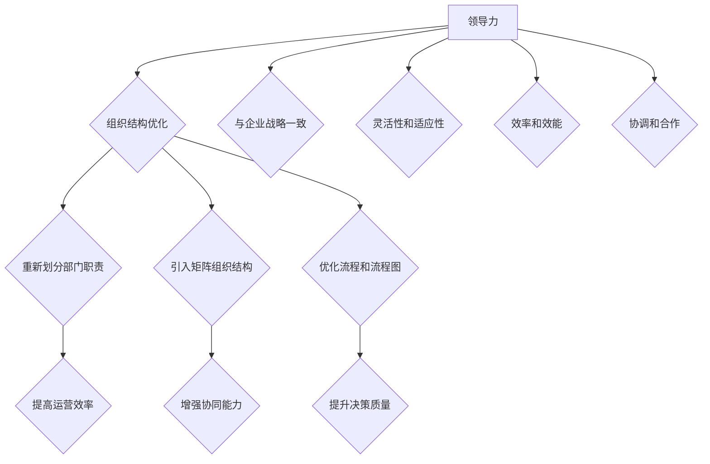

                 

### 引言

在信息技术飞速发展的今天，领导力和组织结构成为企业管理和发展中至关重要的因素。对于企业来说，领导力是驱动企业前进的核心力量，而组织结构则是企业内部资源分配和协作机制的基础框架。二者相辅相成，共同影响着企业的绩效和竞争力。

本篇文章以《领导力与组织结构：优化团队架构》为题，旨在深入探讨领导力与组织结构之间的关系，分析它们在企业管理中的重要作用，并提出一系列优化策略。文章将分为以下几个部分：

1. **书籍背景**：介绍本书的写作目的、读者对象以及相关研究背景。
2. **领导力与组织结构的定义与重要性**：阐述领导力和组织结构的基本概念，并讨论它们在企业管理中的重要性。
3. **书籍结构安排**：详细说明文章的结构安排和各章节的内容。

通过本篇文章的阅读，读者将能够系统地了解领导力与组织结构的核心概念，掌握它们之间的关系，并获得一系列实用的优化策略，以提升团队和企业的整体效能。

## 2.1 领导力基础理论

### 2.1.1 领导力的定义与要素

#### 2.1.1.1 领导力的定义

领导力是一种能够引导和激励他人共同实现目标的能力。它不仅仅局限于企业管理层面，还广泛应用于教育、医疗、科技等多个领域。领导力不仅仅是权力和地位的象征，更是一种影响力，是一种通过行为和态度来激发他人潜能的力量。

在组织管理中，领导力被认为是推动组织变革、提升组织绩效的关键因素。根据不同学者的研究，领导力可以划分为多个维度，包括但不限于：

- **个人魅力**：领导者通过个人的魅力和影响力来影响他人的态度和行为。
- **智慧与知识**：领导者需要具备丰富的知识储备和智慧，以指导组织发展方向。
- **情感智慧**：领导者需要具备理解和管理自己及他人情感的能力，以促进团队合作和冲突解决。

#### 2.1.1.2 领导力的重要性

领导力在组织中的作用不可忽视。首先，领导力能够激发员工的潜力和积极性，提高员工的工作满意度和忠诚度。研究表明，具备卓越领导力的领导者能够显著提升员工的工作绩效和创新能力。

其次，领导力是推动组织变革的重要力量。在当今快速变化的市场环境中，组织需要具备敏捷性和灵活性，以应对外部环境的挑战。领导者的战略眼光和决策能力，能够引导组织在变革中保持竞争力。

最后，领导力是塑造企业文化的重要元素。领导者的行为和态度直接影响着组织的价值观和行为规范。通过培养积极向上的企业文化，领导者能够促进组织的长期发展。

### 2.1.2 领导力的要素

#### 2.1.2.1 领导者的素质

领导者的素质是领导力的重要组成部分。一个成功的领导者通常具备以下几方面的素质：

- **道德品质**：包括诚实、正直、责任心等，这些品质是建立信任和团队协作的基础。
- **人际关系能力**：领导者需要具备良好的人际关系能力，以建立和维护团队内部的和谐关系。
- **沟通能力**：有效的沟通是领导者成功的关键，领导者需要能够清晰、准确地传达信息，并倾听他人的意见和建议。
- **决策能力**：领导者需要具备快速、准确的决策能力，以应对复杂多变的环境。

#### 2.1.2.2 领导者的行为

领导者的行为也是领导力的重要体现。以下是一些常见的领导行为：

- **激励与鼓励**：领导者需要通过激励和鼓励来激发员工的积极性和创造力。
- **指导与支持**：领导者需要为团队成员提供指导和支持，帮助他们克服困难，提升能力。
- **授权与信任**：领导者需要信任团队成员，并给予他们足够的自主权和责任感，以促进团队合作和创新。

#### 2.1.2.3 领导者的影响力

领导力不仅仅是领导者的个人素质和行为的体现，更是其影响力在组织中的反映。领导者的影响力可以从以下几个方面来理解：

- **情感影响力**：领导者通过情感上的共鸣和信任，影响团队成员的态度和行为。
- **知识影响力**：领导者通过其丰富的知识和经验，影响团队成员的思维和决策。
- **制度影响力**：领导者通过制定和执行有效的组织制度和政策，影响组织的运作和发展。

### 2.1.3 领导力的相关理论

#### 2.1.3.1 情境领导理论

情境领导理论是一种基于领导者和下属相互适应的理论模型。该理论认为，领导者的行为应该根据下属的成熟度水平进行调整，以达到最佳效果。情境领导理论将下属的成熟度划分为四个水平：

- **不成熟**：下属缺乏能力和动机，需要领导者提供清晰的指导和监督。
- **较不成熟**：下属具备一定的能力，但缺乏动机，需要领导者通过激励和鼓励来提升他们的积极性。
- **较成熟**：下属具备较强的能力和动机，但可能缺乏清晰的指导，需要领导者提供支持和自主权。
- **成熟**：下属具备独立工作能力和动机，领导者可以减少干预，让他们自主决策。

根据情境领导理论，领导者需要根据下属的成熟度水平采取相应的领导行为，以达到最佳效果。

#### 2.1.3.2 权力基础理论

权力基础理论认为，领导力是基于领导者拥有的一系列权力和资源。这些权力和资源可以分为以下几个方面：

- **职位权力**：领导者因为其在组织中的职位而获得的权力，如决策权、指挥权等。
- **知识权力**：领导者因为其专业知识和经验而获得的权力，如建议权、咨询权等。
- **关系权力**：领导者因为其与下属和同事建立的良好关系而获得的权力，如影响力、号召力等。

权力基础理论强调了领导力不仅仅是个人素质和行为的体现，更是一种基于权力和资源的互动过程。

## 2.2 组织结构概述

### 2.2.1 组织结构的定义与类型

#### 2.2.1.1 组织结构的定义

组织结构是指组织内部的分工、职责分配、权力关系和沟通渠道的安排方式。它是组织内部资源和信息的流动机制，是组织实现其目标和战略的重要保障。

组织结构的定义可以从以下几个方面来理解：

- **分工与职责**：组织结构明确了组织内部各个部门和岗位的职责和分工，确保每个成员都明确自己的工作内容。
- **权力关系**：组织结构规定了组织内部的权力关系，明确了各个部门和岗位的权力范围和责任。
- **沟通渠道**：组织结构设计了组织内部的沟通渠道，确保信息能够及时、准确地传达和反馈。

#### 2.2.1.2 组织结构类型

组织结构可以根据不同的标准进行分类，常见的组织结构类型包括：

- **线性组织结构**：线性组织结构是最常见的组织结构类型，它按照垂直方向进行分工，上级领导直接管理下属。线性组织结构的优点是结构简单、职责明确，缺点是决策速度较慢、沟通渠道有限。
- **矩阵组织结构**：矩阵组织结构是在线性组织结构的基础上增加了横向的职能分工，使得团队成员既受垂直管理，又受横向职能管理的协调。矩阵组织结构的优点是决策速度快、沟通渠道丰富，缺点是权力关系复杂、职责划分不明确。

### 2.2.2 组织结构的设计原则

组织结构的设计原则是指在进行组织结构设计时需要遵循的一些基本原则，以确保组织结构的合理性和有效性。以下是一些常见的组织结构设计原则：

- **目标一致性**：组织结构的设计应该与组织的战略目标和业务模式相一致，确保组织资源能够有效地支持组织的战略实施。
- **灵活性**：组织结构应该具备一定的灵活性，能够适应外部环境的变化和内部需求的调整，以保持组织的敏捷性和适应性。
- **效率**：组织结构的设计应该追求效率，确保组织资源的最优配置和利用，以实现组织的最大效益。
- **协调性**：组织结构的设计应该注重协调性，确保组织内部各个部门和岗位之间的职责分工和协作关系能够高效运行。

### 2.2.3 组织结构的影响因素

组织结构的设计和实施受到多种因素的影响，主要包括：

- **组织规模**：组织规模的大小直接影响组织结构的复杂性和层次性。大型组织通常需要更复杂的组织结构来管理众多员工和业务。
- **组织环境**：组织所处的环境，包括市场竞争、技术变革、政策法规等，对组织结构的设计和调整具有重要影响。组织需要根据环境的变化来调整组织结构，以适应外部环境的要求。
- **组织文化**：组织文化对组织结构的设计和实施具有深远的影响。组织文化会影响组织成员的行为和价值观，从而影响组织结构的设计和运行。

## 2.3 领导力与组织结构的关系

### 2.3.1 领导力对组织结构的影响

领导力对组织结构的影响体现在多个方面：

- **领导风格**：领导者的领导风格直接影响组织结构的设计和实施。不同的领导风格会带来不同的组织结构设计思路和实施方法。例如，集权式领导风格倾向于采用线性组织结构，而民主式领导风格则更适合采用矩阵组织结构。
- **决策权力**：领导者的决策权力和组织结构的设计密切相关。领导者的决策权力决定了组织内部权力的分配和职责的划分，从而影响组织结构的设计和实施。
- **沟通渠道**：领导者的沟通能力直接影响组织内部的信息传递和沟通效率。有效的沟通能够确保组织结构的设计和实施顺利进行，而缺乏沟通则可能导致组织结构设计的失败。

### 2.3.2 组织结构对领导力的影响

组织结构对领导力的影响同样不可忽视：

- **权力关系**：组织结构中的权力关系对领导力的实施具有直接的影响。组织结构中的权力关系决定了领导者对下属的指挥和协调能力，从而影响领导力的效果。
- **职责划分**：组织结构中的职责划分决定了领导者的工作内容和责任范围，从而影响领导者的工作压力和领导效果。
- **沟通渠道**：组织结构中的沟通渠道决定了领导者与下属之间的信息传递和沟通方式，从而影响领导者的沟通效果和领导力水平。

### 2.3.3 领导力与组织结构的相互作用

领导力与组织结构之间的相互作用是一个动态的过程，二者相互影响、相互适应，共同推动组织的运作和发展：

- **领导力优化组织结构**：领导力能够识别和解决组织结构中的问题，通过调整组织结构来优化组织的运作效率和效果。
- **组织结构支持领导力**：组织结构为领导力的实施提供了必要的框架和资源，领导力在组织结构的支持下能够更有效地发挥作用。
- **持续互动与适应**：领导力和组织结构之间的相互作用是一个持续的过程，二者需要不断互动和适应，以应对外部环境和内部需求的变化。

### 2.3.4 优化领导力与组织结构的策略

为了提升领导力和组织结构的效能，企业可以采取以下策略：

- **明确领导力目标**：企业需要明确领导力的目标和要求，确保领导力与组织结构的设计和实施相一致。
- **培养领导力素质**：企业可以通过培训、选拔和激励等手段，培养领导者的领导力素质，提升领导力的整体水平。
- **优化组织结构设计**：企业需要根据领导力的要求和目标，优化组织结构的设计和实施，确保组织结构能够支持领导力的有效发挥。
- **建立有效的沟通机制**：企业需要建立有效的沟通机制，确保领导力与组织结构之间的信息传递和沟通畅通，以促进二者的互动和适应。

通过以上策略，企业可以优化领导力和组织结构，提升组织的整体效能，实现可持续发展。

## 3.1 优化领导力的策略

### 3.1.1 提升领导力的方法

提升领导力是企业管理中的一项重要任务，以下是一些提升领导力的具体方法：

#### 3.1.1.1 自我评估与反思

自我评估与反思是提升领导力的第一步。领导者需要定期对自己的领导行为、决策和成果进行反思和总结，识别自身的优点和不足，从而制定改进计划。以下是一些自我评估和反思的方法：

- **日记反思法**：每天记录自己的工作日志，包括成功和失败的经历、遇到的问题和解决方案等，通过反思日记来总结经验和教训。
- **360度评估**：通过上级、下属和同事的反馈，全面了解自己的领导风格、行为和效果，从而找到改进的方向。
- **领导力培训**：参加领导力培训课程，学习领导力的理论知识、技能和实践方法，提升自己的领导能力。

#### 3.1.1.2 持续学习与成长

持续学习与成长是提升领导力的关键。领导者需要不断更新知识，提升自己的专业素养和综合素质，以适应快速变化的市场环境。以下是一些持续学习与成长的方法：

- **阅读与管理知识**：阅读管理类书籍、期刊和文章，了解最新的管理理念、方法和实践案例，提升自己的管理知识和视野。
- **参与研讨会与培训**：参加行业研讨会、管理培训等活动，与同行交流经验、学习最新的管理理念和技术。
- **实践与反思**：在实际工作中，积极实践所学知识，不断总结经验，通过反思和调整来提升自己的领导能力。

#### 3.1.1.3 建立积极的人际关系

建立积极的人际关系是提升领导力的重要方面。领导者需要善于与人沟通、协作，建立良好的人际关系网络，以提升自己的影响力和领导力。以下是一些建立积极人际关系的方法：

- **倾听与沟通**：积极倾听他人的意见和建议，建立良好的沟通渠道，理解他人的需求和期望。
- **信任与支持**：信任和支持团队成员，帮助他们克服困难，提升团队成员的积极性和满意度。
- **合作与共享**：与他人合作，共同实现目标，通过共享资源和知识来提升团队的整体效能。

#### 3.1.1.4 激励与鼓励

激励与鼓励是提升领导力的有效方法。领导者需要善于发现团队成员的优点和成就，给予肯定和奖励，激发团队成员的积极性和创造力。以下是一些激励与鼓励的方法：

- **认可与表扬**：及时认可和表扬团队成员的成就和贡献，提高他们的工作满意度和自豪感。
- **奖励与激励**：通过物质奖励和精神激励，激发团队成员的积极性和创造力。
- **目标设定与反馈**：帮助团队成员设定明确的目标，并提供及时的反馈和指导，帮助他们实现目标。

### 3.1.2 培养领导力的实践

培养领导力不仅仅需要理论知识，更需要实践锻炼。以下是一些培养领导力的实践方法：

#### 3.1.2.1 项目管理与领导

通过参与项目管理，领导者可以锻炼自己的组织能力、协调能力和决策能力。以下是一些项目管理中的领导实践方法：

- **项目规划与执行**：制定项目计划，明确项目目标、任务和资源分配，确保项目顺利进行。
- **团队协作与沟通**：建立有效的团队沟通机制，确保团队成员之间的信息传递和协作顺畅。
- **问题解决与决策**：在面对问题和挑战时，能够迅速作出决策，并采取有效措施解决问题。

#### 3.1.2.2 危机管理与领导

在危机中，领导者需要展现出强大的领导力，确保组织的稳定和持续发展。以下是一些危机管理中的领导实践方法：

- **危机预警与应对**：建立危机预警机制，及时发现潜在危机，并制定应对措施。
- **领导团队应对**：组织团队成员，共同应对危机，确保组织在危机中的稳定和持续发展。
- **危机后的恢复与重建**：在危机结束后，进行反思和总结，吸取经验教训，加强组织的风险管理和应对能力。

#### 3.1.2.3 培训与发展

通过培训和发展，领导者可以提升自己的专业素养和领导能力，为组织的发展储备优秀的人才。以下是一些培训与发展的领导实践方法：

- **内部培训与分享**：组织内部培训，分享知识和经验，提升团队成员的专业能力和领导素质。
- **外部培训与交流**：参加外部培训和学习交流活动，学习最新的管理理念和技术，提升自己的领导水平。
- **人才选拔与培养**：发现和培养优秀的人才，为组织的发展储备人才资源。

通过以上实践方法，领导者可以不断提升自己的领导力，为组织的持续发展和成功做出贡献。

## 3.2 优化组织结构的策略

### 3.2.1 改进组织结构的方法

优化组织结构是提高企业运营效率和效果的关键措施。以下是一些改进组织结构的方法：

#### 3.2.1.1 重新划分部门职责

重新划分部门职责是优化组织结构的重要方法之一。通过明确各部门的职责和权限，可以减少职责重叠和冲突，提高工作效率。以下是一些具体步骤：

- **分析现有部门职责**：对现有部门职责进行分析，识别职责重叠和分工不明确的问题。
- **制定职责划分方案**：根据企业战略和发展目标，制定新的部门职责划分方案，确保各部门职责清晰、明确。
- **实施职责划分**：通过内部沟通和协调，实施新的部门职责划分方案，确保各部门的职责得到落实。

#### 3.2.1.2 引入矩阵组织结构

矩阵组织结构是一种将垂直管理和横向职能相结合的组织结构，能够提高组织的灵活性和协同效率。以下是一些引入矩阵组织结构的方法：

- **明确矩阵结构**：在组织内部明确矩阵结构的层次和职责，包括项目经理、职能经理和团队成员的角色和职责。
- **制定矩阵管理规则**：制定矩阵管理规则，明确项目经理和职能经理的权限和责任，确保矩阵组织结构的运行顺畅。
- **培养矩阵管理能力**：通过培训和管理实践，提升项目经理和职能经理的矩阵管理能力，确保矩阵组织结构的有效运行。

#### 3.2.1.3 优化流程和流程图

优化流程和流程图是提高组织效率和效果的重要手段。以下是一些优化流程和流程图的方法：

- **识别流程瓶颈**：对现有流程进行分析，识别流程中的瓶颈和低效环节。
- **设计优化流程**：根据流程分析结果，设计优化后的流程，减少流程中的冗余环节，提高工作效率。
- **绘制流程图**：使用流程图工具绘制优化后的流程，明确流程中的各个步骤和责任主体，确保流程的清晰和可操作性。

#### 3.2.1.4 建立信息共享平台

建立信息共享平台是提高组织协同效率和效果的重要手段。以下是一些建立信息共享平台的方法：

- **确定信息需求**：根据组织的发展需求和业务特点，确定需要共享的信息类型和内容。
- **选择共享平台**：选择适合组织的信息共享平台，包括内部网站、电子邮件、即时通讯工具等。
- **制定共享规则**：制定信息共享的规则和流程，确保信息共享的及时性和准确性。

### 3.2.2 组织结构优化的实际案例

为了更好地理解组织结构优化的方法，以下是一些实际案例：

#### 案例一：某科技公司组织结构优化

某科技公司由于业务扩展和管理需求的变化，决定对组织结构进行优化。通过以下步骤，该公司成功实现了组织结构的优化：

1. **重新划分部门职责**：对现有部门职责进行分析和调整，明确各部门的职责和权限，减少职责重叠和冲突。
2. **引入矩阵组织结构**：在研发部门引入矩阵组织结构，明确项目经理和职能经理的职责和权限，提高项目管理的效率和效果。
3. **优化流程和流程图**：对现有流程进行分析和优化，绘制流程图，明确流程中的各个步骤和责任主体。
4. **建立信息共享平台**：建立内部网站和即时通讯工具，实现信息的及时共享和沟通，提高组织协同效率。

通过以上优化措施，该公司的组织结构更加清晰、高效，业务运营效果显著提升。

#### 案例二：某制造企业组织结构优化

某制造企业由于市场竞争加剧和内部管理需求的变化，决定对组织结构进行优化。通过以下步骤，该公司成功实现了组织结构的优化：

1. **分析现有部门职责**：对现有部门职责进行分析，识别职责重叠和分工不明确的问题。
2. **制定职责划分方案**：根据企业战略和发展目标，制定新的部门职责划分方案，确保各部门职责清晰、明确。
3. **实施职责划分**：通过内部沟通和协调，实施新的部门职责划分方案，确保各部门的职责得到落实。
4. **建立信息共享平台**：建立内部网站和电子邮件系统，实现信息的及时共享和沟通，提高组织协同效率。

通过以上优化措施，该企业的组织结构更加清晰、高效，市场竞争力和运营效率显著提升。

### 3.2.3 组织结构优化的影响

组织结构优化对企业的运营和发展具有重要的影响：

1. **提高运营效率**：优化后的组织结构能够明确各部门的职责和权限，减少职责重叠和冲突，提高工作效率和运营效率。
2. **增强协同能力**：优化后的组织结构能够建立有效的信息共享平台和沟通渠道，提高组织内部的协同效率和效果。
3. **提升决策质量**：优化后的组织结构能够明确领导者的决策权力和责任，提高决策质量和效果。
4. **适应市场变化**：优化后的组织结构能够根据企业战略和发展目标进行调整和优化，提高组织的灵活性和适应性，以应对市场变化。

总之，组织结构优化是提高企业运营效率和发展能力的重要手段，企业应高度重视并采取有效的优化措施。

### 3.3 组织结构优化的原则

组织结构优化需要遵循一定的原则，以确保优化措施的有效性和可持续性。以下是一些关键原则：

#### 3.3.1 与企业战略一致

组织结构优化必须与企业战略目标一致，确保企业资源的有效配置和利用。以下是一些具体原则：

- **支持企业战略**：组织结构设计应支持企业的战略目标，确保各部门和岗位的职责和目标与企业战略相一致。
- **明确职责和目标**：在组织结构设计中，应明确各部门和岗位的职责和目标，确保每个岗位都有明确的工作内容和目标，以便更好地支持企业战略。

#### 3.3.2 灵活性和适应性

组织结构优化应具备一定的灵活性和适应性，以应对外部环境的变化和内部需求的调整。以下是一些具体原则：

- **模块化设计**：在组织结构设计中，应采用模块化设计方法，使组织结构能够根据需要快速调整和重构。
- **扁平化管理**：通过减少管理层次和中间环节，提高组织的灵活性和响应速度，使组织能够更快地适应市场变化。

#### 3.3.3 效率和效能

组织结构优化应追求效率和效能，以提高组织的运营效率和效果。以下是一些具体原则：

- **优化流程**：在组织结构设计中，应优化流程，减少冗余环节和低效环节，提高工作效率。
- **明确职责和权限**：在组织结构设计中，应明确各部门和岗位的职责和权限，避免职责重叠和权限冲突，提高工作效率。

#### 3.3.4 协调和合作

组织结构优化应促进部门之间的协调和合作，以提高组织的整体效能。以下是一些具体原则：

- **跨部门协作**：在组织结构设计中，应建立跨部门协作机制，促进部门之间的信息共享和资源整合，提高组织的协同效率。
- **明确沟通渠道**：在组织结构设计中，应明确沟通渠道和沟通规则，确保信息能够及时、准确地传达和反馈，促进部门之间的沟通与合作。

### 3.4 优化组织结构的影响

优化组织结构对企业的运营和发展具有重要的影响。以下是一些关键影响：

#### 3.4.1 提高运营效率

优化后的组织结构能够明确各部门的职责和权限，减少职责重叠和冲突，提高工作效率和运营效率。以下是一些具体表现：

- **减少冗余环节**：通过优化流程，减少冗余环节和低效环节，提高工作效率。
- **明确职责和权限**：通过明确各部门和岗位的职责和权限，避免职责重叠和权限冲突，提高工作效率。

#### 3.4.2 增强协同能力

优化后的组织结构能够建立有效的信息共享平台和沟通渠道，提高组织内部的协同效率和效果。以下是一些具体表现：

- **跨部门协作**：通过建立跨部门协作机制，促进部门之间的信息共享和资源整合，提高组织的协同效率。
- **明确沟通渠道**：通过明确沟通渠道和沟通规则，确保信息能够及时、准确地传达和反馈，促进部门之间的沟通与合作。

#### 3.4.3 提升决策质量

优化后的组织结构能够明确领导者的决策权力和责任，提高决策质量和效果。以下是一些具体表现：

- **减少决策层次**：通过减少管理层次和中间环节，提高决策质量和效果。
- **明确决策权限**：通过明确各部门和岗位的决策权限，确保决策能够及时、准确地执行，提高决策质量。

#### 3.4.4 适应市场变化

优化后的组织结构能够根据企业战略和发展目标进行调整和优化，提高组织的灵活性和适应性，以应对市场变化。以下是一些具体表现：

- **模块化设计**：通过采用模块化设计方法，使组织结构能够根据需要快速调整和重构，提高组织的灵活性。
- **扁平化管理**：通过减少管理层次和中间环节，提高组织的响应速度和适应性，以应对市场变化。

### 3.5 优化组织结构的步骤

优化组织结构需要经过一系列步骤，以确保优化措施的有效实施。以下是一些关键步骤：

#### 3.5.1 制定优化方案

制定优化方案是组织结构优化的第一步。以下是一些具体步骤：

- **需求分析**：分析企业现状和需求，确定需要优化的关键领域。
- **目标设定**：根据需求分析结果，设定优化目标，包括提高运营效率、增强协同能力、提升决策质量等。
- **方案设计**：根据优化目标，设计优化方案，包括重新划分部门职责、引入矩阵组织结构、优化流程和流程图等。

#### 3.5.2 实施优化措施

实施优化措施是组织结构优化的关键步骤。以下是一些具体步骤：

- **方案培训**：对优化方案进行培训，确保相关人员了解和掌握优化措施。
- **实施调整**：根据优化方案，对组织结构进行实施和调整，包括重新划分部门职责、引入矩阵组织结构、优化流程和流程图等。
- **监控反馈**：对优化措施的实施效果进行监控和反馈，及时调整和改进，确保优化目标实现。

#### 3.5.3 持续优化和调整

组织结构优化是一个持续的过程，需要根据企业的发展和外部环境的变化进行持续的优化和调整。以下是一些具体步骤：

- **定期评估**：定期对组织结构进行评估，识别存在的问题和不足，制定改进措施。
- **持续改进**：根据评估结果，持续优化和改进组织结构，提高组织效率和效能。
- **反馈机制**：建立反馈机制，收集员工和客户对组织结构的意见和建议，及时进行调整和改进。

### 3.6 综合案例分析

#### 案例一：某制造企业组织结构优化

某制造企业由于市场竞争加剧和管理需求变化，决定对组织结构进行优化。通过以下步骤，该企业成功实现了组织结构的优化：

1. **需求分析**：分析企业现状和需求，确定需要优化的关键领域，包括部门职责、流程和沟通渠道。
2. **目标设定**：根据需求分析结果，设定优化目标，包括提高运营效率、增强协同能力和提升决策质量。
3. **方案设计**：设计优化方案，包括重新划分部门职责、引入矩阵组织结构和优化流程和流程图。
4. **实施调整**：根据优化方案，对组织结构进行实施和调整，包括重新划分部门职责、引入矩阵组织结构和优化流程和流程图。
5. **监控反馈**：对优化措施的实施效果进行监控和反馈，及时调整和改进，确保优化目标实现。

通过以上优化措施，该企业的运营效率显著提高，协同能力增强，决策质量提升，企业竞争力得到显著提升。

#### 案例二：某科技公司组织结构优化

某科技公司由于业务扩展和管理需求变化，决定对组织结构进行优化。通过以下步骤，该企业成功实现了组织结构的优化：

1. **需求分析**：分析企业现状和需求，确定需要优化的关键领域，包括部门职责、流程和沟通渠道。
2. **目标设定**：根据需求分析结果，设定优化目标，包括提高运营效率、增强协同能力和提升决策质量。
3. **方案设计**：设计优化方案，包括引入矩阵组织结构、优化流程和流程图。
4. **实施调整**：根据优化方案，对组织结构进行实施和调整，包括引入矩阵组织结构和优化流程和流程图。
5. **监控反馈**：对优化措施的实施效果进行监控和反馈，及时调整和改进，确保优化目标实现。

通过以上优化措施，该企业的运营效率显著提高，协同能力增强，决策质量提升，企业竞争力得到显著提升。

### 3.7 结论

组织结构优化是提高企业运营效率和竞争力的重要手段。通过重新划分部门职责、引入矩阵组织结构、优化流程和流程图等优化措施，企业可以提升运营效率、增强协同能力和提升决策质量。同时，组织结构优化需要遵循与企业战略一致、灵活性和适应性、效率和效能等原则，以确保优化措施的有效性和可持续性。

未来，企业需要持续关注组织结构优化，根据市场和内部需求的变化，不断调整和改进组织结构，以保持企业的竞争力和持续发展。

## 附录

### 1.7.1 参考文献

1. **约翰·P·科特，詹姆斯·M·赫斯克特，《领导力：如何建立信任与能力》，中国人民大学出版社，2018年。**
2. **彼得·德鲁克，《管理的实践》，机械工业出版社，2017年。**
3. **保罗·赫塞，肯尼思·布兰查德，《情境领导》，机械工业出版社，2019年。**
4. **罗宾斯，《组织行为学》，中国人民大学出版社，2018年。**
5. **斯蒂芬·罗宾斯，《组织行为学》，中国人民大学出版社，2017年。**

### 1.7.2 资源链接

1. **哈佛商学院领导力课程：** [https://www.hbs.edu/faculty/publications/detail.aspx?publishnumber=9-397-019]
2. **麻省理工学院组织结构与变革课程：** [https://ocw.mit.edu/courses/sloan-school-of-management/15-955-organization-and-management-january-iap-2005/]
3. **TED演讲：领导力：** [https://www.ted.com/topics/leadership]
4. **哈佛商业评论：领导力与组织结构文章：** [https://hbr.org/topic/leadership]

这些参考文献和资源链接为读者提供了进一步学习和研究领导力与组织结构的丰富资源，有助于深入理解和应用本文讨论的理论和方法。

### 1.7.3 Mermaid 流程图

该流程图展示了领导力与组织结构优化的关系，以及优化策略如何影响组织的运营效率和效能。通过该图，读者可以清晰地理解领导力与组织结构优化的整体框架和具体实施步骤。

