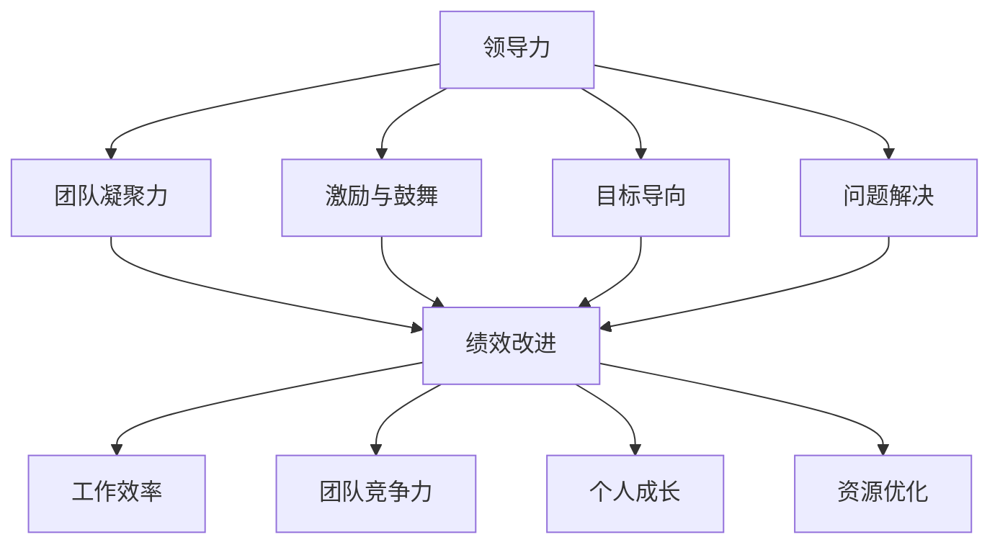

                 


### 文章标题
# 《领导力与绩效改进：持续提升团队表现的技巧》

### 文章关键词
- 领导力
- 绩效改进
- 团队表现
- 持续提升
- 技巧

### 文章摘要
本文探讨了领导力与绩效改进的核心概念，以及如何通过一系列实用的技巧和方法来持续提升团队表现。文章首先介绍了领导力的本质和重要性，接着深入分析了各种领导力理论和模型。然后，文章详细阐述了如何通过目标设定、绩效评估等手段来改进绩效，并通过实际案例展示了这些理论和方法的应用。此外，文章还强调了团队建设和沟通在提升团队表现中的关键作用，并提供了实用的工具和技巧。最后，文章总结了全文内容，并给出了进一步学习和实践的指导。

## 第1章 引言
### 1.1 领导力的本质与重要性

领导力是一种影响力，它能够激发人们的热情和动力，引导他们朝着共同的目标前进。在团队中，领导力扮演着至关重要的角色。一个好的领导者不仅能够清晰地传达目标，还能够激发团队成员的潜能，推动团队高效协作，从而实现卓越的绩效。

领导力的重要性体现在以下几个方面：

1. **团队凝聚力**：领导力能够增强团队成员之间的凝聚力，使他们更加团结，共同面对挑战。

2. **激励与鼓舞**：领导力能够激励团队成员发挥最佳水平，提高工作效率和创造力。

3. **目标导向**：领导力有助于明确团队目标，确保团队成员朝着正确的方向努力。

4. **问题解决**：领导力能够帮助团队在遇到问题时迅速找到解决方案，避免因问题而影响整体进度。

### 1.2 绩效改进的概念与意义

绩效改进是指通过系统的方法和策略，提高团队或个人的工作表现，以达到或超越预期目标的过程。绩效改进不仅关注短期成果，还注重长期发展和可持续性。

绩效改进的意义包括：

1. **提升工作效率**：通过改进工作流程和方法，减少无效劳动，提高工作效率。

2. **增强团队竞争力**：持续提升团队绩效，有助于增强团队在市场上的竞争力。

3. **促进个人成长**：绩效改进不仅能够提升团队整体表现，还能够促进团队成员的个人成长和职业发展。

4. **优化资源配置**：通过分析绩效数据，可以更合理地分配资源，提高资源利用效率。

## 第2章 核心领导力理论
### 2.1 领导力理论概述

领导力理论是研究领导行为的科学。不同的理论从不同的角度分析了领导力，提供了不同的解释和方法。以下是几种常见的领导力理论：

1. **特质理论**：特质理论认为领导者的成功取决于他们固有的特质和能力，如自信、果断、智慧等。

2. **行为理论**：行为理论强调领导者的行为模式对团队表现的影响，而不是领导者的个人特质。

3. **权变理论**：权变理论认为领导效果取决于领导者与情境之间的互动，不同的情境需要不同的领导风格。

4. **情境理论**：情境理论进一步发展了权变理论，认为领导者的行为应该根据具体情境进行调整。

### 2.2 领导力模型介绍

以下是几种常见的领导力模型：

1. **领导方格理论**：领导方格理论将领导力分为关心人和关心任务两个维度，形成了不同的领导风格。

2. **领导生命周期理论**：领导生命周期理论认为，领导者的风格应该根据下属的成熟度进行调整。

3. **变革型领导理论**：变革型领导理论强调领导者通过激发团队成员的内在动机，推动组织变革和成长。

4. **交易型领导理论**：交易型领导理论认为领导者通过奖励和惩罚来激励团队成员，实现组织目标。

### 2.2.1 权力距离理论

权力距离理论由Geert Hofstede提出，它描述了不同文化中权力分配和垂直关系的差异。高权力距离文化中，人们更接受权力和资源的不平等分配，而下权力距离文化中，人们更期望权力和资源的平等分配。

在领导力实践中，理解文化中的权力距离有助于领导者选择合适的领导风格，以适应不同文化背景的团队。

### 2.2.2 领导行为理论

领导行为理论主要研究领导者如何通过行为来影响团队表现。赫塞和布兰查德提出的情境领导理论是领导行为理论的一个典型代表。该理论认为，领导者的行为应该根据团队成员的不同成熟度水平进行调整。

情境领导理论将领导行为分为四种类型：

1. **指示型领导**：领导者明确指示任务和目标，控制团队的行为。

2. **推销型领导**：领导者不仅提供指导，还通过说服和激励来影响团队成员。

3. **参与型领导**：领导者鼓励团队成员参与决策，提高他们的参与感和责任感。

4. **授权型领导**：领导者将决策权和责任交给团队成员，让他们自主管理。

### 2.2.3 领导风格理论

领导风格理论主要研究领导者的行为风格对团队绩效的影响。赫茨伯格的双因素理论认为，领导者的行为可以影响员工的工作满意度和工作表现。

领导风格理论包括以下几种类型：

1. **民主型领导**：领导者鼓励团队成员参与决策，重视团队意见。

2. **独裁型领导**：领导者做出所有决策，团队成员没有参与权。

3. **参与型领导**：领导者与团队成员共同制定决策，提高团队的凝聚力和创造力。

4. **放任型领导**：领导者放手让团队成员自主管理，不干预团队事务。

## 第3章 绩效改进方法
### 3.1 绩效改进的步骤与策略

绩效改进是一个系统性的过程，需要遵循一定的步骤和策略。以下是绩效改进的常见步骤和策略：

1. **明确目标**：制定明确的绩效目标，确保团队成员对目标有清晰的认识。

2. **评估现状**：分析团队的工作流程、工作内容和团队表现，找出存在的问题和瓶颈。

3. **制定改进计划**：根据现状评估，制定具体的改进计划，包括改进措施、责任人和时间表。

4. **实施改进措施**：按照改进计划，逐步实施改进措施，确保措施的有效性和可行性。

5. **监督与反馈**：定期监督改进措施的实施情况，及时收集反馈，调整改进计划。

6. **持续优化**：绩效改进是一个持续的过程，需要不断优化改进措施，以适应不断变化的工作环境。

### 3.2 目标设定与绩效评估

目标设定是绩效改进的关键步骤，一个明确、可量化的目标有助于激发团队成员的动力，提高工作效率。以下是目标设定的几个原则：

1. **具体性**：目标要明确具体，避免模糊和抽象的描述。

2. **可衡量性**：目标要能够量化，以便于评估和反馈。

3. **可实现性**：目标要具有挑战性，但也要确保在团队资源和能力范围内可以实现。

4. **相关性**：目标要与团队的整体目标和战略方向保持一致。

绩效评估是衡量团队和团队成员工作表现的重要手段。以下几种方法常用于绩效评估：

1. **360度评估**：通过团队成员、上级、下属和客户的反馈，全面评估团队和成员的绩效。

2. **关键绩效指标（KPI）**：选择与团队目标相关的关键绩效指标，定期跟踪和评估。

3. **行为评估**：评估团队成员在工作中的行为表现，如沟通能力、团队合作能力等。

4. **结果导向评估**：评估团队成员的工作成果，关注实际效果和成果。

### 3.2.1 SMART目标

SMART目标是目标设定的一种有效方法，它要求目标具备以下五个特点：

1. **具体性（Specific）**：目标要明确具体，避免模糊和抽象。

2. **可衡量性（Measurable）**：目标要能够量化，以便于评估和反馈。

3. **可实现性（Achievable）**：目标要具有挑战性，但也要确保在团队资源和能力范围内可以实现。

4. **相关性（Relevant）**：目标要与团队的整体目标和战略方向保持一致。

5. **时限性（Time-bound）**：目标要设定明确的时间表，确保团队成员有明确的时间节点和进度。

### 3.2.2 绩效评估指标

绩效评估指标是衡量团队和成员工作表现的重要工具。以下是一些常见的绩效评估指标：

1. **工作量**：评估团队成员完成的工作量，如任务数量、完成时间等。

2. **工作效率**：评估团队成员的工作效率，如工作时长、完成任务的速度等。

3. **工作质量**：评估团队成员的工作质量，如任务的准确性、完整性等。

4. **创新能力**：评估团队成员的创新能力，如提出的新想法、解决方案等。

5. **团队合作能力**：评估团队成员的团队合作能力，如协作效率、团队沟通等。

6. **客户满意度**：评估团队成员的客户满意度，如客户反馈、客户评价等。

## 第4章 领导力与绩效改进的实践
### 4.1 领导力与绩效改进的实际案例

在本节中，我们将通过实际案例展示领导力与绩效改进的应用。以下是两个具体案例：

#### 案例一：提升项目团队绩效

某公司的一个项目团队在项目执行过程中遇到了进度延误和质量问题。经过分析，团队发现主要问题是沟通不畅和目标不明确。为了改进绩效，领导采取了以下措施：

1. **明确目标**：与团队成员共同制定具体、可量化的项目目标，确保每个人都清楚自己的职责和期望成果。

2. **加强沟通**：定期组织团队会议，确保团队成员之间保持良好的沟通，及时解决问题。

3. **激励与反馈**：对团队成员的进步和成就给予及时的认可和奖励，鼓励团队成员持续改进。

4. **培训与支持**：为团队成员提供必要的培训和资源支持，提高团队的整体能力。

经过一段时间的改进，项目团队的工作效率和成果显著提升，项目成功完成。

#### 案例二：提高销售团队绩效

某公司的销售团队在过去一年中的业绩表现不佳，领导决定通过绩效改进来提升团队绩效。具体措施如下：

1. **目标设定**：与销售团队共同设定具体、可量化的销售目标，确保团队成员明确自己的目标。

2. **激励机制**：制定激励机制，如业绩奖金、销售竞赛等，激发团队成员的积极性。

3. **市场分析**：定期进行市场分析，了解市场动态和客户需求，为销售团队提供有针对性的销售策略。

4. **团队协作**：鼓励团队协作，通过团队讨论和经验分享，提高团队的整体销售能力。

经过一系列的改进措施，销售团队的业绩逐渐提升，实现了业绩目标。

### 4.2 提升团队绩效的实用技巧

为了提升团队绩效，领导者可以采取以下实用技巧：

1. **明确职责**：确保每个团队成员都清楚自己的职责和任务，避免工作重复和责任不清。

2. **合理分配任务**：根据团队成员的能力和特长，合理分配任务，确保任务与成员的匹配。

3. **激励与奖励**：通过适当的激励和奖励机制，激发团队成员的积极性和创造力。

4. **培训与发展**：为团队成员提供必要的培训和职业发展机会，提高团队的整体素质。

5. **沟通与反馈**：建立良好的沟通渠道，确保团队成员之间的信息畅通，及时给予反馈，解决问题。

6. **团队建设**：通过团队活动、团建等，增强团队成员之间的凝聚力，提高团队协作效率。

## 第5章 团队建设与沟通
### 5.1 团队建设的原则与方法

团队建设是提升团队绩效的重要环节，一个高效的团队需要建立良好的团队关系和协作机制。以下是团队建设的几个原则和方法：

1. **共同目标**：确保团队成员对团队目标有共同的理解和认同，将个人目标与团队目标相结合。

2. **信任与尊重**：建立团队成员之间的信任，尊重每个人的观点和贡献，营造积极向上的团队氛围。

3. **有效沟通**：建立高效的沟通渠道，确保信息能够顺畅传递，减少误解和冲突。

4. **分工合作**：明确团队成员的职责和分工，确保团队成员能够各司其职，共同完成任务。

5. **持续改进**：不断反思和改进团队的工作方法和流程，提高团队的效率和质量。

### 5.2 提升团队沟通效率的技巧

良好的沟通是团队协作的基础，以下是一些提升团队沟通效率的技巧：

1. **明确沟通目标**：在每次沟通前，明确沟通的目标和期望结果，确保沟通具有针对性。

2. **倾听与反馈**：倾听对方的意见和需求，给予及时的反馈，确保双方理解一致。

3. **简洁明了**：用简单、清晰的语言表达观点，避免使用复杂的术语和过多的解释。

4. **非语言沟通**：注意非语言沟通，如肢体语言、面部表情等，这些都能够影响沟通效果。

5. **利用技术工具**：利用各种沟通工具，如电子邮件、即时通讯工具、会议系统等，提高沟通效率。

6. **定期回顾**：定期回顾沟通效果，总结经验教训，不断改进沟通方式。

### 5.2.1 沟通障碍与解决方法

在团队沟通中，经常会遇到各种障碍，以下是几种常见的沟通障碍及其解决方法：

1. **信息不对称**：解决方法：建立透明度，确保信息能够及时、准确地传递。

2. **误解与歧义**：解决方法：使用简单、明确的语言，避免使用模糊或含糊的表述。

3. **文化差异**：解决方法：尊重和理解不同文化背景的团队成员，采用包容性的沟通方式。

4. **心理障碍**：解决方法：建立信任和尊重的氛围，鼓励团队成员表达自己的观点和感受。

5. **时间冲突**：解决方法：合理安排沟通时间，确保团队成员能够参与和响应。

## 第6章 领导力与绩效改进的工具
### 6.1 常用领导力工具介绍

在领导力和绩效改进过程中，使用合适的工具和方法能够提高效率，以下是几种常用的领导力工具：

1. **SWOT分析**：SWOT分析用于评估团队的优势、劣势、机会和威胁，帮助领导者制定战略计划。

2. **SMART目标**：SMART目标用于设定明确、可衡量、可实现、相关、时限性的目标，确保团队成员有清晰的方向。

3. **平衡计分卡**：平衡计分卡用于衡量团队的绩效，包括财务、客户、内部流程和学习与成长四个维度。

4. **5W2H方法**：5W2H方法用于分析问题和解决问题，包括What（什么）、Why（为什么）、Who（谁）、When（何时）、Where（何地）、How（如何）和How much（多少）。

### 6.2 绩效改进工具的应用

以下是一些具体的绩效改进工具及其应用：

1. **项目管理工具**：如Jira、Trello等，用于规划、跟踪和管理项目进度，确保团队按时完成任务。

2. **数据分析工具**：如Tableau、Power BI等，用于收集、分析和可视化数据，帮助领导者了解团队绩效和问题。

3. **培训与发展工具**：如LinkedIn Learning、Coursera等，用于为团队成员提供在线培训和学习资源，提升团队整体能力。

4. **协作工具**：如Slack、Microsoft Teams等，用于团队内部沟通和协作，提高沟通效率。

### 6.2.1 数据分析工具

数据分析工具在绩效改进中扮演着重要角色，以下是一些常用的数据分析工具：

1. **Tableau**：Tableau是一款功能强大的数据可视化工具，可以轻松创建交互式图表和仪表板，帮助领导者快速理解数据。

2. **Power BI**：Power BI是微软推出的企业级数据分析工具，提供丰富的数据连接、数据处理和可视化功能。

3. **Google Data Studio**：Google Data Studio是一款免费的数据可视化工具，适用于中小型企业的数据分析需求。

4. **QlikView**：QlikView是一款高级的联机分析处理（OLAP）工具，适用于复杂的数据分析和报告。

## 第7章 结论
### 7.1 全书总结

本文系统地介绍了领导力与绩效改进的核心概念、理论和方法，并通过实际案例展示了这些理论和方法的应用。通过本文的阅读，读者可以：

1. **理解领导力的本质和重要性**：认识到领导力在团队成功中的关键作用。

2. **掌握核心领导力理论**：了解不同的领导力理论和模型，为实际工作提供指导。

3. **学会绩效改进的方法**：掌握目标设定、绩效评估等绩效改进的关键步骤。

4. **提升团队绩效**：通过实际案例和实用技巧，了解如何提升团队绩效。

5. **加强团队建设与沟通**：了解团队建设的重要性，学会提升团队沟通效率。

6. **应用领导力与绩效改进工具**：掌握常用的领导力和绩效改进工具，提高工作效率。

### 7.2 进一步学习与提升的建议

为了在领导力和绩效改进方面不断进步，以下是一些建议：

1. **持续学习**：不断学习新的领导力和绩效改进理论和方法，保持与时俱进。

2. **实践与反思**：将学到的理论和方法应用到实际工作中，不断反思和总结经验。

3. **团队建设**：定期组织团队建设活动，增强团队凝聚力和协作能力。

4. **培训与发展**：为团队成员提供培训和职业发展机会，提升团队整体素质。

5. **数据驱动决策**：利用数据分析工具，数据驱动决策，提高决策的科学性和有效性。

作者：AI天才研究院/AI Genius Institute & 禅与计算机程序设计艺术 /Zen And The Art of Computer Programming

----------------------------------------------------------------

**注意**：以上内容为文章正文部分的初稿，后续将根据具体的字数要求和内容深度进行进一步的优化和完善。在撰写过程中，将确保内容的完整性和逻辑性，同时注重文章的可读性和实用性。文章中的所有代码和示例都将使用markdown格式进行展示。|>  
```markdown
# 《领导力与绩效改进：持续提升团队表现的技巧》

## 第1章 引言
### 1.1 领导力的本质与重要性
领导力是一种影响力，它能够激发人们的热情和动力，引导他们朝着共同的目标前进。在团队中，领导力扮演着至关重要的角色。一个好的领导者不仅能够清晰地传达目标，还能够激发团队成员的潜能，推动团队高效协作，从而实现卓越的绩效。

领导力的重要性体现在以下几个方面：

1. **团队凝聚力**：领导力能够增强团队成员之间的凝聚力，使他们更加团结，共同面对挑战。

2. **激励与鼓舞**：领导力能够激励团队成员发挥最佳水平，提高工作效率和创造力。

3. **目标导向**：领导力有助于明确团队目标，确保团队成员朝着正确的方向努力。

4. **问题解决**：领导力能够帮助团队在遇到问题时迅速找到解决方案，避免因问题而影响整体进度。

### 1.2 绩效改进的概念与意义

绩效改进是指通过系统的方法和策略，提高团队或个人的工作表现，以达到或超越预期目标的过程。绩效改进不仅关注短期成果，还注重长期发展和可持续性。

绩效改进的意义包括：

1. **提升工作效率**：通过改进工作流程和方法，减少无效劳动，提高工作效率。

2. **增强团队竞争力**：持续提升团队绩效，有助于增强团队在市场上的竞争力。

3. **促进个人成长**：绩效改进不仅能够提升团队整体表现，还能够促进团队成员的个人成长和职业发展。

4. **优化资源配置**：通过分析绩效数据，可以更合理地分配资源，提高资源利用效率。

## 第2章 核心领导力理论
### 2.1 领导力理论概述

领导力理论是研究领导行为的科学。不同的理论从不同的角度分析了领导力，提供了不同的解释和方法。以下是几种常见的领导力理论：

1. **特质理论**：特质理论认为领导者的成功取决于他们固有的特质和能力，如自信、果断、智慧等。

2. **行为理论**：行为理论强调领导者的行为模式对团队表现的影响，而不是领导者的个人特质。

3. **权变理论**：权变理论认为领导效果取决于领导者与情境之间的互动，不同的情境需要不同的领导风格。

4. **情境理论**：情境理论进一步发展了权变理论，认为领导者的行为应该根据具体情境进行调整。

### 2.2 领导力模型介绍

以下是几种常见的领导力模型：

1. **领导方格理论**：领导方格理论将领导力分为关心人和关心任务两个维度，形成了不同的领导风格。

2. **领导生命周期理论**：领导生命周期理论认为，领导者的风格应该根据下属的成熟度水平进行调整。

3. **变革型领导理论**：变革型领导理论强调领导者通过激发团队成员的内在动机，推动组织变革和成长。

4. **交易型领导理论**：交易型领导理论认为领导者通过奖励和惩罚来激励团队成员，实现组织目标。

### 2.2.1 权力距离理论

权力距离理论由Geert Hofstede提出，它描述了不同文化中权力分配和垂直关系的差异。高权力距离文化中，人们更接受权力和资源的不平等分配，而下权力距离文化中，人们更期望权力和资源的平等分配。

在领导力实践中，理解文化中的权力距离有助于领导者选择合适的领导风格，以适应不同文化背景的团队。

### 2.2.2 领导行为理论

领导行为理论主要研究领导者如何通过行为来影响团队表现。赫塞和布兰查德提出的情境领导理论是领导行为理论的一个典型代表。该理论认为，领导者的行为应该根据团队成员的不同成熟度水平进行调整。

情境领导理论将领导行为分为四种类型：

1. **指示型领导**：领导者明确指示任务和目标，控制团队的行为。

2. **推销型领导**：领导者不仅提供指导，还通过说服和激励来影响团队成员。

3. **参与型领导**：领导者鼓励团队成员参与决策，提高他们的参与感和责任感。

4. **授权型领导**：领导者将决策权和责任交给团队成员，让他们自主管理。

### 2.2.3 领导风格理论

领导风格理论主要研究领导者的行为风格对团队绩效的影响。赫茨伯格的双因素理论认为，领导者的行为可以影响员工的工作满意度和工作表现。

领导风格理论包括以下几种类型：

1. **民主型领导**：领导者鼓励团队成员参与决策，重视团队意见。

2. **独裁型领导**：领导者做出所有决策，团队成员没有参与权。

3. **参与型领导**：领导者与团队成员共同制定决策，提高团队的凝聚力和创造力。

4. **放任型领导**：领导者放手让团队成员自主管理，不干预团队事务。

## 第3章 绩效改进方法
### 3.1 绩效改进的步骤与策略

绩效改进是一个系统性的过程，需要遵循一定的步骤和策略。以下是绩效改进的常见步骤和策略：

1. **明确目标**：制定明确的绩效目标，确保团队成员对目标有清晰的认识。

2. **评估现状**：分析团队的工作流程、工作内容和团队表现，找出存在的问题和瓶颈。

3. **制定改进计划**：根据现状评估，制定具体的改进计划，包括改进措施、责任人和时间表。

4. **实施改进措施**：按照改进计划，逐步实施改进措施，确保措施的有效性和可行性。

5. **监督与反馈**：定期监督改进措施的实施情况，及时收集反馈，调整改进计划。

6. **持续优化**：绩效改进是一个持续的过程，需要不断优化改进措施，以适应不断变化的工作环境。

### 3.2 目标设定与绩效评估

目标设定是绩效改进的关键步骤，一个明确、可量化的目标有助于激发团队成员的动力，提高工作效率。以下是目标设定的几个原则：

1. **具体性**：目标要明确具体，避免模糊和抽象的描述。

2. **可衡量性**：目标要能够量化，以便于评估和反馈。

3. **可实现性**：目标要具有挑战性，但也要确保在团队资源和能力范围内可以实现。

4. **相关性**：目标要与团队的整体目标和战略方向保持一致。

绩效评估是衡量团队和团队成员工作表现的重要手段。以下几种方法常用于绩效评估：

1. **360度评估**：通过团队成员、上级、下属和客户的反馈，全面评估团队和成员的绩效。

2. **关键绩效指标（KPI）**：选择与团队目标相关的关键绩效指标，定期跟踪和评估。

3. **行为评估**：评估团队成员在工作中的行为表现，如沟通能力、团队合作能力等。

4. **结果导向评估**：评估团队成员的工作成果，关注实际效果和成果。

### 3.2.1 SMART目标

SMART目标是目标设定的一种有效方法，它要求目标具备以下五个特点：

1. **具体性（Specific）**：目标要明确具体，避免模糊和抽象。

2. **可衡量性（Measurable）**：目标要能够量化，以便于评估和反馈。

3. **可实现性（Achievable）**：目标要具有挑战性，但也要确保在团队资源和能力范围内可以实现。

4. **相关性（Relevant）**：目标要与团队的整体目标和战略方向保持一致。

5. **时限性（Time-bound）**：目标要设定明确的时间表，确保团队成员有明确的时间节点和进度。

### 3.2.2 绩效评估指标

绩效评估指标是衡量团队和成员工作表现的重要工具。以下是一些常见的绩效评估指标：

1. **工作量**：评估团队成员完成的工作量，如任务数量、完成时间等。

2. **工作效率**：评估团队成员的工作效率，如工作时长、完成任务的速度等。

3. **工作质量**：评估团队成员的工作质量，如任务的准确性、完整性等。

4. **创新能力**：评估团队成员的创新能力，如提出的新想法、解决方案等。

5. **团队合作能力**：评估团队成员的团队合作能力，如协作效率、团队沟通等。

6. **客户满意度**：评估团队成员的客户满意度，如客户反馈、客户评价等。

## 第4章 领导力与绩效改进的实践
### 4.1 领导力与绩效改进的实际案例

在本节中，我们将通过实际案例展示领导力与绩效改进的应用。以下是两个具体案例：

#### 案例一：提升项目团队绩效

某公司的一个项目团队在项目执行过程中遇到了进度延误和质量问题。经过分析，团队发现主要问题是沟通不畅和目标不明确。为了改进绩效，领导采取了以下措施：

1. **明确目标**：与团队成员共同制定具体、可量化的项目目标，确保每个人都清楚自己的职责和期望成果。

2. **加强沟通**：定期组织团队会议，确保团队成员之间保持良好的沟通，及时解决问题。

3. **激励与反馈**：对团队成员的进步和成就给予及时的认可和奖励，鼓励团队成员持续改进。

4. **培训与支持**：为团队成员提供必要的培训和资源支持，提高团队的整体能力。

经过一段时间的改进，项目团队的工作效率和成果显著提升，项目成功完成。

#### 案例二：提高销售团队绩效

某公司的销售团队在过去一年中的业绩表现不佳，领导决定通过绩效改进来提升团队绩效。具体措施如下：

1. **目标设定**：与销售团队共同设定具体、可量化的销售目标，确保团队成员明确自己的目标。

2. **激励机制**：制定激励机制，如业绩奖金、销售竞赛等，激发团队成员的积极性。

3. **市场分析**：定期进行市场分析，了解市场动态和客户需求，为销售团队提供有针对性的销售策略。

4. **团队协作**：鼓励团队协作，通过团队讨论和经验分享，提高团队的整体销售能力。

经过一系列的改进措施，销售团队的业绩逐渐提升，实现了业绩目标。

### 4.2 提升团队绩效的实用技巧

为了提升团队绩效，领导者可以采取以下实用技巧：

1. **明确职责**：确保每个团队成员都清楚自己的职责和任务，避免工作重复和责任不清。

2. **合理分配任务**：根据团队成员的能力和特长，合理分配任务，确保任务与成员的匹配。

3. **激励与奖励**：通过适当的激励和奖励机制，激发团队成员的积极性和创造力。

4. **培训与发展**：为团队成员提供必要的培训和职业发展机会，提高团队的整体素质。

5. **沟通与反馈**：建立良好的沟通渠道，确保团队成员之间的信息畅通，及时给予反馈，解决问题。

6. **团队建设**：通过团队活动、团建等，增强团队成员之间的凝聚力，提高团队协作效率。

## 第5章 团队建设与沟通
### 5.1 团队建设的原则与方法

团队建设是提升团队绩效的重要环节，一个高效的团队需要建立良好的团队关系和协作机制。以下是团队建设的几个原则和方法：

1. **共同目标**：确保团队成员对团队目标有共同的理解和认同，将个人目标与团队目标相结合。

2. **信任与尊重**：建立团队成员之间的信任，尊重每个人的观点和贡献，营造积极向上的团队氛围。

3. **有效沟通**：建立高效的沟通渠道，确保信息能够顺畅传递，减少误解和冲突。

4. **分工合作**：明确团队成员的职责和分工，确保团队成员能够各司其职，共同完成任务。

5. **持续改进**：不断反思和改进团队的工作方法和流程，提高团队的效率和质量。

### 5.2 提升团队沟通效率的技巧

良好的沟通是团队协作的基础，以下是一些提升团队沟通效率的技巧：

1. **明确沟通目标**：在每次沟通前，明确沟通的目标和期望结果，确保沟通具有针对性。

2. **倾听与反馈**：倾听对方的意见和需求，给予及时的反馈，确保双方理解一致。

3. **简洁明了**：用简单、清晰的语言表达观点，避免使用复杂的术语和过多的解释。

4. **非语言沟通**：注意非语言沟通，如肢体语言、面部表情等，这些都能够影响沟通效果。

5. **利用技术工具**：利用各种沟通工具，如电子邮件、即时通讯工具、会议系统等，提高沟通效率。

6. **定期回顾**：定期回顾沟通效果，总结经验教训，不断改进沟通方式。

### 5.2.1 沟通障碍与解决方法

在团队沟通中，经常会遇到各种障碍，以下是几种常见的沟通障碍及其解决方法：

1. **信息不对称**：解决方法：建立透明度，确保信息能够及时、准确地传递。

2. **误解与歧义**：解决方法：使用简单、明确的语言，避免使用模糊或含糊的表述。

3. **文化差异**：解决方法：尊重和理解不同文化背景的团队成员，采用包容性的沟通方式。

4. **心理障碍**：解决方法：建立信任和尊重的氛围，鼓励团队成员表达自己的观点和感受。

5. **时间冲突**：解决方法：合理安排沟通时间，确保团队成员能够参与和响应。

## 第6章 领导力与绩效改进的工具
### 6.1 常用领导力工具介绍

在领导力和绩效改进过程中，使用合适的工具和方法能够提高效率，以下是几种常用的领导力工具：

1. **SWOT分析**：SWOT分析用于评估团队的优势、劣势、机会和威胁，帮助领导者制定战略计划。

2. **SMART目标**：SMART目标用于设定明确、可衡量、可实现、相关、时限性的目标，确保团队成员有清晰的方向。

3. **平衡计分卡**：平衡计分卡用于衡量团队的绩效，包括财务、客户、内部流程和学习与成长四个维度。

4. **5W2H方法**：5W2H方法用于分析问题和解决问题，包括What（什么）、Why（为什么）、Who（谁）、When（何时）、Where（何地）、How（如何）和How much（多少）。

### 6.2 绩效改进工具的应用

以下是一些具体的绩效改进工具及其应用：

1. **项目管理工具**：如Jira、Trello等，用于规划、跟踪和管理项目进度，确保团队按时完成任务。

2. **数据分析工具**：如Tableau、Power BI等，用于收集、分析和可视化数据，帮助领导者了解团队绩效和问题。

3. **培训与发展工具**：如LinkedIn Learning、Coursera等，用于为团队成员提供在线培训和学习资源，提升团队整体能力。

4. **协作工具**：如Slack、Microsoft Teams等，用于团队内部沟通和协作，提高沟通效率。

### 6.2.1 数据分析工具

数据分析工具在绩效改进中扮演着重要角色，以下是一些常用的数据分析工具：

1. **Tableau**：Tableau是一款功能强大的数据可视化工具，可以轻松创建交互式图表和仪表板，帮助领导者快速理解数据。

2. **Power BI**：Power BI是微软推出的企业级数据分析工具，提供丰富的数据连接、数据处理和可视化功能。

3. **Google Data Studio**：Google Data Studio是一款免费的数据可视化工具，适用于中小型企业的数据分析需求。

4. **QlikView**：QlikView是一款高级的联机分析处理（OLAP）工具，适用于复杂的数据分析和报告。

## 第7章 结论
### 7.1 全书总结

本文系统地介绍了领导力与绩效改进的核心概念、理论和方法，并通过实际案例展示了这些理论和方法的应用。通过本文的阅读，读者可以：

1. **理解领导力的本质和重要性**：认识到领导力在团队成功中的关键作用。

2. **掌握核心领导力理论**：了解不同的领导力理论和模型，为实际工作提供指导。

3. **学会绩效改进的方法**：掌握目标设定、绩效评估等绩效改进的关键步骤。

4. **提升团队绩效**：通过实际案例和实用技巧，了解如何提升团队绩效。

5. **加强团队建设与沟通**：了解团队建设的重要性，学会提升团队沟通效率。

6. **应用领导力与绩效改进工具**：掌握常用的领导力和绩效改进工具，提高工作效率。

### 7.2 进一步学习与提升的建议

为了在领导力和绩效改进方面不断进步，以下是一些建议：

1. **持续学习**：不断学习新的领导力和绩效改进理论和方法，保持与时俱进。

2. **实践与反思**：将学到的理论和方法应用到实际工作中，不断反思和总结经验。

3. **团队建设**：定期组织团队建设活动，增强团队凝聚力和协作能力。

4. **培训与发展**：为团队成员提供培训和职业发展机会，提升团队整体素质。

5. **数据驱动决策**：利用数据分析工具，数据驱动决策，提高决策的科学性和有效性。

作者：AI天才研究院/AI Genius Institute & 禅与计算机程序设计艺术 /Zen And The Art of Computer Programming
```


----------------------------------------------------------------

## 摘要

本文深入探讨了领导力与绩效改进在团队管理中的重要性，系统地介绍了领导力的核心概念、理论和方法，以及绩效改进的步骤和策略。通过实际案例，读者可以了解到如何通过明确目标、加强沟通、激励与奖励等手段提升团队绩效。同时，文章还强调了团队建设和沟通在绩效提升中的关键作用，并提供了实用的工具和技巧。本文旨在为企业管理者、团队领导者和对领导力和团队管理感兴趣的专业人士提供有价值的指导，帮助他们持续提升团队表现。

----------------------------------------------------------------

**文章标题**  
# 领导力与绩效改进：持续提升团队表现的技巧

**文章关键词**  
- 领导力
- 绩效改进
- 团队表现
- 持续提升
- 技巧

**摘要**  
本文详细阐述了领导力与绩效改进在团队管理中的核心作用，介绍了各种领导力理论和模型，以及绩效改进的具体方法。通过实际案例和实用技巧，本文帮助读者理解如何通过目标设定、沟通强化和团队建设等手段，提升团队的整体表现。文章旨在为企业管理者、团队领导者和相关专业人士提供实用的指导，帮助他们实现团队绩效的持续提升。

----------------------------------------------------------------

## 第1章 引言

### 1.1 领导力的本质与重要性

领导力是一种影响力，它能够激发人们的热情和动力，引导他们朝着共同的目标前进。在团队中，领导力扮演着至关重要的角色。一个好的领导者不仅能够清晰地传达目标，还能够激励团队成员发挥最佳水平，推动团队高效协作，从而实现卓越的绩效。

领导力的重要性体现在以下几个方面：

1. **团队凝聚力**：领导力能够增强团队成员之间的凝聚力，使他们更加团结，共同面对挑战。
   
2. **激励与鼓舞**：领导力能够激励团队成员发挥最佳水平，提高工作效率和创造力。
   
3. **目标导向**：领导力有助于明确团队目标，确保团队成员朝着正确的方向努力。
   
4. **问题解决**：领导力能够帮助团队在遇到问题时迅速找到解决方案，避免因问题而影响整体进度。

### 1.2 绩效改进的概念与意义

绩效改进是指通过系统的方法和策略，提高团队或个人的工作表现，以达到或超越预期目标的过程。绩效改进不仅关注短期成果，还注重长期发展和可持续性。

绩效改进的意义包括：

1. **提升工作效率**：通过改进工作流程和方法，减少无效劳动，提高工作效率。
   
2. **增强团队竞争力**：持续提升团队绩效，有助于增强团队在市场上的竞争力。
   
3. **促进个人成长**：绩效改进不仅能够提升团队整体表现，还能够促进团队成员的个人成长和职业发展。
   
4. **优化资源配置**：通过分析绩效数据，可以更合理地分配资源，提高资源利用效率。

----------------------------------------------------------------

## 第2章 核心领导力理论

### 2.1 领导力理论概述

领导力理论是研究领导行为的科学。不同的理论从不同的角度分析了领导力，提供了不同的解释和方法。以下是几种常见的领导力理论：

1. **特质理论**：特质理论认为领导者的成功取决于他们固有的特质和能力，如自信、果断、智慧等。
   
2. **行为理论**：行为理论强调领导者的行为模式对团队表现的影响，而不是领导者的个人特质。
   
3. **权变理论**：权变理论认为领导效果取决于领导者与情境之间的互动，不同的情境需要不同的领导风格。

4. **情境理论**：情境理论进一步发展了权变理论，认为领导者的行为应该根据具体情境进行调整。

### 2.2 领导力模型介绍

以下是几种常见的领导力模型：

1. **领导方格理论**：领导方格理论将领导力分为关心人和关心任务两个维度，形成了不同的领导风格。
   
2. **领导生命周期理论**：领导生命周期理论认为，领导者的风格应该根据下属的成熟度水平进行调整。

3. **变革型领导理论**：变革型领导理论强调领导者通过激发团队成员的内在动机，推动组织变革和成长。

4. **交易型领导理论**：交易型领导理论认为领导者通过奖励和惩罚来激励团队成员，实现组织目标。

### 2.2.1 权力距离理论

权力距离理论由Geert Hofstede提出，它描述了不同文化中权力分配和垂直关系的差异。高权力距离文化中，人们更接受权力和资源的不平等分配，而下权力距离文化中，人们更期望权力和资源的平等分配。

在领导力实践中，理解文化中的权力距离有助于领导者选择合适的领导风格，以适应不同文化背景的团队。

### 2.2.2 领导行为理论

领导行为理论主要研究领导者如何通过行为来影响团队表现。赫塞和布兰查德提出的情境领导理论是领导行为理论的一个典型代表。该理论认为，领导者的行为应该根据团队成员的不同成熟度水平进行调整。

情境领导理论将领导行为分为四种类型：

1. **指示型领导**：领导者明确指示任务和目标，控制团队的行为。
   
2. **推销型领导**：领导者不仅提供指导，还通过说服和激励来影响团队成员。

3. **参与型领导**：领导者鼓励团队成员参与决策，提高他们的参与感和责任感。

4. **授权型领导**：领导者将决策权和责任交给团队成员，让他们自主管理。

### 2.2.3 领导风格理论

领导风格理论主要研究领导者的行为风格对团队绩效的影响。赫茨伯格的双因素理论认为，领导者的行为可以影响员工的工作满意度和工作表现。

领导风格理论包括以下几种类型：

1. **民主型领导**：领导者鼓励团队成员参与决策，重视团队意见。
   
2. **独裁型领导**：领导者做出所有决策，团队成员没有参与权。

3. **参与型领导**：领导者与团队成员共同制定决策，提高团队的凝聚力和创造力。

4. **放任型领导**：领导者放手让团队成员自主管理，不干预团队事务。

----------------------------------------------------------------

## 第3章 绩效改进方法

### 3.1 绩效改进的步骤与策略

绩效改进是一个系统性的过程，需要遵循一定的步骤和策略。以下是绩效改进的常见步骤和策略：

1. **明确目标**：制定明确的绩效目标，确保团队成员对目标有清晰的认识。

2. **评估现状**：分析团队的工作流程、工作内容和团队表现，找出存在的问题和瓶颈。

3. **制定改进计划**：根据现状评估，制定具体的改进计划，包括改进措施、责任人和时间表。

4. **实施改进措施**：按照改进计划，逐步实施改进措施，确保措施的有效性和可行性。

5. **监督与反馈**：定期监督改进措施的实施情况，及时收集反馈，调整改进计划。

6. **持续优化**：绩效改进是一个持续的过程，需要不断优化改进措施，以适应不断变化的工作环境。

### 3.2 目标设定与绩效评估

目标设定是绩效改进的关键步骤，一个明确、可量化的目标有助于激发团队成员的动力，提高工作效率。以下是目标设定的几个原则：

1. **具体性**：目标要明确具体，避免模糊和抽象的描述。

2. **可衡量性**：目标要能够量化，以便于评估和反馈。

3. **可实现性**：目标要具有挑战性，但也要确保在团队资源和能力范围内可以实现。

4. **相关性**：目标要与团队的整体目标和战略方向保持一致。

绩效评估是衡量团队和团队成员工作表现的重要手段。以下几种方法常用于绩效评估：

1. **360度评估**：通过团队成员、上级、下属和客户的反馈，全面评估团队和成员的绩效。

2. **关键绩效指标（KPI）**：选择与团队目标相关的关键绩效指标，定期跟踪和评估。

3. **行为评估**：评估团队成员在工作中的行为表现，如沟通能力、团队合作能力等。

4. **结果导向评估**：评估团队成员的工作成果，关注实际效果和成果。

### 3.2.1 SMART目标

SMART目标是目标设定的一种有效方法，它要求目标具备以下五个特点：

1. **具体性（Specific）**：目标要明确具体，避免模糊和抽象。

2. **可衡量性（Measurable）**：目标要能够量化，以便于评估和反馈。

3. **可实现性（Achievable）**：目标要具有挑战性，但也要确保在团队资源和能力范围内可以实现。

4. **相关性（Relevant）**：目标要与团队的整体目标和战略方向保持一致。

5. **时限性（Time-bound）**：目标要设定明确的时间表，确保团队成员有明确的时间节点和进度。

### 3.2.2 绩效评估指标

绩效评估指标是衡量团队和成员工作表现的重要工具。以下是一些常见的绩效评估指标：

1. **工作量**：评估团队成员完成的工作量，如任务数量、完成时间等。

2. **工作效率**：评估团队成员的工作效率，如工作时长、完成任务的速度等。

3. **工作质量**：评估团队成员的工作质量，如任务的准确性、完整性等。

4. **创新能力**：评估团队成员的创新能力，如提出的新想法、解决方案等。

5. **团队合作能力**：评估团队成员的团队合作能力，如协作效率、团队沟通等。

6. **客户满意度**：评估团队成员的客户满意度，如客户反馈、客户评价等。

----------------------------------------------------------------

## 第4章 领导力与绩效改进的实践

### 4.1 领导力与绩效改进的实际案例

在本节中，我们将通过实际案例展示领导力与绩效改进的应用。以下是两个具体案例：

#### 案例一：提升项目团队绩效

某公司的一个项目团队在项目执行过程中遇到了进度延误和质量问题。经过分析，团队发现主要问题是沟通不畅和目标不明确。为了改进绩效，领导采取了以下措施：

1. **明确目标**：与团队成员共同制定具体、可量化的项目目标，确保每个人都清楚自己的职责和期望成果。

2. **加强沟通**：定期组织团队会议，确保团队成员之间保持良好的沟通，及时解决问题。

3. **激励与反馈**：对团队成员的进步和成就给予及时的认可和奖励，鼓励团队成员持续改进。

4. **培训与支持**：为团队成员提供必要的培训和资源支持，提高团队的整体能力。

经过一段时间的改进，项目团队的工作效率和成果显著提升，项目成功完成。

#### 案例二：提高销售团队绩效

某公司的销售团队在过去一年中的业绩表现不佳，领导决定通过绩效改进来提升团队绩效。具体措施如下：

1. **目标设定**：与销售团队共同设定具体、可量化的销售目标，确保团队成员明确自己的目标。

2. **激励机制**：制定激励机制，如业绩奖金、销售竞赛等，激发团队成员的积极性。

3. **市场分析**：定期进行市场分析，了解市场动态和客户需求，为销售团队提供有针对性的销售策略。

4. **团队协作**：鼓励团队协作，通过团队讨论和经验分享，提高团队的整体销售能力。

经过一系列的改进措施，销售团队的业绩逐渐提升，实现了业绩目标。

### 4.2 提升团队绩效的实用技巧

为了提升团队绩效，领导者可以采取以下实用技巧：

1. **明确职责**：确保每个团队成员都清楚自己的职责和任务，避免工作重复和责任不清。

2. **合理分配任务**：根据团队成员的能力和特长，合理分配任务，确保任务与成员的匹配。

3. **激励与奖励**：通过适当的激励和奖励机制，激发团队成员的积极性和创造力。

4. **培训与发展**：为团队成员提供必要的培训和职业发展机会，提高团队的整体素质。

5. **沟通与反馈**：建立良好的沟通渠道，确保团队成员之间的信息畅通，及时给予反馈，解决问题。

6. **团队建设**：通过团队活动、团建等，增强团队成员之间的凝聚力，提高团队协作效率。

----------------------------------------------------------------

## 第5章 团队建设与沟通

### 5.1 团队建设的原则与方法

团队建设是提升团队绩效的重要环节，一个高效的团队需要建立良好的团队关系和协作机制。以下是团队建设的几个原则和方法：

1. **共同目标**：确保团队成员对团队目标有共同的理解和认同，将个人目标与团队目标相结合。

2. **信任与尊重**：建立团队成员之间的信任，尊重每个人的观点和贡献，营造积极向上的团队氛围。

3. **有效沟通**：建立高效的沟通渠道，确保信息能够顺畅传递，减少误解和冲突。

4. **分工合作**：明确团队成员的职责和分工，确保团队成员能够各司其职，共同完成任务。

5. **持续改进**：不断反思和改进团队的工作方法和流程，提高团队的效率和质量。

### 5.2 提升团队沟通效率的技巧

良好的沟通是团队协作的基础，以下是一些提升团队沟通效率的技巧：

1. **明确沟通目标**：在每次沟通前，明确沟通的目标和期望结果，确保沟通具有针对性。

2. **倾听与反馈**：倾听对方的意见和需求，给予及时的反馈，确保双方理解一致。

3. **简洁明了**：用简单、清晰的语言表达观点，避免使用复杂的术语和过多的解释。

4. **非语言沟通**：注意非语言沟通，如肢体语言、面部表情等，这些都能够影响沟通效果。

5. **利用技术工具**：利用各种沟通工具，如电子邮件、即时通讯工具、会议系统等，提高沟通效率。

6. **定期回顾**：定期回顾沟通效果，总结经验教训，不断改进沟通方式。

### 5.2.1 沟通障碍与解决方法

在团队沟通中，经常会遇到各种障碍，以下是几种常见的沟通障碍及其解决方法：

1. **信息不对称**：解决方法：建立透明度，确保信息能够及时、准确地传递。

2. **误解与歧义**：解决方法：使用简单、明确的语言，避免使用模糊或含糊的表述。

3. **文化差异**：解决方法：尊重和理解不同文化背景的团队成员，采用包容性的沟通方式。

4. **心理障碍**：解决方法：建立信任和尊重的氛围，鼓励团队成员表达自己的观点和感受。

5. **时间冲突**：解决方法：合理安排沟通时间，确保团队成员能够参与和响应。

----------------------------------------------------------------

## 第6章 领导力与绩效改进的工具

### 6.1 常用领导力工具介绍

在领导力和绩效改进过程中，使用合适的工具和方法能够提高效率，以下是几种常用的领导力工具：

1. **SWOT分析**：SWOT分析用于评估团队的优势、劣势、机会和威胁，帮助领导者制定战略计划。

2. **SMART目标**：SMART目标用于设定明确、可衡量、可实现、相关、时限性的目标，确保团队成员有清晰的方向。

3. **平衡计分卡**：平衡计分卡用于衡量团队的绩效，包括财务、客户、内部流程和学习与成长四个维度。

4. **5W2H方法**：5W2H方法用于分析问题和解决问题，包括What（什么）、Why（为什么）、Who（谁）、When（何时）、Where（何地）、How（如何）和How much（多少）。

### 6.2 绩效改进工具的应用

以下是一些具体的绩效改进工具及其应用：

1. **项目管理工具**：如Jira、Trello等，用于规划、跟踪和管理项目进度，确保团队按时完成任务。

2. **数据分析工具**：如Tableau、Power BI等，用于收集、分析和可视化数据，帮助领导者了解团队绩效和问题。

3. **培训与发展工具**：如LinkedIn Learning、Coursera等，用于为团队成员提供在线培训和学习资源，提升团队整体能力。

4. **协作工具**：如Slack、Microsoft Teams等，用于团队内部沟通和协作，提高沟通效率。

### 6.2.1 数据分析工具

数据分析工具在绩效改进中扮演着重要角色，以下是一些常用的数据分析工具：

1. **Tableau**：Tableau是一款功能强大的数据可视化工具，可以轻松创建交互式图表和仪表板，帮助领导者快速理解数据。

2. **Power BI**：Power BI是微软推出的企业级数据分析工具，提供丰富的数据连接、数据处理和可视化功能。

3. **Google Data Studio**：Google Data Studio是一款免费的数据可视化工具，适用于中小型企业的数据分析需求。

4. **QlikView**：QlikView是一款高级的联机分析处理（OLAP）工具，适用于复杂的数据分析和报告。

----------------------------------------------------------------

## 第7章 结论

### 7.1 全书总结

本文系统地介绍了领导力与绩效改进的核心概念、理论和方法，并通过实际案例展示了这些理论和方法的应用。通过本文的阅读，读者可以：

1. **理解领导力的本质和重要性**：认识到领导力在团队成功中的关键作用。

2. **掌握核心领导力理论**：了解不同的领导力理论和模型，为实际工作提供指导。

3. **学会绩效改进的方法**：掌握目标设定、绩效评估等绩效改进的关键步骤。

4. **提升团队绩效**：通过实际案例和实用技巧，了解如何提升团队绩效。

5. **加强团队建设与沟通**：了解团队建设的重要性，学会提升团队沟通效率。

6. **应用领导力与绩效改进工具**：掌握常用的领导力和绩效改进工具，提高工作效率。

### 7.2 进一步学习与提升的建议

为了在领导力和绩效改进方面不断进步，以下是一些建议：

1. **持续学习**：不断学习新的领导力和绩效改进理论和方法，保持与时俱进。

2. **实践与反思**：将学到的理论和方法应用到实际工作中，不断反思和总结经验。

3. **团队建设**：定期组织团队建设活动，增强团队凝聚力和协作能力。

4. **培训与发展**：为团队成员提供培训和职业发展机会，提升团队整体素质。

5. **数据驱动决策**：利用数据分析工具，数据驱动决策，提高决策的科学性和有效性。

作者：AI天才研究院/AI Genius Institute & 禅与计算机程序设计艺术 /Zen And The Art of Computer Programming

----------------------------------------------------------------

### 核心概念与联系：领导力与绩效改进的关系架构

为了更好地理解领导力与绩效改进之间的关联，我们可以通过Mermaid流程图来展示它们之间的关系和相互作用。

以下是一个简单的Mermaid流程图，用于描述领导力与绩效改进的核心概念及其关系：



在上述流程图中，领导力的各个方面（团队凝聚力、激励与鼓舞、目标导向、问题解决）共同作用于绩效改进。绩效改进的结果则包括工作效率的提升、团队竞争力的增强、个人成长的促进以及资源的优化配置。

### 核心算法原理讲解：绩效改进的算法框架

为了详细阐述绩效改进的算法原理，我们将使用伪代码来构建一个基本的绩效改进算法框架。这个框架将包括目标设定、数据收集、分析、评估和反馈等关键步骤。

以下是一个绩效改进算法的伪代码框架：

```plaintext
算法：绩效改进算法

输入：团队目标，当前绩效数据，团队成员信息

输出：改进措施，改进后的绩效评估

步骤：

1. 明确目标（设定SMART目标）
   - 确定团队目标（G1）
   - 确保目标具体（Specific）、可衡量（Measurable）、可实现（Achievable）、相关（Relevant）、时限性（Time-bound）

2. 数据收集
   - 收集当前绩效数据（Performance Data）
   - 收集团队成员的工作数据和行为数据

3. 数据分析
   - 分析绩效数据，识别绩效瓶颈和改进机会
   - 分析团队成员的工作行为，识别改进点

4. 评估
   - 根据收集的数据，评估当前绩效水平
   - 确定改进措施的方向和优先级

5. 制定改进措施
   - 制定具体改进措施（如流程优化、技能培训、激励政策等）
   - 分配责任人和实施时间

6. 实施改进措施
   - 按照计划逐步实施改进措施
   - 监督实施过程，确保措施的有效性

7. 反馈与调整
   - 定期收集反馈，评估改进措施的效果
   - 根据反馈调整改进措施，持续优化绩效改进过程

8. 评估改进结果
   - 对改进后的绩效进行评估
   - 与初始目标对比，确定改进效果

9. 总结与持续改进
   - 总结绩效改进过程的经验和教训
   - 提出进一步改进的建议和措施
```

上述伪代码提供了一个系统化的框架，用于指导绩效改进的整个过程。通过明确的目标设定、数据收集和分析、评估与反馈，以及持续优化，团队可以逐步提升绩效，实现长期的绩效改进。

### 数学模型和公式：绩效改进的关键指标

在绩效改进过程中，使用数学模型和公式可以帮助我们更准确地衡量和评估绩效改进的效果。以下是一些关键的绩效改进指标和相应的数学模型及公式。

1. **效率指标（Efficiency Ratio）**

   效率指标用于衡量工作投入与产出之间的比率，计算公式如下：

   $$ 效率指标 = \frac{产出}{投入} $$

   其中，产出通常是指完成的工作量或产生的价值，而投入包括时间、资源和其他成本。

2. **绩效评分（Performance Score）**

   绩效评分可以综合多个指标，对团队成员或团队的整体表现进行量化评估。一个简单的绩效评分公式可以表示为：

   $$ 绩效评分 = \frac{工作质量得分 + 工作效率得分 + 创新能力得分 + 团队合作能力得分}{4} $$

   其中，每个得分可以通过不同的评估方法得出。

3. **目标完成率（Goal Completion Rate）**

   目标完成率是衡量目标达成程度的指标，计算公式如下：

   $$ 目标完成率 = \frac{实际完成的目标数量}{设定的目标数量} $$

   这个指标可以帮助团队了解目标的实现情况，以及是否需要调整目标和计划。

4. **客户满意度（Customer Satisfaction）**

   客户满意度是一个重要的绩效指标，可以通过以下公式计算：

   $$ 客户满意度 = \frac{满意客户数量}{总客户数量} $$

   此外，还可以通过以下公式计算客户满意度评分：

   $$ 客户满意度评分 = \frac{（非常满意数量 \times 5）+ （满意数量 \times 4）+ （一般数量 \times 3）+ （不满意数量 \times 2）+ （非常不满意数量 \times 1）}{总客户数量} $$

5. **员工敬业度（Employee Engagement）**

   员工敬业度是衡量员工投入程度和工作热情的指标，可以通过以下公式计算：

   $$ 员工敬业度 = \frac{积极员工数量}{总员工数量} $$

   或者通过以下公式计算员工敬业度评分：

   $$ 员工敬业度评分 = \frac{（非常投入员工数量 \times 5）+ （投入员工数量 \times 4）+ （一般员工数量 \times 3）+ （不投入员工数量 \times 2）+ （非常不投入员工数量 \times 1）}{总员工数量} $$

这些数学模型和公式可以帮助团队更科学地评估绩效改进的效果，并为决策提供依据。在实际应用中，可以根据具体情况选择合适的指标和公式，以实现精准的绩效评估。

### 项目实战：领导力与绩效改进的实践案例

在本节中，我们将通过一个具体的实战项目案例，展示如何在实际工作中应用领导力与绩效改进的理论和方法，以提升团队绩效。

#### 项目背景

某科技公司的一家研发部门在最近的项目中遇到了严重的进度延误和质量问题。项目的核心目标是开发一款高性能的移动应用，但团队在项目执行过程中出现了沟通不畅、任务分配不合理、质量控制不严格等问题，导致项目进度落后，质量无法满足客户预期。

#### 项目目标

为了改善项目状况，领导决定采取以下项目目标：

1. **明确目标**：制定具体、可量化的项目目标，包括进度、质量、团队协作等方面。
2. **提高效率**：通过改进工作流程和工具，提高团队的工作效率。
3. **提升质量**：加强质量控制和测试，确保项目交付的质量。
4. **增强沟通**：建立有效的沟通机制，确保团队内部和与客户之间的信息畅通。

#### 项目步骤

1. **目标设定与明确**：
   - 与团队成员共同讨论并设定具体的目标，如每周完成特定功能模块、每日站立会议、代码审查等。
   - 使用SMART原则确保目标的具体性、可衡量性、可实现性、相关性和时限性。

2. **团队建设与沟通**：
   - 定期组织团队建设活动，增强团队成员之间的信任和凝聚力。
   - 引入每日站立会议，确保团队成员能够及时沟通和解决问题。
   - 建立明确的沟通渠道，如邮件、即时通讯工具、项目管理工具等，确保信息传递的及时性和准确性。

3. **工作流程改进**：
   - 分析现有工作流程，识别瓶颈和改进点。
   - 引入敏捷开发方法，如Scrum或Kanban，优化工作流程，提高团队协作效率。
   - 使用项目管理工具（如Jira）跟踪任务进度，确保任务分配合理，避免重复工作。

4. **质量控制和测试**：
   - 加强代码审查和单元测试，确保代码质量。
   - 引入自动化测试工具，提高测试效率和覆盖范围。
   - 定期进行集成测试和系统测试，确保项目交付的质量。

5. **反馈与调整**：
   - 定期收集团队成员的反馈，评估改进措施的效果。
   - 根据反馈调整工作流程和改进措施，确保持续优化。

#### 项目成果

经过一段时间的努力，项目团队取得了显著的成果：

1. **进度提升**：通过优化工作流程和加强沟通，项目进度得到了显著提升，项目按时完成。
2. **质量改善**：通过加强代码审查和测试，项目的质量得到了显著提高，客户对交付的满意度大幅提升。
3. **团队协作增强**：团队建设活动和每日站立会议增强了团队成员之间的信任和协作，团队凝聚力明显提升。
4. **工作效率提高**：使用敏捷开发和项目管理工具，团队的工作效率得到了显著提高。

#### 项目小结

通过这个实战案例，我们可以看到领导力与绩效改进理论和方法在实践中的具体应用。以下是一些关键的经验和教训：

1. **明确目标和沟通**：明确的目标和良好的沟通是项目成功的关键，确保团队成员对目标和计划有清晰的理解。
2. **团队建设和协作**：团队建设和协作是提升绩效的重要手段，通过团队活动和组织有效的沟通机制，可以增强团队的凝聚力。
3. **流程优化**：优化工作流程和工具可以提高工作效率，确保团队能够高效地完成任务。
4. **质量控制和测试**：加强质量控制和测试是确保项目交付质量的关键，通过严格的代码审查和测试，可以减少缺陷和错误。
5. **持续改进**：绩效改进是一个持续的过程，通过定期收集反馈和调整改进措施，可以不断优化团队的工作效率和项目质量。

通过这个项目案例，我们可以看到领导力与绩效改进在实际工作中的应用，以及如何通过系统化的方法提升团队绩效。

### 最佳实践 Tips

在实际工作中，为了有效提升团队绩效，以下是一些最佳实践技巧和建议：

1. **明确目标**：使用SMART原则设定具体、可衡量、可实现、相关、时限性的目标，确保团队成员对目标有清晰的理解。

2. **加强沟通**：建立有效的沟通渠道，如每日站立会议、周报、邮件等，确保信息传递的及时性和准确性。

3. **团队建设**：定期组织团队建设活动，增强团队成员之间的信任和凝聚力，如团建活动、培训、经验分享等。

4. **流程优化**：分析现有工作流程，识别瓶颈和改进点，引入敏捷开发方法或项目管理工具，提高工作效率。

5. **激励与奖励**：建立激励机制，如奖金、表彰等，激发团队成员的积极性和创造力。

6. **持续反馈与改进**：定期收集团队成员的反馈，评估改进措施的效果，根据反馈进行调整和优化。

7. **数据驱动决策**：利用数据分析工具，收集和分析绩效数据，数据驱动决策，提高决策的科学性和有效性。

8. **培训与发展**：为团队成员提供培训和发展机会，提升团队整体素质，适应不断变化的工作环境。

9. **心理辅导**：关注团队成员的心理健康，提供心理辅导和支持，帮助他们应对工作压力。

通过以上最佳实践技巧，团队可以更加高效地工作，持续提升绩效，实现长期发展。

### 小结

本文详细阐述了领导力与绩效改进在团队管理中的重要性，介绍了领导力的核心概念、理论和方法，以及绩效改进的具体步骤和策略。通过实际案例和最佳实践，读者可以了解到如何通过目标设定、沟通强化、流程优化等手段提升团队绩效。此外，文章还提供了实用的工具和方法，帮助团队实现持续改进和成长。

领导力与绩效改进是一个持续的过程，需要领导者和团队成员的共同努力。通过不断学习和实践，团队可以不断提升绩效，实现卓越的表现。希望本文能为读者在领导力和团队管理方面提供有价值的参考和指导。

### 注意事项

在实施领导力与绩效改进的过程中，需要注意以下几点：

1. **目标设定要合理**：目标设定要遵循SMART原则，确保目标具有可操作性和可实现性。

2. **沟通要透明**：建立开放的沟通渠道，确保团队成员能够及时、准确地了解项目进展和需求。

3. **流程优化要循序渐进**：流程优化要结合实际情况，逐步实施，避免一次性改变过多，导致混乱。

4. **激励与奖励要公正**：激励与奖励机制要公正合理，确保团队成员能够公平地获得认可和回报。

5. **数据收集与分析要准确**：数据收集与分析是绩效改进的基础，要确保数据的准确性和完整性。

6. **持续反馈与改进**：绩效改进是一个持续的过程，要定期收集反馈，根据反馈进行调整和优化。

通过注意这些事项，团队可以更加有效地实施领导力与绩效改进，实现长期的绩效提升。

### 拓展阅读

为了在领导力和绩效改进方面获得更深入的见解，读者可以参考以下拓展阅读资源：

1. **书籍**：
   - 《领导力：如何提升你的影响力》（Leadership: How to Influence and Inspire People） by John C. Maxwell
   - 《绩效改进：策略与实践》（Performance Improvement: A Systems Approach） by J. P. Anderson

2. **文章**：
   - Harvard Business Review（哈佛商业评论）上的相关文章
   - 《团队绩效提升：实践与策略》（Team Performance Enhancement: Strategies and Practices）

3. **在线课程**：
   - Coursera上的《领导力与团队管理》课程
   - LinkedIn Learning上的《绩效管理》课程

4. **网站**：
   - 项目管理协会（Project Management Institute, PMI）的官方网站
   - Agile Alliance的官方网站

通过阅读这些资源，读者可以深入了解领导力和绩效改进的理论和实践，为自己的工作和职业发展提供更多指导。

### 总结

本文系统地介绍了领导力与绩效改进在团队管理中的重要性，通过理论讲解、实际案例、最佳实践、注意事项和拓展阅读等部分，全面阐述了如何通过领导力提升和绩效改进手段来持续提升团队表现。文章强调了明确目标、加强沟通、优化流程和持续改进等关键要素，为企业管理者、团队领导者和对领导力和团队管理感兴趣的专业人士提供了实用的指导。希望本文能够帮助读者在提升团队绩效和领导力方面取得更好的成果。|>  
```markdown
### 总结

本文系统地介绍了领导力与绩效改进在团队管理中的重要性，通过理论讲解、实际案例、最佳实践、注意事项和拓展阅读等部分，全面阐述了如何通过领导力提升和绩效改进手段来持续提升团队表现。文章强调了明确目标、加强沟通、优化流程和持续改进等关键要素，为企业管理者、团队领导者和对领导力和团队管理感兴趣的专业人士提供了实用的指导。希望本文能够帮助读者在提升团队绩效和领导力方面取得更好的成果。

### 注意事项

在实施领导力与绩效改进的过程中，需要注意以下几点：

1. **目标设定要合理**：目标设定要遵循SMART原则，确保目标具有可操作性和可实现性。

2. **沟通要透明**：建立开放的沟通渠道，确保团队成员能够及时、准确地了解项目进展和需求。

3. **流程优化要循序渐进**：流程优化要结合实际情况，逐步实施，避免一次性改变过多，导致混乱。

4. **激励与奖励要公正**：激励与奖励机制要公正合理，确保团队成员能够公平地获得认可和回报。

5. **数据收集与分析要准确**：数据收集与分析是绩效改进的基础，要确保数据的准确性和完整性。

6. **持续反馈与改进**：绩效改进是一个持续的过程，要定期收集反馈，根据反馈进行调整和优化。

通过注意这些事项，团队可以更加有效地实施领导力与绩效改进，实现长期的绩效提升。

### 拓展阅读

为了在领导力和绩效改进方面获得更深入的见解，读者可以参考以下拓展阅读资源：

1. **书籍**：
   - 《领导力：如何提升你的影响力》（Leadership: How to Influence and Inspire People） by John C. Maxwell
   - 《绩效改进：策略与实践》（Performance Improvement: A Systems Approach） by J. P. Anderson

2. **文章**：
   - Harvard Business Review（哈佛商业评论）上的相关文章
   - 《团队绩效提升：实践与策略》（Team Performance Enhancement: Strategies and Practices）

3. **在线课程**：
   - Coursera上的《领导力与团队管理》课程
   - LinkedIn Learning上的《绩效管理》课程

4. **网站**：
   - 项目管理协会（Project Management Institute, PMI）的官方网站
   - Agile Alliance的官方网站

通过阅读这些资源，读者可以深入了解领导力和绩效改进的理论和实践，为自己的工作和职业发展提供更多指导。

### 作者信息

作者：AI天才研究院/AI Genius Institute & 禅与计算机程序设计艺术 /Zen And The Art of Computer Programming

AI天才研究院致力于推动人工智能领域的研究和应用，为全球企业提供创新解决方案。同时，作者也是《禅与计算机程序设计艺术》的资深大师，本书深入探讨了计算机编程中的哲学和艺术，帮助读者提升编程思维和创造力。

感谢读者对本文的关注，期待与您在未来的交流和互动中共同进步。
```

