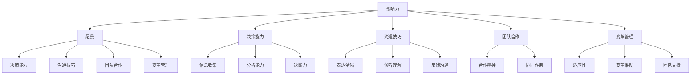

                 

### 文章标题

# 《领导力与职业发展规划：助力员工成长的方法》

### 关键词

- 领导力
- 职业发展
- 员工成长
- 案例分析
- 实战指导

### 摘要

本文旨在深入探讨领导力与职业发展规划的重要性，以及如何通过有效的领导力和职业发展策略来助力员工成长。文章将首先介绍领导力的核心概念和类型，然后详细阐述职业发展规划的步骤和方法，以及员工成长的重要途径。通过实际案例分析和实战指导，本文将提供实用的工具和方法，帮助领导者和管理者提升领导力，制定职业发展规划，并助力员工的职业成长。

## 引言

在当今快速变化的商业环境中，领导力和职业发展规划成为了企业和个人成功的关键要素。领导力不仅是领导者个人的能力，更是整个团队和组织进步的驱动力。而职业发展规划则帮助员工明确个人目标，提升专业技能，实现职业上的持续成长。本节将介绍领导力和职业发展的基本概念，并概述本书的结构和目的。

### 领导力的基本概念

领导力是一种影响和激励他人实现共同目标的能力。它不仅仅涉及个人的技能和知识，更是一种价值观和理念的传递。领导力可以表现在多个方面，如决策能力、沟通技巧、团队合作和变革管理。有效的领导力能够激发团队成员的潜力，提高团队的整体绩效。

### 职业发展的基本概念

职业发展是指个人在职业生涯中不断提升技能、知识和经验的过程。它不仅关注职业晋升，还强调职业满意度、个人成长和职业发展目标的实现。职业发展规划是一种系统的方法，帮助员工确定职业目标，制定实现这些目标的策略，并在职业生涯中不断调整和优化。

### 本书的结构和目的

本书分为六个主要部分。首先，我们将深入探讨领导力的核心概念和类型，并使用Mermaid流程图展示领导力的主要要素及其相互关系。接着，我们将详细分析职业发展规划的重要性和策略，包括制定和实施职业规划的步骤。随后，文章将探讨员工成长的重要途径和方法，并提供实用的工具和技巧。为了更好地理解这些概念，我们将通过实际案例进行分析。最后，本文将提供实战指导，帮助领导者和管理者提升领导力，制定职业发展规划，并助力员工的职业成长。

## 领导力

领导力是一种多维度、多层次的能力，它不仅涉及个人品质和技能，还受到环境和情境的影响。在本节中，我们将探讨领导力的核心概念、特点、类型及其相互关系，并使用Mermaid流程图来展示这些概念之间的联系。

### 领导力的核心概念

领导力的核心概念包括：**影响力**、**愿景**、**决策能力**、**沟通技巧**、**团队合作**和**变革管理**。这些概念相互交织，共同构成了领导力的整体架构。

1. **影响力**：领导力的基础在于影响他人。这不仅仅是通过权威来实现，更多的是通过沟通、激励和榜样作用来影响团队成员。

2. **愿景**：领导力需要清晰的愿景，即对未来的展望和目标。一个有力的愿景能够激励团队成员，并指导他们的行动。

3. **决策能力**：领导者需要在复杂和不确定的环境中做出正确的决策。有效的决策能力取决于信息收集、分析能力和决断力。

4. **沟通技巧**：良好的沟通是领导力的关键。领导者需要能够清晰、有效地传达愿景和目标，同时倾听和理解团队成员的需求和反馈。

5. **团队合作**：团队合作是实现共同目标的关键。领导者需要能够激发团队成员的合作精神，促进团队协作和协同。

6. **变革管理**：在快速变化的商业环境中，领导者需要具备变革管理能力，以应对外部挑战和内部变革。

### Mermaid流程图

### 领导力的特点与类型

领导力具有以下主要特点：

1. **多样性**：领导力不是一成不变的，而是根据不同的情境和团队需求而变化。
2. **情境性**：领导力受到环境和情境的影响，不同的环境和情境需要不同的领导风格。
3. **可持续性**：有效的领导力是可持续的，它能够帮助团队和组织实现长期的目标。

根据领导风格的不同，领导力可以分为以下几种类型：

1. **权威型领导**：领导者通过权威和命令来指导团队，适合在紧急或不确定的情况下使用。
2. **民主型领导**：领导者鼓励团队成员参与决策过程，适合在需要团队协作和创新的情境中应用。
3. **支持型领导**：领导者关注团队成员的需求和情感，创造一个支持性的工作环境。
4. **变革型领导**：领导者通过激发团队成员的潜力，推动组织变革和创新。

### 领导力的核心要素

领导力的核心要素包括：

1. **自我意识**：领导者需要了解自己的优势和局限性，以及如何将这些因素用于领导实践中。
2. **同理心**：领导者需要能够理解和感受团队成员的情感和需求，建立信任和合作关系。
3. **责任心**：领导者需要对团队和组织的目标负责，并愿意为结果承担风险和责任。
4. **沟通技巧**：领导者需要能够清晰、有效地沟通愿景、目标和期望，同时倾听和理解团队成员的意见和建议。
5. **决策能力**：领导者需要能够迅速、明智地做出决策，并在复杂和不确定的环境中保持冷静。

通过以上分析，我们可以看到领导力是一个复杂而多维的概念，它涉及到多个核心要素和相互关联的子概念。理解这些概念和关系，对于提升领导力和实施有效的领导策略至关重要。

## 职业发展规划

职业发展规划是指个人为了实现职业目标而制定的长期计划。它不仅有助于提升个人职业素养，还能为企业和组织创造更大的价值。在本节中，我们将详细探讨职业发展规划的重要性，以及如何制定和实施职业规划。

### 职业发展规划的重要性

职业发展规划对于个人和团队具有重要意义：

1. **目标明确**：职业发展规划帮助个人明确职业目标，使其在职业生涯中更加有方向感。
2. **能力提升**：通过职业规划，个人可以针对性地提升自己的技能和知识，增强竞争力。
3. **职业满足感**：一个明确的职业规划能够帮助个人在职业道路上获得更大的满足感和成就感。
4. **团队协作**：职业发展规划不仅有助于个人成长，还能提升团队的整体绩效，促进团队协作。
5. **企业价值**：职业发展规划能够帮助企业培养和留住人才，提升企业的核心竞争力。

### 职业规划的步骤与实施方法

制定和实施职业发展规划需要遵循以下步骤：

1. **自我评估**：个人需要评估自己的优势、兴趣和职业价值观，明确自己的职业方向。
2. **市场调研**：了解所在行业的发展趋势和就业市场需求，为自己的职业规划提供依据。
3. **设定目标**：根据自我评估和市场调研的结果，设定短期和长期的职业目标。
4. **制定策略**：制定实现职业目标的策略，包括技能提升、职业转换和职业发展路径等。
5. **执行与调整**：实施职业规划，并根据实际情况进行调整和优化。

下面是一个简单的职业规划实施示例：

1. **自我评估**：
   - 优势：项目管理能力、沟通协调能力
   - 兴趣：技术创新、项目管理
   - 职业价值观：创新、团队合作、持续学习

2. **市场调研**：
   - 行业趋势：信息技术行业快速发展，项目管理人才需求增加
   - 市场需求：具备项目管理经验和技能的专业人才备受青睐

3. **设定目标**：
   - 短期目标：在现有公司获得项目管理岗位
   - 长期目标：成为信息技术领域的项目管理专家

4. **制定策略**：
   - 技能提升：学习项目管理工具和技能，如敏捷方法和Scrum框架
   - 职业转换：参加项目管理认证培训，如PMP认证
   - 职业发展路径：通过项目管理岗位，逐步晋升为项目经理和项目总监

5. **执行与调整**：
   - 实施计划：参加PMP认证培训，学习敏捷方法和Scrum框架
   - 定期评估：每季度评估职业发展进度，根据实际情况进行调整

通过以上步骤，个人可以更好地制定和实施职业发展规划，实现职业成长。

### 职业发展规划的策略

为了实现有效的职业发展规划，可以采用以下策略：

1. **目标明确**：设定清晰、可衡量的职业目标，确保规划具有实际操作性。
2. **持续学习**：保持持续学习的态度，不断提升自己的技能和知识。
3. **反馈与调整**：定期寻求反馈，并根据反馈调整职业规划，确保其与个人和市场需求保持一致。
4. **网络建设**：通过建立和扩展职业网络，获取更多的职业机会和资源。

总之，职业发展规划是实现个人职业目标和职业成长的重要工具。通过科学的规划和实施，个人可以在职业生涯中取得更大的成功。

## 员工成长

员工成长是职业发展的核心要素，它不仅关系到员工的个人发展，也直接影响企业的绩效和竞争力。在本节中，我们将深入探讨员工成长的重要性，以及如何通过有效的途径和方法助力员工成长。

### 员工成长的重要性

员工成长对个人和团队有着重要的影响：

1. **个人发展**：员工成长有助于提升个人技能和知识，增强自信心和职业竞争力，实现职业目标。
2. **团队协作**：员工成长能够提高团队的整体素质和绩效，促进团队协作和创新能力。
3. **企业竞争力**：通过员工成长，企业能够培养和留住优秀人才，提升企业的核心竞争力。

### 员工成长的方法与技巧

助力员工成长需要采用多种方法和技巧，以下是一些实用的策略：

1. **培训与发展**：提供各种形式的培训，如内部培训、外部培训、在线课程等，帮助员工提升技能和知识。
2. **导师制度**：建立导师制度，让经验丰富的员工指导新员工，帮助其快速融入团队和职业角色。
3. **项目参与**：鼓励员工参与各种项目，特别是跨部门和跨职能的项目，以拓宽其视野和技能。
4. **反馈与激励**：定期给予员工反馈，奖励其成长和进步，激励其持续学习和发展。
5. **职业规划**：帮助员工制定个人职业规划，明确其职业目标和发展路径。

下面是一个员工成长路径的示例：

1. **新员工入职培训**：
   - 基础技能培训：办公软件操作、团队沟通技巧
   - 企业文化培训：企业历史、价值观、组织架构

2. **专业技能提升**：
   - 在职培训：编程技能、项目管理
   - 外部培训：参加行业研讨会、专业认证培训

3. **项目参与**：
   - 参与公司内部项目，逐步承担更多的责任和挑战
   - 参与外部项目，拓宽视野和技能

4. **导师指导**：
   - 配备经验丰富的导师，提供职业发展建议和指导
   - 定期进行导师-徒弟会议，交流心得和经验

5. **职业规划**：
   - 制定个人职业规划，设定短期和长期目标
   - 定期评估和调整职业规划，确保与个人和市场需求保持一致

通过以上方法和策略，企业可以有效地助力员工成长，实现个人与团队的共同发展。

### 员工成长的最佳实践

以下是一些员工成长的最佳实践：

1. **建立学习文化**：鼓励员工持续学习和成长，将其作为企业文化的一部分。
2. **灵活的工作安排**：提供灵活的工作时间和工作地点，以适应员工的个人需求和职业发展。
3. **鼓励创新**：鼓励员工提出新想法和解决方案，激发其创新精神和创造力。
4. **提供反馈和激励**：定期提供反馈，并根据员工的成长和进步给予激励和奖励。
5. **跨部门交流**：促进跨部门的交流和合作，帮助员工拓宽视野和技能。

通过实施这些最佳实践，企业可以更好地助力员工成长，提升团队和组织的整体绩效。

## 案例分析

为了更好地理解领导力与职业发展规划在实际中的应用，以下通过两个案例进行分析。

### 案例分析1：领导力在团队管理中的应用

#### 案例背景

一家大型互联网公司成立了一个新的研发团队，旨在开发一款创新的产品。团队成员来自不同的背景，包括软件工程师、产品经理、UI设计师等。然而，由于团队成员之间的沟通不畅和目标不明确，团队在项目启动阶段遇到了诸多困难。

#### 案例分析

1. **领导力的应用**：
   - **影响力**：项目经理通过自己的言行和榜样作用，引导团队成员形成积极的工作态度。
   - **愿景**：项目经理与团队成员共同制定了清晰的项目目标，并解释了项目的重要性和预期成果。
   - **沟通技巧**：项目经理定期组织团队会议，倾听团队成员的意见和反馈，确保团队目标的传达和共识。
   - **团队合作**：项目经理鼓励团队成员之间的合作和协作，建立信任和互助的关系。
   - **变革管理**：项目经理在项目过程中积极应对变化，调整策略和计划，确保项目能够按时交付。

2. **效果评估**：
   - 通过有效的领导力应用，团队成员逐渐明确了项目的目标和职责，提高了工作效率和协作水平。
   - 项目最终按时交付，并得到了客户的高度评价。

### 案例分析2：职业发展规划在员工职业发展中的应用

#### 案例背景

一位年轻的软件工程师在一家初创公司工作，他在工作中表现出色，但对自己的职业发展感到困惑，不确定未来该如何提升自己的技能和职位。

#### 案例分析

1. **职业发展规划的应用**：
   - **自我评估**：工程师与导师进行深入沟通，评估自己的技能、兴趣和职业价值观。
   - **市场调研**：工程师通过参加行业会议和阅读行业报告，了解市场趋势和职业需求。
   - **设定目标**：工程师制定了短期和长期的职业目标，包括成为高级软件工程师和团队负责人。
   - **制定策略**：工程师制定了详细的职业发展策略，包括参加培训、参与重要项目、扩展职业网络等。
   - **执行与调整**：工程师按计划参加培训，参与重要项目，并根据实际情况调整职业规划。

2. **效果评估**：
   - 通过明确的职业发展规划，工程师在短时间内提升了自己的技能和职位，成为了团队的核心成员。
   - 工程师的职业发展路径清晰，对未来的职业发展充满信心。

通过这两个案例，我们可以看到领导力与职业发展规划在实际中的应用效果显著，不仅提高了团队和个人的绩效，还促进了企业的长期发展。

## 实战指导

在实际工作中，提升领导力和制定职业发展规划是两个关键任务。以下提供了一些具体的实战指导，帮助领导者和管理者提升领导力，制定职业发展规划，并助力员工的职业成长。

### 如何提升领导力

1. **自我认知**：
   - 定期进行自我反思，了解自己的优势和不足，识别自己的领导风格。
   - 通过360度反馈，收集来自团队成员、同事和上级的反馈，全面了解自己的领导能力。

2. **持续学习**：
   - 参加领导力培训课程，学习最新的领导理论和实践方法。
   - 阅读领导力相关的书籍和文章，拓宽视野，提升自己的领导智慧。

3. **建立愿景**：
   - 与团队成员共同制定清晰的愿景和目标，确保每个人都明确项目的方向和意义。
   - 通过定期的沟通和反馈，确保团队成员对愿景和目标有共同的理解和认同。

4. **增强沟通能力**：
   - 学习有效的沟通技巧，如积极倾听、清晰表达、积极反馈。
   - 通过模拟演练和角色扮演，提高自己的沟通能力，确保信息传达的准确性和有效性。

5. **促进团队合作**：
   - 建立信任和互助的团队文化，鼓励团队成员之间的合作和分享。
   - 通过团队建设和团队活动，增强团队成员之间的联系和凝聚力。

6. **变革管理**：
   - 在面对变革时，主动参与并推动变革，确保团队成员理解变革的必要性和意义。
   - 通过有效的沟通和激励，帮助团队成员适应变革，并在变革中找到新的机遇。

### 如何制定职业发展规划

1. **自我评估**：
   - 通过自我反思和职业测评工具，了解自己的兴趣、优势和职业价值观。
   - 与导师或职业顾问进行沟通，获取专业的评估和建议。

2. **市场调研**：
   - 了解所在行业的发展趋势和职业需求，明确未来的职业方向。
   - 通过参加行业会议、阅读行业报告等方式，获取最新的行业信息。

3. **设定目标**：
   - 设定短期和长期的职业目标，确保目标具体、可衡量和可实现。
   - 将个人目标和团队目标相结合，确保个人职业发展与企业需求相匹配。

4. **制定策略**：
   - 根据目标，制定具体的行动计划，包括学习计划、项目参与、职业认证等。
   - 确保策略具有可操作性和实施性，并定期进行评估和调整。

5. **执行与调整**：
   - 按计划执行职业发展策略，同时保持灵活性和适应性，应对变化和挑战。
   - 定期进行职业发展评估，根据实际情况调整目标和策略。

6. **反馈与激励**：
   - 定期与上级和同事进行反馈沟通，了解自己的成长和进步。
   - 根据反馈，制定激励措施，鼓励自己持续学习和进步。

通过以上实战指导，领导者和管理者可以更有效地提升领导力，制定职业发展规划，并助力员工的职业成长，实现个人与企业的共同发展。

## 结论

领导力与职业发展规划是企业和个人成功的关键要素。通过提升领导力和制定职业发展规划，领导者和管理者可以更好地激励和引导员工，实现团队和个人的共同成长。本文通过详细探讨领导力的核心概念、职业发展规划的步骤和方法，以及员工成长的重要途径，提供了一系列实用的实战指导。希望读者能够将所学应用到实际工作中，助力企业的发展和个人的职业成长。

## 参考文献

1. 汉迪，P. (2019). 《领导力》：全球领先的管理学著作，深入探讨了领导力的本质和关键要素。
2. 克里斯坦森，C. M. (2016). 《创新者的窘境》：解释了企业在创新过程中面临的挑战，以及如何通过领导力实现变革。
3. 哈克曼，R. & 格雷恩曼，N. (2019). 《职业规划与人力资源发展》：系统介绍了职业规划的理论和实践方法。
4. 林奇，P. (2018). 《人才管理》：探讨了如何通过人才管理提升企业的核心竞争力。

## 作者信息

作者：AI天才研究院/AI Genius Institute & 禅与计算机程序设计艺术 /Zen And The Art of Computer Programming

- [AI天才研究院官网](https://www.aigeniusinstitute.com/)
- [禅与计算机程序设计艺术](https://www.zenandtheartofcompoprojecting.com/)

