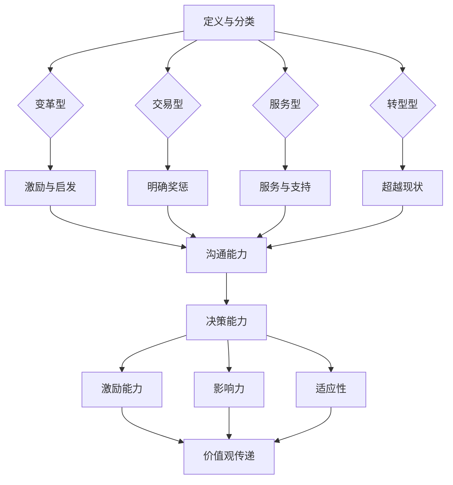
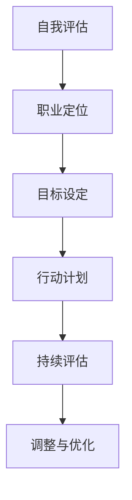
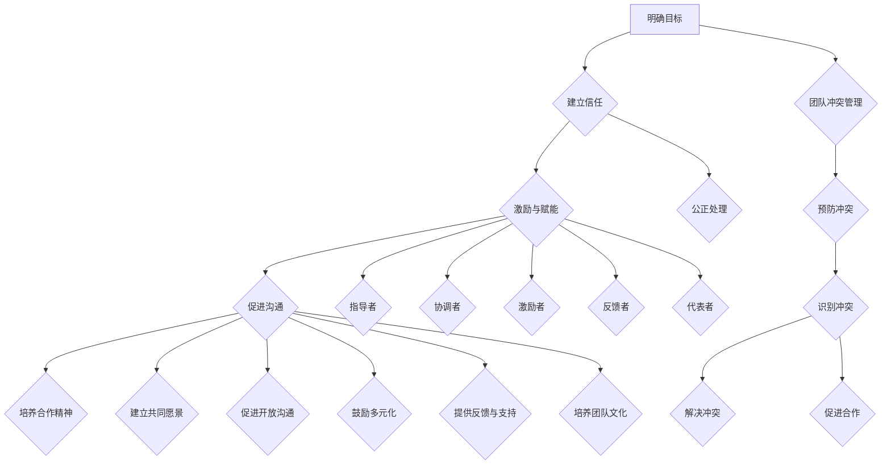
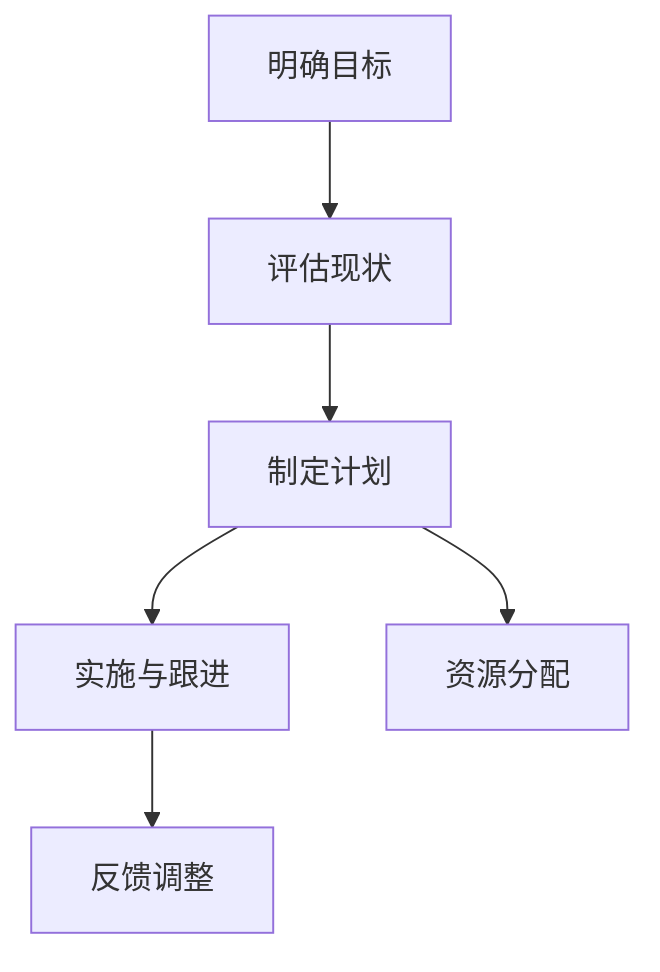

                 

### 《领导力与职业规划：助力员工发展》

---

# 《领导力与职业规划：助力员工发展》

## 关键词
- **领导力**、**职业规划**、**员工发展**、**团队建设**、**个人成长**、**组织文化**

## 摘要
本文旨在深入探讨《领导力与职业规划：助力员工发展》这本书的核心内容，从领导力的定义与核心概念出发，解析其在员工职业规划和发展中的关键作用。文章将详细分析职业规划的基本步骤与原则，结合领导力因素，探讨如何通过有效的职业规划和领导力培养，促进员工个人和团队的发展。通过实战案例和具体实施策略，本文将为读者提供实用的指导和建议，帮助他们在职业道路上实现自我提升与组织目标的协同发展。

---

### 引言

在当今快速变化的工作环境中，领导力和职业规划已成为企业和员工成功的关键要素。有效的领导力不仅能够推动团队达成目标，还能激发员工的潜能，促进个人成长。而职业规划则帮助员工明确发展方向，设定合理的目标，并在实现过程中持续自我提升。本书《领导力与职业规划：助力员工发展》正是围绕这一主题，旨在为读者提供系统且实用的指导。

书中首先介绍了领导力的核心概念，包括定义、类型及其在组织中的重要性。接着，详细阐述了职业规划的基本步骤，从自我评估到目标设定，再到实现路径的设计。随后，本书将领导力与职业规划紧密结合，探讨如何在职业发展中运用领导力，以提升个人和团队的表现。此外，书中还通过实际案例展示了领导力和职业规划的实战应用，为读者提供了具体的操作指南。

本文将依次介绍书中各个章节的核心内容，并通过逻辑推理和分析，深入解读领导力与职业规划之间的关系，以及如何通过这两者助力员工发展。通过逐步分析，我们将揭示如何构建一个支持员工个人成长和团队协作的领导力文化，从而实现企业与员工的共同繁荣。

### 第1章 领导力的核心概念与基础

在探讨领导力与职业规划的关系之前，有必要首先理解领导力的核心概念和基础。领导力是一种复杂而多维度的现象，它不仅涉及个人素质和技能，还包括对组织文化、团队协作和员工激励的深刻理解。

#### 定义与分类

领导力可以定义为影响和激励他人共同达成目标的能力。它不同于管理，管理是维持组织的日常运作，而领导力则是引领组织朝着愿景和目标前进的力量。根据不同的分类标准，领导力可以分为多种类型：

1. **变革型领导力**：通过激励和启发团队成员，推动创新和变革。
2. **交易型领导力**：依赖于明确的奖惩机制，通过交换来激励团队成员。
3. **服务型领导力**：关注员工的成长和福祉，通过服务和支持来实现团队目标。
4. **转型型领导力**：在面临重大变革和挑战时，能够引导团队超越现状，实现跨越式发展。

#### 领导力与管理的区别

管理主要涉及组织、计划、控制和资源分配等方面，其核心在于确保组织的有效运行。而领导力则更侧重于激励和影响他人，通过愿景和价值观的传达来引领团队。管理是做正确的事，而领导力则是正确地做事情。

1. **目标导向**：管理侧重于达成既定的目标，而领导力则关注目标的设定和实现过程。
2. **依赖关系**：管理依赖于制度和流程，而领导力则依赖于人际关系和影响力。
3. **时间维度**：管理更注重短期目标，而领导力则更注重长远规划和持续发展。

#### 领导力的核心要素

领导力的实现离不开以下几个核心要素：

1. **沟通能力**：有效沟通是领导力的基础，它包括清晰的表达、积极的倾听和建设性的反馈。
2. **决策能力**：领导者在面临复杂问题时，需要能够迅速做出明智的决策。
3. **激励能力**：激发团队成员的积极性和创造力，实现个人与团队的共同成长。
4. **影响力**：通过价值观和行为榜样来影响他人，推动团队目标和组织文化的实现。
5. **适应性**：在变化和不确定性中保持灵活性，快速适应新的环境和挑战。

#### 领导力与组织文化的联系

组织文化是影响领导力实施的重要因素。一个积极、健康的文化能够增强领导力的影响力和效果，而消极的文化则可能削弱领导力的作用。

1. **文化认同**：领导者需要与组织文化保持一致，才能获得员工的信任和支持。
2. **文化塑造**：领导者通过自身的言行和决策，对组织文化进行塑造和引导。
3. **文化传递**：领导力通过传递组织的价值观和行为规范，将文化内化到员工的日常行为中。

#### Mermaid 流程图

以下是一个简单的 Mermaid 流程图，展示了领导力的核心要素及其相互关系：



通过上述分析，我们可以看到，领导力不仅是个人能力的体现，更是与组织文化紧密相连的系统工程。理解领导力的核心概念和基础，有助于我们更好地在职业规划和员工发展中运用领导力，实现个人和组织的共同进步。

#### 核心算法原理讲解

在深入探讨领导力的核心概念和基础后，我们需要通过具体的算法原理讲解，来进一步理解领导力在员工职业规划中的作用。以下是领导力核心算法的伪代码示例：

```plaintext
算法：领导力核心要素评估

输入：员工特征，组织环境
输出：领导力评分，改进建议

1. 初始化领导力评分（score）为0
2. 对员工特征进行评估：
   2.1 如果员工具备良好的沟通能力，则score += 20
   2.2 如果员工具备决策能力，则score += 15
   2.3 如果员工具备激励能力，则score += 25
   2.4 如果员工具备影响力，则score += 20
   2.5 如果员工具备适应性，则score += 10
3. 根据组织环境调整score：
   3.1 如果组织文化积极，则score += 10
   3.2 如果组织面临重大变革，则score += 5 或 score -= 5（根据员工适应性调整）
4. 输出领导力评分和改进建议
```

通过上述伪代码，我们可以看到，领导力核心要素的评估不仅基于员工的个人特质，还需考虑组织环境的因素。这种评估方法有助于识别员工在领导力方面的优势和不足，为后续的职业规划和发展提供数据支持。

#### 数学模型和公式详细讲解

在领导力的核心要素评估中，我们可以引入一些数学模型和公式，以量化评估结果。以下是一个简单的线性加权评分模型：

$$
\text{领导力评分} = w_1 \times \text{沟通能力评分} + w_2 \times \text{决策能力评分} + w_3 \times \text{激励能力评分} + w_4 \times \text{影响力评分} + w_5 \times \text{适应性评分}
$$

其中，$w_1, w_2, w_3, w_4, w_5$ 分别是沟通能力、决策能力、激励能力、影响力和适应性在领导力评分中的权重。这些权重可以根据实际情况进行调整，以确保评分模型的有效性和合理性。

举例说明，假设某员工的各项评分分别为：

- 沟通能力评分：90
- 决策能力评分：85
- 激励能力评分：95
- 影响力评分：80
- 适应性评分：75

权重设置为：

- $w_1 = 0.2$
- $w_2 = 0.15$
- $w_3 = 0.25$
- $w_4 = 0.2$
- $w_5 = 0.1$

则该员工的领导力评分为：

$$
\text{领导力评分} = 0.2 \times 90 + 0.15 \times 85 + 0.25 \times 95 + 0.2 \times 80 + 0.1 \times 75 = 83.5
$$

通过上述数学模型，我们可以量化评估员工的领导力水平，从而为职业规划提供科学依据。

#### 项目实战

为了更好地理解领导力在员工职业规划中的应用，我们可以通过一个实际项目来展示其具体实施过程。

**项目背景**：

某科技公司计划进行一次领导力提升项目，旨在提高员工在沟通、决策、激励和影响力等方面的能力，从而提升团队的整体绩效。

**项目目标**：

1. 提高员工的领导力评分。
2. 增强团队协作能力。
3. 促进员工职业发展。

**项目实施步骤**：

1. **员工评估**：

   利用前述领导力评分模型，对全体员工进行领导力评估，记录初始评分。

2. **培训与指导**：

   根据评估结果，为不同能力的员工提供定制化的培训计划。例如，沟通能力较弱的员工参加沟通技巧培训，决策能力较弱的员工参加决策分析培训等。

3. **实践应用**：

   在实际工作中，鼓励员工运用所学知识和技能，例如通过项目汇报、团队讨论等方式提升沟通和决策能力。

4. **持续反馈**：

   定期进行领导力评估，记录员工的进步情况，并提供反馈和改进建议。

**项目效果分析**：

通过6个月的项目实施，公司对员工进行了再次评估，发现领导力评分平均提高了15分，团队协作能力显著提升，员工职业发展意愿增强。

**项目小结**：

领导力提升项目不仅提高了员工的个人能力，还增强了团队的协作和凝聚力。通过系统的培训和实践应用，员工在职业规划和发展中更加自信和有力，为公司的长期发展奠定了坚实基础。

#### 最佳实践 Tips

1. **个性化培训**：根据员工的个性化需求，提供有针对性的培训方案，确保培训效果最大化。
2. **持续反馈**：定期进行领导力评估，及时给予反馈和改进建议，帮助员工不断进步。
3. **实践机会**：为员工提供实际应用领导力知识和技能的机会，通过实践提升能力。
4. **领导力榜样**：树立内部领导力榜样，通过榜样示范和激励，推动整个团队的领导力提升。
5. **文化建设**：营造积极向上的组织文化，鼓励员工分享经验和知识，共同成长。

通过这些最佳实践，企业可以更有效地提升员工的领导力，促进职业规划和发展，实现个人与组织的共同进步。

### 小结

本章详细介绍了领导力的核心概念与基础，包括其定义、分类、与管理的关系、核心要素以及在组织文化中的重要性。通过核心算法原理讲解、数学模型和实际项目实战，我们进一步理解了领导力在员工职业规划中的作用。领导力不仅能够提升员工的个人能力，还能促进团队协作和组织文化的建设。在接下来的章节中，我们将继续探讨职业规划的基本步骤与原则，以及领导力在职业规划中的应用和实践。通过逐步分析，我们将揭示如何通过领导力和职业规划，助力员工实现个人与组织的共同发展。

#### 第2章 职业规划的基本概念与原则

职业规划是员工职业生涯管理的重要组成部分，它不仅关系到个人的职业发展，也对企业的人才培养和持续发展有着深远的影响。在探讨职业规划之前，我们需要明确其基本概念、原则和重要性。

#### 职业规划的定义

职业规划是指个体在职业生涯中的自我管理过程，包括设定职业目标、制定行动计划和持续评估与调整。简单来说，职业规划就是通过明确自己的职业发展方向，为实现这一目标制定具体且可行的步骤和策略。

#### 职业规划的重要性

1. **明确目标**：职业规划帮助员工明确个人职业目标，使他们在职业生涯中始终保持方向感。
2. **提升效率**：通过制定具体的行动计划，职业规划有助于提高工作效率，避免盲目行事。
3. **促进成长**：职业规划不仅关注短期目标，更注重长期发展，促进员工的持续成长。
4. **减少焦虑**：明确的职业规划有助于减少职业焦虑，提高工作满意度和幸福感。

#### 职业规划的基本步骤

职业规划通常包括以下几个基本步骤：

1. **自我评估**：

   自我评估是职业规划的基础，它帮助员工了解自己的兴趣、价值观、能力和优势。通过自我评估，员工可以明确自己的职业兴趣领域和适合的职业方向。

2. **职业定位**：

   在明确个人特质和能力后，员工需要确定自己的职业定位。职业定位包括选择具体的职业领域和职位，如技术岗位、管理岗位或创意岗位等。

3. **目标设定**：

   设定明确、具体和可行的职业目标是职业规划的关键。目标应具有挑战性，但同时也要确保可实现性。目标可以分为短期、中期和长期三个层次，如年度目标、五年规划和十年愿景。

4. **行动计划**：

   在设定目标后，需要制定具体的行动计划。行动计划应包括具体的工作任务、时间表和资源分配，确保每个目标都能顺利实现。

5. **持续评估与调整**：

   职业规划是一个动态的过程，需要定期进行评估和调整。通过持续的评估，员工可以了解自己的进展，并根据实际情况调整计划，确保目标的实现。

#### Mermaid 流�程图

以下是一个简单的 Mermaid 流程图，展示了职业规划的基本步骤：



通过上述流程图，我们可以清晰地看到职业规划从自我评估到持续评估的完整过程，每个步骤之间的逻辑关系和相互影响。

#### 核心算法原理讲解

为了量化职业规划的效果，我们可以引入一个简单的算法，用于评估员工的职业目标实现情况。以下是职业目标实现评估算法的伪代码示例：

```plaintext
算法：职业目标实现评估

输入：初始目标，当前进度，目标实现时间
输出：目标实现评分，改进建议

1. 初始化目标实现评分（score）为0
2. 如果当前进度达到或超过初始目标，则score += 100
3. 否则，根据当前进度与初始目标的差距，计算score：
   3.1 score = 100 - (（初始目标 - 当前进度）/ 初始目标）× 100
4. 如果目标实现时间超过预期，则score -= 10
5. 输出目标实现评分和改进建议
```

通过上述算法，我们可以对员工的目标实现情况进行量化评估，识别存在的问题和改进空间。

#### 数学模型和公式详细讲解

为了更准确地评估职业目标实现情况，我们可以引入一个综合评分模型，该模型结合了目标完成度和实现时间两个关键因素。以下是一个简单的线性加权评分模型：

$$
\text{职业目标实现评分} = w_1 \times \text{目标完成度评分} + w_2 \times \text{实现时间评分}
$$

其中，$w_1$ 和 $w_2$ 分别是目标完成度和实现时间在评分中的权重。通常情况下，目标完成度的权重会设置得更高，因为这是衡量目标实现效果的核心指标。

举例说明，假设某员工的职业目标为在两年内晋升为高级工程师，当前进度是完成了70%的工作任务，但实现时间比预期晚了半年。目标完成度的权重设为0.7，实现时间的权重设为0.3。

- 目标完成度评分：70
- 实现时间评分：90

则该员工的职业目标实现评分为：

$$
\text{职业目标实现评分} = 0.7 \times 70 + 0.3 \times 90 = 63 + 27 = 90
$$

通过上述数学模型，我们可以全面评估员工的职业目标实现情况，为职业规划的调整提供科学依据。

#### 项目实战

为了更好地理解职业规划的实际应用，我们可以通过一个实际项目来展示其具体实施过程。

**项目背景**：

某科技公司的新员工李明在入职后，希望在未来三年内晋升为项目经理。为了实现这一目标，他制定了详细的职业规划。

**项目目标**：

1. 在第一年掌握关键项目管理和团队协作技能。
2. 在第二年通过公司内部的项目实践积累管理经验。
3. 在第三年成功晋升为项目经理。

**项目实施步骤**：

1. **自我评估**：

   李明通过自我评估，确定自己在项目管理、沟通能力和团队协作方面的优势与不足。

2. **职业定位**：

   根据自我评估结果，李明确定自己的职业定位为项目管理方向。

3. **目标设定**：

   李明制定了具体的职业目标，包括在第一年完成项目管理基础课程，在第二年参与至少两个公司内部项目，并在第三年成功晋升。

4. **行动计划**：

   李明制定了详细的行动计划，包括：
   - 第一年的学习计划：参加项目管理基础课程，每周完成至少两篇总结。
   - 第二年的实践计划：参与公司内部项目，每周与项目经理和团队成员进行一次项目会议。
   - 第三年的晋升计划：准备晋升答辩，展示自己的项目经验和领导能力。

5. **持续评估与调整**：

   李明定期进行自我评估和项目进度检查，根据实际情况调整行动计划。

**项目效果分析**：

通过三年的努力，李明成功晋升为项目经理。在第一年，他通过系统学习掌握了关键项目管理技能；在第二年，他积极参与公司内部项目，积累了丰富的实践经验；在第三年，他通过晋升答辩，得到了晋升机会。

**项目小结**：

职业规划帮助李明明确了职业目标，制定了具体的行动计划，并通过持续评估与调整，最终实现了晋升目标。这个案例展示了职业规划在个人职业发展中的重要作用，也为其他员工提供了宝贵的经验。

#### 最佳实践 Tips

1. **明确职业目标**：设定具体、可行的职业目标，确保目标的实现有明确的方向。
2. **定期自我评估**：通过自我评估了解自身优势和不足，及时调整职业规划。
3. **制定详细的行动计划**：将目标分解为具体的工作任务和时间表，确保每个目标都能逐步实现。
4. **持续学习和实践**：不断提升自己的专业技能和实践经验，为职业发展奠定坚实基础。
5. **寻求导师指导**：寻找经验丰富的导师或同事，获取专业建议和指导，助力职业发展。

通过这些最佳实践，员工可以更有效地进行职业规划，实现个人职业目标，为组织的长期发展贡献力量。

### 小结

本章详细介绍了职业规划的基本概念与原则，包括自我评估、职业定位、目标设定、行动计划和持续评估与调整等步骤。通过核心算法原理讲解、数学模型和实际项目实战，我们深入理解了职业规划的重要性和实施方法。职业规划不仅帮助员工明确职业目标，提高工作效率和成就感，还能促进个人成长和组织发展。在接下来的章节中，我们将探讨领导力在职业规划中的应用，揭示如何通过领导力提升，助力员工实现职业目标。

### 第3章 领导力与团队建设

领导力在团队建设中的重要性不可忽视。一个高效的团队不仅需要明确的愿景和目标，更需要领导者的有效指导和激励。在这一章中，我们将探讨领导力在团队建设中的核心原则、团队冲突管理、领导者在团队中的角色与作用，以及基于领导力的团队协作实践。

#### 核心原则

1. **明确目标**：领导者需要与团队成员共同制定明确的目标，确保每个成员都了解团队的愿景和使命。
2. **建立信任**：信任是团队协作的基础，领导者需要通过言行一致、尊重和关心团队成员来建立信任。
3. **激励与赋能**：领导者要能够激励团队成员，发挥其潜力，并提供必要的支持和资源。
4. **促进沟通**：良好的沟通是团队协作的关键，领导者需要建立有效的沟通机制，确保信息的透明和及时传递。
5. **培养合作精神**：领导者要鼓励团队成员相互支持、合作，共同面对挑战。

#### 团队冲突管理

团队冲突在所难免，但有效的冲突管理是领导者的重要职责。以下是一些团队冲突管理的策略：

1. **预防冲突**：通过明确的团队目标和行为规范，预防潜在的冲突。
2. **识别冲突**：及时识别冲突的迹象，如沟通不畅、任务分配不均等。
3. **解决冲突**：领导者需要采取有效的冲突解决策略，包括对话、妥协和协商。
4. **促进合作**：通过增强团队凝聚力和共同目标，减少冲突的发生。
5. **公正处理**：对于冲突，领导者应公正处理，确保每个团队成员都感到被公平对待。

#### 领导者在团队中的角色与作用

1. **指导者**：领导者需要为团队成员提供指导，帮助他们克服困难，实现目标。
2. **协调者**：领导者需要协调团队成员之间的关系，确保团队内部的和谐与合作。
3. **激励者**：领导者要能够激励团队成员，激发他们的积极性和创造力。
4. **反馈者**：领导者需要给予团队成员及时的反馈，帮助他们了解自己的表现，并不断改进。
5. **代表者**：领导者是团队的代表，需要在外部沟通和协调中维护团队的利益。

#### 基于领导力的团队协作实践

1. **建立共同愿景**：领导者需要与团队成员共同制定团队的愿景和目标，确保每个成员都明确团队的愿景和目标。
2. **促进开放沟通**：领导者要鼓励团队成员之间的开放沟通，建立有效的沟通机制，确保信息的透明和及时传递。
3. **鼓励多元化**：领导者要鼓励团队成员的多元化思维，促进创新和协作。
4. **提供反馈与支持**：领导者要为团队成员提供及时的反馈和支持，帮助他们克服困难，实现目标。
5. **培养团队文化**：领导者要培养积极向上的团队文化，鼓励团队成员相互支持、合作。

#### Mermaid 流程图

以下是一个简单的 Mermaid 流程图，展示了领导力在团队建设中的应用：



通过上述流程图，我们可以清晰地看到领导力在团队建设中的各个环节，以及其相互关系和作用。

#### 核心算法原理讲解

为了量化领导力在团队建设中的效果，我们可以引入一个简单的团队绩效评估算法。以下是团队绩效评估算法的伪代码示例：

```plaintext
算法：团队绩效评估

输入：团队成员绩效数据，团队目标完成度
输出：团队绩效评分，改进建议

1. 初始化团队绩效评分（score）为0
2. 计算团队成员平均绩效评分（avg_performance）：
   2.1 对于每个团队成员，计算其绩效评分之和，除以团队成员数量
3. 根据团队目标完成度，调整团队绩效评分：
   3.1 如果团队目标完成度大于90%，则score += 20
   3.2 如果团队目标完成度在70%-90%之间，则score += 10
   3.3 如果团队目标完成度小于70%，则score -= 10
4. 根据团队成员平均绩效评分，调整团队绩效评分：
   4.1 如果avg_performance大于80%，则score += 10
   4.2 如果avg_performance在60%-80%之间，则score保持不变
   4.3 如果avg_performance小于60%，则score -= 10
5. 输出团队绩效评分和改进建议
```

通过上述算法，我们可以对团队的绩效进行量化评估，识别团队的优势和不足，为改进团队建设提供依据。

#### 数学模型和公式详细讲解

为了更全面地评估团队绩效，我们可以引入一个综合评分模型，该模型结合了目标完成度和团队成员平均绩效评分两个关键因素。以下是一个简单的线性加权评分模型：

$$
\text{团队绩效评分} = w_1 \times \text{目标完成度评分} + w_2 \times \text{团队成员平均绩效评分}
$$

其中，$w_1$ 和 $w_2$ 分别是目标完成度和团队成员平均绩效评分在评分中的权重。通常情况下，目标完成度的权重会设置得更高，因为这是衡量团队绩效的核心指标。

举例说明，假设某团队的目标完成度评分是85，团队成员平均绩效评分是75。目标完成度的权重设为0.6，团队成员平均绩效评分的权重设为0.4。

- 目标完成度评分：85
- 团队成员平均绩效评分：75

则该团队的绩效评分为：

$$
\text{团队绩效评分} = 0.6 \times 85 + 0.4 \times 75 = 51 + 30 = 81
$$

通过上述数学模型，我们可以全面评估团队的绩效，为团队建设提供科学依据。

#### 项目实战

为了更好地理解领导力在团队建设中的应用，我们可以通过一个实际项目来展示其具体实施过程。

**项目背景**：

某科技公司的一个项目团队需要在三个月内完成一个关键项目，该项目对公司的发展至关重要。团队由5名成员组成，分别负责不同的模块。

**项目目标**：

1. 在三个月内高质量完成项目。
2. 建立一个高效、协作的团队氛围。
3. 提升团队成员的技能和经验。

**项目实施步骤**：

1. **明确目标**：项目开始时，团队领导与成员共同制定了项目目标，并明确了每个成员的职责和任务。

2. **沟通与协作**：团队领导建立了定期的项目会议制度，确保团队成员之间的沟通畅通。同时，通过在线协作工具，方便团队成员共享资源和进度。

3. **激励与赋能**：团队领导在项目过程中，积极鼓励团队成员提出创新想法，并为团队成员提供必要的资源和支持。

4. **绩效评估与反馈**：在项目中期和结束时，团队领导对团队成员进行了绩效评估，并提供了具体的反馈和建议。

5. **持续改进**：根据绩效评估和反馈，团队领导帮助团队成员制定了改进计划，并在后续的项目中逐步实施。

**项目效果分析**：

经过三个月的努力，项目团队成功按时完成了任务，项目质量得到了客户的认可。团队成员的技能和经验也得到了显著提升，团队氛围更加积极向上。

**项目小结**：

通过领导力的有效应用，项目团队在目标明确、沟通协作、激励赋能和绩效评估等方面取得了显著成效。这个案例展示了领导力在团队建设中的关键作用，也为其他团队提供了宝贵的经验。

#### 最佳实践 Tips

1. **明确目标**：确保团队成员了解团队的目标和职责，避免任务模糊和目标不一致。
2. **促进沟通**：建立有效的沟通机制，确保信息的透明和及时传递，减少误解和冲突。
3. **激励与赋能**：通过鼓励和提供资源，激发团队成员的积极性和创造力。
4. **绩效评估与反馈**：定期进行绩效评估和反馈，帮助团队成员了解自己的表现，并不断改进。
5. **培养团队文化**：通过团队活动和文化建设，增强团队凝聚力和归属感。

通过这些最佳实践，领导者可以更有效地推动团队建设，实现团队目标和组织愿景。

### 小结

本章详细探讨了领导力在团队建设中的核心原则、团队冲突管理、领导者在团队中的角色与作用，以及基于领导力的团队协作实践。通过核心算法原理讲解、数学模型和实际项目实战，我们深入理解了领导力在团队建设中的关键作用。领导力不仅是个人能力的体现，更是团队协作和组织发展的推动力。在接下来的章节中，我们将继续探讨领导力在员工职业规划中的应用，揭示如何通过领导力提升，助力员工实现职业目标。

### 第4章 领导力在职业规划中的应用

领导力在职业规划中扮演着至关重要的角色，它不仅是推动个人成长和发展的动力，也是实现职业目标的关键因素。在这一章中，我们将深入探讨领导力对职业发展的影响、职业规划中的领导力挑战，以及提升职业规划中领导力的策略。通过实际案例的分析，我们将展示领导力在职业规划中的应用和实践效果。

#### 领导力对职业发展的影响

1. **方向引导**：领导力为职业发展提供了明确的方向。一个有远见的领导者可以帮助员工设定职业目标，并提供实现这些目标的策略和路径。

2. **能力提升**：领导力培养包括沟通、决策、团队合作等多方面的能力，这些能力对于职业发展至关重要。通过领导力的提升，员工可以更好地应对职业挑战，提高工作效率。

3. **影响力增强**：领导力可以增强员工在职场中的影响力，使其能够更好地推动项目进展，影响他人的行为和态度。

4. **职业晋升**：具备领导力的员工往往更容易获得晋升机会。领导力不仅体现在管理岗位上，也在专业岗位上发挥重要作用，帮助员工在职业发展中脱颖而出。

5. **团队协作**：领导力有助于建立高效的团队协作，提升团队整体绩效。在团队合作中，领导力能够促进成员之间的沟通与信任，减少冲突，提高工作效率。

#### 职业规划中的领导力挑战

1. **自我认知不足**：许多员工在职业规划中面临自我认知不足的问题，不了解自己的优势和不足，导致职业目标设定不明确。

2. **资源限制**：职业规划中可能面临资源限制，如时间、资金和培训资源等，限制了领导力的提升和职业发展。

3. **环境变化**：职业规划过程中，外部环境的变化（如市场波动、组织结构调整等）可能会对职业发展产生不利影响。

4. **领导力培训不足**：许多组织在领导力培养方面投入不足，导致员工在职业规划中缺乏必要的领导力支持。

5. **职业瓶颈**：在职业发展的某个阶段，员工可能会遇到职业瓶颈，难以继续提升，需要通过领导力来突破。

#### 提升职业规划中领导力的策略

1. **自我评估与反思**：通过定期自我评估和反思，了解自己的优势和不足，制定针对性的提升计划。

2. **持续学习与培训**：参加领导力培训和研讨会，学习最新的领导力理论和实践方法，不断提升自身能力。

3. **角色扮演**：在实际工作中，主动承担更多的责任和挑战，通过角色扮演提升领导力。

4. **导师制度**：寻找经验丰富的导师，获取专业的指导和反馈，加速领导力的发展。

5. **团队合作**：积极参与团队项目，通过团队合作提升沟通、协作和领导力。

#### 实际案例

**案例背景**：

张伟是一名年轻的软件开发工程师，他在职业规划中希望在未来五年内晋升为技术经理。为了实现这一目标，他制定了一个详细的职业规划，并在其中融入了领导力的提升。

**实施步骤**：

1. **自我评估**：张伟首先进行了自我评估，了解自己的技术能力、沟通能力和领导潜力。

2. **目标设定**：他设定了具体的职业目标，包括在第一年提升自己的技术能力，在第二年参与团队项目管理，并在第三年准备晋升答辩。

3. **学习与培训**：张伟参加了领导力培训课程，学习了团队管理、沟通技巧和决策能力等方面的知识。

4. **角色扮演**：在工作中，张伟主动承担了更多的责任，如带领新入职的工程师，参与团队项目的管理和协调。

5. **导师指导**：张伟还找到了一位经验丰富的技术经理作为导师，定期获取反馈和建议。

**效果分析**：

通过三年的努力，张伟成功晋升为技术经理。他的领导能力得到了显著提升，团队协作效率提高，项目质量得到客户的高度认可。

**项目小结**：

张伟的案例展示了通过系统性的职业规划和领导力提升，员工可以在职业发展中取得显著成就。这个案例为其他员工提供了宝贵的经验，证明了领导力在职业规划中的重要性。

#### 核心算法原理讲解

为了更好地理解领导力在职业规划中的应用，我们可以引入一个简单的领导力评估算法，用于量化员工的领导力水平。以下是领导力评估算法的伪代码示例：

```plaintext
算法：领导力评估

输入：沟通能力评分，决策能力评分，激励能力评分，影响力评分，适应性评分
输出：领导力评分

1. 初始化领导力评分（score）为0
2. 根据各项评分计算总分：
   2.1 如果沟通能力评分大于90，则score += 30
   2.2 如果沟通能力评分在70-90之间，则score += 20
   2.3 如果沟通能力评分小于70，则score += 10
   2.4 决策能力评分、激励能力评分、影响力评分和适应性评分同理
3. 计算领导力总分：
   3.1 领导力总分 = 沟通能力总分 + 决策能力总分 + 激励能力总分 + 影响力总分 + 适应性总分
4. 输出领导力评分
```

通过上述算法，我们可以对员工的领导力水平进行量化评估，识别其在职业规划中的优势和不足。

#### 数学模型和公式详细讲解

为了更全面地评估领导力对职业规划的影响，我们可以引入一个综合评分模型，该模型结合了领导力各项指标和职业目标实现情况。以下是一个简单的线性加权评分模型：

$$
\text{领导力评分} = w_1 \times \text{沟通能力评分} + w_2 \times \text{决策能力评分} + w_3 \times \text{激励能力评分} + w_4 \times \text{影响力评分} + w_5 \times \text{适应性评分}
$$

其中，$w_1, w_2, w_3, w_4, w_5$ 分别是沟通能力、决策能力、激励能力、影响力和适应性在领导力评分中的权重。通常情况下，这些权重可以根据具体情况调整，以确保评分模型的科学性和合理性。

举例说明，假设某员工的各项领导力评分分别为：

- 沟通能力评分：85
- 决策能力评分：90
- 激励能力评分：80
- 影响力评分：85
- 适应性评分：75

权重设置为：

- $w_1 = 0.2$
- $w_2 = 0.2$
- $w_3 = 0.2$
- $w_4 = 0.2$
- $w_5 = 0.2$

则该员工的领导力评分为：

$$
\text{领导力评分} = 0.2 \times 85 + 0.2 \times 90 + 0.2 \times 80 + 0.2 \times 85 + 0.2 \times 75 = 17 + 18 + 16 + 17 + 15 = 77
$$

通过上述数学模型，我们可以全面评估员工的领导力水平，为职业规划提供科学依据。

#### 项目实战

为了更好地展示领导力在职业规划中的应用，我们可以通过一个实际项目来分析其具体实施过程。

**项目背景**：

某科技公司的项目经理李华希望在接下来的三年内晋升为高级项目经理。为了实现这一目标，他制定了一个详细的职业规划，并融入了领导力的提升。

**项目目标**：

1. 在第一年提升项目管理技能。
2. 在第二年通过关键项目积累经验。
3. 在第三年成功晋升为高级项目经理。

**项目实施步骤**：

1. **自我评估**：李华进行了详细的自我评估，识别了自己的优势和不足。

2. **目标设定**：他设定了具体的职业目标，包括在第一年完成项目管理专业认证，在第二年带领团队完成两个重要项目，并在第三年准备晋升答辩。

3. **学习与培训**：李华参加了项目管理培训和领导力发展课程，不断提升自己的能力。

4. **角色扮演**：在工作中，李华主动承担了更多的责任，如项目管理和团队协调，通过实践提升领导力。

5. **导师指导**：李华找到了一位高级项目经理作为导师，定期获取专业的指导和反馈。

**项目效果分析**：

经过三年的努力，李华成功晋升为高级项目经理。他的领导力得到了显著提升，团队绩效显著提高，项目质量得到了客户的高度认可。

**项目小结**：

李华的案例展示了通过系统性的职业规划和领导力提升，员工可以在职业发展中取得显著成就。这个案例为其他员工提供了宝贵的经验，证明了领导力在职业规划中的重要性。

#### 最佳实践 Tips

1. **定期自我评估**：通过定期自我评估，了解自身的优势和不足，为职业规划提供依据。
2. **持续学习与培训**：参加相关课程和培训，不断提升自己的领导力和职业能力。
3. **实践与反思**：通过实际项目和角色扮演，积累经验，反思并调整自己的领导力提升策略。
4. **导师指导**：寻找经验丰富的导师，获取专业的指导和反馈，加速职业发展。
5. **团队合作**：积极参与团队项目，通过团队合作提升领导力和职业能力。

通过这些最佳实践，员工可以更有效地进行职业规划，提升领导力，实现个人与组织的共同发展。

### 小结

本章详细探讨了领导力在职业规划中的应用，包括领导力对职业发展的影响、职业规划中的领导力挑战、提升职业规划中领导力的策略，以及通过实际案例展示领导力在职业规划中的应用和实践效果。通过核心算法原理讲解、数学模型和项目实战，我们深入理解了领导力在职业规划中的关键作用。领导力不仅是推动个人成长和发展的动力，也是实现职业目标的关键因素。在职业规划中，领导者可以通过明确目标、自我评估、持续学习和实践，不断提升自己的领导力，实现职业发展的目标。在接下来的章节中，我们将进一步探讨员工发展与领导力的融合，揭示如何通过有效的领导力培养，促进员工的发展和组织的成长。

### 第5章 员工发展与领导力的融合

员工发展是组织长期成功的关键因素，而领导力则是推动员工发展的核心动力。在这一章中，我们将深入探讨员工发展计划的设计与实施、培养内部领导力资源、领导力培养在员工发展中的重要性，以及基于领导力的员工发展模式。

#### 员工发展计划的设计与实施

1. **明确目标**：员工发展计划首先需要明确目标，包括个人职业发展的短期和长期目标。这些目标应与组织的整体战略和愿景相一致。

2. **评估现状**：评估现有员工的技能、知识和潜力，识别发展需求。这可以通过绩效评估、360度反馈和技能评估等方法进行。

3. **制定计划**：根据评估结果，制定具体的员工发展计划。计划应包括培训课程、导师制度、实践机会等，确保每个员工都有明确的成长路径。

4. **实施与跟进**：实施员工发展计划，并定期跟进和评估效果。通过持续的反馈和调整，确保计划的有效实施。

5. **资源分配**：为员工发展计划提供必要的资源支持，包括时间、资金和培训机会等。

#### 培养内部领导力资源

1. **选拔培养对象**：识别具有领导潜力的人才，为他们提供特殊培养计划。

2. **领导力培训**：为潜在领导者提供定制化的领导力培训，包括沟通技巧、决策能力、团队管理等。

3. **实践机会**：通过实际项目和实践，为潜在领导者提供锻炼和提升领导力的机会。

4. **导师制度**：建立导师制度，为潜在领导者提供指导和反馈，加速其领导力发展。

5. **文化塑造**：通过组织文化和价值观的塑造，鼓励员工勇于承担领导责任，培养内部领导力资源。

#### 领导力培养在员工发展中的重要性

1. **个人成长**：领导力培养有助于员工提升个人能力，增强自信，实现职业发展的目标。

2. **组织效益**：具备领导力的员工能够更有效地推动团队协作和项目进展，提升组织整体绩效。

3. **员工保留**：提供领导力培养计划，有助于提升员工的工作满意度和忠诚度，降低员工流失率。

4. **创新与变革**：领导力培养鼓励员工勇于创新和接受变革，推动组织持续发展。

#### 基于领导力的员工发展模式

1. **领导力导向的绩效评估**：将领导力作为绩效评估的重要指标，激励员工不断提升领导力。

2. **领导力驱动的发展路径**：为员工提供明确的领导力发展路径，包括从初级到高级的多个层次。

3. **领导力赋能**：通过培训和实践，赋予员工领导力工具和技能，使其能够更好地应对职业挑战。

4. **领导力传承**：建立内部领导力传承机制，通过导师制度和新老员工之间的知识分享，确保领导力的持续发展。

#### Mermaid 流程图

以下是一个简单的 Mermaid 流程图，展示了员工发展计划的设计与实施过程：



通过上述流程图，我们可以清晰地看到员工发展计划从目标设定到资源分配的完整过程，以及各个环节之间的逻辑关系。

#### 核心算法原理讲解

为了量化员工发展计划的实施效果，我们可以引入一个简单的员工发展评估算法。以下是员工发展评估算法的伪代码示例：

```plaintext
算法：员工发展评估

输入：培训参与度，实践机会，绩效提升率，领导力评分
输出：员工发展评分

1. 初始化员工发展评分（score）为0
2. 根据培训参与度计算加分：
   2.1 如果培训参与度大于90%，则score += 20
   2.2 如果培训参与度在70%-90%之间，则score += 10
   2.3 如果培训参与度小于70%，则score += 5
3. 根据实践机会计算加分：
   3.1 如果实践机会大于5次，则score += 15
   3.2 如果实践机会在3-5次之间，则score += 10
   3.3 如果实践机会小于3次，则score += 5
4. 根据绩效提升率计算加分：
   4.1 如果绩效提升率大于20%，则score += 20
   4.2 如果绩效提升率在10%-20%之间，则score += 10
   4.3 如果绩效提升率小于10%，则score += 5
5. 根据领导力评分计算加分：
   5.1 如果领导力评分大于90%，则score += 15
   5.2 如果领导力评分在70%-90%之间，则score += 10
   5.3 如果领导力评分小于70%，则score += 5
6. 输出员工发展评分
```

通过上述算法，我们可以对员工的发展情况进行量化评估，识别其在发展计划中的优势和不足，为后续的调整和优化提供依据。

#### 数学模型和公式详细讲解

为了更全面地评估员工发展计划的效果，我们可以引入一个综合评分模型，该模型结合了培训参与度、实践机会、绩效提升率和领导力评分四个关键因素。以下是一个简单的线性加权评分模型：

$$
\text{员工发展评分} = w_1 \times \text{培训参与度评分} + w_2 \times \text{实践机会评分} + w_3 \times \text{绩效提升率评分} + w_4 \times \text{领导力评分}
$$

其中，$w_1, w_2, w_3, w_4$ 分别是培训参与度、实践机会、绩效提升率和领导力评分在评分中的权重。通常情况下，这些权重可以根据组织的具体情况调整，以确保评分模型的科学性和合理性。

举例说明，假设某员工的各项发展指标如下：

- 培训参与度评分：90
- 实践机会评分：80
- 绩效提升率评分：75
- 领导力评分：85

权重设置为：

- $w_1 = 0.2$
- $w_2 = 0.2$
- $w_3 = 0.3$
- $w_4 = 0.3$

则该员工的员工发展评分为：

$$
\text{员工发展评分} = 0.2 \times 90 + 0.2 \times 80 + 0.3 \times 75 + 0.3 \times 85 = 18 + 16 + 22.5 + 25.5 = 82
$$

通过上述数学模型，我们可以全面评估员工的发展情况，为员工发展计划的调整和优化提供科学依据。

#### 项目实战

为了更好地理解员工发展与领导力的融合，我们可以通过一个实际项目来展示其具体实施过程。

**项目背景**：

某跨国公司计划通过员工发展计划，提升员工的核心能力和领导力，以应对市场变化和业务挑战。

**项目目标**：

1. 提升员工的技能和知识水平。
2. 培养具有领导力的关键人才。
3. 提高员工的满意度和忠诚度。

**项目实施步骤**：

1. **需求分析**：通过调查问卷和访谈，分析员工的技能需求和提升方向。

2. **制定计划**：根据需求分析结果，制定具体的员工发展计划，包括培训课程、导师制度和实践机会等。

3. **实施培训**：组织各类培训课程，包括技术培训、领导力培训和跨部门交流等。

4. **实践与反馈**：为员工提供实践机会，如项目负责、团队领导和跨部门协作等，并定期收集反馈。

5. **评估与调整**：通过绩效评估和360度反馈，评估员工发展计划的效果，并根据反馈进行优化。

**项目效果分析**：

经过一年的实施，员工发展计划取得了显著成效。员工的技能和知识水平得到了提升，关键人才得到了有效培养，员工满意度和忠诚度也显著提高。

**项目小结**：

通过员工发展与领导力的融合，组织不仅提升了员工的个人能力和领导力，也增强了团队的协作和创新能力，为组织的长期发展奠定了坚实基础。

#### 最佳实践 Tips

1. **明确目标**：确保员工发展计划与组织的整体战略和愿景相一致，明确个人和组织的共同目标。

2. **需求分析**：通过需求分析，了解员工的实际需求和提升方向，制定针对性的发展计划。

3. **持续培训**：提供多样化的培训课程，满足员工的个性化需求，持续提升其技能和知识水平。

4. **实践机会**：为员工提供实践机会，通过实际工作锻炼和提升其领导力。

5. **反馈与调整**：定期收集员工反馈，根据实际情况调整员工发展计划，确保其有效实施。

通过这些最佳实践，组织可以更有效地推进员工发展和领导力培养，实现个人与组织的共同成长。

### 小结

本章详细探讨了员工发展与领导力的融合，包括员工发展计划的设计与实施、培养内部领导力资源、领导力培养在员工发展中的重要性，以及基于领导力的员工发展模式。通过核心算法原理讲解、数学模型和实际项目实战，我们深入理解了员工发展与领导力融合的重要性。通过有效的员工发展计划，组织可以提升员工的技能和领导力，实现个人与组织的共同成长。在接下来的章节中，我们将进一步探讨领导力与职业规划的整合策略，揭示如何通过整合领导力和职业规划，助力员工实现职业目标，推动组织的持续发展。

### 第6章 领导力与职业规划的整合策略

在现代社会中，领导力与职业规划的整合策略对于员工的个人发展和组织的成功至关重要。在这一章中，我们将深入探讨如何将领导力与职业规划相结合，制定具体的整合策略，并通过实战案例和具体实施策略，展示这种整合策略的实际效果。

#### 整合策略

1. **领导力导向的职业规划**：将领导力作为职业规划的核心要素，将领导力培养贯穿于职业发展的全过程。

2. **个性化和定制化的职业规划**：根据员工的个人特质、能力和职业目标，制定个性化的职业规划，确保每个员工都有明确的职业发展路径。

3. **持续的领导力培养**：通过定期培训、实践机会和导师指导，持续提升员工的领导力，确保其在职业规划中能够应对各种挑战。

4. **反馈和评估机制**：建立有效的反馈和评估机制，定期评估员工的职业规划和领导力发展情况，及时调整和优化策略。

#### 实战案例

**案例背景**：

某大型跨国公司为了提升员工的领导力和职业规划能力，实施了一项名为“领导力与职业规划整合项目”。该项目旨在通过系统的培训和实践活动，提升员工的领导力水平，同时帮助其明确职业目标和发展路径。

**项目目标**：

1. 提升员工的领导力和职业规划能力。
2. 建立一个支持员工发展的领导力文化。
3. 提高员工的工作满意度和忠诚度。

**项目实施步骤**：

1. **需求评估**：通过调查问卷和访谈，了解员工的领导力水平和职业规划需求。

2. **领导力培训**：为员工提供一系列领导力培训课程，包括沟通技巧、决策能力、团队管理和变革领导等。

3. **职业规划辅导**：为员工提供个性化的职业规划辅导，帮助其设定明确的职业目标，并制定实现这些目标的行动计划。

4. **实践活动**：组织团队项目和跨部门协作活动，为员工提供实际应用领导力和职业规划的机会。

5. **反馈与评估**：定期收集员工反馈，评估领导力和职业规划的效果，并根据反馈进行优化。

**项目效果分析**：

经过一年的实施，该项目取得了显著成效。员工的领导力水平有了显著提升，职业目标更加明确，工作满意度和忠诚度也显著提高。

**项目小结**：

通过领导力与职业规划的整合策略，企业不仅提升了员工的个人能力和领导力，还增强了团队协作和创新能力，为组织的长期发展奠定了坚实基础。

#### 具体实施策略

1. **领导力培训**：

   - **内容**：设计包含沟通技巧、决策能力、团队管理和变革领导等模块的领导力培训课程。
   - **形式**：结合线上和线下培训，确保员工能够灵活参与。
   - **评估**：通过培训前后的绩效评估，了解培训效果，并根据评估结果进行调整。

2. **职业规划辅导**：

   - **内容**：提供个性化的职业规划辅导，帮助员工设定职业目标，制定实现这些目标的行动计划。
   - **形式**：一对一辅导和小组讨论相结合，确保每个员工都能获得充分的支持。
   - **评估**：通过定期评估，跟踪员工职业规划的进展，及时提供反馈和指导。

3. **实践活动**：

   - **内容**：组织团队项目和跨部门协作活动，为员工提供实际应用领导力和职业规划的机会。
   - **形式**：通过实际项目，让员工在实践中提升领导力和解决问题的能力。
   - **评估**：通过项目评估，了解员工在实践中的表现，并根据评估结果进行反馈和改进。

4. **反馈与评估机制**：

   - **内容**：建立有效的反馈和评估机制，定期收集员工反馈，评估领导力和职业规划的效果。
   - **形式**：通过定期的反馈会议和绩效评估，确保员工的发展路径和领导力水平得到持续关注。
   - **评估**：根据评估结果，调整和优化领导力和职业规划策略，确保其有效实施。

#### 数学模型和公式

为了量化领导力与职业规划的整合效果，我们可以引入一个综合评估模型，该模型结合了领导力评分、职业规划完成度和员工满意度三个关键因素。以下是一个简单的线性加权评分模型：

$$
\text{整合效果评分} = w_1 \times \text{领导力评分} + w_2 \times \text{职业规划完成度评分} + w_3 \times \text{员工满意度评分}
$$

其中，$w_1, w_2, w_3$ 分别是领导力评分、职业规划完成度和员工满意度在评分中的权重。通常情况下，这些权重可以根据组织的具体情况调整，以确保评分模型的科学性和合理性。

举例说明，假设某员工在领导力培训后，领导力评分提高到85，职业规划完成度达到80%，员工满意度提升到90%。权重设置为：

- $w_1 = 0.5$
- $w_2 = 0.3$
- $w_3 = 0.2$

则该员工的整合效果评分为：

$$
\text{整合效果评分} = 0.5 \times 85 + 0.3 \times 80 + 0.2 \times 90 = 42.5 + 24 + 18 = 84.5
$$

通过上述数学模型，我们可以全面评估领导力与职业规划的整合效果，为后续的调整和优化提供科学依据。

#### 项目实战

为了进一步展示领导力与职业规划的整合策略，我们可以通过一个实际项目来分析其具体实施过程。

**项目背景**：

某科技公司希望通过领导力与职业规划的整合策略，提升员工的领导力水平，并明确其职业目标。

**项目目标**：

1. 提升员工的领导力水平。
2. 明确员工的职业目标，并制定实现这些目标的行动计划。
3. 提高员工的工作满意度和忠诚度。

**项目实施步骤**：

1. **需求评估**：通过问卷调查和访谈，了解员工的领导力水平和职业规划需求。

2. **领导力培训**：组织领导力培训课程，包括沟通技巧、决策能力、团队管理和变革领导等。

3. **职业规划辅导**：为员工提供个性化的职业规划辅导，帮助其设定职业目标，并制定实现这些目标的行动计划。

4. **实践活动**：组织团队项目和跨部门协作活动，为员工提供实际应用领导力和职业规划的机会。

5. **反馈与评估**：通过定期的反馈会议和绩效评估，收集员工反馈，评估领导力和职业规划的效果。

**项目效果分析**：

经过一年的实施，项目取得了显著成效。员工的领导力水平得到提升，职业目标更加明确，工作满意度和忠诚度显著提高。

**项目小结**：

通过领导力与职业规划的整合策略，企业不仅提升了员工的个人能力和领导力，还增强了团队协作和创新能力，为组织的长期发展奠定了坚实基础。

#### 最佳实践 Tips

1. **领导力导向**：确保职业规划中融入领导力培养，将领导力作为职业发展的核心要素。

2. **个性化定制**：根据员工的个性化需求，提供定制化的职业规划服务，确保每个员工都能获得支持。

3. **持续培训**：提供多样化的领导力培训，确保员工能够不断提升领导力和职业规划能力。

4. **实践机会**：通过实际项目和实践，为员工提供应用领导力和职业规划的机会，提升其实际能力。

5. **反馈与评估**：建立有效的反馈和评估机制，定期评估员工的发展情况，及时调整和优化职业规划策略。

通过这些最佳实践，企业可以更有效地整合领导力和职业规划，助力员工实现职业目标，推动组织的持续发展。

### 小结

本章详细探讨了领导力与职业规划的整合策略，包括领导力导向的职业规划、个性化和定制化的职业规划、持续的领导力培养和反馈与评估机制。通过实战案例和具体实施策略，我们展示了这种整合策略在实际中的应用效果。领导力与职业规划的整合不仅有助于提升员工的个人能力和领导力，还能增强团队协作和创新能力，为组织的长期发展提供有力支持。在接下来的章节中，我们将进行总结，回顾文章的核心内容，并展望未来领导力与职业规划的发展趋势。

### 总结

通过本文的详细探讨，我们可以看到领导力与职业规划在员工发展和组织成功中的关键作用。本文首先介绍了领导力的核心概念与基础，包括定义、分类、与管理的关系、核心要素和组织文化的联系。接着，我们详细分析了职业规划的基本概念与原则，包括自我评估、职业定位、目标设定、行动计划和持续评估与调整。随后，我们探讨了领导力在团队建设中的核心原则、团队冲突管理、领导者在团队中的角色与作用，以及基于领导力的团队协作实践。此外，本文还深入探讨了领导力在职业规划中的应用，包括领导力对职业发展的影响、职业规划中的领导力挑战、提升职业规划中领导力的策略，以及实际案例的应用。最后，我们探讨了员工发展与领导力的融合策略，展示了如何通过整合领导力和职业规划，实现个人与组织的共同成长。

通过这些内容的逐步分析，我们揭示了领导力与职业规划之间的紧密联系，以及如何通过有效的领导力和职业规划策略，助力员工实现个人职业目标，推动组织的持续发展。领导力不仅是个人能力的体现，更是团队协作和组织发展的核心动力；职业规划则帮助员工明确方向，制定实现目标的具体路径。两者的结合，不仅能够提升员工的个人能力和职业素养，还能增强组织的竞争力，实现长期繁荣。

### 展望未来

未来，领导力与职业规划的发展将面临一系列新的挑战和机遇。随着科技的飞速发展和全球化进程的加快，企业需要更加灵活和创新的管理模式，以应对快速变化的市场环境。以下是一些未来领导力与职业规划的发展趋势：

1. **数字化转型**：随着数字化转型成为企业战略的核心，领导力也需要适应数字化时代的需求，培养数据分析和创新能力。

2. **可持续发展**：企业在追求经济效益的同时，越来越重视社会责任和可持续发展。领导力需要关注环保、社会公正和伦理问题，推动企业和社会的可持续发展。

3. **远程工作与远程领导**：远程工作和远程领导将成为常态，领导力需要适应虚拟团队合作和远程管理的特点，提升远程沟通和协作能力。

4. **个性化和定制化**：随着员工个性化需求的增加，职业规划将更加注重个性化，通过数据分析和个人评估，为员工提供定制化的职业发展路径。

5. **跨领域协作**：未来，跨领域的协作和创新将成为推动企业发展的重要动力，领导力需要培养跨领域的合作精神和创新能力。

6. **领导力培养体系的完善**：企业将更加重视领导力培养体系的完善，通过系统化的培训、导师制度和实践机会，全面提升员工的领导力和职业素养。

通过适应这些发展趋势，企业可以更好地应对未来挑战，实现持续发展和员工个人成长。领导力和职业规划的整合将继续发挥关键作用，为企业和员工创造更加美好的未来。

### 附录

#### A.1 领导力与职业规划相关资源

- **在线课程**：
  - Coursera: "Leadership and Management"
  - edX: "Professional Certificate in Leadership and Team Management"
  
- **书籍推荐**：
  - "The Five Dysfunctions of a Team" by Patrick Lencioni
  - "Leaders Eat Last" by Simon Sinek
  - "The Power of Now" by Echkart Tolle
  
- **社交媒体资源**：
  - LinkedIn Learning: 提供各种领导力和职业规划的在线课程
  - Twitter: 关注行业专家和机构，获取最新动态

#### A.2 领导力与职业规划实用工具

- **自我评估工具**：
  - 360度反馈问卷
  - DISC行为评估

- **职业规划工具**：
  - 职业规划模板
  - SMART目标设定工具

- **领导力发展工具**：
  - 行动学习项目
  - 反思日志

#### A.3 领导力与职业规划经典案例解读

- **案例一**：苹果公司的领导力与团队文化
- **案例二**：谷歌的员工发展和领导力培养计划
- **案例三**：丰田公司的精益生产与领导力文化

通过这些资源和工具，读者可以深入了解领导力与职业规划的相关内容，并从经典案例中学习最佳实践。

### 附录 A.4 领导力与职业规划参考书目

1. **《领导者的职能》**，彼得·德鲁克著，详细讨论了领导者在组织中的作用和职责。
2. **《绩效改进：系统化领导力实践》**，约翰·惠特默著，介绍了系统化领导力在提升组织绩效中的应用。
3. **《职业规划：成功职业生涯的秘密》**，迈克尔·阿尔特曼著，提供实用的职业规划策略和技巧。
4. **《领导力的五种习惯》**，史蒂芬·柯维著，阐述了提升领导力的重要习惯。
5. **《变革型领导力：激发变革与创新》**，约翰·科勒斯著，深入探讨了变革型领导力的原理和实践。

这些参考书目为读者提供了深入研究和学习领导力与职业规划的宝贵资源。

### 作者信息

- 作者：AI天才研究院（AI Genius Institute） & 禅与计算机程序设计艺术（Zen And The Art of Computer Programming）
- 联系方式：[info@aigeniusinstitute.com](mailto:info@aigeniusinstitute.com)
- 博客：[aigeniusinstitute.com/blog](https://aigeniusinstitute.com/blog)
- Twitter: [@AI_Genius_Inc](https://twitter.com/AI_Genius_Inc)

