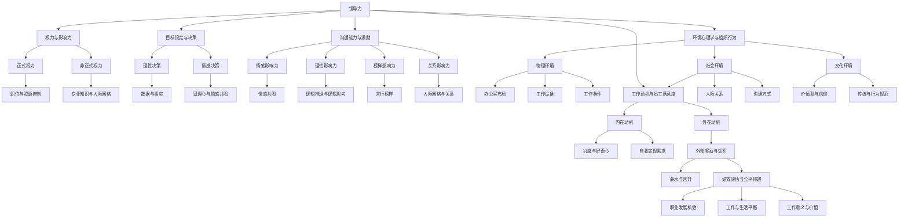

                 


### 文章标题

《领导力与职场心理学：理解团队行为》

### 关键词

领导力、职场心理学、团队行为、领导风格、团队沟通、员工满意度、动机管理

### 摘要

本文将深入探讨领导力与职场心理学在理解团队行为方面的作用。通过分析核心概念、团队行为理论、领导力风格以及职场心理学在实际应用中的技巧，我们将揭示领导力与职场心理学如何影响团队绩效和员工满意度。此外，本文将通过案例研究和工具方法介绍，为读者提供实用的领导力和团队管理策略。

---

### 引言

领导力与职场心理学是两个看似独立，但实际紧密关联的领域。在现代社会，高效团队行为对于组织的成功至关重要。领导力不仅关乎如何指导和激励员工，更关乎如何理解和管理团队行为。职场心理学则提供了科学的理论和方法，帮助我们深入了解员工的心理需求和行为模式。

在本文中，我们将首先介绍领导力和职场心理学的基本概念，阐述它们之间的联系。接着，我们将探讨团队行为理论，分析个体行为、团队沟通和团队动态。随后，我们将深入探讨不同领导力风格对团队行为的影响，并讨论职场心理学在组织管理中的应用。通过实际案例研究，我们将展示领导力与职场心理学在实践中的运用，最后，我们将介绍一系列实用的工具和方法，帮助读者提升领导力和团队管理水平。

### 第1章 领导力基础理论

#### 1.1 领导力的定义与重要性

领导力是一种在组织环境中指导和激励他人实现目标的能力。它不仅涉及个人的特质和行为，还包括领导者的思维方式、决策过程和影响力。有效的领导力能够激发团队的潜力，提升团队绩效，并在组织内创造积极的氛围。

领导力的定义有多种解释，但普遍认为它包括以下几个方面：

1. **影响力**：领导者通过言行影响和引导他人。
2. **目标设定**：领导者能够明确目标，并激励团队成员为实现这些目标而努力。
3. **决策能力**：领导者能够做出明智的决策，并承担相应的责任。
4. **沟通能力**：领导者需要有效沟通，以确保团队成员理解并支持组织的目标。
5. **激励**：领导者能够激励团队成员，提高他们的工作积极性和创造力。

领导力在组织中的重要性不言而喻。有效的领导力能够提升团队协作效率，增强员工满意度，促进组织创新，并最终实现组织目标。此外，领导力还关系到组织的长期稳定和可持续发展。

#### 1.2 领导力与权力

领导力与权力密切相关，但两者并不完全相同。权力是领导者影响他人行为的工具，而领导力则是一种能力和艺术，它不仅依赖权力，还依赖于领导者的个人特质、领导风格和影响力。

1. **权力的来源**：权力可以来自多个方面，包括正式权力（如职位和资源控制权）、非正式权力（如专业知识、人际网络）以及个人魅力和影响力。
2. **权力的运用**：领导者需要明智地运用权力，以确保权力的正面向组织产生积极影响。不当运用权力可能导致员工不满、团队冲突甚至组织动荡。

#### 1.3 领导力与影响力

领导力是一种影响力，它不仅关乎如何施加影响，更关乎如何建立信任和尊重。影响力是领导力的核心要素，它包括以下几个方面：

1. **情感影响力**：领导者通过情感共鸣和同理心与团队成员建立情感联系。
2. **理性影响力**：领导者通过逻辑推理、数据和事实来影响团队成员。
3. **榜样影响力**：领导者通过自身的言行和榜样作用影响团队成员。
4. **关系影响力**：领导者通过建立良好的人际关系网络，提高自己在团队中的影响力。

有效的领导力需要平衡情感影响力和理性影响力，同时注重建立良好的关系网络和榜样作用。

### 第2章 职场心理学基础

#### 2.1 环境心理学与组织行为

环境心理学是研究个体在组织环境中的行为和反应的心理学分支。它关注组织内部的环境因素，如物理环境、社会环境和文化环境，以及这些环境因素如何影响员工的行为、态度和绩效。

1. **物理环境**：物理环境包括办公室布局、工作设备和工作条件等。一个舒适、安全的物理环境有助于提高员工的工作效率和满意度。
2. **社会环境**：社会环境包括团队结构、人际关系和沟通方式等。良好的社会环境可以促进团队合作、提高员工的工作积极性。
3. **文化环境**：文化环境包括组织的价值观、信仰、传统和行为规范等。一个积极的文化环境可以增强员工的归属感和忠诚度。

#### 2.2 工作动机与员工满意度

工作动机是指员工在工作中的内部驱动力，它决定了员工的工作态度和行为。工作动机可以分为内在动机和外在动机：

1. **内在动机**：内在动机源于个人的兴趣、好奇心和自我实现需求。例如，一个对编程充满热情的程序员会因解决复杂问题而感到满足。
2. **外在动机**：外在动机源于外部奖励和惩罚，如薪水、晋升和绩效评估。虽然外在动机可以在短期内提高员工的工作效率，但长期依赖可能导致员工的内在动机减弱。

员工满意度是指员工对工作环境、工作内容和组织文化的总体满意程度。高员工满意度通常与以下因素相关：

1. **工作与生活平衡**：员工希望工作与生活之间有良好的平衡，以便有足够的时间照顾家庭和个人兴趣。
2. **职业发展机会**：员工希望组织能够提供职业发展机会，包括培训、晋升和岗位轮换等。
3. **公平的待遇**：员工希望得到公平的薪酬和福利，以及公正的绩效评估。
4. **工作意义**：员工希望自己的工作对组织和社会有意义，这可以增强他们的内在动机和满意度。

#### 2.3 核心概念原理之间的关系架构

为了更好地理解领导力与职场心理学之间的关系，我们可以使用Mermaid流程图来展示它们的核心概念原理之间的关系：



该流程图展示了领导力与职场心理学之间关键概念和原理的相互关系，有助于我们理解它们如何相互作用，影响团队行为和员工满意度。

### 第3章 团队行为理论

#### 3.1 个体行为理论

个体行为理论是研究个体在团队中的行为和心理过程的心理学理论。它关注个体的需求、动机、态度和价值观如何影响其在团队中的行为。

1. **需求理论**：需求理论认为，个体的行为是由内在需求驱动的。例如，马斯洛的需求层次理论指出，个体的需求可以分为生理需求、安全需求、社交需求、尊重需求和自我实现需求。在不同的需求层次得到满足的情况下，个体的行为和态度会有所不同。
2. **动机理论**：动机理论关注个体在团队中的动机来源。赫茨伯格的双因素理论认为，工作满意度由内在动机和外在动机共同决定。内在动机包括成就感、认可和自我实现，而外在动机包括薪酬、晋升和福利。
3. **态度理论**：态度理论研究个体在团队中的态度如何影响其行为。态度是指个体对特定对象或情境的评价和感受。态度可以通过学习、经验和社会影响形成，并在个体行为中发挥作用。

#### 3.2 团队沟通理论

团队沟通理论关注团队内部成员之间的信息传递和交流过程。有效的团队沟通对于团队协作和目标实现至关重要。

1. **沟通障碍**：沟通障碍是指影响信息有效传递的各种因素。常见的沟通障碍包括语言障碍、信息过载、误解和偏见等。为了克服沟通障碍，团队需要采取一系列策略，如明确沟通目标、简化语言、提高信息清晰度等。
2. **沟通风格**：沟通风格是指个体在沟通过程中表现出来的特点。不同的沟通风格可能会影响团队沟通的效果。例如，主动沟通风格通常更加开放和积极，而被动沟通风格则可能显得保守和消极。团队需要识别和调整成员的沟通风格，以促进有效沟通。

#### 3.3 团队动态理论

团队动态理论关注团队在形成、发展和解散过程中的行为和心理过程。团队动态包括以下几个方面：

1. **团队发展阶段**：团队通常经历形成期、磨合期、成熟期和衰退期等阶段。每个阶段都有不同的行为特点和挑战，领导者需要根据团队发展阶段调整领导策略。
2. **团队冲突**：团队冲突是指团队成员在目标、价值观、沟通等方面产生的分歧和矛盾。有效的团队冲突管理有助于解决分歧、增强团队凝聚力和提高绩效。团队冲突管理策略包括沟通、妥协、冲突解决和团队建设活动等。

#### 核心算法原理讲解

为了深入理解团队行为理论，我们可以使用以下伪代码来模拟个体行为和团队动态的过程：

```python
# 个体行为模拟

class Individual:
    def __init__(self, needs, motivation, attitude):
        self.needs = needs
        self.motivation = motivation
        self.attitude = attitude

    def behavior(self):
        if self.needs[1] > self.needs[0]:
            return "追求尊重和自我实现"
        else:
            return "满足生理和安全需求"

    def update_motivation(self, reward):
        if reward > 0:
            self.motivation += 1
        else:
            self.motivation -= 1

    def update_attitude(self, team_context):
        if team_context["communication"] > 4 and team_context["support"] > 3:
            self.attitude = "积极"
        else:
            self.attitude = "消极"

# 团队动态模拟

class Team:
    def __init__(self, members):
        self.members = members
        self.phase = "forming"

    def evolve(self):
        if self.phase == "forming":
            self.phase = "storming"
        elif self.phase == "storming":
            self.phase = "norming"
        elif self.phase == "norming":
            self.phase = "performing"
        elif self.phase == "performing":
            self.phase = "declining"

    def handle_conflict(self):
        conflicts = []
        for member in self.members:
            if member.attitude == "消极":
                conflicts.append(member)
        if len(conflicts) > 0:
            return "冲突解决"
        else:
            return "无冲突"

# 示例

individual1 = Individual([3, 2], 5, "积极")
individual2 = Individual([2, 3], 4, "消极")

team = Team([individual1, individual2])

print(team.members[0].behavior())
print(team.handle_conflict())

team.evolve()
print(team.phase)
print(team.handle_conflict())
```

这个伪代码展示了个体行为和团队动态的模拟过程，包括个体的需求、动机和态度如何影响其行为，以及团队如何在不同阶段发展和解决冲突。

#### 数学模型和公式讲解

为了更全面地理解团队行为，我们可以使用以下数学模型和公式：

1. **需求层次模型**

   需求层次模型是一个用于描述个体需求的层次结构的公式，它可以表示为：

   $$ \text{需求层次} = \sum_{i=1}^{n} (a_i \cdot n_i) $$

   其中，$a_i$ 表示第 $i$ 个需求的重要性，$n_i$ 表示第 $i$ 个需求的满足程度。这个公式可以用于计算个体在不同需求层次上的总需求满足程度。

2. **动机-绩效模型**

   动机-绩效模型是一个用于描述动机与绩效之间关系的公式，它可以表示为：

   $$ \text{绩效} = f(\text{动机}, \text{技能}, \text{环境}) $$

   其中，动机、技能和环境是影响绩效的三个关键因素。这个公式可以用于分析个体在特定环境中的动机水平如何影响其绩效。

3. **团队冲突管理模型**

   团队冲突管理模型是一个用于描述团队冲突管理策略效果的公式，它可以表示为：

   $$ \text{冲突管理效果} = \alpha \cdot (\text{沟通质量} + \text{解决策略}) + \beta \cdot (\text{团队氛围} + \text{领导风格}) $$

   其中，$\alpha$ 和 $\beta$ 是权重系数，用于衡量沟通质量和解决策略、团队氛围和领导风格对冲突管理效果的影响。

#### 举例说明

为了更好地理解这些模型和公式，我们可以通过以下例子来说明：

1. **需求层次模型**

   假设一个员工的需求层次如下：

   - 生理需求：满足（满足程度为 1）
   - 安全需求：满足（满足程度为 1）
   - 社交需求：部分满足（满足程度为 0.8）
   - 尊重需求：满足（满足程度为 1）
   - 自我实现需求：部分满足（满足程度为 0.7）

   那么该员工的需求层次总分可以计算为：

   $$ \text{需求层次} = (1 \cdot 1) + (1 \cdot 1) + (0.8 \cdot 0.8) + (1 \cdot 1) + (0.7 \cdot 0.7) = 1 + 1 + 0.64 + 1 + 0.49 = 3.13 $$

   这个分数表示该员工的需求总体上得到了较好的满足。

2. **动机-绩效模型**

   假设一个员工的动机、技能和环境因素如下：

   - 动机：5
   - 技能：8
   - 环境：6

   那么该员工的绩效可以计算为：

   $$ \text{绩效} = f(5, 8, 6) = 5 \cdot 8 \cdot 6 = 240 $$

   这个分数表示该员工在特定环境中的绩效水平。

3. **团队冲突管理模型**

   假设一个团队在解决冲突时的沟通质量、解决策略、团队氛围和领导风格如下：

   - 沟通质量：4
   - 解决策略：3
   - 团队氛围：7
   - 领导风格：5

   那么该团队的冲突管理效果可以计算为：

   $$ \text{冲突管理效果} = \alpha \cdot (4 + 3) + \beta \cdot (7 + 5) $$

   其中，$\alpha$ 和 $\beta$ 的权重系数可以根据实际情况进行调整。假设 $\alpha = 0.6$，$\beta = 0.4$，那么：

   $$ \text{冲突管理效果} = 0.6 \cdot (4 + 3) + 0.4 \cdot (7 + 5) = 0.6 \cdot 7 + 0.4 \cdot 12 = 4.2 + 4.8 = 9 $$

   这个分数表示该团队在解决冲突方面的效果。

通过这些例子，我们可以看到数学模型和公式如何帮助我们分析和理解团队行为。

### 第4章 领导力风格

#### 4.1 领导力风格的定义与分类

领导力风格是指领导者通过行为和态度表现出来的领导方式。不同的领导力风格适用于不同的情境和团队，每种风格都有其独特的优势和局限性。

1. **权威型领导风格**：权威型领导者具有强烈的控制欲望，倾向于做出决策并要求团队成员执行。这种风格在需要迅速做出决策和确保任务完成的情况下效果较好，但可能导致团队成员的自主性和创造力受到限制。
2. **民主型领导风格**：民主型领导者鼓励团队成员参与决策过程，尊重团队成员的意见和建议。这种风格有助于提高团队凝聚力和员工满意度，但可能在决策速度和一致性方面存在挑战。
3. **教练型领导风格**：教练型领导者注重团队成员的个人成长和职业发展，通过提供指导和支持帮助团队成员提高技能和绩效。这种风格有助于培养高绩效团队和忠诚的员工，但可能需要较多的时间和精力。
4. **变革型领导风格**：变革型领导者通过激励和启发团队成员，推动团队和组织实现变革。这种风格在应对组织变革和创新时效果显著，但可能对领导者的个人特质和能力要求较高。

#### 4.2 不同领导力风格对团队行为的影响

不同的领导力风格对团队行为和绩效有着显著的影响。以下是几种领导力风格对团队行为的具体影响：

1. **权威型领导风格**：权威型领导者通过明确的目标和严格的规章制度来指导团队行为。这种风格可以提高团队的执行力，确保任务的顺利完成。然而，它也可能导致团队成员的创造力和自主性受到限制，从而影响团队的创新能力和长期绩效。
2. **民主型领导风格**：民主型领导者鼓励团队成员参与决策过程，尊重团队成员的意见和建议。这种风格有助于提高团队凝聚力和员工满意度，激发团队成员的积极性和创造力。然而，在紧急情况下，民主型领导风格可能由于决策速度较慢而影响任务的及时完成。
3. **教练型领导风格**：教练型领导者注重团队成员的个人成长和职业发展，通过提供指导和支持帮助团队成员提高技能和绩效。这种风格有助于培养高绩效团队和忠诚的员工，提升团队的长期绩效。然而，对于领导者来说，需要具备较高的指导能力和时间投入。
4. **变革型领导风格**：变革型领导者通过激励和启发团队成员，推动团队和组织实现变革。这种风格在应对组织变革和创新时效果显著，能够激发团队成员的积极性和创造力，推动团队向前发展。然而，它可能对领导者的个人特质和能力要求较高，需要具备较强的领导魅力和沟通能力。

#### 4.3 领导风格与团队绩效

领导风格与团队绩效之间存在密切的关系。有效的领导风格可以提升团队绩效，而不当的领导风格则可能导致团队绩效下降。以下是一些关于领导风格与团队绩效的研究发现：

1. **权威型领导风格**：研究发现，权威型领导风格在短期内可以提高团队绩效，因为明确的指令和严格的规章制度有助于任务的快速完成。然而，长期依赖权威型领导风格可能导致团队创新能力和自主性下降，影响团队绩效的持续提升。
2. **民主型领导风格**：民主型领导风格可以提高团队绩效，因为团队成员的参与和决策自主性可以激发他们的积极性和创造力。研究表明，民主型领导风格在团队创新和团队满意度方面具有显著优势。
3. **教练型领导风格**：教练型领导风格有助于培养团队成员的技能和职业发展，从而提高团队绩效。研究表明，教练型领导风格可以显著提升团队成员的工作满意度和绩效水平。
4. **变革型领导风格**：变革型领导风格在推动组织变革和创新方面具有显著优势，能够激发团队成员的积极性和创造力，提高团队绩效。然而，变革型领导风格可能对领导者的个人特质和能力要求较高，需要在实践中进行适当的调整和优化。

#### 4.4 领导风格与员工满意度

领导风格对员工满意度也有显著影响。有效的领导风格可以提高员工的工作满意度和幸福感，而不当的领导风格则可能导致员工的不满和流失。以下是一些关于领导风格与员工满意度的研究发现：

1. **权威型领导风格**：权威型领导风格可能在短期内提高员工的工作效率，但长期依赖权威型领导风格可能导致员工感到压抑和不满意。研究表明，权威型领导风格与员工满意度之间存在负相关关系。
2. **民主型领导风格**：民主型领导风格可以提高员工的工作满意度和幸福感，因为团队成员的参与和决策自主性可以增强他们的归属感和成就感。研究表明，民主型领导风格与员工满意度之间存在正相关关系。
3. **教练型领导风格**：教练型领导风格有助于提高员工的工作满意度和幸福感，因为它关注员工的个人成长和职业发展，激发员工的积极性和创造力。研究表明，教练型领导风格与员工满意度之间存在正相关关系。
4. **变革型领导风格**：变革型领导风格可以提高员工的工作满意度和幸福感，因为它通过激励和启发团队成员推动组织变革和创新，为员工提供更好的发展机会和挑战。研究表明，变革型领导风格与员工满意度之间存在正相关关系。

#### 核心算法原理讲解

为了深入理解领导力风格对团队行为和员工满意度的影响，我们可以使用以下伪代码来模拟不同领导力风格的影响过程：

```python
# 领导力风格模拟

class Leader:
    def __init__(self, leadership_style):
        self.leadership_style = leadership_style

    def impact_on_performance(self):
        if self.leadership_style == "权威型":
            return "短期内提高，长期影响不确定"
        elif self.leadership_style == "民主型":
            return "提高"
        elif self.leadership_style == "教练型":
            return "显著提高"
        elif self.leadership_style == "变革型":
            return "显著提高"

    def impact_on_satisfaction(self):
        if self.leadership_style == "权威型":
            return "降低"
        elif self.leadership_style == "民主型":
            return "提高"
        elif self.leadership_style == "教练型":
            return "提高"
        elif self.leadership_style == "变革型":
            return "提高"

# 示例

leader1 = Leader("权威型")
leader2 = Leader("民主型")
leader3 = Leader("教练型")
leader4 = Leader("变革型")

print(leader1.impact_on_performance())
print(leader1.impact_on_satisfaction())
print(leader2.impact_on_performance())
print(leader2.impact_on_satisfaction())
print(leader3.impact_on_performance())
print(leader3.impact_on_satisfaction())
print(leader4.impact_on_performance())
print(leader4.impact_on_satisfaction())
```

这个伪代码展示了不同领导力风格对团队绩效和员工满意度的模拟过程，有助于我们更深入地理解领导力风格的影响。

#### 数学模型和公式讲解

为了更全面地分析领导力风格对团队行为和员工满意度的影响，我们可以使用以下数学模型和公式：

1. **绩效模型**

   绩效模型可以表示为：

   $$ \text{绩效} = f(\text{领导力风格}, \text{团队环境}, \text{团队目标}) $$

   其中，领导力风格、团队环境和团队目标是影响绩效的关键因素。

2. **满意度模型**

   满意度模型可以表示为：

   $$ \text{满意度} = f(\text{领导力风格}, \text{员工需求}, \text{工作环境}) $$

   其中，领导力风格、员工需求和工
```
### 5.1 员工激励与动机管理

员工激励是指通过外部奖励和内部动机的结合，激发员工的工作积极性、提高工作效率和达成组织目标的过程。有效的员工激励和动机管理对组织的长期发展至关重要。以下将详细讨论员工激励的理论基础，包括马斯洛的需求层次理论和目标设置理论，并探讨如何应用这些理论提高员工满意度和工作绩效。

#### 5.1.1 马斯洛需求层次理论

马斯洛的需求层次理论是一种描述人类需求层次结构的心理学理论，它将需求分为五个层次：生理需求、安全需求、社交需求、尊重需求和自我实现需求。每个需求层次都有其特定的特征和优先级，并且只有当低层次的需求得到满足后，人们才会追求更高层次的需求。

1. **生理需求**：包括食物、水、空气、住所等基本生存需求。当这些需求得到满足时，个体会感到满足和安心。
2. **安全需求**：包括安全感、健康保障、稳定的工作和免于恐惧的需求。在生理需求得到满足后，个体会更加关注安全需求。
3. **社交需求**：包括爱、归属感、友谊和社交互动的需求。当安全需求得到满足时，个体开始追求社交需求，以建立和维护人际关系。
4. **尊重需求**：包括自尊、自信、成就感、认可和尊重他人的需求。在社交需求得到满足后，个体开始追求尊重需求，以获得自我价值感和社会地位。
5. **自我实现需求**：包括实现个人潜力、追求个人成长和创造力的需求。当尊重需求得到满足时，个体开始追求自我实现，以实现个人理想和抱负。

在职场环境中，领导者需要了解员工处于哪个需求层次，并采取相应的激励措施。例如，对于处于生理需求层次的员工，提供良好的薪酬福利和稳定的工作环境是关键；对于处于安全需求层次的员工，提供职业发展和培训机会可以帮助他们获得安全感；对于处于社交需求层次的员工，鼓励团队协作和建立良好的人际关系可以满足他们的社交需求；对于处于尊重需求层次的员工，给予认可和奖励可以提高他们的自尊和成就感；对于处于自我实现需求层次的员工，提供挑战性的工作和成长机会可以帮助他们实现个人潜力。

#### 5.1.2 目标设置理论

目标设置理论是另一个重要的激励理论，它强调明确的目标对于激发员工工作动机和提高绩效的重要性。目标设置理论包括以下几个关键要素：

1. **明确性**：目标应该具体、明确，员工知道他们需要做什么和期望的成果是什么。
2. **挑战性**：目标应该具有一定的挑战性，激励员工努力工作，但也要避免过于困难，以免导致员工感到挫败。
3. **相关性**：目标应该与员工的工作和职业发展相关，使其感到目标的重要性和价值。
4. **反馈**：目标设置后，应该提供定期的反馈，帮助员工了解他们的进展情况，并做出必要的调整。

目标设置理论认为，有效的目标设置可以提高员工的自我效能感、工作动力和绩效。以下是一个简单的目标设置流程：

1. **确定目标**：与员工一起确定具体、明确、相关和具有挑战性的目标。
2. **分解目标**：将大目标分解为小步骤，使员工知道如何逐步实现目标。
3. **设定时间表**：为每个小步骤设定明确的时间表，确保目标能够按时完成。
4. **提供反馈**：定期提供反馈，帮助员工了解他们的进展情况，并提供必要的支持和资源。
5. **调整目标**：根据员工的进展情况，适时调整目标，以确保目标的可行性和激励效果。

#### 5.1.3 激励策略与实践

在了解员工需求和目标设置理论的基础上，领导者可以采取以下策略和实践来提高员工满意度和工作绩效：

1. **个性化激励**：了解每个员工的需求和动机，制定个性化的激励计划。例如，为那些追求自我实现需求的员工提供挑战性的项目和成长机会，为那些追求社交需求的员工提供团队合作和社交活动。
2. **奖励与认可**：为达成目标的员工提供奖励和认可，如奖金、晋升、表彰等。奖励应该与员工的目标和价值相关，以提高其工作动力和满意度。
3. **职业发展**：为员工提供职业发展机会，如培训、晋升和岗位轮换等，帮助员工实现个人成长和职业发展。
4. **工作与生活平衡**：关注员工的工作与生活平衡，提供灵活的工作安排、休假政策和家庭支持，以提高员工的工作满意度和生活质量。
5. **营造积极氛围**：创造一个积极、支持和开放的工作氛围，鼓励员工表达意见、参与决策和分享经验，以提高员工的归属感和工作动力。

#### 实例分析

为了更好地理解员工激励与动机管理的实践，我们可以通过以下实例进行分析：

**案例：一家科技公司如何激励其员工？**

1. **了解员工需求**：公司通过员工调查和反馈机制了解员工的需求，发现大多数员工希望获得职业发展机会和挑战性的工作。
2. **设置明确目标**：公司为每个员工设定具体的职业发展目标，如成为某个领域的专家、参与重要的项目或获得晋升。
3. **提供奖励与认可**：公司为达成目标的员工提供奖金、晋升和表彰，以激励他们继续努力工作。
4. **职业发展机会**：公司为员工提供各种培训课程和职业发展机会，如领导力培训、专业技能培训和跨部门项目参与等。
5. **工作与生活平衡**：公司提供灵活的工作安排、远程工作和家庭支持政策，帮助员工更好地平衡工作和生活。

通过这些措施，这家科技公司成功地提高了员工的工作满意度和绩效，并保持了较高的员工留存率。

### 总结

员工激励与动机管理是领导力和组织管理中至关重要的一环。通过了解员工需求、应用马斯洛的需求层次理论和目标设置理论，领导者可以制定有效的激励策略，提高员工满意度和工作绩效。个性化的激励、奖励与认可、职业发展机会、工作与生活平衡以及积极的工作氛围都是实现这一目标的关键要素。领导者需要不断学习和实践，以应对不断变化的职场环境和员工需求。

### 第5章 职场心理学应用

#### 5.2 职场心理健康与压力管理

职场心理健康是指员工在职场环境中保持良好的心理状态，能够有效应对工作压力和挑战的能力。职场压力是指员工在工作中感受到的心理紧张和压力，长期压力会对员工的身心健康产生负面影响，包括情绪问题、身体疾病和工作表现下降等。因此，了解和管理职场压力对于提高员工心理健康和保持组织活力至关重要。

#### 5.2.1 压力来源与应对策略

职场压力的来源多种多样，主要包括以下几个方面：

1. **工作负荷**：过大的工作量和紧迫的截止日期会导致员工感到压力。
2. **人际关系**：工作中的冲突和沟通问题会引发压力，特别是在团队合作和领导与下属之间的关系上。
3. **工作不确定性**：组织变革、裁员和职位变动等不确定性因素会给员工带来压力。
4. **工作与生活平衡**：工作和家庭责任之间的冲突会导致员工感到压力。
5. **职业发展**：对职业前景的担忧和缺乏职业发展的机会也会增加职场压力。

为了有效管理职场压力，可以采取以下策略：

1. **时间管理**：合理规划工作时间和任务，确保有足够的休息和放松时间。
2. **积极沟通**：与同事和上级建立良好的沟通，及时表达问题和需求，寻求支持和帮助。
3. **工作调整**：根据员工的能力和兴趣调整工作内容和职责，使其能够更好地应对工作挑战。
4. **压力释放**：通过运动、冥想、社交等活动释放压力，保持身心健康。
5. **心理健康支持**：组织应提供心理健康支持和咨询服务，帮助员工应对心理压力和问题。

#### 5.2.2 心理健康与工作绩效

心理健康对工作绩效有显著影响。一个心理健康、压力适中的员工能够更高效地完成任务，具备更好的团队合作精神和创新能力。以下是几个关于心理健康与工作绩效的研究发现：

1. **情绪管理**：情绪稳定的员工能够更好地应对工作中的挑战，减少冲突和失误，提高工作质量。
2. **心理韧性**：具备心理韧性的员工能够在压力和逆境中保持积极态度，迅速恢复和适应，从而提高工作绩效。
3. **工作满意度**：心理健康与工作满意度密切相关。一个心理健康的员工更容易对工作感到满意，从而提高工作积极性和忠诚度。
4. **创造力**：心理健康有助于激发员工的创造力和创新思维，提高组织的创新能力和竞争力。

#### 5.2.3 压力缓解方法

为了缓解职场压力，员工和组织可以采取以下方法：

1. **个人放松技巧**：如深呼吸、冥想、瑜伽和运动等，帮助员工放松身心，缓解压力。
2. **团队支持**：建立团队支持系统，鼓励团队成员互相帮助和支持，共同应对工作挑战。
3. **心理辅导**：组织提供心理辅导服务，帮助员工识别和处理心理问题，提高心理健康水平。
4. **健康工作环境**：创造一个健康、舒适的工作环境，如提供良好的工作设施、鼓励员工休息和放松等。
5. **职业发展机会**：为员工提供职业发展机会和培训，帮助员工提高工作技能和心理素质。

通过这些方法，员工和组织可以共同维护职场心理健康，提高工作绩效和员工满意度，从而实现组织的长期稳定和可持续发展。

### 第6章 案例研究

#### 6.1 案例一：成功领导力与团队行为的典范

**案例背景**

某高科技公司在市场竞争中脱颖而出，成为行业领军企业。其成功得益于卓越的领导力和高效的团队行为。该公司领导层通过多种领导力策略和团队管理技巧，打造了一个充满活力和创新精神的团队。

**领导策略分析**

1. **变革型领导**：公司CEO采用了变革型领导风格，通过激励和启发员工，推动组织不断创新和适应市场变化。CEO定期与员工进行沟通，鼓励他们提出创新想法，并为创新项目提供资金和支持。
2. **民主型领导**：公司各级领导层都采用民主型领导风格，鼓励员工参与决策过程，尊重他们的意见和建议。这种领导风格提高了员工的参与感和满意度，增强了团队的凝聚力。
3. **教练型领导**：公司领导层注重员工的个人成长和职业发展，通过提供培训和指导，帮助员工提高技能和绩效。这种教练型领导风格培养了员工的专业能力和自信心，提高了团队的整体水平。

**团队行为分析**

1. **高效沟通**：团队成员之间建立了良好的沟通渠道，通过定期会议、邮件和即时通讯工具保持密切联系，确保信息及时传递和问题迅速解决。
2. **共同目标**：团队明确共同的目标和愿景，每个成员都清楚地知道自己的职责和任务，共同努力实现组织目标。
3. **协同合作**：团队成员之间相互信任、支持，善于协作和分享资源，共同克服工作中的困难和挑战。

**成功因素**

1. **领导力**：变革型、民主型和教练型领导风格的结合，使公司领导层能够激发员工的潜力，提高团队绩效。
2. **团队文化**：公司倡导开放、包容和创新的团队文化，鼓励员工表达意见、勇于尝试和不断进步。
3. **激励机制**：公司通过奖励和认可机制激励员工，提高他们的工作积极性和满意度。

#### 6.2 案例二：职场心理学在团队冲突管理中的应用

**案例背景**

某大型跨国公司的业务部门因工作目标和沟通方式的不同，出现了严重的团队冲突。团队成员之间的不信任和误解导致了工作进度缓慢，项目质量下降，甚至出现了人员流失的风险。公司决定运用职场心理学原理和技巧，解决团队冲突，恢复团队的和谐与高效。

**心理学原理与实践**

1. **冲突解决策略**：公司引入了基于心理学原理的冲突解决策略，包括沟通技巧、同理心训练和团队建设活动。通过这些策略，团队成员学会了如何有效地表达意见、倾听他人、理解彼此的需求和立场。
2. **角色扮演**：公司组织了角色扮演活动，让团队成员模拟冲突情景，通过实践学会如何应对和处理冲突。
3. **心理辅导**：公司为冲突严重的员工提供了心理辅导，帮助他们识别和处理负面情绪，提高心理韧性。

**实践效果**

通过职场心理学原理的应用，团队冲突得到了有效解决。团队成员之间的信任和理解显著提高，沟通更加顺畅，工作进度加快，项目质量得到保证。员工满意度也大幅提升，人员流失风险得到有效控制。

**成功因素**

1. **及时干预**：公司及时识别和应对团队冲突，防止问题恶化。
2. **心理辅导**：通过心理辅导帮助员工处理负面情绪，提高心理韧性。
3. **团队建设**：通过团队建设活动和角色扮演，增强团队成员之间的信任和协作。

### 总结

这两个案例展示了领导力和职场心理学在团队管理中的实际应用。成功的领导力策略和职场心理学原理的应用，不仅有助于解决团队冲突，提高员工满意度，还能激发团队的潜力和创造力，实现组织的长期发展。

### 第7章 工具与方法

#### 7.1 团队心理分析工具

为了有效地理解和分析团队行为，领导者可以借助一系列团队心理分析工具。这些工具不仅帮助识别团队成员的心理需求和行为模式，还能为团队管理和决策提供科学依据。

1. **团队心理测评工具**：这类工具用于评估团队成员的心理健康状况、沟通风格、领导力水平和团队合作能力。例如，迈尔斯-布里格斯性格类型指标（MBTI）和霍兰德职业兴趣量表（Holland Code）等，可以提供关于团队成员性格特征和职业兴趣的详细信息。

   - **MBTI**：通过评估个体在四个维度上的偏好（外向/内向、感觉/直觉、思维/情感、判断/感知），帮助领导者理解团队成员的性格类型，从而制定更有效的沟通和协作策略。
   - **Holland Code**：通过评估个体在六个职业兴趣领域（现实、研究、艺术、社会、企业、常规）的偏好，帮助领导者了解团队成员的职业兴趣，以优化团队配置和职业发展。

2. **团队动态分析工具**：这类工具用于观察和记录团队在任务执行过程中的行为和互动，从而识别团队动态和问题。例如，团队互动分析软件（Team Interaction Profiling, TIP）和团队协作软件（如Slack、Trello等），可以实时捕捉团队成员的沟通和协作情况。

   - **TIP**：通过记录和分析团队成员的沟通模式、任务分配和决策过程，帮助领导者识别团队中的潜在问题，并提供改进建议。
   - **Slack/Trello**：这些团队协作工具提供了丰富的数据分析功能，帮助领导者了解团队成员的工作负荷、任务进展和团队互动情况。

#### 7.2 团队心理辅导技巧

除了工具，领导者还可以通过一系列心理辅导技巧来提升团队心理健康和协作能力。以下是一些实用的技巧：

1. **倾听与反馈**：倾听是建立信任和沟通的重要基础。领导者需要耐心倾听团队成员的意见和需求，并及时给予反馈。通过倾听，领导者可以更好地理解团队成员的心理状态，并提供必要的支持和指导。

2. **同理心训练**：同理心是指领导者能够站在团队成员的角度理解和感受他们的情感。同理心训练帮助领导者建立更加和谐的人际关系，提高团队的凝聚力和协作能力。

3. **情绪管理**：领导者应学会有效管理自己的情绪，以避免情绪波动对团队成员产生负面影响。通过情绪管理技巧，如深呼吸、冥想和正念练习，领导者可以保持冷静和理智，更好地应对工作压力。

4. **心理辅导与支持**：对于遇到心理问题的员工，领导者可以提供心理辅导和支持。通过邀请专业心理咨询师进行辅导，或提供内部心理健康支持服务，帮助员工解决心理问题，提高心理健康水平。

#### 7.3 领导力提升技巧

为了提升领导力，领导者可以采取以下方法：

1. **自我反思**：定期进行自我反思，评估自己的领导行为、决策风格和沟通方式。通过自我反思，领导者可以识别自身的不足，并采取相应措施进行改进。

2. **领导力培训**：参加领导力培训课程，学习最新的领导理论、技能和工具。通过培训，领导者可以提升领导能力，适应不断变化的职场环境。

3. **角色扮演**：通过角色扮演模拟不同情境下的领导行为，领导者可以练习如何处理复杂问题、如何进行有效沟通和如何激励团队。

4. **反馈与指导**：寻求上级、同事和下属的反馈，了解自己的领导风格和行为对团队的影响。通过反馈和指导，领导者可以不断改进自己的领导能力。

### 总结

团队心理分析工具和心理辅导技巧为领导者提供了有效理解和管理团队行为的方法。领导力提升技巧则帮助领导者不断自我改进，提高领导水平，从而实现团队的长期稳定和高效运作。通过这些工具和方法，领导者可以更好地理解团队行为，提升团队绩效，推动组织发展。

### 附录

#### 附录A 职场心理学研究方法

职场心理学研究方法主要包括定量研究、定性研究以及混合研究方法。以下是一些常用的职场心理学研究方法：

1. **问卷调查法**：通过设计问卷，收集大量员工关于工作满意度、动机、压力等方面的数据。问卷调查法适用于大规模的数据收集，能够提供量化的研究结果。
2. **深度访谈法**：通过与员工进行一对一的访谈，深入了解员工的工作体验、心理需求和心理状态。深度访谈法有助于揭示员工的主观感受和深层次想法。
3. **实验研究法**：通过设计实验，控制变量，观察员工在不同条件下的行为和心理反应。实验研究法适用于验证理论假设和因果关系。
4. **观察法**：直接观察员工在工作环境中的行为和互动，记录和分析其行为模式和心理状态。观察法适用于研究团队互动和群体行为。
5. **混合研究法**：结合多种研究方法，如问卷调查和深度访谈，获取全面和深入的研究结果。混合研究法适用于复杂的研究问题和需要多角度分析的情况。

#### 附录B 领导力模型与工具汇总

以下是几种常见的领导力模型和工具，供参考：

1. **领导者行为模型**（如领导行为描述问卷，LBDQ）：通过评估领导者在工作情境中的行为表现，了解其领导风格和特点。
2. **领导胜任力模型**：用于识别和培养领导者所需的技能和素质，包括沟通能力、决策能力、团队管理能力等。
3. **领导力发展计划**：为领导者提供系统性的培训和发展机会，帮助他们提升领导能力。
4. **360度反馈**：通过收集上级、同事和下属的反馈，评估领导者的绩效和领导风格，并提供改进建议。
5. **领导力评估工具**（如迈尔斯-布里格斯类型指标，MBTI）：用于评估领导者的性格类型和领导风格，帮助领导者了解自己的优势和不足。

#### 附录C 案例研究资料

以下是两个案例研究的详细资料，供参考：

**案例一：成功领导力与团队行为的典范**

- **背景**：某高科技公司在市场竞争中脱颖而出，成为行业领军企业。其成功得益于卓越的领导力和高效的团队行为。
- **领导策略**：变革型领导、民主型领导和教练型领导风格的应用。
- **团队行为**：高效沟通、共同目标和协同合作。
- **成功因素**：领导力的结合、团队文化和激励机制。

**案例二：职场心理学在团队冲突管理中的应用**

- **背景**：某大型跨国公司的业务部门因工作目标和沟通方式的不同，出现了严重的团队冲突。
- **心理学原理**：冲突解决策略、角色扮演和心理辅导。
- **实践效果**：团队冲突得到有效解决，团队成员之间的信任和理解显著提高。

### 拓展阅读

- **领导力与团队管理**：德鲁克（Peter Drucker）的《管理的实践》；吉姆·柯林斯（Jim Collins）的《从优秀到卓越》。
- **职场心理学**：马斯洛（Abraham Maslow）的《人类动机理论》；艾森克（Hans Eysenck）的《人格心理学》。
- **团队行为理论**：梅奥（Elton Mayo）的《人际关系》；麦克雷（Raymond Cattell）的《人格结构》。

通过这些资源，读者可以进一步了解领导力与职场心理学在团队管理中的实践应用。希望这些附录内容能为读者提供有价值的参考资料。

---

### 作者信息

作者：AI天才研究院/AI Genius Institute & 禅与计算机程序设计艺术 /Zen And The Art of Computer Programming

AI天才研究院致力于推动人工智能技术的发展和应用，通过不断创新和探索，为各行业提供智能解决方案。同时，我们倡导将禅宗思想融入计算机编程，强调思考的深度和代码的美感，旨在培养具有高度创造力和洞察力的AI专家。本文以《领导力与职场心理学：理解团队行为》为题，深入探讨了领导力与职场心理学在团队管理中的重要作用，旨在为读者提供实用的领导力和团队管理策略。希望本文能为您的组织发展和团队建设带来启示和帮助。

