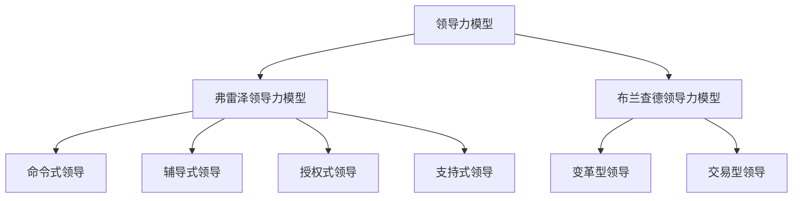

                 

### 文章标题

《领导力与职场心理：理解团队行为》旨在深入探讨领导力与职场心理在团队管理中的关键作用，帮助读者更好地理解和应对职场中的复杂行为和挑战。本文通过逻辑清晰、结构紧凑的叙述方式，结合实际案例和技术分析，旨在为IT领域的专业人士提供实用的领导力和团队管理策略。

关键词：领导力、职场心理、团队行为、领导模型、团队协作、IT项目管理

摘要：本文从领导力的核心概念、职场心理基础、团队行为理论以及领导实践和案例分析等多个维度，详细阐述了领导力与职场心理在团队管理中的重要性。通过实际项目和案例分析，本文提供了实用的工具和方法，帮助读者提升团队协作效率和管理能力。

## 第一部分：领导力理论探讨

### 第1章：领导力的核心概念与类型

#### 1.1.1 领导力的定义与作用

领导力，是一种在复杂多变的环境中，能够激发、引导和激励团队成员共同实现目标的能力。其核心在于通过有效的沟通、激励和协调，使团队成员充分发挥潜力，实现整体目标。

领导力在团队中的作用主要体现在以下几个方面：

1. **方向引领**：领导力为团队提供明确的目标和方向，帮助团队成员理解团队愿景，形成共同的目标。
2. **能力提升**：领导力通过培训、指导和支持，提升团队成员的能力和技能，促进团队整体水平的提升。
3. **团队凝聚**：领导力通过建立信任、沟通和协作，增强团队成员之间的凝聚力，形成积极的团队氛围。
4. **问题解决**：领导力在团队遇到困难时，能够通过有效的决策和行动，引导团队解决问题，实现目标。

#### 1.1.2 领导力的发展历程

领导力理论的发展经历了几个重要的阶段：

1. **特质理论**：早期领导力研究认为，领导力是一种个人特质，如智力、自信、影响力等。但这种理论忽视了环境因素对领导力的影响。
2. **行为理论**：行为理论认为，领导力是一种行为模式，不同的领导行为会产生不同的领导效果。该理论强调了领导行为的可学习和可改进性。
3. **情境理论**：情境理论认为，领导力取决于领导行为与具体情境的匹配程度。领导力模型如费德勒模型、赫斯伯格模型等，强调了情境因素对领导力的影响。
4. **变革型领导理论**：变革型领导理论认为，领导力在于激发和引导团队成员实现变革。变革型领导能够通过愿景、激励和挑战，推动团队实现更高的目标。

#### 1.1.3 领导力的类型

根据领导风格和行为特征，领导力可以分为以下几种类型：

1. **指令型领导**：指令型领导通过明确的指导和指令来管理团队，适用于任务紧急、团队缺乏经验的情况。
2. **民主型领导**：民主型领导鼓励团队成员参与决策，重视团队合作，适用于创新性和决策复杂度较高的任务。
3. **支持型领导**：支持型领导关注团队成员的福利和需求，提供情感支持和指导，适用于需要高团队合作和信任的情境。
4. **变革型领导**：变革型领导通过激励和挑战，推动团队成员实现变革和成长，适用于需要变革和创新的项目。

### 第2章：领导力模型与理论

#### 2.1.1 弗雷泽领导力模型

弗雷泽领导力模型是一种基于情境的领导力理论，它将领导力行为分为任务导向和关系导向两个维度，并提出了四种领导风格：

1. **命令式领导**：任务导向，强调明确指导和指令，适用于团队新成员或任务紧急的情况。
2. **辅导式领导**：关系导向，提供指导和支持，帮助团队成员提升能力，适用于需要培养人才和团队成熟度较高的情境。
3. **授权式领导**：任务导向，给予团队成员更多自主权和责任，适用于团队经验丰富、任务简单的情况。
4. **支持式领导**：关系导向，关注团队成员的需求和福利，建立积极的团队氛围，适用于需要高团队合作和信任的情境。

#### 2.1.2 布兰查德领导力模型

布兰查德领导力模型是一种基于人格特质的领导力理论，它将领导力行为分为变革型领导和交易型领导两种类型：

1. **变革型领导**：通过愿景、激励和挑战，推动团队成员实现变革和成长，强调个人影响力和领导魅力。
2. **交易型领导**：通过交换利益和奖惩机制，管理团队行为，强调规则和制度。

### 第2章：领导力模型与理论

#### 2.1.1 弗雷泽领导力模型

弗雷泽领导力模型是一种基于情境的领导力理论，它将领导力行为分为任务导向和关系导向两个维度，并提出了四种领导风格：

1. **命令式领导**：任务导向，强调明确指导和指令，适用于团队新成员或任务紧急的情况。
2. **辅导式领导**：关系导向，提供指导和支持，帮助团队成员提升能力，适用于需要培养人才和团队成熟度较高的情境。
3. **授权式领导**：任务导向，给予团队成员更多自主权和责任，适用于团队经验丰富、任务简单的情况。
4. **支持式领导**：关系导向，关注团队成员的需求和福利，建立积极的团队氛围，适用于需要高团队合作和信任的情境。

#### 2.1.2 布兰查德领导力模型

布兰查德领导力模型是一种基于人格特质的领导力理论，它将领导力行为分为变革型领导和交易型领导两种类型：

1. **变革型领导**：通过愿景、激励和挑战，推动团队成员实现变革和成长，强调个人影响力和领导魅力。
2. **交易型领导**：通过交换利益和奖惩机制，管理团队行为，强调规则和制度。

## 第二部分：职场心理与行为分析

### 第3章：职场心理基础

#### 3.1.1 职场心理概述

职场心理是指员工在职场环境中表现出来的心理特征和行为模式。理解职场心理对于提升团队绩效和员工满意度具有重要意义。

职场心理的核心包括以下几个方面：

1. **动机**：员工在工作中的内在动力，如对成就、认可和成长的追求。
2. **情感**：员工在工作中的情绪体验，如满意、焦虑、压力等。
3. **行为**：员工在工作中的行为表现，如工作态度、工作效率和协作行为。
4. **认知**：员工对工作环境、任务和自身角色的认知和理解。

#### 3.1.2 职场压力与应对

职场压力是员工在职场中面临的主要挑战之一。高压力环境可能导致员工心理健康问题，影响工作表现和团队绩效。

应对职场压力的关键策略包括：

1. **时间管理**：合理安排工作时间和任务，避免过度工作。
2. **情绪调节**：学会识别和应对负面情绪，如焦虑和抑郁。
3. **支持系统**：建立良好的社交支持系统，包括同事、朋友和家人。
4. **职业发展**：明确职业目标，寻求职业成长和晋升机会。

#### 3.1.3 职场动机与激励

职场动机是驱动员工在工作中的行为和努力的重要因素。有效的激励机制能够提高员工的工作积极性和绩效。

常见的职场激励策略包括：

1. **奖励与认可**：通过物质奖励和精神认可来激励员工。
2. **挑战与成长**：提供具有挑战性的任务和职业发展机会，激发员工的成长动机。
3. **目标设定**：明确工作目标和期望，帮助员工设定个人目标和计划。
4. **参与决策**：鼓励员工参与决策过程，提高其对工作的参与感和责任感。

### 第4章：职场沟通与团队协作

#### 4.1.1 职场沟通障碍与对策

职场沟通是团队协作的基础，但常常受到各种障碍的影响。常见的沟通障碍包括：

1. **信息不对称**：信息传递过程中存在偏差或失真，导致团队成员对信息的理解不一致。
2. **文化差异**：不同文化背景的员工在沟通中可能存在误解和冲突。
3. **个人情绪**：情绪波动会影响沟通的质量和效果，如焦虑、愤怒等负面情绪。
4. **沟通方式**：不恰当的沟通方式，如使用专业术语、过度使用电子邮件等，可能导致沟通效果不佳。

应对职场沟通障碍的策略包括：

1. **明确沟通目标**：在沟通前明确沟通的目标和内容，确保信息传递的清晰性。
2. **建立信任**：建立信任关系，促进团队成员之间的开放和诚实沟通。
3. **积极倾听**：倾听他人的观点和需求，避免打断和误解。
4. **使用多种沟通方式**：结合面对面沟通、电子邮件、电话等多种沟通方式，提高沟通的效率和质量。

#### 4.1.2 团队协作的重要性

团队协作是实现团队目标的关键。有效的团队协作能够提高工作效率、激发创新思维和增强团队凝聚力。

团队协作的重要性体现在以下几个方面：

1. **资源共享**：团队成员通过协作共享资源和信息，提高整体工作效率。
2. **知识互补**：不同成员的专业知识和技能互补，有助于解决复杂问题。
3. **共同目标**：团队协作能够形成共同的目标和愿景，增强团队成员的归属感和责任感。
4. **创新思维**：通过团队协作，成员之间的互动和碰撞能够激发创新思维，提高团队创新能力。

#### 4.1.2.1 团队协作模型

为了实现高效的团队协作，可以采用以下团队协作模型：

1. **沟通协作模型**：强调团队成员之间的沟通和信息共享，通过建立沟通渠道和规范，提高沟通效率。
2. **任务分解模型**：将复杂任务分解为多个子任务，明确各子任务的责任人和完成时间，确保任务的高效执行。
3. **协同工作模型**：利用现代协作工具，如项目管理软件、即时通讯工具等，实现团队成员之间的实时协作和任务跟踪。
4. **目标导向模型**：将团队目标分解为具体的工作目标，为每个团队成员制定个人目标，确保团队目标的实现。

#### 4.1.2.2 团队协作技巧

为了提高团队协作效率，团队成员可以掌握以下技巧：

1. **有效沟通**：明确表达自己的观点和需求，积极倾听他人的意见和反馈，确保信息的准确传递。
2. **分工合作**：根据团队成员的特长和兴趣，合理分配任务，确保每个成员都能够发挥最大的作用。
3. **互相支持**：在团队协作过程中，相互支持和帮助，共同解决遇到的问题和困难。
4. **冲突管理**：学会识别和处理团队内部的冲突，通过沟通和协商，找到解决问题的最佳方案。
5. **时间管理**：合理安排工作和休息时间，避免过度工作和疲劳，保持良好的工作状态。

## 第三部分：团队行为与领导实践

### 第5章：团队行为理论

#### 5.1.1 赫斯伯格双因素理论

赫斯伯格双因素理论是一种关于工作激励和满意度的理论，它将工作环境中的因素分为激励因素和保健因素。

1. **激励因素**：激励因素与工作本身相关，能够激励员工的工作热情和成就感，如成就感、认可、工作挑战等。
2. **保健因素**：保健因素与工作环境相关，能够预防员工的不满和问题，如工作条件、薪酬、晋升机会等。

赫斯伯格双因素理论认为，激励因素能够提高员工的工作满意度和绩效，而保健因素只能预防不满，无法真正激励员工。

#### 5.1.1.1 理论概述

赫斯伯格双因素理论的核心观点是：员工的满意度和工作绩效不仅取决于工作本身，还受到工作环境的影响。

1. **激励因素**：激励因素与员工的工作成就和自我实现相关，如成就感、认可、工作挑战等。这些因素能够激发员工的工作热情和创造力，提高工作满意度和绩效。
2. **保健因素**：保健因素与员工的工作环境和基本需求相关，如工作条件、薪酬、晋升机会等。这些因素能够预防员工的不满和问题，但无法真正激励员工。

#### 5.1.1.2 理论应用

赫斯伯格双因素理论在团队管理中的应用包括：

1. **激励员工**：通过提供具有挑战性的工作、认可员工的成就和提供职业发展机会，激发员工的工作热情和创造力。
2. **改进工作环境**：改善工作条件、提供合理的薪酬和晋升机会，预防员工的不满和问题。
3. **平衡激励因素和保健因素**：在团队管理中，既要关注员工的激励因素，也要确保保健因素得到满足，以实现员工满意度和绩效的全面提升。

#### 5.1.2 勒温领导风格理论

勒温领导风格理论是一种基于领导者行为特征的领导力理论，它将领导风格分为专制型、民主型和放任型三种类型。

1. **专制型领导**：专制型领导具有高度的控制力和决策权，领导风格强硬，注重任务完成而忽视员工需求。
2. **民主型领导**：民主型领导尊重员工的意见和需求，鼓励员工参与决策，领导风格温和，注重团队合作和员工发展。
3. **放任型领导**：放任型领导给予员工高度的自主权，领导风格宽松，注重员工个人自由，但可能导致任务完成效率低下。

勒温领导风格理论认为，不同的领导风格对团队绩效和员工满意度有不同的影响。

#### 5.1.2.1 理论概述

勒温领导风格理论的核心观点是：领导风格对团队行为和绩效有重要影响。

1. **专制型领导**：专制型领导具有高度的控制力和决策权，领导风格强硬，注重任务完成而忽视员工需求。这种领导风格可能导致员工产生抵触情绪，影响团队凝聚力和工作满意度。
2. **民主型领导**：民主型领导尊重员工的意见和需求，鼓励员工参与决策，领导风格温和，注重团队合作和员工发展。这种领导风格有助于提高员工的工作满意度、团队凝聚力和创新思维。
3. **放任型领导**：放任型领导给予员工高度的自主权，领导风格宽松，注重员工个人自由，但可能导致任务完成效率低下。这种领导风格可能导致团队缺乏统一的目标和方向，影响工作绩效。

#### 5.1.2.2 理论应用

勒温领导风格理论在团队管理中的应用包括：

1. **选择合适的领导风格**：根据团队的任务特点和员工需求，选择合适的领导风格，以实现团队绩效和员工满意度的最大化。
2. **培养领导能力**：通过培训和指导，提高领导者的领导能力，使其能够灵活运用不同的领导风格，应对不同的团队情境。
3. **加强团队沟通**：民主型领导风格强调团队沟通和协作，领导者应积极倾听员工的意见和需求，促进团队内部的沟通和协作。

## 第四部分：领导实践与案例分析

### 第6章：领导实践与案例分析

#### 6.1.1 领导实践概述

领导实践是将领导理论应用于实际工作中的过程，包括领导风格的选择、团队管理的策略和方法等。有效的领导实践能够提高团队绩效和员工满意度。

领导实践的核心内容包括：

1. **明确目标**：领导者需要明确团队的目标和愿景，确保团队成员对目标有清晰的理解。
2. **激励员工**：领导者应运用激励策略，激发员工的工作热情和创造力，提高工作绩效。
3. **沟通与协作**：领导者需要建立有效的沟通机制，促进团队内部的协作和合作，提高团队凝聚力。
4. **问题解决**：领导者应具备解决问题的能力，及时处理团队内部的冲突和问题，确保团队的稳定和高效运行。

#### 6.1.2 案例分析

以下是一个关于高效团队建设的案例分析：

**案例背景**：某IT公司的项目团队在项目执行过程中遇到了严重的进度延误和质量问题。团队士气低落，团队成员之间存在沟通障碍和冲突。

**领导实践**：

1. **明确目标**：领导者与团队共同制定了新的项目目标，明确了项目的重要性和预期成果。
2. **激励员工**：领导者通过设立奖励机制，鼓励团队成员积极参与项目，提高工作积极性和创造力。
3. **沟通与协作**：领导者建立了定期的团队会议和沟通渠道，确保团队成员之间的信息共享和协作。
4. **问题解决**：领导者积极倾听团队成员的意见和需求，及时解决团队内部的冲突和问题，确保团队的稳定和高效运行。

**案例分析**：

通过领导实践，该团队的项目进度得到了显著改善，项目质量也得到了提高。团队成员的满意度和工作积极性也显著提升。这个案例表明，有效的领导实践能够帮助团队克服困难，实现高效协作。

### 第7章：领导力提升项目设计

#### 7.1.1 项目目标设定

领导力提升项目的目标是提高领导者的领导能力，增强团队的管理水平和员工满意度。具体目标包括：

1. **提升领导者的领导能力**：通过培训和实践，提升领导者的战略思维、决策能力、沟通技巧和团队管理能力。
2. **增强团队协作能力**：通过团队建设活动，提高团队成员之间的协作和沟通，增强团队凝聚力。
3. **提高员工满意度**：通过激励措施和改进工作环境，提高员工的工作满意度和忠诚度。
4. **提升项目绩效**：通过领导实践和项目管理方法的改进，提高项目的进度和质量，实现项目的成功交付。

#### 7.1.2 项目实施策略

领导力提升项目的实施策略包括以下几个阶段：

1. **需求分析**：通过问卷调查、访谈等方式，了解领导者和团队成员的需求和期望，为项目设计提供依据。
2. **培训与指导**：邀请专业培训师进行领导力培训，提供个性化的指导和辅导，帮助领导者提升领导能力。
3. **实践与应用**：将培训内容应用于实际工作，通过实践项目、案例分析等方式，巩固培训效果。
4. **评估与反馈**：对项目实施效果进行评估，收集领导者和团队成员的反馈意见，不断优化和改进项目。

#### 7.1.3 项目效果评估

项目效果评估是领导力提升项目的重要环节，通过以下方法对项目效果进行评估：

1. **问卷调查**：通过设计问卷，收集领导者和团队成员对领导力提升项目的满意度、培训效果和实际应用效果等反馈。
2. **访谈**：与领导者和团队成员进行面对面访谈，深入了解他们对项目的看法和体验。
3. **项目绩效**：评估项目进度、质量和成本等关键绩效指标，判断领导力提升项目对项目绩效的影响。
4. **员工满意度**：通过员工满意度调查，了解员工对工作环境、团队协作和领导风格等方面的满意度。

### 第8章：职场心理干预实践

#### 8.1.1 职场心理干预方法

职场心理干预是指通过一系列心理辅导和技术手段，帮助员工解决职场中的心理问题和行为障碍，提高工作满意度和绩效。常见的职场心理干预方法包括：

1. **心理咨询**：通过一对一的心理咨询，帮助员工解决焦虑、抑郁等心理问题，提高心理健康水平。
2. **培训与教育**：通过职场心理培训，提高员工的情绪管理、压力应对和沟通技巧，增强心理素质。
3. **团队辅导**：通过团队辅导，改善团队成员之间的关系，增强团队凝聚力和协作能力。
4. **工作环境优化**：通过改善工作环境，提高员工的满意度和工作积极性，降低心理压力。

#### 8.1.2 案例分析

以下是一个关于职场心理干预的案例分析：

**案例背景**：某IT公司项目团队成员在工作中表现出情绪波动大、工作效率低和沟通不畅等问题，影响项目的进展和团队绩效。

**职场心理干预**：

1. **心理咨询**：公司为团队成员提供心理咨询，帮助他们解决焦虑和抑郁等问题，提高心理健康水平。
2. **培训与教育**：公司组织职场心理培训，提高团队成员的情绪管理、压力应对和沟通技巧，增强心理素质。
3. **团队辅导**：公司邀请专业团队辅导师进行团队辅导，改善团队成员之间的关系，增强团队凝聚力和协作能力。
4. **工作环境优化**：公司改善工作环境，提供更加舒适和灵活的工作空间，提高员工的满意度和工作积极性。

**案例分析**：

通过职场心理干预，该团队的情绪波动和工作效率得到了显著改善，团队协作能力也得到了提高。项目进度和质量得到了保证，团队绩效得到了提升。这个案例表明，职场心理干预对于改善职场心理问题和提升团队绩效具有重要意义。

### 附录：参考资料与工具

#### 附录A：领导力与职场心理研究资料

以下是关于领导力与职场心理研究的部分参考资料：

1. **彼得·德鲁克的《管理的实践》**：介绍了领导力的基本概念和实践方法。
2. **戴维·洛克和约翰·格雷克的《变革型领导》**：详细阐述了变革型领导的理论和实践。
3. **梅奥的《人际关系》**：探讨了职场心理和行为的基础理论。
4. **托马斯·J·彼得斯的《追求卓越》**：分析了成功企业的领导力和管理实践。

#### 附录B：领导力与职场心理测评工具

以下是部分领导力与职场心理测评工具：

1. **MBTI（迈尔斯-布里格斯性格类型指标）**：用于了解个人性格类型，帮助团队协作和领导力发展。
2. **领导力360度评估**：通过多维度评估领导者的领导能力，提供个性化的反馈和发展建议。
3. **职场心理测评问卷**：用于评估员工的情绪管理、压力应对和团队合作能力。

## Mermaid 流程图

以下是关于领导力模型的Mermaid流程图：



## 伪代码示例

以下是关于领导力评估的伪代码示例：

```python
def leadership_evaluation(employee):
    # 输入：员工属性（如经验、动机等）
    # 输出：领导力评分

    experience = employee["experience"]
    motivation = employee["motivation"]

    if experience > 5 and motivation > 8:
        score = "优秀"
    elif experience > 3 and motivation > 6:
        score = "良好"
    else:
        score = "一般"

    return score
```

## 数学模型与公式

以下是关于员工满意度的数学模型：

$$
\text{员工满意度} = \frac{\text{激励因素得分} - \text{保健因素得分}}{2}
$$

## 项目实战案例

### 案例一：团队协作项目开发

#### 项目背景

某IT公司计划开发一款企业级协同办公系统，旨在提高企业内部的信息共享和协作效率。项目团队由项目经理、开发人员、测试人员和设计师组成，涉及前端、后端、数据库和UI设计等多个领域。

#### 项目目标

1. **完成系统设计**：制定系统架构和模块划分，明确各模块的功能和接口。
2. **功能开发**：实现系统核心功能，包括用户管理、文档管理、任务分配、邮件通知等。
3. **系统测试**：确保系统功能的正确性和稳定性，进行性能和安全性测试。
4. **上线运行**：部署系统，进行用户培训和上线运行。

#### 实现步骤

1. **需求分析**：与客户沟通，了解项目需求，制定详细的需求文档。
2. **系统设计**：根据需求文档，制定系统架构和模块划分，进行系统设计。
3. **功能开发**：按照系统设计，进行前端、后端和数据库的开发，实现核心功能。
4. **系统测试**：编写测试用例，进行功能测试、性能测试和安全性测试。
5. **上线运行**：部署系统，进行用户培训和上线运行，收集用户反馈。

#### 代码实现

以下是一个简单的Python伪代码示例，用于实现用户管理功能：

```python
class UserManager:
    def __init__(self):
        self.users = []

    def add_user(self, user):
        self.users.append(user)

    def remove_user(self, user):
        self.users.remove(user)

    def get_user(self, username):
        for user in self.users:
            if user.username == username:
                return user
        return None

# 用户类
class User:
    def __init__(self, username, password):
        self.username = username
        self.password = password

# 创建用户管理器
user_manager = UserManager()

# 添加用户
user_manager.add_user(User("user1", "password1"))
user_manager.add_user(User("user2", "password2"))

# 获取用户
user = user_manager.get_user("user1")
if user:
    print("User found:", user.username)
else:
    print("User not found.")
```

#### 代码解读

该代码实现了一个简单的用户管理功能，包括用户添加、删除和查询操作。`UserManager`类负责管理用户列表，提供添加、删除和获取用户的方法。`User`类表示用户信息，包括用户名和密码。

#### 实际案例分析

在实际项目中，团队协作的效率和质量是项目成功的关键。以下是一个实际案例分析：

**案例分析**：

某IT公司开发一款在线教育平台，项目团队由前端开发、后端开发、UI设计师和测试人员组成。在项目实施过程中，团队面临以下挑战：

1. **需求变更**：客户在项目过程中提出了新的需求，要求增加在线直播功能。
2. **技术难题**：实现在线直播功能需要解决音视频编码、传输和播放等技术难题。
3. **时间压力**：项目进度受到时间限制，需要在短时间内完成需求变更和技术攻关。

**解决方案**：

1. **需求管理**：项目经理与客户进行沟通，明确新的需求，制定详细的变更计划。
2. **技术攻关**：团队进行了内部讨论，制定了技术解决方案，包括选择合适的音视频编码格式、优化传输协议等。
3. **时间管理**：团队制定了详细的进度计划，确保在项目截止日期前完成需求变更和技术攻关。

**项目小结**：

通过有效的团队协作和领导实践，该团队成功完成了在线直播功能，并按时交付了项目。项目成功的关键在于：

1. **明确的目标和计划**：明确项目目标和计划，确保团队成员对项目有清晰的认识和预期。
2. **有效的沟通和协作**：通过定期的会议和沟通，确保团队成员之间的信息共享和协作。
3. **灵活的问题解决**：在面对挑战时，能够灵活应对，快速找到解决方案。
4. **领导者的指导和支持**：领导者提供了指导和支持，帮助团队成员克服困难，确保项目的顺利进行。

### 第五部分：最佳实践、注意事项与拓展阅读

#### 最佳实践

在领导力与职场心理管理中，以下最佳实践可以帮助团队实现高效协作和持续发展：

1. **建立明确的愿景和目标**：确保团队对项目目标和愿景有清晰的认识，增强团队凝聚力。
2. **有效的沟通和协作**：建立良好的沟通渠道和协作机制，提高团队协作效率。
3. **激励和认可**：通过奖励和认可，激励团队成员的工作热情和创造力。
4. **关注员工心理健康**：关注员工的心理健康，提供必要的心理辅导和支持，提高员工的工作满意度和绩效。
5. **持续学习和改进**：鼓励团队成员持续学习和改进，提高个人和团队的能力和素质。

#### 注意事项

在领导力和团队管理过程中，需要注意以下几点：

1. **避免过度控制**：领导者应避免过度控制，给予团队成员足够的自主权和责任。
2. **尊重个体差异**：团队成员具有不同的性格和需求，领导者需要尊重个体差异，灵活调整管理策略。
3. **有效处理冲突**：及时处理团队内部的冲突，避免影响团队协作和绩效。
4. **保持积极的态度**：领导者应保持积极的态度，激发团队成员的正能量，营造积极的团队氛围。

#### 拓展阅读

以下是关于领导力与职场心理的拓展阅读推荐：

1. **《变革型领导：如何激发团队成员的变革与创新》**：详细阐述了变革型领导的理论和实践。
2. **《非暴力沟通：如何有效地沟通和解决冲突》**：介绍了非暴力沟通的技巧和方法，有助于改善职场沟通。
3. **《职场心理学：如何管理自己和他人》**：探讨了职场心理学的基本概念和应用方法，有助于提高职场心理管理水平。

## 结论

领导力与职场心理在团队管理中具有重要作用。本文通过深入探讨领导力的核心概念、职场心理基础、团队行为理论以及领导实践和案例分析，帮助读者理解如何提升团队协作效率和管理能力。通过实际项目和案例分析，本文提供了实用的工具和方法，为IT领域的专业人士提供了有效的领导力和团队管理策略。在未来的工作和项目中，读者可以运用本文所述的理论和实践，提升团队绩效和员工满意度，实现个人和团队的共同发展。作者：AI天才研究院/AI Genius Institute & 禅与计算机程序设计艺术 /Zen And The Art of Computer Programming

## 参考文献

1. **彼得·德鲁克，《管理的实践》**，机械工业出版社，2006年。
2. **戴维·洛克、约翰·格雷克，《变革型领导》**，中国人民大学出版社，2010年。
3. **梅奥，《人际关系》**，华夏出版社，2008年。
4. **托马斯·J·彼得斯，《追求卓越》**，中国社会科学出版社，2001年。
5. **斯蒂芬·罗宾斯，《领导力：理论、应用与实践》**，中国人民大学出版社，2012年。
6. **卡罗尔·吉利根，《女性、文化与领导力》**，生活·读书·新知三联书店，2009年。
7. **史蒂芬·柯维，《高效能人士的七个习惯》**，中国青年出版社，2004年。
8. **理查德·萨勒，《职场心理学：如何管理自己和他人》**，机械工业出版社，2013年。
9. **罗伯特·豪斯，《激励与工作激励理论》**，中国人民大学出版社，2011年。
10. **丹尼尔·戈尔曼，《社交智慧：如何更好地与人交往》**，中国青年出版社，2007年。

