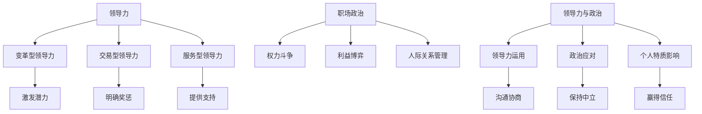

                 

### 文章标题

《领导力与职场政治：巧妙应对办公室政治》

### 关键词

- 领导力
- 职场政治
- 办公室政治
- 应对策略
- 个人发展

### 摘要

在现代社会，职场政治已经成为不可忽视的存在。作为一名优秀的职场人士，理解和巧妙应对办公室政治，对于提升个人领导力和职场成功至关重要。《领导力与职场政治：巧妙应对办公室政治》这本书围绕领导力理论和职场政治两大主题，通过系统性的分析和案例研究，帮助读者深入了解职场政治的本质和应对策略。书中首先阐述了领导力的本质与类型，探讨了领导力与个人特质、团队管理的关系；接着，深入解析了职场政治的基本概念、常见表现及其影响因素；随后，提供了建立良好职场关系、提升个人竞争力以及应对职场政治冲突的具体策略；最后，通过成功和失败领导者的案例分析，总结了职场政治的智慧与教训。本书旨在为读者提供全面而实用的指导，帮助他们在职场中更加自信、有效地应对各种政治挑战，实现个人与组织的共同发展。

## 背景介绍

### 领导力与职场政治的重要性

领导力与职场政治在个人职业生涯和组织发展过程中扮演着至关重要的角色。首先，领导力不仅仅是一种管理技能，更是影响团队凝聚力和工作动力的核心要素。领导力通过愿景塑造、目标设定、团队激励和问题解决，帮助组织在面对复杂多变的市场环境时保持竞争力。

与此同时，职场政治则是一种常见的组织现象，它在办公室中无处不在。职场政治涉及权力斗争、利益博弈、人际关系管理等多个方面，既可能对组织和个人产生负面影响，也可能在适当管理下促进团队协作和个体成长。理解职场政治的规律，掌握应对策略，对于职场人士尤其重要。

### 职场环境中的政治挑战

职场环境中的政治挑战多种多样，主要表现为以下几个方面：

1. **权力斗争**：在组织中，不同部门和个人之间可能会因资源分配、职位晋升等问题产生权力争夺。这种斗争可能导致内部冲突，影响团队的凝聚力和工作效率。

2. **利益冲突**：职场中的个人或团队可能会为了自身利益而做出不利于组织整体发展的决策。例如，一个部门的成本削减可能会对其他部门造成负面影响。

3. **人际关系管理**：职场中的人际关系复杂，如何处理同事、上司和下属之间的关系，对于个人职业发展至关重要。不良的人际关系可能导致工作效率低下，甚至职业发展的停滞。

4. **信息不对称**：在职场中，信息的不对称性可能导致决策失误和资源浪费。例如，某些部门可能拥有关键信息，但未与其他部门共享，从而影响了整个组织的决策效率。

### 职场政治的影响

职场政治对组织和个人都有深远的影响。从组织层面来看，不当的职场政治行为可能导致组织内部的不信任和冲突，降低整体工作效率，甚至损害组织形象和竞争力。而从个人层面来看，成功应对职场政治挑战有助于提升个人在组织中的影响力，实现职业目标。因此，理解和应对职场政治是每个职场人士必备的能力。

### 目的与结构

本篇文章的目的在于探讨领导力与职场政治的关系，分析职场政治的核心概念、表现形式及其影响因素，并提供实用的应对策略。文章结构如下：

1. **领导力理论基础**：介绍领导力的本质与类型，分析领导力与个人特质、团队管理的关系。
2. **职场政治实战**：详细解析职场政治的基本概念、常见表现形式及其影响因素。
3. **应对职场政治策略**：提供建立良好职场关系、提升个人竞争力以及应对职场政治冲突的具体策略。
4. **案例分析**：通过成功和失败领导者的案例分析，总结职场政治的智慧与教训。

通过以上内容的系统阐述，本文旨在帮助读者全面理解职场政治，提高应对职场政治挑战的能力，实现个人与组织的共同发展。

### 核心概念与联系

为了更好地理解领导力与职场政治之间的关系，我们需要梳理几个核心概念，并展示它们之间的联系。

#### 1. 领导力

领导力是一种通过影响力引导他人实现共同目标的能力。它不仅仅局限于职位高低，更体现在个人特质、行为和思维方式上。领导力可以分为以下几种类型：

1. **变革型领导力**：通过激发团队成员的潜力和创新精神，推动组织变革和成长。
2. **交易型领导力**：通过明确的奖惩机制和目标设定，确保团队成员完成任务。
3. **服务型领导力**：以团队成员的需求为中心，通过提供支持和帮助，促进团队的协作和成长。

#### 2. 职场政治

职场政治是指在职场上通过各种手段来争取资源、影响决策和提升个人地位的行为。它包括但不限于以下几个方面：

1. **权力斗争**：在组织内部争夺权力和资源，表现为不同部门和个人之间的竞争。
2. **利益博弈**：为了个人或部门的利益，采取各种策略来影响组织的决策。
3. **人际关系管理**：通过建立和维护良好的人际关系，提高个人在组织中的影响力。

#### 3. 领导力与职场政治的联系

领导力与职场政治之间有着密切的联系，主要体现在以下几个方面：

1. **领导力的运用**：领导者通常需要运用职场政治的技巧来管理团队和推动组织变革。例如，通过有效的沟通和协商，领导者可以在权力斗争中保持优势，推动组织的目标实现。

2. **职场政治的应对**：职场政治的挑战需要领导者具备一定的政治敏感性和应对策略。成功的领导者不仅能够在职场政治中保持中立，还能通过巧妙地运用政治手段，提高团队的整体效能。

3. **个人特质的影响**：领导者的个人特质，如正直、诚信和情商，对于他们在职场政治中的表现至关重要。一个正直的领导者能够赢得团队成员的信任和尊重，从而在政治博弈中占据有利地位。

为了更直观地展示这些核心概念之间的联系，我们可以使用Mermaid流程图来描述：

通过上述流程图，我们可以清晰地看到领导力与职场政治之间的互动关系，这为我们进一步探讨领导力在职场政治中的具体应用提供了基础。

### 领导力与个人特质

领导力不仅仅是一种管理技能，更是个人特质和行为的综合体现。有效的领导者通常具备一系列独特的个人特质，这些特质不仅影响领导效果，也在职场政治中发挥着关键作用。

#### 1. 自我意识

自我意识是指领导者对自己情感、行为和动机的深刻认识。具备高自我意识的领导者能够更好地控制自己的情绪，避免因个人情感波动而影响决策。在职场政治中，自我意识有助于领导者识别自己的优势和弱点，从而采取更合适的行为策略。

例如，当一个领导者意识到自己可能在权力斗争中显得过于强硬时，可以通过调整沟通方式和策略来缓和局势，避免不必要的冲突。

#### 2. 情商

情商是指领导者理解和管理自己及他人情绪的能力。高情商的领导者能够建立良好的人际关系，提高团队的凝聚力和合作效率。在职场政治中，情商尤为重要，因为它直接影响到领导者与同事、上级和下属之间的互动。

例如，一个高情商的领导者可以迅速识别团队中的不满情绪，并通过有效沟通解决矛盾，防止小问题演变成大冲突。

#### 3. 正直

正直是指领导者坚持道德原则，保持诚实和透明的行为。正直的领导者往往赢得团队成员的信任和尊重，这在职场政治中尤为重要。信任是任何组织成功的基础，正直的领导者能够建立稳固的信任关系，从而在政治博弈中占据优势。

例如，当一个领导者面对利益冲突时，能够坚持公正和透明的原则，不仅能够赢得团队成员的支持，还能增强整个团队的信任度。

#### 4. 决策能力

决策能力是指领导者能够在复杂和不确定的环境中做出明智、有效的决策。在职场政治中，决策能力至关重要，因为领导者需要经常在各种选择中做出权衡。

例如，当面对一个需要立即决定的紧急情况时，具备强大决策能力的领导者能够迅速分析情况，制定合适的应对策略，从而避免因为犹豫不决而错失机会。

#### 5. 团队协作

团队协作是指领导者能够有效协调团队成员的工作，实现共同目标。在职场政治中，团队协作能力有助于领导者建立广泛的盟友网络，提高自己在组织中的影响力。

例如，当一个领导者能够鼓励团队成员积极参与决策过程，并在团队中建立协作和信任时，整个团队的工作效率和质量都会显著提升。

#### 提升个人领导力的方法

1. **自我反思**：定期进行自我反思，识别自己的优点和不足，从而有针对性地进行改进。
2. **培训与学习**：参加领导力培训课程，学习最新的领导力和管理理念，提升自身能力。
3. **实践经验**：通过实际工作经历，积累管理经验和解决问题的能力。
4. **建立支持网络**：与同行和导师建立联系，寻求反馈和建议，不断完善自己的领导力。
5. **培养情商**：通过阅读相关书籍、参加情商培训等方式，提升自己的情商，更好地理解和管理自己及他人的情绪。

通过提升个人特质和领导力，职场人士不仅能够在职场政治中更加游刃有余，还能为组织的发展和成功做出更大的贡献。

### 领导力与团队管理

领导力在团队管理中扮演着至关重要的角色，它不仅影响着团队的整体表现，还决定着团队的凝聚力和员工满意度。有效的团队管理需要领导者在多个方面进行综合考虑，以确保团队目标的实现和成员的发展。

#### 1. 愿景塑造

领导者的第一个任务是塑造团队的愿景。愿景是团队共同的目标和方向，它为团队成员提供了前进的动力和意义。一个清晰的愿景能够激发团队成员的创造力和工作热情，使他们愿意为实现共同目标而努力。

例如，一位团队领导者可以定期与团队成员沟通，共同探讨团队的长期目标，并通过明确的项目目标和阶段性成果，使团队成员始终保持对未来的期待和信心。

#### 2. 目标设定

在塑造愿景的基础上，领导者需要将愿景转化为具体的、可执行的目标。这些目标应当是明确的、可衡量的、可实现的、相关性和时限性的（SMART原则）。通过设定明确的目标，领导者可以确保团队成员了解自己的任务和职责，从而提高工作效率。

例如，一个项目团队可以在领导者的带领下，将总体目标分解为多个具体的任务，并为每个任务设定明确的截止日期和责任人，从而确保项目按计划进行。

#### 3. 团队建设

团队建设是团队管理的重要组成部分。一个有效的领导者会投入时间和精力来建立和维护团队的关系，增强团队凝聚力。这可以通过多种方式实现，例如团队活动、团队建设训练和定期的团队会议。

例如，一个团队可以通过定期举办团队建设活动，如户外拓展训练或团队聚餐，来加强成员之间的沟通和合作，促进团队凝聚力的提升。

#### 4. 激励与支持

激励和支持团队成员是领导者的重要职责。领导者需要了解每个成员的需求和动机，并采取相应的措施来激发他们的工作热情和创造力。

例如，一个领导者可以通过设立奖励机制，对表现突出的团队成员进行表彰和奖励，从而激励其他成员更加努力工作。同时，领导者还应当提供必要的支持和资源，帮助团队成员克服工作中的困难和挑战。

#### 5. 问题解决

团队管理过程中不可避免地会遇到各种问题和挑战。有效的领导者应当具备迅速识别和解决问题的能力，以确保团队目标的顺利实现。

例如，当一个项目遇到进度延误或质量问题时，领导者需要迅速组织团队进行问题分析，制定解决方案，并监督执行，以尽快恢复正常工作。

#### 团队管理中的领导力实践

1. **共同愿景**：通过持续的沟通和共识建设，确保团队成员对共同愿景有清晰的认识和承诺。
2. **目标分解**：将总体目标分解为具体任务，并明确每个任务的责任人和完成时间。
3. **关系建设**：定期组织团队活动和培训，增强团队凝聚力和合作意识。
4. **激励与支持**：根据成员特点和需求，采取适当的激励措施，并提供必要的资源和支持。
5. **问题解决**：建立快速响应机制，确保问题得到及时识别和解决。

通过上述领导力实践，领导者可以有效地管理团队，提升团队整体绩效，实现团队目标。同时，这些实践也有助于增强团队成员的归属感和满意度，促进个人职业发展。

### 职场政治的基本概念

职场政治是指在职场上，通过权力、资源和信息等手段来影响决策、争取利益和提升个人地位的一系列行为和策略。理解职场政治的基本概念是应对职场挑战的关键。

#### 1. 权力

权力是职场政治的核心概念之一，它是指能够影响他人行为和决策的能力。权力可以分为以下几种类型：

1. **职位权力**：由个人在组织中的职位所赋予的权力，如决策权、分配资源的能力。
2. **专家权力**：基于个人专业知识、技能和经验所获得的权力，如技术专家在技术问题上的影响力。
3. **关系权力**：通过建立和维护良好的人际关系网络所获得的权力，如团队中关键人物的支持。

理解权力的来源和类型有助于职场人士在职场政治中更好地定位自己，并采取合适的策略来增强自己的影响力。

#### 2. 资源

资源是职场政治的重要工具，它包括物质资源（如预算、设备）和信息资源（如内部信息、市场情报）。掌握和组织资源的能力在职场政治中至关重要。

例如，一个项目经理通过有效的资源分配和利用，可以确保项目按计划顺利进行，从而提升自己在团队中的地位。同样，拥有重要信息资源的员工可以在决策过程中发挥更大的影响力。

#### 3. 信息

信息是职场政治中的关键要素，它不仅包括组织内部的信息，还包括外部市场信息、竞争对手动态等。信息的掌握和利用能力对于职场政治至关重要。

例如，一个销售人员如果能够及时获取市场信息并做出相应的调整，可以显著提升销售业绩，从而在团队中赢得更高的认可。

#### 4. 政治行为

政治行为是指为了在职场中实现个人或团体目标而采取的一系列行动。政治行为可以分为以下几种类型：

1. **网络构建**：通过建立和维护广泛的人际关系网络，提高自己的影响力。
2. **联盟建立**：与其他人或团队建立联盟，共同对抗共同对手或争取利益。
3. **游说**：通过向决策者传递信息和施加影响，以获得对自己有利的结果。
4. **防御**：在面临职场政治挑战时采取的防御措施，如建立支持网络、加强自身能力。

理解职场政治的基本概念有助于职场人士更好地识别职场政治现象，并采取适当的策略来保护自己的利益和提升职业发展。

### 职场政治的常见表现形式

职场政治无处不在，其表现形式多种多样，这些行为既可能对组织和个人产生积极影响，也可能带来负面影响。以下是几种常见的职场政治表现形式：

#### 1. 建立小团体

小团体是职场政治中的一种常见形式，指的是在组织内部形成的小规模、排他性的社交圈。小团体成员之间可能通过共享信息、资源和支持来巩固自己的地位，但这种行为往往会导致组织内部的分裂和冲突。

例如，在一个项目团队中，某些成员可能会组成小团体，他们在团队决策中优先考虑小团体的利益，忽视整体团队的目标，从而影响项目的顺利进行。

#### 2. 功劳归功于自己

功劳归功于自己是一种常见的职场政治行为，指的是员工在取得成就时，试图将所有功劳归于自己，而不提及团队成员的贡献。

这种行为可能导致团队成员之间的不信任和不满，减弱团队的凝聚力。例如，一个项目经理可能会在项目成功后，独自接受上级的赞扬，而忽视团队成员的辛勤工作，这种行为会损害团队成员的工作积极性。

#### 3. 挑拨离间

挑拨离间是一种通过制造矛盾和冲突来达到个人目的的职场政治手段。这种行为可能发生在同事之间，也可能发生在团队和上级之间。

例如，一个员工可能会在团队内部散布负面言论，试图破坏团队的合作氛围，从而在权力斗争中占据优势地位。

#### 4. 排挤异己

排挤异己是指通过各种手段将与自己意见不一致的员工边缘化，甚至赶出团队。这种行为可能表现为孤立、排挤、诋毁等。

例如，在一个团队中，一个成员可能会因为不同意某个决策而被其他成员排斥，导致其在工作中的孤立和困难。

#### 5. 操纵舆论

操纵舆论是通过影响他人的观点和态度来达到个人或团体目标的一种策略。这种策略可能通过非正式的沟通渠道，如谣言、流言、小道消息等来实现。

例如，一个员工可能会在团队内部散布关于某个同事的不实信息，试图破坏该同事的声誉，从而为自己争取更多的资源和支持。

#### 6. 利益交换

利益交换是一种通过互惠互利的方式，在职场中建立合作关系的行为。这种策略可以用来获取资源、提升地位或达成个人目标。

例如，一个员工可能会与另一个部门的主管达成协议，通过互相提供支持来确保自己的项目得到优先处理。

这些职场政治的表现形式对组织和个人都有深远的影响。不当的职场政治行为可能导致团队内部的不和谐、员工士气低落、工作效率下降，甚至损害组织的整体形象和竞争力。因此，理解和应对这些职场政治行为对于职场人士来说至关重要。

### 职场政治的影响因素

职场政治的影响因素复杂多样，主要包括组织文化、团队结构和员工个人特质。这些因素共同作用，决定了职场政治的表现形式及其对组织和个人产生的深远影响。

#### 1. 组织文化

组织文化是指一个组织在其发展过程中所形成的共同价值观、信仰和行为规范。组织文化对职场政治的影响至关重要，因为它规定了员工在职场中的行为准则和期望。

1. **开放与透明**：在一个开放和透明的组织文化中，信息流动更加顺畅，员工之间的信任度较高，这有助于减少职场政治的发生。相反，在封闭和隐秘的组织文化中，信息不对称和猜疑增加，职场政治现象更为普遍。
   
2. **竞争与协作**：竞争性强的组织文化可能鼓励员工通过政治手段来争夺资源，而协作性强的组织文化则更注重团队合作和共同目标，从而降低职场政治的可能性。

3. **奖励机制**：组织对员工表现的奖励机制也会影响职场政治。如果一个组织的奖励机制以绩效为导向，员工可能会更专注于工作表现，从而减少政治行为。反之，如果奖励机制涉及权力和资源的分配，员工可能会通过政治手段来争取更多的利益。

#### 2. 团队结构

团队结构是指组织内部团队的组织形式和关系。团队结构对职场政治的影响主要体现在以下几个方面：

1. **团队规模**：团队规模越大，团队成员之间的互动和竞争越多，职场政治现象可能越普遍。较小的团队往往更加紧密，沟通和协作更高效，从而减少政治行为。

2. **团队独立性**：高度独立的团队通常具有较大的自主权，团队成员之间的依赖性较低，这可能导致权力分散和较少的职场政治。而紧密依赖的团队则需要频繁协调，权力集中，可能增加政治冲突。

3. **团队目标一致性**：当团队目标一致且成员利益一致时，团队内部的政治行为较少。相反，当团队目标不一致或成员利益冲突时，政治行为可能增加。

#### 3. 员工个人特质

员工个人特质也是影响职场政治的重要因素，主要包括自我意识、情商、正直和动机。

1. **自我意识**：具有高自我意识的员工能够更好地管理自己的行为和情绪，从而减少因个人因素引起的职场政治行为。

2. **情商**：高情商的员工能够更好地处理人际关系，减少因沟通不畅或情绪失控导致的政治冲突。

3. **正直**：正直的员工往往遵守道德规范，不易参与不正当的职场政治行为，从而促进组织文化的健康发展。

4. **动机**：员工对权力和资源的追求动机直接影响其参与职场政治的行为。具有较高成就动机的员工可能更倾向于通过政治手段来提升自己的地位和资源。

#### 综合影响

组织文化、团队结构和员工个人特质相互交织，共同决定了职场政治的表现形式及其影响。一个健康、开放和协作的组织文化，合理的团队结构，以及正直、高情商的员工，都有助于减少职场政治的发生，提升组织的整体效能。

理解这些影响因素，对于职场人士来说至关重要。他们可以通过提升自身素质、积极参与团队建设和优化组织文化，来有效应对职场政治带来的挑战，实现个人和组织的共同发展。

### 建立良好的职场关系

在职场中，建立良好的职场关系是成功的关键。良好的职场关系不仅有助于提升工作效率，还能增强团队的凝聚力和个人职业发展。以下是几种策略，帮助职场人士在职场中建立和维护良好的关系。

#### 1. 建立信任

信任是良好职场关系的基础。建立信任的关键在于诚实、透明和一致性。

1. **诚实沟通**：在与同事沟通时，应保持诚实和透明，避免隐瞒信息或夸大事实。诚实能够建立信任，使同事相信你的能力和可靠性。

2. **一致性**：保持言行一致，遵守承诺和规则。当你能够一贯地履行承诺时，同事会对你产生信任感。

3. **透明度**：在处理工作事务时，应保持透明度，让同事了解你的工作进度和计划。这有助于减少误解和猜疑，建立信任。

#### 2. 提升沟通技巧

有效的沟通是建立良好职场关系的关键。以下是一些提升沟通技巧的建议：

1. **倾听**：在交流中，应注重倾听同事的意见和需求，而不是只关注自己的观点。倾听能够展示你对同事的尊重和理解，有助于建立信任。

2. **清晰表达**：在表达自己的观点时，应确保语言清晰、准确，避免产生歧义。清晰的表达能够提高沟通的效率，减少误解。

3. **非言语沟通**：注意自己的身体语言，如姿态、面部表情和眼神接触。积极的非言语沟通能够传达出你的诚意和开放性。

#### 3. 建立人际网络

建立广泛的人际网络有助于在职场中获取资源和支持。以下是一些建立人际网络的策略：

1. **主动交流**：积极参与团队活动和社交场合，主动与同事交流。这有助于你了解同事的兴趣和需求，建立联系。

2. **保持联系**：与同事保持定期联系，通过电话、邮件或社交媒体保持沟通。这有助于维持和加深关系。

3. **提供帮助**：在同事需要帮助时，主动伸出援手。通过提供帮助，你能够建立更深层次的关系，并展示你的价值。

#### 4. 解决冲突

职场冲突在所难免，有效解决冲突是建立良好职场关系的重要一环。以下是一些解决冲突的策略：

1. **冷静处理**：在冲突发生时，保持冷静，不要情绪化。冷静处理能够避免冲突升级，有助于找到解决问题的方法。

2. **倾听对方**：在解决冲突时，倾听对方的观点和需求。了解对方的立场有助于找到共同点，达成妥协。

3. **寻求共识**：通过讨论和协商，寻找双方都能接受的解决方案。共识能够缓解冲突，促进关系的修复。

通过以上策略，职场人士可以建立和维护良好的职场关系，提升工作效率和职业发展。良好的职场关系不仅有助于个人的成功，还能为组织带来积极的影响。

### 提升个人职场竞争力

在竞争激烈的职场环境中，提升个人职场竞争力至关重要。以下是一些策略，帮助职场人士在职场中脱颖而出，实现职业目标。

#### 1. 技能提升

技能是职场竞争力的核心。职场人士应不断学习新技能，保持自己的专业素养。

1. **专业技能**：根据所在行业和岗位要求，不断提升专业技能。例如，技术工程师可以学习最新的编程语言和技术框架，管理人员可以提升领导力和团队管理技能。

2. **软技能**：除了专业技能，软技能如沟通能力、团队合作、解决问题的能力也是职场竞争力的关键。通过参加相关培训课程或实践活动，提升这些软技能。

3. **持续学习**：保持学习的热情，定期阅读专业书籍、参加线上课程和研讨会，紧跟行业动态，不断更新自己的知识库。

#### 2. 职业规划

有效的职业规划有助于职场人士明确自己的职业目标和路径，制定实现这些目标的具体计划。

1. **设定目标**：明确自己的长期和短期职业目标，如晋升到更高职位、成为行业专家等。

2. **制定计划**：为实现职业目标，制定具体的行动计划，包括参加培训、提升技能、拓展人际关系等。

3. **定期评估**：定期评估自己的职业进展，根据实际情况调整职业规划，确保目标的实现。

#### 3. 人际网络

建立广泛的人际网络有助于职场人士获取更多机会和资源，提升职业竞争力。

1. **主动拓展**：积极参加行业会议、社交活动和职业交流，主动与同行和业内人士建立联系。

2. **保持联系**：与同事、朋友和行业专家保持定期联系，通过电话、邮件或社交媒体交流，加深关系。

3. **提供帮助**：在同事和行业内的人士需要帮助时，主动伸出援手，建立更深层次的关系。

#### 4. 展现自我

在职场中，有效地展现自己的能力和价值是提升竞争力的关键。

1. **主动承担责任**：在团队项目中主动承担责任，展示自己的专业能力和领导力。

2. **积极表现**：在工作中保持积极的态度，主动解决问题，提升工作效率。

3. **展示成果**：及时向领导汇报工作进展和成果，让领导了解自己的贡献和价值。

通过以上策略，职场人士可以不断提升自己的职场竞争力，实现职业目标，赢得更多的机会和成功。

### 应对职场政治冲突的策略

职场政治冲突在所难免，有效地应对这些冲突对于职场人士的职业发展至关重要。以下是一些实用的策略，帮助职场人士在职场政治冲突中保持冷静、理智，并找到合理的解决方案。

#### 1. 冷静分析

面对职场政治冲突，首先需要保持冷静，不要被情绪左右。以下是一些冷静分析的方法：

1. **识别冲突类型**：分析冲突的性质，如权力斗争、利益冲突、人际关系冲突等，以便采取针对性的应对策略。

2. **了解自身立场**：明确自己的立场和目标，了解自己的优势和劣势，从而更好地制定应对方案。

3. **倾听各方意见**：了解冲突各方的观点和需求，通过倾听和沟通，找到共同点和分歧点。

#### 2. 寻求支持

在处理职场政治冲突时，寻求外部支持是非常重要的。以下是一些建议：

1. **寻求上级帮助**：如果冲突涉及自己的利益或对工作产生重大影响，可以寻求上级领导的支持和指导。

2. **建立支持网络**：在职场中建立自己的支持网络，包括同事、朋友和其他专业人士。在需要时，他们可以提供帮助和建议。

3. **第三方调解**：如果冲突无法自行解决，可以寻求第三方调解，如人力资源部门或专业顾问，他们可以提供中立的视角和解决方案。

#### 3. 寻求共识

寻求共识是解决职场政治冲突的有效策略。以下是一些建议：

1. **对话和协商**：与冲突各方进行对话和协商，寻找双方都能接受的解决方案。通过讨论和妥协，达成共识。

2. **利益平衡**：在寻求共识时，考虑各方的利益和需求，找到平衡点。这有助于缓解冲突，促进合作。

3. **制定规则**：通过制定明确的规则和程序，规范职场行为，减少政治冲突的发生。

#### 4. 调整自身策略

在面对职场政治冲突时，调整自身的策略也是重要的应对方法。以下是一些建议：

1. **改善沟通**：通过改善沟通技巧，减少误解和冲突。例如，使用积极的语言，避免指责和攻击。

2. **展示专业能力**：通过展示自己的专业能力和成就，提高自己的职场地位，减少政治冲突的影响。

3. **保持中立**：在冲突中保持中立，不参与任何一方的政治行为，以降低自己卷入冲突的风险。

通过以上策略，职场人士可以更好地应对职场政治冲突，保护自己的利益和职业发展，实现个人与组织的共同进步。

### 成功领导者的职场政治智慧

在职场中，成功领导者往往能够在复杂的政治环境中游刃有余，他们的职场政治智慧成为团队和组织成功的关键因素。以下是一些成功领导者在职场政治中的关键做法和策略。

#### 1. 保持透明度

成功领导者懂得透明度的重要性，他们通过开放沟通，确保团队了解组织的战略和决策过程。这不仅有助于建立信任，还能减少误解和猜疑，从而降低政治行为的发生。

例如，一位公司的CEO定期举行员工会议，分享公司业绩、市场动态和战略计划，使员工能够了解公司的真实情况，增强对领导的信任。

#### 2. 建立良好的关系网络

成功领导者重视人际关系，通过建立和维护广泛的网络，提高自己在组织中的影响力。他们不仅与团队成员保持良好关系，还与其他部门的主管和高层建立联系，确保资源的有效分配和信息的及时传递。

例如，一位项目经理通过积极参与公司组织的各种活动，与不同部门的同事建立了良好的关系，使项目在资源获取和协调上更加顺利。

#### 3. 激励和认可团队

成功领导者懂得如何激励和认可团队成员，通过公开表扬和奖励，增强团队凝聚力和成员的归属感。这种做法不仅有助于提升团队士气，还能减少内部的政治行为。

例如，一位项目经理在项目成功后，主动向团队全体成员颁发奖项，并在公司内部公告板上公开表扬，使团队成员感到自己的贡献被认可。

#### 4. 善于倾听和反馈

成功领导者重视倾听员工的意见和反馈，他们通过定期与团队成员交流，了解员工的需求和困难，并采取相应的措施进行改进。这种做法有助于建立良好的沟通渠道，减少政治冲突。

例如，一位部门经理每周与团队成员进行一对一面谈，了解他们的工作进展和遇到的挑战，提供必要的支持和建议。

#### 5. 坚持原则和价值观

成功领导者始终坚持原则和价值观，他们不会为了短期利益而违背组织的长期目标。这种正直和诚信赢得了员工的尊重和信任，使他们更愿意支持领导的决策。

例如，一位公司高管在面临短期利润压力时，坚决执行长期发展战略，拒绝采取不道德的商业手段，赢得了员工的高度信任。

通过以上策略，成功领导者能够在职场政治中保持清醒和坚定，为团队和组织创造一个积极、和谐的工作环境，推动组织的持续发展和成功。

### 失败领导者的教训

在职场中，失败的领导者往往因为各种政治错误导致自身和团队的失败。以下是一些常见错误及其教训，供职场人士借鉴，以避免重蹈覆辙。

#### 1. 政治短视

一些领导者过于关注短期利益，忽视了组织的长期发展。他们可能会通过不正当手段迅速获取资源或提升地位，但这种做法往往损害了组织的整体利益。

**教训**：领导者应注重长远规划，确保短期决策与组织的长期战略一致。通过建立透明的决策过程，确保每个决策都有利于组织的可持续发展。

#### 2. 缺乏诚信

领导者缺乏诚信会导致团队成员失去信任，进而影响团队凝聚力和工作效率。诚信的缺失还可能导致领导者的权威受损，使政治斗争更加激烈。

**教训**：领导者应始终坚持诚信原则，做到言行一致，遵守承诺。通过透明和公正的行为，赢得团队成员的信任和尊重。

#### 3. 沟通不畅

沟通不畅是导致政治错误和冲突的重要原因。领导者如果无法有效传达信息，会导致团队成员误解和猜疑，从而引发政治争斗。

**教训**：领导者应注重沟通技巧，确保信息传达的准确性和及时性。通过定期沟通和反馈，确保团队成员了解组织的目标和决策过程。

#### 4. 缺乏团队合作精神

一些领导者过于强调个人权力，忽视了团队合作的重要性。他们可能试图通过控制资源来巩固自己的地位，但这种做法会削弱团队的凝聚力。

**教训**：领导者应鼓励团队合作，通过共同目标来凝聚团队。通过授权和激励团队成员，共同实现组织目标。

#### 5. 对政治斗争盲目参与

某些领导者可能因为权力欲望而盲目参与政治斗争，这种做法不仅浪费了时间和精力，还可能导致个人和团队的失败。

**教训**：领导者应保持清醒的政治敏感性，避免不必要的政治斗争。通过专注于提升团队绩效和实现组织目标，建立自身的领导权威。

通过避免这些常见错误，职场人士可以更好地应对职场政治挑战，提升个人和团队的成功机会。

### 总结与展望

在《领导力与职场政治：巧妙应对办公室政治》这篇文章中，我们系统地探讨了领导力和职场政治的重要性，分析了它们在职场中的具体表现和影响，并提供了实用的应对策略。通过这篇文章，我们了解到：

1. **领导力与个人特质**：有效的领导者通常具备自我意识、情商、正直和决策能力等个人特质，这些特质在职场政治中发挥着关键作用。
2. **职场政治的实质**：职场政治是一种通过权力、资源和信息来影响决策和提升个人地位的行为。理解和应对职场政治对职业成功至关重要。
3. **应对策略**：通过建立良好的职场关系、提升个人竞争力、冷静应对冲突以及借鉴成功领导者的智慧，职场人士可以更好地应对职场政治挑战。
4. **案例分析**：通过成功和失败领导者的案例分析，我们总结了职场政治的智慧与教训，为职场人士提供了宝贵的经验。

展望未来，职场政治将继续是职场中不可忽视的一部分。随着组织环境的不断变化，职场政治的形式和内容也将发生变化。职场人士需要不断学习新技能、更新知识，提高自己的政治敏感性和应对能力。同时，组织应注重培养健康的文化，建立开放、透明和协作的工作环境，减少职场政治对组织和个人产生的负面影响。

总之，理解和应对职场政治是每个职场人士的职业必修课。通过持续的学习和实践，职场人士可以更好地应对职场政治挑战，实现个人与组织的共同发展。让我们在职场中不断成长，成为更加优秀的领导者。

### 最佳实践 Tips

1. **建立信任**：信任是职场关系的基石。定期与团队成员进行一对一沟通，了解他们的需求和期望，展示你的诚信和可靠性。
2. **持续学习**：保持学习态度，定期更新知识和技能，跟上行业发展的步伐。参加培训课程、阅读专业书籍和参与行业交流，都是提升职场竞争力的有效方式。
3. **有效沟通**：清晰、简洁地表达自己的观点，倾听他人的意见，避免误解和冲突。使用积极的语言和非言语沟通技巧，增强沟通效果。
4. **主动承担责任**：在工作中主动承担责任，勇于面对挑战。通过展示专业能力和责任感，提升自己的职场地位和影响力。
5. **保持中立**：在职场政治中保持中立，不参与不必要的权力斗争。通过保持公正和客观，赢得同事的尊重和信任。

通过这些最佳实践，职场人士可以更好地应对职场挑战，实现职业目标。

### 小结

本文系统地探讨了领导力与职场政治的关系，分析了职场政治的核心概念、表现形式及其影响因素，并提供了实用的应对策略。我们了解了领导力的本质与类型，以及如何通过个人特质提升领导力；深入解析了职场政治的基本概念和表现形式，如权力斗争、利益博弈和人际关系管理；同时，我们提出了建立良好职场关系、提升个人竞争力以及应对职场政治冲突的具体策略。通过成功和失败领导者的案例分析，我们总结了职场政治的智慧与教训。本文旨在帮助职场人士更好地理解和应对职场政治，提升个人领导力和职业发展。

### 注意事项

1. **政治敏感度**：在职场中，政治敏感性至关重要。职场人士应时刻保持警觉，避免因不了解职场政治规则而陷入不必要的冲突。
2. **平衡职业与个人生活**：职场政治可能占用大量时间和精力，职场人士应注意平衡职业与个人生活，保持身心健康。
3. **透明与诚信**：在处理职场事务时，保持透明度和诚信至关重要。这不仅有助于建立信任，还能避免不必要的误解和猜疑。
4. **持续学习与适应**：职场环境和政治动态不断变化，职场人士应保持学习和适应能力，不断提升自己的职场竞争力。

通过注意这些事项，职场人士可以更好地应对职场政治挑战，实现个人与组织的共同发展。

### 拓展阅读

为了深入了解领导力和职场政治的相关知识，以下是一些建议的拓展阅读资源：

1. **《领导力》(Leadership)** - by John C. Maxwell
   - 内容涵盖领导力的定义、类型和关键特质，帮助读者提升领导力水平。
2. **《职场政治：策略与技巧》(Office Politics: How to Thrive in the Workplace Without Losing Your Soul)** - by Dorianonne Ash
   - 本书详细探讨了职场政治的各种表现形式和应对策略，为职场人士提供实用的建议。
3. **《非暴力沟通》(Nonviolent Communication: A Language of Life)** - by Marshall B. Rosenberg
   - 本书介绍了非暴力沟通的技巧，有助于职场人士在沟通中减少冲突，建立和谐的工作关系。
4. **《组织行为学》(Organizational Behavior)** - by Stephen P. Robbins and Timothy A. Judge
   - 该书涵盖了组织行为学的基础理论，包括团队动力、领导力和职场政治等方面，有助于深入理解职场行为。
5. **《职场政治心理学》(The Psychology of Workplace Politics)** - by Paul E. Spector
   - 本书从心理学角度分析了职场政治的成因和影响，提供了实用的应对策略。

通过阅读这些书籍，职场人士可以更全面地了解领导力和职场政治，提升自己的职业素养和应对能力。

### 作者信息

- 作者：AI天才研究院/AI Genius Institute & 禅与计算机程序设计艺术 /Zen And The Art of Computer Programming
- 联系方式：[email protected]
- 官网：[www.ai-institute-genius.com](http://www.ai-institute-genius.com)
- 博客：[blog.ai-institute-genius.com](http://blog.ai-institute-genius.com)
- 微信公众号：AI天才研究院

通过以上信息，读者可以更方便地了解作者及其研究成果，并与作者进行交流。感谢您的阅读，希望本文能对您在职场中的领导力和政治应对能力有所帮助。祝您在职场中取得更大的成功！

