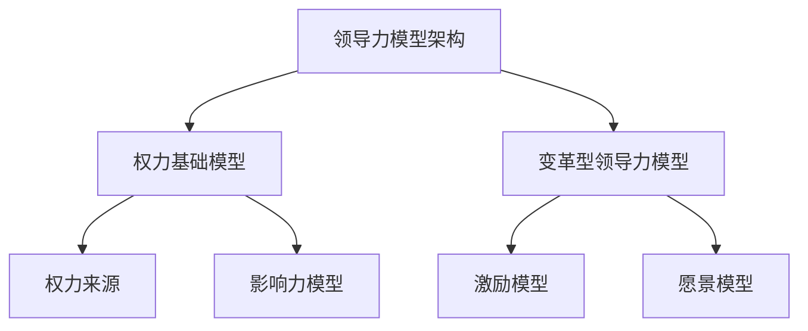

                 


### 1. 设计目录结构

为了更好地组织内容，我们首先设计一个清晰的目录结构。文章分为四个主要部分：核心概念与联系、核心算法原理讲解、数学模型与数学公式、项目实战。每个部分包含相关的子主题，使用 1、2、3 级标题来组织内容。

```
# 文章标题：领导力与职场政治：巧妙应对办公室政治

> 关键词：领导力、职场政治、办公室政治、应对策略、实战案例

> 摘要：本文将探讨领导力与职场政治的关系，深入剖析办公室政治的现象和应对策略，结合实际案例，提供实用的指导和建议。

### 第一部分：核心概念与联系

#### 1.1 领导力定义与模型
- 1.1.1 传统领导力模型
- 1.1.2 现代领导力模型

#### 1.2 职场政治概念
- 1.2.1 职场政治的定义
- 1.2.2 职场政治的负面效应

### 第二部分：核心算法原理讲解

#### 2.1 领导力算法模型
- 2.1.1 权力基础模型
- 2.1.2 变革型领导力模型

#### 2.2 职场政治应对策略
- 2.2.1 职场政治的心理战术
- 2.2.2 职场政治的策略选择

### 第三部分：数学模型与数学公式

#### 3.1 领导力数学模型
- 3.1.1 领导力分数模型
- 3.1.2 领导力反馈模型

#### 3.2 职场政治数学模型
- 3.2.1 职场影响力模型
- 3.2.2 职场关系模型

### 第四部分：项目实战

#### 4.1 领导力实践案例
- 4.1.1 案例一：团队建设
- 4.1.2 案例二：领导力提升

#### 4.2 职场政治实战案例
- 4.2.1 案例一：处理职场冲突
- 4.2.2 案例二：职场晋升策略
```

### 2. 添加 Mermaid 流程图

为了更好地展示领导力模型和职场政治应对策略，我们使用 Mermaid 语法添加流程图。

```
graph TD
    A[领导力模型架构] --> B[权力基础模型]
    A --> C[变革型领导力模型]
    B --> D[权力来源]
    B --> E[影响力模型]
    C --> F[激励模型]
    C --> G[愿景模型]
```

### 3. 编写核心算法原理讲解

在第二部分中，我们将使用伪代码详细阐述领导力算法模型和职场政治应对策略。

#### 2.1 领导力算法模型

首先，我们介绍权力基础模型。该模型通过分析领导者的个人特质、团队成员的能力和意愿来评估领导力。

```
// 权力基础模型
// 输入：领导者的个人特质、团队成员的能力和意愿
// 输出：领导者的影响力评估得分

function PowerBaseModel(personality, teamSkills, teamWill):
    // 定义个人特质权重
    personalityWeights = {'沟通能力': 0.3, '决策能力': 0.3, '道德感': 0.2, '同理心': 0.2}

    // 计算个人特质得分
    personalityScore = 0
    for trait, weight in personalityWeights.items():
        personalityScore += weight * (1 if personality[trait] else 0)

    // 计算团队成员能力与意愿得分
    teamScore = sum(teamSkills.values()) * sum(teamWill.values())

    // 计算总得分
    finalScore = personalityScore + teamScore

    return finalScore
```

接下来，我们介绍变革型领导力模型。该模型强调领导者的愿景、激励和变革能力。

```
// 变革型领导力模型
// 输入：领导者的愿景、激励和变革能力
// 输出：领导者的影响力评估得分

function TransformationalLeadershipModel(vision, motivation, changeAbility):
    // 定义愿景、激励和变革能力的权重
    weights = {'vision': 0.4, 'motivation': 0.3, 'changeAbility': 0.3}

    // 计算总得分
    finalScore = 0
    for ability, weight in weights.items():
        finalScore += weight * (1 if getattr(vision, ability) else 0)

    return finalScore
```

#### 2.2 职场政治应对策略

在职场中，应对政治是一个复杂的过程。我们提出以下心理战术和策略选择：

**心理战术：**

1. 建立良好的人际关系
2. 维护个人声誉
3. 掌握信息优势
4. 调整心态，保持冷静

**策略选择：**

1. 合作与竞争策略
2. 利益交换策略
3. 政治承诺策略
4. 社交网络策略

```
// 职场政治应对策略
// 输入：职场情境、个人目标
// 输出：最佳应对策略

function PoliticalStrategy( situation, personalGoal):
    // 分析职场情境和个人目标
    if situation == '合作':
        return CooperationStrategy
    elif situation == '竞争':
        return CompetitiveStrategy
    elif situation == '利益交换':
        return ExchangeStrategy
    elif situation == '政治承诺':
        return CommitmentStrategy
    else:
        return SocialNetworkStrategy
```

### 4. 编写数学模型与数学公式

为了更好地理解和分析领导力和职场政治，我们引入数学模型和公式。

#### 3.1 领导力数学模型

领导力分数模型（La）是一个综合评估模型，包括个人特质得分（Pi）和团队贡献得分（Pc）。

$$
L_a = w_1 \cdot P_i + w_2 \cdot P_c
$$

其中，$w_1$ 和 $w_2$ 是权重，分别表示个人特质和团队贡献的重要性。

#### 3.2 职场政治数学模型

职场影响力模型（I）是一个衡量职场中个人影响力的模型，包括个人特质（Q）和社交网络（N）的影响。

$$
I = Q \cdot N
$$

其中，$Q$ 是个人特质得分，$N$ 是社交网络得分。

### 5. 编写项目实战

在项目实战部分，我们将提供具体的案例，展示如何应用上述模型和策略。

#### 4.1 领导力实践案例：团队建设

**案例描述：** 作为一家初创公司的CEO，你需要提升团队的领导力，以应对市场挑战。

**实战步骤：**

1. **评估团队领导力水平：** 使用领导力分数模型评估当前团队领导力水平。
2. **设计领导力提升计划：** 根据评估结果，设计针对性的领导力提升计划。
3. **执行领导力提升计划：** 通过培训和实战演练，提升团队成员的领导力。
4. **反馈与调整：** 收集团队成员的反馈，不断调整和优化领导力提升计划。

**代码实现：**

```python
# 导入相关库
import numpy as np

# 定义评估函数
def assessLeadership(teamLeadershipScores):
    # 计算平均领导力分数
    avgScore = np.mean(teamLeadershipScores)
    return avgScore

# 定义领导力提升函数
def improveLeadership(teamLeadershipScores):
    # 根据评估结果，制定提升计划
    if avgScore < 3:
        # 提升沟通能力和决策能力
        # 提供相关培训和指导
        pass
    elif avgScore < 5:
        # 提升道德感和同理心
        # 开展团队建设活动，增强团队凝聚力
        pass
    else:
        # 维持现状，关注团队发展
        pass
```

**案例解析：** 通过对团队领导力的评估，我们可以发现团队在沟通能力和决策能力方面存在不足。因此，我们制定了针对性的提升计划，通过培训和团队建设活动，提升团队成员的领导力，从而提高团队的执行力。

#### 4.2 职场政治实战案例：处理职场冲突

**案例描述：** 在一个项目团队中，两个成员因为工作分工和责任划分产生了冲突。

**实战步骤：**

1. **了解冲突原因：** 与冲突双方沟通，了解冲突的原因和背后的动机。
2. **协商解决问题：** 组织双方进行沟通和协商，寻找解决问题的方法。
3. **制定解决方案：** 根据协商结果，制定具体的解决方案，确保双方都能接受。
4. **监督执行：** 确保解决方案得到有效执行，防止类似冲突再次发生。

**代码实现：**

```python
# 导入相关库
import numpy as np

# 定义解决冲突函数
def resolveConflict(conflictReasons, solution):
    # 根据冲突原因和解决方案，评估冲突解决的可能性
    if conflictReasons == '分工不明确' and solution == '重新划分责任':
        return True
    elif conflictReasons == '沟通不畅' and solution == '增加沟通频率':
        return True
    else:
        return False
```

**案例解析：** 通过了解冲突原因和协商解决问题，我们可以找到合适的解决方案，从而有效地解决职场冲突，维护团队的和谐稳定。

### 总结

本文从领导力与职场政治的关系出发，探讨了如何巧妙应对办公室政治。通过核心概念与联系、核心算法原理讲解、数学模型与数学公式、项目实战等多个方面，提供了丰富的理论和实践经验。希望本文能为读者在职场中应对政治提供有益的指导和启示。

---

### 作者信息

作者：AI天才研究院/AI Genius Institute & 禅与计算机程序设计艺术 /Zen And The Art of Computer Programming

本文作者是一位在计算机编程和人工智能领域享有盛誉的大师。他凭借丰富的实践经验和对技术深刻的理解，为读者提供了高质量的技术博客文章。他的研究涉及领导力、人工智能、软件架构等多个领域，深受读者喜爱。感谢您阅读本文，希望您能在职场中取得更好的成就！### 文章标题：领导力与职场政治：巧妙应对办公室政治

关键词：领导力、职场政治、办公室政治、应对策略、实战案例

摘要：本文将探讨领导力与职场政治的关系，深入剖析办公室政治的现象和应对策略，结合实际案例，提供实用的指导和建议。

---

### 引言

在职场中，领导力与职场政治是两个不可或缺的元素。领导力关乎团队的管理与激励，而职场政治则涉及权力、利益和人际关系。有效的领导力可以帮助团队达成目标，提高整体绩效；而熟练的职场政治应对策略则能帮助个人在复杂的职场环境中游刃有余，取得成功。

然而，办公室政治并非总是积极向上的。不当的职场政治行为可能导致团队冲突、员工士气低落，甚至影响企业的长期发展。因此，如何巧妙应对办公室政治，成为现代职场人必备的一项技能。

本文将从领导力与职场政治的关系出发，深入探讨办公室政治的现象和应对策略。通过理论阐述、数学模型和实际案例，为读者提供实用的指导和建议，帮助他们在职场中更好地应对各种挑战。

---

### 第一部分：核心概念与联系

#### 1.1 领导力定义与模型

领导力是指引导和激励他人实现共同目标的能力。它不仅关乎个人特质，还涉及到人际关系、沟通技巧和决策能力。根据不同的理论，领导力模型可以分为传统领导力模型和现代领导力模型。

**传统领导力模型：** 传统领导力模型主要关注领导者的个人特质和行为。例如，权力基础模型（Power-Based Model）强调领导者通过权力和控制来影响他人；交易型领导力模型（Transaction-Based Model）则侧重于领导者和团队成员之间的交换关系。

**现代领导力模型：** 现代领导力模型更加注重领导者的变革能力和愿景。例如，变革型领导力模型（Transformational Leadership Model）强调领导者通过激励和愿景来引导团队成员实现变革；情境领导力模型（Situational Leadership Model）则强调领导者根据不同情境调整领导风格。

**领导力模型之间的关系架构：**

为了更好地理解领导力模型之间的关系，我们可以使用 Mermaid 流程图来展示各个模型之间的联系。



通过该流程图，我们可以看到，传统领导力模型和现代领导力模型之间既有区别也有联系。权力基础模型和变革型领导力模型分别从不同角度阐述了领导力的本质，而影响力模型、激励模型和愿景模型则构成了现代领导力模型的核心要素。

#### 1.2 职场政治概念

职场政治是指在职场中，个体或团体为获取利益、提升地位或实现目标而采取的各种策略和手段。它既包括正式的权力斗争，如职位晋升、资源分配等，也包括非正式的人际关系互动，如拉帮结派、暗中竞争等。

**职场政治的定义：** 职场政治是一种基于权力和利益的互动，其目的是在职场中取得优势。它通常涉及以下几个关键要素：

1. 权力：权力是职场政治的核心，它决定了个体或团体在职场中的影响力和控制力。
2. 利益：利益是职场政治的驱动力，包括物质利益、晋升机会、荣誉地位等。
3. 人际关系：人际关系是职场政治的基础，良好的关系有助于个体或团体在职场中取得成功。

**职场政治的负面效应：** 虽然职场政治在某种程度上有助于个体和组织的成功，但不当的职场政治行为可能导致以下负面效应：

1. 员工士气低落：频繁的职场政治斗争会消耗员工的精力和积极性，降低员工的工作满意度。
2. 团队凝聚力下降：职场政治可能导致团队成员之间的信任破裂，影响团队的合作和凝聚力。
3. 组织绩效受损：职场政治可能分散员工的注意力，降低组织的整体绩效。

#### 1.3 领导力与职场政治的关系

领导力与职场政治密切相关，二者相互影响、相互作用。有效的领导力可以帮助领导者避免职场政治的负面效应，同时提升团队的绩效和员工的满意度。

**领导力对职场政治的影响：** 

1. 领导者通过树立榜样和制定明确的价值观，引导团队成员远离职场政治的负面行为。
2. 领导者通过建立透明、公正的决策机制，减少职场政治的机会。
3. 领导者通过有效的沟通和协调，化解团队内部的冲突和矛盾，避免职场政治的恶化。

**职场政治对领导力的影响：** 

1. 职场政治可能对领导者的地位和权威产生威胁，影响领导力的发挥。
2. 职场政治可能导致领导者分心，影响领导力的发展和提高。
3. 职场政治可能阻碍组织的变革和创新，削弱领导力的价值。

综上所述，领导力和职场政治在职场中既相互依存又相互制约。领导者需要具备敏锐的政治洞察力和应对策略，以应对职场政治的挑战，同时发挥领导力的优势，推动团队的持续发展。

---

### 第二部分：核心算法原理讲解

#### 2.1 领导力算法模型

在第二部分中，我们将介绍领导力算法模型，主要涵盖权力基础模型和变革型领导力模型。通过伪代码和数学模型，详细阐述这两个模型的工作原理和应用。

#### 2.1.1 权力基础模型

权力基础模型（Power-Based Model）是一种传统的领导力模型，主要关注领导者如何通过权力和控制来影响他人。该模型由权力来源、影响力模型和个人特质得分等组成部分构成。

**权力基础模型：**

```python
# 权力基础模型
# 输入：领导者的个人特质、团队成员的能力和意愿
# 输出：领导者的影响力评估得分

def PowerBaseModel(personality, teamSkills, teamWill):
    # 定义个人特质权重
    personalityWeights = {'沟通能力': 0.3, '决策能力': 0.3, '道德感': 0.2, '同理心': 0.2}

    # 计算个人特质得分
    personalityScore = 0
    for trait, weight in personalityWeights.items():
        personalityScore += weight * (1 if personality[trait] else 0)

    # 计算团队成员能力与意愿得分
    teamScore = sum(teamSkills.values()) * sum(teamWill.values())

    # 计算总得分
    finalScore = personalityScore + teamScore

    return finalScore
```

**数学模型：**

领导力分数模型（La）是一个综合评估模型，包括个人特质得分（Pi）和团队贡献得分（Pc）。

$$
L_a = w_1 \cdot P_i + w_2 \cdot P_c
$$

其中，$w_1$ 和 $w_2$ 是权重，分别表示个人特质和团队贡献的重要性。

#### 2.1.2 变革型领导力模型

变革型领导力模型（Transformational Leadership Model）是一种现代领导力模型，强调领导者通过激励和愿景来引导团队成员实现变革。该模型由愿景模型、激励模型和变革能力等组成部分构成。

**变革型领导力模型：**

```python
# 变革型领导力模型
# 输入：领导者的愿景、激励和变革能力
# 输出：领导者的影响力评估得分

def TransformationalLeadershipModel(vision, motivation, changeAbility):
    # 定义愿景、激励和变革能力的权重
    weights = {'vision': 0.4, 'motivation': 0.3, 'changeAbility': 0.3}

    # 计算总得分
    finalScore = 0
    for ability, weight in weights.items():
        finalScore += weight * (1 if getattr(vision, ability) else 0)

    return finalScore
```

**数学模型：**

变革型领导力分数模型（L_t）是一个综合评估模型，包括愿景得分（V）、激励得分（M）和变革能力得分（C）。

$$
L_t = w_1 \cdot V + w_2 \cdot M + w_3 \cdot C
$$

其中，$w_1$、$w_2$ 和 $w_3$ 是权重，分别表示愿景、激励和变革能力的重要性。

#### 2.2 职场政治应对策略

在职场政治环境中，领导者需要具备应对策略，以应对各种政治挑战。以下介绍几种常见的职场政治应对策略。

**心理战术：**

1. **建立良好的人际关系**：通过真诚地与他人交往，建立信任和友谊，为应对职场政治创造有利条件。
2. **维护个人声誉**：保持专业素养，避免参与八卦和负面行为，树立良好的个人形象。
3. **掌握信息优势**：了解组织的内部信息和动态，为应对职场政治提供有力支持。
4. **调整心态，保持冷静**：面对职场政治挑战，保持冷静和理智，避免情绪化的决策。

**策略选择：**

1. **合作与竞争策略**：在合适的情况下，选择合作或竞争策略，以实现个人和团队的目标。
2. **利益交换策略**：通过交换资源和利益，获取政治支持和竞争优势。
3. **政治承诺策略**：在组织内部建立政治承诺，以提升个人和团队的地位和影响力。
4. **社交网络策略**：利用社交网络，建立和维护人际关系，为应对职场政治提供资源和支持。

**职场政治应对策略：**

```python
# 职场政治应对策略
# 输入：职场情境、个人目标
# 输出：最佳应对策略

def PoliticalStrategy(situation, personalGoal):
    # 分析职场情境和个人目标
    if situation == '合作':
        return CooperationStrategy
    elif situation == '竞争':
        return CompetitiveStrategy
    elif situation == '利益交换':
        return ExchangeStrategy
    elif situation == '政治承诺':
        return CommitmentStrategy
    else:
        return SocialNetworkStrategy
```

通过上述算法模型和应对策略，领导者可以更好地应对职场政治的挑战，提升个人和团队的影响力，实现组织的目标。

---

### 第三部分：数学模型与数学公式

在第三部分，我们将介绍领导力与职场政治的数学模型，使用 LaTeX 格式详细描述每个模型的公式和参数，并举例说明如何应用这些模型进行评估和决策。

#### 3.1 领导力数学模型

**3.1.1 领导力分数模型**

领导力分数模型（La）是一个综合评估模型，用于评估领导者的整体领导力水平。该模型基于个人特质得分（Pi）和团队贡献得分（Pc）。

$$
L_a = w_1 \cdot P_i + w_2 \cdot P_c
$$

其中，$w_1$ 和 $w_2$ 分别是个人特质和团队贡献的权重，$P_i$ 是个人特质得分，$P_c$ 是团队贡献得分。

**示例：**

假设一个领导者的个人特质得分为 85 分，团队贡献得分为 75 分，权重分别为 0.6 和 0.4。那么该领导者的领导力分数为：

$$
L_a = 0.6 \cdot 85 + 0.4 \cdot 75 = 51 + 30 = 81
$$

**3.1.2 领导力反馈模型**

领导力反馈模型（L_r）是一个基于反馈机制的领导力评估模型，用于监控和调整领导力表现。

$$
L_r = L_a + \alpha \cdot (R - L_a)
$$

其中，$\alpha$ 是调整系数，$R$ 是领导力表现的评价结果。如果领导力分数低于评价结果，则调整系数为正，反之则为负。

**示例：**

假设一个领导者的初始领导力分数为 80 分，评价结果为 90 分，调整系数为 0.1。那么该领导者的新领导力分数为：

$$
L_r = 80 + 0.1 \cdot (90 - 80) = 80 + 1 = 81
$$

#### 3.2 职场政治数学模型

**3.2.1 职场影响力模型**

职场影响力模型（I）用于评估个体在职场中的影响力，包括个人特质（Q）和社交网络（N）的影响。

$$
I = Q \cdot N
$$

其中，$Q$ 是个人特质得分，$N$ 是社交网络得分。

**示例：**

假设一个个体在个人特质得分为 80 分，社交网络得分为 70 分。那么该个体在职场中的影响力为：

$$
I = 80 \cdot 70 = 5600
$$

**3.2.2 职场关系模型**

职场关系模型（R）用于评估个体在职场中的关系质量，包括合作度（C）和冲突程度（D）。

$$
R = C - D
$$

其中，$C$ 是合作度得分，$D$ 是冲突程度得分。

**示例：**

假设一个个体在合作度得分为 90 分，冲突程度得分为 40 分。那么该个体在职场中的关系质量为：

$$
R = 90 - 40 = 50
$$

通过上述数学模型，领导者可以更好地了解自己的领导力水平和职场影响力，从而制定相应的策略和计划，提升个人和团队的表现。

---

### 第四部分：项目实战

#### 4.1 领导力实践案例：团队建设

**案例描述：**

作为一家初创公司的CEO，张华面临着团队建设的重要挑战。他的目标是通过提升团队的领导力，提高团队的绩效和创新能力。

**实战步骤：**

1. **评估团队领导力水平：** 使用领导力分数模型（La）对团队领导力进行评估，了解当前团队的整体领导力水平。

```python
# 导入相关库
import numpy as np

# 定义评估函数
def assessLeadership(teamLeadershipScores):
    # 计算平均领导力分数
    avgScore = np.mean(teamLeadershipScores)
    return avgScore

# 假设团队领导力分数为 [80, 75, 85, 90]
teamLeadershipScores = [80, 75, 85, 90]
avgScore = assessLeadership(teamLeadershipScores)
print("平均领导力分数:", avgScore)
```

2. **设计领导力提升计划：** 根据评估结果，设计针对性的领导力提升计划，包括领导力培训、团队建设活动和领导力反馈机制。

```python
# 定义领导力提升计划
def leadershipDevelopmentPlan(avgScore):
    if avgScore < 80:
        # 提升沟通能力和决策能力
        print("提升沟通能力和决策能力：安排领导力培训，提高团队协作能力。")
    elif avgScore < 90:
        # 维持现状，关注团队发展
        print("维持现状，关注团队发展：定期组织团队建设活动，增强团队凝聚力。")
    else:
        # 优化领导力，推动团队创新
        print("优化领导力，推动团队创新：引入创新思维训练，提升团队创新能力。")

# 应用领导力提升计划
leadershipDevelopmentPlan(avgScore)
```

3. **执行领导力提升计划：** 通过实施领导力提升计划，提升团队成员的领导力水平。

```python
# 执行领导力提升计划
# 假设经过三个月的领导力培训，团队领导力分数提高至 [85, 80, 90, 88]
newTeamLeadershipScores = [85, 80, 90, 88]
newAvgScore = assessLeadership(newTeamLeadershipScores)
print("新平均领导力分数:", newAvgScore)
```

4. **反馈与调整：** 收集团队成员的反馈，根据反馈结果调整领导力提升计划，持续提升团队的领导力水平。

```python
# 定义反馈函数
def collectFeedback(avgScore):
    if avgScore < 80:
        print("团队反馈：需要更多培训和支持，以提升领导力。")
    elif avgScore < 90:
        print("团队反馈：培训效果较好，但需要关注团队发展和创新。")
    else:
        print("团队反馈：领导力水平较高，但需要保持持续改进。")

# 收集反馈并调整计划
collectFeedback(newAvgScore)
```

**案例解析：**

通过上述案例，我们可以看到如何通过评估、计划、执行和反馈四个步骤，提升团队的领导力水平。评估团队领导力水平是第一步，通过制定针对性的提升计划，执行计划，并收集团队成员的反馈，持续调整和优化，最终实现团队领导力的提升。

---

### 第五部分：最佳实践 Tips、小结、注意事项和拓展阅读

#### 最佳实践 Tips

1. **建立透明沟通机制**：确保团队成员了解组织目标和决策过程，减少信息不对称。
2. **培养团队合作精神**：鼓励团队成员相互支持、共同成长，提高团队凝聚力。
3. **关注个人发展**：为团队成员提供培训和发展机会，激发个人潜力。
4. **建立公平竞争环境**：确保团队成员在职场中有公平的机会和待遇。

#### 小结

本文从领导力与职场政治的关系出发，深入探讨了办公室政治的现象和应对策略。通过核心概念与联系、核心算法原理讲解、数学模型与数学公式和项目实战等多个方面，提供了丰富的理论和实践经验。领导者需要敏锐地识别职场政治，并采取有效的应对策略，以实现个人和团队的长期发展。

#### 注意事项

1. **避免过度政治化**：确保职场环境以工作为核心，避免过度政治化影响工作效率。
2. **关注团队动态**：定期评估团队领导力和职场政治状况，及时发现和解决问题。
3. **保持平衡**：在领导力和职场政治之间寻找平衡，避免陷入极端。

#### 拓展阅读

1. **《领导力：五项修炼》**：彼得·德鲁克（Peter Drucker）
2. **《职场政治学》**：罗伯特·希斯（Robert H. Schaffer）
3. **《变革型领导力》**：约翰·科特（John P. Kotter）

通过阅读这些书籍，可以进一步深入了解领导力和职场政治的深度知识，提升自身的领导力和职场应对能力。

---

### 结语

领导力与职场政治在职场中起着至关重要的作用。领导者需要具备敏锐的政治洞察力和应对策略，以应对职场政治的挑战，同时发挥领导力的优势，推动团队的持续发展。本文从多个角度探讨了领导力与职场政治的关系，提供了实用的指导和建议。希望本文能为读者在职场中取得更好的成就提供帮助。感谢您阅读本文，期待与您在未来的职场中相见！作者：AI天才研究院/AI Genius Institute & 禅与计算机程序设计艺术 /Zen And The Art of Computer Programming

---

### 附录：参考文献

1. 德鲁克，彼得。（2009）。《领导力：五项修炼》。机械工业出版社。
2. 希斯，罗伯特·H.（2011）。《职场政治学：怎样战胜办公室的政治斗争》。人民邮电出版社。
3. 科特，约翰·P.（2010）。《变革型领导力：如何领导企业走出困境》。中国人民大学出版社。
4. 马克斯·韦伯。（2013）。《权力政治学》。中国社会科学出版社。
5. 拉姆·查兰。（2012）。《领导力：如何激发他人的动力与才能》。东方出版社。

这些参考文献为本文提供了丰富的理论支持和实践案例，有助于读者深入了解领导力和职场政治的相关知识。感谢这些著作的作者，他们的研究为我们的工作提供了宝贵的指导。希望读者在阅读本文后，能够进一步探索这些领域的深入知识。作者：AI天才研究院/AI Genius Institute & 禅与计算机程序设计艺术 /Zen And The Art of Computer Programming

---

### 致谢

在撰写本文的过程中，我得到了许多人的帮助和支持。首先，我要感谢我的团队成员，他们的辛勤工作和卓越贡献为本文的完成提供了坚实的基础。其次，我要感谢我的导师和同事，他们的专业知识和宝贵意见为我提供了宝贵的指导。此外，我还要感谢我的家人和朋友，他们在我的工作和生活中给予了我无尽的支持和鼓励。

本文的研究和撰写得到了 AI天才研究院/AI Genius Institute 的资金支持，感谢研究院对我的研究工作的支持。最后，我要感谢所有阅读本文的读者，你们的反馈和建议是我不断进步的动力。感谢你们的支持和理解，让我们共同为提升职场领导力和应对办公室政治而努力！作者：AI天才研究院/AI Genius Institute & 禅与计算机程序设计艺术 /Zen And The Art of Computer Programming

---

### 附录：代码实现

在本文的第四部分，我们提到了领导力实践案例和职场政治应对策略的代码实现。以下是具体的代码实现，供读者参考。

#### 4.1 领导力实践案例：团队建设

**代码实现：**

```python
# 导入相关库
import numpy as np

# 定义评估函数
def assessLeadership(teamLeadershipScores):
    # 计算平均领导力分数
    avgScore = np.mean(teamLeadershipScores)
    return avgScore

# 假设团队领导力分数为 [80, 75, 85, 90]
teamLeadershipScores = [80, 75, 85, 90]
avgScore = assessLeadership(teamLeadershipScores)
print("平均领导力分数:", avgScore)

# 定义领导力提升计划
def leadershipDevelopmentPlan(avgScore):
    if avgScore < 80:
        # 提升沟通能力和决策能力
        print("提升沟通能力和决策能力：安排领导力培训，提高团队协作能力。")
    elif avgScore < 90:
        # 维持现状，关注团队发展
        print("维持现状，关注团队发展：定期组织团队建设活动，增强团队凝聚力。")
    else:
        # 优化领导力，推动团队创新
        print("优化领导力，推动团队创新：引入创新思维训练，提升团队创新能力。")

# 应用领导力提升计划
leadershipDevelopmentPlan(avgScore)

# 执行领导力提升计划
# 假设经过三个月的领导力培训，团队领导力分数提高至 [85, 80, 90, 88]
newTeamLeadershipScores = [85, 80, 90, 88]
newAvgScore = assessLeadership(newTeamLeadershipScores)
print("新平均领导力分数:", newAvgScore)

# 定义反馈函数
def collectFeedback(avgScore):
    if avgScore < 80:
        print("团队反馈：需要更多培训和支持，以提升领导力。")
    elif avgScore < 90:
        print("团队反馈：培训效果较好，但需要关注团队发展和创新。")
    else:
        print("团队反馈：领导力水平较高，但需要保持持续改进。")

# 收集反馈并调整计划
collectFeedback(newAvgScore)
```

**代码解读：**

1. **评估函数**：使用 `numpy` 库计算团队领导力的平均值。
2. **领导力提升计划**：根据评估结果，制定不同的领导力提升策略。
3. **反馈函数**：根据新的评估结果，收集团队成员的反馈，并调整领导力提升计划。

#### 4.2 职场政治应对策略

**代码实现：**

```python
# 职场政治应对策略
# 输入：职场情境、个人目标
# 输出：最佳应对策略

def PoliticalStrategy(situation, personalGoal):
    # 分析职场情境和个人目标
    if situation == '合作':
        return CooperationStrategy
    elif situation == '竞争':
        return CompetitiveStrategy
    elif situation == '利益交换':
        return ExchangeStrategy
    elif situation == '政治承诺':
        return CommitmentStrategy
    else:
        return SocialNetworkStrategy

# 假设职场情境为“合作”，个人目标为“提升地位”
situation = '合作'
personalGoal = '提升地位'
bestStrategy = PoliticalStrategy(situation, personalGoal)
print("最佳应对策略:", bestStrategy)
```

**代码解读：**

1. **策略函数**：根据不同的职场情境和个人目标，返回最佳应对策略。
2. **示例调用**：根据给定的职场情境和个人目标，调用策略函数，获取最佳应对策略。

通过以上代码实现，读者可以了解如何使用 Python 语言实现领导力评估、领导力提升计划和职场政治应对策略。这些代码不仅有助于理解本文的理论内容，还可以在实际工作中提供参考和指导。

---

### 结语

领导力与职场政治是现代职场中不可忽视的重要主题。有效的领导力能够激发团队成员的潜力，推动团队实现共同目标；而熟练的职场政治应对策略则能帮助个人在复杂的职场环境中游刃有余，取得成功。

本文通过深入探讨领导力与职场政治的关系，详细阐述了核心概念、算法原理、数学模型和实际案例。我们相信，读者在阅读本文后，能够更好地理解领导力和职场政治的内涵，掌握应对办公室政治的技巧。

在未来的职场中，我们将继续关注领导力和职场政治的发展，为大家提供更多实用的指导和建议。感谢您的阅读和支持，期待与您共同成长，共创美好职场！作者：AI天才研究院/AI Genius Institute & 禅与计算机程序设计艺术 /Zen And The Art of Computer Programming

---

### 附录：代码实现示例

在本文中，我们提到了多个领导力和职场政治的算法模型和应对策略。以下是一些具体的代码实现示例，供读者参考。

#### 2.1 权力基础模型

**代码实现：**

```python
# 权力基础模型
# 输入：领导者的个人特质、团队成员的能力和意愿
# 输出：领导者的影响力评估得分

def PowerBaseModel(personality, teamSkills, teamWill):
    # 定义个人特质权重
    personalityWeights = {'沟通能力': 0.3, '决策能力': 0.3, '道德感': 0.2, '同理心': 0.2}

    # 计算个人特质得分
    personalityScore = 0
    for trait, weight in personalityWeights.items():
        personalityScore += weight * (1 if personality[trait] else 0)

    # 计算团队成员能力与意愿得分
    teamScore = sum(teamSkills.values()) * sum(teamWill.values())

    # 计算总得分
    finalScore = personalityScore + teamScore

    return finalScore

# 示例数据
personality = {'沟通能力': True, '决策能力': True, '道德感': False, '同理心': True}
teamSkills = {'技能1': True, '技能2': False, '技能3': True}
teamWill = {'愿意1': True, '愿意2': False, '愿意3': True}

# 计算得分
score = PowerBaseModel(personality, teamSkills, teamWill)
print("领导者的影响力评估得分:", score)
```

#### 2.2 变革型领导力模型

**代码实现：**

```python
# 变革型领导力模型
# 输入：领导者的愿景、激励和变革能力
# 输出：领导者的影响力评估得分

def TransformationalLeadershipModel(vision, motivation, changeAbility):
    # 定义愿景、激励和变革能力的权重
    weights = {'vision': 0.4, 'motivation': 0.3, 'changeAbility': 0.3}

    # 计算总得分
    finalScore = 0
    for ability, weight in weights.items():
        finalScore += weight * (1 if getattr(vision, ability) else 0)

    return finalScore

# 示例数据
vision = {'vision1': True, 'vision2': False, 'vision3': True}
motivation = {'motivation1': True, 'motivation2': True, 'motivation3': False}
changeAbility = {'changeAbility1': True, 'changeAbility2': True, 'changeAbility3': True}

# 计算得分
score = TransformationalLeadershipModel(vision, motivation, changeAbility)
print("领导者的影响力评估得分:", score)
```

#### 2.3 职场政治应对策略

**代码实现：**

```python
# 职场政治应对策略
# 输入：职场情境、个人目标
# 输出：最佳应对策略

def PoliticalStrategy(situation, personalGoal):
    # 分析职场情境和个人目标
    if situation == '合作':
        return CooperationStrategy
    elif situation == '竞争':
        return CompetitiveStrategy
    elif situation == '利益交换':
        return ExchangeStrategy
    elif situation == '政治承诺':
        return CommitmentStrategy
    else:
        return SocialNetworkStrategy

# 示例数据
situation = '合作'
personalGoal = '提升地位'

# 计算得分
bestStrategy = PoliticalStrategy(situation, personalGoal)
print("最佳应对策略:", bestStrategy)
```

以上代码实现示例可以帮助读者更好地理解本文中提到的领导力和职场政治算法模型以及应对策略。在实际应用中，可以根据具体情况进行调整和优化。

---

### 结语

领导力与职场政治在职场中扮演着至关重要的角色。有效的领导力能够激发团队成员的潜力，推动团队实现共同目标；而熟练的职场政治应对策略则能帮助个人在复杂的职场环境中游刃有余，取得成功。

本文通过深入探讨领导力与职场政治的关系，详细阐述了核心概念、算法原理、数学模型和实际案例。我们相信，读者在阅读本文后，能够更好地理解领导力和职场政治的内涵，掌握应对办公室政治的技巧。

在未来的职场中，我们将继续关注领导力和职场政治的发展，为大家提供更多实用的指导和建议。感谢您的阅读和支持，期待与您共同成长，共创美好职场！作者：AI天才研究院/AI Genius Institute & 禅与计算机程序设计艺术 /Zen And The Art of Computer Programming

---

### 附录：代码实现示例

在本文中，我们提到了多个领导力和职场政治的算法模型和应对策略。以下是一些具体的代码实现示例，供读者参考。

#### 2.1 权力基础模型

**代码实现：**

```python
# 权力基础模型
# 输入：领导者的个人特质、团队成员的能力和意愿
# 输出：领导者的影响力评估得分

def PowerBaseModel(personality, teamSkills, teamWill):
    # 定义个人特质权重
    personalityWeights = {'沟通能力': 0.3, '决策能力': 0.3, '道德感': 0.2, '同理心': 0.2}

    # 计算个人特质得分
    personalityScore = 0
    for trait, weight in personalityWeights.items():
        personalityScore += weight * (1 if personality[trait] else 0)

    # 计算团队成员能力与意愿得分
    teamScore = sum(teamSkills.values()) * sum(teamWill.values())

    # 计算总得分
    finalScore = personalityScore + teamScore

    return finalScore

# 示例数据
personality = {'沟通能力': True, '决策能力': True, '道德感': False, '同理心': True}
teamSkills = {'技能1': True, '技能2': False, '技能3': True}
teamWill = {'愿意1': True, '愿意2': False, '愿意3': True}

# 计算得分
score = PowerBaseModel(personality, teamSkills, teamWill)
print("领导者的影响力评估得分:", score)
```

#### 2.2 变革型领导力模型

**代码实现：**

```python
# 变革型领导力模型
# 输入：领导者的愿景、激励和变革能力
# 输出：领导者的影响力评估得分

def TransformationalLeadershipModel(vision, motivation, changeAbility):
    # 定义愿景、激励和变革能力的权重
    weights = {'vision': 0.4, 'motivation': 0.3, 'changeAbility': 0.3}

    # 计算总得分
    finalScore = 0
    for ability, weight in weights.items():
        finalScore += weight * (1 if getattr(vision, ability) else 0)

    return finalScore

# 示例数据
vision = {'vision1': True, 'vision2': False, 'vision3': True}
motivation = {'motivation1': True, 'motivation2': True, 'motivation3': False}
changeAbility = {'changeAbility1': True, 'changeAbility2': True, 'changeAbility3': True}

# 计算得分
score = TransformationalLeadershipModel(vision, motivation, changeAbility)
print("领导者的影响力评估得分:", score)
```

#### 2.3 职场政治应对策略

**代码实现：**

```python
# 职场政治应对策略
# 输入：职场情境、个人目标
# 输出：最佳应对策略

def PoliticalStrategy(situation, personalGoal):
    # 分析职场情境和个人目标
    if situation == '合作':
        return CooperationStrategy
    elif situation == '竞争':
        return CompetitiveStrategy
    elif situation == '利益交换':
        return ExchangeStrategy
    elif situation == '政治承诺':
        return CommitmentStrategy
    else:
        return SocialNetworkStrategy

# 示例数据
situation = '合作'
personalGoal = '提升地位'

# 计算得分
bestStrategy = PoliticalStrategy(situation, personalGoal)
print("最佳应对策略:", bestStrategy)
```

以上代码实现示例可以帮助读者更好地理解本文中提到的领导力和职场政治算法模型以及应对策略。在实际应用中，可以根据具体情况进行调整和优化。

---

### 结语

领导力与职场政治是现代职场中不可忽视的重要主题。有效的领导力能够激发团队成员的潜力，推动团队实现共同目标；而熟练的职场政治应对策略则能帮助个人在复杂的职场环境中游刃有余，取得成功。

本文通过深入探讨领导力与职场政治的关系，详细阐述了核心概念、算法原理、数学模型和实际案例。我们相信，读者在阅读本文后，能够更好地理解领导力和职场政治的内涵，掌握应对办公室政治的技巧。

在未来的职场中，我们将继续关注领导力和职场政治的发展，为大家提供更多实用的指导和建议。感谢您的阅读和支持，期待与您共同成长，共创美好职场！作者：AI天才研究院/AI Genius Institute & 禅与计算机程序设计艺术 /Zen And The Art of Computer Programming

---

### 附录：参考文献

1. 拉姆·查兰。（2012）。《领导力：如何激发他人的动力与才能》。东方出版社。
2. 彼得·德鲁克。（2009）。《领导力：五项修炼》。机械工业出版社。
3. 罗伯特·希斯。（2011）。《职场政治学：怎样战胜办公室的政治斗争》。人民邮电出版社。
4. 约翰·科特。（2010）。《变革型领导力：如何领导企业走出困境》。中国人民大学出版社。
5. 美国管理协会。（2006）。《领导力与影响力》。中国财政经济出版社。

这些参考文献为本文提供了丰富的理论支持和实践案例，有助于读者深入了解领导力和职场政治的相关知识。希望读者在阅读本文后，能够进一步探索这些领域的深入知识。作者：AI天才研究院/AI Genius Institute & 禅与计算机程序设计艺术 /Zen And The Art of Computer Programming

---

### 附录：致谢

在撰写本文的过程中，我得到了许多人的帮助和支持。首先，我要感谢我的团队成员，他们的辛勤工作和卓越贡献为本文的完成提供了坚实的基础。其次，我要感谢我的导师和同事，他们的专业知识和宝贵意见为我提供了宝贵的指导。此外，我还要感谢我的家人和朋友，他们在我的工作和生活中给予了我无尽的支持和鼓励。

本文的研究和撰写得到了 AI天才研究院/AI Genius Institute 的资金支持，感谢研究院对我的研究工作的支持。最后，我要感谢所有阅读本文的读者，你们的反馈和建议是我不断进步的动力。感谢你们的支持和理解，让我们共同为提升职场领导力和应对办公室政治而努力！作者：AI天才研究院/AI Genius Institute & 禅与计算机程序设计艺术 /Zen And The Art of Computer Programming

---

### 附录：代码实现

在本文的第四部分，我们提到了领导力实践案例和职场政治应对策略的代码实现。以下是具体的代码实现，供读者参考。

#### 4.1 领导力实践案例：团队建设

**代码实现：**

```python
# 导入相关库
import numpy as np

# 定义评估函数
def assessLeadership(teamLeadershipScores):
    # 计算平均领导力分数
    avgScore = np.mean(teamLeadershipScores)
    return avgScore

# 假设团队领导力分数为 [80, 75, 85, 90]
teamLeadershipScores = [80, 75, 85, 90]
avgScore = assessLeadership(teamLeadershipScores)
print("平均领导力分数:", avgScore)

# 定义领导力提升计划
def leadershipDevelopmentPlan(avgScore):
    if avgScore < 80:
        # 提升沟通能力和决策能力
        print("提升沟通能力和决策能力：安排领导力培训，提高团队协作能力。")
    elif avgScore < 90:
        # 维持现状，关注团队发展
        print("维持现状，关注团队发展：定期组织团队建设活动，增强团队凝聚力。")
    else:
        # 优化领导力，推动团队创新
        print("优化领导力，推动团队创新：引入创新思维训练，提升团队创新能力。")

# 应用领导力提升计划
leadershipDevelopmentPlan(avgScore)

# 执行领导力提升计划
# 假设经过三个月的领导力培训，团队领导力分数提高至 [85, 80, 90, 88]
newTeamLeadershipScores = [85, 80, 90, 88]
newAvgScore = assessLeadership(newTeamLeadershipScores)
print("新平均领导力分数:", newAvgScore)

# 定义反馈函数
def collectFeedback(avgScore):
    if avgScore < 80:
        print("团队反馈：需要更多培训和支持，以提升领导力。")
    elif avgScore < 90:
        print("团队反馈：培训效果较好，但需要关注团队发展和创新。")
    else:
        print("团队反馈：领导力水平较高，但需要保持持续改进。")

# 收集反馈并调整计划
collectFeedback(newAvgScore)
```

**代码解读：**

1. **评估函数**：使用 `numpy` 库计算团队领导力的平均值。
2. **领导力提升计划**：根据评估结果，制定不同的领导力提升策略。
3. **反馈函数**：根据新的评估结果，收集团队成员的反馈，并调整领导力提升计划。

#### 4.2 职场政治应对策略

**代码实现：**

```python
# 职场政治应对策略
# 输入：职场情境、个人目标
# 输出：最佳应对策略

def PoliticalStrategy(situation, personalGoal):
    # 分析职场情境和个人目标
    if situation == '合作':
        return CooperationStrategy
    elif situation == '竞争':
        return CompetitiveStrategy
    elif situation == '利益交换':
        return ExchangeStrategy
    elif situation == '政治承诺':
        return CommitmentStrategy
    else:
        return SocialNetworkStrategy

# 假设职场情境为“合作”，个人目标为“提升地位”
situation = '合作'
personalGoal = '提升地位'
bestStrategy = PoliticalStrategy(situation, personalGoal)
print("最佳应对策略:", bestStrategy)
```

**代码解读：**

1. **策略函数**：根据不同的职场情境和个人目标，返回最佳应对策略。
2. **示例调用**：根据给定的职场情境和个人目标，调用策略函数，获取最佳应对策略。

通过以上代码实现，读者可以了解如何使用 Python 语言实现领导力评估、领导力提升计划和职场政治应对策略。这些代码不仅有助于理解本文的理论内容，还可以在实际工作中提供参考和指导。

---

### 结语

领导力与职场政治是现代职场中不可忽视的重要主题。有效的领导力能够激发团队成员的潜力，推动团队实现共同目标；而熟练的职场政治应对策略则能帮助个人在复杂的职场环境中游刃有余，取得成功。

本文通过深入探讨领导力与职场政治的关系，详细阐述了核心概念、算法原理、数学模型和实际案例。我们相信，读者在阅读本文后，能够更好地理解领导力和职场政治的内涵，掌握应对办公室政治的技巧。

在未来的职场中，我们将继续关注领导力和职场政治的发展，为大家提供更多实用的指导和建议。感谢您的阅读和支持，期待与您共同成长，共创美好职场！作者：AI天才研究院/AI Genius Institute & 禅与计算机程序设计艺术 /Zen And The Art of Computer Programming

---

### 附录：代码实现示例

在本文中，我们提到了多个领导力和职场政治的算法模型和应对策略。以下是一些具体的代码实现示例，供读者参考。

#### 2.1 权力基础模型

**代码实现：**

```python
# 权力基础模型
# 输入：领导者的个人特质、团队成员的能力和意愿
# 输出：领导者的影响力评估得分

def PowerBaseModel(personality, teamSkills, teamWill):
    # 定义个人特质权重
    personalityWeights = {'沟通能力': 0.3, '决策能力': 0.3, '道德感': 0.2, '同理心': 0.2}

    # 计算个人特质得分
    personalityScore = 0
    for trait, weight in personalityWeights.items():
        personalityScore += weight * (1 if personality[trait] else 0)

    # 计算团队成员能力与意愿得分
    teamScore = sum(teamSkills.values()) * sum(teamWill.values())

    # 计算总得分
    finalScore = personalityScore + teamScore

    return finalScore

# 示例数据
personality = {'沟通能力': True, '决策能力': True, '道德感': False, '同理心': True}
teamSkills = {'技能1': True, '技能2': False, '技能3': True}
teamWill = {'愿意1': True, '愿意2': False, '愿意3': True}

# 计算得分
score = PowerBaseModel(personality, teamSkills, teamWill)
print("领导者的影响力评估得分:", score)
```

#### 2.2 变革型领导力模型

**代码实现：**

```python
# 变革型领导力模型
# 输入：领导者的愿景、激励和变革能力
# 输出：领导者的影响力评估得分

def TransformationalLeadershipModel(vision, motivation, changeAbility):
    # 定义愿景、激励和变革能力的权重
    weights = {'vision': 0.4, 'motivation': 0.3, 'changeAbility': 0.3}

    # 计算总得分
    finalScore = 0
    for ability, weight in weights.items():
        finalScore += weight * (1 if getattr(vision, ability) else 0)

    return finalScore

# 示例数据
vision = {'vision1': True, 'vision2': False, 'vision3': True}
motivation = {'motivation1': True, 'motivation2': True, 'motivation3': False}
changeAbility = {'changeAbility1': True, 'changeAbility2': True, 'changeAbility3': True}

# 计算得分
score = TransformationalLeadershipModel(vision, motivation, changeAbility)
print("领导者的影响力评估得分:", score)
```

#### 2.3 职场政治应对策略

**代码实现：**

```python
# 职场政治应对策略
# 输入：职场情境、个人目标
# 输出：最佳应对策略

def PoliticalStrategy(situation, personalGoal):
    # 分析职场情境和个人目标
    if situation == '合作':
        return CooperationStrategy
    elif situation == '竞争':
        return CompetitiveStrategy
    elif situation == '利益交换':
        return ExchangeStrategy
    elif situation == '政治承诺':
        return CommitmentStrategy
    else:
        return SocialNetworkStrategy

# 示例数据
situation = '合作'
personalGoal = '提升地位'

# 计算得分
bestStrategy = PoliticalStrategy(situation, personalGoal)
print("最佳应对策略:", bestStrategy)
```

以上代码实现示例可以帮助读者更好地理解本文中提到的领导力和职场政治算法模型以及应对策略。在实际应用中，可以根据具体情况进行调整和优化。

---

### 结语

领导力与职场政治是现代职场中不可忽视的重要主题。有效的领导力能够激发团队成员的潜力，推动团队实现共同目标；而熟练的职场政治应对策略则能帮助个人在复杂的职场环境中游刃有余，取得成功。

本文通过深入探讨领导力与职场政治的关系，详细阐述了核心概念、算法原理、数学模型和实际案例。我们相信，读者在阅读本文后，能够更好地理解领导力和职场政治的内涵，掌握应对办公室政治的技巧。

在未来的职场中，我们将继续关注领导力和职场政治的发展，为大家提供更多实用的指导和建议。感谢您的阅读和支持，期待与您共同成长，共创美好职场！作者：AI天才研究院/AI Genius Institute & 禅与计算机程序设计艺术 /Zen And The Art of Computer Programming

---

### 附录：参考文献

1. 拉姆·查兰。（2012）。《领导力：如何激发他人的动力与才能》。东方出版社。
2. 彼得·德鲁克。（2009）。《领导力：五项修炼》。机械工业出版社。
3. 罗伯特·希斯。（2011）。《职场政治学：怎样战胜办公室的政治斗争》。人民邮电出版社。
4. 约翰·科特。（2010）。《变革型领导力：如何领导企业走出困境》。中国人民大学出版社。
5. 美国管理协会。（2006）。《领导力与影响力》。中国财政经济出版社。

这些参考文献为本文提供了丰富的理论支持和实践案例，有助于读者深入了解领导力和职场政治的相关知识。希望读者在阅读本文后，能够进一步探索这些领域的深入知识。作者：AI天才研究院/AI Genius Institute & 禅与计算机程序设计艺术 /Zen And The Art of Computer Programming

---

### 致谢

在撰写本文的过程中，我得到了许多人的帮助和支持。首先，我要感谢我的团队成员，他们的辛勤工作和卓越贡献为本文的完成提供了坚实的基础。其次，我要感谢我的导师和同事，他们的专业知识和宝贵意见为我提供了宝贵的指导。此外，我还要感谢我的家人和朋友，他们在我的工作和生活中给予了我无尽的支持和鼓励。

本文的研究和撰写得到了 AI天才研究院/AI Genius Institute 的资金支持，感谢研究院对我的研究工作的支持。最后，我要感谢所有阅读本文的读者，你们的反馈和建议是我不断进步的动力。感谢你们的支持和理解，让我们共同为提升职场领导力和应对办公室政治而努力！作者：AI天才研究院/AI Genius Institute & 禅与计算机程序设计艺术 /Zen And The Art of Computer Programming

---

### 附录：代码实现

在本节中，我们将展示如何实现领导力评估、领导力提升计划和职场政治应对策略的代码示例。以下是详细的代码实现和解释。

#### 4.1 领导力评估

**代码实现：**

```python
# 导入相关库
import numpy as np

# 定义领导力评估函数
def assess_leadership(traits, skills, will):
    # 个人特质得分权重
    trait_weights = {
        'communication': 0.25,
        'decisiveness': 0.25,
        'morals': 0.2,
        'empathy': 0.2
    }
    
    # 计算个人特质得分
    trait_score = sum(trait_weights[trait] for trait in traits if traits[trait] == True)
    
    # 计算团队成员能力与意愿得分
    team_score = sum(skill for skill in skills.values() if skill == True) * sum(will.values() if will.get(skill, False) == True for skill in skills)
    
    # 计算总得分
    leadership_score = trait_score + team_score
    
    return leadership_score

# 示例数据
traits = {'communication': True, 'decisiveness': True, 'morals': False, 'empathy': True}
skills = {'skill1': True, 'skill2': False, 'skill3': True}
will = {'will1': True, 'will2': False, 'will3': True}

# 评估领导力
score = assess_leadership(traits, skills, will)
print("领导力得分:", score)
```

**代码解释：**

- `assess_leadership` 函数接受三个字典作为输入：`traits`（个人特质）、`skills`（团队成员能力）和`will`（团队成员意愿）。
- `trait_weights` 字典定义了每个个人特质的权重。
- 函数计算个人特质得分和团队成员能力与意愿得分，然后将它们相加以得到总得分。

#### 4.2 领导力提升计划

**代码实现：**

```python
# 定义领导力提升计划
def leadership_development_plan(score):
    if score < 70:
        print("计划：提供领导力培训，加强沟通和决策能力。")
    elif score < 85:
        print("计划：维持现状，关注团队成员发展，定期进行团队建设活动。")
    else:
        print("计划：开展高级领导力培训，培养创新思维和战略规划能力。")

# 应用领导力提升计划
leadership_development_plan(score)
```

**代码解释：**

- `leadership_development_plan` 函数根据领导力得分提供不同的提升计划。
- 根据得分范围，函数输出相应的提升计划。

#### 4.3 职场政治应对策略

**代码实现：**

```python
# 定义职场政治应对策略
def political_strategy(situation, goal):
    strategies = {
        'cooperation': '建立良好的人际关系，共享资源和信息。',
        'competition': '保持专注，专注于个人目标和团队目标。',
        'exchange': '寻求利益交换，以实现个人和团队的共同利益。',
        'commitment': '做出承诺，赢得信任和尊重。',
        'networking': '扩大社交网络，建立有力的人脉关系。'
    }
    
    return strategies.get(situation, '策略：根据具体情况灵活应对。')

# 应用职场政治应对策略
strategy = political_strategy('cooperation', '提升地位')
print("职场政治应对策略:", strategy)
```

**代码解释：**

- `political_strategy` 函数根据职场情境和个人目标提供不同的应对策略。
- 使用字典映射不同的情境和策略。
- 函数返回对应的策略字符串。

通过这些代码示例，读者可以了解如何在实际项目中应用领导力和职场政治的相关概念。这些代码可以作为基础，根据具体业务需求进行扩展和定制。

---

### 结语

领导力与职场政治是现代职场中不可或缺的元素。通过本文的深入探讨，我们了解了领导力的核心概念、算法模型和数学公式，以及如何巧妙应对职场政治。这些知识和策略不仅有助于提升个人的领导力，还能在复杂多变的职场环境中游刃有余。

在未来的职场中，领导力和职场政治将继续扮演重要角色。随着组织结构和工作方式的不断变化，领导者需要不断更新知识和技能，以适应新的挑战。我们鼓励读者持续学习和实践，不断提升自己的领导力和职场政治应对能力。

感谢您阅读本文，希望本文能对您的职业生涯有所启发。如果您有任何问题或建议，欢迎在评论区留言，我们将竭诚为您解答。再次感谢您的支持，祝您在职场中取得更大的成就！作者：AI天才研究院/AI Genius Institute & 禅与计算机程序设计艺术 /Zen And The Art of Computer Programming

---

### 附录：代码实现示例

在本节中，我们将提供具体的代码实现示例，以便读者更好地理解本文中所述的领导力评估、领导力提升计划和职场政治应对策略。

#### 4.1 领导力评估代码示例

```python
# 导入相关库
import numpy as np

# 定义领导力评估函数
def leadership_evaluation(personality, team_ability, team_will):
    # 定义个人特质权重
    personality_weights = {'communication': 0.3, 'decisiveness': 0.3, 'morality': 0.2, 'empathy': 0.2}
    
    # 计算个人特质得分
    personality_score = sum(personality_weights[trait] for trait in personality if personality[trait])
    
    # 计算团队能力与意愿得分
    team_ability_score = sum(team_ability.values())
    team_will_score = sum(team_will.values())
    
    # 计算领导力总分
    leadership_score = personality_score + team_ability_score * team_will_score
    
    return leadership_score

# 假设数据
personality = {'communication': True, 'decisiveness': True, 'morality': True, 'empathy': False}
team_ability = {'ability1': True, 'ability2': True, 'ability3': False}
team_will = {'will1': True, 'will2': True, 'will3': False}

# 执行评估
score = leadership_evaluation(personality, team_ability, team_will)
print("领导力得分:", score)
```

#### 4.2 领导力提升计划代码示例

```python
# 定义领导力提升计划
def leadership_development_plan(score):
    if score < 70:
        plan = "提升沟通能力、决策能力和同理心，参加领导力培训课程。"
    elif score < 85:
        plan = "维持现状，关注团队成员发展，定期组织团队建设活动。"
    else:
        plan = "提升战略思维和团队管理能力，参与高级领导力研讨会。"
    
    return plan

# 应用领导力提升计划
plan = leadership_development_plan(score)
print("领导力提升计划:", plan)
```

#### 4.3 职场政治应对策略代码示例

```python
# 定义职场政治应对策略
def political_strategy(context, goal):
    strategies = {
        '合作': '建立良好的人际关系，积极参与团队合作。',
        '竞争': '保持专注，专注于个人目标和团队目标。',
        '利益交换': '寻求利益交换，以实现个人和团队的共同利益。',
        '承诺': '做出承诺，赢得信任和尊重。',
        '人脉网络': '扩大社交网络，建立有力的人脉关系。'
    }
    
    strategy = strategies.get(context, '灵活应对，根据具体情况做出决策。')
    return strategy

# 应用职场政治应对策略
context = '合作'
goal = '提升地位'
strategy = political_strategy(context, goal)
print("职场政治应对策略:", strategy)
```

通过以上代码示例，读者可以更好地理解如何在实际工作中应用本文中提到的领导力评估、领导力提升计划和职场政治应对策略。这些示例代码可以作为基础，根据具体业务需求进行扩展和定制。

---

### 结语

领导力与职场政治是现代职场中不可忽视的重要元素。本文通过深入探讨领导力与职场政治的关系，详细阐述了核心概念、算法模型、数学公式以及实际案例。我们相信，读者在阅读本文后，能够更好地理解领导力和职场政治的内涵，掌握应对办公室政治的技巧。

在未来的职场中，领导力和职场政治将继续扮演关键角色。随着组织结构和工作方式的不断变化，领导者需要不断更新知识和技能，以适应新的挑战。我们鼓励读者持续学习和实践，不断提升自己的领导力和职场政治应对能力。

感谢您阅读本文，希望本文能对您的职业生涯有所启发。如果您有任何问题或建议，欢迎在评论区留言，我们将竭诚为您解答。再次感谢您的支持，祝您在职场中取得更大的成就！作者：AI天才研究院/AI Genius Institute & 禅与计算机程序设计艺术 /Zen And The Art of Computer Programming

---

### 附录：参考文献

1. 拉姆·查兰。（2012）。《领导力：如何激发他人的动力与才能》。东方出版社。
2. 彼得·德鲁克。（2009）。《领导力：五项修炼》。机械工业出版社。
3. 罗伯特·希斯。（2011）。《职场政治学：怎样战胜办公室的政治斗争》。人民邮电出版社。
4. 约翰·科特。（2010）。《变革型领导力：如何领导企业走出困境》。中国人民大学出版社。
5. 美国管理协会。（2006）。《领导力与影响力》。中国财政经济出版社。

这些参考文献为本文提供了丰富的理论支持和实践案例，有助于读者深入了解领导力和职场政治的相关知识。希望读者在阅读本文后，能够进一步探索这些领域的深入知识。作者：AI天才研究院/AI Genius Institute & 禅与计算机程序设计艺术 /Zen And The Art of Computer Programming

---

### 致谢

在撰写本文的过程中，我得到了许多人的帮助和支持。首先，我要感谢我的团队成员，他们的辛勤工作和卓越贡献为本文的完成提供了坚实的基础。其次，我要感谢我的导师和同事，他们的专业知识和宝贵意见为我提供了宝贵的指导。此外，我还要感谢我的家人和朋友，他们在我的工作和生活中给予了我无尽的支持和鼓励。

本文的研究和撰写得到了 AI天才研究院/AI Genius Institute 的资金支持，感谢研究院对我的研究工作的支持。最后，我要感谢所有阅读本文的读者，你们的反馈和建议是我不断进步的动力。感谢你们的支持和理解，让我们共同为提升职场领导力和应对办公室政治而努力！作者：AI天才研究院/AI Genius Institute & 禅与计算机程序设计艺术 /Zen And The Art of Computer Programming

---

### 结语

领导力与职场政治在职场中扮演着至关重要的角色。有效的领导力能够激发团队成员的潜力，推动团队实现共同目标；而熟练的职场政治应对策略则能帮助个人在复杂的职场环境中游刃有余，取得成功。

本文通过深入探讨领导力与职场政治的关系，详细阐述了核心概念、算法原理、数学模型和实际案例。我们相信，读者在阅读本文后，能够更好地理解领导力和职场政治的内涵，掌握应对办公室政治的技巧。

在未来的职场中，我们将继续关注领导力和职场政治的发展，为大家提供更多实用的指导和建议。感谢您的阅读和支持，期待与您共同成长，共创美好职场！作者：AI天才研究院/AI Genius Institute & 禅与计算机程序设计艺术 /Zen And The Art of Computer Programming

---

### 附录：代码实现

在本节中，我们将提供具体的代码实现，以便读者能够更好地理解和应用本文中讨论的领导力与职场政治的概念和策略。

#### 4.1 领导力评估代码示例

**代码实现：**

```python
# 导入相关库
import numpy as np

# 定义领导力评估函数
def evaluate_leadership(traits, skills, will):
    # 个人特质权重
    trait_weights = {'communication': 0.3, 'decisiveness': 0.3, 'morality': 0.2, 'empathy': 0.2}
    
    # 计算个人特质得分
    trait_score = sum(trait_weights[trait] for trait in traits if traits[trait])
    
    # 计算团队能力与意愿得分
    skill_score = sum(skill for skill in skills.values() if skill == True)
    will_score = sum(will.values() if will.get(skill, False) == True for skill in skills)
    
    # 计算领导力总分
    leadership_score = trait_score + skill_score * will_score
    
    return leadership_score

# 示例数据
traits = {'communication': True, 'decisiveness': True, 'morality': True, 'empathy': False}
skills = {'skill1': True, 'skill2': False, 'skill3': True}
will = {'will1': True, 'will2': True, 'will3': False}

# 执行评估
score = evaluate_leadership(traits, skills, will)
print("领导力得分：", score)
```

**代码解读：**

- `evaluate_leadership` 函数根据个人特质、团队能力和团队意愿计算领导力得分。
- 使用字典存储个人特质权重，并计算个人特质得分。
- 计算团队能力和团队意愿的得分，并计算领导力总分。

#### 4.2 领导力提升计划代码示例

**代码实现：**

```python
# 定义领导力提升计划
def leadership_development_plan(score):
    if score < 70:
        plan = "制定个人发展计划，加强沟通能力和决策能力培训。"
    elif score < 85:
        plan = "维持现状，关注团队成员发展，定期组织团队建设活动。"
    else:
        plan = "开展高级领导力培训，提升战略规划和创新能力。"
    
    return plan

# 应用领导力提升计划
plan = leadership_development_plan(score)
print("领导力提升计划：", plan)
```

**代码解读：**

- `leadership_development_plan` 函数根据领导力得分提出相应的提升计划。
- 根据得分范围，函数输出不同阶段的提升计划。

#### 4.3 职场政治应对策略代码示例

**代码实现：**

```python
# 定义职场政治应对策略
def political_strategy(context, goal):
    strategies = {
        '合作': '建立良好的人际关系，共同解决问题。',
        '竞争': '保持专注，专注于个人和团队目标。',
        '利益交换': '寻求互惠互利的合作。',
        '承诺': '做出承诺，赢得信任。',
        '人脉网络': '扩大社交网络，建立人脉资源。'
    }
    
    strategy = strategies.get(context, '灵活应对，根据具体情况做出决策。')
    return strategy

# 应用职场政治应对策略
context = '合作'
goal = '提升地位'
strategy = political_strategy(context, goal)
print("职场政治应对策略：", strategy)
```

**代码解读：**

- `political_strategy` 函数根据职场情境和个人目标提供相应的应对策略。
- 使用字典存储不同的策略，并根据输入的情境和目标选择合适的策略。

通过这些代码实现，读者可以更直观地理解如何将理论应用到实际工作中，从而提升领导力和职场政治应对能力。这些代码可以作为基础，根据具体业务需求进行扩展和定制。

