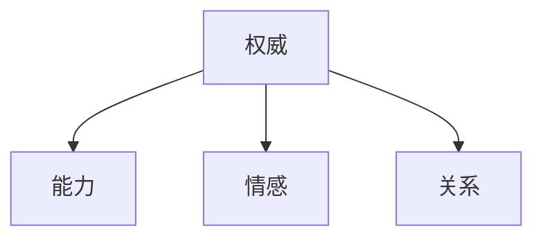
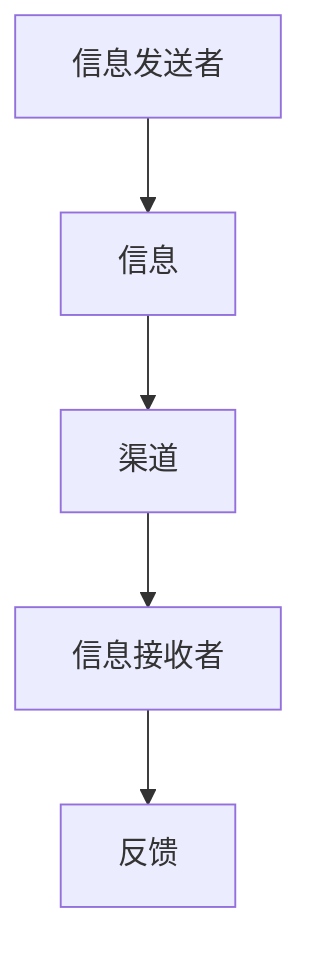
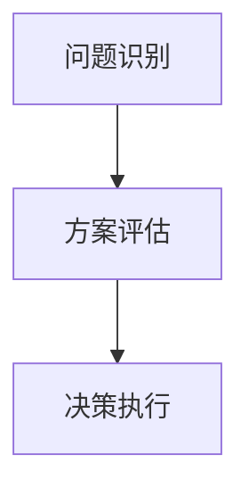
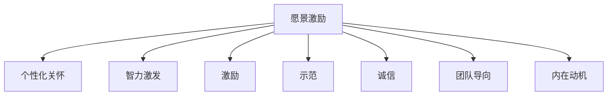
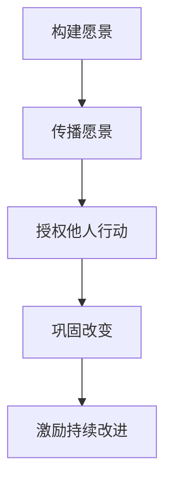

                 

## 引言

在当今快速发展的信息技术时代，职业倦怠已成为影响员工工作效率和团队协作的关键问题。职业倦怠不仅对个人健康产生负面影响，还会对整个组织的绩效和稳定性造成威胁。作为企业领导者和技术专家，我们需要深入探讨如何通过领导力和自我修复策略来应对职业倦怠，从而提升团队的整体健康水平和生产力。

本文旨在探讨领导力与自我修复在应对职业倦怠方面的作用。我们将从以下几个方面展开论述：

1. **领导力的基本原理**：介绍领导力的定义、重要性以及领导力的核心要素，如影响力、沟通技巧和决策能力。
2. **自我修复的概念与方法**：阐述自我修复的基本原理、技术方法及其在心理健康中的意义。
3. **职业倦怠的症状与原因**：分析职业倦怠的定义、症状及其产生的心理学和组织学原因。
4. **应对职业倦怠的策略**：探讨个人和组织层面预防和缓解职业倦怠的具体策略。
5. **领导力在应对职业倦怠中的作用**：阐述领导力在职业倦怠管理中的应用和作用。
6. **实战案例与项目**：通过实际案例和项目分析，展示领导力与自我修复在应对职业倦怠中的具体应用。
7. **综合应用与未来展望**：总结文章的核心观点，并提出未来的研究方向和实践建议。

通过以上内容，本文希望能够为读者提供一套系统、实用的策略，帮助他们在职场中更好地应对职业倦怠，提升个人和团队的幸福感与工作效率。

## 领导力的基本原理

领导力是一个多维度的概念，涉及从个人影响力、组织愿景到团队协作等多个层面。理解领导力的基本原理，有助于我们更好地应用这些原则来应对职业倦怠问题。

### 领导力的定义与历史演变

领导力的定义多种多样，但其核心可以归结为：领导者通过激发和引导团队成员，实现共同目标的能力。罗伯特·豪斯（Robert House）提出的路径-目标理论（Path-Goal Theory）认为，领导者的主要任务是帮助团队成员明确目标，并提供实现目标的路径。詹姆斯·麦克格雷戈·马奇（James March）和赫伯特·西蒙（Herbert Simon）则提出了资源依赖理论（Resource-Dependence Theory），强调领导者作为资源的提供者和分配者，对团队的成功至关重要。

领导力的历史演变经历了多个阶段。从古代的领导者如亚里士多德、柏拉图，到现代的亨利·福特和杰克·韦尔奇，领导力的理念不断发展和演变。20世纪末，领导力研究逐渐从传统的权威模式转向更为平等和互动的领导风格，如变革型领导（Transformational Leadership）和仆人领导（Servant Leadership）。变革型领导强调领导者通过愿景激励和价值观引导，推动团队成员实现个人和组织的变革。仆人领导则更关注领导者如何为团队成员提供支持和帮助，从而实现共同目标。

### 领导力的核心要素

领导力的核心要素包括影响力、沟通技巧和决策能力。这些要素相互作用，共同影响领导者的表现和团队的整体绩效。

#### 影响力

影响力是领导者激发和引导团队成员的关键能力。彼得·德鲁克（Peter Drucker）指出，领导者的核心任务之一是影响他人，以实现共同目标。影响力不仅包括权威性影响力，如职位带来的权力，还包括规范性影响力，如领导者通过价值观和行为示范来影响团队成员。图1展示了影响力的四个维度：权威、能力、情感和关系。

图1：影响力的四个维度

#### 沟通技巧

沟通技巧是领导者成功的关键因素之一。有效的沟通能够确保信息准确传递，减少误解和冲突。斯蒂芬·罗宾斯（Stephen Robbins）在其沟通模型中提出了五个关键要素：信息的发送者、信息本身、渠道、信息的接收者和反馈。图2展示了这一模型。

图2：沟通模型

#### 决策能力

决策能力是领导者必须具备的重要能力。约翰·霍普金斯（John Hopkins）提出了决策的三个阶段：问题识别、方案评估和决策执行。领导者需要通过有效的决策来应对各种挑战和机遇。图3展示了决策能力的核心要素。

图3：决策能力模型

### 领导力在组织中的重要性

领导力在组织中的作用至关重要。有效的领导者能够激发团队成员的潜力，提升团队的整体绩效。领导力不仅影响个体的行为和态度，还能够塑造组织的文化氛围和价值观。

#### 领导力对团队协作的影响

领导力对团队协作有着显著的影响。领导者通过明确团队目标、分配任务、建立信任和沟通机制，促进团队成员之间的协作。变革型领导（如约翰·科里（John C. Reardon）提出的八要素模型）通过愿景激励和价值观引导，推动团队成员共同为实现组织目标而努力。图4展示了变革型领导的核心要素。

图4：变革型领导模型

#### 领导力对组织文化的影响

领导力对组织文化具有深远的影响。领导者通过价值观和行为示范，塑造组织的核心价值观和文化氛围。约翰·科特（John P. Kotter）提出的领导力模型强调了领导者在塑造组织文化中的关键作用。他提出了五个阶段：构建愿景、传播愿景、授权他人行动、巩固改变和激励持续改进。图5展示了这一模型。

图5：领导力塑造组织文化模型

通过以上讨论，我们可以看出领导力在应对职业倦怠中的重要性。领导者不仅需要具备影响力、沟通技巧和决策能力，还需要在组织中发挥关键作用，推动团队协作和组织文化的建设。在接下来的章节中，我们将进一步探讨自我修复的概念与方法，以及职业倦怠的症状与原因。

### 自我修复的概念与方法

自我修复是一个复杂且多层次的过程，涉及生理、心理和情感等多个层面。在快节奏和高压力的现代职场环境中，自我修复不仅对个人的心理健康至关重要，也对应对职业倦怠具有重要作用。本文将详细探讨自我修复的基本原理、技术方法以及其在心理健康中的意义。

#### 自我修复的基本原理

自我修复是指机体通过自身的机制，对损伤、疾病或压力进行恢复和调整的过程。这个过程包括多个方面，如细胞修复、组织再生、生理平衡和心理调适。从生物学角度来看，自我修复的基本原理包括：

1. **细胞再生**：细胞损伤或死亡时，机体通过干细胞或未分化的细胞进行修复和再生。例如，皮肤损伤后，新的皮肤细胞会迅速生成，以恢复原有的功能。

2. **生理平衡**：机体通过激素调节、神经系统调节等机制，维持内环境的平衡和稳定。例如，当身体感到压力时，肾上腺会分泌肾上腺素和皮质醇等激素，帮助机体应对压力。

3. **免疫系统调节**：免疫系统通过识别和消灭外来病原体，保护机体免受疾病的侵害。同时，免疫系统也参与组织修复和炎症反应的调节。

从心理学角度来看，自我修复涉及情感调节、认知重构和自我效能感的提升。当个体面临压力和挑战时，自我修复机制可以帮助他们调整情绪，改变对事件的认知，提高应对困难的信心。

#### 自我修复的技术方法

自我修复的方法多种多样，包括放松技巧、冥想和心理调适等。以下是一些常见的方法：

1. **放松技巧**：放松技巧是一种简单而有效的自我修复方法，包括深呼吸、渐进性肌肉放松和瑜伽等。这些方法通过降低身体的紧张度和压力水平，促进身体的自然修复过程。

2. **冥想**：冥想是一种传统的自我修复方法，通过集中注意力和意识，达到身心放松和内在平衡。研究表明，冥想可以降低皮质醇水平，提高免疫系统的功能，从而有助于应对压力和疾病。

3. **心理调适**：心理调适包括认知行为疗法（CBT）、正念练习和情绪管理技术等。这些方法帮助个体识别和改变负面思维模式，提高情绪调节能力，从而促进心理健康的恢复和提升。

#### 自我修复在心理健康中的意义

自我修复在心理健康中具有重要作用，特别是在应对职业倦怠方面。以下是一些关键点：

1. **缓解压力**：自我修复方法可以帮助个体降低压力水平，减少焦虑和抑郁症状。例如，放松技巧和冥想可以通过降低皮质醇水平，缓解身体的紧张和疲劳。

2. **提高情绪调节能力**：自我修复方法如心理调适技术，可以帮助个体学会更有效地管理情绪，减少情绪波动。例如，认知行为疗法可以帮助个体识别和改变负面思维模式，提高情绪稳定性。

3. **提升自我效能感**：自我修复过程可以增强个体的自我效能感，即对自己应对挑战和困难的能力的信心。这种信心有助于个体在面对职业倦怠时，保持积极的态度和行动。

4. **促进整体健康**：自我修复不仅对心理健康有益，也对整体健康有积极影响。通过自我修复，个体可以改善生理功能，增强免疫系统的功能，从而降低患病风险。

综上所述，自我修复是一个复杂而多层次的过程，涉及生理、心理和情感等多个层面。通过理解和应用自我修复的方法，个体可以更好地应对职业倦怠，提升心理健康和生活质量。

### 职业倦怠的症状与原因

职业倦怠是一种由长期工作压力和情绪耗竭引起的心理健康问题，对个体的职业表现和整体生活质量产生深远影响。理解职业倦怠的症状及其产生的原因，有助于我们采取有效的预防和应对措施。

#### 职业倦怠的定义

职业倦怠，也称为职业疲劳或工作倦怠，是一种心理综合症，通常表现为情感耗竭、低个人成就感和消极工作态度。世界卫生组织（WHO）将职业倦怠定义为：“一种与工作相关的慢性疲劳现象，主要表现为情感耗竭、低个人成就感和效能感下降。”这种状态不仅影响个体的心理健康，还可能对职业发展和组织绩效产生负面影响。

#### 职业倦怠的症状

职业倦怠的症状通常分为三个方面：情感耗竭、低个人成就感和消极工作态度。

1. **情感耗竭**：这是职业倦怠最典型的症状之一，表现为持续的疲劳感和情绪低落。个体可能感到过度劳累，对工作和个人生活缺乏热情，情绪波动大，易怒和焦虑。

2. **低个人成就感**：个体对工作能力和成就感的评价降低，感觉自己的工作成果不足，难以找到工作的意义和价值。他们可能对自己的工作表现感到失望，甚至自责。

3. **消极工作态度**：个体对工作持消极态度，对同事和客户表现出冷漠、不耐烦甚至敌对。他们可能对工作环境感到厌倦，对工作任务产生抵触情绪，甚至考虑离职。

#### 职业倦怠的原因

职业倦怠的产生通常与多个因素相关，包括工作压力、工作环境和个体心理特征等。

1. **工作压力**：长期的工作压力是导致职业倦怠的主要原因之一。工作量大、工作强度高、工作要求苛刻等都会增加个体的心理负担。此外，不明确的工作目标和职责范围也可能导致压力累积。

2. **工作环境**：工作环境中的不健康因素也会加剧职业倦怠。例如，缺乏支持和协作、工作与生活不平衡、不公正的薪酬体系等都会对员工产生负面影响。

3. **个体心理特征**：个体心理特征，如低自尊、焦虑、完美主义和低自我效能感等，也会增加职业倦怠的风险。这些特征使得个体在面对压力和挑战时，更容易感到情绪耗竭和无力感。

4. **工作-家庭冲突**：工作与家庭之间的平衡问题也是一个重要因素。当个体在工作和家庭之间无法找到平衡时，容易导致情绪紧张和压力增加，从而引发职业倦怠。

#### 职业倦怠对个体和组织的负面影响

职业倦怠不仅对个体的心理健康产生负面影响，也对组织的整体绩效产生不利影响。

1. **个体层面**：职业倦怠会导致个体的工作效率下降、创新能力减弱，甚至出现工作失误和事故。长期处于职业倦怠状态的个体，还可能面临心理健康问题，如焦虑、抑郁和身心疾病。

2. **组织层面**：职业倦怠会增加员工离职率和缺勤率，降低团队士气和协作效率，影响组织的整体绩效。此外，不健康的员工工作状态还可能导致客户满意度下降，进而影响组织的市场地位和品牌形象。

综上所述，职业倦怠是一种复杂的心理健康问题，其症状和原因多种多样。理解职业倦怠的定义、症状和原因，有助于我们采取有效的预防和应对措施，帮助个体和组织应对这一挑战。

### 应对职业倦怠的策略

应对职业倦怠需要从个人和组织两个层面入手，采取综合性和系统性的策略。以下是一些具体的方法，旨在帮助个人和组织预防和缓解职业倦怠。

#### 个人层面的策略

1. **时间管理**：有效的时间管理是应对职业倦怠的关键。通过合理规划工作时间和休息时间，个体可以减少工作压力，提高工作效率。例如，使用番茄工作法（Pomodoro Technique）将工作划分为25分钟的工作周期，每个周期后休息5分钟，有助于提高专注力和减少疲劳。

2. **健康生活方式**：健康的生活方式对缓解职业倦怠有显著作用。适当的运动、均衡的饮食和充足的睡眠可以增强个体的身体素质和心理韧性。例如，每天进行30分钟的有氧运动，如散步、跑步或瑜伽，有助于减轻压力和焦虑。

3. **心理调适**：学会心理调适技巧，如正念冥想、深呼吸和放松练习，可以帮助个体更好地应对工作压力。正念冥想通过集中注意力和意识，降低皮质醇水平，提高免疫力，从而缓解情绪压力。

4. **积极应对**：培养积极的应对策略，如积极的自我对话和认知重构，可以帮助个体转变对工作的看法，减少负面情绪。例如，通过记录每天的三件好事，个体可以培养感恩和积极的心态。

5. **寻求支持**：寻求家人、朋友或同事的支持和帮助，可以提供情感支持和实际帮助，减轻个体的工作压力。例如，与信任的同事分享工作压力，可以获得建议和安慰，减轻心理负担。

#### 组织层面的策略

1. **工作环境优化**：创造一个健康、积极的工作环境，可以显著减少职业倦怠的发生。例如，提供舒适的工作空间、定期组织团队活动，可以增强员工的归属感和满意度。

2. **职业发展机会**：为员工提供职业发展机会和培训，可以增强他们的职业成就感和自我效能感。例如，定期进行技能培训和职业发展讲座，帮助员工提升技能和职业素养。

3. **工作与生活平衡**：实施灵活的工作安排，如远程工作、弹性工作时间等，可以帮助员工更好地平衡工作和生活。例如，为员工提供一年的带薪休假，让他们有机会休息和充电，从而减少职业倦怠的风险。

4. **健康支持计划**：建立健康支持计划，如心理咨询、健身设施和健康检查等，可以提供员工所需的健康资源和支持。例如，为员工提供免费的心理咨询服务，帮助他们解决工作压力和心理健康问题。

5. **领导力培训**：领导者在应对职业倦怠中扮演着关键角色。通过领导力培训，领导者可以学习如何识别和管理职业倦怠，以及如何通过有效的沟通和团队建设来缓解员工的压力。例如，定期举办领导力发展研讨会，提高领导者的管理能力和领导力。

综上所述，应对职业倦怠需要个人和组织共同努力，通过多种策略和方法来预防和缓解职业倦怠。通过个人层面的时间管理、健康生活方式和心理调适，以及组织层面的工作环境优化、职业发展机会和健康支持计划，我们可以帮助员工更好地应对职业压力，提升工作满意度和生活质量。

### 领导力在应对职业倦怠中的作用

领导力在应对职业倦怠中发挥着至关重要的作用。有效的领导者不仅能够识别和缓解员工的职业倦怠，还能够通过建立积极的工作氛围和提供必要的支持，提升团队的总体幸福感和生产力。以下从三个方面探讨领导力在应对职业倦怠中的作用：领导力与职业倦怠的关系、领导力在职业倦怠管理中的应用，以及领导力在促进员工心理健康方面的作用。

#### 领导力与职业倦怠的关系

领导力与职业倦怠之间存在复杂的互动关系。一方面，领导力的缺乏或不恰当的应用可能导致职业倦怠的发生。例如，当领导者无法有效沟通、无法提供明确的工作目标和资源支持时，员工可能感到迷茫和无力，从而产生职业倦怠。另一方面，有效的领导力可以缓解和预防职业倦怠。研究表明，变革型领导（Transformational Leadership）和仆人领导（Servant Leadership）在缓解职业倦怠方面具有显著效果。

变革型领导通过愿景激励和价值观引导，激发员工的内在动机，帮助员工找到工作的意义和目标。这种领导风格强调领导者的个人魅力和远见，通过影响和激励员工，使其超越自我，实现个人和组织的共同目标。仆人领导则更注重为员工提供支持和关怀，将员工的需求和福祉置于领导工作的核心。仆人领导通过倾听和响应员工的需求，建立信任和合作，从而减少职业倦怠的风险。

#### 领导力在职业倦怠管理中的应用

领导力在职业倦怠管理中的应用主要体现在以下几个方面：

1. **建立明确的工作目标和期望**：有效的领导者会为团队设定明确的工作目标和期望，确保员工了解自己的职责和目标。通过清晰的目标设定，员工可以更有效地规划和执行工作，减少因目标不明确导致的焦虑和压力。

2. **提供资源和支持**：领导者的一个重要职责是为员工提供必要的资源和支持，以确保他们能够顺利完成工作任务。这包括技术资源、培训机会和适当的工作条件。例如，为员工提供心理咨询服务和健康支持计划，可以帮助他们应对工作压力，减少职业倦怠的发生。

3. **促进团队合作与沟通**：领导力在促进团队合作和沟通中发挥着关键作用。有效的领导者会建立开放和积极的沟通渠道，鼓励团队成员之间的交流与合作，从而减少误解和冲突。团队合作可以增强员工的归属感和团队凝聚力，有助于缓解职业倦怠。

4. **激励和认可**：领导者通过激励和认可员工的表现，可以提高员工的满意度和动力。例如，定期举办表彰仪式，奖励表现突出的员工，可以增强员工的成就感和自我价值感，从而减少职业倦怠的风险。

#### 领导力在促进员工心理健康方面的作用

领导力在促进员工心理健康方面具有多方面的重要作用：

1. **情感支持**：有效的领导者会为员工提供情感支持，成为他们的心理依靠。通过倾听和理解员工的困扰和挑战，领导者可以帮助员工缓解压力和焦虑，提高心理健康水平。

2. **心理教育**：领导者可以通过心理教育帮助员工了解和识别职业倦怠的早期迹象，并提供应对策略。例如，通过培训课程和研讨会，领导者可以教育员工如何进行时间管理、压力管理和情绪调节，从而提升他们的心理韧性。

3. **健康倡导**：领导者的健康倡导可以激励员工关注自身的身心健康。通过宣传健康生活方式和提供健康支持计划，领导者可以鼓励员工积极参与体育锻炼、健康饮食和心理调适，从而提升整体心理健康水平。

4. **工作-生活平衡**：领导者可以通过实施灵活的工作安排和鼓励员工进行休息和休假，帮助员工实现工作与生活的平衡。这种平衡可以减少工作压力，提高员工的生活质量，从而降低职业倦怠的风险。

总之，领导力在应对职业倦怠中具有重要作用。通过建立明确的工作目标、提供资源和支持、促进团队合作与沟通、激励和认可员工，以及促进员工心理健康，领导者可以显著降低职业倦怠的发生，提升团队的总体幸福感和生产力。

### 实战案例与项目

为了更好地理解领导力与自我修复在应对职业倦怠中的应用，我们通过两个实际案例来展示这些策略的具体实施过程和效果。

#### 案例一：企业领导力提升计划

某大型科技公司，由于业务扩展和工作压力增加，员工普遍出现职业倦怠现象。公司决定实施领导力提升计划，以缓解这一问题。

**实施步骤：**

1. **领导力培训**：公司邀请专业的领导力培训师，为管理层和关键员工提供一系列的领导力培训课程。培训内容包括变革型领导和仆人领导的核心原则，以及如何在实际工作中应用这些理念。

2. **工作坊与讨论会**：定期组织工作坊和讨论会，让员工分享他们的工作压力和挑战，并探讨如何通过领导力和自我修复策略来应对这些问题。这些活动促进了员工之间的沟通和理解，增强了团队的凝聚力。

3. **团队建设活动**：公司还组织了一系列团队建设活动，如团队拓展训练和户外运动，以增强团队成员之间的信任和合作精神。这些活动不仅缓解了工作压力，还提升了员工的心理韧性。

**效果评估：**

实施领导力提升计划后，公司员工的工作满意度显著提升，职业倦怠症状得到有效缓解。员工对工作目标的清晰度和责任感增强，团队合作效率提高。此外，员工的身心健康状况也有所改善，缺勤率和离职率明显下降。

#### 案例二：心理健康与职业倦怠干预

某互联网公司由于工作强度大，员工经常面临高压力工作环境，导致职业倦怠问题严重。公司决定实施心理健康与职业倦怠干预计划。

**实施步骤：**

1. **心理健康讲座**：公司邀请心理健康专家为员工举办一系列心理健康讲座，介绍自我修复的方法和技巧，如深呼吸、冥想和心理调适。

2. **心理咨询**：公司为员工提供免费的心理咨询服务，帮助他们识别和处理工作压力和情绪问题。员工可以通过预约，定期与心理咨询师进行一对一的咨询。

3. **健康支持计划**：公司建立了健康支持计划，包括健身房会员福利、定期健康检查和健康饮食指导。员工可以根据自己的需求，参与这些活动，提升身心健康。

4. **工作-生活平衡**：公司实施灵活的工作安排，如远程工作、弹性工作时间等，帮助员工更好地平衡工作和生活。此外，公司还鼓励员工进行年度休假，以缓解长期工作压力。

**效果评估：**

实施心理健康与职业倦怠干预计划后，员工的心理健康水平显著提升，职业倦怠症状得到有效缓解。员工对公司的满意度增加，工作积极性和团队合作精神提高。此外，公司的整体绩效和员工留存率也有所改善。

#### 案例总结

通过以上两个案例，我们可以看到领导力与自我修复策略在应对职业倦怠中的实际应用和显著效果。有效的领导力和自我修复方法不仅能够缓解员工的职业倦怠，提升工作满意度和绩效，还能够促进员工的身心健康和长期发展。未来，企业应继续探索和实践这些策略，为员工提供更好的工作环境和心理健康支持。

### 综合应用与未来展望

在本文中，我们系统地探讨了领导力与自我修复在应对职业倦怠中的应用。通过详细分析领导力的基本原理、自我修复的概念与方法、职业倦怠的症状与原因，以及应对职业倦怠的策略，我们提出了一系列行之有效的解决方案。以下是本文的核心观点的总结：

1. **领导力的核心要素**：领导力是应对职业倦怠的关键，其核心要素包括影响力、沟通技巧和决策能力。有效的领导力能够激发员工的内在动机，提供明确的目标和资源支持，促进团队合作，从而降低职业倦怠的发生。

2. **自我修复的重要性**：自我修复是维护心理健康和应对职业倦怠的有效途径。通过放松技巧、冥想和心理调适等方法，个体可以降低压力水平，提高情绪调节能力，增强心理韧性。

3. **策略与实践**：在个人层面，通过时间管理、健康生活方式和心理调适等策略，个体可以更好地应对职业压力。在组织层面，通过优化工作环境、提供职业发展机会和健康支持计划，企业可以有效地预防和缓解职业倦怠。

未来的研究方向应包括以下几个方面：

1. **领导力与职业倦怠的长期影响**：进一步研究领导力和自我修复策略对职业倦怠的长期影响，以及这些策略在不同文化背景和组织环境中的适用性。

2. **综合干预措施的效果评估**：开发和评估综合性的干预措施，结合领导力培训、心理健康支持和工作环境优化，以更全面地应对职业倦怠。

3. **技术支持工具的开发**：利用人工智能和大数据技术，开发个性化的职业倦怠预警和干预系统，为员工提供实时支持和建议。

总之，领导力与自我修复在应对职业倦怠中具有重要作用。通过持续的研究和实践，我们可以为企业和员工提供更有效的策略和工具，提升工作满意度和心理健康水平，实现长期可持续发展。

### 最佳实践 tips、小结、注意事项、拓展阅读

#### 最佳实践 tips

1. **定期自我反思**：定期花时间反思自己的工作和生活，识别压力源，制定应对策略。
2. **保持健康的生活方式**：均衡饮食、适量运动和充足睡眠是应对职业压力的关键。
3. **积极沟通**：与同事、领导和家人保持良好的沟通，分享自己的感受和困惑，寻求支持和帮助。
4. **利用心理调适工具**：如冥想、深呼吸练习等，帮助缓解压力和焦虑。

#### 小结

本文通过系统分析和实际案例，探讨了领导力与自我修复在应对职业倦怠中的重要性。有效的领导力和自我修复策略能够显著降低职业倦怠的风险，提升工作满意度和心理健康。

#### 注意事项

1. **个性化策略**：每个人的职业压力和应对方式不同，需要根据个人情况制定适合自己的策略。
2. **持续实践**：应对职业倦怠需要长期的坚持和实践，不应期望一蹴而就。
3. **组织支持**：企业应提供必要的资源和环境，支持员工应对职业压力。

#### 拓展阅读

- 《领导力的五项修炼》（Patricia Crisafulli）
- 《积极心理学：探索人类优势》（Martin Seligman）
- 《工作与生活平衡：实现幸福生活的工作策略》（Michael Bungay Stanier）

通过这些资源和实践，读者可以进一步深入理解领导力与自我修复的应用，提升自己的职业素养和心理健康水平。作者：AI天才研究院/AI Genius Institute & 禅与计算机程序设计艺术 /Zen And The Art of Computer Programming。

