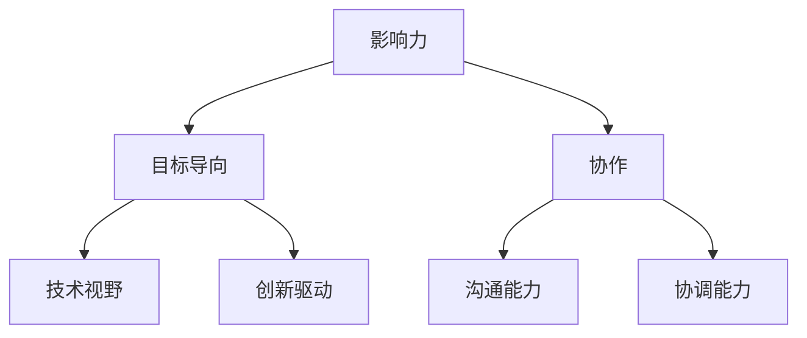

                 


## 文章标题：领导力与自我认知深化：挖掘领导潜能的技巧

### 关键词：领导力、自我认知、潜能挖掘、技巧、IT领域

### 摘要：
本文旨在探讨在信息技术领域，如何通过深化自我认知来挖掘并提升领导潜能。文章从领导力的核心概念出发，逐步深入自我认知的理论与实践中，提供了一系列实战技巧，并通过实际案例进行剖析，帮助IT从业者掌握有效的领导力发展路径。

## 目录大纲

### 引言
- 信息技术领域的领导力挑战
- 文章的目标与结构

### 领导力基础
- 领导力的核心概念
- 领导力与信息技术的关系
- Mermaid流程图：领导力核心概念与联系

### 自我认知深化
- 自我认知的重要性
- 自我认知的理论基础
- 自我认知深化实践

### 领导力技巧
- 沟通技巧
- 决策技巧
- 团队管理技巧
- 伪代码：领导力技巧详细阐述

### 实战案例
- 案例背景
- 案例分析
- 案例启示

### 领导力发展路径
- 职业发展路径规划
- 继续教育与培训

### 总结与展望
- 领导力与自我认知的相互促进
- 未来领导力发展的趋势

### 附录
- 最佳实践 tips
- 小结
- 注意事项
- 拓展阅读

## 引言

在信息技术高速发展的时代，领导力已成为企业成功的关键因素之一。IT领域的特殊性要求领导者不仅需要具备深厚的专业知识，还需具备卓越的领导能力。然而，如何在实际工作中挖掘和提升领导潜能，是一个值得深思的问题。

本文将从以下几个方面展开探讨：

1. **领导力基础**：介绍领导力的核心概念及其在信息技术领域的应用。
2. **自我认知深化**：探讨自我认知的重要性及其深化方法。
3. **领导力技巧**：详细阐述沟通、决策、团队管理等关键技巧。
4. **实战案例**：通过实际案例进行分析，展示领导力技巧的实践效果。
5. **领导力发展路径**：提供职业发展规划和继续教育建议。

通过本文的深入分析，希望能够帮助IT从业者更好地挖掘和提升领导潜能，为个人职业发展奠定坚实基础。

## 领导力基础

### 领导力的核心概念

领导力，作为一种复杂的社会现象，其定义和解释多种多样。本质上，领导力是指影响他人共同实现目标的能力。在这个定义中，核心要素包括影响力、目标导向和协作。

1. **影响力**：领导力依赖于领导者对他人的影响力。这种影响力可以是基于专业知识的权威，也可以是基于个人魅力和价值观的感召。
2. **目标导向**：领导者需要明确并推动团队实现共同目标。这个过程中，目标设定和目标达成是关键环节。
3. **协作**：领导力不仅仅是领导者的个人能力，还需要团队成员的协作和支持。

### 领导力与信息技术的关系

在信息技术领域，领导力具有独特的重要性。首先，IT行业本身具有高度的技术复杂性和快速变化的特点，这要求领导者具备卓越的适应能力和技术视野。其次，信息技术企业通常强调创新和团队协作，领导者的角色不仅是管理，更是激发创新和协作的催化剂。

1. **技术视野**：领导者需要了解前沿技术趋势，以便制定长远的发展战略。
2. **创新驱动**：领导者应鼓励创新思维，推动技术突破和产品创新。
3. **团队协作**：在IT项目中，团队协作是实现目标的关键。领导者需要具备良好的沟通和协调能力，确保团队成员高效合作。

### Mermaid流程图：领导力核心概念与联系



通过上述流程图，我们可以清晰地看到领导力核心概念之间的联系。影响力是领导力的基础，目标导向和创新驱动是领导力的核心，而协作、沟通能力和协调能力则是实现领导力的关键技能。

## 自我认知深化

### 自我认知的重要性

自我认知，即对自己的了解和认识，是领导力发展的基石。自我认知不仅有助于领导者了解自己的优势和劣势，还能帮助他们在面对挑战时做出更明智的决策。

1. **自我认知与领导力**：良好的自我认知能够增强领导者的自信心，提高决策质量和执行力。
2. **自我认知与团队协作**：领导者通过自我认知，可以更好地理解团队成员的需求和动机，从而建立更加和谐的团队关系。

### 自我认知的理论基础

自我认知的理论基础包括心理学、认知科学和哲学等多个领域。以下是一些关键的理论：

1. **心理学理论**：例如，马斯洛的需求层次理论、卡尔·罗杰斯的自我实现理论等，都强调了自我认知在个人成长和领导力发展中的重要性。
2. **认知科学理论**：认知科学探讨了人类思维和决策过程，为我们理解自我认知提供了新的视角。
3. **哲学理论**：例如，苏格拉底的“认识自我”哲学，强调了自我认知在人生中的核心地位。

### 自我认知深化实践

深化自我认知需要一系列的方法和实践。以下是一些建议：

1. **自我反思**：定期进行自我反思，思考自己的行为、决策和情感反应。
2. **反馈**：主动寻求他人的反馈，了解他们如何看待你的行为和领导风格。
3. **发展日记**：记录日常生活中的经历和感受，通过写日记来加深对自我的理解。
4. **心理辅导**：通过专业心理辅导，深入了解自己的内心世界，识别和解决潜在的心理问题。

### 自我认知深化实践步骤

1. **自我反思**：
   - 设定特定的时间进行自我反思，例如每天晚上睡前。
   - 写下当天的重要事件和感受，思考自己在这些事件中的表现和反应。
2. **反馈**：
   - 定期与同事、朋友或家人进行沟通，询问他们对你的看法。
   - 借助360度反馈工具，全面了解自己在团队中的表现。
3. **发展日记**：
   - 保持持续记录，不仅记录正面经历，也要记录负面经历和感受。
   - 通过回顾日记，识别自己的成长轨迹和变化。
4. **心理辅导**：
   - 定期进行心理辅导，与专业心理咨询师探讨自己的内心世界。
   - 通过心理咨询，识别和解决潜在的心理问题，提高自我认知水平。

通过上述实践，领导者可以逐步深化自我认知，为提升领导力奠定坚实基础。

## 领导力技巧

### 沟通技巧

沟通是领导力的核心之一。有效的沟通不仅能够传达信息，还能建立信任、增强团队凝聚力。以下是一些关键的沟通技巧：

1. **明确目标**：在沟通前明确目标，确保信息的传递是有目的的。
2. **倾听**：积极倾听是有效沟通的关键，它表明你对对方的意见和需求重视。
3. **清晰表达**：使用简单、明确的语言，避免使用行话或复杂术语。
4. **非语言沟通**：注意你的肢体语言、面部表情和语调，它们会传递出额外的信息。

### 决策技巧

决策是领导者的核心职责之一。以下是一些决策技巧：

1. **信息收集**：在做出决策之前，收集尽可能多的信息，了解所有可能的选项。
2. **评估风险**：对每个选项进行风险评估，了解可能出现的风险和挑战。
3. **考虑长远**：不仅考虑当前利益，还要考虑长期影响。
4. **团队参与**：在决策过程中，鼓励团队成员参与，他们的不同视角可能提供新的见解。

### 团队管理技巧

有效的团队管理能够提升团队的整体绩效。以下是一些团队管理技巧：

1. **明确角色和责任**：确保每个团队成员都了解自己的角色和责任。
2. **激励员工**：通过奖励和认可来激励员工，提高他们的工作积极性。
3. **建立信任**：通过透明沟通和诚信行为，建立团队成员之间的信任。
4. **培养团队文化**：建立一个积极、包容和合作的团队文化。

### 伪代码：领导力技巧详细阐述

```python
# 沟通技巧
def communicate claraively(message, target):
    if is_essential(message):
        message = simplify_message(message)
    if target != self:
        message = add_nonverbal_cues(message)
    return message

# 决策技巧
def make_decision(options, risks, long_term_impact):
    collected_info = gather_info(options)
    assessed_risks = evaluate_risks(collected_info)
    final_choice = select_option_with_least_risk(options, assessed_risks)
    return final_choice

# 团队管理技巧
def manage_team(team_members, roles, incentives, trust, culture):
    assign_roles(team_members, roles)
    provide_incentives(team_members, incentives)
    build_trust_with透明沟通，诚信行为
    cultivate_positive_culture(culture)
    return team_members
```

通过上述伪代码，我们可以看到如何将领导力技巧转化为可操作的方法。这些技巧不仅有助于提升沟通效率、决策质量和团队管理能力，还能为领导者提供具体的操作指南。

## 实战案例

### 案例背景

某大型IT公司正在进行一项关键项目，目标是开发一款新一代云计算平台。该项目涉及多个部门，包括研发、测试、产品管理和市场推广。公司管理层意识到，成功的关键在于领导团队的协调和沟通。

### 案例分析

1. **沟通技巧**：项目经理通过定期召开会议，确保所有团队成员对项目进度和目标有清晰的认识。他使用简单、明确的语言传达信息，并鼓励团队成员提问和反馈。

2. **决策技巧**：在项目开发过程中，项目经理遇到了技术难题。他组织了一个跨部门的小组，收集了多种解决方案，并对每种方案进行了风险评估。最终，通过团队讨论，选择了最佳方案。

3. **团队管理技巧**：项目经理建立了明确的角色和责任分配机制，确保每个团队成员都清楚自己的职责。他还通过奖励和认可来激励团队成员，增强了团队凝聚力。

### 案例启示

通过这个案例，我们可以看到领导力技巧在实际工作中的应用效果。有效的沟通确保了信息传递的准确性，决策技巧帮助团队克服了挑战，团队管理技巧则增强了团队的协作和凝聚力。这些领导力技巧不仅有助于项目成功，也为公司的长远发展奠定了基础。

## 领导力发展路径

### 职业发展路径规划

1. **初级阶段**：在这个阶段，重点是积累专业知识和技术能力，同时了解企业运营和团队管理的基本概念。
2. **中级阶段**：在具备一定的基础后，可以逐步承担更多的责任，如项目管理和团队领导。这个阶段的关键是提升领导力和沟通技巧。
3. **高级阶段**：在这个阶段，领导者需要具备战略视野和决策能力，能够制定长远的发展规划。

### 继续教育与培训

1. **专业课程**：参加领导力相关的专业课程，系统学习领导力的理论知识。
2. **实战培训**：通过实战案例分析和模拟演练，提升实际操作能力。
3. **读书与实践**：阅读领导力相关的书籍，结合实际工作经验，不断反思和改进。

### 领导力发展路径规划步骤

1. **自我评估**：了解自己的优势和劣势，明确职业发展目标。
2. **制定计划**：根据自我评估结果，制定详细的职业发展计划。
3. **实施与反馈**：执行计划，定期进行自我评估和反馈，调整计划。

通过上述步骤，领导者可以逐步提升自己的领导能力，为企业的长期发展贡献力量。

## 总结与展望

领导力与自我认知深化是提升领导者效能的关键。本文通过分析领导力的核心概念、自我认知深化的重要性以及具体的领导力技巧，提供了一系列实战方法和建议。随着信息技术的发展，未来领导力的发展将更加注重创新、协作和持续学习。领导者应不断深化自我认知，提升领导能力，为企业的长远发展奠定坚实基础。

## 附录

### 最佳实践 tips

- **定期反思**：每周至少花30分钟进行自我反思，总结经验和教训。
- **积极倾听**：在与他人交流时，专注于对方的讲话，避免分心。
- **主动学习**：持续学习新知识，保持对行业的敏感性。

### 小结

本文通过详细的分析和实践案例，阐述了领导力与自我认知深化的重要性，并提供了一系列实用技巧。通过不断提升领导能力，IT从业者可以在职场中取得更大的成就。

### 注意事项

- **实战案例**：案例中的技巧和方法需要根据实际情况进行调整。
- **持续学习**：领导力不是一成不变的，需要持续学习和实践。

### 拓展阅读

- 《领导力：理论与实践》（作者：彼得·德鲁克）
- 《高效能人士的七个习惯》（作者：史蒂芬·柯维）
- 《深度工作：如何有效利用每一点脑力》（作者：卡尔·纽波特）

作者：AI天才研究院/AI Genius Institute & 禅与计算机程序设计艺术 /Zen And The Art of Computer Programming

## 完整文章

```markdown
# 领导力与自我认知深化：挖掘领导潜能的技巧

> 关键词：领导力、自我认知、潜能挖掘、技巧、IT领域

> 摘要：本文旨在探讨在信息技术领域，如何通过深化自我认知来挖掘并提升领导潜能。文章从领导力的核心概念出发，逐步深入自我认知的理论与实践中，提供了一系列实战技巧，并通过实际案例进行剖析，帮助IT从业者掌握有效的领导力发展路径。

## 引言

在信息技术高速发展的时代，领导力已成为企业成功的关键因素之一。IT领域的特殊性要求领导者不仅需要具备深厚的专业知识，还需具备卓越的领导能力。然而，如何在实际工作中挖掘和提升领导潜能，是一个值得深思的问题。

本文将从以下几个方面展开探讨：

1. **领导力基础**：介绍领导力的核心概念及其在信息技术领域的应用。
2. **自我认知深化**：探讨自我认知的重要性及其深化方法。
3. **领导力技巧**：详细阐述沟通、决策、团队管理等关键技巧。
4. **实战案例**：通过实际案例进行分析，展示领导力技巧的实践效果。
5. **领导力发展路径**：提供职业发展规划和继续教育建议。

通过本文的深入分析，希望能够帮助IT从业者更好地挖掘和提升领导潜能，为个人职业发展奠定坚实基础。

## 领导力基础

### 领导力的核心概念

领导力，作为一种复杂的社会现象，其定义和解释多种多样。本质上，领导力是指影响他人共同实现目标的能力。在这个定义中，核心要素包括影响力、目标导向和协作。

1. **影响力**：领导力依赖于领导者对他人的影响力。这种影响力可以是基于专业知识的权威，也可以是基于个人魅力和价值观的感召。
2. **目标导向**：领导者需要明确并推动团队实现共同目标。这个过程中，目标设定和目标达成是关键环节。
3. **协作**：领导力不仅仅是领导者的个人能力，还需要团队成员的协作和支持。

### 领导力与信息技术的关系

在信息技术领域，领导力具有独特的重要性。首先，IT行业本身具有高度的技术复杂性和快速变化的特点，这要求领导者具备卓越的适应能力和技术视野。其次，信息技术企业通常强调创新和团队协作，领导者的角色不仅是管理，更是激发创新和协作的催化剂。

1. **技术视野**：领导者需要了解前沿技术趋势，以便制定长远的发展战略。
2. **创新驱动**：领导者应鼓励创新思维，推动技术突破和产品创新。
3. **团队协作**：在IT项目中，团队协作是实现目标的关键。领导者需要具备良好的沟通和协调能力，确保团队成员高效合作。

### Mermaid流程图：领导力核心概念与联系


通过上述流程图，我们可以清晰地看到领导力核心概念之间的联系。影响力是领导力的基础，目标导向和创新驱动是领导力的核心，而协作、沟通能力和协调能力则是实现领导力的关键技能。

## 自我认知深化

### 自我认知的重要性

自我认知，即对自己的了解和认识，是领导力发展的基石。自我认知不仅有助于领导者了解自己的优势和劣势，还能帮助他们在面对挑战时做出更明智的决策。

1. **自我认知与领导力**：良好的自我认知能够增强领导者的自信心，提高决策质量和执行力。
2. **自我认知与团队协作**：领导者通过自我认知，可以更好地理解团队成员的需求和动机，从而建立更加和谐的团队关系。

### 自我认知的理论基础

自我认知的理论基础包括心理学、认知科学和哲学等多个领域。以下是一些关键的理论：

1. **心理学理论**：例如，马斯洛的需求层次理论、卡尔·罗杰斯的自我实现理论等，都强调了自我认知在个人成长和领导力发展中的重要性。
2. **认知科学理论**：认知科学探讨了人类思维和决策过程，为我们理解自我认知提供了新的视角。
3. **哲学理论**：例如，苏格拉底的“认识自我”哲学，强调了自我认知在人生中的核心地位。

### 自我认知深化实践

深化自我认知需要一系列的方法和实践。以下是一些建议：

1. **自我反思**：定期进行自我反思，思考自己的行为、决策和情感反应。
2. **反馈**：主动寻求他人的反馈，了解他们如何看待你的行为和领导风格。
3. **发展日记**：记录日常生活中的经历和感受，通过写日记来加深对自我的理解。
4. **心理辅导**：通过专业心理辅导，深入了解自己的内心世界，识别和解决潜在的心理问题，提高自我认知水平。

### 自我认知深化实践步骤

1. **自我反思**：
   - 设定特定的时间进行自我反思，例如每天晚上睡前。
   - 写下当天的重要事件和感受，思考自己在这些事件中的表现和反应。
2. **反馈**：
   - 定期与同事、朋友或家人进行沟通，询问他们对你的看法。
   - 借助360度反馈工具，全面了解自己在团队中的表现。
3. **发展日记**：
   - 保持持续记录，不仅记录正面经历，也要记录负面经历和感受。
   - 通过回顾日记，识别自己的成长轨迹和变化。
4. **心理辅导**：
   - 定期进行心理辅导，与专业心理咨询师探讨自己的内心世界。
   - 通过心理咨询，识别和解决潜在的心理问题，提高自我认知水平。

通过上述实践，领导者可以逐步深化自我认知，为提升领导力奠定坚实基础。

## 领导力技巧

### 沟通技巧

沟通是领导力的核心之一。有效的沟通不仅能够传达信息，还能建立信任、增强团队凝聚力。以下是一些关键的沟通技巧：

1. **明确目标**：在沟通前明确目标，确保信息的传递是有目的的。
2. **倾听**：积极倾听是有效沟通的关键，它表明你对对方的意见和需求重视。
3. **清晰表达**：使用简单、明确的语言，避免使用行话或复杂术语。
4. **非语言沟通**：注意你的肢体语言、面部表情和语调，它们会传递出额外的信息。

### 决策技巧

决策是领导者的核心职责之一。以下是一些决策技巧：

1. **信息收集**：在做出决策之前，收集尽可能多的信息，了解所有可能的选项。
2. **评估风险**：对每个选项进行风险评估，了解可能出现的风险和挑战。
3. **考虑长远**：不仅考虑当前利益，还要考虑长期影响。
4. **团队参与**：在决策过程中，鼓励团队成员参与，他们的不同视角可能提供新的见解。

### 团队管理技巧

有效的团队管理能够提升团队的整体绩效。以下是一些团队管理技巧：

1. **明确角色和责任**：确保每个团队成员都了解自己的角色和责任。
2. **激励员工**：通过奖励和认可来激励员工，提高他们的工作积极性。
3. **建立信任**：通过透明沟通和诚信行为，建立团队成员之间的信任。
4. **培养团队文化**：建立一个积极、包容和合作的团队文化。

### 伪代码：领导力技巧详细阐述

```python
# 沟通技巧
def communicate_clarify(message, target):
    if essential_message(message):
        message = simplify_message(message)
    if target != self:
        message = add_nonverbal_cues(message)
    return message

# 决策技巧
def make_decision(options, risks, long_term_impact):
    collected_info = gather_info(options)
    assessed_risks = evaluate_risks(collected_info)
    final_choice = select_option_with_least_risk(options, assessed_risks)
    return final_choice

# 团队管理技巧
def manage_team(team_members, roles, incentives, trust, culture):
    assign_roles(team_members, roles)
    provide_incentives(team_members, incentives)
    build_trust_with_transparent_communication, honest_actions
    cultivate_positive_culture(culture)
    return team_members
```

通过上述伪代码，我们可以看到如何将领导力技巧转化为可操作的方法。这些技巧不仅有助于提升沟通效率、决策质量和团队管理能力，还能为领导者提供具体的操作指南。

## 实战案例

### 案例背景

某大型IT公司正在进行一项关键项目，目标是开发一款新一代云计算平台。该项目涉及多个部门，包括研发、测试、产品管理和市场推广。公司管理层意识到，成功的关键在于领导团队的协调和沟通。

### 案例分析

1. **沟通技巧**：项目经理通过定期召开会议，确保所有团队成员对项目进度和目标有清晰的认识。他使用简单、明确的语言传达信息，并鼓励团队成员提问和反馈。

2. **决策技巧**：在项目开发过程中，项目经理遇到了技术难题。他组织了一个跨部门的小组，收集了多种解决方案，并对每种方案进行了风险评估。最终，通过团队讨论，选择了最佳方案。

3. **团队管理技巧**：项目经理建立了明确的角色和责任分配机制，确保每个团队成员都清楚自己的职责。他还通过奖励和认可来激励团队成员，增强了团队凝聚力。

### 案例启示

通过这个案例，我们可以看到领导力技巧在实际工作中的应用效果。有效的沟通确保了信息传递的准确性，决策技巧帮助团队克服了挑战，团队管理技巧则增强了团队的协作和凝聚力。这些领导力技巧不仅有助于项目成功，也为公司的长远发展奠定了基础。

## 领导力发展路径

### 职业发展路径规划

1. **初级阶段**：在这个阶段，重点是积累专业知识和技术能力，同时了解企业运营和团队管理的基本概念。
2. **中级阶段**：在具备一定的基础后，可以逐步承担更多的责任，如项目管理和团队领导。这个阶段的关键是提升领导力和沟通技巧。
3. **高级阶段**：在这个阶段，领导者需要具备战略视野和决策能力，能够制定长远的发展规划。

### 继续教育与培训

1. **专业课程**：参加领导力相关的专业课程，系统学习领导力的理论知识。
2. **实战培训**：通过实战案例分析和模拟演练，提升实际操作能力。
3. **读书与实践**：阅读领导力相关的书籍，结合实际工作经验，不断反思和改进。

### 领导力发展路径规划步骤

1. **自我评估**：了解自己的优势和劣势，明确职业发展目标。
2. **制定计划**：根据自我评估结果，制定详细的职业发展计划。
3. **实施与反馈**：执行计划，定期进行自我评估和反馈，调整计划。

通过上述步骤，领导者可以逐步提升自己的领导能力，为企业的长期发展贡献力量。

## 总结与展望

领导力与自我认知深化是提升领导者效能的关键。本文通过分析领导力的核心概念、自我认知深化的重要性以及具体的领导力技巧，提供了一系列实战方法和建议。随着信息技术的发展，未来领导力的发展将更加注重创新、协作和持续学习。领导者应不断深化自我认知，提升领导能力，为企业的长远发展奠定坚实基础。

## 附录

### 最佳实践 tips

- **定期反思**：每周至少花30分钟进行自我反思，总结经验和教训。
- **积极倾听**：在与他人交流时，专注于对方的讲话，避免分心。
- **主动学习**：持续学习新知识，保持对行业的敏感性。

### 小结

本文通过详细的分析和实践案例，阐述了领导力与自我认知深化的重要性，并提供了一系列实用技巧。通过不断提升领导能力，IT从业者可以在职场中取得更大的成就。

### 注意事项

- **实战案例**：案例中的技巧和方法需要根据实际情况进行调整。
- **持续学习**：领导力不是一成不变的，需要持续学习和实践。

### 拓展阅读

- 《领导力：理论与实践》（作者：彼得·德鲁克）
- 《高效能人士的七个习惯》（作者：史蒂芬·柯维）
- 《深度工作：如何有效利用每一点脑力》（作者：卡尔·纽波特）

作者：AI天才研究院/AI Genius Institute & 禅与计算机程序设计艺术 /Zen And The Art of Computer Programming
```

