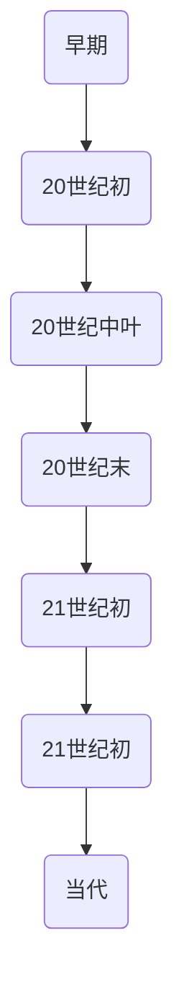

                 

## 文章标题

### 《领导力与自我认知：了解自身优势和局限》

## 关键词

- 领导力
- 自我认知
- SWOT分析
- 360度评估
- 领导力提升模型
- 创新型领导者

## 摘要

本文深入探讨了领导力与自我认知之间的关系，旨在帮助读者了解自身优势和局限，从而提升领导力和个人发展。通过介绍领导力的定义、历史演变以及核心理论，文章揭示了领导力与自我认知之间的紧密联系。随后，文章详细介绍了自我认知的重要性、自我评估方法以及自我提升策略。此外，文章还探讨了领导力提升模型、领导力在组织中的作用、领导力与个人发展的关系以及领导力与技术创新的互动。通过实际案例分析和详细讲解，文章为读者提供了实用的领导力提升技巧和策略，以及未来展望。本文旨在为领导者和管理者提供有益的启示，帮助他们在自我认知的基础上实现领导力的提升。

### 引言

在当今快速变革的社会环境中，领导力的重要性愈发凸显。一个组织能否成功，很大程度上取决于其领导者的能力。领导力不仅仅是指导和管理团队，更是一种能够激发团队成员潜能、共同实现目标的能力。而自我认知则是领导力的基石，只有深入了解自身的优势和局限，才能更好地发挥领导力，实现个人和组织的共同成长。

本文旨在探讨领导力与自我认知之间的关系，帮助读者更好地认识自己，提升领导力。本文将首先介绍领导力的定义和演变，接着讨论自我认知的重要性以及自我评估的方法和策略。在此基础上，文章将进一步探讨领导力提升的模型和实践，分析领导力在组织中的作用以及领导力与技术创新的互动。通过实际案例的剖析，本文将为读者提供实用的领导力提升技巧和策略。最后，文章将对全文进行总结，并提出未来展望。

### 领导力的定义与历史演变

领导力，作为一种复杂而多维的能力，其定义和内涵在不同的历史时期和不同的文化背景下有着不同的理解。广义上，领导力可以被定义为一种影响力，这种影响力能够引导和激励他人为实现共同目标而努力。具体而言，领导力包括决策能力、沟通能力、团队管理能力、创新能力和战略眼光等多个方面。

在历史演变中，领导力理论经历了多个阶段。最初，领导力被认为是一种天赋，即领导者生来就具备独特的领导素质。这种观点以古希腊哲学家亚里士多德为代表，他认为领导者具备的是一种天生的卓越品质。然而，随着社会的发展和研究的深入，人们逐渐认识到领导力并不是先天决定的，而是可以通过后天的培养和实践获得的。

早期领导力理论主要包括特质理论和行为理论。特质理论认为领导者具备一系列固有的特质，如自信、决心、智慧等。行为理论则强调领导者通过特定的行为来影响他人，这些行为可以是积极的也可以是消极的。尽管这两种理论各有其合理性，但它们都未能充分解释领导力的复杂性和多变性。

进入20世纪中后期，领导力理论进一步发展，出现了情境领导理论和权变领导理论。情境领导理论认为，领导者的风格应该根据具体情境来调整，以最大限度地发挥团队成员的潜力。权变领导理论则强调，领导者的成功取决于其能否根据环境的变化灵活调整领导策略。

在当代，领导力理论进一步融合了心理学、社会学和管理学等多个学科的研究成果，形成了多元化、综合性的领导力理论。其中，领导影响力理论和领导思维模式理论尤为值得关注。领导影响力理论认为，领导者的影响力来源于其价值观、信仰和人际关系的建立。领导思维模式理论则强调，领导者的思维方式和认知模式对其领导行为和效果有着深远的影响。

总体来看，领导力的定义和理论在不同历史时期和不同文化背景下有着不同的理解和阐释，但共同的核心在于：领导力是一种动态的、不断发展和适应的过程，它不仅取决于领导者的个人素质，更受到组织环境和社会文化的影响。

### 领导力理论综述

领导力理论的发展经历了多个阶段，从早期的特质理论到当代的情境领导理论，每一种理论都有其独特的观点和贡献。这些理论为我们理解和培养领导力提供了丰富的视角和方法。

#### 特质理论

特质理论是领导力理论的开端，其核心观点是领导者具备一系列天生的、固有的特质。这些特质包括自信、决断力、智慧、道德品质等。特质理论认为，具备这些特质的人更容易成为有效的领导者。然而，特质理论的局限性在于，它忽视了环境因素对领导力的影响，并将领导力视为一种静态的、不变的素质。

#### 行为理论

随着研究的深入，行为理论逐渐取代了特质理论。行为理论认为，领导力并非天生，而是可以通过特定的行为来学习和培养。行为理论区分了领导行为的不同类型，如领导风格、决策过程、激励方法等。通过观察和分析领导者的行为，行为理论试图找到有效的领导行为模式。然而，行为理论的缺点在于，它忽视了不同情境下领导行为的差异性和动态性。

#### 情境领导理论

情境领导理论是对行为理论的一种发展，它强调领导风格应该根据具体情境来调整。这一理论认为，没有一种单一的领导风格适用于所有情况，领导者的成功取决于其能否根据团队成员的能力、动机和工作环境灵活调整领导方式。情境领导理论提出了四个领导风格：指示型、推销型、参与型和授权型，并建议领导者根据具体情境选择合适的领导风格。

#### 权变领导理论

权变领导理论进一步发展了情境领导理论，强调领导者的成功取决于其能否根据环境的变化灵活调整领导策略。权变领导理论提出了一个权变模型，包括三个主要维度：领导者的行为、下属的反应和情境因素。通过这个模型，领导者可以更好地理解不同情境下的领导策略，从而提高领导效果。

#### 影响力理论

在当代，影响力理论强调领导者的价值观、信仰和人际关系的建立对领导力的重要性。这种理论认为，领导者的影响力来源于其能够激发和影响他人共同追求目标的能力。影响力理论关注领导者如何建立信任、激发团队潜力以及塑造组织文化。

#### 领导思维模式理论

领导思维模式理论则从认知角度探讨领导力。这一理论认为，领导者的思维方式和认知模式对其领导行为和效果有着深远的影响。领导思维模式理论强调领导者需要具备开放思维、系统性思维和创新性思维，以应对复杂多变的环境。

#### 综合领导力理论

综合领导力理论是将多种领导力理论整合起来，以提供更全面的视角。这种理论认为，领导力是多种因素共同作用的结果，包括个人特质、行为、情境、影响力以及认知等多个方面。通过综合这些因素，领导者可以更全面地理解和提升自己的领导能力。

### 领导力理论的关系架构

为了更好地理解不同领导力理论之间的关系，我们可以使用Mermaid流程图来展示它们的发展脉络和相互关联。

通过这个流程图，我们可以看到领导力理论从特质理论、行为理论到情境领导理论、权变领导理论，再到影响力理论和领导思维模式理论，逐渐从单一视角发展到多维度整合。综合领导力理论则将这些理论融合在一起，提供了一个全面的理解和培养领导力的框架。

### 自我认知的重要性

自我认知是指个体对自己心理状态、行为模式、能力水平和价值观的认知过程。它是心理学研究的重要领域，对于个人的成长、决策和人际关系都有着深远的影响。在领导力的培养和发展中，自我认知同样扮演着关键角色。

首先，自我认知有助于领导者明确自己的优势和劣势。通过深入分析自己的性格、能力、兴趣和价值观，领导者可以更清晰地了解自己的长处和短处，从而在工作和生活中更好地发挥优势，避免陷入劣势。这种自我认知不仅有助于个人成长，也有助于提升领导力。

其次，自我认知有助于领导者建立有效的沟通和合作关系。在团队中，领导者需要与不同背景、不同性格的成员沟通和协作。通过自我认知，领导者可以更好地理解团队成员的需求和期望，从而建立更紧密的人际关系，增强团队的凝聚力。

第三，自我认知有助于领导者进行有效的决策。领导者在面对复杂多变的环境时，需要做出快速而准确的决策。自我认知可以帮助领导者更清楚地了解自己的思维模式、决策习惯和潜在偏见，从而避免盲目决策，提高决策的质量和效果。

此外，自我认知还有助于领导者进行个人发展。通过持续的自我反思和评估，领导者可以识别出需要提升的领域，制定相应的个人发展计划，不断优化自己的领导技能。这种自我提升不仅有助于个人成长，也有助于团队和组织的发展。

总之，自我认知是领导力发展的基石。只有深入了解自己，领导者才能更好地发挥领导力，实现个人和团队的共同成长。通过自我认知，领导者可以更清晰地识别自己的优势和局限，建立有效的人际关系，做出明智的决策，从而在领导岗位上取得更大的成就。

### 自我评估方法

自我评估是了解自身优势和局限的重要方法，通过一系列系统和科学的评估工具，领导者可以更全面地了解自己的性格、能力、价值观和行为模式。以下几种自我评估方法在领导力培养中尤为重要。

#### SWOT分析

SWOT分析是一种常用的自我评估工具，它包括优势（Strengths）、劣势（Weaknesses）、机会（Opportunities）和威胁（Threats）四个方面。通过SWOT分析，领导者可以系统地识别自身的优势和劣势，同时评估外部环境中的机会和威胁。具体步骤如下：

1. **优势分析**：列出个人在专业技能、知识、经验、性格等方面的优势，并分析这些优势如何帮助自己更好地完成工作和应对挑战。
2. **劣势分析**：识别个人在能力、知识、技能或性格方面的不足，并分析这些劣势可能带来的影响和挑战。
3. **机会分析**：评估外部环境中可能出现的机遇，如新项目、培训机会或职业发展机会，并思考如何抓住这些机会。
4. **威胁分析**：识别外部环境中的潜在威胁，如市场竞争、政策变化或技术变革，并制定应对策略。

#### 360度评估

360度评估是一种通过多方反馈来评估个体表现的方法。这种评估不仅包括自我评估，还涵盖来自上级、同事、下属和客户的反馈。360度评估可以帮助领导者更全面地了解自己的工作表现和领导风格，从而找到改进的方向。具体步骤如下：

1. **确定评估目标**：明确评估的目标和范围，如领导能力、沟通技能、团队合作等。
2. **设计评估问卷**：根据评估目标设计问卷，包括自我评估和他人评价两部分。
3. **收集反馈**：通过问卷调查、面谈或焦点小组等形式收集反馈。
4. **分析反馈**：将反馈整理成报告，识别出普遍认可的优势和需要改进的领域。
5. **制定改进计划**：根据反馈结果，制定具体的个人发展计划，包括培训、阅读或实践等活动。

#### 自我反思日志

自我反思日志是一种通过记录和反思日常工作、思考和感受的方式来提升自我认知的方法。这种方法有助于领导者持续地关注自己的行为和表现，从而及时调整和改进。具体步骤如下：

1. **记录日常行为**：每天结束时，记录当天的重要事件、行为和感受。
2. **反思行为和结果**：分析每个事件和行为的结果，识别成功的原因和失败的教训。
3. **总结经验教训**：将反思结果总结成笔记，定期回顾和更新。
4. **设定改进目标**：根据反思结果，设定具体的改进目标，并制定实现目标的行动计划。

#### 心理测试

心理测试是一种通过标准化测试工具来评估个体心理特征和个性倾向的方法。常用的心理测试包括MBTI（迈尔斯-布里格斯性格类型指标）、DISC（行为风格评估）等。心理测试可以帮助领导者更深入地了解自己的性格特点、行为模式和潜在动机，从而优化领导风格。具体步骤如下：

1. **选择合适的测试**：根据评估目标选择合适的心理测试。
2. **完成测试**：按照测试说明完成测试，并获得测试结果。
3. **解读结果**：根据测试结果，结合专业解读，了解自己的性格特点和行为模式。
4. **应用结果**：将测试结果应用到实际工作和生活中，如调整沟通方式、改进管理策略等。

通过以上自我评估方法，领导者可以更全面、系统地了解自身的优势和局限，从而有针对性地进行个人发展，提升领导力和整体效能。

### 自我提升策略

在了解了自身的优势和局限之后，领导者需要采取一系列有效的自我提升策略，以持续优化个人能力，提升领导力。以下几种方法在实际应用中效果显著。

#### 培训与发展

培训是提升个人技能和知识的重要手段。领导者可以参加各种专业培训和研讨会，学习最新的管理理念、领导技巧和行业动态。例如，时间管理培训可以帮助领导者更高效地安排工作，沟通技巧培训可以提高与团队成员的交流效果。此外，领导者还可以通过在线课程、读书会等方式，自学新的知识和技能。具体策略如下：

1. **制定培训计划**：根据个人发展目标和实际需求，制定详细的培训计划，包括培训内容、时间和预算。
2. **选择合适的培训资源**：选择权威的培训机构或优质的在线课程，确保培训质量。
3. **参与互动**：积极参与培训课程中的讨论和互动，与同行交流经验和心得。
4. **实践应用**：将所学知识应用到实际工作中，通过实践不断巩固和提升。

#### 反思与自我监测

反思和自我监测是领导者持续提升自我能力的重要方法。通过定期回顾自己的工作表现和思考方式，领导者可以及时发现问题和不足，制定改进措施。具体策略如下：

1. **设立反思时间**：每天或每周设定固定的时间进行自我反思，回顾工作成果和经历。
2. **记录反思日志**：将反思过程和结果记录在日志中，以便长期跟踪和总结。
3. **设置关键绩效指标（KPI）**：根据个人发展目标，设置具体、可衡量的关键绩效指标，定期评估和调整。
4. **寻求反馈**：主动向同事、上级和下属寻求反馈，了解自己在工作中的表现和改进方向。

#### 拓展人际关系

建立广泛的人际关系网对领导者的发展至关重要。通过与他人建立良好的关系，领导者可以获得宝贵的资源和支持，从而更好地应对工作中的挑战。具体策略如下：

1. **积极参与社交活动**：参加行业会议、研讨会、社交活动等，拓展人脉。
2. **主动沟通与交流**：积极与他人沟通，分享经验和见解，建立信任关系。
3. **维护人际关系**：定期与同事、朋友和行业内的专业人士保持联系，维护关系。
4. **提供帮助**：在他人需要帮助时，主动伸出援手，建立互助关系。

#### 设定个人发展目标

设定明确的个人发展目标是领导者持续提升自我的重要保障。通过设定具体的、可衡量的目标，领导者可以更有方向性地进行个人发展。具体策略如下：

1. **制定长期和短期目标**：结合个人职业规划和组织发展需求，设定长期和短期的个人发展目标。
2. **分解目标**：将大目标分解为一系列小目标，制定具体的实施计划和步骤。
3. **定期评估**：定期评估目标进度，根据实际情况调整计划和策略。
4. **激励机制**：设立激励机制，如奖励、表彰等，鼓励自己实现目标。

通过以上自我提升策略，领导者可以持续优化个人能力，提升领导力和整体效能，实现个人与组织的共同成长。

### 领导力提升模型

领导力提升模型是帮助领导者识别自身优势与不足，并通过系统的方法进行改进的一套工具和方法。以下介绍几种常见的领导力提升模型，包括其基本概念、应用步骤和实际案例。

#### 1. 杰克·韦尔奇领导力模型

杰克·韦尔奇领导力模型由前通用电气（GE）董事长兼首席执行官杰克·韦尔奇提出。该模型强调领导者的七项核心能力：价值观、激情、沟通、行动、诚信、学习和愿景。

**基本概念：**
- **价值观**：领导者需要明确并坚守组织的价值观。
- **激情**：领导者需要充满激情，激发团队成员的积极性。
- **沟通**：领导者需要具备出色的沟通能力，确保信息的有效传递。
- **行动**：领导者需要果断决策，迅速行动。
- **诚信**：领导者需要具备高度的诚信，赢得员工的信任。
- **学习**：领导者需要持续学习，不断提升自己的能力和知识。
- **愿景**：领导者需要拥有清晰的愿景，为团队指明方向。

**应用步骤：**
1. **自我评估**：领导者根据七项能力进行自我评估，识别自身优势和不足。
2. **制定改进计划**：针对评估结果，制定具体的改进计划和行动步骤。
3. **实践与反馈**：通过实践改进措施，并不断获取反馈，调整和完善计划。

**实际案例：**
杰克·韦尔奇在通用电气实施了一系列改革措施，通过强调价值观、激情和愿景，成功将GE从一个传统的工业公司转型为一家全球领先的高科技企业。这一过程充分体现了杰克·韦尔奇领导力模型的应用效果。

#### 2. KFS领导力模型

KFS领导力模型由Kouzes和Posner提出，该模型强调领导者的四种关键行为：共创愿景、激励他人、示范引领和践行价值观。

**基本概念：**
- **共创愿景**：领导者需要与团队成员共同构建明确的愿景和目标。
- **激励他人**：领导者需要激发团队成员的内在动力，推动其实现目标。
- **示范引领**：领导者需要通过自己的行为和榜样作用，引导团队成员。
- **践行价值观**：领导者需要将组织的价值观融入日常工作中，并要求团队成员遵循。

**应用步骤：**
1. **愿景构建**：与团队成员共同探讨和确定组织的愿景和目标。
2. **激励团队**：通过表扬、激励和沟通，激发团队成员的积极性和创造力。
3. **示范引领**：领导者通过自身行为和决策，为团队成员树立榜样。
4. **价值观践行**：在日常工作中，不断强调和践行组织的价值观。

**实际案例：**
谷歌公司创始人拉里·佩奇和谢尔盖·布林通过共创愿景、激励他人和示范引领，成功打造了创新、开放和以用户为中心的企业文化。这种领导力模型的应用，帮助谷歌成为全球最具创新力和影响力的科技公司之一。

#### 3. 敏捷领导力模型

敏捷领导力模型是随着敏捷管理理念的普及而发展起来的一种领导力模型。该模型强调领导者的四项核心能力：灵活应对变化、快速决策、鼓励创新和团队协作。

**基本概念：**
- **灵活应对变化**：领导者需要具备快速适应变化的能力，能够及时调整策略和计划。
- **快速决策**：领导者需要具备果断的决策能力，能够在不确定的环境下做出明智的选择。
- **鼓励创新**：领导者需要鼓励团队成员提出新想法，并支持创新项目的实施。
- **团队协作**：领导者需要建立高效的团队协作机制，促进团队成员之间的沟通和合作。

**应用步骤：**
1. **建立适应性文化**：营造一种开放、包容和适应变化的文化氛围。
2. **培养决策能力**：通过培训和实战经验，提升领导者的决策能力。
3. **鼓励创新**：为团队成员提供创新的空间和资源，支持创新项目的实施。
4. **促进团队协作**：建立有效的沟通和协作机制，确保团队高效运作。

**实际案例：**
微软公司通过引入敏捷管理理念，建立了敏捷开发团队，并实施了一系列敏捷领导力实践。这种领导力模型的应用，使得微软在软件开发和产品创新方面取得了显著成效。

#### 4. 教练型领导力模型

教练型领导力模型强调领导者与团队成员之间的互动和沟通，通过引导和辅导帮助团队成员实现个人和职业发展。

**基本概念：**
- **建立信任**：领导者需要与团队成员建立信任关系，确保沟通的开放性和透明度。
- **目标设定**：领导者需要与团队成员共同设定清晰的目标，并制定实现目标的行动计划。
- **反馈与激励**：领导者需要提供及时的反馈，激励团队成员不断进步。
- **发展支持**：领导者需要为团队成员提供发展支持，包括培训、指导和支持等。

**应用步骤：**
1. **建立信任关系**：与团队成员建立良好的信任关系，确保沟通的顺畅。
2. **设定共同目标**：与团队成员共同讨论和确定目标，并制定实现目标的步骤和计划。
3. **提供反馈与激励**：通过定期反馈和表扬，激励团队成员的积极性和创造力。
4. **提供发展支持**：为团队成员提供必要的培训和发展机会，支持其职业发展。

**实际案例：**
苹果公司创始人史蒂夫·乔布斯通过教练型领导力模型，与团队成员建立了紧密的互动和合作关系。他不仅为团队成员提供明确的指导和支持，还鼓励他们发挥自身潜力，创造卓越的产品。这种领导力模型的应用，使得苹果公司成为全球最具创新力和品牌影响力的企业之一。

通过以上领导力提升模型，领导者可以系统地识别自身优势和不足，并通过科学的方法进行改进，提升领导力和整体效能。

### 实战案例：领导力提升在组织中的应用

在实际工作中，领导力的提升不仅需要理论指导，更需要通过具体案例来理解和应用。以下将介绍几个不同类型的组织在领导力提升方面的实战案例，通过分析这些案例，我们将看到领导力提升的具体实践和成效。

#### 案例一：跨国公司中的领导力提升

某跨国公司在全球范围内运营，随着市场的不断变化和竞争的加剧，公司高层意识到领导力提升的重要性。为了应对这一挑战，公司实施了以下措施：

1. **内部领导力培训**：公司每年举办多次领导力培训，邀请行业专家和知名讲师授课，内容涵盖战略规划、团队管理、变革管理等。通过这些培训，公司领导层不仅学习了新的管理理念，还结识了其他行业的领导者，拓展了视野。

2. **跨部门轮岗**：公司鼓励员工跨部门轮岗，以增加其工作经验和技能多样性。这种做法不仅提高了员工的综合素质，还增强了团队之间的沟通和协作能力。

3. **领导力评估**：公司引入了360度评估体系，对领导者的绩效进行全方位评估。通过这种评估，领导者可以清晰地了解自己的优势和不足，并制定相应的改进计划。

**成效**：通过这些措施，公司领导层的决策能力、团队管理能力和战略规划能力得到了显著提升，公司整体运营效率提高，员工满意度增加。

#### 案例二：初创企业的领导力培养

某初创企业在快速发展过程中，面临着领导力不足的挑战。为了解决这一问题，公司采取了以下策略：

1. **导师制度**：公司为每位新晋领导者配备了一位经验丰富的导师，通过一对一的指导，帮助新领导者快速成长。导师不仅提供职业发展建议，还在日常工作中给予支持和指导。

2. **领导力研讨会**：公司定期举办领导力研讨会，邀请内部和外部专家分享领导力实践经验和最新研究成果。通过这些研讨会，员工不仅学到了实用的领导力技巧，还建立了广泛的职业网络。

3. **实战演练**：公司鼓励员工参与实际项目，通过实践锻炼领导能力。在项目中，员工需要承担更多的责任，处理复杂问题，这有助于提升其领导力和应变能力。

**成效**：通过导师制度、研讨会和实战演练，初创企业的领导者能力得到了显著提升，公司整体运营更加高效，创新能力和市场竞争力也得到了提升。

#### 案例三：非营利组织的领导力发展

某非营利组织致力于社会公益事业，为了更好地服务社区，组织在领导力发展方面进行了深入探索：

1. **社区参与**：组织定期组织社区活动，邀请社区居民参与，这不仅增强了组织的社会影响力，也为领导者提供了了解社区需求的机会。

2. **跨文化交流**：组织与国内外其他非营利组织建立合作关系，开展跨文化交流活动。通过这些活动，领导者不仅学到了其他组织的成功经验，还拓展了国际视野。

3. **领导力培训**：组织为员工提供多种形式的领导力培训，包括在线课程、工作坊和研讨会等。这些培训不仅提高了领导者的管理能力，还增强了组织的凝聚力。

**成效**：通过社区参与、跨文化交流和领导力培训，非营利组织的领导者能力得到了全面提升，组织的运营更加高效，服务质量也得到了显著改善。

### 案例分析与总结

通过以上案例，我们可以看到领导力提升在不同类型组织中有着不同的实践方式，但核心目标都是为了提高领导者的能力和组织的整体效能。以下是对这些案例的分析与总结：

1. **培训与研讨会**：无论是跨国公司、初创企业还是非营利组织，领导力培训都是提升领导者能力的重要手段。通过系统性的培训，领导者可以学习到新的管理理念和实践方法。

2. **实战演练**：通过实际项目和工作，领导者可以在真实环境中锻炼领导能力，处理复杂问题，提高决策能力和执行力。

3. **社区参与与跨文化交流**：这些活动不仅有助于领导者了解外部环境，拓宽视野，还能增强组织的社区影响力和国际竞争力。

4. **导师制度和跨部门轮岗**：这些措施有助于新领导者快速成长，提升领导能力和团队协作能力。

总之，领导力提升是一个持续的过程，需要结合组织的特点和实际需求，采取多种策略和方法。通过不断实践和改进，领导者可以不断提升自己的能力，推动组织的发展和成长。

### 领导力提升技巧

在实际工作中，领导者需要掌握一系列实用的技巧来提升领导力和团队效能。以下是一些关键技巧，包括领导力沟通、领导力决策、领导力团队建设等方面的具体方法。

#### 领导力沟通

良好的沟通能力是领导力的核心要素之一。领导者需要具备清晰、有效的沟通技巧，以确保信息的准确传达和团队的协同工作。

1. **主动倾听**：倾听是沟通的基础。领导者应该主动倾听团队成员的意见和建议，理解其背后的动机和需求。通过倾听，领导者可以更好地了解团队状态，发现潜在问题。

2. **明确传达信息**：在传达信息时，领导者应确保信息清晰、简洁，避免歧义。具体方法包括使用简单明了的语言，避免使用专业术语，使用图表和演示工具辅助说明等。

3. **积极反馈**：领导者应给予团队成员及时的反馈，包括正面反馈和改进建议。正面反馈可以增强团队成员的自信心和积极性，改进建议则有助于其不断进步。

#### 领导力决策

有效的决策能力是领导者成功的关键。以下是一些提升决策能力的技巧：

1. **全面收集信息**：在做出决策前，领导者应全面收集相关数据和信息，了解问题的各个方面。这有助于领导者做出更全面、更准确的决策。

2. **评估风险和收益**：在决策过程中，领导者应评估决策可能带来的风险和收益，权衡利弊，选择最优方案。

3. **果断决策**：领导者需要在充分准备的基础上，果断做出决策。犹豫不决可能会导致机会的丧失或问题的加剧。

#### 领导力团队建设

团队建设是提升团队效能的重要手段。以下是一些实用的团队建设技巧：

1. **建立共同目标**：领导者应与团队成员共同制定团队目标，确保每个人都明确自己的责任和目标，从而增强团队的凝聚力。

2. **促进团队协作**：领导者应鼓励团队成员之间的协作，建立有效的沟通和协作机制，确保团队成员能够高效地合作。

3. **提供支持与资源**：领导者应确保团队成员获得必要的支持与资源，以完成任务。这包括提供技术支持、培训机会和资源分配等。

4. **激励团队**：领导者应通过表扬、奖励等方式激励团队成员，提高其工作积极性和创造力。

通过以上技巧，领导者可以提升自身能力，增强团队效能，实现个人和组织的共同成长。

### 领导力在组织中的作用

领导力在组织中的作用至关重要，它不仅影响组织的运营效率，还决定组织的未来发展。一个有效的领导者能够激发团队成员的潜力，推动组织不断前进。

首先，领导力在组织中的核心作用之一是制定明确的目标和方向。领导者需要根据组织的愿景和使命，制定具体、可执行的目标，并明确传达给团队成员。这样，团队成员可以明确自己的职责和任务，从而提高工作效率和团队凝聚力。

其次，领导力有助于提升组织的协作能力。通过有效的沟通和团队建设技巧，领导者可以促进团队成员之间的协作，增强团队的凝聚力。这种协作不仅有助于完成日常任务，还能推动创新和进步，为组织带来新的发展机遇。

此外，领导力对组织文化具有深远影响。一个具有领导力的领导者能够塑造积极向上的组织文化，推动员工形成共同的价值观和行为准则。这种文化有助于提高员工的满意度和忠诚度，减少员工流失，增强组织的稳定性和可持续发展能力。

最后，领导力在组织变革中发挥着关键作用。在面临外部环境变化或内部结构调整时，领导者需要具备敏锐的洞察力和决策能力，及时调整战略和方向，带领组织渡过难关。通过有效的领导，组织可以在变革中找到新的发展机遇，实现持续成长。

总之，领导力在组织中的作用不可忽视。一个有效的领导者能够明确目标、促进协作、塑造文化和引领变革，从而推动组织不断前进，实现长远发展。

### 领导力与组织文化的互动

领导力与组织文化之间存在密切的互动关系，两者相互影响、共同塑造组织的运行和发展。一个健康的组织文化能够增强领导力的有效性，而有效的领导力则能够推动组织文化的优化。

首先，领导力对组织文化有重要影响。领导者的行为和决策直接影响组织文化的形成和演变。一个具有远见卓识和良好品格的领导者，可以通过其言行示范和价值观传递，塑造积极向上的组织文化。例如，领导者通过强调团队合作、诚信和创新，可以激发团队成员的积极性和创造力，形成以这些价值观为核心的组织文化。

其次，组织文化对领导力也有重要影响。组织文化决定了领导者的行为规范和行动方式。在一个强调绩效和结果的组织中，领导者可能更倾向于采取刚性管理方式，注重目标和任务的完成。而在一个强调团队协作和员工发展的组织中，领导者可能更倾向于采用柔性管理方式，注重团队成员的成长和幸福感。这种文化背景会影响领导者的领导风格和决策方式，进而影响领导力的效果。

领导力与组织文化之间的互动关系可以通过以下三个方面具体体现：

1. **领导者的文化塑造**：领导者的价值观和行为方式直接影响组织文化的形成。通过树立榜样、制定行为准则和推动文化变革，领导者可以塑造符合组织愿景和使命的文化。例如，谷歌公司通过强调创新、开放和用户导向的文化价值观，成功地塑造了其独特的企业文化。

2. **文化的适应性**：组织文化需要随着外部环境的变化和内部需求的变化不断调整和优化。有效的领导力能够推动组织文化的适应性，使组织在变革中保持活力和竞争力。例如，在面对数字化转型的挑战时，领导者需要推动组织文化向敏捷、创新和适应性转变，以应对新的市场需求。

3. **领导力的文化传承**：领导力不仅仅是当前领导者的任务，还需要通过文化传承，使后续领导者能够继承和发扬优秀的领导文化。通过系统化的培训和传承机制，领导者可以将组织文化传递给新一代员工，确保组织文化的持续性和稳定性。

总之，领导力与组织文化之间的互动关系是组织成功的关键。一个健康的组织文化能够增强领导力的有效性，而有效的领导力则能够推动组织文化的优化。通过理解并利用这种互动关系，组织可以不断提升其整体效能，实现可持续发展。

### 领导力变革

在快速变化的市场环境中，领导力变革成为组织持续发展的关键。领导力变革不仅涉及领导者个人的转变，还包括组织文化的重塑和战略的调整。以下将讨论领导力变革的挑战、变革策略以及变革的实施。

#### 挑战

1. **文化惯性**：组织文化往往具有稳定性，新的领导力理念可能难以在短时间内被接受和执行。文化惯性可能导致变革的阻力，使得领导力变革面临挑战。

2. **领导者的抵触情绪**：一些领导者可能对变革持有抵触情绪，认为现有的领导方式已经足够有效，不愿意改变。这种抵触情绪可能会削弱变革的推动力。

3. **资源限制**：领导力变革通常需要大量的资源和时间投入，包括培训、咨询、项目实施等。资源限制可能导致变革进展缓慢，甚至无法实施。

4. **变革管理的复杂性**：领导力变革涉及多个层面，包括领导者的行为、组织文化、员工态度等。变革管理的复杂性使得变革过程更加困难。

#### 变革策略

1. **顶层设计**：领导力变革需要从顶层开始设计，包括制定明确的变革目标、制定详细的变革计划和设定关键绩效指标。顶层设计有助于明确变革方向，提供指导和支持。

2. **文化重塑**：通过重塑组织文化，引导员工接受新的领导力理念。文化重塑可以通过价值观的传递、榜样示范、员工参与等方式实现。

3. **领导者的示范作用**：领导者需要以身作则，通过自己的言行示范新的领导力理念。领导者的示范作用能够增强变革的可信度和可行性。

4. **系统化培训**：为员工提供系统化的培训，包括领导力课程、工作坊和案例分析等。系统化培训有助于员工理解和掌握新的领导力理念，提高变革的接受度。

5. **持续反馈与调整**：在变革过程中，领导者需要持续收集反馈，并根据反馈结果进行调整。持续反馈与调整有助于发现和解决问题，确保变革的顺利进行。

#### 变革的实施

1. **制定详细计划**：在变革前，制定详细的变革计划，包括时间表、责任分配、资源调配等。详细计划有助于明确变革步骤，确保各环节有序进行。

2. **建立变革团队**：建立一个专门的变革团队，负责变革的推进和协调。变革团队应包括高层领导、部门负责人和员工代表，以确保变革的全面性和参与性。

3. **试点项目**：选择一个或多个试点项目进行试验，通过试点项目验证变革方案的有效性。试点项目可以为变革提供实践经验和改进机会。

4. **宣传与动员**：通过内部宣传和动员，提高员工对变革的认识和理解。宣传与动员可以包括会议、培训、公告和内部刊物等。

5. **持续跟踪与评估**：在变革过程中，持续跟踪和评估变革进展，及时调整和改进方案。持续跟踪与评估有助于确保变革目标的实现。

总之，领导力变革是组织持续发展的关键。通过理解变革的挑战、制定有效的变革策略和实施详细的变革计划，组织可以成功实现领导力变革，提升整体效能，实现可持续发展。

### 领导力对个人成长的影响

领导力不仅仅是管理团队和实现组织目标的能力，它对个人的成长同样具有深远的影响。一个成功的领导者不仅能够带领团队取得卓越的业绩，还能在个人发展中实现多重提升。以下将探讨领导力如何促进个人成长，包括职业发展、技能提升和心理成长等方面。

#### 职业发展

领导力是职业发展的重要推动力。通过掌握领导力技能，个人可以在职业道路上获得更多机会和更快的晋升。领导力包括决策能力、沟通能力、团队管理和战略规划等多方面能力，这些能力在职场中具有极高的价值。例如，一个具备卓越沟通能力的领导者能够有效地与团队成员、上级和合作伙伴沟通，减少误解和冲突，提高工作效率。此外，领导力还帮助个人在团队中建立权威和信任，从而更容易获得领导和指导团队的机会，实现职业晋升。

#### 技能提升

领导力的提升伴随着个人技能的全面提升。在领导力培养过程中，个人需要不断学习新的知识和技能，如时间管理、资源调配、团队激励等。这些技能不仅适用于领导岗位，也广泛应用于日常工作和生活中。例如，通过学习时间管理技能，个人可以更高效地安排工作和生活，提高生活质量。通过资源调配技能，个人可以更好地利用有限资源，实现目标最大化。通过团队激励技能，个人可以激发团队成员的潜力和积极性，提高团队的整体绩效。

#### 心理成长

领导力对个人的心理成长也有着重要影响。有效的领导力要求领导者具备良好的情绪管理能力和自我认知能力。通过领导力的培养，个人可以学会如何面对压力和挑战，如何调整心态，保持积极乐观的态度。此外，领导力还帮助个人建立自信心，学会如何在不确定和复杂的环境中做出决策。这些心理成长不仅对个人的职业生涯有益，也对个人的日常生活产生积极影响，提高生活质量。

#### 个人发展路径

要实现领导力的提升，个人需要制定明确的发展路径，并采取具体行动。以下是一些建议：

1. **自我评估**：定期进行自我评估，识别自身的优势和不足。自我评估有助于个人了解自己的发展需求，制定具体的发展计划。

2. **学习与培训**：积极参加领导力相关的培训和学习活动，包括在线课程、研讨会、读书会等。通过学习，个人可以获取最新的领导力理念和实践方法。

3. **实践与反思**：通过实际工作实践，运用所学知识和技能，不断反思和改进。实践和反思是提升领导力的关键，通过不断实践和总结经验，个人可以逐步提高领导力水平。

4. **建立人际关系**：建立广泛的人际关系网，与同行交流和合作。人际关系有助于个人获取资源和机会，促进个人成长。

5. **设定目标**：设定明确的个人发展目标，并制定实现目标的计划。通过设定目标，个人可以更有方向性地进行发展，避免盲目行动。

总之，领导力对个人成长具有深远的影响。通过掌握领导力技能，个人可以提升职业竞争力，全面发展个人技能和心理素质，实现个人与职业的全面发展。通过明确的发展路径和具体行动，个人可以不断提升领导力，实现持续成长。

### 个人发展路径

在领导力提升过程中，个人发展路径是一个关键环节。以下详细探讨个人发展路径的四个主要方面：自我评估、持续学习、实践与反思以及人际关系建立。

#### 自我评估

自我评估是个人发展的第一步，通过定期进行自我评估，个体可以清晰地了解自己的优势和劣势。以下步骤有助于进行有效的自我评估：

1. **确定评估目标**：明确评估的目标和范围，如专业技能、领导能力、沟通技巧等。

2. **收集数据**：通过多种渠道收集数据，包括工作表现评估、360度反馈、自我反思日志等。

3. **分析结果**：将收集的数据进行分析，识别出自身的优势和不足。

4. **制定改进计划**：根据评估结果，制定具体的改进计划，包括学习目标、时间表和行动计划。

#### 持续学习

持续学习是提升个人能力的核心。以下策略有助于个人在领导力方面持续学习：

1. **参加培训**：积极参加领导力相关的培训课程，包括线上和线下课程。

2. **阅读书籍**：阅读领导力相关的书籍和文章，了解最新的理论和实践方法。

3. **参加工作坊**：参加领导力工作坊，通过互动和实践提升领导力技能。

4. **学习网络资源**：利用网络资源，如在线课程、博客和社交媒体等，获取丰富的学习材料。

#### 实践与反思

实践与反思是领导力提升的重要环节。以下步骤有助于个人在实践中提升领导力：

1. **设定实践目标**：根据个人发展目标，设定具体的实践目标，如参与项目、主持会议等。

2. **积极实践**：在实际工作中运用所学知识和技能，通过实践检验和提升自己的领导力。

3. **定期反思**：定期反思实践中的表现，识别成功经验和失败教训，持续优化领导力。

4. **寻求反馈**：主动向同事、上级和下属寻求反馈，了解自己的领导力表现，并据此进行调整。

#### 人际关系建立

建立广泛的人际关系网对个人发展至关重要。以下策略有助于建立和维护人际关系：

1. **积极参与社交活动**：参加行业会议、社交聚会和团体活动，拓展人脉。

2. **主动沟通与交流**：与同事、朋友和行业内的专业人士保持定期沟通，分享经验和见解。

3. **维护关系**：定期与关系网络中的成员保持联系，维护和加强人际关系。

4. **提供帮助**：在他人需要帮助时，主动伸出援手，建立互助关系。

通过以上四个方面的个人发展路径，个体可以系统地提升领导力，实现个人与职业的共同成长。

### 领导力与心理健康

领导力与心理健康之间存在密切的联系，有效的领导力不仅能够提升组织的绩效，还能对领导者的心理健康产生积极影响。以下将探讨领导力如何影响心理健康，以及领导者如何通过有效的领导力策略来维护和提升心理健康。

#### 领导力对心理健康的影响

1. **压力管理**：领导者在工作中常常面临巨大的压力，包括决策压力、责任压力和绩效压力等。有效的领导力可以帮助领导者更好地管理压力，减少心理健康问题。例如，通过合理的分配任务、设定明确的期望和提供必要的资源，领导者可以减轻下属的负担，从而减轻自己的压力。

2. **情绪调节**：领导者的情绪状态直接影响团队的情绪氛围。一个情绪稳定的领导者能够营造积极向上的工作环境，提高团队成员的幸福感和工作满意度。同时，通过自我情绪管理和调节，领导者可以更好地应对工作中的挑战和困难，保持心理健康。

3. **自我认知**：领导力提升过程中，领导者需要不断地进行自我反思和自我评估，这种过程有助于提高自我认知。一个具备良好自我认知的领导者能够更好地了解自己的需求和期望，从而在工作和生活中实现自我平衡，提高心理健康水平。

4. **工作生活平衡**：有效的领导力策略可以帮助领导者更好地平衡工作和生活。通过合理安排工作时间、设定清晰的职业发展目标和个人生活目标，领导者可以在忙碌的工作中找到平衡，从而维护心理健康。

#### 领导者如何维护和提升心理健康

1. **自我关怀**：领导者需要学会自我关怀，包括关注自己的身心健康、合理安排休息时间和进行适当的放松活动。通过定期锻炼、保持良好的饮食习惯和充足的睡眠，领导者可以维持良好的身体状态，从而提高心理健康水平。

2. **建立支持网络**：领导者需要建立广泛的支持网络，包括家人、朋友和同事等。这些支持网络可以在领导者面临压力和困难时提供情感支持和实际帮助，减轻心理负担。

3. **有效沟通**：领导者需要具备有效的沟通能力，包括倾听、表达和理解。通过开放和坦诚的沟通，领导者可以更好地理解团队成员的需求和感受，建立信任关系，从而提高团队整体的心理健康水平。

4. **培养积极心态**：领导者需要培养积极的心态，包括乐观、自信和坚韧。通过积极的心态，领导者可以更好地应对工作中的挑战和困难，保持心理健康。

5. **持续学习**：领导者需要不断学习新的知识和技能，包括领导力、心理学和管理学等。通过持续学习，领导者可以不断提升自己的能力，增强自信心和职业满足感，从而提高心理健康水平。

总之，领导力与心理健康密切相关。领导者通过有效的领导力策略可以维护和提升自己的心理健康，从而更好地发挥领导作用，实现个人与组织的共同成长。

### 领导力在技术创新中的角色

领导力在技术创新中发挥着至关重要的作用，它不仅决定了创新项目的成败，还影响了组织的创新能力和市场竞争力。以下将详细探讨领导力在技术创新中的角色，包括创新型领导者的特质、创新领导力的提升策略以及领导力对创新文化的塑造。

#### 创新型领导者的特质

1. **愿景和远见**：创新型领导者需要具备清晰的愿景和远见，能够预见未来的趋势和机遇，并制定明确的创新目标。这种愿景和远见是驱动团队不断前进的动力。

2. **敢于冒险**：创新型领导者勇于面对未知和风险，敢于尝试新的方法和思路。他们在创新过程中敢于突破传统框架，勇于承担失败的风险，从而推动创新项目的发展。

3. **开放和包容**：创新型领导者具备开放和包容的心态，能够接受不同的观点和意见。他们鼓励团队成员提出创新想法，并尊重和支持不同意见，从而激发团队的创造力和创新能力。

4. **激励和赋能**：创新型领导者擅长激励和赋能团队成员，通过鼓励和信任激发团队成员的潜力和积极性。他们关注团队成员的个人成长和职业发展，为团队成员提供成长和发展的机会。

5. **持续学习和创新**：创新型领导者具备持续学习和创新的能力，不断更新自己的知识和技能，并推动团队不断学习和进步。他们鼓励团队成员参与培训和学习活动，推动团队的知识共享和技能提升。

#### 创新领导力的提升策略

1. **建立创新团队**：领导者需要组建一支具有多元化背景和技能的创新团队，确保团队成员具备不同的视角和专长。通过多元化的团队结构，可以激发更多的创新思维和创意。

2. **设立创新目标和激励机制**：领导者需要为团队设定明确的创新目标和激励机制，确保团队成员有清晰的方向和动力。通过设立创新奖励和认可机制，可以激发团队成员的创新热情和积极性。

3. **提供资源和支持**：领导者需要为创新项目提供充分的资源和支持，包括资金、技术和人力资源等。通过提供必要的资源，领导者可以确保创新项目的顺利推进。

4. **营造创新文化**：领导者需要营造一种鼓励创新、容忍失败的文化氛围。在这种文化中，团队成员可以自由地提出创新想法，勇于尝试新方法，从而推动创新项目的持续发展。

5. **促进知识共享**：领导者需要推动团队内部的知识共享和交流，建立有效的知识管理体系。通过知识共享，团队成员可以相互学习，提升整体创新能力。

#### 领导力对创新文化的塑造

1. **领导者的行为示范**：领导者的行为和态度对创新文化有重要影响。领导者需要通过自己的行为示范，如积极参与创新活动、鼓励团队成员提出创新想法等，营造一种鼓励创新的文化氛围。

2. **价值观的传递**：领导者需要将组织的创新价值观传递给团队成员，使其内化为团队成员的行为准则。通过价值观的传递，可以确保创新文化在组织内部得到广泛的认同和践行。

3. **制度保障**：领导者需要建立和完善相关的制度保障，如创新项目审批流程、知识产权保护机制等，确保创新活动有法可依，有章可循。

4. **持续沟通和反馈**：领导者需要与团队成员保持持续的沟通和反馈，了解团队成员的创新需求和困难，并提供必要的支持。通过持续的沟通和反馈，可以确保创新文化在组织内部得到有效的落实和推广。

总之，领导力在技术创新中扮演着关键角色。通过培养创新型领导者、提升创新领导力以及塑造创新文化，组织可以推动技术创新，提升市场竞争力，实现可持续发展。

### 创新型领导者的特质和提升策略

在当今这个快速变化和创新驱动的时代，创新型领导者成为组织成功的关键。创新型领导者不仅具备卓越的领导能力，还拥有独特的个性特质和思维方式。以下将详细探讨创新型领导者的特质以及提升创新领导力的策略。

#### 创新型领导者的特质

1. **敏锐的洞察力**：创新型领导者具备敏锐的洞察力，能够迅速识别市场趋势和潜在机遇。他们通过不断观察和分析，能够发现新的商业模式、技术趋势和市场需求，从而引领组织不断创新。

2. **好奇心和求知欲**：好奇心和求知欲是创新型领导者的核心特质。他们对新事物充满好奇，不断探索和尝试，乐于接受新的知识和观念。这种好奇心和求知欲推动他们不断挑战自我，寻找创新的可能性。

3. **敢于冒险和承受失败**：创新型领导者勇于面对未知和风险，敢于在不确定的环境中做出决策。他们具备承受失败的能力，能够在失败中吸取教训，不断调整和优化创新策略。

4. **开放和包容**：创新型领导者具备开放和包容的心态，鼓励团队成员提出不同的观点和创新想法。他们尊重多元化的思想和意见，认为这是推动创新的重要源泉。

5. **持续学习和创新思维**：创新型领导者具备持续学习和创新思维的能力，不断更新自己的知识和技能。他们善于从不同的领域和行业借鉴经验，将创新思维应用于组织内部，推动持续创新。

6. **激励和赋能**：创新型领导者擅长激励和赋能团队成员，通过鼓励和信任激发团队成员的潜力和积极性。他们关注团队成员的个人成长和职业发展，为团队成员提供成长和发展的机会。

#### 提升创新领导力的策略

1. **建立创新文化**：领导者需要营造一种鼓励创新、容忍失败的文化氛围。在这种文化中，团队成员可以自由地提出创新想法，勇于尝试新方法，从而推动创新项目的持续发展。

2. **提供资源和支持**：领导者需要为创新项目提供充分的资源和支持，包括资金、技术和人力资源等。通过提供必要的资源，领导者可以确保创新项目的顺利推进。

3. **设立明确的目标和激励机制**：领导者需要为团队设定明确的创新目标和激励机制，确保团队成员有清晰的方向和动力。通过设立创新奖励和认可机制，可以激发团队成员的创新热情和积极性。

4. **培养创新思维**：领导者需要培养团队成员的创新思维，提供培训和学习机会，帮助团队成员掌握创新方法和工具。通过不断学习和实践，团队成员可以提升创新能力和创造力。

5. **鼓励跨部门合作**：领导者需要鼓励跨部门合作，推动不同部门之间的知识共享和资源整合。通过跨部门合作，可以激发更多的创新思维和创意，提高创新效率。

6. **建立创新团队**：领导者需要组建一支具有多元化背景和技能的创新团队，确保团队成员具备不同的视角和专长。通过多元化的团队结构，可以激发更多的创新思维和创意。

7. **持续沟通和反馈**：领导者需要与团队成员保持持续的沟通和反馈，了解团队成员的创新需求和困难，并提供必要的支持。通过持续的沟通和反馈，可以确保创新文化在组织内部得到有效的落实和推广。

通过以上策略，领导者可以提升创新领导力，推动组织的持续创新，提高市场竞争力。

### 领导力提升策略与未来展望

总结全文，领导力提升是一个系统性工程，涉及自我认知、核心能力培养、组织文化和战略调整等多个层面。通过自我评估、持续学习、实践反思和人际关系的建立，领导者可以不断提升自身的综合素质和领导效能。此外，领导力提升还要求领导者具备敏锐的洞察力、敢于冒险、开放包容以及激励赋能的特质。在技术创新和变革管理中，领导力更成为推动组织发展和市场竞争力提升的关键因素。

未来，领导力提升的研究和实践将继续深入。随着技术的发展和社会变迁，领导力将面临新的挑战和机遇。例如，人工智能和大数据技术的应用将为领导者提供更多数据支持和决策依据，但同时也要求领导者具备更高的技术敏感性和数据解读能力。此外，全球化和多元化背景下的组织需要领导者具备跨文化沟通和协调能力，以应对复杂多变的环境。

在未来的领导力研究中，以下几个方向值得重点关注：

1. **领导力的数字化**：随着数字化转型的推进，领导力将越来越依赖数字工具和数据驱动的决策。研究如何将数字化思维和工具应用于领导力提升，将是一个重要的课题。

2. **领导力与员工幸福感**：随着员工对工作环境和职业发展的需求日益增加，领导力将更加注重员工幸福感。研究如何通过领导力提升来提高员工的工作满意度和幸福感，具有重要的现实意义。

3. **领导力与可持续发展**：在可持续发展的背景下，领导力需要关注环境保护、社会责任和长期发展。研究如何通过领导力推动组织的可持续发展，将是未来研究的一个重要方向。

4. **领导力的个性化**：未来的领导力将更加注重个性化，即领导者需要根据不同团队和成员的特点，采取个性化的领导策略。研究如何实现领导力的个性化，将有助于提升领导效能。

总之，领导力提升不仅是领导者个人成长的重要途径，也是组织成功的关键因素。通过不断学习和实践，领导者可以不断提升自身的领导能力，为组织的长远发展奠定坚实基础。未来，领导力提升将继续在理论和实践中不断探索和进步，为组织的可持续发展提供源源不断的动力。

### 结论

本文从多个角度探讨了领导力与自我认知之间的关系，分析了领导力的定义、历史演变、核心理论以及自我认知的重要性。通过介绍自我评估方法和提升策略，文章展示了如何通过系统化的方法提升领导力。此外，文章还详细探讨了领导力在组织中的作用、技术创新中的角色以及领导力变革的挑战和策略。通过实际案例分析和领导力提升技巧的介绍，文章为读者提供了实用的领导力提升方法和策略。

总之，领导力提升是一个持续的过程，需要领导者不断进行自我认知、学习与实践。通过提升领导力，领导者不仅可以实现个人和职业发展，还能为组织的长远发展做出重要贡献。在未来，随着社会和技术的不断变革，领导力将面临新的挑战和机遇。只有不断学习和进步，领导者才能在快速变化的环境中保持竞争力，引领组织走向成功。希望本文能为读者在领导力提升的道路上提供有益的启示和帮助。作者：AI天才研究院/AI Genius Institute & 禅与计算机程序设计艺术 /Zen And The Art of Computer Programming。

### 拓展阅读

为了进一步深入探讨领导力与自我认知，以下是一些建议的拓展阅读资源，包括经典书籍、学术论文和在线课程。

#### 经典书籍

1. **《领导力：理论与实践》（Leadership: Theory and Practice）** - by Peter Northouse
   这本书详细介绍了领导力的各种理论和模型，适合初学者和专业人士。

2. **《五项管理》（The Five Dysfunctions of a Team）** - by Patrick Lencioni
   本书通过寓言故事的形式，揭示了团队协作中的五大障碍，对提升团队效能有重要启示。

3. **《变革之舞》（The Dance of Change）** - by Dan Cohen
   详述了在组织变革过程中，领导者如何应对员工的抵触情绪，推动变革成功。

#### 学术论文

1. **“领导力与组织绩效的关系研究”（The Relationship Between Leadership and Organizational Performance）**
   本文通过实证研究，探讨了领导力对组织绩效的影响，提供了有价值的见解。

2. **“自我认知与领导力的关联性研究”（The Relationship Between Self-awareness and Leadership）**
   这篇论文分析了自我认知在领导力发展中的作用，为理解领导力提供了新的视角。

#### 在线课程

1. **“领导力：基础与进阶”（Leadership: A Beginner's Guide & Beyond）** - Coursera
   Coursera上的这个课程提供了全面的领导力知识，适合不同层次的领导者。

2. **“自我认知与个人发展”（Self-awareness and Personal Development）** - edX
   edX上的这门课程帮助学习者深入理解自我认知的重要性，并提供实用的提升方法。

通过阅读这些资源，读者可以进一步丰富自己的领导力知识和实践经验，为未来的领导力提升奠定坚实基础。希望这些拓展阅读能够为您的学习和职业发展带来新的启示。作者：AI天才研究院/AI Genius Institute & 禅与计算机程序设计艺术 /Zen And The Art of Computer Programming。

