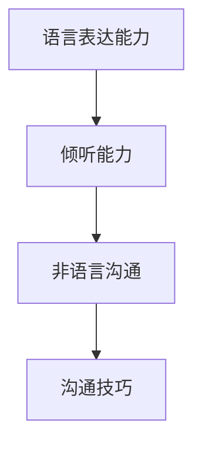
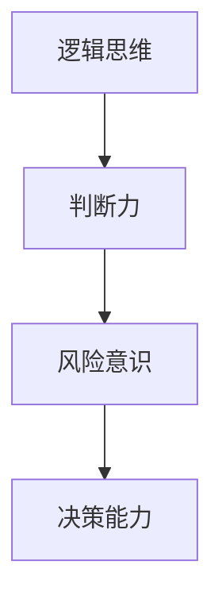
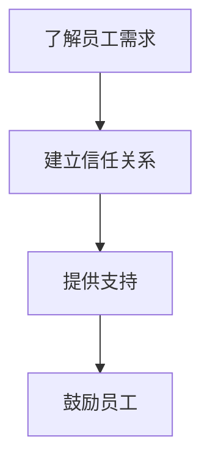

                 

```

# 文章标题：领导力与诚信：建立可信赖的领导形象

> 关键词：领导力、诚信、可信赖、领导形象、企业成功

> 摘要：本文将探讨领导力与诚信之间的关系，如何建立可信赖的领导形象，以及这对企业成功的重要性。我们将通过逐步分析领导力的关键要素、诚信的重要性，以及如何通过实际行动来树立良好的领导形象，来阐述这一主题。

## 1. 引言

领导力是企业成功的核心因素之一。在一个组织中，领导者的作用不仅仅是指导员工完成日常工作，更重要的是激发团队的潜力，推动企业不断进步。而诚信则是领导力的基石，一个缺乏诚信的领导者很难赢得员工的信任和尊重。本文将围绕领导力与诚信这一主题，探讨如何建立可信赖的领导形象，为企业发展奠定坚实基础。

## 2. 领导力的关键要素

### 2.1 沟通能力

有效的沟通是领导力的核心要素之一。领导者需要具备良好的沟通技巧，能够清晰、准确地传达信息，理解员工的反馈，建立良好的团队氛围。通过沟通，领导者可以更好地了解团队的需求和期望，从而制定出更符合实际情况的战略和计划。

#### 2.1.1 沟通能力的原理

沟通能力涉及多个方面，包括语言表达能力、倾听能力、非语言沟通等。领导者需要通过不断的实践和学习，提高自己的沟通技巧，以确保信息传递的准确性和有效性。



### 2.2 决策能力

领导者需要具备优秀的决策能力，能够在复杂多变的环境中做出正确的决策。决策能力包括对问题的分析、判断和解决问题的能力。一个优秀的领导者能够在关键时刻果断决策，并对决策结果负责。

#### 2.2.1 决策能力的原理

决策能力涉及多个方面，包括逻辑思维、判断力、风险意识等。领导者需要通过不断学习和实践，提高自己的决策能力，以应对各种挑战和困难。



### 2.3 激励能力

领导者需要具备激励能力，能够激发员工的积极性和创造力，推动团队取得更好的业绩。激励能力包括对员工的了解、信任和支持，以及对团队氛围的营造。

#### 2.2.1 激励能力的原理

激励能力涉及多个方面，包括了解员工的需求、建立信任关系、提供支持和鼓励等。领导者需要关注员工的心理需求，通过激励手段激发员工的潜能。



## 3. 诚信的重要性

### 3.1 诚信的定义

诚信是指一个人在言行上始终保持真实、可靠、正直的品质。对于领导者来说，诚信不仅是个人品质的体现，更是领导力的核心要素之一。一个诚信的领导者能够赢得员工的信任和尊重，为团队创造一个良好的工作氛围。

#### 3.1.1 诚信的定义

诚信的定义可以概括为以下几点：

- 真实：领导者需要真实地表达自己的想法和观点，不隐瞒事实。
- 可靠：领导者需要信守承诺，履行自己的责任。
- 正直：领导者需要坚持正义，不做违背道德和伦理的事情。

### 3.2 诚信对领导力的影响

诚信对领导力的影响主要表现在以下几个方面：

- 增强团队凝聚力：一个诚信的领导者能够赢得员工的信任，增强团队的凝聚力，提高团队的整体绩效。
- 提高员工满意度：一个诚信的领导者能够关注员工的需求，关心员工的成长，提高员工的满意度。
- 促进企业文化建设：一个诚信的领导者能够推动企业文化建设，为企业的长期发展奠定基础。

## 4. 建立可信赖的领导形象

### 4.1 树立诚信意识

要建立可信赖的领导形象，首先需要树立诚信意识。领导者需要从自身做起，以身作则，践行诚信原则，为员工树立榜样。

#### 4.1.1 诚信意识的培养

诚信意识的培养可以从以下几个方面入手：

- 增强道德观念：领导者需要具备强烈的道德观念，自觉遵守道德规范，不做损害企业利益的事情。
- 提高自身素质：领导者需要通过不断学习和实践，提高自己的综合素质，增强自己的领导力。
- 加强自律：领导者需要严格要求自己，遵守纪律，做到言行一致。

### 4.2 建立良好的沟通机制

良好的沟通机制是建立可信赖的领导形象的重要保障。领导者需要与员工保持良好的沟通，倾听员工的意见和建议，关注员工的需求和反馈。

#### 4.2.1 沟通机制的建立

沟通机制的建立可以从以下几个方面入手：

- 定期召开会议：领导者需要定期召开会议，与员工交流工作进展和问题，共同讨论解决方案。
- 建立反馈机制：领导者需要建立反馈机制，鼓励员工提出意见和建议，及时解决问题。
- 保持开放态度：领导者需要保持开放态度，倾听员工的意见和建议，鼓励员工参与决策过程。

### 4.3 关注员工成长

关注员工成长是建立可信赖的领导形象的重要方面。领导者需要关心员工的成长和发展，为员工提供培训和学习机会，帮助他们提升能力和素质。

#### 4.3.1 员工成长的关注

员工成长的关注可以从以下几个方面入手：

- 提供培训机会：领导者需要为员工提供培训和学习机会，帮助他们提升专业能力和综合素质。
- 建立职业规划：领导者需要与员工共同制定职业规划，帮助员工实现职业发展目标。
- 关注员工心理健康：领导者需要关注员工的心理健康，为员工提供心理支持和帮助。

## 5. 企业成功的保证

### 5.1 可信赖的领导形象对企业的积极影响

一个可信赖的领导形象对企业的积极影响主要体现在以下几个方面：

- 提高员工满意度：一个可信赖的领导者能够赢得员工的信任和尊重，提高员工的满意度，增强员工的归属感。
- 促进团队凝聚力：一个可信赖的领导者能够增强团队的凝聚力，提高团队的整体绩效。
- 增强企业竞争力：一个可信赖的领导者能够推动企业文化建设，提高企业的核心竞争力。

### 5.2 建立可信赖的领导形象的步骤

建立可信赖的领导形象需要遵循以下步骤：

1. 树立诚信意识：领导者需要从自身做起，以身作则，践行诚信原则。
2. 建立良好的沟通机制：领导者需要与员工保持良好的沟通，倾听员工的意见和建议。
3. 关注员工成长：领导者需要关心员工的成长和发展，为员工提供培训和学习机会。
4. 保持持续改进：领导者需要不断反思和改进自己的领导方式，提高自己的领导力。

## 6. 结论

领导力与诚信密切相关，一个可信赖的领导形象是企业发展的重要保证。通过树立诚信意识、建立良好的沟通机制、关注员工成长，领导者可以建立可信赖的领导形象，为企业的发展注入强大的动力。让我们共同努力，成为可信赖的领导者，推动企业取得更大的成功。

## 作者信息

作者：AI天才研究院/AI Genius Institute & 禅与计算机程序设计艺术 /Zen And The Art of Computer Programming
```

