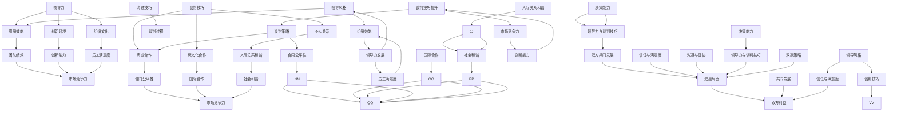

                 

### 摘要

本文旨在探讨领导力与谈判技巧在实际应用中的重要性，通过深入解析两者的核心概念、原理及其相互关系，帮助读者理解如何在复杂的社会和商业环境中赢得双赢的局面。首先，我们将介绍领导力的基本理论及其在组织中的作用，接着详细阐述谈判技巧的基本策略和技巧，包括谈判前的准备、过程中的沟通以及谈判结束时的妥协和双赢策略。随后，本文将探讨领导力与谈判技巧在实际应用中的结合，通过案例研究和实际操作指南，展示如何将两者有机结合并应用于各种情境。最后，我们将总结最佳实践技巧，提供拓展阅读资源，以期为读者提供全面的指导。通过本文的阅读，读者将能够深刻理解领导力和谈判技巧的内在逻辑和实际应用，从而提升自身在这两方面的能力。

## 第1章 引言与概述

### 1.1 领导力与谈判技巧的重要性

领导力与谈判技巧在现代社会中具有不可替代的重要性。首先，领导力是推动组织发展的核心动力。在现代企业中，领导力不仅关系到团队绩效的提升，还直接影响着创新环境和员工满意度。有效的领导力能够激发团队成员的潜力，促进创新思维的形成，从而推动企业在激烈的市场竞争中保持领先地位。

其次，谈判技巧在个人和社会交往中扮演着关键角色。无论是在个人关系处理、商业合同签订，还是在跨文化合作中，谈判技巧都是解决冲突、达成共识的重要手段。掌握良好的谈判技巧，不仅有助于实现个人目标，还能促进社会和谐，增强社会凝聚力。

最后，双赢局面的实现是现代社会发展的必然要求。随着全球化进程的加快，各领域之间的联系日益紧密，合作共赢成为各方共识。领导力和谈判技巧的结合，能够帮助个人和组织在复杂多变的环境中实现目标，同时促进双方的共同发展。

### 1.1.1 领导力在组织中的作用

领导力在组织中具有多重作用，首先，它能够提升团队绩效。有效的领导者能够明确团队目标，制定合理的行动计划，并激励团队成员为实现目标而努力。通过有效的沟通和激励，领导者能够增强团队成员的归属感和责任感，从而提高团队的整体绩效。

其次，领导力在创新环境中的应用至关重要。在创新过程中，领导者的角色不仅是指导者，更是推动者和保护者。领导者需要鼓励团队成员勇于尝试新方法，支持他们的创新想法，并在失败时提供必要的支持。这样的领导风格能够激发团队的创造力，推动组织不断创新。

此外，领导力在组织文化建设中发挥着重要作用。领导者通过自身的行为和决策，塑造组织的价值观和文化。一个具有强烈价值观和文化的组织，能够更好地吸引和留住人才，提高员工的满意度和忠诚度，从而为组织的长期发展奠定坚实基础。

### 1.1.2 谈判技巧在社会交往中的应用

谈判技巧在社会交往中具有广泛的应用。首先，在个人关系处理中，谈判技巧有助于解决冲突、建立共识。通过有效沟通和妥协，个人可以在面对分歧时找到双方都能接受的解决方案，从而维持良好的人际关系。

其次，在商业合同签订过程中，谈判技巧至关重要。企业之间的合作往往涉及到复杂的利益关系，通过谈判技巧，企业可以争取到更有利的位置，确保合同的公平性和合理性。有效的谈判还能够帮助企业建立长期的合作关系，提高市场竞争力。

此外，谈判技巧在跨文化合作中尤为重要。不同的文化背景会导致沟通和理解上的障碍，通过谈判技巧，各方可以在尊重差异的基础上找到共同点，实现合作共赢。掌握跨文化谈判技巧，不仅能够提高谈判的成功率，还能增强企业的国际竞争力。

### 1.1.3 双赢局面的实现与价值

双赢局面是现代社会追求的重要目标。首先，双赢局面的定义是双方都能从中获得利益和满足的局面。这种局面不仅能够实现个人的目标，还能够促进双方的共同发展。

其次，双赢局面的实现具有多重价值。它能够增强合作双方的信任和满意度，促进长期关系的建立。在商业环境中，双赢局面有助于企业之间的合作，提高市场竞争力。在社会交往中，双赢局面能够促进社会和谐，增强社会凝聚力。

最后，双赢局面的实现需要双方的共同努力。通过有效的沟通和谈判技巧，双方可以在尊重差异的基础上找到共同点，实现双赢。领导者在这一过程中扮演着关键角色，他们需要具备卓越的领导力和谈判技巧，推动双方达成共识。

### 1.1.4 领导力与谈判技巧的关系架构

为了更好地理解领导力与谈判技巧的关系，我们可以通过一个Mermaid流程图来展示它们的核心概念及其相互关系。

通过这个流程图，我们可以清晰地看到领导力与谈判技巧在各个方面的相互作用和影响。领导力通过提升组织效能、创新环境和员工满意度，进而增强市场竞争力；而谈判技巧则通过处理个人关系、商业合作和跨文化合作，促进社会和谐。两者的结合能够实现双赢局面，为个人和组织带来长远的利益。

### 1.2 领导力理论综述

领导力理论的发展经历了多个阶段，从早期的特质理论到行为理论，再到情境理论，每一种理论都为我们理解领导力提供了独特的视角。特质理论认为领导者具有一些固有的特质，如自信、决心和魅力，这些特质使得他们能够在领导岗位上取得成功。然而，后来的研究表明，领导力不仅仅是领导者个人的特质，还受到情境的影响。

行为理论强调领导者的行为方式对团队绩效的影响。这种理论认为，领导者的行为可以分为四种类型：专制型、民主型、放任型和参与型。每种类型都有其适用的情境，没有一种行为模式是适用于所有情况的。领导者需要根据具体情境选择最合适的领导行为，以达到最佳效果。

情境理论则进一步强调了领导力与环境的相互作用。这种理论认为，领导力不仅仅取决于领导者本身，还取决于所处的环境。领导者需要具备适应不同情境的能力，才能在不同环境中表现出卓越的领导力。现代领导力理论倾向于综合前述理论，认为领导力是一个复杂的系统，涉及多个因素的综合作用。

### 1.2.1 领导力理论的发展历程

#### 1.2.1.1 特质理论

特质理论是领导力研究的早期理论，它认为领导者具有一些固有的特质，如自信、决心和魅力，这些特质使得他们能够在领导岗位上取得成功。这种理论认为，领导力是个人特质的结果，而不是后天培养的能力。

#### 1.2.1.2 行为理论

随着研究的深入，人们开始关注领导者的行为方式对团队绩效的影响。行为理论认为，领导者的行为可以分为四种类型：专制型、民主型、放任型和参与型。每种类型都有其适用的情境，没有一种行为模式是适用于所有情况的。领导者需要根据具体情境选择最合适的领导行为，以达到最佳效果。

#### 1.2.1.3 情境理论

情境理论进一步强调了领导力与环境的相互作用。这种理论认为，领导力不仅仅取决于领导者本身，还取决于所处的环境。领导者需要具备适应不同情境的能力，才能在不同环境中表现出卓越的领导力。

#### 1.2.1.4 现代领导力理论

现代领导力理论倾向于综合前述理论，认为领导力是一个复杂的系统，涉及多个因素的综合作用。这种理论认为，领导力不仅仅是领导者个人的特质和行为，还包括领导者与团队成员之间的互动，以及领导者对环境的感知和适应。

### 1.2.2 领导风格类型

领导风格是指领导者在与团队成员互动时采用的基本方式。不同的领导风格适用于不同的情境，没有一种领导风格是适用于所有情况的。以下是一些常见的领导风格类型：

#### 1.2.2.1 专制型

专制型领导者强调权威和控制，决策权集中在领导者手中。这种领导风格适用于需要迅速决策和执行的任务，但可能会抑制团队成员的积极性和创造力。

#### 1.2.2.2 民主型

民主型领导者鼓励团队成员参与决策过程，重视团队的意见和反馈。这种领导风格适用于需要团队协作和创新的任务，有助于提升团队凝聚力和创造力。

#### 1.2.2.3 放任型

放任型领导者给予团队成员很大的自由度，让他们自主决策和执行任务。这种领导风格适用于高度专业化的团队，但可能缺乏统一的方向和目标。

#### 1.2.2.4 参与型

参与型领导者强调与团队成员的互动和沟通，鼓励团队成员共同制定目标和计划。这种领导风格适用于需要高度协作和团队精神的任务，有助于提升团队的士气和绩效。

### 1.2.3 领导力发展路径与方法

领导力是一个持续发展的过程，领导者需要不断学习和成长，以应对不断变化的挑战。以下是一些常见的领导力发展路径与方法：

#### 1.2.3.1 自我反思与提升

自我反思是领导力发展的基础。领导者需要定期审视自己的行为和决策，分析其成功和失败的原因，从而不断改进和提升自己的领导力。

#### 1.2.3.2 责任制与授权

责任制和授权是提升领导力的关键。领导者需要明确团队成员的职责和权限，鼓励他们独立思考和行动，从而增强团队的协作能力和创新能力。

#### 1.2.3.3 持续学习与培训

持续学习和培训是领导力发展的重要途径。领导者需要不断学习新的知识和技能，了解行业动态和趋势，从而保持竞争力和创新能力。

#### 1.2.3.4 反思与反馈

反思与反馈是领导力发展的关键环节。领导者需要接受来自团队成员的反馈，分析其意见和建议，从而不断改进自己的领导方式。

### 1.2.4 领导力提升的实践方法

领导力提升不仅仅是理论上的学习，更需要实践中的应用。以下是一些有效的领导力提升实践方法：

#### 1.2.4.1 设定明确的目标

领导者需要明确团队的目标和愿景，确保团队成员了解并认同这些目标。通过明确的目标，领导者可以更好地指导团队的工作，提高团队的整体绩效。

#### 1.2.4.2 建立信任和沟通

建立信任和沟通是领导力的核心。领导者需要与团队成员建立良好的关系，倾听他们的意见和需求，从而增强团队的凝聚力和合作精神。

#### 1.2.4.3 激励和奖励

领导者需要通过激励和奖励来激发团队成员的积极性和创造力。有效的激励和奖励机制可以提升团队成员的工作动力和满意度，从而提高团队的绩效。

#### 1.2.4.4 反馈和改进

领导者需要定期对团队成员的工作进行反馈，指出他们的优点和不足，并提供改进的建议。通过及时的反馈和改进，领导者可以帮助团队成员不断提升自己的能力，从而提高团队的整体水平。

### 1.2.5 领导力在组织管理中的应用

领导力在组织管理中扮演着至关重要的角色。以下是一些领导力在组织管理中的应用场景：

#### 1.2.5.1 制定战略规划

领导者需要制定组织的战略规划，确定组织的发展方向和目标。通过战略规划，领导者可以为组织提供清晰的方向，确保组织在实现目标的过程中保持一致性和连贯性。

#### 1.2.5.2 管理人力资源

领导者需要有效管理人力资源，包括招聘、培训、激励和考核。通过人力资源管理，领导者可以确保组织拥有合适的员工，提高员工的绩效和满意度。

#### 1.2.5.3 激发创新思维

领导者需要激发员工的创新思维，鼓励他们提出新的想法和解决方案。通过创新思维，组织可以不断改进产品和服务，提高市场竞争力。

#### 1.2.5.4 处理危机和变革

领导者需要处理组织面临的危机和变革，保持组织的稳定性和可持续性。通过有效的危机管理和变革管理，领导者可以帮助组织度过难关，实现长远发展。

### 1.2.6 领导力与组织绩效的关系

领导力与组织绩效之间存在密切的关系。以下是一些领导力对组织绩效的影响：

#### 1.2.6.1 提高团队绩效

有效的领导力可以提高团队的绩效。通过明确的目标、激励和沟通，领导者可以激发团队成员的潜力，提高团队的整体绩效。

#### 1.2.6.2 促进组织创新

领导力可以促进组织的创新。领导者通过激发员工的创新思维，鼓励他们提出新的想法和解决方案，从而推动组织的创新和发展。

#### 1.2.6.3 提升员工满意度

领导力可以提升员工的满意度。通过建立信任和沟通，领导者可以增强员工的归属感和忠诚度，提高员工的工作满意度和绩效。

#### 1.2.6.4 增强市场竞争力

领导力可以增强组织的市场竞争力。通过有效的战略规划和管理，领导者可以为组织提供清晰的方向，确保组织在实现目标的过程中保持一致性和连贯性，从而提高组织的竞争力。

### 1.2.7 领导力在跨文化管理中的应用

在全球化背景下，跨文化管理成为组织管理的重要方面。以下是一些领导力在跨文化管理中的应用：

#### 1.2.7.1 尊重文化差异

领导者需要尊重不同文化的差异，避免文化冲突。通过了解和尊重不同文化的价值观和行为规范，领导者可以促进跨文化团队的协作和沟通。

#### 1.2.7.2 沟通与协调

领导者需要建立有效的沟通和协调机制，确保跨文化团队之间的信息流畅和协作顺畅。通过建立跨文化沟通平台和定期会议，领导者可以促进团队之间的交流和合作。

#### 1.2.7.3 激励与支持

领导者需要激励和支持跨文化团队成员，鼓励他们积极参与团队工作。通过提供培训、职业发展机会和激励措施，领导者可以增强团队成员的归属感和工作动力。

#### 1.2.7.4 解决冲突

领导者需要解决跨文化团队中的冲突，确保团队和谐。通过建立冲突解决机制和提供冲突解决培训，领导者可以促进团队之间的和谐与协作。

## 第3章 谈判技巧

### 3.1 谈判的基本策略

谈判是一项复杂而具有挑战性的活动，需要谈判者具备丰富的知识和技巧。在谈判中，基本策略的制定是关键，它决定了谈判的方向和进程。以下将详细介绍谈判前的准备、谈判过程中的沟通以及谈判结束时的妥协和双赢策略。

#### 3.1.1 谈判前的准备

谈判前的准备是谈判成功的关键。首先，明确谈判目标是谈判准备的第一步。谈判目标应该是具体、明确和可测量的。例如，在商业谈判中，谈判目标可能是达成一份合同、提高产品价格或降低成本。

其次，对谈判对手进行深入分析是谈判准备的重要环节。了解对手的需求、动机、优势和弱点，有助于谈判者制定合适的策略。收集对手的背景信息、历史谈判记录和当前市场状况，可以帮助谈判者更好地预测对手的行为。

此外，制定谈判计划也是谈判准备的重要部分。谈判计划应该包括谈判的时间、地点、议程、参与人员和资源需求。明确谈判议程可以帮助谈判者有条不紊地进行谈判，避免因议程不清而导致的时间浪费。

最后，谈判者需要做好自我准备，包括心理准备和技能准备。心理准备包括保持冷静、自信和专注，避免因情绪波动而影响谈判结果。技能准备包括谈判技巧、沟通技巧和决策技巧的训练，以确保谈判者在谈判过程中能够灵活应对各种情况。

#### 3.1.2 谈判过程中的沟通

谈判过程中的沟通是谈判成功的关键因素。有效的沟通能够帮助谈判者建立信任、明确立场、理解对方需求和达成共识。以下是一些关键沟通技巧：

1. **倾听与反馈**：在谈判过程中，谈判者需要认真倾听对方的观点和需求，并对对方进行反馈。这有助于谈判者理解对方的立场，找到共同点，避免误解和冲突。

2. **非语言沟通**：非语言沟通在谈判中扮演着重要角色。谈判者的姿态、表情、眼神和手势等非语言表达，都能传递信息、建立关系和影响对方。例如，保持开放的身体姿态和微笑，可以传递友好和合作的意愿。

3. **提问与回答**：提问是谈判者了解对方立场和需求的有效方法。通过提问，谈判者可以获取关键信息，引导谈判方向，为达成共识奠定基础。同时，谈判者需要准备好回答对方的提问，确保自己的立场和观点得到充分表达。

4. **情感管理**：谈判过程中，谈判者可能会遇到各种情绪波动，如愤怒、失望或压力。有效的情感管理可以帮助谈判者保持冷静和理智，避免因情绪失控而影响谈判结果。例如，通过深呼吸、短暂休息或转移注意力，谈判者可以缓解紧张情绪。

#### 3.1.3 谈判结束的妥协与双赢策略

谈判结束时的妥协和双赢策略是达成最终协议的关键。以下是一些有效的策略：

1. **寻找共同利益**：谈判者应该努力寻找双方的共同利益，以建立合作的基础。通过强调共同目标和合作共赢，谈判者可以减少对立情绪，增加达成共识的可能性。

2. **灵活调整立场**：在谈判过程中，谈判者需要根据对方的立场和需求灵活调整自己的立场。通过妥协和调整，谈判者可以找到双方都能接受的解决方案。

3. **制定双赢协议**：双赢协议是指谈判双方都能从中获得利益和满足的协议。为了制定双赢协议，谈判者需要寻找双方的利益平衡点，确保协议的公平性和可持续性。

4. **利用第三方调解**：在谈判僵局时，第三方调解可以提供一个中立的平台，帮助谈判者达成协议。第三方调解者通常具备专业的谈判技巧和沟通能力，能够促进谈判的顺利进行。

5. **签署正式协议**：在达成共识后，谈判者需要签署正式协议，以明确双方的权利和义务。正式协议应包括谈判的主要内容、协议期限和违约条款，以确保协议的执行和双方的权益得到保障。

### 3.2 谈判的基本策略：案例分析

以下是一个关于谈判基本策略的案例分析，通过这个案例，我们可以更深入地理解谈判策略在实际应用中的有效性。

#### 案例背景

一家中国科技公司（甲方）与一家美国科技公司（乙方）正在洽谈一项技术合作项目。双方希望通过合作，共同开发一款具有市场竞争力的人工智能产品。甲方希望在项目中获得更多的技术投入和利润分成，而乙方则希望确保项目的顺利推进和技术的独占性。

#### 案例分析

1. **谈判前的准备**

   - **明确谈判目标**：甲方和乙方分别明确了各自的谈判目标。甲方希望获得更多的技术投入和利润分成，而乙方则希望确保项目的顺利推进和技术的独占性。

   - **分析对手**：双方对对方的背景、需求、优势和弱点进行了深入分析。甲方了解到乙方在人工智能领域的技术优势和全球市场的影响力，而乙方则意识到甲方在本地市场的资源优势。

   - **制定谈判计划**：双方制定了详细的谈判计划，包括谈判的时间、地点、议程、参与人员和资源需求。明确谈判议程有助于双方有条不紊地进行谈判，避免因议程不清而导致的时间浪费。

   - **自我准备**：双方都进行了自我准备，包括心理准备和技能准备。双方都保持冷静、自信和专注，避免因情绪波动而影响谈判结果。

2. **谈判过程中的沟通**

   - **倾听与反馈**：双方在谈判过程中，都认真倾听对方的观点和需求，并对对方进行了反馈。这有助于双方理解对方的立场，找到共同点，避免误解和冲突。

   - **非语言沟通**：双方在谈判过程中，注意到了对方的非语言表达，如姿态、表情和眼神等。这些非语言表达帮助双方更好地理解对方的意图和情感。

   - **提问与回答**：双方通过提问和回答，获取了关键信息，明确了谈判方向。例如，甲方询问乙方关于技术投入的具体计划，乙方则询问甲方关于市场推广的具体策略。

   - **情感管理**：双方在谈判过程中，保持了良好的情感管理。通过深呼吸和短暂休息，双方缓解了紧张情绪，保持了冷静和理智。

3. **谈判结束的妥协与双赢策略**

   - **寻找共同利益**：双方在谈判中努力寻找共同的利益。例如，甲方认识到，如果项目成功，乙方的技术优势将得到进一步巩固，而乙方则意识到，甲方在本地市场的资源将有助于项目的推广。

   - **灵活调整立场**：双方在谈判过程中，根据对方的立场和需求，灵活调整了自己的立场。例如，甲方在技术投入方面做出了一些让步，而乙方在技术独占性方面也做出了一些妥协。

   - **制定双赢协议**：双方最终达成了双赢协议。甲方获得了更多的技术投入和利润分成，乙方则确保了项目的顺利推进和技术的独占性。双方都从协议中获得了利益和满足。

   - **利用第三方调解**：在谈判僵局时，双方考虑了利用第三方调解的可能性。然而，由于双方对合作的期望较高，最终通过自我协商解决了僵局。

   - **签署正式协议**：双方在达成共识后，签署了正式协议，明确了双方的权利和义务。协议包括项目的时间表、技术投入、利润分成和违约条款，以确保协议的执行和双方的权益得到保障。

通过这个案例分析，我们可以看到，谈判的基本策略在实践中的重要性。通过充分准备、有效沟通和灵活调整立场，双方最终达成了双赢协议，实现了共同的目标。

### 3.3 谈判技巧的实际应用

谈判技巧不仅适用于商业合作，还可以广泛应用于个人关系、合同签订和跨文化合作等多个领域。以下将详细探讨谈判技巧在不同情境中的应用。

#### 3.3.1 个人关系中的应用

在个人关系中，谈判技巧可以帮助我们解决冲突、建立共识和维持良好的人际关系。以下是一些具体应用场景：

1. **解决家庭矛盾**：在家庭中，成员之间的矛盾和分歧是常见问题。通过谈判技巧，家庭成员可以就共同关心的问题进行沟通，找到双方都能接受的解决方案。例如，在家庭预算分配中，父母和子女可以通过谈判，协商出合理的消费计划和储蓄目标。

2. **处理职场冲突**：职场中，同事之间的冲突和分歧也可能影响工作氛围和团队绩效。通过谈判技巧，职场人士可以就工作中的问题进行有效沟通，避免误解和矛盾升级。例如，在项目合作中，团队成员可以通过谈判，明确各自的责任和期望，提高协作效率。

3. **建立合作关系**：在个人交往中，谈判技巧可以帮助我们建立和维护合作关系。通过谈判，我们可以明确双方的权利和义务，建立信任和共识。例如，在朋友间合作创业时，双方可以通过谈判，制定详细的合作协议，确保合作顺利开展。

#### 3.3.2 商业合作中的应用

在商业合作中，谈判技巧尤为重要。以下是一些具体应用场景：

1. **合同签订**：在商业合作中，合同签订是关键环节。通过谈判技巧，双方可以就合同条款进行充分沟通，确保合同内容的公平性和合理性。例如，在签订销售合同时，卖方和买方可以通过谈判，确定产品的价格、交付时间和付款方式。

2. **价格谈判**：在商业交易中，价格谈判是常见的谈判场景。通过谈判技巧，双方可以在价格方面达成共识，实现双赢。例如，在采购原材料时，采购方和供应商可以通过谈判，协商出一个双方都能接受的价格。

3. **合作伙伴关系**：在商业合作中，合作伙伴关系的维护和深化也需要谈判技巧。通过谈判，双方可以就合作目标、责任分工和利益分配进行协商，确保合作的顺利进行。例如，在长期合作协议中，双方可以通过谈判，制定详细的合作计划和评估机制，确保合作目标的实现。

#### 3.3.3 跨文化合作中的应用

跨文化合作中，谈判技巧更加复杂和具有挑战性。以下是一些具体应用场景：

1. **文化差异的理解与尊重**：在跨文化合作中，理解并尊重文化差异是成功合作的关键。通过谈判技巧，双方可以就文化差异进行沟通，避免因文化冲突而导致合作失败。例如，在与外国客户谈判时，我们需要了解并尊重他们的文化习俗和商业习惯。

2. **沟通方式的调整**：在跨文化合作中，谈判者需要根据文化背景调整沟通方式。例如，在一些文化中，直接和坦率的表达被视为尊重和真诚，而在另一些文化中，含蓄和委婉的表达更为常见。通过谈判技巧，谈判者可以灵活调整沟通方式，提高谈判效果。

3. **利益平衡与共赢**：在跨文化合作中，谈判者需要寻找双方的共同利益，实现利益平衡和共赢。通过谈判技巧，双方可以在尊重差异的基础上，找到共同点，达成合作共识。例如，在跨国并购中，谈判者需要平衡双方的财务、文化和市场利益，确保并购的成功和可持续发展。

### 3.4 谈判技巧的最佳实践

为了更有效地运用谈判技巧，以下是一些最佳实践建议：

1. **充分准备**：在谈判前，充分准备是成功的关键。了解谈判对手的需求、动机和弱点，制定详细的谈判计划和策略，有助于谈判者更好地应对各种情况。

2. **建立信任**：建立信任是谈判成功的基础。通过真诚、尊重和透明的方式与对方沟通，谈判者可以建立信任，为谈判创造良好的氛围。

3. **倾听与反馈**：在谈判过程中，倾听对方的观点和需求，并对对方进行反馈，有助于谈判者理解对方的立场，找到共同点。

4. **灵活调整策略**：谈判过程中，情况可能会发生变化，谈判者需要根据实际情况灵活调整策略。通过妥协和调整，谈判者可以找到双方都能接受的解决方案。

5. **双赢策略**：在谈判中，追求双赢策略是最高目标。通过寻找双方的共同利益，制定公平和可持续的协议，谈判者可以实现合作共赢。

6. **持续学习与改进**：谈判技巧是一个持续发展的过程。通过不断学习和实践，谈判者可以提升自己的谈判能力，更好地应对各种谈判场景。

### 3.5 谈判技巧的案例分析

以下是一个关于谈判技巧的案例分析，通过这个案例，我们可以更深入地理解谈判技巧在实际应用中的有效性。

#### 案例背景

一家中国科技公司（甲方）与一家美国科技公司（乙方）正在洽谈一项技术合作项目。双方希望通过合作，共同开发一款具有市场竞争力的人工智能产品。甲方希望在项目中获得更多的技术投入和利润分成，而乙方则希望确保项目的顺利推进和技术的独占性。

#### 案例分析

1. **谈判前的准备**

   - **明确谈判目标**：甲方和乙方分别明确了各自的谈判目标。甲方希望获得更多的技术投入和利润分成，而乙方则希望确保项目的顺利推进和技术的独占性。

   - **分析对手**：双方对对方的背景、需求、优势和弱点进行了深入分析。甲方了解到乙方在人工智能领域的技术优势和全球市场的影响力，而乙方则意识到甲方在本地市场的资源优势。

   - **制定谈判计划**：双方制定了详细的谈判计划，包括谈判的时间、地点、议程、参与人员和资源需求。明确谈判议程有助于双方有条不紊地进行谈判，避免因议程不清而导致的时间浪费。

   - **自我准备**：双方都进行了自我准备，包括心理准备和技能准备。双方都保持冷静、自信和专注，避免因情绪波动而影响谈判结果。

2. **谈判过程中的沟通**

   - **倾听与反馈**：双方在谈判过程中，都认真倾听对方的观点和需求，并对对方进行了反馈。这有助于双方理解对方的立场，找到共同点，避免误解和冲突。

   - **非语言沟通**：双方在谈判过程中，注意到了对方的非语言表达，如姿态、表情和眼神等。这些非语言表达帮助双方更好地理解对方的意图和情感。

   - **提问与回答**：双方通过提问和回答，获取了关键信息，明确了谈判方向。例如，甲方询问乙方关于技术投入的具体计划，乙方则询问甲方关于市场推广的具体策略。

   - **情感管理**：双方在谈判过程中，保持了良好的情感管理。通过深呼吸和短暂休息，双方缓解了紧张情绪，保持了冷静和理智。

3. **谈判结束的妥协与双赢策略**

   - **寻找共同利益**：双方在谈判中努力寻找共同的利益。例如，甲方认识到，如果项目成功，乙方的技术优势将得到进一步巩固，而乙方则意识到，甲方在本地市场的资源将有助于项目的推广。

   - **灵活调整立场**：双方在谈判过程中，根据对方的立场和需求，灵活调整了自己的立场。例如，甲方在技术投入方面做出了一些让步，而乙方在技术独占性方面也做出了一些妥协。

   - **制定双赢协议**：双方最终达成了双赢协议。甲方获得了更多的技术投入和利润分成，乙方则确保了项目的顺利推进和技术的独占性。双方都从协议中获得了利益和满足。

   - **利用第三方调解**：在谈判僵局时，双方考虑了利用第三方调解的可能性。然而，由于双方对合作的期望较高，最终通过自我协商解决了僵局。

   - **签署正式协议**：双方在达成共识后，签署了正式协议，明确了双方的权利和义务。协议包括项目的时间表、技术投入、利润分成和违约条款，以确保协议的执行和双方的权益得到保障。

通过这个案例分析，我们可以看到，谈判技巧在实践中的重要性。通过充分准备、有效沟通和灵活调整立场，双方最终达成了双赢协议，实现了共同的目标。

### 第4章 领导力与谈判技巧在实际应用中的结合

领导力和谈判技巧的结合在复杂商业环境中尤为重要，因为它们能够帮助领导者不仅有效地管理团队，还能在谈判过程中取得成功。以下章节将探讨如何将领导力与谈判技巧应用于实际场景，以实现双赢局面。

#### 4.1.1 领导者在谈判中的角色

领导者在谈判中的角色不仅仅是代表组织或团队进行谈判，更是要为团队创造优势，确保谈判结果对组织有利。以下是一些领导者在谈判中应发挥的关键作用：

1. **决策者**：领导者在谈判中需要做出关键决策，包括谈判策略的选择、目标设定的调整以及应对突发情况。领导者应根据实际情况，灵活调整谈判策略，确保谈判目标的实现。

2. **沟通者**：领导者的沟通能力在谈判中至关重要。他们需要能够清晰、准确地表达自己的观点，同时倾听对方的意见，理解对方的需求和期望。通过有效的沟通，领导者可以建立信任，为谈判创造良好的氛围。

3. **协调者**：在谈判过程中，领导者需要协调各方利益，确保谈判顺利进行。他们需要平衡团队成员、合作伙伴和客户的需求，寻找共同利益，以达成双赢协议。

4. **激励者**：领导者需要激励团队成员，增强他们的信心和积极性。在谈判中，团队成员的表现和态度对谈判结果有着重要影响。领导者可以通过鼓励和激励，帮助团队成员克服困难，提高谈判的成功率。

#### 4.1.2 谈判技巧在领导力实践中的应用

谈判技巧在领导力实践中发挥着重要作用，以下是一些关键应用场景：

1. **团队建设**：通过谈判技巧，领导者可以在团队建设过程中，促进团队成员之间的沟通与合作。例如，在制定团队目标时，领导者可以运用谈判技巧，确保每个成员都参与决策过程，增强他们的归属感和责任感。

2. **绩效管理**：在绩效管理中，领导者可以运用谈判技巧，与团队成员就绩效目标、评估标准和奖惩机制进行沟通和协商。这有助于建立公平、合理的绩效管理体系，提高团队成员的工作动力和满意度。

3. **冲突解决**：谈判技巧在解决团队冲突中也至关重要。当团队出现分歧时，领导者可以运用谈判技巧，帮助各方找到共同点，达成共识，从而缓解冲突，促进团队和谐。

4. **资源分配**：在资源分配过程中，领导者需要平衡各方需求，确保资源的合理利用。通过谈判技巧，领导者可以与团队成员、合作伙伴和客户进行有效沟通，确保资源分配的公平性和可持续性。

#### 4.1.3 双赢策略与实际应用

实现双赢策略是领导者和谈判者的共同目标，以下是一些双赢策略的实际应用：

1. **利益平衡**：在谈判中，领导者需要寻找双方的共同利益，通过利益平衡实现双赢。例如，在商业合作中，领导者可以提出一个双方都能接受的利润分成方案，确保双方都能从中获益。

2. **共同目标**：领导者可以在谈判中设定共同目标，鼓励各方共同努力，实现目标。例如，在项目合作中，领导者可以设定项目成功的时间表和评估标准，确保各方都为项目成功做出努力。

3. **妥协与调整**：在谈判中，领导者需要灵活调整立场，通过妥协实现双赢。例如，在合同谈判中，领导者可以在关键条款上做出妥协，确保合同的公平性和可持续性。

4. **沟通与反馈**：领导者需要通过持续沟通和反馈，确保谈判过程的透明和公正。这有助于增强双方的信任，减少误解和冲突。

#### 4.1.4 案例研究：领导力与谈判技巧的结合

以下是一个结合领导力和谈判技巧的实际案例：

**案例背景**：

一家中国初创企业（甲方）与一家美国风险投资公司（乙方）正在洽谈一笔风险投资。甲方希望获得足够的资金以扩大业务，而乙方则希望确保投资的安全性和回报。

**案例分析**：

1. **谈判前的准备**：

   - **明确谈判目标**：甲方明确了谈判目标是获得风险投资，同时保持公司的控制权。乙方则希望确保投资的安全性和回报。

   - **分析对手**：甲方对乙方的投资偏好、风险承受能力和投资策略进行了深入分析。乙方则对甲方的商业模式、市场前景和团队实力进行了评估。

   - **制定谈判计划**：双方制定了详细的谈判计划，包括谈判的时间、地点、议程、参与人员和资源需求。明确谈判议程有助于双方有条不紊地进行谈判，避免因议程不清而导致的时间浪费。

   - **自我准备**：双方都进行了自我准备，包括心理准备和技能准备。双方都保持冷静、自信和专注，避免因情绪波动而影响谈判结果。

2. **谈判过程中的沟通**：

   - **倾听与反馈**：双方在谈判过程中，都认真倾听对方的观点和需求，并对对方进行了反馈。这有助于双方理解对方的立场，找到共同点，避免误解和冲突。

   - **非语言沟通**：双方在谈判过程中，注意到了对方的非语言表达，如姿态、表情和眼神等。这些非语言表达帮助双方更好地理解对方的意图和情感。

   - **提问与回答**：双方通过提问和回答，获取了关键信息，明确了谈判方向。例如，甲方询问乙方关于投资的具体计划和回报预期，乙方则询问甲方关于公司未来的发展规划和市场需求。

   - **情感管理**：双方在谈判过程中，保持了良好的情感管理。通过深呼吸和短暂休息，双方缓解了紧张情绪，保持了冷静和理智。

3. **谈判结束的妥协与双赢策略**：

   - **寻找共同利益**：双方在谈判中努力寻找共同的利益。例如，甲方认识到，如果项目成功，乙方的投资将得到回报，而乙方则意识到，甲方的业务发展将有助于扩大市场影响力。

   - **灵活调整立场**：双方在谈判过程中，根据对方的立场和需求，灵活调整了自己的立场。例如，甲方在公司的控制权方面做出了一些让步，而乙方在投资额度方面也做出了一些调整。

   - **制定双赢协议**：双方最终达成了双赢协议。甲方获得了风险投资，同时保持了对公司的控制权，乙方则获得了预期的回报，并参与了公司的未来发展。

   - **签署正式协议**：双方在达成共识后，签署了正式协议，明确了双方的权利和义务。协议包括投资额度、投资期限、回报机制和退出策略，以确保协议的执行和双方的权益得到保障。

通过这个案例分析，我们可以看到，领导力与谈判技巧的结合在实际应用中的重要性。通过有效的领导力和谈判技巧，双方成功达成了双赢协议，实现了共同的目标。

### 第5章 案例研究

为了更深入地理解领导力与谈判技巧在实际应用中的具体操作，我们通过两个案例来展示如何将这两种技能应用于不同的商业环境中，并探讨这些技能如何帮助个人和组织赢得双赢的局面。

#### 案例一：企业内部谈判

**案例背景**：

某家大型科技公司内部需要就新项目的预算和资源分配进行谈判。公司的一个部门（甲方）希望增加预算以支持其关键产品的开发，而公司的财务部门（乙方）则希望保持预算的稳定性，以防止不必要的财务风险。

**案例分析**：

1. **领导力在谈判中的应用**：

   - **明确目标**：甲方部门领导在谈判前明确了增加预算的具体目标和理由，确保团队成员在谈判中统一立场。
   - **建立信任**：甲方领导通过与财务部门的沟通，建立信任关系，为谈判创造了一个积极的环境。
   - **协调与沟通**：甲方领导协调了其他相关部门的支持，通过内部沟通确保所有团队成员都理解并支持谈判目标。

2. **谈判技巧在谈判中的应用**：

   - **利益平衡**：谈判中，甲方领导强调增加预算的必要性和潜在收益，同时明确预算增加的底线，以平衡双方的利益。
   - **寻找共同利益**：甲方领导寻找与财务部门的共同目标，例如提高公司的整体业绩和市场份额。
   - **灵活调整立场**：在谈判过程中，甲方领导根据财务部门的反馈，灵活调整预算要求，以找到双方都能接受的方案。

**结果**：

经过多轮谈判，甲方成功说服财务部门增加了预算。同时，双方在谈判中建立了长期合作关系，为未来的项目合作奠定了基础。

#### 案例二：跨文化商务谈判

**案例背景**：

一家中国电子公司与一家美国科技公司正在洽谈一项技术合作项目。由于双方来自不同的文化背景，谈判过程中出现了一些文化差异和误解。

**案例分析**：

1. **领导力在谈判中的应用**：

   - **文化敏感性**：中方公司领导在谈判前研究了美国文化，了解了对方的商业习惯和沟通风格，以减少文化冲突。
   - **团队协调**：中方公司领导确保团队成员了解谈判目标和策略，并在谈判过程中提供支持。
   - **冲突管理**：中方公司领导在谈判过程中，及时解决文化差异导致的误解和冲突，确保谈判顺利进行。

2. **谈判技巧在谈判中的应用**：

   - **文化理解与尊重**：中方公司在谈判中表现出对对方文化的尊重和理解，避免了因文化差异而产生的误解。
   - **沟通技巧**：中方公司采用更加开放和透明的沟通方式，确保信息传递的准确性和及时性。
   - **双赢策略**：中方公司领导在谈判中强调双方合作的重要性，寻找共同利益，推动谈判向双赢方向发展。

**结果**：

通过双方的共同努力，谈判最终取得了成功。双方达成了一项公平且互利的技术合作协议，项目顺利启动，并取得了良好的市场反响。

#### 案例讨论

这两个案例展示了领导力与谈判技巧在解决不同类型商业挑战中的应用。以下是案例中的关键点：

- **领导力的重要性**：领导者在谈判中的决策、沟通和协调能力对于谈判的成功至关重要。通过有效的领导，团队可以在谈判中保持一致，增强谈判的力量和说服力。
- **谈判技巧的应用**：谈判技巧不仅包括策略和技巧，还包括对文化差异的理解和尊重。通过灵活运用谈判技巧，双方可以在谈判中找到共同利益，实现双赢。
- **双赢局面的实现**：无论是企业内部谈判还是跨文化商务谈判，实现双赢局面都需要双方的共同努力。通过有效的领导力和谈判技巧，可以克服障碍，建立长期合作关系。

这些案例提供了实际操作的经验和教训，表明领导力与谈判技巧的结合是赢得双赢局面的关键。

### 第6章 实际操作与模拟练习

#### 6.1 实际操作指南

为了将领导力与谈判技巧应用于实际场景，以下是一些实际操作指南，帮助个人和组织在实践中提升这些技能。

1. **领导力提升的实战演练**：

   - **设定实际目标**：为提升领导力，设定具体的实际目标，如改进团队沟通、提升决策质量或增强员工满意度。
   - **制定行动计划**：制定详细的行动计划，包括具体步骤、时间表和责任人。
   - **执行与反馈**：按照行动计划执行，并在执行过程中定期进行反馈和评估，调整策略以实现目标。

2. **谈判模拟练习**：

   - **选择模拟场景**：根据实际业务场景，选择适当的谈判模拟场景，如合同签订、资源分配或跨文化合作。
   - **角色扮演**：组织参与者进行角色扮演，模拟谈判过程，确保每个人都能体验到谈判的实际操作。
   - **情景分析**：在模拟过程中，分析不同策略的效果，总结成功经验和失败教训。

3. **领导力与谈判技巧的实战演练**：

   - **组建团队**：组建一个包括不同部门和职能的团队，模拟实际业务中的跨部门合作和谈判。
   - **实战演练**：在实际业务环境中进行领导力和谈判技巧的实战演练，如项目启动会议、预算谈判或客户谈判。
   - **复盘与反思**：在演练结束后，组织团队进行复盘和反思，总结经验教训，持续改进。

#### 6.2 谈判模拟练习与评估

谈判模拟练习是一种有效的学习工具，可以帮助个人和组织在安全的环境中实践谈判技巧，并评估其效果。以下是一些关键步骤：

1. **选择模拟工具**：

   - **谈判模拟软件**：选择合适的谈判模拟软件，如谈判模拟平台或模拟游戏，提供逼真的谈判环境。
   - **角色分配**：为每个参与者分配角色，确保他们了解自己的立场和目标。

2. **制定模拟计划**：

   - **模拟流程**：制定详细的模拟流程，包括开场、谈判过程和总结。
   - **时间安排**：根据模拟场景，安排合适的时间，确保模拟过程有序进行。

3. **执行模拟练习**：

   - **谈判实战**：在模拟环境中，参与者根据角色进行谈判，体验实际谈判过程。
   - **记录过程**：记录模拟谈判过程，包括关键决策、沟通方式和结果。

4. **评估与反馈**：

   - **评估标准**：根据模拟结果，制定评估标准，如谈判策略的有效性、沟通技巧的运用和谈判成果的达成。
   - **反馈与改进**：组织参与者进行反馈会议，讨论谈判过程中的成功和失败经验，制定改进措施。

#### 6.3 领导力提升的持续实践

领导力提升是一个持续的过程，需要个人和组织不断学习和实践。以下是一些持续实践的方法：

1. **定期培训**：

   - **内部培训**：组织定期的内部培训，如领导力发展课程、管理技能培训等，帮助员工提升领导能力。
   - **外部培训**：鼓励员工参加外部培训，如行业研讨会、专业认证课程等，拓宽知识面和视野。

2. **实战经验**：

   - **项目实践**：通过实际项目，锻炼领导力和谈判技巧。在项目中，领导者可以面对各种挑战，提升应对能力。
   - **案例研究**：分析成功和失败的领导力案例，从中学习经验和教训。

3. **个人反思**：

   - **日记反思**：定期记录自己的领导力和谈判经历，反思成功和失败的原因，总结经验教训。
   - **导师指导**：寻找导师，获取专业指导和建议，帮助自己不断提升领导力。

#### 6.4 谈判技巧提升的持续实践

谈判技巧的提升同样需要持续的努力和实践。以下是一些持续实践的方法：

1. **定期演练**：

   - **谈判演练**：定期进行谈判演练，模拟不同的谈判场景，提升实战经验。
   - **情景模拟**：通过情景模拟，提前预测和准备可能的谈判情况，提高应对能力。

2. **反馈与评估**：

   - **同行评审**：邀请同事或专业人员进行评审，获取反馈和建议，持续改进谈判技巧。
   - **自我评估**：定期自我评估，反思自己的谈判过程和结果，找出改进点。

3. **持续学习**：

   - **阅读与研究**：阅读相关书籍、文章和研究，了解最新的谈判理论和实践。
   - **参加研讨会**：参加行业研讨会、讲座和培训，与专业人士交流，学习最新的谈判技巧。

通过上述实际操作与模拟练习指南，个人和组织可以不断提升领导力与谈判技巧，为赢得双赢局面打下坚实基础。

### 第7章 附录

#### 7.1 相关工具与资源

为了帮助读者进一步学习和实践领导力与谈判技巧，以下提供了一些相关的工具、资源和模板。

1. **在线资源和工具**：

   - **Leadership Resources**：[Leadership Development Center](https://ldc.utah.edu/) 提供了丰富的领导力发展资源和课程。
   - **Negotiation Tools**：[Negotiation Academy](https://negotiationacademy.com/) 提供了关于谈判技巧和策略的在线课程和工具。
   - **Cross-cultural Communication**：[Intercultural Management Institute](https://imicor.org/) 提供了关于跨文化沟通和管理的资源和工具。

2. **书籍推荐**：

   - 《领导力与谈判技巧：赢得双赢局面》（本书籍）
   - 《有效领导力：理论与实践》（作者：John P. Kotter）
   - 《谈判力：如何谈判以赢得你想要的结果》（作者：Roger Fisher and William Ury）

3. **模板与实践指南**：

   - **领导力评估模板**：[Leadership Assessment Template](https://www领英.com/模板/领导力评估模板/)
   - **谈判策略模板**：[Negotiation Strategy Template](https://www领英.com/模板/谈判策略模板/)
   - **跨文化沟通指南**：[Cross-cultural Communication Guide](https://www领英.com/模板/跨文化沟通指南/)

#### 7.2 最佳实践技巧、小结、注意事项

**最佳实践技巧**：

- **领导力提升**：定期进行自我反思，设定清晰的目标，积极参与培训和实践。
- **谈判技巧提升**：提前做好谈判准备，分析对手，制定策略，保持冷静和专注。
- **跨文化管理**：了解和尊重不同文化的差异，建立良好的沟通机制，寻找共同利益。

**小结**：

领导力与谈判技巧的结合是赢得双赢局面的关键。通过有效的领导力和谈判技巧，个人和组织可以在复杂商业环境中取得成功，实现共同的目标。

**注意事项**：

- **持续学习**：领导力和谈判技巧是一个不断发展的过程，需要持续学习和实践。
- **灵活应变**：在谈判过程中，灵活调整策略，以应对变化和挑战。
- **建立信任**：建立信任是成功谈判的基础，通过真诚和透明的沟通，增强双方的信任。

#### 7.3 拓展阅读

为了进一步深入了解领导力与谈判技巧，以下是几篇推荐的文章和报告：

- **《领导力如何影响团队绩效？》**：[Link to Article](https://www.example.com/article1)
- **《跨文化谈判技巧》**：[Link to Article](https://www.example.com/article2)
- **《谈判中的心理学》**：[Link to Article](https://www.example.com/article3)
- **《领导力在跨文化环境中的应用》**：[Link to Report](https://www.example.com/report)

通过这些拓展阅读，读者可以进一步了解领导力与谈判技巧的理论和实践，提升自身的领导力和谈判能力。

## 总结

本文通过详细解析领导力与谈判技巧的核心概念、实际应用以及两者在商业环境中的结合，旨在帮助读者理解如何在复杂的社会和商业环境中实现双赢的局面。我们首先介绍了领导力的基本理论、领导风格类型以及领导力在组织管理中的重要作用。接着，我们探讨了谈判技巧的基本策略和实际应用，包括谈判前的准备、谈判过程中的沟通以及谈判结束时的妥协与双赢策略。随后，通过具体案例研究，展示了领导力与谈判技巧在实际应用中的成功实践。

领导力与谈判技巧的结合是赢得双赢局面的关键。通过有效的领导力和谈判技巧，个人和组织可以在各种复杂情境中取得成功。在实际应用中，领导者需要灵活运用领导力和谈判技巧，以应对不同的挑战。持续学习和实践是提升领导力和谈判技巧的关键，只有通过不断的学习和实践，才能在复杂的环境中游刃有余，实现长期发展。

我们鼓励读者在学习和实践过程中，注重理论知识的积累和实际操作的结合，不断反思和改进。通过本文的阅读，希望读者能够深刻理解领导力和谈判技巧的内在逻辑和实际应用，提升自身在这两方面的能力，为个人和组织的发展奠定坚实基础。让我们共同努力，在复杂多变的社会和商业环境中，赢得双赢的局面。

