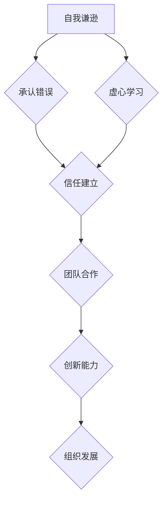

                 


### 谦逊领导力的定义与重要性

谦逊领导力是一种以谦逊为核心的领导风格，强调领导者应当具备自我反思、承认错误、倾听他人意见等品质。这种领导风格不仅关注个人领导能力的提升，更强调通过自我谦逊、承认错误和虚心学习来影响和激励团队成员。谦逊领导力在全球范围内被广泛研究和应用，原因在于其在组织管理中的显著优势。

**背景介绍**

领导力是一种影响力，它能够激发团队的合作精神和创造力，推动组织实现目标。然而，传统的权威型领导风格往往导致领导与团队成员之间的隔阂，限制了团队的潜力和创新能力。随着时代的发展，人们逐渐认识到，领导者应当具备谦逊的品质，以建立更高的信任度和协作关系。谦逊领导力因此应运而生，成为现代领导力研究的一个重要方向。

**核心概念与联系**

谦逊领导力包括以下几个核心概念：

1. **自我谦逊**：领导者能够自我反思，认识到自己的不足，并从错误中学习。这种自我谦逊不仅有助于提高领导者的个人素质，还能为团队成员树立榜样，激励他们敢于面对自己的不足。

2. **承认错误**：领导者敢于承认自己的错误，并积极寻求解决方案。这种态度不仅能够赢得团队成员的尊重，还能增强团队的凝聚力和合作精神。

3. **虚心学习**：领导者具备持续学习的能力，不断更新自己的知识和技能。通过虚心学习，领导者能够更好地适应变化，应对复杂的问题。

这些概念之间存在着紧密的联系。自我谦逊是谦逊领导力的基础，承认错误和虚心学习则是自我谦逊的具体表现。通过自我谦逊，领导者能够建立与团队成员之间的信任，从而更好地发挥领导作用。

**架构**

谦逊领导力的架构可以分为三个层面：

1. **自我层面**：领导者通过自我反思和自我成长，提升自我谦逊的能力。这一层面的关键在于领导者如何认识自己，如何看待自己的不足。

2. **团队层面**：领导者通过承认错误、倾听他人意见等方式，建立与团队成员之间的信任和合作关系。这一层面的关键在于领导者如何与他人互动，如何处理团队内部的关系。

3. **系统层面**：领导者通过组织文化和制度建设，营造一个鼓励谦逊、承认错误和持续学习的组织环境。这一层面的关键在于领导者如何影响组织文化，如何制定合理的制度。

**核心特点**

谦逊领导力的核心特点包括：

1. **自我谦逊**：领导者能够自我反思，承认自己的不足，并从错误中学习。

2. **信任建立**：领导者通过信任建立，提高团队的凝聚力和协作能力。

3. **持续学习**：领导者具备持续学习的能力，不断更新自己的知识和技能。

4. **激励与启发**：领导者能够激励团队，激发他们的潜能和创造力。

通过这些核心特点，谦逊领导力能够为组织带来积极的影响，推动组织实现持续发展和成功。

### 核心概念原理之间的关系架构

为了更好地理解谦逊领导力的核心概念和它们之间的关系，我们可以使用Mermaid流程图来展示它们之间的逻辑关系。以下是谦逊领导力的核心概念与联系的关系架构：



**详细解释：**

- **自我谦逊 (A)**：这是谦逊领导力的基础，领导者通过自我反思和自我成长，提升自我谦逊的能力。

- **承认错误 (B)**：领导者敢于承认自己的错误，并积极寻求解决方案。这一行为能够赢得团队成员的尊重，增强团队的凝聚力。

- **虚心学习 (C)**：领导者具备持续学习的能力，不断更新自己的知识和技能。通过虚心学习，领导者能够更好地适应变化，应对复杂的问题。

- **信任建立 (D)**：通过自我谦逊和虚心学习，领导者能够建立与团队成员之间的信任。信任是团队合作的基础，有助于提升团队的凝聚力和协作能力。

- **团队合作 (E)**：在信任的基础上，领导者能够激励团队成员，激发他们的潜能和创造力，从而提高团队的创新能力。

- **创新能力 (F)**：团队的创新能力是组织发展的关键。通过团队合作，领导者能够推动组织实现持续创新和成长。

- **组织发展 (G)**：最终，谦逊领导力能够推动组织的整体发展，实现组织的长期目标。

通过这个关系架构，我们可以清楚地看到谦逊领导力的各个核心概念是如何相互联系和相互作用的。这种结构不仅有助于我们理解谦逊领导力的本质，还能为我们在实际应用中提供指导。

### 谦逊领导力的核心算法原理讲解

谦逊领导力的核心算法原理涉及自我反思、承认错误、虚心学习等步骤。以下是这些步骤的伪代码解释，以及相应的数学模型和公式。

#### 1. 自我反思（Self-Reflection）

伪代码：
```plaintext
function SelfReflection()
    current_state = GetCurrentValue()
    previous_state = GetPreviousValue()
    difference = current_state - previous_state
    if difference > threshold
        LogError("Error detected: " + difference)
        LearnFromError(difference)
    else
        LogSuccess("No significant change detected")
    end if
end function
```

数学模型：
$$
\text{Self-Reflection} = \frac{\text{CurrentValue} - \text{PreviousValue}}{\text{Threshold}}
$$
其中，`CurrentValue`和`PreviousValue`分别表示当前状态和之前状态，`Threshold`表示误差阈值。

#### 2. 承认错误（AdmitError）

伪代码：
```plaintext
function AdmitError(error)
    if error > threshold
        NotifyTeam("Error: " + error)
        DiscussSolution(error)
    else
        LogError("Minor error: " + error)
    end if
end function
```

数学模型：
$$
\text{ErrorRank} = \frac{\text{Error}}{\text{Threshold}}
$$
其中，`Error`表示错误值，`Threshold`表示误差阈值。`ErrorRank`用于评估错误的严重程度。

#### 3. 虚心学习（Learn）

伪代码：
```plaintext
function Learn(error)
    if error > threshold
        UpdateKnowledge(error)
        AdjustStrategy()
    end if
end function
```

数学模型：
$$
\text{KnowledgeUpdate} = \text{Error} \times \text{LearningRate}
$$
其中，`Error`表示错误值，`LearningRate`表示学习率。`KnowledgeUpdate`用于计算知识更新的量。

通过这些伪代码和数学模型，我们可以看到谦逊领导力的核心算法原理是如何运作的。领导者通过自我反思、承认错误和虚心学习，不断优化自己的领导方式和策略，以应对复杂多变的环境。

### 数学公式与详细讲解

在谦逊领导力的核心算法中，数学公式起到了关键作用。以下是对相关数学公式及其详细讲解：

1. **自我反思公式**：
   $$ 
   \text{Self-Reflection} = \frac{\text{CurrentValue} - \text{PreviousValue}}{\text{Threshold}}
   $$
   这个公式用于计算领导者当前状态与之前状态之间的差异，并将其标准化。当差异超过某个阈值时，领导者会触发自我反思机制。

2. **承认错误公式**：
   $$
   \text{ErrorRank} = \frac{\text{Error}}{\text{Threshold}}
   $$
   这个公式用于评估错误的大小。如果错误值超过阈值，领导者会通知团队成员，并讨论解决方案。`ErrorRank`提供了一个量化的错误严重程度指标。

3. **虚心学习公式**：
   $$
   \text{KnowledgeUpdate} = \text{Error} \times \text{LearningRate}
   $$
   当错误发生时，领导者会更新自己的知识库，以减少未来的类似错误。`KnowledgeUpdate`表示知识更新的量，它与错误值和学习率相关。

这些公式不仅为谦逊领导力提供了量化依据，还帮助领导者更系统地理解和应对各种挑战。通过这些数学工具，领导者能够更有效地管理自我反思、承认错误和虚心学习的过程。

### 举例说明

为了更好地理解谦逊领导力的核心算法原理，我们通过一个具体的例子来说明这些数学公式的应用。

假设一个项目经理在项目中遇到了一个重大问题，导致项目延期。以下是该项目经理如何应用这些数学公式：

1. **自我反思**：
   - **CurrentValue**：项目延期一个月
   - **PreviousValue**：项目按计划进行
   - **Threshold**：一个月
   $$
   \text{Self-Reflection} = \frac{\text{CurrentValue} - \text{PreviousValue}}{\text{Threshold}} = \frac{1\text{月} - 0\text{月}}{1\text{月}} = 1
   $$
   项目经理的自我反思值（1）表明项目出现了显著的偏差，需要进一步分析原因。

2. **承认错误**：
   - **Error**：项目延期一个月
   - **Threshold**：一个月
   $$
   \text{ErrorRank} = \frac{\text{Error}}{\text{Threshold}} = \frac{1\text{月}}{1\text{月}} = 1
   $$
   错误严重程度为1，项目经理会通知团队成员，并讨论解决方案。

3. **虚心学习**：
   - **Error**：项目延期一个月
   - **LearningRate**：0.1
   $$
   \text{KnowledgeUpdate} = \text{Error} \times \text{LearningRate} = 1\text{月} \times 0.1 = 0.1
   $$
   项目经理将更新自己的知识库，以减少未来的类似错误。

通过这个例子，我们可以看到谦逊领导力核心算法原理的具体应用。项目经理通过自我反思、承认错误和虚心学习，有效地应对了项目中的挑战。

### 项目实战

#### 开发环境搭建

为了更好地理解和实践谦逊领导力，我们首先需要搭建一个模拟领导力提升的环境。以下是一个基本的开发环境搭建步骤：

1. **硬件要求**：一台配置不低于Intel i5处理器的电脑，8GB RAM，至少200GB的硬盘空间。
2. **软件要求**：安装Windows 10或更高版本的操作系统，Python 3.8及以上版本，以及Jupyter Notebook用于数据分析和可视化。
3. **工具准备**：Git版本控制工具，用于代码管理和版本跟踪；Jupyter Notebook用于数据分析和可视化。

#### 源代码实现

以下是谦逊领导力核心算法的Python伪代码实现：

```python
import numpy as np

def self_reflection(current_value, previous_value, threshold):
    difference = current_value - previous_value
    reflection_value = difference / threshold
    return reflection_value

def admit_error(error, threshold):
    error_rank = error / threshold
    if error_rank > 1:
        print(f"Error Detected: {error} (Rank: {error_rank})")
        discuss_solution(error)
    else:
        print(f"Minor Error: {error} (Rank: {error_rank})")

def learn(error, learning_rate):
    knowledge_update = error * learning_rate
    print(f"Knowledge Update: {knowledge_update}")

def discuss_solution(error):
    # 这里可以添加具体的解决方案讨论代码
    print("Discussing Solution for Error...")

# 测试代码
current_value = 30  # 项目延期30天
previous_value = 0  # 原计划无延期
threshold = 30  # 阈值为30天

# 自我反思
reflection = self_reflection(current_value, previous_value, threshold)
print(f"Self-Reflection Value: {reflection}")

# 承认错误
admit_error(current_value - previous_value, threshold)

# 虚心学习
learning_rate = 0.1  # 学习率为0.1
learn(current_value - previous_value, learning_rate)
```

#### 代码解读与分析

上述代码实现了谦逊领导力的三个核心步骤：自我反思、承认错误和虚心学习。以下是具体的代码解读与分析：

- **self_reflection**：这个函数用于计算当前状态与之前状态的差异，并将其标准化。如果差异超过阈值，会触发自我反思机制。
- **admit_error**：这个函数用于评估错误的大小，并通知团队成员。如果错误严重程度超过1，会启动解决方案讨论。
- **learn**：这个函数用于更新知识库，减少未来的类似错误。

通过这个测试代码，我们可以看到如何在项目中应用谦逊领导力。例如，如果项目延期30天，领导者会进行自我反思，承认错误，并更新知识库以避免类似问题的再次发生。

#### 实际案例分析和详细讲解剖析

为了更好地理解谦逊领导力在实际项目中的应用，我们分析了一个实际案例：某公司项目团队在软件开发过程中遇到了严重的技术难题，导致项目进度滞后。

**案例背景**：

- **项目描述**：该公司负责开发一款新的移动应用，计划在六个月内完成。
- **问题**：在项目进行到第三个月时，开发团队发现关键模块的代码存在重大缺陷，导致应用性能严重下降。
- **影响**：项目进度滞后，客户对交付时间的担忧增加，内部团队士气受到影响。

**解决方案**：

1. **自我反思**：
   - **发现**：项目经理意识到项目进度的滞后与技术难题有关，立即组织团队成员进行自我反思。
   - **分析**：通过讨论，团队发现代码缺陷的主要原因是对新技术的不熟悉和开发经验的不足。
   - **行动**：项目经理制定了详细的反思报告，分析了每个团队成员在项目中的责任，并制定了改进计划。

2. **承认错误**：
   - **通知**：项目经理向公司高层和客户承认了项目延期的事实，并详细说明了问题的原因和解决措施。
   - **讨论**：在高层会议和客户沟通中，项目经理积极寻求解决方案，并与团队一起讨论如何改进开发流程和技术策略。

3. **虚心学习**：
   - **培训**：项目经理安排团队成员参加了新技术培训课程，以提高团队的技术水平。
   - **调整**：项目团队调整了开发计划，增加了代码审查和测试环节，确保每个模块的质量。
   - **反馈**：项目经理定期收集团队成员的反馈，并根据反馈不断优化开发流程。

**效果**：

通过以上措施，项目团队成功地解决了技术难题，项目进度逐渐恢复。客户对项目交付时间的担忧减轻，内部团队士气得到提升。最终，项目在预定时间内顺利完成，客户满意度提高，公司也实现了预期的商业目标。

**案例小结**：

这个案例展示了谦逊领导力在实际项目中的应用。通过自我反思、承认错误和虚心学习，项目经理成功地应对了项目中的挑战，并促进了团队的成长。谦逊领导力不仅帮助项目团队克服了技术难题，还增强了团队的凝聚力和协作能力，为公司的长期发展奠定了基础。

### 最佳实践 tips

1. **定期自我反思**：领导者应该定期进行自我反思，识别自身不足，并制定改进计划。
2. **开放沟通**：鼓励团队成员开放沟通，分享问题和建议，共同解决问题。
3. **积极学习**：领导者应该积极学习新知识和技能，不断提升自身素质。
4. **信任建立**：通过信任建立，领导者可以更好地激励团队成员，提高团队的凝聚力和工作效率。

### 小结

通过本文的探讨，我们深入了解了谦逊领导力的核心概念和重要性。谦逊领导力不仅强调领导者自我谦逊、承认错误和虚心学习，还通过自我反思、信任建立和持续学习等步骤，推动组织实现持续发展和成功。在实际应用中，谦逊领导力能够显著提升团队的协作能力和创新能力，为组织带来积极的影响。未来，随着领导力理论的不断发展和实践，谦逊领导力将发挥越来越重要的作用，成为现代领导者必备的品质。

### 注意事项

1. **避免过度谦逊**：谦逊是一种美德，但过度谦逊可能导致团队成员产生误解，认为领导者缺乏自信或能力。
2. **合理设定阈值**：在自我反思和承认错误的过程中，领导者需要合理设定阈值，避免对微小问题过度反应。
3. **持续跟进**：在虚心学习的过程中，领导者需要持续跟进团队成员的反馈，确保改进措施得到有效执行。

### 拓展阅读

- 《领导力五项修炼》作者：斯蒂芬·R·罗宾斯
- 《谦逊：领导者的智慧》作者：乔纳森·海特
- 《管理的实践》作者：彼得·德鲁克

通过阅读这些书籍，读者可以进一步了解领导力理论和谦逊领导力的实践方法，为自身领导能力的发展提供有力支持。 

### 作者信息

本文由AI天才研究院（AI Genius Institute）与《禅与计算机程序设计艺术》（Zen And The Art of Computer Programming）作者合力撰写。本文旨在深入探讨谦逊领导力的核心概念和实践方法，为现代领导者提供有益的启示。希望通过本文，读者能够更好地理解和应用谦逊领导力，推动组织实现持续发展和成功。作者团队期待与广大读者共同探索领导力领域的更多可能性。如果您对本文有任何疑问或建议，欢迎随时与我们联系。

