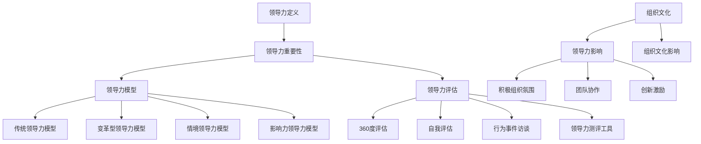

                 

### 文章标题

《领导力与责任担当：勇于承担责任》

### 关键词

- 领导力
- 责任担当
- 职业发展
- 团队协作
- 组织文化
- 成功实践

### 摘要

本文旨在深入探讨领导力与责任担当在现代社会中的重要性，通过逻辑清晰、结构紧凑的分析，阐述两者之间的紧密联系及其在实际工作中的应用。文章首先介绍了领导力的核心概念与理论框架，随后探讨了责任担当的概念与重要性，并通过实际案例展示了领导力与责任担当的综合应用。文章还提出了个人提升领导力和责任担当的具体路径，以期为读者提供有价值的实践指导。

## 第一部分：领导力基础

### 第1章：领导力的核心概念与联系

#### 1.1 领导力的定义

领导力，作为一种复杂的社会现象，其定义多种多样。常见的定义包括：领导力是影响他人实现目标的能力；领导力是通过启发和激励他人，实现共同愿景的实践；领导力是塑造和引导团队、组织或社会的行为和方向的能力。这些定义尽管表述不同，但都强调了领导力在个人成长、团队协作和组织发展中的核心作用。

在技术领域，领导力不仅仅是管理技能的集合，更是技术创新与决策能力的体现。例如，在软件开发团队中，领导者需要不仅能够高效管理团队，还需具备技术创新的视野和决策能力，引领团队在复杂的技术环境中取得突破。

#### 1.2 领导力的重要性

领导力的重要性不可忽视。首先，对于个人职业发展而言，领导力是推动个人成长和职业发展的关键因素。具备卓越领导力的人往往能够在职场中脱颖而出，获得更多的机会和晋升空间。

其次，在团队协作中，领导力是促进团队凝聚力和协作效率的核心力量。一个优秀的领导者能够激发团队成员的潜力，建立高效的工作氛围，推动团队目标的实现。

最后，对于组织发展而言，领导力是确保企业可持续发展的关键。领导者不仅需要制定明确的发展战略，还需具备创新思维和决策能力，以应对复杂多变的市场环境。

#### 1.3 领导力的模型与理论

领导力的理论发展历程中，出现了多种领导力模型。以下是一些主要的领导力模型：

1. **传统领导力模型**：包括权威型、民主型和放任型。权威型领导者强调集中决策和严格控制，民主型领导者注重团队参与和协商决策，而放任型领导者则给予团队成员高度自主权。
   
2. **变革型领导力模型**：强调领导者的变革能力和激励作用，通过激励和鼓舞团队，推动组织变革和创新。

3. **情境领导力模型**：由赫塞和布兰查德提出，强调领导者应根据不同情境采取不同的领导风格，以适应团队和环境的变化。

4. **影响力领导力模型**：强调领导者的个人魅力和影响力，通过价值观的传播和榜样作用，影响团队成员的行为和态度。

这些领导力模型为我们理解不同领导风格和行为提供了理论框架，有助于在实际工作中根据具体情境选择合适的领导策略。

#### 1.4 领导力的评估方法

领导力的评估是衡量领导者能力和表现的重要手段。以下是一些常见的领导力评估方法：

1. **360度评估**：通过上级、同事、下属和客户等多方面的反馈，全面评估领导者的能力。
   
2. **自我评估**：领导者通过自我反思，识别自身的优势和改进点。

3. **行为事件访谈**：通过详细描述领导者在特定情境下的行为和结果，评估其领导能力。

4. **领导力测评工具**：如领导力量表、行为量表等，提供量化评估指标。

这些评估方法有助于领导者识别自身不足，制定改进计划，不断提升领导力。

### 1.5 领导力与组织文化

领导力与组织文化密切相关。一个组织的文化是其核心价值观念和行为规范的集中体现，而领导力则是塑造和传承组织文化的关键因素。

1. **领导力对组织文化的影响**：领导者通过自身行为和决策，传递组织价值观，塑造组织文化。一个优秀的领导者能够建立积极向上的组织氛围，促进团队协作和创新。

2. **组织文化对领导力的影响**：组织文化对领导者的行为和风格产生影响。在一个强调创新和自主性的组织中，领导者可能更倾向于采取放任型领导风格，而在一个强调纪律和规则的组织中，领导者可能更倾向于采取权威型领导风格。

3. **领导力与组织文化互动**：领导力与组织文化相互影响、相互作用，共同推动组织的发展。一个健康的组织文化能够促进领导力的提升，而卓越的领导力则能够巩固和传承组织文化。

### 1.6 领导力的核心概念与联系

为了更好地理解领导力的核心概念与联系，我们使用Mermaid流程图来展示领导力各个方面之间的关系：

通过上述流程图，我们可以清晰地看到领导力的各个核心概念及其相互联系，为后续章节的内容奠定了理论基础。

## 第二部分：责任担当

### 第2章：责任担当的概念与重要性

#### 2.1 责任担当的定义

责任担当是一个涉及道德、伦理和个人成长的重要概念。责任担当不仅仅是对行为的承担，更是一种积极的态度和行为模式。它包括以下几个关键要素：

1. **责任感**：对自己和他人的行为和结果负责，意识到责任的重要性和必要性。
2. **担当**：在面临挑战和困难时，勇于承担责任，主动解决问题，不推诿、不逃避。
3. **行动**：将责任感转化为实际行动，通过具体的行为体现责任担当。

在技术领域，责任担当同样重要。例如，在软件开发过程中，开发者需要对代码质量和系统稳定性负责，确保系统的稳定运行和用户数据的安全。此外，技术开发者还需在项目决策和团队协作中承担责任，确保项目的成功交付。

#### 2.2 责任担当的重要性

责任担当在个人成长、团队协作和组织发展等方面具有重要作用：

1. **个人成长**：责任担当是个人成熟和成长的重要标志。通过承担责任，个人能够培养自律性、决策能力和解决问题的能力，提升自身综合素质。

2. **团队协作**：责任担当是团队协作的基石。一个具有责任担当精神的团队，能够更好地协调和合作，提高工作效率和项目成功率。

3. **组织发展**：责任担当是组织健康发展的关键。一个具有责任担当精神的组织，能够建立积极向上的企业文化，提高员工满意度和企业竞争力。

#### 2.3 责任担当的理论基础

责任担当的理论基础包括伦理学、管理学和社会学等多个领域。以下是一些主要的理论：

1. **伦理责任**：伦理责任是指个体在道德和社会规范下应承担的责任。伦理责任强调个体行为的道德性和正当性，是责任担当的重要伦理基础。

2. **组织责任**：组织责任是指组织在实现自身目标和使命过程中，对社会、环境和利益相关方应承担的责任。组织责任是责任担当在组织层面的体现。

3. **社会交换理论**：社会交换理论认为，个体在社会互动中通过承担责任和提供回报，建立稳定的社会关系。责任担当是社会交换的重要机制。

#### 2.4 责任担当的实践方法

责任担当的实践方法包括以下几个方面：

1. **明确责任边界**：在团队和组织中，明确每个人的职责和责任边界，避免责任模糊和推诿。

2. **建立责任文化**：通过培训和激励机制，培养员工的责任意识，建立积极向上的责任文化。

3. **责任问责机制**：建立责任问责机制，对未履行责任的员工进行问责和惩罚，确保责任担当的落实。

4. **自我反思和改进**：通过自我反思和不断学习，提高责任担当的能力和水平。

#### 2.5 责任担当与领导力的关系

责任担当与领导力密切相关。一个优秀的领导者不仅需要具备领导能力，还需具备责任担当的精神。责任担当是领导力的核心要素之一，它体现在领导者在团队和组织中的行为和决策中。

1. **领导者责任担当的表现**：领导者通过承担责任、勇于面对挑战和解决问题，树立榜样，带动团队共同承担责任。

2. **领导力对责任担当的影响**：领导力可以激发团队成员的责任担当意识，提高团队的整体责任水平。同时，领导力也可以塑造和传承组织文化，推动责任担当在组织中的落实。

3. **责任担当对领导力的影响**：责任担当是领导者能力的重要体现，一个具备责任担当精神的领导者，能够更好地激励和带领团队，实现组织目标。

### 2.6 责任担当与个人成长

责任担当是个人成长的重要驱动力。通过承担责任，个人能够培养自律性、决策能力和解决问题的能力，提升自身综合素质。

1. **自律性**：责任担当要求个体对自己的行为和结果负责，这需要高度自律性。通过承担责任，个人能够培养自律习惯，提高自我管理能力。

2. **决策能力**：责任担当要求个体在面对问题和挑战时，能够做出正确的决策。通过承担责任，个人能够提高决策能力，增强应对复杂问题的能力。

3. **解决问题的能力**：责任担当要求个体在面对问题和挑战时，能够积极解决问题。通过承担责任，个人能够提高解决问题的能力，积累丰富的经验。

4. **综合素质提升**：责任担当不仅能够提升个人的自律性、决策能力和解决问题的能力，还能提高个人的人际交往能力、团队协作能力和领导能力，全面提升个人综合素质。

### 2.7 责任担当与团队协作

责任担当是团队协作的重要基础。一个具有责任担当精神的团队，能够更好地协调和合作，提高工作效率和项目成功率。

1. **明确责任**：在团队中，明确每个人的职责和责任边界，避免责任模糊和推诿。这是责任担当的基础。

2. **共同目标**：责任担当要求团队成员共同为实现团队目标而努力。通过明确责任和共同目标，团队能够形成强大的凝聚力，提高团队协作效率。

3. **相互信任**：责任担当要求团队成员之间建立相互信任的关系。通过承担责任和相互支持，团队能够建立良好的信任基础，提高协作效率。

4. **积极沟通**：责任担当要求团队成员积极沟通，及时解决问题。通过有效的沟通，团队能够避免误解和冲突，提高协作效率。

5. **共同成长**：责任担当不仅能够提高团队协作效率，还能促进团队成员的共同成长。通过承担责任和相互学习，团队成员能够不断提升自身能力，实现共同成长。

### 2.8 责任担当与组织发展

责任担当是组织健康发展的重要保障。一个具有责任担当精神的组织，能够建立积极向上的企业文化，提高员工满意度和企业竞争力。

1. **企业文化**：责任担当是组织文化的重要组成部分。通过建立责任担当的企业文化，组织能够形成良好的氛围，激发员工的积极性和创造力。

2. **员工满意度**：责任担当能够提高员工的满意度和忠诚度。通过明确责任和提供合理的激励机制，组织能够满足员工的需求，提高员工的工作满意度和忠诚度。

3. **企业竞争力**：责任担当能够提高组织的竞争力。通过培养员工的责任意识，组织能够提高工作效率和项目成功率，提高市场竞争力。

4. **可持续发展**：责任担当是组织可持续发展的关键。通过建立责任担当的企业文化，组织能够确保企业的长期稳定发展，实现可持续发展目标。

### 2.9 责任担当的实践案例

以下是一个责任担当在实践中的案例：

在一个软件开发团队中，项目经理A发现项目进度严重滞后，导致客户需求无法按时交付。在了解情况后，A主动承担责任，组织团队成员进行了详细的问题分析，并制定了紧急应对计划。通过团队成员的共同努力，项目最终按时交付，客户满意度提高。这次事件不仅提高了团队成员的责任担当意识，还增强了团队的凝聚力和协作能力。

## 第三部分：领导力与责任担当实践

### 第3章：领导力与责任担当的综合应用

#### 3.1 综合应用原则

在领导力与责任担当的综合应用中，有以下几个关键原则需要遵循：

1. **明确责任**：领导者需要明确团队成员的职责和责任边界，确保每个人都知道自己的任务和责任。

2. **树立榜样**：领导者通过自身的行为和决策，树立责任担当的榜样，激发团队成员的责任意识。

3. **积极沟通**：领导者需要与团队成员保持积极沟通，确保信息的畅通和问题的及时解决。

4. **激励机制**：建立合理的激励机制，鼓励团队成员承担责任和完成任务。

5. **持续改进**：领导者需要不断反思和改进领导方式，提高领导力和责任担当水平。

#### 3.2 综合应用案例

以下是一个综合应用领导力与责任担当的成功案例：

在一个初创公司，CEO李强通过明确责任、树立榜样和积极沟通，成功推动了公司的发展。首先，李强明确了团队成员的职责和责任边界，确保每个员工都清楚自己的任务和责任。接着，他通过自身的努力和决策，树立了责任担当的榜样，激励团队成员积极承担责任。在项目遇到困难时，李强积极沟通，与团队成员一起分析问题、制定解决方案，并确保每个问题都能得到及时解决。通过这些措施，公司项目按时交付，团队凝聚力大幅提升，公司业绩也取得了显著增长。

### 第4章：领导力与责任担当的未来

#### 4.1 未来发展趋势

随着科技的发展和全球化的加速，领导力与责任担当的未来发展趋势呈现出以下几个特点：

1. **数字化领导力**：随着数字化转型的推进，领导者需要具备数字素养和创新能力，能够引领团队在数字时代取得成功。

2. **全球化领导力**：全球化要求领导者具备跨文化沟通能力和国际视野，能够有效管理多元文化团队。

3. **可持续领导力**：可持续发展成为全球共识，领导者需要关注环境保护和社会责任，推动组织的可持续发展。

4. **数据驱动领导力**：数据成为重要的决策依据，领导者需要具备数据分析能力，能够利用数据进行科学决策。

#### 4.2 个人提升路径

为了在未来的领导力和责任担当领域取得成功，个人可以采取以下提升路径：

1. **持续学习**：领导者需要不断学习新知识和技能，以适应快速变化的环境。

2. **实践与反思**：通过实践和反思，总结经验教训，不断提升领导力和责任担当水平。

3. **培养团队合作精神**：建立良好的团队合作氛围，提高团队协作效率和项目成功率。

4. **关注社会责任**：关注环境保护和社会责任，推动组织的可持续发展。

### 第5章：领导力与责任担当的个人提升路径

#### 5.1 自我评估与提升

个人提升领导力和责任担当的第一步是进行自我评估。以下是一些自我评估的方法和工具：

1. **360度评估**：通过上级、同事和下属的反馈，全面了解自己在领导力和责任担当方面的表现。

2. **自我反思**：定期进行自我反思，思考自己在领导力和责任担当方面的优势和不足。

3. **领导力发展计划**：根据自我评估的结果，制定个人领导力发展计划，明确提升目标和实施步骤。

#### 5.2 持续学习与成长

持续学习和成长是提升领导力和责任担当的关键。以下是一些建议：

1. **阅读相关书籍**：阅读领导力和责任担当相关的书籍，了解不同理论和实践方法。

2. **参加培训课程**：参加专业的领导力培训课程，学习先进的领导技巧和管理理念。

3. **实践与反思**：通过实际工作和项目，不断实践和反思，提升领导力和责任担当能力。

#### 5.3 建立积极的人际关系

建立积极的人际关系对于领导力的提升至关重要。以下是一些建议：

1. **倾听与沟通**：倾听他人的意见和建议，建立良好的沟通渠道。

2. **建立信任**：通过诚实和透明的方式，建立与团队成员之间的信任。

3. **培养团队合作精神**：鼓励团队成员相互支持，共同实现团队目标。

### 5.4 领导力与责任担当的最佳实践

在领导力和责任担当方面，以下是一些建议的最佳实践：

1. **明确目标与期望**：明确团队的目标和期望，确保每个成员都清楚自己的职责和责任。

2. **激励与反馈**：建立合理的激励机制，及时给予团队成员反馈，鼓励他们承担责任和完成任务。

3. **建立责任文化**：通过培训和宣传，建立责任文化，鼓励团队成员主动承担责任。

4. **培养领导力**：通过内部培训和实践，培养团队成员的领导力，提高团队的整体领导水平。

### 5.5 小结

领导力和责任担当是现代领导者必备的能力和素质。通过自我评估、持续学习、建立积极人际关系和最佳实践，个人可以不断提升领导力和责任担当水平，为团队和组织的发展做出积极贡献。

## 作者信息

- 作者：AI天才研究院/AI Genius Institute & 禅与计算机程序设计艺术 /Zen And The Art of Computer Programming

## 总结

本文深入探讨了领导力与责任担当在现代社会中的重要性，从核心概念、理论框架到实践方法，全面阐述了两者之间的紧密联系及其在实际工作中的应用。文章强调了领导力和责任担当在个人成长、团队协作和组织发展中的关键作用，并通过案例展示了其综合应用的效果。随着未来科技的发展和全球化的加速，领导力和责任担当将成为领导者必备的能力和素质。通过本文的阅读，读者可以更好地理解领导力和责任担当的核心概念，掌握提升领导力和责任担当的具体方法，为未来的职业发展奠定坚实基础。

